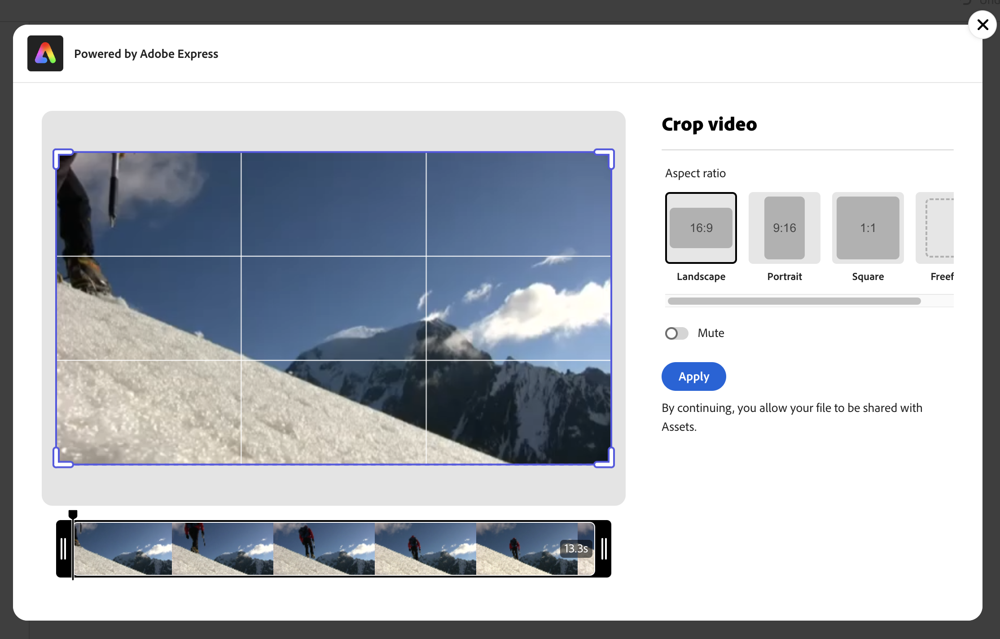

# Modification de vidéos dans [!DNL Assets view] {#edit-videos}

La création de variantes de contenu vidéo est facile pour les utilisateurs d’Assets grâce aux actions rapides de vidéo [!DNL Adobe Express] intégrées. Les actions rapides dans [!DNL Assets view] optimisées par [!DNL Adobe Express] offrent des options de modification vidéo conviviales, notamment le recadrage, le redimensionnement, le rognage et la conversion de la vidéo en GIF.

Pour modifier une vidéo, accédez à ses détails et cliquez sur [!UICONTROL Modifier la vidéo]. Vous pouvez également sélectionner la ressource et cliquer sur les détails, puis sur l’icône  disponible dans le volet de droite. Après avoir modifié une vidéo, vous pouvez enregistrer la nouvelle vidéo en tant que nouvelle version ou nouvelle ressource.

## Prérequis {#prerequisites}

Droits d’accès à [!DNL Adobe Express] et à au moins un environnement dans AEM Assets. L’environnement peut être l’un des référentiels dans [!DNL Assets as a Cloud Service] ou [!DNL Assets view].

## Modifier des vidéos à l’aide d’Adobe Express {#edit-video-using-express}

La transformation d’une vidéo en une taille et une orientation parfaites est facile à l’aide d’actions rapides [!DNL Adobe Express] intégrées.

### Recadrer la vidéo {#crop-video-using-express}

Vous pouvez éliminer les parties indésirables de la vidéo à l’aide d’actions rapides [!DNL Adobe Express] intégrées. Pour ce faire, exécutez les étapes ci-dessous :

1. Sélectionnez une vidéo et cliquez sur **[!UICONTROL Modifier]**.
2. Cliquez sur **[!UICONTROL Recadrer la vidéo]** dans les actions rapides disponibles dans le volet de gauche.
3. Faites glisser les poignées dans les coins de la vidéo pour créer le recadrage souhaité ou choisissez parmi les tailles d’écran existantes selon vos besoins.
4. Vous pouvez choisir de couper ou d’activer le son de la vidéo.
5. Cliquez sur **[!UICONTROL Appliquer]**.
   

   La vidéo recadrée peut être téléchargée. Vous pouvez enregistrer la ressource modifiée en tant que nouvelle version de la même ressource ou l’enregistrer en tant que nouvelle ressource. 

### Redimensionnement de la vidéo {#resize-video-using-express}

Le contenu vidéo final dans la gestion des ressources numériques doit souvent être redimensionné pour être distribué à des canaux spécifiques. [!DNL Assets view] vous permet de redimensionner facilement la vidéo pour l’adapter aux dimensions requises par les canaux sociaux courants. Vous pouvez également la redimensionner pour des résolutions personnalisées. Pour redimensionner la vidéo à l’aide de [!DNL Assets view], procédez comme suit :

1. Sélectionnez une vidéo et cliquez sur **[!UICONTROL Modifier]**.
2. Cliquez sur **[!UICONTROL Redimensionner la vidéo]** dans les actions rapides disponibles dans le volet de gauche.
3. Sélectionnez les dimensions appropriées dans la plateforme de médias sociaux sous la liste déroulante **[!UICONTROL Redimensionner pour]**. Vous pouvez également faire glisser les poignées dans les coins de la vidéo pour créer le recadrage souhaité.
4. Mettez la vidéo à l’échelle, si nécessaire, à l’aide du champ **[!UICONTROL Échelle de la vidéo]**.
5. Vous pouvez choisir de couper ou d’activer le son de la vidéo.
6. Cliquez sur **[!UICONTROL Appliquer]** pour appliquer vos modifications.
   

Votre vidéo redimensionnée peut être téléchargée. Vous pouvez enregistrer la ressource modifiée en tant que nouvelle version de la même ressource ou l’enregistrer en tant que nouvelle ressource.

### Rogner la vidéo {#trim-video-using-express}

Si vous devez utiliser un élément d’une vidéo plus grande, vous pouvez utiliser la fonction **[!UICONTROL Rogner la vidéo]** pour sélectionner et rogner une section de la vidéo. Procédez comme suit :

1. Sélectionnez une vidéo et cliquez sur **[!UICONTROL Modifier]**.
2. Cliquez sur **[!UICONTROL Rogner la vidéo]** dans les actions rapides disponibles dans le volet de gauche.
3. Spécifiez les heures de début et de fin de la vidéo pour rogner une partie particulière de celle-ci. Vous pouvez également faire glisser les poignées dans les coins de la vidéo pour créer l’ajustement souhaité.
4. Sélectionnez les dimensions appropriées dans la liste déroulante **[!UICONTROL Taille]**.
5. Vous pouvez choisir de couper ou d’activer le son de la vidéo.
6. Cliquez sur **[!UICONTROL Appliquer]** pour appliquer vos modifications.
   

Votre vidéo découpée peut être téléchargée. Vous pouvez enregistrer la ressource modifiée en tant que nouvelle version de la même ressource ou l’enregistrer en tant que nouvelle ressource.

### Convertir la vidéo en GIF {#convert-mp4-to-gif-using-express}

Vous pouvez rapidement convertir une vidéo MP4 au format GIF à l’aide d’Adobe Express. Procédez comme suit :

1. Sélectionnez une vidéo et cliquez sur **[!UICONTROL Modifier]**.
2. Cliquez sur **[!UICONTROL Convertir en GIF]** dans les actions rapides disponibles dans le volet de gauche.
3. Sélectionnez la taille de fichier appropriée en fonction de la qualité souhaitée. De plus, choisissez l’orientation paysage, portrait ou carré.
4. Faites glisser les poignées dans les coins de la vidéo pour créer le recadrage souhaité.
5. Cliquez sur **[!UICONTROL Appliquer]**.

   

Votre vidéo peut être téléchargée au format GIF. Vous pouvez enregistrer la ressource modifiée en tant que nouvelle version de la même ressource ou l’enregistrer en tant que nouvelle ressource.

## Limites {#limitations-video-adobe-express}

* Seules les vidéos au format MP4 sont prises en charge pour la modification.

* La taille maximale du fichier source pris en charge est de 1 Go.

* Les vidéos prises en charge font plus de 46 pixels et moins de 3 840 pixels de chaque côté.

* Les navigateurs web pris en charge sont Google Chrome, Firefox, Safari et Edge.

* Cette fonctionnalité ne peut pas être ouverte en mode navigation privée dans un navigateur web.

### Étapes suivantes {#next-steps}

* Faites des commentaires sur le produit en utilisant l’option [!UICONTROL  Commentaires ] disponible dans l’interface utilisateur de l’affichage d’Assets.

* Faites des commentaires sur la documentation en utilisant l’option [!UICONTROL Modifier cette page]  ou [!UICONTROL Enregistrer un problème]  disponible dans la barre latérale droite.

* Contactez l’[assistance clientèle](https://experienceleague.adobe.com/fr?support-solution=General#support).

>[!MORELIKETHIS]
>
>* [Modification d’images dans la vue Assets](edit-images-assets-view.md)
>* [Aperçu d’une ressource](navigate-assets-view.md)
