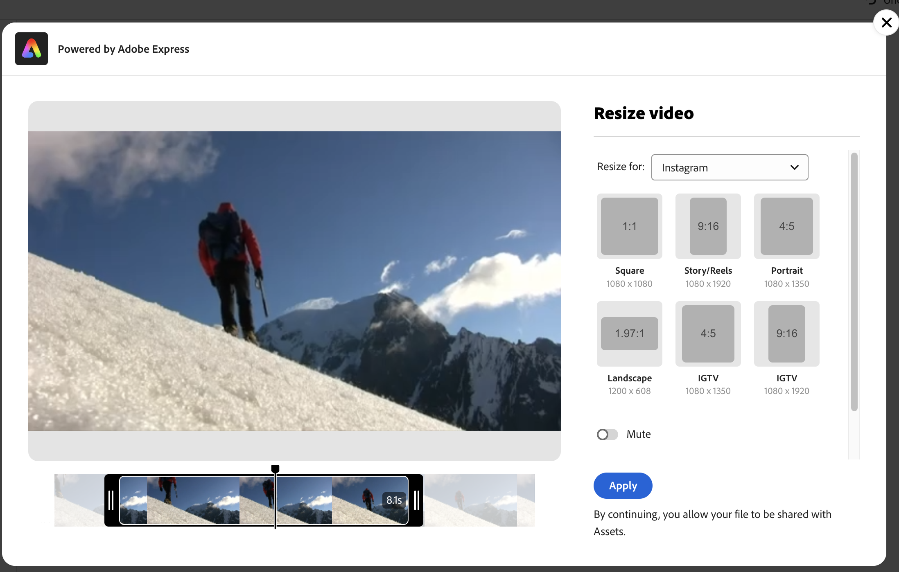
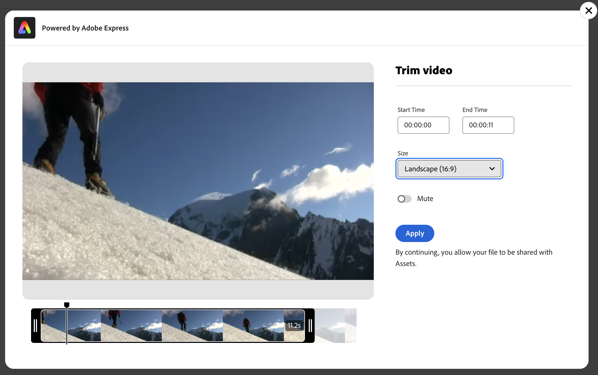
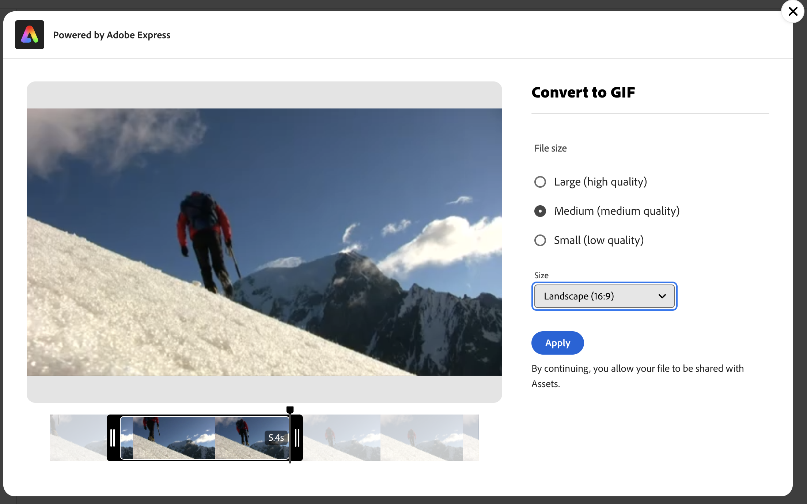

# Modifier des vidéos dans [!DNL Assets view] {#edit-videos}

La création de variantes de contenu vidéo est facile pour les utilisateurs et utilisatrices d’Assets grâce aux actions rapides intégrées pour les vidéos d’[!DNL Adobe Express]. Les actions rapides dans [!DNL Assets view] fournies par [!DNL Adobe Express] offrent des options d’édition vidéo faciles à utiliser, notamment le recadrage, le redimensionnement, le rognage et la conversion de vidéos en GIF.

Pour modifier une vidéo, accédez à ses détails et cliquez sur [!UICONTROL Modifier la vidéo]. Vous pouvez également sélectionner la ressource et cliquer sur les détails, puis sur l’icône de  située dans le volet de droite. Après avoir modifié une vidéo, vous pouvez enregistrer la nouvelle vidéo en tant que nouvelle version ou nouvelle ressource.

## Conditions préalables {#prerequisites}

Des droits d’accès à [!DNL Adobe Express] sont requis, ainsi qu’au moins un environnement dans AEM Assets. L’environnement peut être l’un des référentiels dans [!DNL Assets as a Cloud Service] ou [!DNL Assets view].

## Modifier des vidéos à l’aide d’Adobe Express {#edit-video-using-express}

Modifier une vidéo pour obtenir une taille et une orientation parfaites est facile à réaliser grâce aux actions rapides intégrées d’[!DNL Adobe Express].

### Recadrer une vidéo {#crop-video-using-express}

Vous pouvez éliminer les parties indésirables de la vidéo à l’aide des actions rapides intégrées d’[!DNL Adobe Express]. Pour ce faire, effectuez les étapes suivantes :

1. Sélectionnez une vidéo, puis cliquez sur **[!UICONTROL Modifier]**.
2. Cliquez sur **[!UICONTROL Recadrer la vidéo]** dans les actions rapides situées dans le volet de gauche.
3. Faites glisser les poignées situées sur les coins de la vidéo pour ajuster le recadrage, ou choisissez parmi les tailles déjà existantes.
4. Vous pouvez choisir de couper ou d’activer le son de la vidéo.
5. Cliquez sur **[!UICONTROL Appliquer]**.
   

   La vidéo recadrée peut être téléchargée. Vous pouvez enregistrer la ressource modifiée en tant que nouvelle version de la même ressource ou l’enregistrer en tant que nouvelle ressource. 

### Redimensionner une vidéo {#resize-video-using-express}

Le contenu vidéo final dans le système de gestion des ressources numériques doit souvent être redimensionné pour être diffusé vers des canaux spécifiques. [!DNL Assets view] vous permet de redimensionner facilement les vidéos pour les adapter aux dimensions requises par les canaux de réseaux sociaux courants. Vous pouvez également les redimensionner avec des résolutions personnalisées. Pour redimensionner une vidéo à l’aide d’[!DNL Assets view], procédez comme suit :

1. Sélectionnez une vidéo, puis cliquez sur **[!UICONTROL Modifier]**.
2. Cliquez sur **[!UICONTROL Redimensionner la vidéo]** dans les actions rapides situées dans le volet de gauche.
3. Sélectionnez les dimensions appropriées pour la plateforme de réseau social correspondante dans la liste déroulante **[!UICONTROL Redimensionner pour]**. Vous pouvez aussi faire glisser les poignées situées sur les coins de la vidéo pour créer le recadrage souhaité.
4. Mettez la vidéo à l’échelle, le cas échéant, à l’aide du champ **[!UICONTROL Échelle de la vidéo]**.
5. Vous pouvez choisir de couper ou d’activer le son de la vidéo.
6. Cliquez sur **[!UICONTROL Appliquer]** pour appliquer vos modifications.
   

Votre vidéo redimensionnée peut être téléchargée. Vous pouvez enregistrer la ressource modifiée en tant que nouvelle version de la même ressource ou l’enregistrer en tant que nouvelle ressource.

### Couper une vidéo {#trim-video-using-express}

Si vous devez utiliser un élément d’une vidéo plus grande, vous pouvez utiliser la fonction **[!UICONTROL Rogner la vidéo]** pour sélectionner et rogner une section de la vidéo. Procédez comme suit :

1. Sélectionnez une vidéo, puis cliquez sur **[!UICONTROL Modifier]**.
2. Cliquez sur **[!UICONTROL Rogner la vidéo]** dans les actions rapides disponibles du volet de gauche.
3. Spécifiez les heures de début et de fin de la vidéo pour rogner une partie particulière de celle-ci. Vous pouvez aussi faire glisser les poignées sur les coins de la vidéo pour créer le rognage souhaité.
4. Sélectionnez les dimensions appropriées dans la liste déroulante **[!UICONTROL Taille]**.
5. Vous pouvez choisir de couper ou d’activer le son de la vidéo.
6. Cliquez sur **[!UICONTROL Appliquer]** pour appliquer vos modifications.
   

Votre vidéo découpée peut être téléchargée. Vous pouvez enregistrer la ressource modifiée en tant que nouvelle version de la même ressource ou l’enregistrer en tant que nouvelle ressource.

### Convertir la vidéo en GIF {#convert-mp4-to-gif-using-express}

Vous pouvez rapidement convertir une vidéo MP4 au format GIF à l’aide d’Adobe Express. Procédez comme suit :

1. Sélectionnez une vidéo, puis cliquez sur **[!UICONTROL Modifier]**.
2. Cliquez sur l’option **[!UICONTROL Convertir en GIF]** disponible dans le volet de gauche.
3. Sélectionnez la taille de fichier appropriée en fonction de la qualité souhaitée. De plus, choisissez l’orientation paysage, portrait ou carré.
4. Faites glisser les poignées sur les coins de la vidéo pour créer le recadrage souhaité.
5. Cliquez sur **[!UICONTROL Appliquer]**.

   

Votre vidéo peut être téléchargée au format GIF. Vous pouvez enregistrer la ressource modifiée en tant que nouvelle version de la même ressource ou l’enregistrer en tant que nouvelle ressource.

## Limites {#limitations-video-adobe-express}

* Seules les vidéos au format MP4 sont prises en charge pour la modification.

* La taille maximale du fichier source pris en charge est de 1 Go.

* Les vidéos prises en charge font plus de 46 pixels et moins de 3 840 pixels de chaque côté.

* Les navigateurs web pris en charge sont Google Chrome, Firefox, Safari et Edge.

* Cette fonctionnalité ne peut pas être ouverte en mode navigation privée dans un navigateur web.

### Étapes suivantes {#next-steps}

* Faites des commentaires sur le produit en utilisant l’option [!UICONTROL &#x200B; Commentaires &#x200B;] disponible dans l’interface utilisateur de l’affichage d’Assets.

* Faites des commentaires sur la documentation en utilisant l’option [!UICONTROL Modifier cette page]  ou [!UICONTROL Enregistrer un problème]  disponible dans la barre latérale droite.

* Contactez l’[assistance clientèle](https://experienceleague.adobe.com/fr?support-solution=General#support).

>[!MORELIKETHIS]
>
>* [Modification d’images dans la vue Assets](edit-images-assets-view.md)
>* [Aperçu d’une ressource](navigate-assets-view.md)

**Voir également**

* [Traduire les ressources](/help/assets/translate-assets.md)
* [API HTTP Assets](/help/assets/mac-api-assets.md)
* [Formats de fichiers pris en charge par Assets](/help/assets/file-format-support.md)
* [Rechercher des ressources](/help/assets/search-assets.md)
* [Ressources connectées](/help/assets/use-assets-across-connected-assets-instances.md)
* [Rapports de ressources](/help/assets/asset-reports.md)
* [Schémas de métadonnées](/help/assets/metadata-schemas.md)
* [Télécharger des ressources](/help/assets/download-assets-from-aem.md)
* [Gestion des métadonnées](/help/assets/manage-metadata.md)
* [Gérer les modèles Dynamic Media](/help/assets/dynamic-media/manage-dynamic-media-templates.md)
* [Gérer les rapports](/help/assets/manage-reports-assets-view.md)
* [Facettes de recherche](/help/assets/search-facets.md)
* [Gérer les collections](/help/assets/manage-collections.md)
* [Import des métadonnées en bloc](/help/assets/metadata-import-export.md)
* [Publier des ressources sur AEM et Dynamic Media](/help/assets/publish-assets-to-aem-and-dm.md)
