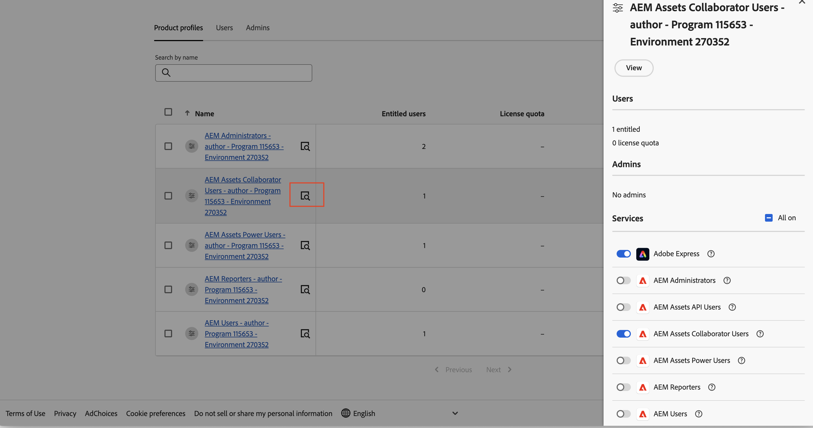
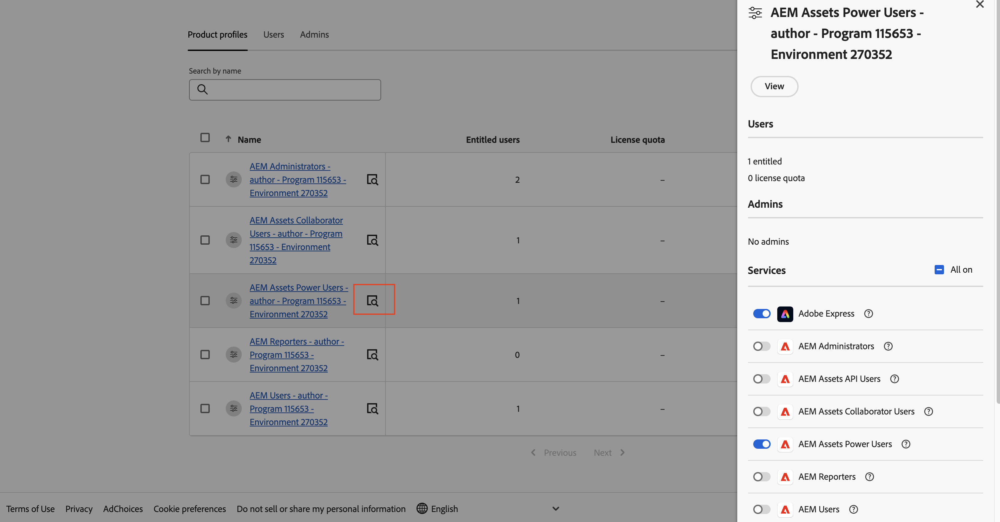

# Activer [!DNL Assets] as a Cloud Service Ultimate {#enable-assets-cloud-service-ultimate}

Assets as a Cloud Service Ultimate vous permet d’exécuter diverses fonctionnalités essentielles de gestion des ressources numériques, telles que la gestion des ressources et des services de bibliothèque, la sécurité et la gestion des droits, les connexions Creative et Experience Cloud, l’extensibilité de l’interface utilisateur, l’automatisation pilotée par les API, les intégrations avec des applications Adobe et non Adobe, le déploiement de code personnalisé, etc. Consultez [Présentation d’Assets as a Cloud Service Ultimate](/help/assets/assets-ultimate-overview.md) pour obtenir la liste complète.

## Activer Assets Ultimate {#enable-assets-ultimate}

Les nouveaux clients Assets as a Cloud Service doivent d’abord activer Assets Ultimate en créant un nouveau programme à l’aide de Cloud Manager.

Procédez comme suit :

1. Connectez-vous à Cloud Manager en tant qu’administrateur système. Veillez à sélectionner la bonne organisation lors de la connexion.

   >[!NOTE]
   >
   >Assurez-vous d’être ajouté au profil de produit Cloud Manager approprié pour ajouter un nouveau programme. Pour plus d’informations, voir [Autorisations basées sur les rôles dans Cloud Manager](/help/onboarding/cloud-manager-introduction.md#role-based-permissions).

1. [Créez un nouveau programme](/help/journey-onboarding/create-program.md) et [ajoutez-y des environnements](/help/journey-onboarding//create-environments.md).

   Lors de la création du programme, dans l’onglet **[!UICONTROL Solutions et modules complémentaires]**, sélectionnez **[!UICONTROL Assets Ultimate]**. Vous pouvez également développer **[!UICONTROL Assets Ultimate]** et sélectionner **[!UICONTROL Content Hub]** pour activer [Content Hub](/help/assets/product-overview.md) pour la distribution de ressources.

   

1. Cliquez sur **[!UICONTROL Créer]** pour créer le programme. Assets Ultimate est désormais activé pour Experience Manager Assets as a Cloud Service.

L’administrateur système est automatiquement autorisé en tant qu’administrateur AEM sur Assets Ultimate et reçoit un courrier électronique lui permettant d’accéder à Admin Console pour gérer les profils de produit disponibles.

Votre instance AEM as a Cloud Service sur Admin Console comprend les profils de produit suivants :

* Administrateurs et administratrices AEM

* Utilisateurs et utilisatrices AEM

* [Utilisateurs collaborateurs et utilisatrices collaboratrices AEM Assets](#onboard-collaborator-users)

* [Utilisateurs et utilisatrices experts AEM Assets](#onboard-power-users)

  

Si vous avez activé Content Hub pour Assets as a Cloud Service, une nouvelle instance est créée dans AEM Assets as a Cloud Service sur Admin Console avec `delivery` comme suffixe :

>[!NOTE]
>
>Si vous avez configuré Content Hub avant le 14 août 2024, la nouvelle instance est créée avec `contenthub` comme suffixe.

Notez qu’il n’y a aucun `author` ni `publish` dans le nom de l’instance pour Content Hub.

Cliquez sur le nom de l’instance pour afficher le profil de produit Content Hub `AEM Assets Limited Users`.

Vous pouvez commencer à ajouter des utilisateurs ou des groupes d’utilisateurs à ce profil de produit pour leur fournir l’accès à Content Hub.

>[!NOTE]
>
>Si vous avez configuré Content Hub avant le 14 août 2024, le profil de produit Content Hub a `contenthub` mentionné après `Limited Users` au lieu de `delivery`.

## Activer Assets Ultimate pour les clients existants {#enable-assets-ultimate-existing-customers}

Les clients Assets as a Cloud Service existants peuvent effectuer la mise à niveau vers Assets Ultimate en suivant deux étapes simples. Vous pouvez accéder au programme Assets as a Cloud Service dans Cloud Manager et voir le statut de mise à niveau sur la carte Programme en fonction de la disponibilité des crédits Assets Ultimate. S’il y a suffisamment de crédits disponibles pour la mise à niveau vers Assets Ultimate, vous pouvez voir le statut comme `Assets license upgrade required`, comme illustré dans l’image suivante :

Si un client existant achète une nouvelle licence pour Assets Ultimate, le statut de mise à niveau s’affiche comme `Assets license upgrade available`.

### Conditions préalables à la mise à niveau {#prerequisites-assets-upgrade}

Tous les environnements doivent être mis à niveau vers la dernière version d’AEM as a Cloud Service ou au moins vers la version `2024.10.18175`. Si vous ne répondez pas à la configuration minimale requise, contactez votre représentant Adobe pour passer à la version d’AEM requise.

### Mettre à niveau vers Assets Ultimate {#upgrade-assets-ultimate}

Procédez comme suit :

1. Après avoir basculé vers la configuration minimale requise pour la version AEM, cliquez sur le nom du programme. Une carte Mise à niveau s’affiche juste au-dessus de la section **[!UICONTROL Environnements]**, comme illustré dans l’image suivante :

   

1. Cliquez sur **[!UICONTROL Ajouter des profils de produit]**. Cloud Manager affiche des options permettant d’ajouter de nouveaux profils de produit à tous les environnements disponibles dans le programme ou dans des environnements individuels.

   

1. Cliquez sur **[!UICONTROL Tous les environnements]** pour ajouter les nouveaux profils de produit à tous les environnements du programme ou **[!UICONTROL Environnements individuels]** pour ajouter les nouveaux profils de produit à des environnements sélectionnés.

   Cliquez sur **[!UICONTROL Environnements individuels]** pour afficher la liste de tous les environnements disponibles dans le programme.

1. Cliquez sur l’icône Plus d’options correspondant à un environnement et sélectionnez **[!UICONTROL Ajouter des profils de produit]** pour ajouter les nouveaux profils de produit à l’environnement sélectionné.

   

   Vous pouvez également ajouter des profils de produit à des environnements sélectionnés en accédant à la section **[!UICONTROL Environnements]**, en cliquant sur l’icône Plus d’options correspondant à un environnement et en sélectionnant **[!UICONTROL Ajouter des profils de produit]**.

   Le statut de l’environnement s’affiche `Adding Product Profiles` pendant l’ajout des nouveaux profils de produit, puis s’affiche `Running` lorsque le processus est terminé.

   Vous devez ajouter des profils de produit à tous les environnements disponibles dans le programme, individuellement ou à tous les environnements ensemble, avant d’exécuter l’étape suivante.

1. Cliquez sur **[!UICONTROL Mettre à niveau]**. L’option **[!UICONTROL Mettre à niveau]** s’affiche uniquement lorsque vous ajoutez des profils de produit à tous les environnements disponibles.

   

   Le processus de mise à niveau est terminé et vous avez correctement mis à niveau votre as a Cloud Service Assets vers Assets Ultimate. Le statut du programme affiche `Assets Ultimate`.

   

Votre instance AEM as a Cloud Service sur Admin Console comprend maintenant les profils de produit suivants :

* Administrateurs et administratrices AEM

* Utilisateurs et utilisatrices AEM

* [Utilisateurs collaborateurs et utilisatrices collaboratrices AEM Assets](#onboard-collaborator-users)

* [Utilisateurs et utilisatrices experts AEM Assets](#onboard-power-users)

Si Content Hub doit être activé, cliquez sur Autres options (...) sur le nom du programme dans Cloud Manager et sélectionnez **[!UICONTROL Modifier le programme]**. Développez **[!UICONTROL Assets Ultimate]** puis cliquez sur **[!UICONTROL Content Hub]**. Cette étape active Content Hub pour Assets Ultimate. Une nouvelle instance a été créée dans AEM Assets as a Cloud Service sur Admin Console avec `delivery` comme suffixe :

>[!NOTE]
>
>Si vous avez configuré Content Hub avant le 14 août 2024, la nouvelle instance est créée avec `contenthub` comme suffixe.

Notez qu’il n’y a aucun `author` ni `publish` dans le nom de l’instance pour Content Hub.

Cliquez sur le nom de l’instance pour afficher le profil de produit Content Hub `AEM Assets Limited Users`.

Vous pouvez commencer à ajouter des utilisateurs ou des groupes d’utilisateurs à ce profil de produit pour leur fournir l’accès à Content Hub.

>[!NOTE]
>
>Si vous avez configuré Content Hub avant le 14 août 2024, le profil de produit Content Hub a `contenthub` mentionné après `Limited Users` au lieu de `delivery`.

## Intégration d’utilisateurs AEM Assets Collaborator {#onboard-collaborator-users}

Les utilisateurs d’AEM Assets Collaborator peuvent travailler avec des ressources d’Experience Manager par le biais d’intégrations d’Assets disponibles pour votre organisation dans d’autres produits Adobe et applications non Adobe, créer et modifier des ressources à l’aide d’Adobe Express et de Firefly intégrés, en utilisant des modèles conçus par des professionnels, des kits de marque, des ressources Adobe Stock, etc., et accéder aux ressources approuvées de votre organisation et les exploiter à l’aide du portail AEM Assets Content Hub.

Pour intégrer des utilisateurs collaborateurs :

1. Accédez aux profils de produit Experience Manager Assets en cliquant sur le nom du produit AEM as a Cloud Service dans la liste des produits sur Admin Console.

1. Cliquez sur l’instance d’auteur d’exploitation pour AEM as a Cloud Service :
   

1. Cliquez sur le profil de produit Utilisateurs Collaborateurs et cliquez sur **[!UICONTROL Ajouter des utilisateurs]** pour ajouter des utilisateurs ou des groupes d’utilisateurs au profil de produit.
   

1. Cliquez sur **[!UICONTROL Enregistrer]** pour enregistrer les modifications.

Vous pouvez également accéder aux services affectés aux utilisateurs de l&#39;espace de collaboration et les afficher, comme illustré dans l&#39;image suivante :

Les services `Adobe Express` et `AEM Assets Collaborator Users` sont activés par défaut.

>[!NOTE]
>
>Vous pouvez activer et désactiver le bouton (bascule) pour activer ou désactiver les services disponibles, en fonction de vos besoins, mais Adobe recommande d’utiliser les services par défaut activés pour les profils de produit.

## Intégration d’AEM Assets Power users {#onboard-power-users}

Les utilisateurs expérimentés d’AEM Assets peuvent accéder à toutes les fonctionnalités d’AEM Assets, notamment la gestion des ressources, les autorisations, les métadonnées, la gouvernance globale et l’automatisation autour des ressources numériques, travailler avec des ressources d’Experience Manager par le biais d’intégrations d’Assets disponibles pour votre entreprise dans d’autres applications Adobe et non Adobe, créer et modifier des ressources à l’aide d’Adobe Express et de Firefly intégrés à l’aide de modèles conçus par des professionnels, de kits de marque, de ressources Adobe Stock, etc., et accéder aux ressources approuvées de votre entreprise et les exploiter à l’aide du portail AEM Assets.

Pour intégrer des utilisateurs expérimentés :

1. Accédez aux profils de produit Experience Manager Assets en cliquant sur le nom du produit AEM as a Cloud Service dans la liste des produits sur Admin Console.

1. Cliquez sur l’instance d’auteur d’exploitation pour AEM as a Cloud Service :
   

1. Cliquez sur le profil de produit Utilisateurs avec pouvoir et cliquez sur **[!UICONTROL Ajouter des utilisateurs]** pour ajouter des utilisateurs ou des groupes d’utilisateurs au profil de produit.
   

1. Cliquez sur **[!UICONTROL Enregistrer]** pour enregistrer les modifications.

Vous pouvez également accéder aux services affectés aux utilisateurs expérimentés et les afficher, comme illustré dans l’image suivante :

Les services `Adobe Express` et `AEM Assets Power Users` sont activés par défaut.

>[!NOTE]
>
>Vous pouvez activer et désactiver le bouton (bascule) pour activer ou désactiver les services disponibles, en fonction de vos besoins, mais Adobe recommande d’utiliser les services par défaut activés pour les profils de produit.

## Questions fréquentes {#frequently-asked-questions-enable-assets-ultimate}

### Comment les nouveaux clients activent-ils AEM Assets Ultimate ? {#enable-assets-ultimate-new-customers}

Les nouveaux clients AEM Assets as a Cloud Service activent Assets Ultimate en créant un nouveau programme dans Cloud Manager. Connectez-vous à Cloud Manager en tant qu’administrateur système, créez un programme, puis dans l’onglet Solutions et modules complémentaires , sélectionnez Assets Ultimate. Vous pouvez éventuellement développer Assets Ultimate et sélectionner Content Hub pour activer la distribution des ressources. Cliquez sur Créer pour terminer la configuration du programme. Assets Ultimate est alors activé pour l’instance AEM Assets as a Cloud Service et l’administrateur système reçoit un courrier électronique lui demandant de gérer les profils de produit dans Admin Console.

### Content Hub peut-il être activé en même temps qu’AEM Assets Ultimate pour les nouveaux clients ? {#enable-content-hub-new-customers}

Content Hub peut être activé lors de la configuration initiale du programme Assets Ultimate dans Cloud Manager. Lors de la création du programme, sélectionnez Assets Ultimate dans l’onglet Solutions et modules complémentaires , développez l’option Assets Ultimate , puis sélectionnez Content Hub. La création du programme permet d’activer Assets Ultimate et Content Hub simultanément. Une nouvelle instance avec un suffixe de diffusion est créée dans Admin Console. Elle contient le profil de produit Content Hub AEM Assets Limited Users qui permet d’accorder aux utilisateurs l’accès à Content Hub.

### Quels profils de produit sont disponibles dans Admin Console après l’activation d’AEM Assets Ultimate ? {#product-profiles-assets-ultimate}

Après l’activation d’AEM Assets Ultimate, l’instance AEM as a Cloud Service dans Adobe Admin Console comprend quatre profils de produit : Administrateurs AEM, Utilisateurs AEM, Utilisateurs de l’espace de travail collaborateur AEM Assets et Utilisateurs avancés AEM Assets. Si Content Hub est également activé, une instance de diffusion distincte est créée dans Admin Console, contenant le profil de produit Utilisateurs limités AEM Assets. Les utilisateurs et les groupes d’utilisateurs sont ajoutés à chaque profil de produit pour accorder le niveau d’accès correspondant dans AEM Assets Ultimate.

### Quelles sont les conditions préalables requises pour que les clients existants effectuent une mise à niveau vers AEM Assets Ultimate ? {#upgrade-assets-ultimate-prerequisites}

Les clients AEM Assets as a Cloud Service existants doivent s’assurer que tous les environnements exécutent la dernière version d’AEM as a Cloud Service ou au moins la version 2024.10.18175 avant de procéder à la mise à niveau vers Assets Ultimate. Si les exigences relatives à la version minimale ne sont pas satisfaites, contactez le représentant Adobe pour passer à la version d’AEM requise avant de poursuivre la mise à niveau.

### Comment les clients existants vérifient-ils s’ils sont éligibles à la mise à niveau vers AEM Assets Ultimate ? {#check-upgrade-eligibility-assets-ultimate}

Les clients AEM Assets as a Cloud Service existants peuvent vérifier l’éligibilité de la mise à niveau en accédant au programme Assets as a Cloud Service dans Cloud Manager et en affichant le statut sur la carte Programme . Si un nombre suffisant de crédits Assets Ultimate est disponible, le statut indique que la mise à niveau de la licence Assets est requise. Si une nouvelle licence pour Assets Ultimate a été achetée, le statut s’affiche comme Mise à niveau de licence Assets disponible. Les deux statuts indiquent que le chemin de mise à niveau est disponible pour le programme.

### Comment les clients existants effectuent-ils la mise à niveau vers AEM Assets Ultimate ? {#upgrade-steps-assets-ultimate}

Une fois que vous avez satisfait aux exigences minimales de version d’AEM, cliquez sur le nom du programme dans Cloud Manager pour afficher la carte Mise à niveau au-dessus de la section Environnements . Cliquez sur Ajouter des profils de produit et choisissez d’ajouter de nouveaux profils de produit à tous les environnements ou à des environnements individuels. Les profils de produit doivent être ajoutés à tous les environnements disponibles avant de continuer. Une fois que tous les environnements affichent un statut En cours d’exécution, cliquez sur Mettre à niveau pour terminer le processus. Le statut du programme est mis à jour vers Assets Ultimate, confirmant que la mise à niveau est terminée.

### Comment activer Content Hub après la mise à niveau d’un programme existant vers AEM Assets Ultimate ? {#enable-content-hub-existing-customers}

Après la mise à niveau d’un programme existant vers AEM Assets Ultimate dans Cloud Manager, cliquez sur l’icône Plus d’options sur le nom du programme et sélectionnez Modifier le programme. Développez Assets Ultimate et cliquez sur Content Hub pour l’activer. Une nouvelle instance de diffusion est créée dans Adobe Admin Console, contenant le profil de produit Content Hub AEM Assets Limited Users . Les utilisateurs et les groupes d’utilisateurs peuvent ensuite être ajoutés à ce profil de produit pour permettre l’accès au portail Content Hub.

### Comment intégrer des utilisateurs collaborateurs dans AEM Assets Ultimate ? {#onboard-collaborator-users-aem-assets}

Pour intégrer des utilisateurs collaborateurs dans AEM Assets Ultimate, accédez à Adobe Admin Console et cliquez sur le nom du produit AEM as a Cloud Service dans la liste des produits. Cliquez sur l’instance d’auteur de production, sélectionnez le profil de produit Utilisateurs de l’espace de travail AEM Assets, puis cliquez sur Ajouter des utilisateurs pour ajouter des utilisateurs ou des groupes d’utilisateurs. Cliquez sur Enregistrer pour appliquer les modifications. Les services Adobe Express et Utilisateurs collaborateurs AEM Assets sont activés par défaut pour ce profil de produit et peuvent être activés ou désactivés selon les besoins. Adobe recommande de conserver la configuration de service par défaut.

### Quels services sont activés par défaut pour les utilisateurs d’AEM Assets Collaborator ? {#collaborator-user-default-services}

Deux services sont activés par défaut pour le profil de produit Utilisateurs d’AEM Assets Collaborator dans Adobe Admin Console : Utilisateurs d’Adobe Express et d’AEM Assets Collaborator. Ces services permettent aux utilisateurs collaborateurs d’accéder à la création et à la modification de ressources à l’aide d’Adobe Express et de Firefly, aux intégrations à des applications Adobe et non Adobe, ainsi qu’à un accès approuvé aux ressources via le portail AEM Assets Content Hub. Les services individuels peuvent être activés ou désactivés dans Admin Console, bien qu’Adobe recommande d’utiliser la configuration par défaut.

### Comment intégrer des utilisateurs expérimentés dans AEM Assets Ultimate ? {#onboard-power-users-aem-assets}

Pour intégrer des utilisateurs avec pouvoir dans AEM Assets Ultimate, accédez à Adobe Admin Console et cliquez sur le nom du produit AEM as a Cloud Service dans la liste des produits. Cliquez sur l’instance d’auteur de production, sélectionnez le profil de produit Utilisateurs avec pouvoir AEM Assets, puis cliquez sur Ajouter des utilisateurs pour ajouter des utilisateurs ou des groupes d’utilisateurs. Cliquez sur Enregistrer pour appliquer les modifications. Les services Adobe Express et AEM Assets pour utilisateurs expérimentés sont activés par défaut pour ce profil de produit et peuvent être activés ou désactivés. Adobe recommande de conserver la configuration de service par défaut.

### Quels services sont activés par défaut pour les utilisateurs expérimentés d’AEM Assets ? {#power-user-default-services}

Deux services sont activés par défaut pour le profil de produit Utilisateurs avec pouvoir AEM Assets dans Adobe Admin Console : Adobe Express et Utilisateurs avec pouvoir AEM Assets. Ces services offrent aux utilisateurs expérimentés un accès complet aux fonctionnalités de gestion des ressources numériques d’AEM Assets, notamment la gestion des ressources, la gouvernance des métadonnées, les autorisations et l’automatisation, ainsi que la création de contenu optimisé par Adobe Express et Firefly, les intégrations à des applications Adobe et non Adobe et l’accès au portail AEM Assets Content Hub. Les services individuels peuvent être activés ou désactivés dans Admin Console, bien qu’Adobe recommande d’utiliser la configuration par défaut.

### Quelle est la différence entre le suffixe delivery et contenthub dans l’instance Content Hub Admin Console ? {#content-hub-suffix-difference}

Le suffixe de l’instance Content Hub dans Adobe Admin Console dépend de la date à laquelle Content Hub a été configuré. Les clients qui ont configuré Content Hub après le 14 août 2024 disposent d’une instance avec un suffixe de diffusion. Les clients qui ont configuré Content Hub avant le 14 août 2024 disposent d’une instance avec un suffixe contenthub. Dans le cas d’approvisionnement précédent, le profil de produit Content Hub affichait également contenthub après Utilisateurs limités au lieu de la diffusion. Les deux configurations fournissent le même profil de produit AEM Assets Limited Users pour l’octroi de l’accès à Content Hub.
