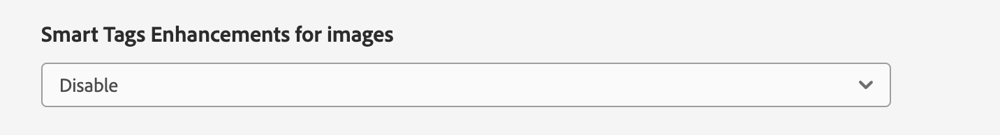

# Amélioration de la découverte de contenu avec les métadonnées générées par l’IA {#ai-smart-tags}

Au lieu de recourir à une entrée manuelle, l’IA attribue automatiquement des balises descriptives aux ressources numériques. Ces balises générées par l’IA améliorent la qualité des métadonnées, ce qui facilite la recherche, la classification et la recommandation des ressources. Cette approche améliore non seulement l’efficacité en éliminant le balisage manuel, mais garantit également la cohérence et l’évolutivité sur de grands volumes de contenu numérique. Par exemple, si la ressource est une image, l’IA peut identifier des objets, des scènes, des émotions ou même des logos de marque et générer des balises pertinentes telles que « coucher de soleil », « plage », « vacances » ou « sourire ». Le contenu généré par l’IA peut améliorer la recherche de ressources à l’aide de techniques de recherche sémantique et lexicale. En savoir plus [Rechercher dans Assets](search-assets.md). <!--If the asset is a document, AI reads and interprets the text to assign meaningful keywords that summarize its content—such as "climate change," "policy," or "renewable energy.-->

## Comment activer les métadonnées générées par l’IA ? {#enable-ai-generated-metadata}

Pour activer les métadonnées générées par l’IA :

* La version minimale requise d’AEM est `20626`.

* Vous devez signer un contrat GenAI Rider. Pour plus d’informations, contactez votre représentant Adobe.

## Configurer les titres générés par l’IA {#configure-ai-generated-titles}

AEM vous permet de configurer l’affichage des titres des ressources en mode Carte ou Liste sur la page de navigation des ressources. Vous pouvez choisir d’afficher le titre de la ressource que vous avez défini, le titre généré à l’aide de l’IA ou le titre généré par l’IA uniquement s’il n’existe aucun titre pour la ressource.

Pour configurer les titres générés par l’IA :

1. Accédez à **[!UICONTROL Outils > Assets > Configuration Assets > Configuration de l’amélioration des balises intelligentes]**.

1. Sélectionnez l’une des options suivantes :

   * **Afficher le titre du contrôleur de domaine (par défaut)** : indiquez le titre dans le champ **[!UICONTROL Titre]** disponible dans les propriétés de la ressource pour l’afficher en mode Carte ou Liste. Si le titre de la ressource n’est pas défini, AEM Assets affiche le nom du fichier.

   * **Afficher le titre généré par l’IA** : affiche le titre généré par l’IA et ignore le titre spécifié dans les propriétés de la ressource. Si le titre généré par l’IA n’est pas disponible pour une ressource, AEM Assets affiche le titre de ressource par défaut disponible dans ses propriétés.

   * **Afficher le titre généré par l’IA uniquement s’il n’existe pas** : AEM Assets affiche le titre généré par l’IA uniquement si le titre de la ressource n’est pas défini pour une ressource.

     

## Utilisation de métadonnées générées par l’IA {#using-ai-generated-smart-tags}

<!--[!NOTE]
>
>The enhanced smart tags capability is available only for the newly uploaded assets.
-->

Pour utiliser la fonctionnalité de balises intelligentes améliorée, procédez comme suit :

1. Dans l’interface [!DNL Experience Manager], accédez au dossier souhaité, puis cliquez sur **[!UICONTROL Ajouter Assets]**. <!--Alternatively, to update enhanced smart tags in an existing content, click **[!UICONTROL reprocess]**.--> Les formats de fichiers image compatibles sont `png`, `jpg`, `jpeg`, `psd`, `tiff`, `gif`, `webp`, `crw`, `cr2`, `3fr`, `nef`, `arw` et `bmp`.

1. Patientez jusqu’à ce que la ressource nouvellement chargée soit traitée. Une fois que vous avez terminé, accédez aux propriétés de la ressource.

1. Accédez à l’onglet **[!UICONTROL Généré par l’IA]**. Si [!DNL Experience Manager] version est incompatible ou n’est pas mise à jour, cet onglet n’est pas visible. Les champs suivants sont disponibles :

   * **[!UICONTROL Titre généré] :** le titre fournit un titre clair et concis qui capture l’idée principale d’une ressource téléchargée, ce qui facilite sa compréhension en un coup d’œil. Lors de l’ajout d’une ressource, si vous fournissez un titre (en `dc:title`), il sera affiché dans la vue de navigation des ressources. Si rien n’est indiqué, un titre généré par l’IA est automatiquement attribué.
   * **[!UICONTROL Description générée] :** la description fournit un résumé bref mais informatif de la ressource, aidant les utilisateurs et les modules de recherche à appréhender rapidement sa pertinence.
   * **[!UICONTROL Mots-clés générés] :** les mots-clés sont des termes ciblés qui représentent les thèmes principaux d’une ressource, facilitant le balisage et le filtrage de contenu.

1. [Facultatif] Vous pouvez ajouter des balises supplémentaires ou créer les vôtres si vous pensez qu’il manque des balises pertinentes. Pour ce faire, écrivez vos balises dans le champ **[!UICONTROL Mots-clés générés]** et cliquez sur **[!UICONTROL Enregistrer]**.

## Désactiver les métadonnées générées par l’IA {#disable-ai-generated-metadata}

Vous pouvez désactiver les métadonnées générées par l’IA au niveau du dossier. Tous les dossiers enfants héritent des propriétés du dossier parent.

Pour désactiver les métadonnées générées par l’IA au niveau du dossier :

1. Accédez à **[!UICONTROL Adobe Experience Manager > Ressources > Fichiers]**.

1. Sélectionnez le dossier et cliquez sur **[!UICONTROL Propriétés]**.

1. Dans l’onglet **[!UICONTROL Traitement des ressources]**, accédez au dossier **[!UICONTROL Améliorations apportées aux balises intelligentes pour les images]**. Sélectionnez l’une des valeurs suivantes dans la liste déroulante :

   * Hérité : le dossier hérite des options d’activation ou de désactivation du dossier parent.

   * Activer : active les métadonnées générées par l’IA pour le dossier sélectionné.

   * Désactiver - Désactive les métadonnées générées par l’IA pour le dossier sélectionné.

     