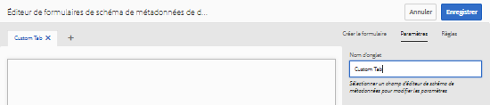
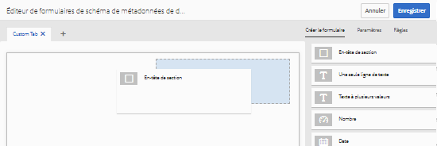
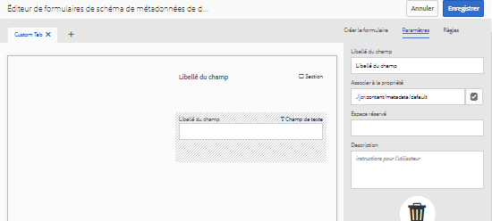
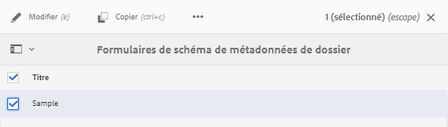
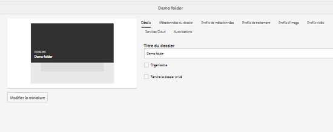
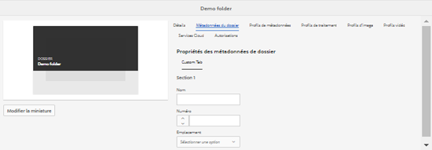
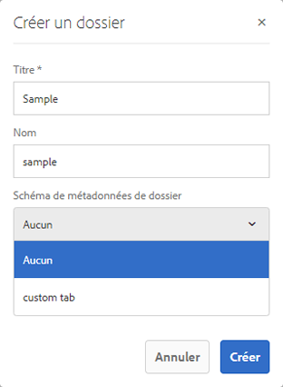

# Schéma de métadonnées de dossier {#folder-metadata-schema}

Adobe Experience Manager (AEM) Assets vous permet de créer des schémas de métadonnées pour des dossiers de ressources. Ces schémas définissent la disposition et les métadonnées affichées dans les pages de propriétés des dossiers.

## Ajout d’un formulaire de schéma de métadonnées de dossier {#add-a-folder-metadata-schema-form}

Utilisez l’éditeur Formulaires de schéma de métadonnées de dossier pour créer et modifier des schémas de métadonnées pour les dossiers.

1. Appuyez/cliquez sur le logo AEM, puis accédez à **[!UICONTROL Outils]** > **[!UICONTROL Ressources]** > **[!UICONTROL Schémas de métadonnées de dossier]**.
1. In the Folder Metadata Schema Forms page, tap/click **[!UICONTROL Create]**.
1. Indiquez un nom pour le formulaire, puis appuyez/cliquez sur **[!UICONTROL Créer]**. Le nouveau formulaire de schéma est répertorié dans la page Formulaires de schéma.

## Modification des formulaires de schéma de métadonnées de dossier {#edit-folder-metadata-schema-forms}

Vous pouvez modifier un formulaire de schéma de métadonnées nouveau ou existant comprenant les éléments suivants :

* Onglets
* Éléments de formulaire dans des onglets

Vous pouvez associer ou configurer ces éléments de formulaire dans un champ au sein d’un nœud de métadonnées dans le référentiel CRX. Vous pouvez ajouter de nouveaux onglets ou éléments de formulaire au formulaire de schéma de métadonnées.

1. In the Schema Forms page, select the form you created, and then tap/click the **[!UICONTROL Edit]** icon from the toolbar.
1. In the Folder Metadata Schema Editor page, tap/click the **[!UICONTROL +]** icon to add a tab to the form. Pour renommer l’onglet, appuyez/cliquez sur le nom par défaut, puis indiquez le nouveau nom sous **[!UICONTROL Paramètres]**.

   

   Pour ajouter d’autres onglets, appuyez/cliquez sur l’icône **[!UICONTROL +]**. Tap/click **[!UICONTROL X]** to delete a tab.

1. In the active tab, add one or more components from the **[!UICONTROL Build Form]** tab.

   

   Si vous créez plusieurs onglets, appuyez/cliquez sur un onglet spécifique pour ajouter des composants.

1. Pour configurer un composant, sélectionnez-le et modifiez ses propriétés dans l’onglet **[!UICONTROL Paramètres]**.

   Si nécessaire, supprimez un composant de l’onglet **[!UICONTROL Paramètres]**.

   

1. Appuyez/cliquez sur **[!UICONTROL Enregistrer]** dans la barre d’outils pour enregistrer les modifications.

### Composants de création de formulaires {#components-to-build-forms}

The **[!UICONTROL Build Form]** tab lists form items that you use in your folder metadata schema form. The **[!UICONTROL Settings]** tab displays the attributes for each item that you select in the **[!UICONTROL Build Form]** tab. Here is a list the form items available in the **[!UICONTROL Build Form]** tab:

<table>
 <tbody>
  <tr>
   <td>
<strong>Nom du composant</strong>
 </td>
   <td>
<strong>Description</strong>
 </td>
  </tr>
  <tr>
   <td>
En-tête de section
 </td>
   <td>
 Permet d’ajouter un en-tête de section pour une liste de composants communs.
 </td>
  </tr>
  <tr>
   <td>
Une seule ligne de texte
 </td>
   <td>
 Permet d’ajouter une propriété de texte d’une seule ligne. Elle est stockée sous la forme d’une chaîne.
 </td>
  </tr>
  <tr>
   <td>
Texte à plusieurs valeurs
 </td>
   <td>
 Permet d’ajouter une propriété de texte à plusieurs valeurs. Il est stocké sous forme de tableau de chaînes.
 </td>
  </tr>
  <tr>
   <td>
Nombre
 </td>
   <td>
 Permet d’ajouter un composant de nombre.
 </td>
  </tr>
  <tr>
   <td>
Date
 </td>
   <td>
 Permet d’ajouter un composant de date.
 </td>
  </tr>
  <tr>
   <td>
Liste déroulante
 </td>
   <td>
 Permet d’ajouter une liste déroulante.
 </td>
  </tr>
  <tr>
   <td>
Balises standard
 </td>
   <td>
 Permet d’ajouter une balise. 
 </td>
  </tr>
  <tr>
   <td>
Champ masqué
 </td>
   <td>
 Permet d’ajouter un champ masqué. Il est envoyé en tant que paramètre POST lorsque la ressource est enregistrée.
 </td>
  </tr>
 </tbody>
</table>

### Modification d’éléments de formulaire {#editing-form-items}

To edit the properties of form items, tap/click the component and edit all or a subset of the following properties in the **[!UICONTROL Settings]** tab.

**[!UICONTROL Libellé]** du champ : Nom de la propriété de métadonnées affichée sur la page de propriétés du dossier.

**[!UICONTROL Associer à la propriété]** : cette propriété spécifie le chemin d’accès relatif au nœud de dossier dans le référentiel CRX où il est enregistré. Elle commence par « **./** », ce qui indique que le chemin est situé sous le nœud du dossier.

Les valeurs admises pour cette propriété sont les suivantes :

* `./jcr:content/metadata/dc:title`: Stocke la valeur au niveau du noeud de métadonnées du dossier en tant que propriété `dc:title`.

* `./jcr:created` : affiche la propriété JCR au niveau du nœud du dossier. Si vous configurez ces propriétés dans CRXDE, Adobe recommande de les marquer avec l’état Désactiver la modification, car elles sont protégées. Dans le cas contraire, l’erreur &quot; `Asset(s) failed to modify`&quot; se produit lorsque vous enregistrez les propriétés du fichier.

Pour vous assurer que le composant est affiché correctement dans le formulaire de schéma de métadonnées, n’insérez pas d’espace dans le chemin de propriété.

**[!UICONTROL Chemin]** JSON : Utilisez-la pour spécifier le chemin du fichier JSON dans lequel vous spécifiez des paires clé-valeur pour les options.

**[!UICONTROL Espace réservé]** : utilisez cette propriété pour spécifier du texte dans l’espace réservé concernant la propriété de métadonnées.

**[!UICONTROL Choix]** : utilisez cette propriété pour spécifier des choix dans une liste.

**[!UICONTROL Description]** : utilisez cette propriété pour ajouter une brève description pour le composant de métadonnées.

**[!UICONTROL Classe]** : classe d’objets à laquelle la propriété est associée.

## Suppression de formulaires de schéma de métadonnées de dossier {#delete-folder-metadata-schema-forms}

Vous pouvez supprimer des formulaires de schéma de métadonnées de dossier de la page Formulaires de schéma de métadonnées de dossier. Pour supprimer un formulaire, sélectionnez-le, puis appuyez/cliquez sur l’icône Supprimer dans la barre d’outils.

## Affectation d’un schéma de métadonnées de dossier {#assign-a-folder-metadata-schema}

Vous pouvez affecter un schéma de métadonnées de dossier à un dossier depuis la page Formulaires de schéma de métadonnées de dossier ou lors de la création d’un dossier.

Si vous configurez un schéma de métadonnées pour un dossier, le chemin d’accès au formulaire est stocké dans la propriété `folderMetadataSchema` du nœud de dossier sous.*/jcr:content*.

### Affectation d’un schéma à partir de la page Schéma de métadonnées de dossier {#assign-to-a-schema-from-the-folder-metadata-schema-page}

1. Appuyez/cliquez sur le logo AEM, puis accédez à **[!UICONTROL Outils]** > **[!UICONTROL Ressources]** > **[!UICONTROL Schémas de métadonnées de dossier]**.
1. Dans la page Formulaires de schéma de métadonnées de dossier, sélectionnez le formulaire de schéma à appliquer à un dossier.
1. From the toolbar, tap/click **[!UICONTROL Apply to Folder(s)]**.

1. Select the folder on which to apply the schema and then click/tap **[!UICONTROL Apply]**. Si un schéma de métadonnées est déjà appliqué au dossier, un message d’avertissement vous informe que vous êtes sur le point de remplacer le schéma existant. Tap/click **[!UICONTROL Overwrite]**.
1. Ouvrez les propriétés des métadonnées pour le dossier auquel vous avez appliqué le schéma de métadonnées.

   

   To view the folder metadata fields, tap/click the **[!UICONTROL Folder Metadata]** tab.

   

### Affectation d’un schéma lors de la création d’un dossier {#assign-a-schema-when-creating-a-folder}

Vous pouvez affecter un schéma de métadonnées de dossier lors de la création d’un dossier. S’il existe au moins un schéma de métadonnées de dossier dans le système, une liste supplémentaire s’affiche dans la boîte de dialogue **[!UICONTROL Créer un dossier]**. Vous pouvez sélectionner le schéma de votre choix. Par défaut, aucun schéma n’est sélectionné.

1. Dans l’interface utilisateur d’AEM Assets, appuyez/cliquez sur **[!UICONTROL Créer]** dans la barre d’outils.
1. Attribuez un titre et un nom au dossier.
1. Dans la liste Schéma de métadonnées de dossier, sélectionnez le schéma de votre choix. Ensuite, appuyez/cliquez sur **[!UICONTROL Créer]**.

   

1. Ouvrez les propriétés des métadonnées pour le dossier auquel vous avez appliqué le schéma de métadonnées.
1. To view the folder metadata fields, tap/click the **[!UICONTROL Folder Metadata]** tab.

## Utilisation du schéma de métadonnées de dossier {#use-the-folder-metadata-schema}

Ouvrez les propriétés d’un dossier configuré avec un schéma de métadonnées de dossier. A **[!UICONTROL Folder Metadata]** tab is displayed in the folder properties page. Pour afficher le formulaire de schéma de métadonnées de dossier, sélectionnez cet onglet.

Saisissez les valeurs de métadonnées dans les différents champs, puis appuyez/cliquez sur **[!UICONTROL Enregistrer]** pour les stocker. Les valeurs renseignées sont stockées dans le nœud de dossier du référentiel CRX.

