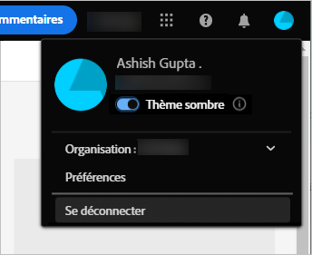

# Prise en main d’[!DNL Adobe Experience Manager Assets view] {#assets-view-get-started}

<!-- TBD: Make links for these steps. -->

La gestion de vos ressources numériques à l’aide d’[!DNL Assets view] ne nécessite que trois étapes simples :

* **Étape 1** : [charger](/help/assets/add-delete-assets-view.md) et [afficher](/help/assets/navigate-assets-view.md) des ressources.
* **Étape 2** : [rechercher](/help/assets/search-assets-view.md) et [télécharger](/help/assets/manage-organize-assets-view.md#download) des ressources.
* **Étape 3** : [gérer et organiser](/help/assets/manage-organize-assets-view.md) vos ressources.

Pour utiliser [!DNL Assets view], connectez-vous à l’adresse [https://experience.adobe.com/#/assets](https://experience.adobe.com/#/assets). Lors de la connexion, sélectionnez `Company or School Account`. Pour recevoir un accès, contactez l’administrateur de votre entreprise.

<!--In addition, more reference information that can be helpful is [understanding of the user interface](/help/assets/navigate-assets-view.md), [list of use cases](#use-cases), [supported file types](/help/assets/supported-file-formats-assets-view.md), and [known issues](/help/assets/release-notes.md#known-issues).
-->

## Recevoir un accès à [!DNL Assets view] {#get-access}

Adobe fournit la solution et ajoute la personne désignée de votre organisation en lui donnant le statut d’administrateur. Les administrateurs peuvent fournir l’accès à divers utilisateurs de l’organisation en utilisant l’[[!DNL Admin Console]](https://helpx.adobe.com/fr/enterprise/using/admin-console.html). Pour toute demande relative à votre accès, contactez l’administrateur de votre entreprise.

Lors de la connexion, après avoir fourni les informations d’identification, [!DNL Assets view] vous invite à sélectionner un compte. Dans ce cas, sélectionnez `Company or School Account` pour continuer.

## Configuration d’[!DNL Assets view] {#configuration}

Pour ouvrir les préférences, cliquez sur votre avatar dans le coin supérieur droit de l’interface utilisateur. Vous pouvez basculer entre les thèmes clairs et sombres dans les préférences de la solution.

Si vous faites partie de différentes organisations, vous pouvez également changer d’organisation et accéder à vos comptes de différentes organisations.

Pour modifier vos [!UICONTROL préférences Experience Cloud], cliquez sur [!UICONTROL Préférences].

## Scénarios d’utilisation d’[!DNL Assets view]  {#use-cases}

Vous trouverez ci-dessous les différentes tâches de gestion des actifs numériques (DAM) que vous pouvez réaliser en utilisant [!DNL Assets view].

| Tâches utilisateur | Fonctionnalités et informations pratiques |
|-----|------|
| Recherche et affichage des ressources | <ul> <li>[Parcourir le référentiel](/help/assets/navigate-assets-view.md#view-assets-and-details) </li> <li> [Aperçu d’une ressource](/help/assets/navigate-assets-view.md#preview-assets) <li> [Affichage des rendus d’une ressource](/help/assets/add-delete-assets-view.md#renditions) </li> <li>[Affichage des versions d’une ressource](/help/assets/manage-organize-assets-view.md#view-versions)</li></ul> |
| Ajout de nouvelles ressources | <ul> <li>[Chargement de nouvelles ressources et de nouveaux dossiers](/help/assets/add-delete.md#add-assets)</li> <li>[Surveillance de la progression du chargement et gestion des chargements](/help/assets/add-delete-assets-view.md#upload-progress)</li> <li>[Résoudre les problèmes de doublons](/help/assets/add-delete-assets-view.md#resolve-upload-fails)</li> </ul> |
| Mise à jour de ressources ou d’informations connexes | <ul> <li>[Modification des images](/help/assets/edit-images-assets-view.md)</li> <li>[Création de versions](/help/assets/manage-organize-assets-view.md#create-versions) et [affichage de versions](/help/assets/manage-organize-assets-view.md#view-versions)</li> <li>[Modification des images](/help/assets/edit-images-assets-view.md)</li> </ul> |
| Modification de ressources | <ul> <li>[Modifications dans le navigateur à l’aide d’Adobe Photoshop Express](/help/assets/edit-images-assets-view.md)</li> <li>[Recadrage d’un profil de réseaux sociaux](/help/assets/edit-images-assets-view.md#crop-straighten-images)</li> <li>[Affichage et gestion des versions](/help/assets/manage-organize-assets-view.md#view-versions)</li> <li>[Utilisation [!DNL Adobe Asset Link]](/help/assets/integration-assets-view.md#integrations)</ul></ul> |
| Recherche de ressources dans le référentiel | <ul> <li>[Recherche dans un dossier spécifique](/help/assets/search-assets-view.md#refine-search-results)</li> <li>[Recherches enregistrées](/help/assets/search-assets-view.md#saved-search)</li> <li>[Recherche de ressources récemment consultées](/help/assets/search-assets-view.md)</li> <li>[Recherche du texte intégral](/help/assets/search-assets-view.md) |
| Téléchargement de ressources | <ul> <li> [Aperçu de la ressource](/help/assets/navigate-assets-view.md#preview-assets) </li> <li> [Téléchargement de ressources](/help/assets/manage-organize-assets-view.md#download) <li> [Téléchargement de rendus](/help/assets/add-delete-assets-view.md#renditions) </li></ul> |
| Opérations de métadonnées | <ul> <li>[Affichage des métadonnées détaillées](/help/assets/metadata-assets-view.md) </li> <li> [Mise à jour les métadonnées](/help/assets/metadata-assets-view.md#update-metadata)</li> <li> [Création d’un formulaire de métadonnées](/help/assets/metadata-assets-view.md#metadata-forms) </li> </ul> |

## Étapes suivantes {#next-steps}

* [Regardez une vidéo pour commencer à utiliser la vue Ressources.](https://experienceleague.adobe.com/docs/experience-manager-learn/assets-essentials/getting-started.html?lang=fr)

* Fournir des commentaires sur les produits à l’aide de la variable [!UICONTROL Commentaires] option disponible dans l’interface utilisateur de la vue Assets

* Faites des commentaires sur la documentation en utilisant l’option [!UICONTROL Modifier cette page]  ou [!UICONTROL Enregistrer un problème]  disponible dans la barre latérale droite.

* Contactez l’[assistance clientèle](https://experienceleague.adobe.com/?support-solution=General&amp;lang=fr#support).

<!--TBD: Merge the below rows in the table when the use cases are documented/available.

| How do I delete assets? | <ul> <li>[Delete assets](/help/assets/manage-organize.md)</li> <li>Recover deleted assets</li> <li>Permanently delete assets</li> </ul> |
| How do I share assets or find shared assets? | <ul> <li>Shared by me</li> <li>Shared with me</li> <li>Share for comments and review</li> <li>Unshare assets</li> </ul> |
| How do I collaborate with others and get my assets reviewed | <ul> <li>Share for review</li> <li>Provide comments. Resolve and filter comments</li> <li>Annotations on images</li> <li>Assign tasks to specific users and prioritize</li> </ul> |

-->

<!-- 

##  Provide product feedback {#provide-feedback}

Adobe welcomes feedback about the solution. To provide feedback without even switching your working application, use the [!UICONTROL Feedback] option in the user interface. It also lets you attach files such as screenshots or video recording of an issue.

  

To provide feedback for documentation, click [!UICONTROL Edit this page]  or [!UICONTROL Log an issue]  from the right sidebar. You can do one of the following: 

* Make the content updates and submit a GitHub pull request.
* Create an issue or ticket in GitHub. Retain the automatically populated article name when creating an issue.

-->
<!--
>[!MORELIKETHIS]
>
>* [Understand the user interface](/help/assets/navigate-asssets-view.md).
>* [Release notes and known issues](/help/assets/release-notes.md).
>* [Supported file types](/help/assets/supported-file-formats.md).
-->
