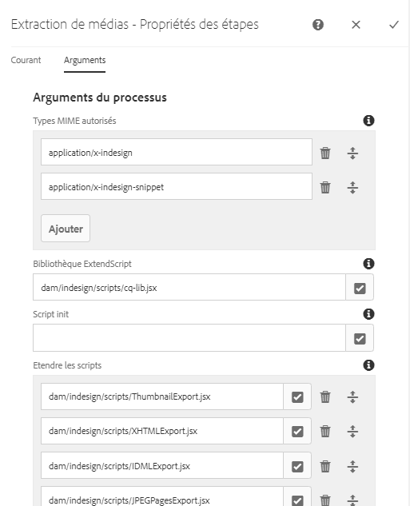
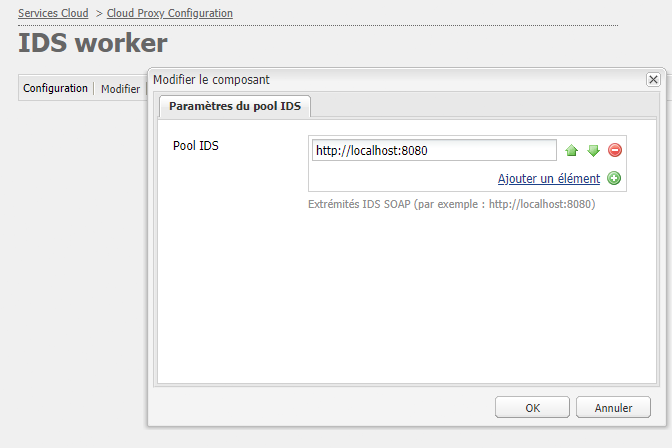
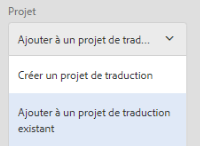

# Intégration d’AEM Assets à InDesign Server {#integrating-aem-assets-with-indesign-server}

Adobe Experience Manager (AEM) Assets utilise :

* Un proxy pour distribuer la charge de certaines tâches de traitement. Un proxy est une instance AEM qui communique avec un programme de traitement du proxy afin d’accomplir une tâche spécifique, et avec d’autres instances AEM pour diffuser les résultats.
* Le programme de traitement du proxy définit et gère une tâche spécifique.
Il peut couvrir une grande variété de tâches ; par exemple l’utilisation d’un serveur InDesign Server pour traiter les fichiers.

Pour transférer intégralement des fichiers créés avec Adobe InDesign vers AEM Assets, un proxy est utilisé. Cette méthode utilise un programme de traitement du proxy pour communiquer avec Adobe InDesign Server, qui exécute des [scripts](https://www.adobe.com/devnet/indesign/documentation.html#idscripting) afin d’extraire des métadonnées et de générer divers rendus pour AEM Assets. Le programme de traitement du proxy permet une communication bidirectionnelle entre InDesign Server et les instances AEM dans une configuration cloud.

>[!NOTE]
>
>Adobe InDesign se compose de deux produits :
>
>* [InDesign](https://www.adobe.com/fr/products/indesign.html)
   >  Vous permet de concevoir des mises en page pour l’impression ou la diffusion numérique.
   >
   >
* [InDesign Server](https://www.adobe.com/fr/products/indesignserver.html)
   >  Vous permet de créer des documents de façon automatisée, et par programmation, sur la base de vos mises en pages créées avec InDesign. Il s’exécute en tant que service offrant une interface pour son moteur [ExtendScript](https://www.adobe.com/devnet/scripting.html).
   >  Les scripts sont écrits en ExtendScript, un langage similaire à JavaScript. Pour plus d’informations sur les scripts InDesign, rendez-vous à l’adresse [https://www.adobe.com/devnet/indesign/documentation.html#idscripting](https://www.adobe.com/devnet/indesign/documentation.html#idscripting).
>

## Fonctionnement de l’extraction {#how-the-extraction-works}

Adobe InDesign Server peut être intégré à AEM Assets, de telle sorte que les fichiers INDD créés avec InDesign puissent être transférés, que des rendus puissent être générés, et que tous les médias (des vidéos, par exemple) puissent être extraits et stockés sous la forme de ressources :

>[!NOTE]
>
>Les versions précédentes d’AEM permettaient seulement d’extraire le XMP et la miniature. Désormais, tous les médias peuvent être extraits.

1. Transférez votre fichier INDD vers AEM Assets.
1. Une infrastructure envoie des scripts de commande vers InDesign Server via SOAP (Simple Object Access Protocol).
Ce script de commande permet d’effectuer les opérations suivantes :

   * Récupérer le fichier INDD.
   * Exécuter des commandes InDesign Server :

      * La structure, le texte et tous les fichiers multimédias sont extraits.
      * Des rendus PDF et JPG sont générés.
      * Des rendus HTML et IDML sont générés.
   * Republier les fichiers résultants dans AEM Assets.
   >[!NOTE]
   >
   >IDML est un format XML qui permet de générer un rendu de *l’intégralité* du contenu d’un fichier InDesign. Il est stocké sous forme d’une archive compressée au format [Zip](https://www.techterms.com/definition/zip).
   >
   >
   >Voir [Adobe Press - Formats d’échange InDesign, INX et IDML](https://www.adobepress.com/articles/article.asp?p=1381880&amp;seqNum=8) pour plus d’informations.

   >[!CAUTION]
   >
   >Si InDesign Server n’est pas installé ou configuré, vous pouvez tout de même charger un fichier INDD dans AEM. Toutefois, les rendus générés seront limités aux formats PNG et JPEG. Vous ne pourrez pas générer de code HTML ou .idml, ni générer des rendus de page.

1. Après l’extraction et la génération du rendu :

   * La structure est identique à `cq:Page` (type de rendu).
   * Le texte et les fichiers extraits sont stockés dans AEM Assets.
   * Tous les rendus sont stockés dans des AEM Assets, dans la ressource même.

## Intégration d’InDesign Server à AEM   {#integrating-the-indesign-server-with-aem}

Pour intégrer InDesign Server afin de l’utiliser avec AEM Assets, après la configuration de votre proxy, vous devez :

1. [Installer InDesign Server](#installing-the-indesign-server).
1. Si nécessaire, [configurer le workflow AEM Assets](#configuring-the-aem-assets-workflow).
Cette opération n’est nécessaire que si les valeurs par défaut ne sont pas adaptées à votre instance.

1. Configurer un [programme de traitement du proxy pour InDesign Server](#configuring-the-proxy-worker-for-indesign-server).

### Configuration de InDesign Server   {#installing-the-indesign-server}

Pour installer et démarrer InDesign Server afin de l’utiliser avec AEM :

1. Téléchargez et installez Adobe InDesign Server.

   >[!NOTE]
   >
   >InDesign Server (CS6 ou version ultérieure).

1. Si nécessaire, vous pouvez personnaliser la configuration de votre instance InDesign Server.

1. À partir de la ligne de commande, démarrez le serveur :

   `<*ids-installation-dir*>/InDesignServer.com -port 8080`

   Cela démarre le serveur avec le module complémentaire SOAP en écoute sur le port 8080. Tous les messages de journal et les résultats sont écrits directement dans la fenêtre de commande.

   >[!NOTE]
   >
   >Si vous souhaitez enregistrer les messages de sortie vers un fichier, puis utiliser une redirection ; par exemple, sous Windows :
   >
   >
   >`<ids-installation-dir>/InDesignServer.com -port 8080 > ~/temp/INDD-logfile.txt 2>&1`

### Configuration du workflow AEM Assets {#configuring-the-aem-assets-workflow}

AEM Assets utilise le processus préconfiguré **Ressources de mise à jour de gestion des actifs numériques**, dont plusieurs étapes s’appliquent spécifiquement à InDesign :

* [Extraction de médias](#media-extraction)
* [Extraction de page](#page-extraction)

<!--
BROKEN LINK This workflow is setup with default values that can be adapted for your setup on the various author instances (this is a standard workflow, so further information is available under [Editing a Workflow](/help/sites-developing/workflows-models.md#configuring-a-workflow-step)). If you are using the default values (including the SOAP port), then no configuration is needed. BROKEN LINK
-->

Après la configuration, le transfert de fichiers InDesign dans AEM Assets (via les méthodes habituelles) déclenche le workflow requis pour le traitement de la ressource et la préparation des différents rendus. Testez votre configuration en transférant un fichier `.indd` dans AEM Assets afin de confirmer que vous voyez les différents rendus créés par IDS sous `<*your_asset*>.indd/Renditions`.

#### Extraction de médias {#media-extraction}

Cette étape commande l’extraction de médias à partir du fichier INDD.

Pour la personnaliser, vous pouvez modifier l’onglet **Arguments** dans l’étape **Extraction de médias**.

Arguments d’extraction de médias et chemins de scripts

* **Bibliothèque ExtendScript**
Il s’agit d’une simple bibliothèque de méthodes HTTP GET/POST, requise par les autres scripts.

* **Développer les scripts**
Vous pouvez indiquer ici différentes combinaisons de script. Si vous souhaitez que vos propres scripts soient exécutés sur le serveur InDesign, enregistrez-les sous `/apps/settings/dam/indesign/scripts`.
Pour plus d’informations sur les scripts InDesign, voir :
   [https://www.adobe.com/devnet/indesign/documentation.html#idscripting](https://www.adobe.com/devnet/indesign/documentation.html#idscripting)

>[!CAUTION]
>
>Ne modifiez **pas** la **bibliothèque ExtendScript**.

>Cette bibliothèque fournit la fonctionnalité HTTP requise pour communiquer avec Sling. Ce paramètre spécifie la bibliothèque à envoyer à InDesign Server pour qu’il l’utilise.
>
Le script `ThumbnailExport.jsx` exécuté par l’étape de workflow Extraction des médias génère un rendu miniature au format .jpg. Ce rendu est utilisé par l’étape du workflow Miniatures des processus afin de générer les rendus statiques requis par AEM.

Vous pouvez configurer l’étape du workflow Miniatures des processus de manière à générer des rendus statiques de différentes tailles. Assurez-vous de ne pas supprimer les valeurs par défaut, car elles sont requises par l’interface utilisateur d’AEM Assets. Enfin, l’étape Processus de suppression du rendu d’aperçus d’image efface le rendu miniature .jpg, car il n’est plus nécessaire.

#### Extraction de page   {#page-extraction}

Cette opération crée une page AEM à partir des éléments extraits. Un gestionnaire d’extraction est utilisé pour extraire les données d’un rendu (actuellement HTML ou IDML). Ces données sont ensuite utilisées pour créer une page avec PageBuilder.

Pour la personnaliser, vous pouvez modifier l’onglet **Arguments** dans l’étape **Extraction de page**.

* **Gestionnaire d’extraction de page**
Dans la liste déroulante, sélectionnez le gestionnaire que vous souhaitez utiliser. Un gestionnaire d’extraction fonctionne sur un rendu spécifique, sélectionné par un `RenditionPicker` associé (voir l’API `ExtractionHandler`).
Dans une installation AEM standard, les informations suivantes sont disponibles :

   * Gestionnaire d’extraction d’exportation
Fonctionne sur un rendu `IDML` généré lors de l’étape MediaExtract.

* **Nom de la page**
Indique le nom que vous souhaitez attribuer à la page résultant du processus. Si vous laissez le champ vide, le nom est « page » (ou une variante si « page » existe déjà).

* **Titre de la page**
Indique le titre que vous souhaitez attribuer à la page résultant du processus.

* **Racine de la page**
Chemin d’accès à la racine de la page résultant du processus.
Si vous laissez le champ vide, le nœud contenant les rendus de la ressource sera utilisé.

* **Modèle de page**
Modèle à utiliser lors de la génération de la page résultant du processus.

* **Conception de page**
Conception de page à utiliser lors de la génération de la page résultant du processus.

### Configuration du traitement du proxy pour InDesign Server {#configuring-the-proxy-worker-for-indesign-server}

>[!NOTE]
Le programme de traitement réside sur une instance de proxy.

1. Dans la console Outils, développez **Configurations Cloud Services** dans le volet de gauche. Développez ensuite **Configuration de proxy Cloud**.

1. Double-cliquez sur **IDS Worker** pour ouvrir la configuration.

1. Cliquez sur **[!UICONTROL Modifier]** pour ouvrir la boîte de dialogue de configuration et définir les paramètres requis :

   

   * **Pool IDS**
Points d’extrémité SOAP à utiliser pour communiquer avec InDesign Server. Vous pouvez ajouter, supprimer ou trier les éléments au besoin.

1. Cliquez sur OK pour enregistrer.

### Configuration de l’externaliseur de liens DAY CQ {#configuring-day-cq-link-externalizer}

Si InDesign Server et AEM sont exécutés sur des hôtes différents ou si ces deux applications ne fonctionnent pas sur les ports par défaut, configurez **l’externaliseur de liens Day CQ** afin de définir le nom d’hôte, le port et le chemin d’accès au contenu pour InDesign Server.

1. Accédez à Configuration Manager à l’adresse suivante : `https://[aem_server]:[port]/system/console/configMgr`.
1. Identifiez la configuration **Externaliseur de lien Day CQ** et cliquez sur l’icône **Modifier** pour l’ouvrir.
1. Spécifiez le nom d’hôte et le chemin d’accès contextuel de InDesign Server, puis cliquez sur **Enregistrer**.

   

### Activation du traitement parallèle des tâches pour InDesign Server {#enabling-parallel-job-processing-for-indesign-server-s}

Vous pouvez désormais activer le traitement parallèle des tâches pour IDS.

Vous devez d’abord déterminer le nombre maximal de tâches parallèles (`x`) qu’InDesign Server peut traiter :

* Sur une machine unique à processeur multi-cœurs, le nombre maximum de tâches parallèles (x) qu’InDesign Server peut traiter est égal au nombre de processeurs qui exécutent IDS, moins un.
* Lorsque vous exécutez IDS sur plusieurs machines, vous devez compter le nombre total de processeurs disponibles (sur chaque ordinateur) et soustraire le nombre total d’ordinateurs.

Pour configurer le nombre de tâches parallèles d’IDS :

1. Ouvrez l’onglet **Configurations** de la console Felix ; par exemple :   `https://[aem_server]:[port]/system/console/configMgr`.

1. Sélectionnez la file d’attente du traitement d’IDS sous :

   `Apache Sling Job Queue Configuration`

1. Définissez :

   * **Type** - `Parallel`
   * **Nombre max. de tâches parallèles** - `<*x*>` (conformément au calcul ci-dessus)

1. Enregistrez ces modifications.
1. Activez la prise en charge de sessions multiples dans CS6 (et versions ultérieures) en cochant :

   la case `enable.multisession.name`

   Sous :

   `com.day.cq.dam.ids.impl.IDSJobProcessor.name configuration`

1. Créez un [groupe de `<*x*>` traitement IDS en ajoutant des points d’extrémité SOAP à la configuration du traitement IDS](#configuring-the-proxy-worker-for-indesign-server).

   S’il existe plusieurs machines exécutant InDesign Server, ajoutez les points d’extrémité SOAP (nombre de processeurs par ordinateur -1) pour chaque ordinateur.

   >[!NOTE]
   Vous pouvez activer la mise sur liste noire du traitement IDS lorsque vous travaillez avec un groupe de programmes de traitement.
   Pour ce faire, cochez la case « enable.retry.name » sous la configuration de `com.day.cq.dam.ids.impl.IDSJobProcessor.name`, ce qui déclenche de nouvelles tentatives pour les tâches IDS.
   En outre, sous la configuration `com.day.cq.dam.ids.impl.IDSPoolImpl.name`, définissez une valeur positive pour le paramètre `max.errors.to.blacklist`, qui détermine le nombre de tentatives pour une tâche avant qu’un IDS ne soit exclu de la liste des gestionnaires de tâches.
   Par défaut, le traitement IDS est revalidé après une durée en minutes configurable (retry.interval.to.whitelist.name). Si le programme de traitement est en ligne, il est retiré de la liste noire.

## Activation de la prise en charge de InDesign Server 10.0 ou version ultérieure   {#enabling-support-for-indesign-server-or-higher}

Pour InDesign Server 10.0 ou version ultérieure, réalisez les étapes suivantes pour activer la prise en charge multisession.

1. Ouvrez Configuration Manager à partir de votre instance AEM Assets `https://[aem_server]:[port]/system/console/configMgr`.
1. Modifiez la configuration de `com.day.cq.dam.ids.impl.IDSJobProcessor.name`.
1. Sélectionnez l’option **[!UICONTROL ids.cc.enable]**, puis cliquez sur **[!UICONTROL Enregistrer]**.

>[!NOTE]
Pour l’intégration de InDesign Server dans AEM Assets, utilisez un processeur multicœur, car la fonction Prise en charge de sessions nécessaire pour l’intégration n’est pas prise en charge sur les systèmes à un seul cœur.

## Configuration des informations d’identification AEM   {#configure-aem-credentials}

Vous pouvez modifier les informations d’identification administrateur par défaut (nom d’utilisateur et mot de passe) qui permettent d’accéder à InDesign Server depuis votre instance AEM sans interrompre l’intégration à InDesign Server.

1. Accédez à `/etc/cloudservices/proxy.html`.
1. Dans la boîte de dialogue, indiquez le nouveau nom d’utilisateur et le nouveau mot de passe.
1. Enregistrez les identifiants.
