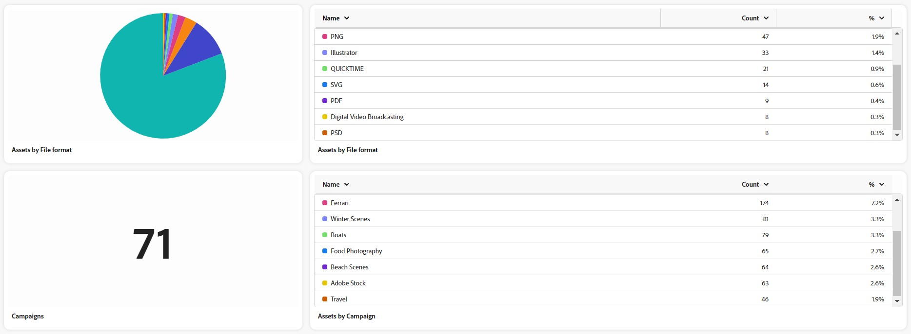

# Assets Insights dans [!DNL Content Hub] {#assets-insights}

| [Bonnes pratiques de recherche](/help/assets/search-best-practices.md) | [ Bonnes pratiques en matière de métadonnées](/help/assets/metadata-best-practices.md) | [Hub de contenus](/help/assets/product-overview.md) | [Dynamic Media avec fonctionnalités OpenAPI](/help/assets/dynamic-media-open-apis-overview.md) | [Documentation destinée aux développeurs AEM Assets](https://developer.adobe.com/experience-cloud/experience-manager-apis/) |
| ------------- | --------------------------- |---------|----|-----|

[!DNL Content Hub] fournit des informations précieuses sur les ressources, ce qui permet de répondre à un défi commun auquel les parties prenantes marketing sont souvent confrontées : les statistiques d’utilisation des ressources utilisées dans les campagnes marketing, les canaux et les différentes régions. En acquérant une compréhension claire des performances et de la popularité des ressources, elle fournit des informations exploitables essentielles à l’amélioration de l’expérience utilisateur.

## Conditions préalables {#prerequisites}

[Les utilisateurs de Content Hub](deploy-content-hub.md#onboard-content-hub-users) peuvent effectuer les actions mentionnées dans cet article.

## Affichage des statistiques pour les ressources chargées{#view-statistics-for-uploaded-assets}

Vous pouvez afficher les statistiques des ressources et collections chargées en accédant à l’onglet **[!UICONTROL Statistiques]** . Suivez l’historique des chargements de vos ressources avec la vue des chargements de ressources annuels, mensuels et quotidiens.

<!-- You can track the upload history of your assets over the past 30 days or gain a more comprehensive view with data spanning the last 12 months. This feature enables you to evaluate the upload count of assets.  -->

<!-- Go to the **[!UICONTROL [!DNL Insights]]** tab.

2. Select the desired time frame to view the statistics; you can opt for either last 30 days or last 12 months.

Data for the selected time frame is displayed, including the upload count for the specified duration. -->

## Afficher une analyse statistique détaillée{#view-detailed-statistical-analysis}

Content Hub vous permet d’afficher les statistiques du nombre de ressources en fonction de leur format de fichier, de leurs campagnes, de leurs canaux et de leurs régions. Vous pouvez obtenir des informations précieuses sur la distribution des ressources, ce qui facilite la prise de décisions éclairées et la planification stratégique.

Le tableau présente un aperçu détaillé des différentes ressources, y compris leur nombre et le pourcentage respectif au sein du référentiel. Vous pouvez ajuster les tailles des colonnes et trier les ressources par nom, nombre et pourcentage de ressources.

Le graphique circulaire représente visuellement le nombre total de ressources par format de fichier, fournissant une illustration claire du nombre de ressources individuelles et de leurs pourcentages correspondants.

Vous pouvez également afficher :

* **Utilisateurs actifs par jour et mois** : nombre d’utilisateurs actifs par jour ou par mois représenté à l’aide d’un graphique linéaire.
* **[!UICONTROL Assets par campagnes]** : nombre de ressources et pourcentage respectif en fonction des campagnes.
* **[!UICONTROL Assets par canaux]** : nombre de ressources et pourcentage respectif en fonction des canaux utilisés.
* **[!UICONTROL Assets par régions]** : nombre de ressources et pourcentage respectif en fonction des régions d’utilisation des ressources.
