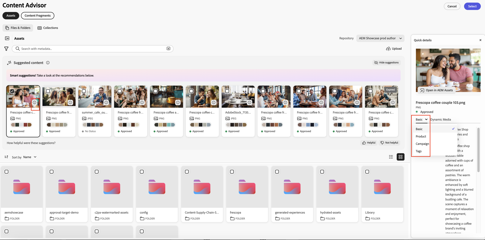

# Utilisez le gestionnaire de contenu pour accéder au contenu d’AEM dans les applications Adobe et non Adobe{#content-advisor-aem-assets-adobe-non-Adobe-applications}

Content Advisor offre une expérience de découverte de contenu unifiée dans les applications Adobe et non Adobe. Intégrés nativement à des applications telles qu’Adobe Workfront, AJO B2C (bientôt disponible), AEM Sites et d’autres applications, Content Advisor rassemble le contenu (ressources et fragments de contenu) dans une seule interface intelligente. Il vous permet de découvrir, parcourir et réutiliser facilement le contenu le plus pertinent, directement au sein de votre workflow, afin que vous puissiez vous déplacer plus rapidement sans rompre le contexte.

Le gestionnaire de contenu permet une découverte intelligente et contextuelle directement dans l’expérience de création, ce qui vous permet de trouver rapidement du contenu pertinent et approuvé en fonction de votre intention. Grâce à des fonctionnalités telles que les suggestions intelligentes, les rendus Dynamic Media et les métadonnées de ressources détaillées, il vous permet d’évaluer et de réutiliser efficacement le contenu sans quitter l’interface de l’application, ce qui accélère la création de contenu tout en préservant la cohérence de la marque.

Adobe Experience Manager (AEM) Assets s’intègre également de manière native à Adobe Express, ce qui vous permet de découvrir, d’accéder et d’utiliser des ressources d’AEM Assets directement dans l’interface Express à l’aide de la fonction de conseil sur le contenu. Pour plus d’informations, voir [Utilisation de la fonction de conseil sur l’accès à AEM Assets dans Adobe Express](/help/assets/native-integration-adobe-express.md).

## Prérequis {#prerequisites}

* Accès à un environnement AEM Assets as a Cloud Service.

* Accès à un environnement AEM Sites avec des fragments de contenu créés (requis uniquement pour l’utilisation de fragments de contenu). Cela n’est pas nécessaire pour accéder aux ressources binaires ou à AEM Assets.

## Détection intelligente des ressources avec le gestionnaire de contenu {#intelligent-asset-discovery-content-advisor}

Le gestionnaire de contenu vous aide à découvrir du contenu pertinent à l’aide de recommandations intelligentes et contextuelles basées sur le contenu de votre application Adobe hôte ou sur votre résumé de campagne. Il vous permet également de sélectionner des rendus Dynamic Media prêts pour le canal optimisés pour votre cas d’utilisation.

>[!IMPORTANT]
> 
>Veillez à sélectionner un référentiel **auteur** dans la liste déroulante **Référentiel**. Un référentiel **diffusion** n’affiche pas les fonctionnalités du gestionnaire de contenu.
>
> En outre, le référentiel **diffusion** n’a pas de contenu organisé dans des dossiers et des collections. Le contenu s’affiche au niveau racine dans une structure plate.

Le gestionnaire d’accès propose les fonctionnalités clés suivantes :

* [Recherche optimisée par l&#39;IA pour une découverte de ressources plus intelligente](#content-advisor-ai-search)

* [Suggestions intelligentes basées sur le contexte et l’intention](#smart-suggestions-content-advisor)

* [Des résumés de campagne pour découvrir les ressources pertinentes](#campaign-briefs-content-advisor)

* [Rendus de ressources Dynamic Media disponibles](#dynamic-media-renditions-content-advisor)

* [Intégration transparente aux fragments de contenu](#content-fragments-integration-content-advisor)

* [Accès aux métadonnées des ressources cohérent avec la vue Assets](#asset-metadata-content-advisor)

* [Filtres d’accès cohérents avec la vue Assets](#filters-content-advisor)

* [Accès et réutilisation des recherches récentes et enregistrées](#saved-searches-content-advisor)

* [Recherche de ressources dans et entre les collections](#search-collections-content-advisor)

### Recherche optimisée par l&#39;IA pour une découverte de ressources plus intelligente {#content-advisor-ai-search}

Content Advisor utilise une fonctionnalité de recherche avancée qui comprend la signification et l’intention derrière la requête d’un utilisateur plutôt que de se fier à des correspondances exactes de mots-clés. Il utilise l’intelligence artificielle (IA) et le machine learning pour fournir des résultats plus précis et contextuels.

Contrairement à la recherche traditionnelle par mot-clé, qui recherche des termes exacts, Recherche optimisée par l&#39;IA interprète les relations entre les mots, les concepts et l’intention de l’utilisateur. Cela permet de s’assurer que les utilisateurs et les utilisatrices trouvent ce qu’ils recherchent, même si leur requête est formulée différemment, contient des fautes de frappe ou est dans une autre langue.

Voici quelques-uns de ses principaux avantages :

* Prise en charge multilingue : effectuez des recherches dans plusieurs langues sans nécessiter de traductions exactes. Les utilisateurs peuvent trouver du contenu pertinent quel que soit leur langage de requête.

* Gère les fautes d’orthographe : interprète les fautes de frappe et d’orthographe, en garantissant des résultats précis même avec une saisie imparfaite.

* Comprend les synonymes : fournit des résultats pour les termes et expressions associés, de sorte que les utilisateurs n’ont pas besoin de deviner le bon mot-clé.

* Recherche contextuelle : reconnaît l’intention derrière une requête, pas seulement les mots exacts.

>[!IMPORTANT]
> 
>* La version AEM minimale requise pour accéder à Recherche optimisée par l&#39;IA dans le gestionnaire de contenu est `21994`
>* La prise en charge recherche optimisée par l&#39;IA des fragments de contenu sera bientôt disponible.

### Suggestions intelligentes basées sur le contexte et l’intention {#smart-suggestions-content-advisor}

Le gestionnaire d’accès affiche des suggestions intelligentes en fonction du contexte de l’application Adobe hôte. Cela vous permet de découvrir et d’utiliser rapidement des ressources qui correspondent à vos besoins en matière de contenu, sans avoir à effectuer de recherche manuelle fastidieuse.

>[!IMPORTANT]
> 
>* Vous devez signer un Cavalier GenAI pour accéder à cette fonctionnalité dans le gestionnaire de contenu. Pour signer GenAI rider, contactez votre représentant Adobe.
>* La version minimale requise d’AEM pour accéder à cette fonctionnalité est `21994`.
>* Le gestionnaire de contenu affiche des suggestions intelligentes en fonction du contexte et de l’intention du contenu disponible dans l’application Adobe hôte. Il n’affiche pas les résultats en fonction des images. Pour obtenir la liste des applications Adobe prises en charge par cette fonctionnalité, reportez-vous à la section [Prise en charge des fonctionnalités de gestion de contenu dans les applications Adobe](#content-advisor-feature-support-adobe-applications).

### Des résumés de campagne pour découvrir les ressources pertinentes {#campaign-briefs-content-advisor}

Le gestionnaire d’accès vous permet de télécharger un document de résumé de campagne pour découvrir les ressources pertinentes sans saisir manuellement les mots-clés de recherche. Le conseiller d’accès analyse les informations du résumé de la campagne afin de comprendre l’intention de la campagne et recommande les ressources appropriées disponibles dans AEM Assets.

>[!IMPORTANT]
>
>* Le gestionnaire d’accès analyse les informations disponibles sous forme de texte dans le résumé de la campagne afin de recommander les ressources appropriées. Il n’analyse pas les informations disponibles sous forme d’images dans le résumé de la campagne.
>* Les types de fichiers pris en charge que vous pouvez charger en tant que résumé de campagne incluent les documents PDF, DOCX et TXT.
>* Vous devez signer un Cavalier GenAI pour accéder à cette fonctionnalité dans le gestionnaire de contenu. Pour signer GenAI rider, contactez votre représentant Adobe.
>* La version minimale requise d’AEM pour accéder à cette fonctionnalité est `21994`.
>* La prise en charge du chargement de la synthèse de Campaign sera bientôt disponible pour les fragments de contenu.

### Rendus de ressources Dynamic Media disponibles {#dynamic-media-renditions-content-advisor}

Les rendus Dynamic Media fournissent des versions de ressources prêtes à l’emploi et optimisées pour les canaux, notamment les [paramètres d’image prédéfinis](/help/assets/dynamic-media/managing-image-presets.md), [recadrages intelligents](/help/assets/dynamic-media/image-profiles.md), les types de format et les profils de couleurs. Ces rendus permettent de s’assurer que la ressource sélectionnée répond aux exigences de canal et de conception sans nécessiter de modification manuelle ou de duplication de ressources.

Vous pouvez également appliquer des modificateurs Dynamic Media pour prévisualiser les réglages en temps réel avant de sélectionner le rendu pour l’application Adobe hôte, ce qui permet de sélectionner plus rapidement le rendu le plus approprié, tout en préservant la cohérence et la qualité des ressources.

Cliquez sur l’icône  sur la carte de la ressource et sélectionnez l’onglet **[!UICONTROL Dynamic Media]** pour afficher les rendus disponibles pour une ressource. Vous pouvez choisir d’afficher les rendus [Dynamic Media en mode Scene7](/help/assets/dynamic-media/dynamic-media.md) ou [Dynamic Media avec OpenAPI](/help/assets/dynamic-media-open-apis-overview.md). Lorsque vous sélectionnez **[!UICONTROL OpenAPI]** pour une ressource, les rendus disponibles s’affichent uniquement si la ressource est approuvée et disponible pour Dynamic Media avec OpenAPI.

Vous devez disposer d’une licence Dynamic Media AEM valide pour afficher l’onglet Dynamic Media .

Cliquez sur l’icône  pour prévisualiser le rendu ou cliquez sur le nom du rendu et cliquez sur **[!UICONTROL Sélectionner]** pour rendre le rendu disponible dans votre application hôte.

Cliquez sur **[!UICONTROL Ajouter des modificateurs]**, spécifiez un modificateur dans la zone de texte, puis appuyez sur Entrée pour appliquer la transformation à tous les rendus de ressources en temps réel. De même, vous pouvez ajouter plusieurs modificateurs aux rendus et prévisualiser ces transformations. Cliquez sur le nom du rendu, puis sur **[!UICONTROL Sélectionner]** pour rendre le rendu disponible dans votre application hôte. Le rendu après l’application de ces modificateurs n’est pas enregistré. Consultez la liste des modificateurs pris en charge pour [Dynamic Media Scene7](https://experienceleague.adobe.com/en/docs/dynamic-media-developer-resources/image-serving-api/image-serving-api/http-protocol-reference/command-reference/c-command-reference) et [Dynamic Media avec OpenAPI](https://developer.adobe.com/experience-cloud/experience-manager-apis/api/stable/assets/delivery/#operation/getAssetSeoFormat).

### Découverte de fragments de contenu {#content-fragments-discovery-content-advisor}

Le gestionnaire de contenu permet de découvrir des fragments de contenu et de les incorporer facilement dans des applications Adobe prises en charge. Parcourez une liste de fragments de contenu et sélectionnez le contenu le plus pertinent sans quitter votre workflow actuel.

Chaque fragment de contenu est représenté sous la forme d’une carte avec un aperçu de miniature dynamique généré à partir de son contenu, ce qui vous permet d’identifier rapidement le fragment approprié. La carte affiche également des détails clés tels que le titre et le statut (Brouillon, Modifié ou Publié). Pour obtenir des informations plus précises, cliquez sur l’icône  pour afficher les propriétés détaillées, les références à d’autres fragments de contenu et les variations disponibles, afin de sélectionner et de réutiliser du contenu en connaissance de cause.

>[!IMPORTANT]
> 
>* Les fonctionnalités recherche optimisée par l&#39;IA, Suggestions intelligentes, Charger des résumés de campagne et Prévisualisation ne sont pas encore prises en charge pour les fragments de contenu dans le gestionnaire d’accès.

### Accès aux métadonnées des ressources cohérent avec la vue Assets {#asset-metadata-content-advisor}

Le gestionnaire d’accès permet d’accéder aux propriétés des ressources définies dans AEM Assets, y compris aux métadonnées disponibles dans la vue Assets. Le gestionnaire d’accès utilise la même configuration de métadonnées que dans la vue Assets, répliquant la liste des onglets et du contenu de métadonnées dans la page des détails de la ressource de la vue Assets. Vous pouvez ainsi consulter les détails clés de la ressource, tels que le titre, la description, le format, la taille et d’autres métadonnées avant de sélectionner une ressource. L’accès aux propriétés de la ressource vous permet de choisir la ressource correcte et approuvée pour votre contenu.

Cliquez sur l’icône  sur la carte de la ressource et sélectionnez l’onglet **[!UICONTROL De base]** pour afficher les métadonnées de la ressource. Vous pouvez également afficher d’autres onglets de métadonnées de ressource, tels que Produit, Campagne et Balises, cohérents avec les métadonnées de ressource qui existent dans la vue Assets.

Le gestionnaire d&#39;accès affiche les propriétés (métadonnées) des fichiers dans une vue en lecture seule. Les propriétés ne s’affichent pas pour les collections et les dossiers.

### Filtres d’accès cohérents avec la vue Assets {#filters-content-advisor}

Content Advisor offre les mêmes fonctionnalités de filtrage dans votre application Adobe hôte que celles disponibles dans la vue Assets, ce qui vous permet d’affiner les ressources à l’aide de filtres prédéfinis. Les mêmes fonctionnalités de filtrage que celles disponibles dans la vue Assets s’appliquent également aux filtres spécifiques aux types de contenu, tels que les fichiers, les dossiers et les collections. Cela garantit une expérience de découverte de ressources cohérente et vous permet de localiser efficacement les ressources appropriées dans votre application Adobe hôte.

Si aucun filtre n&#39;est configuré dans la vue Assets via le schéma de filtre, la fonction de conseil en contenu affiche les filtres prêts à l&#39;emploi, notamment le type de fichier, le format de fichier, le statut de la ressource, la taille du fichier, la largeur de l&#39;image, la hauteur de l&#39;image, la date de modification et la date de création.

Le schéma de filtre personnalisé est pris en charge pour Assets (fichiers), mais pas encore pour les dossiers et les collections.

### Accès et réutilisation des recherches récentes et enregistrées {#saved-searches-content-advisor}

Les recherches enregistrées créées dans la vue Assets sont également disponibles, ce qui vous permet de réutiliser des critères de recherche prédéfinis. Les recherches enregistrées fonctionnent de manière cohérente entre la vue Assets et le gestionnaire de contenu sur tous les navigateurs. Vous pouvez ainsi localiser efficacement les ressources à l’aide de modèles de recherche cohérents dans AEM Assets et d’autres applications Adobe.

Pour enregistrer votre recherche fréquemment utilisée à l’aide du gestionnaire d’accès :

1. Spécifiez un terme de recherche (facultatif), cliquez sur l’icône filtres et sélectionnez les options en fonction de vos besoins pour créer une requête.

1. Cliquez sur **Gérer les recherches enregistrées** > **Créer une recherche enregistrée**.

1. Indiquez le nom de la recherche et cliquez sur  pour l’enregistrer. La recherche s’affiche dans la liste des éléments.

   

Pour appliquer l’un des éléments de recherche enregistrés, sélectionnez-le dans la liste déroulante **[!UICONTROL Recherches enregistrées]**. Le gestionnaire d&#39;accès affiche les résultats en fonction de la requête.

Le gestionnaire d’accès enregistre vos recherches récentes et vous permet également d’enregistrer les recherches fréquemment utilisées pour un accès rapide ultérieur. La liste des recherches récentes n’est pas cohérente entre la vue Assets et le gestionnaire de contenu. Un même utilisateur peut avoir un ensemble différent de recherches récentes dans la vue Assets et le gestionnaire de contenu. Si vous utilisez le mode Incognito pour accéder au gestionnaire d’accès, la liste des recherches récentes n’est pas disponible. En outre, les recherches récentes ne sont pas partagées entre différents navigateurs pour le même utilisateur et sont spécifiques à l’environnement AEM.

La fonction Recherche enregistrée par défaut, disponible dans la vue Assets, n’est pas encore disponible dans le gestionnaire de contenu.

### Recherche de ressources dans et entre les collections {#search-collections-content-advisor}

Le gestionnaire d’accès vous permet de rechercher des ressources ou des collections dans toutes les collections ou de limiter votre recherche à une collection spécifique. Cela vous permet de localiser et d’utiliser rapidement les ressources des collections sélectionnées tout en préservant leur contexte organisationnel prévu.

## Prise en charge des fonctionnalités du gestionnaire de contenu dans les applications Adobe {#content-advisor-feature-support-adobe-applications}

Le tableau suivant illustre la prise en charge des fonctionnalités de la fonction de gestion de contenu dans les applications Adobe.

>[!IMPORTANT]
> 
> Au fur et à mesure que le gestionnaire d’accès se développera pour inclure d’autres applications Adobe, ce tableau sera mis à jour pour prendre en compte la dernière prise en charge.

| Application | Prise en charge du chargement rapide pour la recherche dans Assets | Prise en charge du panneau de contenu suggéré lors de la recherche dans Assets | Prise en charge du panneau Dynamic Media lors de la recherche dans Assets | Prise en charge de la recherche de fragments de contenu |
|--------------------------------------|----------------------------------------------|-----------------------------------------------------------|--------------------------------------------------------|------------------------------------------|
|  | ✓ | ✓ | ✓ | − |
| [AEM Sites - Création de documents](https://www.aem.live/docs/authoring-guide#document-authoring) | ✓ | ✓ | ✓ | − |
| [AEM Sites - Éditeur universel](https://www.aem.live/docs/authoring-guide#universal-editor-in-aem-sites) | ✓ | ✓ | ✓ | − |
| AEM Sites - [Création GoogleDrive](https://www.aem.live/docs/authoring-guide#google-drive)/[SharePoint](https://www.aem.live/docs/authoring-guide#microsoft-sharepoint) | ✓ | − | ✓ | − |
| AEM Sites - Éditeur de fragment de contenu (dans le champ Référence de contenu uniquement) | ✓ | ✓ | ✓ | − |
| Workflow Adobe Workfront | ✓ | ✓ | − | ✓ |
| Planification d’Adobe Workfront | ✓ | ✓ | − | ✓ |
| [Vue ](/help/assets/assets-view-introduction.md) | ✓ | − | − | − |
| [AEM Content Hub](/help/assets/product-overview.md) | ✓ | ✓ | − | − |
| [Adobe Journey Optimizer (AJO) pour B2C](http://experienceleague.adobe.com/en/docs/journey-optimizer/using/ajo-home) | ✓ | ✓ | ✓ | ✓ |

## Prise en charge des fonctionnalités du gestionnaire de contenu dans les applications autres qu’Adobe {#content-advisor-feature-support-non-adobe-applications}

Content Advisor peut également être intégré à des applications non Adobe (tierces), ce qui permet d’étendre la découverte intelligente des ressources au-delà des applications Adobe. Le même ensemble riche de fonctionnalités, notamment la recherche optimisée par l’IA, les recommandations contextuelles, la découverte basée sur des résumés de campagne, l’accès aux rendus Dynamic Media, la découverte de fragments de contenu, les filtres et les métadonnées de ressource, est pris en charge dans les intégrations tierces.

Vous pouvez ainsi découvrir, évaluer et utiliser des ressources approuvées d’AEM Assets directement dans vos applications externes tout en conservant la cohérence avec l’expérience disponible dans Adobe Express et d’autres applications Adobe.

Pour plus d’informations sur les intégrations, les propriétés et les personnalisations, consultez les articles suivants :

* [Exemples d’intégration du gestionnaire de contenu](https://github.com/adobe/aem-assets-selectors-mfe-examples/tree/consolidate-docs-to-experience-league/examples)

* [Propriétés du gestionnaire de contenu](/help/assets/content-advisor-properties.md)

* [Personnalisations du gestionnaire d’accès](/help/assets/content-advisor-customization.md)

