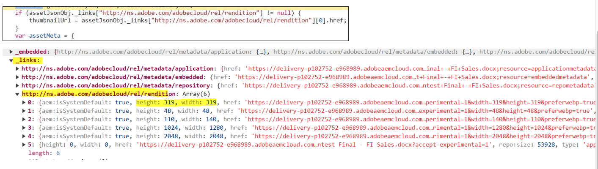

# Intégration pour Dynamic Media avec les fonctionnalités OpenAPI {#integrate-asset-selector-dynamic-media-open-apis}

Le sélecteur de ressources vous permet d’intégrer à l’aide de diverses applications Adobe afin de leur permettre de travailler ensemble de manière transparente.


## Conditions préalables {#prereqs-polaris}

Utilisez les conditions préalables suivantes si vous intégrez le sélecteur de ressources à Dynamic Media avec les fonctionnalités OpenAPI :

* [Méthodes de communication](/help/assets/overview-asset-selector.md#prereqs)
* Pour accéder à Dynamic Media avec des fonctionnalités OpenAPI, vous devez disposer de licences pour :
   * Référentiel Assets (as a Cloud Service Experience Manager Assets, par exemple).
   * AEM Dynamic Media.
* Seules les [ressources approuvées](/help/assets/approve-assets.md) peuvent être utilisées pour assurer la cohérence de la marque.

## Intégration pour Dynamic Media avec les fonctionnalités OpenAPI {#adobe-app-integration-polaris}

L’intégration du sélecteur de ressources avec le processus Dynamic Media OpenAPI implique différentes étapes, notamment la création d’une URL Dynamic Media personnalisée ou la sélection d’une URL Dynamic Media, etc.

### Intégration du sélecteur de ressources pour Dynamic Media avec les fonctionnalités OpenAPI {#integrate-dynamic-media}

Les propriétés `rootPath` et `path` ne doivent pas faire partie des fonctionnalités Dynamic Media avec OpenAPI . Vous pouvez plutôt configurer la propriété `aemTierType`. Voici la syntaxe de la configuration :

```
aemTierType:[1: "delivery"]
```

Cette configuration vous permet d’afficher toutes les ressources approuvées sans dossiers ou sous la forme d’une structure plate. Pour plus d’informations, accédez à la propriété `aemTierType` sous [Propriétés du sélecteur de ressources](/help/assets/asset-selector-properties.md).


### Création d’une URL de diffusion dynamique à partir des ressources approuvées {#create-dynamic-media-url}

Une fois que vous avez configuré le sélecteur de ressources, un schéma d’objets est utilisé pour créer une URL de diffusion dynamique à partir des ressources sélectionnées.
Par exemple, un schéma d’un objet d’un tableau d’objets reçu lors de la sélection d’une ressource :

```
{
"dc:format": "image/jpeg",
"repo:assetId": "urn:aaid:aem:xxxxxxxx-xxxx-xxxx-xxxx-xxxxxxxxxxxx",
"repo:name": "image-7.jpg",
"repo:repositoryId": "delivery-pxxxx-exxxxxx.adobe.com",
...
}
```

Toutes les ressources sélectionnées sont transportées par la fonction `handleSelection` qui agit comme un objet JSON. Par exemple, `JsonObj`. L&#39;URL de diffusion dynamique est créée en combinant les opérateurs suivants :

| Objet | JSON |
|---|---|
| Hôte | `assetJsonObj["repo:repositoryId"]` |
| Racine de l’API | `/adobe/dynamicmedia/deliver` |
| asset-id | `assetJsonObj["repo:assetId"]` |
| seo-name | `assetJsonObj["repo:name"].split(".").slice(0,-1).join(".")` |
| format | `.jpg` |

#### Spécification de l’API de diffusion des ressources approuvées {#approved-assets-delivery-api-specification}

Format d’URL :
`https://<delivery-api-host>/adobe/dynamicmedia/deliver/<asset-id>/<seo-name>.<format>?<image-modification-query-parameters>`

Où,

* L’hôte est `https://delivery-pxxxxx-exxxxxx.adobe.com`
* La racine de l’API est `"/adobe/dynamicmedia/deliver"`
* `<asset-id>` est l’identifiant de ressource
* `<seo-name>` est le nom d’une ressource
* `<format>` est le format de sortie
* `<image modification query parameters>` comme prise en charge par la spécification de l’API de diffusion des ressources approuvées

#### API de diffusion des ressources approuvées {#approved-assets-delivery-api}

L&#39;URL de diffusion dynamique présente la syntaxe suivante :
`https://<delivery-api-host>/adobe/assets/deliver/<asset-id>/<seo-name>`, où,

* L’hôte est `https://delivery-pxxxxx-exxxxxx.adobe.com`
* La racine de l’API pour la diffusion du rendu original est `"/adobe/assets/deliver"`.
* `<asset-id>` est l’identifiant de ressource
* `<seo-name>`est le nom de la ressource qui peut avoir ou ne pas avoir d’extension

### Prêt à sélectionner l’URL de diffusion dynamique {#ready-to-pick-dynamic-delivery-url}

Toutes les ressources sélectionnées sont transportées par la fonction `handleSelection` qui agit comme un objet JSON. Par exemple, `JsonObj`. L&#39;URL de diffusion dynamique est créée en combinant les opérateurs suivants :

| Objet | JSON |
|---|---|
| Hôte | `assetJsonObj["repo:repositoryId"]` |
| Racine de l’API | `/adobe/assets/deliver` |
| asset-id | `assetJsonObj["repo:assetId"]` |
| seo-name | `assetJsonObj["repo:name"]` |

Vous trouverez ci-dessous les deux manières de parcourir l’objet JSON :



* **Miniature :** Les miniatures peuvent être des images et les ressources sont PDF, vidéo, images, etc. Vous pouvez toutefois utiliser les attributs de hauteur et de largeur de la miniature d’une ressource comme rendu de diffusion dynamique.
L’ensemble de rendus suivant peut être utilisé pour les ressources de type PDF :
Une fois qu’un pdf est sélectionné dans le sidekick, le contexte de sélection fournit les informations suivantes. Vous trouverez ci-dessous la manière de parcourir l’objet JSON :

  <!---->

  Vous pouvez vous reporter à `selection[0].....selection[4]` pour le tableau de lien de rendu de la capture d’écran ci-dessus. Par exemple, les propriétés clés de l’un des rendus de miniature sont les suivantes :

  ```
  { 
      "height": 319, 
      "width": 319, 
      "href": "https://delivery-pxxxxx-exxxxx-cmstg.adobeaemcloud.com/adobe/assets/urn:aaid:aem:8560f3a1-d9cf-429d-a8b8-d81084a42d41/as/algorithm design.jpg?accept-experimental=1&width=319&height=319&preferwebp=true", 
      "type": "image/webp" 
  } 
  ```

Dans la capture d’écran ci-dessus, l’URL de diffusion du rendu d’origine du PDF doit être incorporée dans l’expérience cible si PDF est requis et non sa miniature. Par exemple, `https://delivery-pxxxxx-exxxxx-cmstg.adobeaemcloud.com/adobe/assets/urn:aaid:aem:8560f3a1-d9cf-429d-a8b8-d81084a42d41/original/as/algorithm design.pdf?accept-experimental=1`.

* **Vidéo :** Vous pouvez utiliser l’URL du lecteur vidéo pour les ressources de type vidéo qui utilisent un iFrame incorporé. Vous pouvez utiliser les rendus de tableau suivants dans l’expérience cible :
  <!---->

  ```
  { 
      "height": 319, 
      "width": 319, 
      "href": "https://delivery-pxxxxx-exxxxx-cmstg.adobeaemcloud.com/adobe/assets/urn:aaid:aem:2fdef732-a452-45a8-b58b-09df1a5173cd/as/asDragDrop.2.jpg?accept-experimental=1&width=319&height=319&preferwebp=true", 
      "type": "image/webp" 
  } 
  ```

  Vous pouvez vous reporter à `selection[0].....selection[4]` pour le tableau de lien de rendu de la capture d’écran ci-dessus. Par exemple, les propriétés clés de l’un des rendus de miniature sont les suivantes :

  Le fragment de code de la capture d’écran ci-dessus est un exemple de ressource vidéo. Elle inclut le tableau de liens de rendus. `selection[5]` dans l’extrait est l’exemple de miniature d’image qui peut être utilisé comme espace réservé de miniature vidéo dans l’expérience cible. Le `selection[5]` du tableau des rendus est destiné au lecteur vidéo. Il sert un HTML et peut être défini comme `src` de l’iframe. Il prend en charge la diffusion en continu à débit adaptatif qui est une diffusion de la vidéo optimisée pour le web.

  Dans l’exemple ci-dessus, l’URL du lecteur vidéo est `https://delivery-pxxxxx-exxxxx-cmstg.adobeaemcloud.com/adobe/assets/urn:aaid:aem:2fdef732-a452-45a8-b58b-09df1a5173cd/play?accept-experimental=1`

### Configuration des filtres personnalisés {#configure-custom-filters-dynamic-media-open-api}

Le sélecteur de ressources pour Dynamic Media avec les fonctionnalités OpenAPI vous permet de configurer des propriétés personnalisées et des filtres en fonction de celles-ci. La propriété `filterSchema` est utilisée pour configurer ces propriétés. La personnalisation peut être exposée sous la forme `metadata.<metadata bucket>.<property name>.` sur laquelle les filtres peuvent être configurés, où,

* `metadata` est l’information d’une ressource
* `embedded` est le paramètre statique utilisé pour la configuration, et
* `<propertyname>` est le nom du filtre que vous configurez.

Pour la configuration, les propriétés définies au niveau de `jcr:content/metadata/` sont exposées sous la forme `metadata.<metadata bucket>.<property name>.` pour les filtres que vous souhaitez configurer.

Par exemple, dans le sélecteur de ressources pour Dynamic Media avec les fonctionnalités OpenAPI, une propriété sur `asset jcr:content/metadata/client_name:market` est convertie en `metadata.embedded.client_name:market` pour la configuration des filtres.

Pour obtenir le nom, une activité unique doit être effectuée. Effectuez un appel API de recherche pour la ressource et obtenez le nom de la propriété (le compartiment, essentiellement).

### Interface utilisateur du sélecteur de ressources pour Dynamic Media avec fonctionnalités OpenAPI {#interface-dynamic-media-open-api}

Une fois l’intégration avec le sélecteur de ressources Micro-Frontend de l’Adobe effectuée, vous pouvez afficher la structure des ressources uniquement de toutes les ressources approuvées disponibles dans le référentiel de ressources Experience Manager.


* **A** : [masquer/afficher le panneau](#hide-show-panel)
* **B** : [Assets](#repository)
* **C** : [Tri](#sorting)
* **D** : [filtres](#filters)
* **E** : [barre de recherche](#search-bar)
* **F** : [Tri par ordre croissant ou décroissant](#sorting)
* **G** : Annuler la sélection
* **H** : sélectionnez une ou plusieurs ressources

>[!MORELIKETHIS]
>
>* [Intégrer le sélecteur de ressources à diverses applications](/help/assets/integrate-asset-selector.md)
>* [Propriétés du sélecteur de ressources](/help/assets/asset-selector-properties.md)
>* [Personnalisations du sélecteur de ressources](/help/assets/asset-selector-customization.md)
