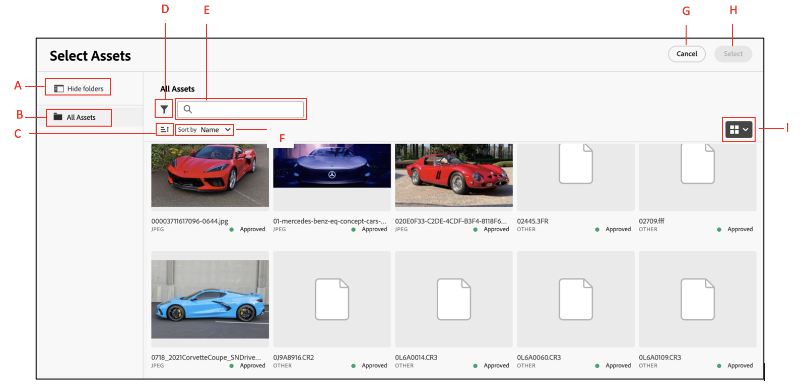

# Intégration de Dynamic Media aux fonctionnalités OpenAPI {#integrate-asset-selector-dynamic-media-open-apis}

Le sélecteur de ressources vous permet de les intégrer à l’aide de diverses applications Adobe afin de leur permettre de travailler ensemble en toute transparence.

## Prérequis {#prereqs-polaris}

Utilisez les conditions préalables suivantes si vous intégrez le sélecteur de ressources à Dynamic Media avec des fonctionnalités OpenAPI :

* [Méthodes de communication](/help/assets/overview-asset-selector.md#prereqs)
* Pour accéder à Dynamic Media avec des fonctionnalités OpenAPI, vous devez disposer de licences pour :
   * Référentiel Assets (par exemple, Experience Manager Assets as a Cloud Service).
   * AEM Dynamic Media.
* Seules les ressources [&#x200B; approuvées &#x200B;](/help/assets/approve-assets.md) peuvent être utilisées pour garantir la cohérence de la marque.

## Intégration de Dynamic Media aux fonctionnalités OpenAPI {#adobe-app-integration-polaris}

L’intégration du sélecteur de ressources avec le processus OpenAPI Dynamic Media implique différentes étapes, notamment la création d’une URL Dynamic Media personnalisée ou l’obtention d’une URL Dynamic Media prête à être sélectionnée, etc.

### Intégrer le sélecteur de ressources pour Dynamic Media aux fonctionnalités OpenAPI {#integrate-dynamic-media}

Les propriétés `rootPath` et `path` ne doivent pas faire partie de Dynamic Media avec les fonctionnalités OpenAPI. Vous pouvez plutôt configurer la propriété `aemTierType` . Voici la syntaxe de la configuration :

```
aemTierType:[1: "delivery"]
```

Cette configuration vous permet d’afficher toutes les ressources approuvées sans dossiers ou sous la forme d’une structure plate. Pour plus d’informations, accédez à `aemTierType` propriété sous [Propriétés du sélecteur de ressources](/help/assets/asset-selector-properties.md).


### Création d’une URL de diffusion dynamique à partir de ressources approuvées {#create-dynamic-media-url}

Une fois que vous avez configuré le sélecteur de ressources, un schéma d’objets est utilisé pour créer une URL de diffusion dynamique à partir des ressources sélectionnées.
Par exemple, le schéma d’un objet d’un tableau d’objets reçu lors de la sélection d’une ressource :

```
{
"dc:format": "image/jpeg",
"repo:assetId": "urn:aaid:aem:xxxxxxxx-xxxx-xxxx-xxxx-xxxxxxxxxxxx",
"repo:name": "image-7.jpg",
"repo:repositoryId": "delivery-pxxxx-exxxxxx.adobe.com",
...
}
```

Toutes les ressources sélectionnées sont transportées par `handleSelection` fonction qui agit comme un objet JSON. Par exemple, `JsonObj`. L’URL de diffusion dynamique est créée en combinant les opérateurs ci-dessous :

| Objet | JSON |
|---|---|
| Hôte | `assetJsonObj["repo:repositoryId"]` |
| Racine de l’API | `/adobe/assets` |
| asset-id | `assetJsonObj["repo:assetId"]` |
| seo-name | `assetJsonObj["repo:name"].split(".").slice(0,-1).join(".")` |
| format | `.jpg` |

#### Spécification de l’API de diffusion des ressources approuvées {#approved-assets-delivery-api-specification}

Format de l&#39;URL :
`https://<delivery-api-host>/adobe/assets/<asset-id>/as/<seo-name>.<format>?<image-modification-query-parameters>`

Où,

* L’hôte est `https://delivery-pxxxxx-exxxxxx.adobe.com`
* La racine de l’API est `"/adobe/assets"`
* `<asset-id>` est l’identifiant de la ressource
* `as` est la partie constante de la spécification d’API ouverte indiquant comment la ressource doit être appelée
* `<seo-name>` est le nom d’une ressource
* `<format>` est le format de sortie
* `<image modification query parameters>` pris en charge par la spécification de l’API de diffusion des ressources approuvées

#### API de diffusion de rendu d’origine des ressources approuvées {#approved-assets-delivery-api}

L’URL de diffusion dynamique possède la syntaxe suivante :
`https://<delivery-api-host>/adobe/assets/<asset-id>/original/as/<seo-name>`, où,

* L’hôte est `https://delivery-pxxxxx-exxxxxx.adobe.com`
* La racine de l’API pour la diffusion du rendu original est `"/adobe/assets"`.
* `<asset-id>` est l’identifiant de la ressource
* `/original/as` est la partie constante de la spécification d’API ouverte indiquant ce que le rendu d’origine doit être appelé
* `<seo-name>`est le nom de la ressource qui peut ou non avoir une extension

### Prêt à choisir l’URL de diffusion dynamique {#ready-to-pick-dynamic-delivery-url}

Toutes les ressources sélectionnées sont transportées par `handleSelection` fonction qui agit comme un objet JSON. Par exemple, `JsonObj`. L’URL de diffusion dynamique est créée en combinant les opérateurs ci-dessous :

| Objet | JSON |
|---|---|
| Hôte | `assetJsonObj["repo:repositoryId"]` |
| Racine de l’API | `/adobe/assets` |
| asset-id | `assetJsonObj["repo:assetId"]` |
| seo-name | `assetJsonObj["repo:name"]` |

Vous trouverez ci-dessous les deux façons de parcourir l’objet JSON :


* **Miniature :** les miniatures peuvent être des images et les ressources sont des PDF, des vidéos, des images, etc. Vous pouvez toutefois utiliser les attributs de hauteur et de largeur de la miniature d’une ressource comme rendu de diffusion dynamique.
L’ensemble de rendus suivant peut être utilisé pour les ressources de type PDF :
Une fois qu’un PDF est sélectionné dans le sidekick, le contexte de sélection propose les informations ci-dessous. Vous trouverez ci-dessous la manière de parcourir l’objet JSON :

  <!---->

  Vous pouvez vous reporter à `selection[0].....selection[4]` pour le tableau du lien de rendu à partir de la capture d’écran ci-dessus. Par exemple, les propriétés de clé de l’un des rendus de miniature sont les suivantes :

  ```
  { 
      "height": 319, 
      "width": 319, 
      "href": "https://delivery-pxxxxx-exxxxx.adobeaemcloud.com/adobe/assets/urn:aaid:aem:8560f3a1-d9cf-429d-a8b8-d81084a42d41/as/algorithm design.jpg?width=319&height=319", 
      "type": "image/webp" 
  } 
  ```

Dans la capture d’écran ci-dessus, l’URL de diffusion du rendu original PDF doit être incorporée dans l’expérience cible si PDF est requis, et non sa miniature. Par exemple, `https://delivery-pxxxxx-exxxxx.adobeaemcloud.com/adobe/assets/urn:aaid:aem:8560f3a1-d9cf-429d-a8b8-d81084a42d41/original/as/algorithm design.pdf`.

* **Vidéo :** vous pouvez utiliser l’URL du lecteur vidéo pour les ressources de type vidéo qui utilisent un iFrame incorporé. Vous pouvez utiliser les rendus de tableau suivants dans l’expérience cible :
  <!---->

  ```
  { 
      "height": 319, 
      "width": 319, 
      "href": "https://delivery-pxxxxx-exxxxx.adobeaemcloud.com/adobe/assets/urn:aaid:aem:2fdef732-a452-45a8-b58b-09df1a5173cd/as/DragDrop.2.jpg?width=319&height=319", 
      "type": "image/webp" 
  } 
  ```

  Vous pouvez vous reporter à `selection[0].....selection[4]` pour le tableau du lien de rendu à partir de la capture d’écran ci-dessus. Par exemple, les propriétés de clé de l’un des rendus de miniature sont les suivantes :

  L’extrait de code de la capture d’écran ci-dessus est un exemple de ressource vidéo. Il comprend un tableau de liens de rendus. La `selection[5]` dans l’extrait est l’exemple de miniature d’image qui peut être utilisée comme espace réservé de la miniature vidéo dans l’expérience cible. La `selection[5]` dans le tableau des rendus est pour le lecteur vidéo. Elle sert d’HTML et peut être définie comme `src` de l’iframe. Il prend en charge la diffusion en continu à débit adaptatif, qui est une diffusion de la vidéo optimisée pour le web.

  Dans l’exemple ci-dessus, l’URL du lecteur vidéo est `https://delivery-pxxxxx-exxxxx.adobeaemcloud.com/adobe/assets/urn:aaid:aem:2fdef732-a452-45a8-b58b-09df1a5173cd/play`

### Configuration de filtres personnalisés {#configure-custom-filters-dynamic-media-open-api}

Le sélecteur de ressources pour Dynamic Media avec les fonctionnalités OpenAPI vous permet de configurer des propriétés personnalisées et des filtres basés sur celles-ci. La propriété `filterSchema` est utilisée pour configurer ces propriétés. La personnalisation peut être exposée en tant que `metadata.<metadata bucket>.<property name>.` par rapport auxquelles les filtres peuvent être configurés, où,

* `metadata` est l’information d’une ressource
* `embedded` est le paramètre statique utilisé pour la configuration, et
* `<propertyname>` est le nom du filtre que vous configurez

Pour la configuration, les propriétés définies au niveau de l’`jcr:content/metadata/` sont exposées comme `metadata.<metadata bucket>.<property name>.` pour les filtres que vous souhaitez configurer.

Par exemple, dans le sélecteur de ressources pour Dynamic Media avec les fonctionnalités OpenAPI , une propriété sur `asset jcr:content/metadata/client_name:market` est convertie en `metadata.embedded.client_name:market` pour la configuration des filtres.

Pour obtenir le nom, une activité unique doit être effectuée. Effectuez un appel API de recherche pour la ressource et obtenez le nom de la propriété (le compartiment, essentiellement).

### Interface utilisateur du sélecteur de ressources pour Dynamic Media avec les fonctionnalités OpenAPI {#interface-dynamic-media-open-api}

Après l’intégration au sélecteur de ressources micro front-end d’Adobe, vous ne pouvez voir que la structure de toutes les ressources approuvées disponibles dans le référentiel de ressources Experience Manager.



* **A** : masquer/afficher le panneau
* **B** : ASSETS
* **C** : tri
* **D** : filtres
* **E** : barre de recherche
* **F** : tri par ordre croissant ou décroissant
* **G** : Annuler la sélection
* **H** : sélectionner une ou plusieurs ressources

>[!NOTE]
>
>Les dossiers sont uniquement pris en charge lors de la connexion au référentiel de création, et non dans Dynamic Media avec le référentiel OpenAPI.

>[!MORELIKETHIS]
>
>* [Intégration du sélecteur de ressources à diverses applications](/help/assets/integrate-asset-selector.md)
>* [Propriétés du sélecteur de ressources](/help/assets/asset-selector-properties.md)
>* [Personnalisation du sélecteur de ressources](/help/assets/asset-selector-customization.md)
