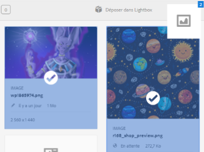

# Lightbox {#lightbox}

Lightbox est un type spécial de collection privée ou de galerie d’images. AEM vous permet d’ajouter ou de supprimer rapidement des fichiers de Lightbox et d’y accéder facilement. Il sert de galerie d’images personnelle.

Si vous êtes utilisateur Adobe Experience Manager Assets, Lightbox est créé automatiquement la première fois que vous vous connectez à l’application. Il est exclusif à votre connexion. Les autres utilisateurs ne peuvent pas accéder à votre Lightbox.

## Ajout de ressources à Lightbox {#add-assets-to-lightbox}

1. Dans l’interface utilisateur Assets, sélectionnez les ressources que vous souhaitez ajouter à Lightbox.
1. Faites glisser les ressources jusqu’à la zone **[!UICONTROL Déposer dans Lightbox]**. Relâchez lorsque la zone de dépôt devient active et que le libellé se transforme en **[!UICONTROL Déposer pour ajouter]**.

   

1. Dans la boîte de dialogue, appuyez/cliquez sur **[!UICONTROL Ajouter]**, puis fermez-la pour terminer le processus. Les ressources sélectionnées sont ajoutées à Lightbox.
1. Pour afficher Lightbox, accédez à la console Collections.
1. Appuyez/cliquez sur **[!UICONTROL Lightbox]** pour afficher les ressources qu’il contient.

   >[!NOTE]
   >
   >Bien que Lightbox ressemble à une collection, vous ne pouvez pas effectuer les actions que vous effectuez normalement sur les collections. Par exemple, vous ne pouvez pas supprimer, partager ou afficher des paramètres pour une Lightbox. Vous ne pouvez pas non plus l’ajouter à d’autres collections. Néanmoins, vous pouvez modifier les ressources d’une Lightbox.

## Suppression de ressources dans Lightbox {#removing-assets-from-lightbox}

1. Accédez à la console Collections, puis appuyez/cliquez sur Lightbox pour en afficher les ressources.
1. Sélectionnez les ressources à supprimer.
1. Dans la barre d’outils, appuyez/cliquez sur **[!UICONTROL Supprimer]**.
1. Dans la boîte de dialogue, appuyez/cliquez sur **[!UICONTROL Supprimer]** pour confirmer la suppression. Les ressources sont supprimées de Lightbox.
