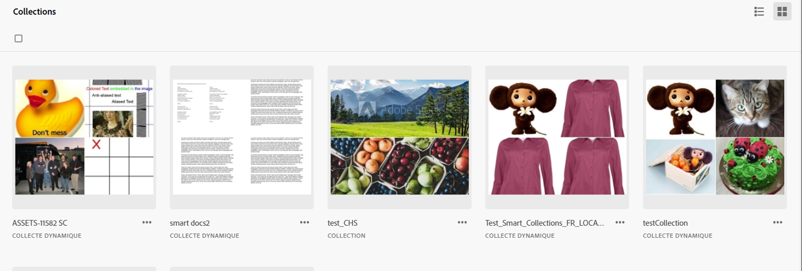
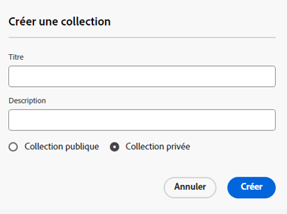
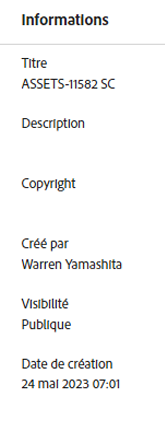
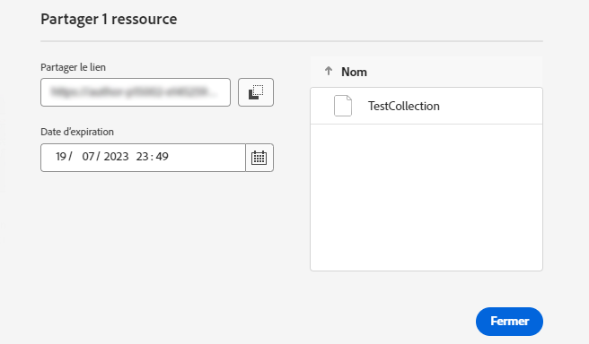

# Gestion des collections {#manage-collections}

>[!CONTEXTUALHELP]
>id="assets_collections"
>title="Gérer les collections"
>abstract="Une collection est un ensemble de ressources, de dossiers ou d’autres collections au sein de la vue Ressources. Vous pouvez utiliser des collections pour partager des ressources entre utilisateurs et utilisatrices. Contrairement aux dossiers, une collection peut comporter des ressources provenant de différents emplacements. Vous pouvez partager plusieurs collections avec un utilisateur ou une utilisatrice. Chaque collection contient des références aux ressources. L’intégrité du référentiel des ressources est préservée dans les collections."

Une collection est un ensemble de ressources, de dossiers ou d’autres collections de la vue Adobe Experience Manager Assets. Vous pouvez utiliser des collections pour partager des ressources entre utilisateurs.

Contrairement aux dossiers, une collection peut comporter des ressources provenant de différents emplacements.

<!--
You can share collections with various users that are assigned different levels of privileges, including viewing, editing, and so on.
-->

Vous pouvez partager plusieurs collections avec un utilisateur ou une utilisatrice. Chaque collection contient des références aux ressources. L’intégrité du référentiel des ressources est préservée dans les collections.

Vous pouvez effectuer les tâches suivantes pour gérer et utiliser les collections :

* [Création d’une collection](#create-collection)

* [Ajout de ressources à une collection](#add-assets-to-collection)

* [Supprimer les ressources d’une collection](#remove-assets-from-collection)

* [Créer une collection dynamique](#create-smart-collection)

* [Modifier une collection dynamique](#edit-smart-collection)

* [Afficher et modifier des métadonnées de collection](#view-edit-collection-metadata)

* [Partager des liens vers des collections](#share-collection-links)

* [Téléchargement d’une collection](#download-collection)

* [Suppression d’une collection](#delete-collection)

## Création d’une collection {#create-collection}

Pour créer une collection :

1. Cliquez sur **[!UICONTROL Collections]** dans le rail de gauche, puis cliquez sur **[!UICONTROL Créer une collection]**.

1. Entrez un titre et éventuellement une description pour la collection.

1. Sélectionnez cette option si vous devez créer une collection privée ou publique. Une collection publique peut être consultée et modifiée par tous les utilisateurs. Cependant, une collection privée ne peut être consultée que par le créateur et les utilisateurs disposant de droits d’administrateur.

1. Cliquez sur **[!UICONTROL Créer]** pour créer la collection.

<!--
   
   for viewing and editing only to users with the appropriate [permissions](#manage-collection-access).

-->

## Ajout de ressources à une collection {#add-assets-to-collection}

Pour ajouter des ressources à une collection :

1. Cliquez sur **[!UICONTROL Ressources]** dans le rail de gauche et sélectionnez les ressources à ajouter à une collection.

1. Cliquez sur **[!UICONTROL Ajouter à la collection]**.

1. Dans la boîte de dialogue des [!UICONTROL Collections], sélectionnez les collections pour ajouter les ressources sélectionnées.

1. Cliquez sur **[!UICONTROL Ajouter]** pour ajouter la ressource aux collections sélectionnées.

## Suppression de ressources d’une collection {#remove-assets-from-collection}

Pour supprimer des ressources d’une collection :

1. Cliquez sur **[!UICONTROL Collections]** dans le rail de gauche pour afficher la liste des collections.

1. Cliquez sur la collection et sélectionnez les éléments à supprimer de la collection.

1. Cliquez sur **[!UICONTROL Supprimer]**.

## Gérer une collection dynamique {#manage-smart-collection}

Enregistrez les résultats de recherche en tant que collection dynamique pour mettre à jour dynamiquement le contenu de la collection. Si des ressources sont ajoutées au référentiel de la vue Assets et que celles-ci correspondent aux critères de recherche définis lors de la création de la collecte dynamique, le contenu de cette dernière est automatiquement mis à jour lorsque vous ouvrez une collecte dynamique.

### Créer une collection dynamique {#create-smart-collection}

Pour créer une collection dynamique, procédez comme suit :

1. Cliquez sur **[!UICONTROL Filtrer]** et [Définir les critères de recherche](search-assets-view.md#refine-search-results).

1. Cliquez sur **[!UICONTROL Enregistrer sous]** puis sélectionnez **[!UICONTROL Collection dynamique]**.

   

1. Sur la boîte de dialogue [!UICONTROL Créer une collection dynamique], spécifiez un titre et une description pour la collecte dynamique.

1. Sélectionnez **[!UICONTROL Collection publique]** si vous souhaitez que tous les utilisateurs puissent accéder à la collection. Sélectionnez **[!UICONTROL Collection privée]** si vous préférez qu’un groupe restreint d’utilisateurs ait accès à la collection.

1. Cliquez sur **[!UICONTROL Créer]** pour créer la collection dynamique.

### Modifier une collection dynamique {#edit-smart-collection}

Pour modifier une collection dynamique, procédez comme suit :

1. Cliquez sur **[!UICONTROL Collections]** dans le rail de gauche, puis double-cliquez sur le nom de la collection à modifier.

1. Cliquez sur **[!UICONTROL Modif. collection dynam.]**.

1. Dans la boîte de dialogue [!UICONTROL Modification des filtres de collection dynamique], [mettez à jour les critères de recherche](search-assets-view.md#refine-search-results) de la collection dynamique.

1. Cliquez sur **[!UICONTROL Enregistrer]**.

<!--

## Manage access to a Private collection {#manage-collection-access}

The permission management for collections function in the same manner as folders in [!DNL Assets view]. Administrators can manage the access levels for collections available in the repository. As an administrator, you can create user groups and assign permissions to those groups to manage access levels. You can also delegate the permission management privileges to user groups at the collection-level.

For more information, see [Manage permissions for folders and collections](manage-permissions.md).

-->

<!--

## Search a collection {#search-collections}

Click **[!UICONTROL Collections]** in the left rail and use the Search box to specify a text as the criteria to search for a collection. [!DNL Assets view] uses the specified text to search collection names, metadata including tags defined for a collection and returns appropriate results.

>[!NOTE]
>
>Assets view performs search in collections available at the root level. It does not perform search in assets and folders available in collections.

-->

## Affichage et modification des métadonnées {#view-edit-collection-metadata}

Les métadonnées de collection comprennent des informations sur la collection, telles que le titre et la description.

Pour afficher et modifier les métadonnées :

1. Cliquez sur **[!UICONTROL Collections]** dans le rail de gauche, sélectionnez une collection, puis cliquez sur **[!UICONTROL Détails]**.
1. Affichez les métadonnées de la collection à l’aide de l’onglet **[!UICONTROL De base]**.
1. Modifiez les champs de métadonnées selon les besoins. Vous pouvez modifier le [!UICONTROL Titre] et la [!UICONTROL Description].

## Partage de liens vers des collections {#share-collection-links}

[!DNL Assets view] vous permet de générer un lien et de partager des collections de ressources avec des destinataires externes qui n’ont pas accès à l’application [!DNL Assets view]. Vous pouvez définir une date d’expiration pour le lien, puis le partager avec d’autres utilisateurs en utilisant votre méthode de communication préférée, comme les e-mails ou les services de messagerie. Les destinataires du lien peuvent prévisualiser les ressources et les télécharger.

Pour plus d’informations sur le partage de liens de collection avec des destinataires externes, consultez [Partager les liens vers des ressources](/help/assets/share-links-for-assets-view.md).

## Télécharger une collection {#download-collection}

Pour télécharger une collection :

1. Cliquez sur **[!UICONTROL Collections]** dans le rail de gauche.

1. Sélectionnez la collection à télécharger, puis cliquez sur **[!UICONTROL Télécharger]**.

1. Dans la boîte de dialogue [!UICONTROL Télécharger la ressource], cliquez sur **[!UICONTROL OK]**.

La collection est téléchargée en tant que fichier .ZIP sur votre ordinateur local.

## Suppression d’une collection {#delete-collection}

Pour supprimer une collection, procédez comme suit :

1. Cliquez sur **[!UICONTROL Collections]** dans le rail de gauche.

1. Sélectionnez la collection que vous devez supprimer.

1. Cliquez sur **[!UICONTROL Supprimer]**.

## Étapes suivantes {#next-steps}

* Faites des commentaires sur le produit en utilisant l’option [!UICONTROL Commentaires] disponible dans l’interface utilisateur de la vue Assets

* Faites des commentaires sur la documentation en utilisant l’option [!UICONTROL Modifier cette page]  ou [!UICONTROL Enregistrer un problème]  disponible dans la barre latérale droite.

* Contactez l’[assistance clientèle](https://experienceleague.adobe.com/?support-solution=General&amp;lang=fr#support).
