# Gestion des ressources {#manage-assets}

Cet article explique comment gérer et modifier les ressources dans Adobe Experience Manager (AEM) Assets. Pour gérer les fragments de contenu, voir les ressources [Fragments de contenu](content-fragments/content-fragments.md).

## Création de dossiers {#creating-folders}

Lorsque vous organisez une collection de ressources, comme toutes les images `Nature`, vous pouvez créer des dossiers pour les conserver ensemble. Vous pouvez utiliser des dossiers pour classer et organiser vos ressources. AEM Assets ne nécessite pas de classer les ressources dans des dossiers pour mieux fonctionner.

>[!NOTE]
>
>* Le partage d’un dossier de ressources du type `sling:OrderedFolder` n’est pas pris en charge lors du partage vers Marketing Cloud. Si vous souhaitez partager un dossier, ne sélectionnez pas [!UICONTROL Ordonné] lors de la création du dossier.
>* Experience Manager n’autorise pas l’utilisation de `subassets` mot comme nom d’un dossier. Il s’agit d’un mot-clé réservé au noeud qui contient des sous-ressources pour les ressources composées.

1. Dans le dossier Ressources numériques, accédez à l’emplacement où vous souhaitez créer un dossier. Dans le menu, cliquez sur **[!UICONTROL Créer]**. Sélectionnez **[!UICONTROL Nouveau dossier]**.
1. Dans le champ **[!UICONTROL Titre]**, indiquez le nom du dossier. Par défaut, DAM utilise le titre que vous avez fourni comme nom du dossier. Une fois le dossier créé, vous pouvez remplacer le nom par défaut et entrer un autre nom de dossier.
1. Cliquez sur **[!UICONTROL Créer]**. Le dossier apparaît dans le dossier Ressources numériques.

Les caractères suivants (liste de ceux-ci séparés par des espaces) ne sont pas pris en charge :

* Le nom d’un fichier de ressource ne peut pas contenir les caractères suivants : `* / : [ \\ ] | # % { } ? &`
* Le nom d’un dossier de ressources ne peut pas contenir les caractères suivants : `* / : [ \\ ] | # % { } ? \" . ^ ; + & \t`

## Chargement des ressources {#uploading-assets}

Pour plus d’informations, voir [Ajout d’actifs numériques à Experience Manager](add-assets.md).

## Aperçu des ressources {#previewing-assets}

Pour prévisualiser une ressource, procédez comme suit.

1. Dans l’interface utilisateur d’Assets, accédez à l’emplacement de la ressource à prévisualiser.
1. Appuyez sur la ressource concernée pour l’ouvrir.

1. En mode Aperçu, les options de zoom sont disponibles pour les [types d’images pris en charge](/help/assets/file-format-support.md) (avec modification interactive).

   Pour effectuer un zoom avant sur une ressource, appuyez/cliquez sur `+` (ou appuyez/cliquez sur la loupe au niveau de la ressource). Pour effectuer un zoom arrière, appuyez/cliquez sur `-`. Lorsque vous effectuez un zoom avant, vous pouvez observer en détail une zone de l’image en réalisant un panoramique. La flèche de réinitialisation du zoom rétablit la vue initiale.

   Appuyez sur **[!UICONTROL Réinitialiser]** pour réinitialiser la vue à sa taille d’origine.

## Modification des propriétés {#editing-properties}

1. Accédez à l’emplacement de la ressource dont vous souhaitez modifier les métadonnées.

1. Sélectionnez la ressource et appuyez/cliquez sur **[!UICONTROL Propriétés]** dans la barre d’outils pour afficher ses propriétés. Vous pouvez également sélectionner l’action rapide **[!UICONTROL Propriétés]** sur la carte de la ressource.

   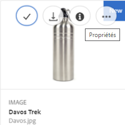

1. Sur la page [!UICONTROL Propriétés], modifiez les propriétés de métadonnées sous différents onglets. Par exemple, sous l’onglet **[!UICONTROL De base]**, modifiez le titre, la description et ainsi de suite.

   >[!NOTE]
   >
   >La disposition de la page [!UICONTROL Propriétés] et les propriétés des métadonnées disponibles dépendent du schéma de métadonnées sous-jacent. Pour savoir comment modifier la disposition de la page [!UICONTROL Propriétés], voir [Schémas des métadonnées](/help/assets/metadata-schemas.md).

1. Pour planifier une date/heure spécifique pour l’activation de la ressource, utilisez le sélecteur de date situé en regard du champ **[!UICONTROL Heure d’activation]**.

   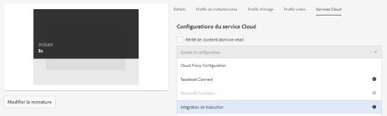

1. Pour désactiver la ressource après une durée spécifique, choisissez la date/l’heure de désactivation du sélecteur de date en regard du champ **[!UICONTROL Heure de désactivation]**. La date de désactivation doit être postérieure à la date d’activation de la ressource. Après l’[!UICONTROL heure de désactivation], une ressource et ses rendus ne sont plus disponibles via l’interface web Ressources ou via l’API HTTP.

   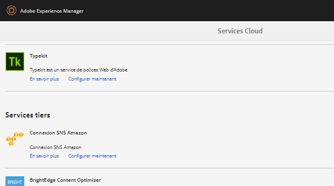

1. Sélectionnez une ou plusieurs balises dans le champ **[!UICONTROL Balises]**. Pour ajouter une balise personnalisée, saisissez le nom de la balise dans la zone et appuyez sur la touche Entrée. La nouvelle balise est enregistrée dans AEM.

   YouTube requiert que les balises soient publiées et comportent un lien vers YouTube (si un lien approprié peut être trouvé).

   >[!NOTE]
   >
   >Pour créer des balises, vous devez disposer d’une autorisation d’écriture sur le `/content/cq:tags/default` chemin d’accès dans le référentiel CRX.

1. Pour afficher les statistiques d’utilisation de la ressource, cliquez/appuyez sur l’onglet **[!UICONTROL Statistiques]**.

   Les statistiques d’utilisation comprennent les suivantes :

   * Le nombre de fois que la ressource a été visualisée ou téléchargée.
   * Les canaux/périphériques via lesquels la ressource a été utilisée.
   * Des solutions de création où la ressource a été récemment utilisée.
   Pour plus d’informations, reportez-vous à la section [Informations sur les ressources](assets-insights.md).

1. Appuyez/cliquez sur **[!UICONTROL Enregistrer et fermer]**.

1. Accédez à l’interface utilisateur d’Assets. Les propriétés de métadonnées modifiées, y compris le titre, la description et les balises, s’affichent sur la carte de ressources dans le  Carte et sous les colonnes appropriées dans le  de.

## Copie de ressources {#copying-assets}

Lorsque vous copiez une ressource ou un dossier, l’intégralité de la ressource ou le dossier sont copiés, avec la structure du contenu. Une ressource copiée ou un dossier sont dupliqués à l’emplacement cible. La ressource stockée à l’emplacement source n’est pas modifiée.

Quelques attributs uniques à une copie spécifique d’une ressource ne sont pas reportés. Voici quelques exemples :

* ID du fichier, date et heure de création, versions et historique des versions. Some of these properties are indicated by the properties `jcr:uuid`, `jcr:created`, and `cq:name`.

* L’heure de création et les chemins référencés sont uniques pour chaque ressource et chaque rendu.

Les autres propriétés et informations de métadonnées sont conservées. Une copie partielle n’est pas créée lors de la copie d’une ressource.

1. Dans l’interface utilisateur d’Assets, sélectionnez une ou plusieurs ressources, puis appuyez/cliquez sur l’icône **[!UICONTROL Copier]** dans la barre d’outils. Vous pouvez également sélectionner l’action rapide **[!UICONTROL Copier]** 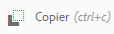 depuis la carte de la ressource.

   >[!NOTE]
   >
   >Si vous utilisez l’action rapide [!UICONTROL Copier], vous ne pouvez copier qu’une ressource à la fois.

1. Accédez à l’emplacement où vous souhaitez copier les ressources.

   >[!NOTE]
   >
   >Si vous copiez une ressource au même endroit, AEM génère automatiquement une variante du nom. Par exemple, si vous copiez une ressource intitulée `Square`, AEM génère automatiquement le titre de sa copie `Square1`.

1. Cliquez sur l’icône de ressource **[!UICONTROL Coller]** de la barre d’outils. Les ressources sont copiées à cet emplacement.

   

   >[!NOTE]
   >
   >L’icône **[!UICONTROL Coller]** est disponible dans la barre d’outils tant que l’opération de collage n’est pas terminée.

### Déplacement ou changement du nom des ressources {#moving-or-renaming-assets}

1. Accédez à l’emplacement de la ressource à déplacer.

1. Sélectionnez la ressource et appuyez/cliquez sur l’icône **[!UICONTROL Déplacer]**  de la barre d’outils.

1. Dans l’Assistant de déplacement des ressources, procédez comme suit :

   * Spécifiez le nom de la ressource après l’avoir déplacée. Ensuite, appuyez/cliquez sur **[!UICONTROL Suivant]** pour continuer.

   * Appuyez/cliquez sur **[!UICONTROL Annuler]** pour arrêter le processus.
   >[!NOTE]
   >
   >* Vous pouvez attribuer le même nom à la ressource si aucune autre ressource portant ce nom n’existe dans le nouvel emplacement. Cependant, vous devez utiliser un nouveau nom si vous déplacez la ressource vers un emplacement dans lequel une ressource portant le même nom existe. Si vous utilisez le même nom, le système génère automatiquement une variante du nom. Par exemple, si votre ressource porte le nom Carré, le système génère le nom Carré1 pour sa copie.
   >* Lors de l’attribution d’un nouveau nom à un fichier, aucun espace n’est autorisé dans le nom.

1. Dans la boîte de dialogue **[!UICONTROL Sélectionner la destination]**, procédez comme suit :

   * Accédez au nouvel emplacement des ressources, puis appuyez/cliquez sur **[!UICONTROL Suivant]** pour continuer.

   * Appuyez/cliquez sur **[!UICONTROL Précédent]** pour revenir à l’écran **[!UICONTROL Renommer]**.

1. Si les ressources déplacées sont référencées par des pages, des ressources ou des collections, l’onglet **[!UICONTROL Adapter les références]** s’affiche à côté de l’onglet **[!UICONTROL Sélectionner la destination]**.

   Dans l’écran **[!UICONTROL Adapter les références]**, effectuez l’une des actions suivantes :

   * Spécifiez les références à ajuster en fonction des nouveaux détails, puis appuyez/cliquez sur **[!UICONTROL Déplacer]** pour continuer.

   * Dans la colonne **[!UICONTROL Ajuster]**, sélectionnez/annulez la sélection des références aux ressources.
   * Appuyez/cliquez sur **[!UICONTROL Précédent]** pour revenir à l’écran **[!UICONTROL Sélectionner la destination]**.

   * Appuyez/cliquez sur **[!UICONTROL Annuler]** pour abandonner l’opération de déplacement.
   Si vous ne mettez pas à jour les références, elles continuent à pointer vers le chemin précédent de la ressource. Si vous adaptez les références, elles sont mises à jour avec le nouveau chemin de la ressource.

### Gestion des rendus {#managing-renditions}

1. Vous pouvez ajouter ou supprimer des rendus correspondant à une ressource, à l’exception de celle d’origine. Accédez à l’emplacement de la ressource pour laquelle vous souhaitez ajouter ou supprimer des rendus.

1. Appuyez/cliquez sur la ressource pour ouvrir sa page.

   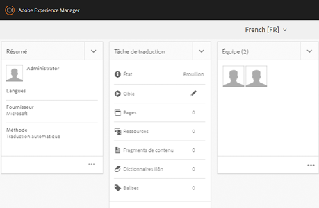

1. Appuyez/cliquez sur l’icône de navigation globale et sélectionnez **[!UICONTROL Rendus]** dans la liste.

   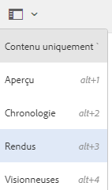

1. Dans le panneau **[!UICONTROL Rendus]**, consultez la liste des rendus générés pour la ressource.

   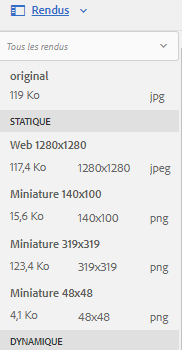

   >[!NOTE]
   >
   >Par défaut, AEM Assets n’affiche pas le rendu d’origine de la ressource en mode Aperçu. Si vous êtes administrateur, vous pouvez utiliser des incrustations pour configurer AEM Assets de manière à afficher les rendus d’origine dans ce mode.

1. Sélectionnez un rendu afin de l’afficher ou de le supprimer.

   **Suppression d’un rendu**

   Sélectionnez un rendu dans le panneau **[!UICONTROL Rendus]**, puis appuyez/cliquez sur l’icône **[!UICONTROL Supprimer le rendu]** de la barre d’outils.

   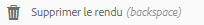

   **Chargement d’un nouveau rendu**

   Accédez à la page de détails de la ressource et appuyez/cliquez sur l’icône **[!UICONTROL Ajouter le rendu]** de la barre d’outils afin de charger un nouveau rendu pour la ressource.

   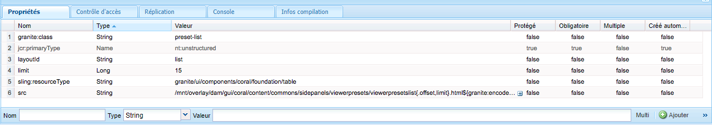

   >[!NOTE]
   >
   >Si vous sélectionnez un rendu dans le panneau **[!UICONTROL Rendus]**, la barre d’outils change de contexte et affiche uniquement les actions pertinentes par rapport au rendu. Certaines options, telles que l’icône Télécharger le rendu, ne sont pas visibles. Pour afficher ces options dans la barre d’outils, accédez à la page des détails de la ressource.

   Vous pouvez configurer les dimensions du rendu à afficher dans la page de détails d’une ressource image ou vidéo. AEM Assets affiche le rendu selon les dimensions exactes ou les plus proches de celles spécifiées.

   Pour configurer les dimensions du rendu d’une image au niveau des détails de la ressource, recouvrez le nœud `renditionpicker` (`libs/dam/gui/content/assets/assetpage/jcr:content/body/content/content/items/assetdetail/items/col1/items/assetview/renditionpicker`) et configurez la valeur de la propriété de largeur. Configurez la propriété **[!UICONTROL size (Long) in KB]** (taille (Longueur) en Ko) à la place de la largeur pour personnaliser le rendu dans la page des détails de la ressource selon la taille de l’image. Pour une personnalisation dépendant de la taille, la propriété `preferOriginal` affecte les préférences à l’image initiale si la taille du rendu correspondant est supérieure à celle de l’image initiale.

   De même, vous pouvez personnaliser l’image de la page Annotation en recouvrant `libs/dam/gui/content/assets/annotate/jcr:content/body/content/content/items/content/renditionpicker`.

   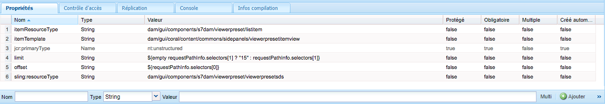

   Pour configurer les dimensions du rendu d’une ressource vidéo, accédez au nœud `videopicker` dans le référentiel CRX à l’emplacement `/libs/dam/gui/content/assets/assetpage/jcr:content/body/content/content/items/assetdetail/items/col1/items/assetview/videopicker`, recouvrez le nœud, puis modifiez la propriété adéquate.

   >[!NOTE]
   >
   >Les annotations vidéo ne sont prises en charge que sur les navigateurs qui acceptent les formats vidéo compatibles avec HTML5. Selon le navigateur, différents formats vidéo sont en outre pris en charge.

## Suppression des ressources {#delete-assets}

Pour résoudre ou supprimer les références entrantes provenant d’autres pages, mettez à jour les références appropriées avant de supprimer une ressource.

De plus, désactivez le bouton Forcer la suppression à l’aide d’un recouvrement afin d’empêcher les utilisateurs de supprimer des ressources référencées et de conserver des liens rompus.

1. Accédez à l’emplacement des ressources que vous souhaitez supprimer.

1. Sélectionnez la ressource et appuyez/cliquez sur l’icône **[!UICONTROL Supprimer]** de la barre d’outils.

   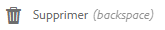

1. Dans la boîte de dialogue de confirmation, cliquez sur :

   * **[!UICONTROL Annuler]** pour arrêter l’action
   * **[!UICONTROL Supprimer]** pour confirmer l’action :

      * Si la ressource ne comporte aucune référence, elle est supprimée.
      * Si la ressource comporte des références, un message d’erreur vous informe qu’**une ou plusieurs ressources sont référencées.** Vous pouvez sélectionner **[!UICONTROL Forcer la suppression]** ou **[!UICONTROL Annuler]**.
   >[!NOTE]
   >
   >Pour pouvoir supprimer une ressource, vous devez disposer des autorisations appropriées dans la gestion des actifs numériques/ressource. Si vous disposez uniquement d’autorisations de modification, vous pourrez seulement modifier les métadonnées de la ressource et ajouter des annotations à cette dernière. Toute suppression s’avérera impossible.

   >[!NOTE]
   >
   >Pour résoudre ou supprimer les références entrantes provenant d’autres pages, mettez à jour les références appropriées avant de supprimer une ressource.
   >
   >
   >De plus, désactivez le bouton Forcer la suppression à l’aide d’un recouvrement afin d’empêcher les utilisateurs de supprimer des ressources référencées et de conserver des liens rompus.

## Téléchargement de ressources {#download-assets}

Voir [Téléchargement de ressources à partir d’AEM](/help/assets/download-assets-from-aem.md).

## Publication des ressources {#publish-assets}

<!--
>[!NOTE]
>
>For more information specific to Dynamic Media, see [Publishing Dynamic Media Assets.](/help/assets/dynamic-media/publishing-dynamicmedia-assets.md)
-->

1. Accédez à l’emplacement des ressources/du dossier que vous souhaitez publier.

1. Sélectionnez l’action rapide **[!UICONTROL Publier]** à partir de la carte de la ressource ou choisissez la ressource et appuyez/cliquez sur l’icône **[!UICONTROL Publication rapide]** de la barre d’outils.
1. Si la ressource fait référence à d’autres ressources, ses références sont répertoriées dans l’Assistant. Seules les références qui ont été modifiées ou dont la publication a été annulée depuis leur dernière publication/annulation de publication sont affichées. Choisissez les références que vous souhaitez publier.

   

   >[!NOTE]
   >
   >Si le dossier que vous souhaitez publier comprend un sous-dossier vide, ce dernier n’est pas publié.

1. Appuyez/cliquez sur **[!UICONTROL Publier]** pour confirmer l’activation des ressources.

>[!CAUTION]
>
>Si vous publiez une ressource qui est en cours de traitement, seul le contenu original est publié. Les rendus sont absents. Vous pouvez attendre la fin du traitement avant de publier ou republier la ressource une fois le traitement terminé.

## Annulation de la publication de ressources {#unpublishing-assets}

1. Accédez à l’emplacement de la ressource/du dossier de ressources que vous souhaitez supprimer de l’environnement de publication (annuler la publication).

1. Sélectionnez la ressource/le dossier dont vous souhaitez annuler la publication, puis appuyez/cliquez sur l’icône **[!UICONTROL Gérer la publication]** de la barre d’outils.

   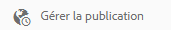

1. Sélectionnez l’action **[!UICONTROL Annuler la publication]** dans la liste.

   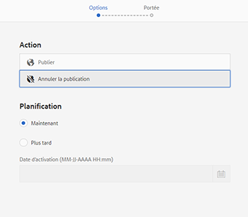

1. Pour annuler la publication de la ressource à une date ultérieure, sélectionnez **[!UICONTROL Annuler la publication ultérieurement]**, puis choisissez une date d’annulation de la publication de la ressource.
1. Planifiez une date à laquelle la ressource devient indisponible dans l’environnement de publication.
1. Si la ressource fait référence à d’autres ressources, sélectionnez les références dont vous souhaitez annuler la publication. Appuyez/cliquez sur **[!UICONTROL Annuler la publication]**.
1. Dans la boîte de dialogue de confirmation, appuyez/cliquez sur :

   * **[!UICONTROL Annuler]** pour arrêter l’action
   * **[!UICONTROL Annuler la publication]** pour confirmer l’annulation de la publication des ressources (elles ne sont plus disponibles dans l’environnement de publication) à la date indiquée.
   >[!NOTE]
   >
   >Lors de l’annulation de la publication d’une ressource complexe, annulez uniquement la publication de la ressource en question. Évitez d’annuler la publication des références, car elles peuvent être référencées par d’autres ressources publiées.

## Groupe d’utilisateurs fermé {#closed-user-group}

Les groupes d’utilisateurs fermés permettent de limiter l’accès à des dossiers de ressources spécifiques publiés à partir d’AEM. Si vous créez un groupe d’utilisateurs fermé pour un fichier, l’accès au dossier (y compris aux ressources du dossier et à ses sous-dossiers) est limité aux membres ou aux groupes attribués. Pour accéder au dossier, ils doivent se connecter à l’aide de leurs informations d’identification de sécurité.

Les groupes d’utilisateurs fermés constituent un moyen supplémentaire de limiter l’accès à vos ressources. Vous pouvez également configurer une page de connexion pour le dossier.

1. Sélectionnez un dossier dans l’IU Assets, puis appuyez/cliquez sur l’icône Propriétés de la barre d’outils pour afficher la page de propriétés.
1. Sous l’onglet **[!UICONTROL Autorisations]**, ajoutez les membres ou les groupes sous **[!UICONTROL Groupe d’utilisateurs fermé]**.

   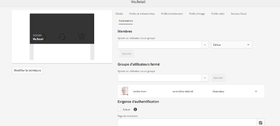

1. Pour afficher un écran de connexion lorsque les utilisateurs accèdent au dossier, sélectionnez l’option **[!UICONTROL Activer]**. Ensuite, sélectionnez le chemin de la page de connexion dans AEM et enregistrez les modifications.

   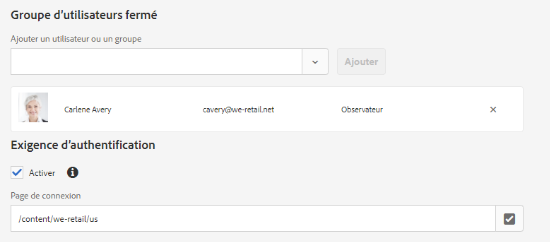

   >[!NOTE]
   >
   >Si vous ne spécifiez pas le chemin d’une page de connexion, AEM affiche la page de connexion par défaut dans l’instance de publication.

1. Publiez le dossier, puis tentez d’y accéder à partir de l’instance de publication. Un écran de connexion s’affiche.
1. Si vous êtes membre d’un groupe d’utilisateurs fermé, saisissez vos informations d’identification de sécurité. Le dossier s’affiche après qu’AEM vous a authentifié.

## Recherche de ressources  {#search-assets}

La recherche de ressources est essentielle pour l’utilisation d’un système de gestion des ressources numériques, que ce soit pour une utilisation plus poussée par les créatifs, pour une gestion robuste des ressources par les utilisateurs et spécialistes marketing ou pour l’administration par les administrateurs DAM.

Pour des recherches simples, avancées et personnalisées pour découvrir et utiliser les ressources les plus appropriées, voir [Recherche des ressources dans AEM](/help/assets/search-assets.md).

## Actions rapides {#quick-actions}

Les icônes d’action rapide sont disponibles pour une ressource à la fois. Selon l’appareil, effectuez les actions suivantes pour afficher les icônes d’action rapide :

* Appareils tactiles : appuyez longuement. Par exemple, sur un iPad, vous pouvez appuyer longuement sur une ressource pour afficher les actions rapides.
* Appareils non tactiles : survolez avec le pointeur. Par exemple, sur un poste de travail, la barre d’actions rapides s’affiche si vous survolez la miniature de la ressource avec le pointeur de la souris.

## Modification des images {#editing-images}

Les outils de modification de l’interface d’AEM Assets permettent d’effectuer de petites tâches de modification sur les ressources d’image. Vous pouvez recadrer les images, les faire pivoter, les retourner et effectuer d’autres tâches de modification. Vous pouvez également ajouter des zones cliquables aux ressources.

>[!NOTE]
>
>Pour certains composants, le mode plein écran comporte des options supplémentaires disponibles.

1. Pour ouvrir une ressource en mode d’édition, effectuez l’une des opérations suivantes :

   * Sélectionnez la ressource, puis cliquez/appuyez sur l’icône **[!UICONTROL Modifier]** de la barre d’outils.
   * Appuyez/cliquez sur l’icône **[!UICONTROL Modifier]** qui s’affiche sur une ressource en mode Carte.
   * Sur la page Ressource, appuyez/cliquez sur l’icône **[!UICONTROL Modifier]** de la barre d’outils.
   

1. Pour recadrer l’image, appuyez/cliquez sur l’icône **Recadrer**.

   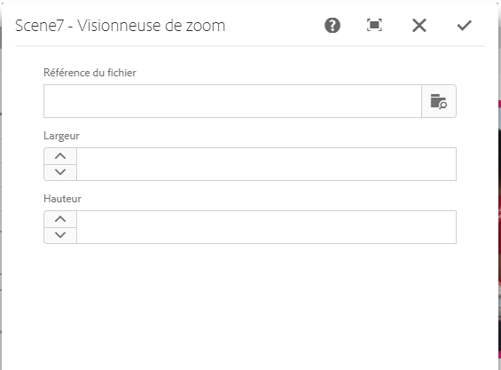

1. Sélectionnez une option dans la liste. La zone de recadrage s’affiche sur l’image en fonction de l’option choisie. L’option **Main libre** vous permet de recadrer l’image sans restriction de format.

   

1. Sélectionnez la zone à recadrer et redimensionnez ou repositionnez-la sur l’image.
1. Utilisez l’icône **Terminer** (coin supérieur droit) pour recadrer l’image. L’icône **Terminer** déclenche également la régénération des rendus.

   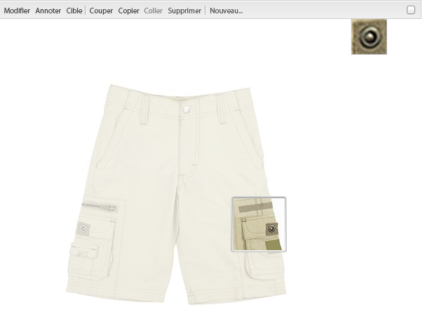

1. Utilisez les icônes **Annuler** et **Rétablir** dans la partie supérieure droite pour revenir à l’image non recadrée ou conserver l’image recadrée, respectivement.

   

1. Appuyez/cliquez sur l’icône Faire pivoter adéquate pour faire pivoter l’image dans le sens des aiguilles d’une montre ou dans le sens inverse des aiguilles d’une montre.

   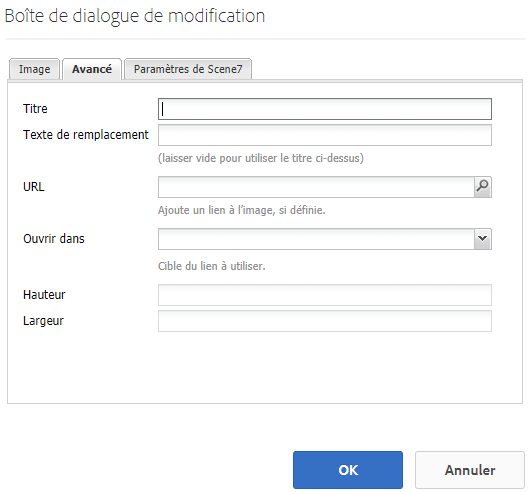

1. Appuyez/cliquez sur l’icône Symétrie adéquate pour retourner l’image horizontalement ou verticalement.

   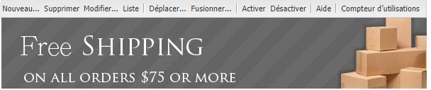

1. Appuyez/cliquez sur l’icône **Terminé** pour enregistrer les modifications.

   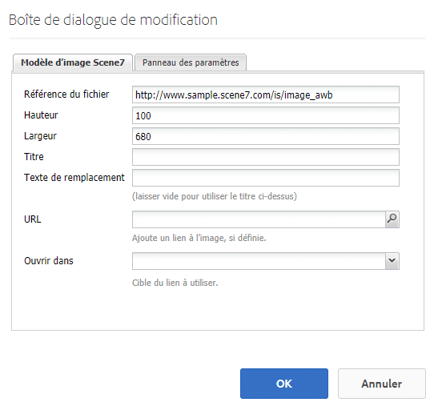

>[!NOTE]
>
>La modification d’images est prise en charge pour les formats de fichiers BMP, GIF, PNG et JPEG.

<!-- You can also add image maps using the image editor. For details, see [Adding Image Maps](/help/assets/image-maps.md). -->

>[!NOTE]
>
>Pour modifier un fichier TXT, définissez **Day CQ Link Externalizer** (Externalisateur de lien Day CQ) à partir de Configuration Manager.

## Chronologie {#timeline}

La chronologie permet d’afficher différents événements d’un élément sélectionné, comme les workflows actifs pour une ressource, les commentaires/annotations, les journaux d’activité et les versions.

*Figure : Tri des entrées de chronologie d’une ressource*

>[!NOTE]
>
>Dans la [console Collections](/help/assets/manage-collections.md#navigate-the-collections-console), la liste **[!UICONTROL Tout afficher]** contient des options permettant de n’afficher que les commentaires et les workflows. De plus, la frise chronologique ne s’affiche que pour les collections de niveau supérieur répertoriées dans la console. Elle ne s’affiche pas si vous accédez à l’intérieur des collections.

>[!NOTE]
>
>La chronologie comprend plusieurs [options spécifiques aux fragments de contenu](content-fragments/content-fragments.md).

## Annotation {#annotating}

Les annotations sont des commentaires ou des notes d’explication ajoutées aux images ou vidéos. Les annotations offrent aux spécialistes marketins la possibilité de collaborer et de laisser des commentaires sur des ressources.

Les annotations vidéo ne sont prises en charge que sur les navigateurs qui acceptent les formats vidéo compatibles avec HTML5. Les formats vidéo pris en charge par AEM Assets dépendent du navigateur.

>[!NOTE]
>
>Pour les fragments de contenu, [les annotations sont créées dans l’éditeur de fragment](content-fragments/content-fragments.md).

1. Accédez à l’emplacement de la ressource à laquelle vous souhaitez ajouter des annotations.
1. Appuyez/cliquez sur l’icône **[!UICONTROL Annoter]** à partir de l’une des options suivantes :

   * [Actions rapides](#quick-actions)
   * Dans la barre d’outils, après avoir sélectionné la ressource  ou avoir accédé à la page de la ressource
   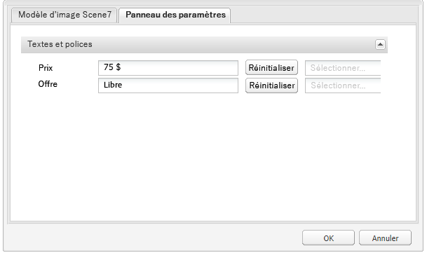

1. Ajoutez un commentaire dans la zone **[!UICONTROL Commentaire]** en bas de la chronologie. Une autre solution consiste à marquer une zone de l’image et à ajouter une annotation dans la boîte de dialogue **[!UICONTROL Ajouter une annotation]**.

   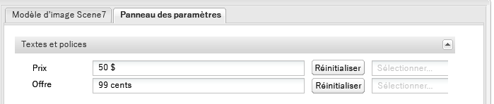

<!--
1. To notify a user about an annotation, specify the email address of the user and add the comment. For example, to notify Aaron MacDonald about an annotation, enter @aa. Hints for all matching users is displayed in a list. Select Aaron's email address from the list to tag her with the comment. Similarly, you can tag more users anywhere within the annotation or before or after it.
-->

>[!NOTE]
>
>For a non-administrator user, suggestions appear only if the user has Read permissions at `/home` in CRXDE.

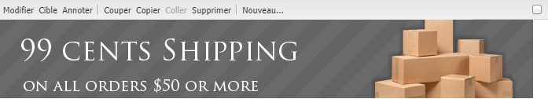

1. Après avoir ajouté l’annotation, cliquez sur **[!UICONTROL Ajouter]** pour l’enregistrer. Une notification relative à l’annotation est envoyée à Aaron.

   

   >[!NOTE]
   >
   >Vous pouvez ajouter plusieurs annotations avant de les enregistrer.

1. Appuyez/cliquez sur **[!UICONTROL Fermer]** pour quitter le mode Annotation.
1. Pour afficher la notification, connectez-vous à AEM Assets avec les informations d’identification d’Aaron MacDonald et cliquez ensuite sur l’icône **[!UICONTROL Notifications]**.

   >[!NOTE]
   >
   >Vous pouvez ajouter des annotations à des ressources vidéo. Lorsque vous annotez des vidéos, le lecteur se met en pause pour vous permettre d’ajouter une annotation sur une image. Pour plus d’informations, voir [Gestion de ressources vidéo](manage-video-assets.md).

1. Pour sélectionner une autre couleur afin de différencier les utilisateurs, cliquez/appuyez sur l’icône Profil et ensuite sur **[!UICONTROL Mes préférences]**.

   

   Indiquez la couleur de votre choix dans la zone **[!UICONTROL Couleur de l’annotation]**, puis cliquez/appuyez sur **[!UICONTROL Accepter]**.

   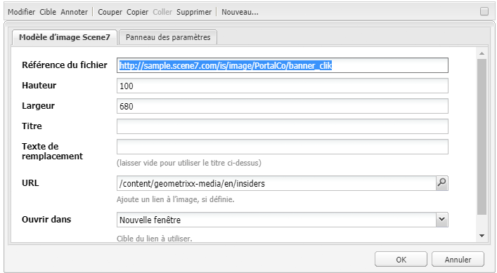

>[!NOTE]
>
>Vous pouvez également ajouter des annotations à une collection. Cependant, si une collection contient des collections enfants, vous ne pouvez ajouter des annotations/commentaires qu’à la collection parent. L’option Annoter n’est pas disponible pour les collections enfants.

### Affichage des annotations enregistrées {#viewing-saved-annotations}

1. Pour afficher les annotations enregistrées pour une ressource, accédez à l’emplacement de la ressource et ouvrez la page de la ressource.

1. Appuyez/cliquez sur l’icône de navigation globale, puis sélectionnez **[!UICONTROL Chronologie]** dans la liste.

   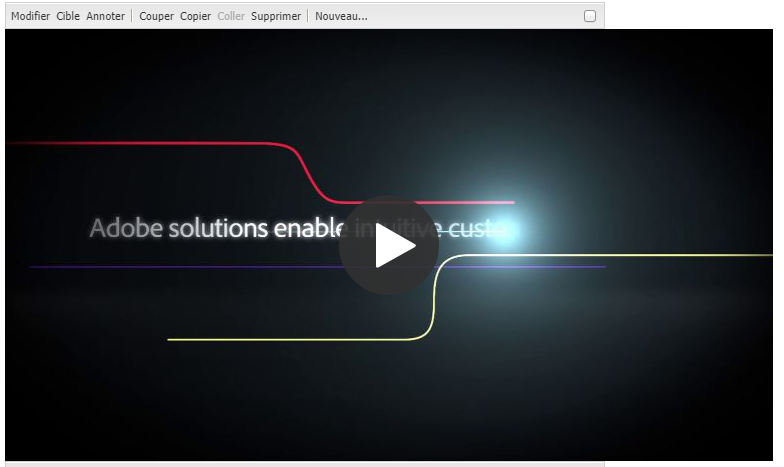

1. Dans la liste **[!UICONTROL Tout afficher]** de la chronologie, sélectionnez **[!UICONTROL Commentaires]** pour filtrer les résultats selon les annotations.

   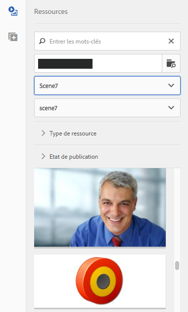

   Dans le panneau **[!UICONTROL Chronologie]**, appuyez/cliquez sur un commentaire pour afficher l’annotation correspondante sur l’image.

   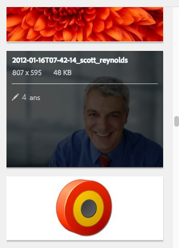

   Pour supprimer un commentaire spécifique, appuyez/cliquez sur **[!UICONTROL Supprimer]**.

### Impression des annotations {#printing-annotations}

Si une ressource comporte des annotations ou si elle a fait l’objet d’un workflow de révision, vous pouvez l’imprimer avec les annotations et l’état de révision sous la forme d’un fichier PDF en vue d’effectuer une révision hors ligne.

Vous pouvez également choisir de n’imprimer que les annotations ou l’état de révision.

Pour imprimer les annotations et l’état de révision, cliquez/appuyez sur l’icône **[!UICONTROL Imprimer]** et suivez les instructions de l’assistant. L’icône **[!UICONTROL Imprimer]** ne s’affiche dans la barre d’outils que lorsque la ressource est associée à au moins une annotation ou un état de révision.

1. Ouvrez la page d’aperçu d’une ressource à partir de l’interface utilisateur d’Assets.
1. Utilisez l’une des méthodes suivantes :

   * Pour imprimer toutes les annotations et l’état de révision, ignorez l’étape 3 et passez directement à l’étape 4.
   * Pour imprimer des annotations et un état de révision spécifiques, ouvrez la [chronologie](/help/assets/manage-digital-assets.md#timeline), puis passez à l’étape 3.

1. Pour imprimer des annotations spécifiques, sélectionnez-les dans la chronologie.

   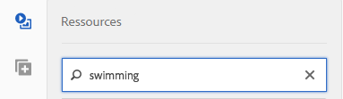

   Pour n’imprimer que l’état de révision, sélectionnez-le dans la chronologie.

   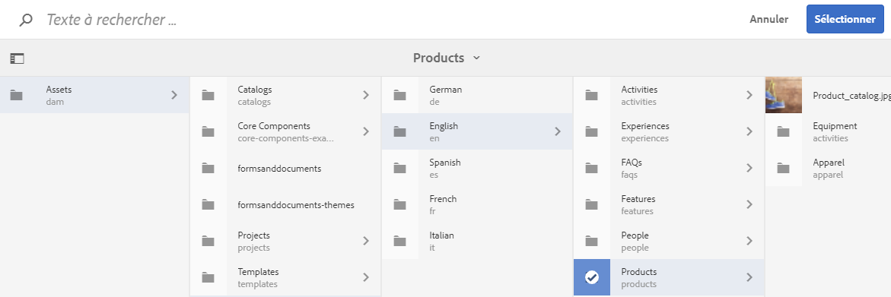

1. Appuyez/cliquez sur l’icône **[!UICONTROL Imprimer]** dans la barre d’outils.

   

1. Dans la boîte de dialogue Imprimer, sélectionnez la position dans laquelle vous souhaitez afficher les annotations/l’état de révision dans le fichier PDF. Par exemple, si vous souhaitez que les annotations ou l’état de révision soient imprimés dans le coin supérieur droit de la page qui contient l’image imprimée, sélectionnez le paramètre **Haut et gauche**. Ce paramètre est sélectionné par défaut.

   

   Vous pouvez choisir d’autres paramètres selon la position à laquelle vous souhaitez que les annotations ou l’état de révision apparaissent dans le document PDF imprimé. Si vous souhaitez que les annotations ou l’état de révision apparaissent sur une page différente de la ressource imprimée, sélectionnez **[!UICONTROL Page suivante]**.

   >[!NOTE]
   >
   >Il se peut que les annotations trop longues ne s’affichent pas correctement dans le fichier PDF. Pour un rendu optimal, Adobe recommande de limiter la taille des annotations à 50 mots.

1. Appuyez/cliquez sur **[!UICONTROL Imprimer]**. En fonction de l’option sélectionnée à l’étape 2, le fichier PDF généré affiche les annotations/l’état de révision à l’emplacement spécifié. Par exemple, si vous choisissez d’imprimer à la fois les annotations et l’état de révision à l’aide du paramètre **Haut et gauche**, vous obtiendrez un fichier PDF comparable à l’illustration ci-dessous.

   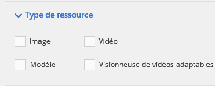

1. Téléchargez ou imprimez le fichier PDF à l’aide des options situées dans le coin supérieur droit.

   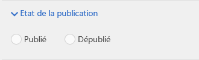

   Pour modifier l’aspect du fichier PDF généré (la couleur, la taille et le style de la police, la couleur d’arrière-plan des commentaires et des états, par exemple), ouvrez la **[!UICONTROL configuration du PDF d’annotation]** dans Configuration Manager et modifiez ensuite les options souhaitées. Par exemple, pour modifier la couleur d’affichage de l’état approuvé, modifiez le code couleur dans le champ correspondant. Pour plus d’informations sur la modification de la couleur de police des annotations, voir [Annotations](/help/assets/manage-digital-assets.md#annotating).

   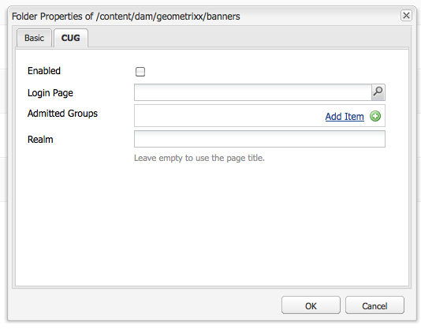

   Revenez au fichier PDF généré et actualisez-le. Le fichier PDF actualisé affiche désormais les modifications que vous avez effectuées.

## Contrôle de version des ressources {#asset-versioning}

Le contrôle de version permet de créer un instantané des ressources numériques à un moment donné. De plus, il aide à restaurer ultérieurement des ressources dans leur état précédent. Par exemple, si vous souhaitez annuler une modification apportée à une ressource, restaurez la version non modifiée de la ressource.

Voici quelques scénarios de création de versions :

* Vous modifiez une image dans une autre application et la téléchargez vers AEM Assets. Une version de l’image est créée afin que votre image d’origine ne soit pas remplacée.
* Vous modifiez les métadonnées d’une ressource.
* Vous utilisez l’application de bureau AEM pour extraire une ressource existante et enregistrer vos changements. Une version est créée chaque fois que la ressource est enregistrée.

Vous pouvez également activer le contrôle de version automatique à l’aide d’un workflow. Lorsque vous créez une version d’une ressource, les métadonnées et les rendus sont enregistrés avec la version. Les rendus sont d’autres affichages d’une même image (un rendu PNG d’un fichier JPEG téléchargé, par exemple).

La création de versions permet d’effectuer les opérations suivantes :

* créer une version d’une ressource ;
* afficher la révision actuelle d’une ressource ;
* restaurer une version précédente de la ressource.

1. Accédez à l’emplacement de la ressource pour laquelle vous souhaitez créer une version et appuyez/cliquez dessus pour afficher la page Ressource correspondante.

1. Appuyez/cliquez sur l’icône de navigation globale, puis sélectionnez **[!UICONTROL Chronologie]** dans le menu.

   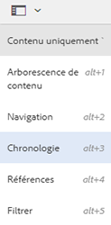

1. Appuyez/cliquez sur l’icône **[!UICONTROL Actions]** (flèche) dans la partie inférieure pour afficher les actions disponibles que vous pouvez effectuer sur la ressource.

   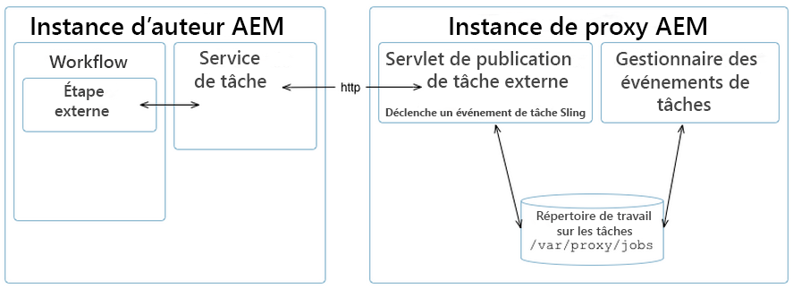

1. Appuyez/cliquez sur **[!UICONTROL Enregistrer comme version]** pour créer une version de la ressource.

   

1. Ajoutez un libellé et un commentaire, puis cliquez sur **[!UICONTROL Créer]** pour créer une version. Sinon, appuyez/cliquez sur **Annuler** pour quitter l’opération.

   

1. Pour afficher la version qui vient d’être créée, ouvrez la liste **[!UICONTROL Tout afficher]** dans la chronologie à partir de la page de détails de la ressource ou de l’interface utilisateur d’Assets et sélectionnez **[!UICONTROL Versions]**. Toutes les versions créées pour une ressource sont répertoriées sous l’onglet Chronologie. Pour filtrer la liste afin d’afficher les versions, cliquez sur la flèche pointant vers le bas et sélectionnez **[!UICONTROL Versions]** dans la liste.

   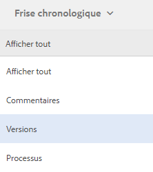

1. Sélectionnez une version spécifique de la ressource pour la prévisualiser ou lui permettre de s’afficher dans l’interface utilisateur d’Assets.

   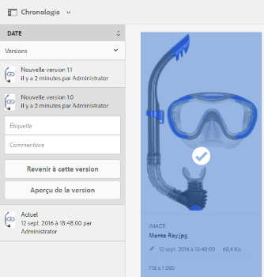

1. Ajoutez un libellé et un commentaire pour la version afin de rétablir la version spécifique dans l’interface utilisateur d’Assets.

   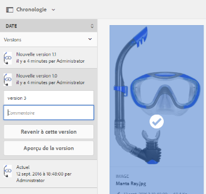

1. Pour générer un aperçu de la version, appuyez/cliquez sur **[!UICONTROL Aperçu de la version]**.
1. Pour afficher cette version dans l’interface utilisateur d’Assets, sélectionnez **[!UICONTROL Revenir à cette version]**.
1. Pour comparer deux versions, accédez à la page de la ressource et appuyez/cliquez sur la version à comparer à la version actuelle.

   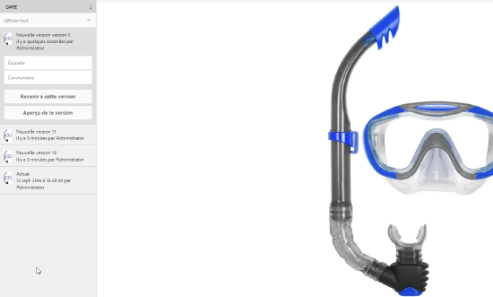

1. Dans la chronologie, sélectionnez la version à comparer, puis faites glisser le curseur vers la gauche pour superposer cette version sur la version actuelle à comparer.

   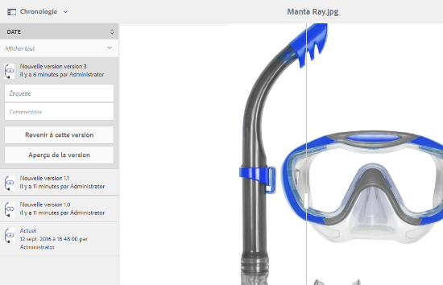

### Démarrage d’un workflow sur une ressource {#starting-a-workflow-on-an-asset}

1. Accédez à l’emplacement de la ressource pour laquelle vous souhaitez commencer un workflow et appuyez/cliquez sur la ressource pour afficher la page Ressource.
1. Appuyez/cliquez sur l’icône de navigation globale et sélectionnez **[!UICONTROL Chronologie]** dans le menu pour afficher la chronologie.

   

1. Appuyez/cliquez sur l’icône **[!UICONTROL Actions]** (flèche) dans la partie inférieure pour afficher la liste des actions disponibles pour la ressource.

   

1. Appuyez/cliquez sur **[!UICONTROL Démarrer le processus]** dans la liste.

   

1. Dans la section **[!UICONTROL Démarrer le processus]**, sélectionnez un modèle de workflow dans la liste.

   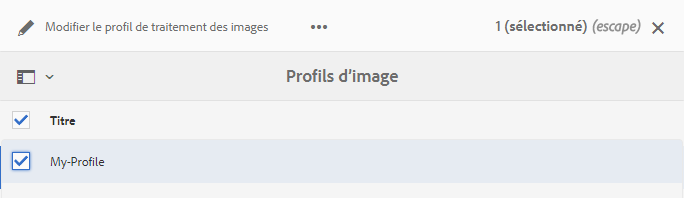

1. (Facultatif) Spécifiez le titre du workflow, qui peut permettre de référencer l’instance du workflow.

   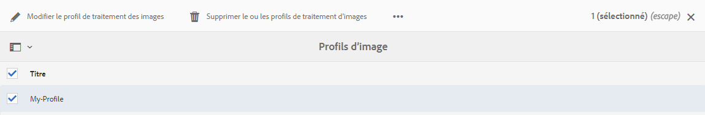

1. Appuyez/cliquez sur **[!UICONTROL Démarrer]**, puis cliquez sur **[!UICONTROL Continuer]** dans la boîte de dialogue pour confirmer. Chaque étape du workflow s’affiche en tant qu’événement dans la chronologie.

   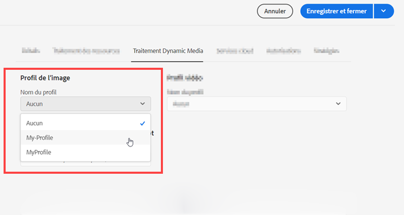

## Collections {#collections}

Une collection est un ensemble de ressources classées. Vous pouvez utiliser des collections pour partager des ressources entre utilisateurs.

* Une collection peut comporter des ressources provenant de différents emplacements, car elle ne contient que les références à ces ressources. Chaque collection préserve l’intégrité du référentiel des ressources.
* Vous pouvez partager des ressources avec plusieurs utilisateurs dont les niveaux de privilèges sont différents (modification, affichage, etc.).

Pour plus d’informations sur la gestion des collections, voir [Gestion des collections](/help/assets/manage-collections.md).
