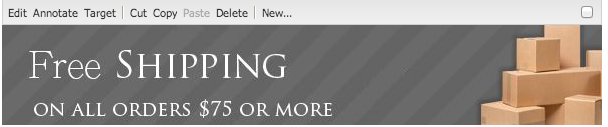

# Gestion des ressources {#manage-assets}

Cet article explique comment gérer et modifier des ressources dans [!DNL Adobe Experience Manager Assets]. Pour gérer les [!DNL Content Fragments], voir les ressources [[!DNL Content Fragments]](content-fragments/content-fragments.md).

## Création de dossiers  {#creating-folders}

Lorsque vous organisez une collection de ressources, comme toutes les images `Nature`, vous pouvez créer des dossiers pour les conserver ensemble. Vous pouvez utiliser des dossiers pour classer et organiser vos ressources. [!DNL Experience Manager Assets] ne nécessite pas de classer les ressources dans des dossiers pour mieux fonctionner.

>[!NOTE]
>
>* Partage d’un dossier de ressources de type `sling:OrderedFolder`, n’est pas pris en charge lors du partage vers Experience Cloud. Si vous souhaitez partager un dossier, ne sélectionnez pas [!UICONTROL Ordonné] lors de la création du dossier.
>* Experience Manager n’autorise pas l’utilisation du mot `subassets` comme nom de dossier. Il s’agit d’un mot-clé réservé au nœud qui contient des sous-ressources pour les ressources composites.


1. Dans le dossier Ressources numériques, accédez à l’emplacement où vous souhaitez créer un dossier. Dans le menu, cliquez sur **[!UICONTROL Créer]**. Sélectionnez **[!UICONTROL Nouveau dossier]**.
1. Dans le champ **[!UICONTROL Titre]**, indiquez le nom du dossier. Par défaut, DAM utilise le titre que vous avez fourni comme nom du dossier. Une fois le dossier créé, vous pouvez remplacer le nom par défaut et entrer un autre nom de dossier.
1. Cliquez sur **[!UICONTROL Créer]**. Le dossier apparaît dans le dossier Ressources numériques.

Les caractères suivants ne sont pas pris en charge (ils sont répertoriés ici et séparés par des espaces) :

* Le nom d’un fichier de ressource ne peut pas contenir les caractères suivants : `* / : [ \\ ] | # % { } ? &`
* Le nom d’un dossier de ressources ne peut pas contenir les caractères suivants : `* / : [ \\ ] | # % { } ? \" . ^ ; + & \t`

## Charger des ressources {#uploading-assets}

Voir [Ajout de ressources numériques à Experience Manager](add-assets.md).

## Détection des ressources en double {#detect-duplicate-assets}

<!-- TBD: This feature may not work as documented. See CQ-4283718. Get PM review done. -->

Si un utilisateur DAM charge une ou plusieurs ressources qui existent déjà dans le référentiel, [!DNL Experience Manager] détecte la duplication et en informe l’utilisateur. La fonctionnalité de détection des doublons est désactivée par défaut, car elle peut avoir un impact sur les performances en fonction de la taille du référentiel et du nombre de ressources chargées.

Pour activer la fonction :

1. Accédez à **[!UICONTROL Outils > Ressources > Configurations des ressources]**.

1. Cliquez sur **[!UICONTROL Détecteur de duplication de ressources]**.

1. Sur le [!UICONTROL Page Détecteur de duplication de ressources], cliquez sur **[!UICONTROL Activé]**.

   `dam:sha1` pour le champ Détecter les métadonnées , vous avez la garantie que les ressources en double sont détectées même si les noms de fichier sont différents.

1. Cliquez sur **[!UICONTROL Enregistrer]**.

   

>[!NOTE]
>
>Si vous avez configuré le détecteur de duplication à l’aide de `/apps/example/config.author/com.adobe.cq.assetcompute.impl.assetprocessor.AssetDuplicationDetector.cfg.json` fichier de configuration (configuration OSGi), vous pouvez continuer à l’utiliser, mais Adobe recommande d’utiliser la nouvelle méthode.


Une fois activé, Experience Manager envoie des notifications de ressources en double vers la boîte de réception Experience Manager. Il s’agit d’un résultat global correspondant à plusieurs doublons. Les utilisateurs peuvent choisir de supprimer les ressources en fonction des résultats.


>[!NOTE]
>
>Lorsque vous chargez des ressources vers le référentiel, Experience Manager détecte la duplication et vous informe des 100 premières ressources en double.

## Aperçu des ressources {#previewing-assets}

Pour prévisualiser une ressource, procédez comme suit.

1. Dans l’interface utilisateur d’Assets, accédez à l’emplacement de la ressource à prévisualiser.
1. Appuyez sur la ressource concernée pour l’ouvrir.

1. En mode Aperçu, les options de zoom sont disponibles pour les [types d’images pris en charge](/help/assets/file-format-support.md) (avec modification interactive).

   Pour effectuer un zoom avant sur une ressource, appuyez/cliquez sur `+` (ou appuyez/cliquez sur la loupe au niveau de la ressource). Pour effectuer un zoom arrière, appuyez/cliquez sur `-`. Lorsque vous effectuez un zoom avant, vous pouvez observer en détail une zone de l’image en réalisant un panoramique. La flèche de réinitialisation du zoom rétablit la vue initiale.

   Appuyez sur **[!UICONTROL Réinitialiser]** pour réinitialiser la vue à sa taille d’origine.

## Modification des propriétés {#editing-properties}

1. Accédez à l’emplacement de la ressource dont vous souhaitez modifier les métadonnées.

1. Sélectionnez la ressource et appuyez/cliquez sur **[!UICONTROL Propriétés]** dans la barre d’outils pour afficher ses propriétés. Vous pouvez également sélectionner l’action rapide **[!UICONTROL Propriétés]** sur la carte de la ressource.

   

1. Sur la page [!UICONTROL Propriétés], modifiez les propriétés de métadonnées sous différents onglets. Par exemple, sous l’onglet **[!UICONTROL De base]**, modifiez le titre, la description et ainsi de suite.

   >[!NOTE]
   >
   >La disposition de la page [!UICONTROL Propriétés] et les propriétés des métadonnées disponibles dépendent du schéma de métadonnées sous-jacent. Pour savoir comment modifier la disposition de la page [!UICONTROL Propriétés], voir [Schémas des métadonnées](/help/assets/metadata-schemas.md).

1. Pour planifier une date/heure spécifique pour l’activation de la ressource, utilisez le sélecteur de date situé en regard du champ **[!UICONTROL Heure d’activation]**.

   

1. Pour désactiver la ressource après une durée spécifique, choisissez la date/l’heure de désactivation du sélecteur de date en regard du champ **[!UICONTROL Heure de désactivation]**. La date de désactivation doit être postérieure à la date d’activation de la ressource. Après l’[!UICONTROL heure de désactivation], une ressource et ses rendus ne sont plus disponibles via l’interface web Assets ou via l’API HTTP.

   

1. Sélectionnez une ou plusieurs balises dans le champ **[!UICONTROL Balises]**. Pour ajouter une balise personnalisée, saisissez son nom dans la zone appropriée et sélectionnez ensuite la touche `Enter`. La nouvelle balise est enregistrée dans [!DNL Experience Manager].

   YouTube requiert que les balises soient publiées et comportent un lien vers YouTube (si un lien approprié peut être trouvé).

   >[!NOTE]
   >
   >Pour créer des balises, vous devez disposer d’une autorisation d’écriture sur le chemin d’accès `/content/cq:tags/default` dans le référentiel CRX.

1. Appuyez/cliquez sur **[!UICONTROL Enregistrer et fermer]**.

1. Accédez à l’interface utilisateur d’Assets. Les propriétés des métadonnées modifiées, notamment le titre, la description et les balises, sont affichées sur la carte des ressources en mode Carte et dans les colonnes pertinentes en mode Liste.

<!-- TBD: Uncomment after verification for Dec release.

## View asset usage and references {#usage-and-references}

[!DNL Experience Manager] lets you track statistics about usage of a digital asset. The usage statistics include the following:

    * Number of times the asset was viewed or downloaded
    * Channels/devices through which the asset was used
    * Creative solutions where the asset was recently used

To view usage statistics for an asset, in the [!UICONTROL Properties] page, click the **[!UICONTROL Insights]** tab. For more details, see [Assets Insights](assets-insights.md).

[!DNL Experience Manager] also lets you check all the incoming references to an asset, that is, the usage of an asset in remote [!DNL Sites] and in compound assets. Authors of webpages on [!DNL Experience Manager Sites] deployment can use an asset on a remote [!DNL Assets] deployment using the Connected Assets functionality. The [!UICONTROL References] tab in an asset's [!UICONTROL Properties] page lists the local and remote references of the asset. That is, the use of assets in compound assets in [!DNL Assets] and its use in remote [!DNL Sites] pages.

-->

## Copie de ressources {#copying-assets}

Lorsque vous copiez une ressource ou un dossier, l’intégralité de la ressource ou le dossier sont copiés, avec la structure du contenu. Une ressource copiée ou un dossier sont dupliqués à l’emplacement cible. La ressource stockée à l’emplacement source n’est pas modifiée.

Quelques attributs uniques à une copie spécifique d’une ressource ne sont pas reportés. Voici quelques exemples :

* ID de la ressource, date et heure de création, versions et historique des versions. Certaines de ces propriétés sont indiquées par les propriétés `jcr:uuid`, `jcr:created` et `cq:name`.

* L’heure de création et les chemins référencés sont uniques pour chaque ressource et chaque rendu.

Les autres propriétés et informations de métadonnées sont conservées. Une copie partielle n’est pas créée lors de la copie d’une ressource.

1. Dans l’interface utilisateur d’Assets, sélectionnez une ou plusieurs ressources, puis appuyez/cliquez sur l’icône **[!UICONTROL Copier]** dans la barre d’outils. Vous pouvez également sélectionner l’action rapide **[!UICONTROL Copier]**  depuis la carte de la ressource.

   >[!NOTE]
   >
   >Si vous utilisez l’action rapide [!UICONTROL Copier], vous ne pouvez copier qu’une ressource à la fois.

1. Accédez à l’emplacement où vous souhaitez copier les ressources.

   >[!NOTE]
   >
   >Si vous copiez une ressource au même endroit, [!DNL Experience Manager] génère automatiquement une variante du nom. Par exemple, si vous copiez une ressource intitulée `Square`, [!DNL Experience Manager] génère automatiquement le titre de sa copie `Square1`.

1. Cliquez sur l’icône de ressource **[!UICONTROL Coller]** de la barre d’outils. Les ressources sont copiées à cet emplacement.

   

   >[!NOTE]
   >
   >L’icône **[!UICONTROL Coller]** est disponible dans la barre d’outils tant que l’opération de collage n’est pas terminée.

### Déplacement ou changement du nom des ressources {#moving-or-renaming-assets}

1. Accédez à l’emplacement de la ressource à déplacer.

1. Sélectionnez la ressource et appuyez/cliquez sur l’icône **[!UICONTROL Déplacer]**  de la barre d’outils.

1. Dans l’Assistant de déplacement des ressources, procédez comme suit :

   * Spécifiez le nom de la ressource après l’avoir déplacée. Ensuite, appuyez/cliquez sur **[!UICONTROL Suivant]** pour continuer.

   * Appuyez/cliquez sur **[!UICONTROL Annuler]** pour arrêter le processus.
   >[!NOTE]
   >
   >* Vous pouvez attribuer le même nom à la ressource si aucune autre ressource portant ce nom n’existe dans le nouvel emplacement. Cependant, vous devez utiliser un nouveau nom si vous déplacez la ressource vers un emplacement dans lequel une ressource portant le même nom existe. Si vous utilisez le même nom, le système génère automatiquement une variante du nom. Par exemple, si votre ressource porte le nom Carré, le système génère le nom Carré1 pour sa copie.
   >* Lors de l’attribution d’un nouveau nom à un fichier, aucun espace n’est autorisé dans le nom.


1. Dans la boîte de dialogue **[!UICONTROL Sélectionner la destination]**, procédez comme suit :

   * Accédez au nouvel emplacement des ressources, puis appuyez/cliquez sur **[!UICONTROL Suivant]** pour continuer.

   * Appuyez/cliquez sur **[!UICONTROL Précédent]** pour revenir à l’écran **[!UICONTROL Renommer]**.

1. Si les ressources déplacées sont référencées par des pages, des ressources ou des collections, l’onglet **[!UICONTROL Adapter les références]** s’affiche à côté de l’onglet **[!UICONTROL Sélectionner la destination]**.

   Dans l’écran **[!UICONTROL Adapter les références]**, effectuez l’une des actions suivantes :

   * Spécifiez les références à ajuster en fonction des nouveaux détails, puis appuyez/cliquez sur **[!UICONTROL Déplacer]** pour continuer.

   * Dans la colonne **[!UICONTROL Ajuster]**, sélectionnez/annulez la sélection des références aux ressources.
   * Appuyez/cliquez sur **[!UICONTROL Précédent]** pour revenir à l’écran **[!UICONTROL Sélectionner la destination]**.

   * Appuyez/cliquez sur **[!UICONTROL Annuler]** pour abandonner l’opération de déplacement.

   Si vous ne mettez pas à jour les références, elles continuent à pointer vers le chemin précédent de la ressource. Si vous adaptez les références, elles sont mises à jour avec le nouveau chemin de la ressource.

### Gestion des rendus {#managing-renditions}

1. Vous pouvez ajouter ou supprimer des rendus correspondant à une ressource, à l’exception de celle d’origine. Accédez à l’emplacement de la ressource pour laquelle vous souhaitez ajouter ou supprimer des rendus.

1. Appuyez/cliquez sur la ressource pour ouvrir sa page.

   

1. Appuyez/cliquez sur l’icône de navigation globale et sélectionnez **[!UICONTROL Rendus]** dans la liste.

   

1. Dans le panneau **[!UICONTROL Rendus]**, consultez la liste des rendus générés pour la ressource.

   

   >[!NOTE]
   >
   >Par défaut, [!DNL Experience Manager Assets] n’affiche pas le rendu d’origine de la ressource en mode Aperçu. Si vous êtes administrateur, vous pouvez utiliser des incrustations pour configurer [!DNL Assets] de manière à afficher les rendus d’origine dans ce mode.

1. Sélectionnez un rendu afin de l’afficher ou de le supprimer.

   **Suppression d’un rendu**

   Sélectionnez un rendu dans le panneau **[!UICONTROL Rendus]**, puis appuyez/cliquez sur l’icône **[!UICONTROL Supprimer le rendu]** de la barre d’outils. Une fois le traitement des ressources terminé, il est impossible de supprimer les rendus en masse. Pour les ressources individuelles, vous pouvez supprimer manuellement les rendus à l’aide de l’interface utilisateur. Si plusieurs ressources sont concernées, vous pouvez personnaliser [!DNL Experience Manager] pour supprimer des rendus spécifiques ou supprimer les ressources et charger à nouveau celles qui ont été supprimées.

   

   **Chargement d’un nouveau rendu**

   Accédez à la page de détails de la ressource et appuyez/cliquez sur l’icône **[!UICONTROL Ajouter le rendu]** de la barre d’outils afin de charger un nouveau rendu pour la ressource.

   

   >[!NOTE]
   >
   >Si vous sélectionnez un rendu dans le panneau **[!UICONTROL Rendus]**, la barre d’outils change de contexte et affiche uniquement les actions pertinentes par rapport au rendu. Certaines options, telles que l’icône Télécharger le rendu, ne sont pas visibles. Pour afficher ces options dans la barre d’outils, accédez à la page des détails de la ressource.

   Vous pouvez configurer les dimensions du rendu à afficher dans la page de détails d’une ressource image ou vidéo. Assets affiche le rendu selon les dimensions exactes ou les plus proches de celles spécifiées.

   Pour configurer les dimensions du rendu d’une image au niveau des détails de la ressource, recouvrez le nœud `renditionpicker` (`libs/dam/gui/content/assets/assetpage/jcr:content/body/content/content/items/assetdetail/items/col1/items/assetview/renditionpicker`) et configurez la valeur de la propriété de largeur. Configurez la propriété **[!UICONTROL size (Long) in KB]** (taille (Longueur) en Ko) à la place de la largeur pour personnaliser le rendu dans la page des détails de la ressource selon la taille de l’image. Pour une personnalisation dépendant de la taille, la propriété `preferOriginal` affecte les préférences à l’image initiale si la taille du rendu correspondant est supérieure à celle de l’image initiale.

   De même, vous pouvez personnaliser l’image de la page Annotation en recouvrant `libs/dam/gui/content/assets/annotate/jcr:content/body/content/content/items/content/renditionpicker`.

   

   Pour configurer les dimensions du rendu d’une ressource vidéo, accédez au nœud `videopicker` dans le référentiel CRX à l’emplacement `/libs/dam/gui/content/assets/assetpage/jcr:content/body/content/content/items/assetdetail/items/col1/items/assetview/videopicker`, recouvrez le nœud, puis modifiez la propriété adéquate.

   >[!NOTE]
   >
   >Les annotations vidéo ne sont prises en charge que sur les navigateurs qui acceptent les formats vidéo compatibles avec HTML5. Selon le navigateur, différents formats vidéo sont en outre pris en charge. Toutefois, le format vidéo MXF n’est pas encore pris en charge avec les annotations vidéo.

## Suppression des ressources {#delete-assets}

Pour résoudre ou supprimer les références entrantes provenant d’autres pages, mettez à jour les références appropriées avant de supprimer une ressource.

De plus, désactivez le bouton Forcer la suppression à l’aide d’un recouvrement afin d’empêcher les utilisateurs de supprimer des ressources référencées et de conserver des liens rompus.

1. Accédez à l’emplacement des ressources que vous souhaitez supprimer.

1. Sélectionnez la ressource et cliquez sur l’icône **[!UICONTROL Supprimer]** de la barre d’outils .

1. Dans la boîte de dialogue de confirmation, cliquez sur :

   * **[!UICONTROL Annuler]** pour arrêter l’action
   * **[!UICONTROL Supprimer]** pour confirmer l’action :

      * Si la ressource ne comporte aucune référence, elle est supprimée.
      * Si la ressource comporte des références, un message d’erreur vous informe qu’**[!UICONTROL une ou plusieurs ressources sont référencées.]** Vous pouvez sélectionner **[!UICONTROL Forcer la suppression]** ou **[!UICONTROL Annuler]**.

   >[!NOTE]
   >
   >Pour pouvoir supprimer une ressource, vous devez disposer des autorisations appropriées dans la gestion des actifs numériques/ressource. Si vous disposez uniquement d’autorisations de modification, vous pourrez seulement modifier les métadonnées de la ressource et ajouter des annotations à cette dernière. Toute suppression s’avérera impossible.

   >[!NOTE]
   >
   >Pour résoudre ou supprimer les références entrantes provenant d’autres pages, mettez à jour les références appropriées avant de supprimer une ressource. Vous pouvez interdire la suppression des ressources référencées, car elle entraîne des ruptures de liens. Désactivez le bouton Forcer la suppression à l’aide d’une superposition.

## Téléchargement de ressources {#download-assets}

Consultez [Téléchargement des ressources à partir de [!DNL Experience Manager]](/help/assets/download-assets-from-aem.md).

## Publication ou annulation de la publication de ressources {#publish-assets}

1. Accédez à l’emplacement de la ressource ou du dossier de ressources que vous souhaitez publier ou que vous souhaitez supprimer dans l’environnement de publication (annuler la publication).

1. Sélectionnez la ressource ou le dossier à publier ou dont vous souhaitez annuler la publication, puis sélectionnez l’option **[!UICONTROL Gérer la publication]**  dans la barre d’outils. Pour publier rapidement, vous pouvez également sélectionner l’option **[!UICONTROL Publication rapide]** dans la barre d’outils. Si le dossier que vous souhaitez publier comprend un sous-dossier vide, ce dernier n’est pas publié.

1. Sélectionnez l’option **[!UICONTROL Modifier]** ou **[!UICONTROL Annuler la publication]** selon vos besoins.

   
   *Figure : options Publier et Annuler la publication et option de planification.*

1. Sélectionnez **[!UICONTROL Maintenant]** pour agir immédiatement sur la ressource ou sélectionnez **[!UICONTROL Plus tard]** pour planifier l’action. Sélectionnez une date et une heure si vous choisissez l’option **[!UICONTROL Plus tard]**. Cliquez sur **[!UICONTROL Suivant]**.

1. Lors d’une publication, si la ressource fait référence à d’autres ressources, ses références sont répertoriées dans l’Assistant. Seules les références qui ne sont pas publiées ou modifiées depuis la dernière publication s’affichent. Choisissez les références que vous souhaitez publier.

1. Lors de l’annulation de la publication, si une ressource fait référence à d’autres ressources, sélectionnez les références dont vous souhaitez annuler la publication. Cliquez sur **[!UICONTROL Annuler la publication]**. Dans la boîte de dialogue de confirmation, cliquez sur **[!UICONTROL Annuler]** pour arrêter l’action ou sur **[!UICONTROL Annuler la publication]** pour confirmer que les ressources doivent être dépubliées à la date spécifiée.

Gardez à l’esprit les limites et conseils suivants liés à la publication ou à l’annulation de la publication de ressources ou de dossiers :

* L’option [!UICONTROL Gérer la publication] n’est disponible que pour les comptes d’utilisateurs disposant d’autorisations de réplication.
* Lors de l’annulation de la publication d’une ressource complexe, annulez uniquement la publication de la ressource. Évitez d’annuler la publication des références car elles peuvent être référencées par d’autres ressources publiées.
* Les dossiers vides ne sont pas publiés.
* Si vous publiez une ressource qui est en cours de traitement, seul le contenu original est publié. Les rendus sont absents. Vous pouvez attendre la fin du traitement avant de publier ou republier la ressource une fois le traitement terminé.

## Groupe d’utilisateurs fermé {#closed-user-group}

Les groupes d’utilisateurs fermés permettent de limiter l’accès à des dossiers de ressources spécifiques publiés à partir d’[!DNL Experience Manager]. Si vous créez un groupe d’utilisateurs fermé pour un fichier, l’accès au dossier (y compris aux ressources du dossier et à ses sous-dossiers) est limité aux membres ou aux groupes attribués. Pour accéder au dossier, ils doivent se connecter à l’aide de leurs informations d’identification de sécurité.

Les groupes d’utilisateurs fermés constituent un moyen supplémentaire de limiter l’accès à vos ressources. Vous pouvez également configurer une page de connexion pour le dossier.

1. Sélectionnez un dossier dans l’IU Assets, puis appuyez/cliquez sur l’icône Propriétés de la barre d’outils pour afficher la page de propriétés.
1. Sous l’onglet **[!UICONTROL Autorisations]**, ajoutez les membres ou les groupes sous **[!UICONTROL Groupe d’utilisateurs fermé]**.

   

1. Pour afficher un écran de connexion lorsque les utilisateurs accèdent au dossier, sélectionnez l’option **[!UICONTROL Activer]**. Sélectionnez ensuite le chemin de la page de connexion dans [!DNL Experience Manager] et enregistrez les modifications.

   

   >[!NOTE]
   >
   >Si vous ne spécifiez pas le chemin d’une page de connexion, [!DNL Experience Manager] affiche la page de connexion par défaut dans l’instance de publication.

1. Publiez le dossier, puis tentez d’y accéder à partir de l’instance de publication. Un écran de connexion s’affiche.
1. Si vous êtes membre d’un groupe d’utilisateurs fermé, saisissez vos informations d’identification de sécurité. Le dossier s’affiche après qu’[!DNL Experience Manager] vous a authentifié.

## Recherche de ressources {#search-assets}

La recherche de ressources est essentielle pour l’utilisation d’un système de gestion des ressources numériques, que ce soit pour une utilisation plus poussée par les créatifs, pour une gestion robuste des ressources par les utilisateurs et spécialistes marketing ou pour l’administration par les administrateurs DAM.

Pour des recherches simples, avancées et personnalisées pour découvrir et utiliser les ressources les plus appropriées, voir [Recherche des ressources dans [!DNL Experience Manager]](/help/assets/search-assets.md).

## Actions rapides {#quick-actions}

Les icônes d’action rapide sont disponibles pour une ressource à la fois. Selon l’appareil, effectuez les actions suivantes pour afficher les icônes d’action rapide :

* Appareils tactiles : appuyez longuement. Par exemple, sur un iPad, vous pouvez appuyer longuement sur une ressource pour afficher les actions rapides.
* Appareils non tactiles : survolez avec le pointeur. Par exemple, sur un poste de travail, la barre d’actions rapides s’affiche si vous survolez la miniature de la ressource avec le pointeur de la souris.

<!-- Hiding this topic via cqdoc-18707

## Edit images {#editing-images}

The editing tools in the [!DNL Experience Manager Assets] interface let you perform small editing jobs on image assets. You can crop, rotate, flip, and perform other editing jobs on images. You can also add image maps to assets.

>[!NOTE]
>
>For some components, the Full Screen mode has additional options available.

1. Do one of the following to open an asset in edit mode:

    * Select the asset and then click/tap the **[!UICONTROL Edit]** icon in the toolbar.
    * Tap/click the **[!UICONTROL Edit]** icon that appears on an asset in the Card view.
    * In the asset page, tap/click the **[!UICONTROL Edit]** icon in the toolbar.

   

1. To crop the image, tap/click the **Crop** icon.

   

1. Select the desired option from the list. The crop area appears on the image based on the option you choose. The **Free Hand** option lets you crop the image without any aspect ratio restrictions.

   

1. Select the area to be cropped, and resize or reposition it on the image.
1. Use the **Finish** icon (top right corner) to crop the image. Clicking the **Finish** icon also triggers the regeneration of renditions.

   

1. Use the **Undo** and **Redo** icons on the top right to revert to the uncropped image or retain the cropped image, respectively.

   

1. Tap/click the appropriate Rotate icon to rotate the image clockwise or anti-clockwise.

   

1. Tap/click the appropriate Flip icon to flip the image horizontally or vertically.

   

1. Tap/click the **Finish** icon to save the changes.

   

>[!NOTE]
>
>Image editing is supported for BMP, GIF, PNG, and JPEG files formats.

>[!NOTE]
>
>To edit a TXT file, set **Day CQ Link Externalizer** from Configuration Manager.
-->

## Chronologie {#timeline}

La chronologie permet d’afficher différents événements d’un élément sélectionné, comme les workflows actifs pour une ressource, les commentaires/annotations, les journaux d’activité et les versions.


*Figure : Tri des entrées de chronologie d’une ressource*

>[!NOTE]
>
>Dans la [console Collections](/help/assets/manage-collections.md#navigate-the-collections-console), la liste **[!UICONTROL Afficher tout]** contient des options permettant de n’afficher que les commentaires et les workflows. De plus, la chronologie ne s’affiche que pour les collections de niveau supérieur répertoriées dans la console. Elle ne s’affiche pas si vous accédez à l’intérieur des collections.

>[!NOTE]
>
>La chronologie comprend plusieurs [options spécifiques aux fragments de contenu](content-fragments/content-fragments.md).

## Appliquer des annotations à des ressources {#annotating}

Les annotations sont des commentaires ou des notes d’explication ajoutées aux images ou vidéos. Les annotations offrent aux spécialistes marketing la possibilité de collaborer et de laisser des commentaires sur des ressources.

Les annotations vidéo ne sont prises en charge que sur les navigateurs qui acceptent les formats vidéo compatibles avec HTML5. Les formats vidéo pris en charge par Assets dépendent du navigateur. Toutefois, le format vidéo MXF n’est pas encore pris en charge avec les annotations vidéo.

>[!NOTE]
>
>Pour les fragments de contenu, [les annotations sont créées dans l’éditeur de fragment](content-fragments/content-fragments.md).

1. Accédez à l’emplacement de la ressource à laquelle vous souhaitez ajouter des annotations.
1. Appuyez/cliquez sur l’icône **[!UICONTROL Annoter]** à partir de l’une des options suivantes :

   * [Actions rapides](#quick-actions)
   * Dans la barre d’outils, après avoir sélectionné la ressource ou avoir accédé à la page de la ressource

   

1. Ajoutez un commentaire dans la zone **[!UICONTROL Commentaire]** en bas de la chronologie. Une autre solution consiste à marquer une zone de l’image et à ajouter une annotation dans la boîte de dialogue **[!UICONTROL Ajouter une annotation]**.

   

<!--
1. To notify a user about an annotation, specify the email address of the user and add the comment. For example, to notify Aaron MacDonald about an annotation, enter @aa. Hints for all matching users is displayed in a list. Select Aaron's email address from the list to tag her with the comment. Similarly, you can tag more users anywhere within the annotation or before or after it.
-->

>[!NOTE]
>
>Si l’utilisateur ne dispose pas des droits d’administration, les suggestions s’affichent uniquement s’il dispose de droits de lecture sur `/home` dans CRXDE.


1. Après avoir ajouté l’annotation, cliquez sur **[!UICONTROL Ajouter]** pour l’enregistrer. Une notification relative à l’annotation est envoyée à Aaron.

   

   >[!NOTE]
   >
   >Vous pouvez ajouter plusieurs annotations avant de les enregistrer.

1. Appuyez/cliquez sur **[!UICONTROL Fermer]** pour quitter le mode Annotation.
1. Pour afficher la notification, connectez-vous à Assets avec les informations d’identification d’Aaron MacDonald et cliquez ensuite sur l’icône **[!UICONTROL Notifications]**.

   >[!NOTE]
   >
   >Vous pouvez ajouter des annotations à des ressources vidéo. Lorsque vous annotez des vidéos, le lecteur se met en pause pour vous permettre d’ajouter une annotation sur une image. Pour plus d’informations, consultez la section [Gestion de ressources vidéo](manage-video-assets.md). Toutefois, le format vidéo MXF n’est pas encore pris en charge avec les annotations vidéo.

1. Pour sélectionner une autre couleur afin de différencier les utilisateurs, cliquez/appuyez sur l’icône Profil et ensuite sur **[!UICONTROL Mes préférences]**.

   

   Indiquez la couleur de votre choix dans la zone **[!UICONTROL Couleur de l’annotation]**, puis cliquez/appuyez sur **[!UICONTROL Accepter]**.

   

>[!NOTE]
>
>Vous pouvez également ajouter des annotations à une collection. Cependant, si une collection contient des collections enfants, vous ne pouvez ajouter des annotations/commentaires qu’à la collection parent. L’option Annoter n’est pas disponible pour les collections enfants.

### Affichage des annotations enregistrées {#viewing-saved-annotations}

Vous ne pouvez afficher qu’une annotation à la fois.

>[!NOTE]
>
>Si vous sélectionnez plusieurs annotations, la dernière en date est visible dans l’interface utilisateur.
>
>La sélection multiple est prise en charge uniquement pour l’impression de la ressource annotée au format PDF.

1. Pour afficher les annotations enregistrées pour une ressource, accédez à l’emplacement de la ressource et ouvrez la page de la ressource.

1. Appuyez/cliquez sur l’icône de navigation globale, puis sélectionnez **[!UICONTROL Chronologie]** dans la liste.

   

1. Dans la liste **[!UICONTROL Afficher tout]** de la chronologie, sélectionnez **[!UICONTROL Commentaires]** pour filtrer les résultats selon les annotations.

   

   Dans le panneau **[!UICONTROL Chronologie]**, appuyez/cliquez sur un commentaire pour afficher l’annotation correspondante sur l’image.

   

   Pour supprimer un commentaire spécifique, appuyez/cliquez sur **[!UICONTROL Supprimer]**.

### Impression des annotations {#printing-annotations}

Si une ressource comporte des annotations ou si elle a fait l’objet d’un workflow de révision, vous pouvez l’imprimer avec les annotations et l’état de révision sous la forme d’un fichier PDF en vue d’effectuer une révision hors ligne.

Vous pouvez également choisir de n’imprimer que les annotations ou l’état de révision.

>[!NOTE]
>
>Vous pouvez sélectionner plusieurs annotations lors de l’impression de la ressource annotée au format PDF.

Pour imprimer les annotations et l’état de révision, cliquez/appuyez sur l’icône **[!UICONTROL Imprimer]** et suivez les instructions de l’assistant. L’icône **[!UICONTROL Imprimer]** ne s’affiche dans la barre d’outils que lorsque la ressource est associée à au moins une annotation ou un état de révision.

1. Ouvrez la page d’aperçu d’une ressource à partir de l’interface utilisateur d’Assets.
1. Utilisez l’une des méthodes suivantes :

   * Pour imprimer toutes les annotations et l’état de révision, ignorez l’étape 3 et passez directement à l’étape 4.
   * Pour imprimer des annotations et un état de révision spécifiques, ouvrez la [chronologie](/help/assets/manage-digital-assets.md#timeline), puis passez à l’étape 3.

1. Pour imprimer des annotations spécifiques, sélectionnez-les dans la chronologie.

   

   Pour n’imprimer que l’état de révision, sélectionnez-le dans la chronologie.

   

1. Appuyez/cliquez sur l’icône **[!UICONTROL Imprimer]** dans la barre d’outils.

   

1. Dans la boîte de dialogue Imprimer, sélectionnez la position dans laquelle vous souhaitez afficher les annotations/l’état de révision dans le fichier PDF. Par exemple, si vous souhaitez que les annotations ou l’état de révision soient imprimés dans le coin supérieur droit de la page qui contient l’image imprimée, sélectionnez le paramètre **Haut et gauche**. Ce paramètre est sélectionné par défaut.

   

   Vous pouvez choisir d’autres paramètres selon la position à laquelle vous souhaitez que les annotations ou l’état de révision apparaissent dans le document PDF imprimé. Si vous souhaitez que les annotations ou l’état de révision apparaissent sur une page différente de la ressource imprimée, sélectionnez **[!UICONTROL Page suivante]**.

1. Cliquez sur **[!UICONTROL Imprimer]**. En fonction de l’option sélectionnée à l’étape 2, le fichier PDF généré affiche les annotations/l’état de révision à l’emplacement spécifié. Par exemple, si vous choisissez d’imprimer à la fois les annotations et l’état de révision à l’aide du paramètre **Haut et gauche**, vous obtiendrez un fichier PDF comparable à l’illustration ci-dessous.

   

1. Téléchargez ou imprimez le fichier PDF à l’aide des options situées dans le coin supérieur droit.

   

   Pour modifier l’aspect du fichier PDF généré (la couleur, la taille et le style de la police, la couleur d’arrière-plan des commentaires et des états, par exemple), ouvrez la **[!UICONTROL configuration du PDF d’annotation]** dans Configuration Manager et modifiez ensuite les options souhaitées. Par exemple, pour modifier la couleur d’affichage de l’état approuvé, modifiez le code couleur dans le champ correspondant. Pour plus d’informations sur la modification de la couleur de police des annotations, voir [Annotations](/help/assets/manage-digital-assets.md#annotating).

   Revenez au fichier PDF généré et actualisez-le. Le fichier PDF actualisé affiche désormais les modifications que vous avez effectuées.

## Contrôle de version des ressources {#asset-versioning}

Le contrôle de version permet de créer un instantané des ressources numériques à un moment donné. De plus, il aide à restaurer ultérieurement des ressources dans leur état précédent. Par exemple, si vous souhaitez annuler une modification apportée à une ressource, restaurez la version non modifiée de la ressource.

Voici quelques scénarios de création de versions :

* Vous modifiez une image dans une autre application et la chargez vers Assets. Une version de l’image est créée afin que votre image d’origine ne soit pas remplacée.
* Vous modifiez les métadonnées d’une ressource.
* Vous utilisez l’application de bureau [!DNL Experience Manager] pour extraire une ressource existante et enregistrer vos changements. Une nouvelle version est créée chaque fois que la ressource est enregistrée.

Vous pouvez également activer le contrôle de version automatique à l’aide d’un workflow. Lorsque vous créez une version d’une ressource, les métadonnées et les rendus sont enregistrés avec la version. Les rendus sont d’autres affichages d’une même image (un rendu PNG d’un fichier JPEG téléchargé, par exemple).

La création de versions permet d’effectuer les opérations suivantes :

* créer une version d’une ressource ;
* afficher la révision actuelle d’une ressource ;
* restaurer une version précédente de la ressource.

1. Accédez à l’emplacement de la ressource pour laquelle vous souhaitez créer une version et appuyez/cliquez dessus pour afficher la page Ressource correspondante.

1. Appuyez/cliquez sur l’icône de navigation globale, puis sélectionnez **[!UICONTROL Chronologie]** dans le menu.

   

1. Appuyez/cliquez sur l’icône **[!UICONTROL Actions]** (flèche) dans la partie inférieure pour afficher les actions disponibles que vous pouvez effectuer sur la ressource.

   

1. Appuyez/cliquez sur **[!UICONTROL Enregistrer comme version]** pour créer une version de la ressource.

   

1. Ajoutez un libellé et un commentaire, puis cliquez sur **[!UICONTROL Créer]** pour créer une version. Sinon, appuyez/cliquez sur **Annuler** pour quitter l’opération.

   

1. Pour afficher la version qui vient d’être créée, ouvrez la liste **[!UICONTROL Afficher tout]** dans la chronologie à partir de la page de détails de la ressource ou de l’interface utilisateur d’Assets et sélectionnez **[!UICONTROL Versions]**. Toutes les versions créées pour une ressource sont répertoriées sous l’onglet Chronologie. Pour filtrer la liste afin d’afficher les versions, cliquez sur la flèche pointant vers le bas et sélectionnez **[!UICONTROL Versions]** dans la liste.

   

1. Sélectionnez une version spécifique de la ressource pour la prévisualiser ou lui permettre de s’afficher dans l’interface utilisateur d’Assets.

   

1. Ajoutez un libellé et un commentaire pour la version afin de rétablir la version spécifique dans l’interface utilisateur d’Assets.

   

1. Pour générer un aperçu de la version, appuyez/cliquez sur **[!UICONTROL Aperçu de la version]**.
1. Pour afficher cette version dans l’interface utilisateur d’Assets, sélectionnez **[!UICONTROL Revenir à cette version]**.
1. Pour comparer deux versions, accédez à la page de la ressource et appuyez/cliquez sur la version à comparer à la version actuelle.

   

1. Dans la chronologie, sélectionnez la version à comparer, puis faites glisser le curseur vers la gauche pour superposer cette version sur la version actuelle à comparer.

   

### Démarrage d’un workflow sur une ressource {#starting-a-workflow-on-an-asset}

1. Accédez à l’emplacement de la ressource pour laquelle vous souhaitez commencer un workflow et appuyez/cliquez sur la ressource pour afficher la page Ressource.
1. Appuyez/cliquez sur l’icône de navigation globale et sélectionnez **[!UICONTROL Chronologie]** dans le menu pour afficher la chronologie.

   

1. Appuyez/cliquez sur l’icône **[!UICONTROL Actions]** (flèche) dans la partie inférieure pour afficher la liste des actions disponibles pour la ressource.

   

1. Appuyez/cliquez sur **[!UICONTROL Démarrer le processus]** dans la liste.

   

1. Dans la section **[!UICONTROL Démarrer le processus]**, sélectionnez un modèle de workflow dans la liste.

   

1. (Facultatif) Spécifiez le titre du workflow, qui peut permettre de référencer l’instance du workflow.

   

1. Appuyez/cliquez sur **[!UICONTROL Démarrer]**, puis cliquez sur **[!UICONTROL Continuer]** dans la boîte de dialogue pour confirmer. Chaque étape du workflow s’affiche en tant qu’événement dans la chronologie.

   

## Collections {#collections}

Une collection est un ensemble de ressources classées. Vous pouvez utiliser des collections pour partager des ressources entre utilisateurs.

* Une collection peut comporter des ressources provenant de différents emplacements, car elle ne contient que les références à ces ressources. Chaque collection préserve l’intégrité du référentiel des ressources.
* Vous pouvez partager des ressources avec plusieurs utilisateurs dont les niveaux de privilèges sont différents (modification, affichage, etc.).

Pour plus d’informations sur la gestion des collections, voir [Gestion des collections](/help/assets/manage-collections.md).

## Masquer les ressources parvenues à expiration lors de l’affichage de ressources dans l’appli de bureau ou Adobe Asset Link {#hide-expired-assets-via-acp-api}

L’appli de bureau [!DNL Experience Manager] permet d’accéder au référentiel DAM à partir de l’appli de bureau Windows ou Mac. Adobe Asset Link permet d’accéder aux ressources à partir des applications de bureau [!DNL Creative Cloud] prises en charge.

Lors de la navigation dans des ressources de l’interface utilisateur [!DNL Experience Manager], les ressources parvenues à expiration ne s’affichent pas. Pour empêcher l’affichage, la recherche et la récupération de fichiers parvenus à expiration lors de la navigation dans des fichiers à partir d’une application de bureau et d’un lien d’actif, les administrateurs peuvent appliquer la configuration suivante. La configuration fonctionne pour tous les utilisateurs, quel que soit le privilège d’administrateur.

Exécutez la commande de base de données suivante. Assurez-vous que les utilisateurs qui accèdent aux ressources bénéficient d’un accès en lecture à `/conf/global/settings/dam/acpapi/`. Les utilisateurs appartenant au groupe `dam-user` disposent par défaut d’une autorisation.

```curl
curl -v -u admin:admin --location --request POST 'http://localhost:4502/conf/global/settings/dam/acpapi/configuration/_jcr_content' \
--header 'Content-Type: application/x-www-form-urlencoded' \
--data-urlencode 'jcr:title=acpapiconfig' \
--data-urlencode 'hideExpiredAssets=true' \
--data-urlencode 'hideExpiredAssets@TypeHint=Boolean' \
--data-urlencode 'jcr:primaryType=nt:unstructured' \
--data-urlencode '../../jcr:primaryType=sling:Folder'
```

Pour en savoir plus, découvrez comme [parcourir les ressources DAM à l’aide de l’appli de bureau](https://experienceleague.adobe.com/docs/experience-manager-desktop-app/using/using.html?lang=fr#browse-search-preview-assets) et [comment utiliser Adobe Asset Link](https://helpx.adobe.com/fr/enterprise/admin-guide.html/enterprise/using/manage-assets-using-adobe-asset-link.ug.html).
