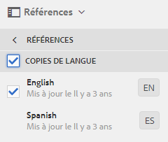
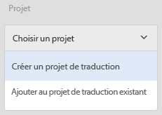
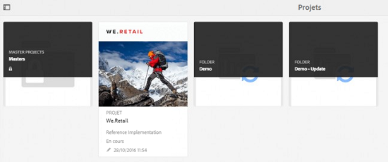
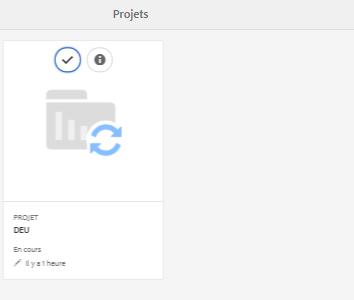
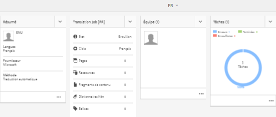
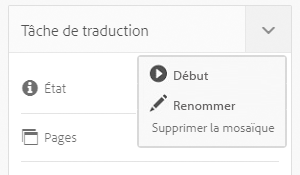
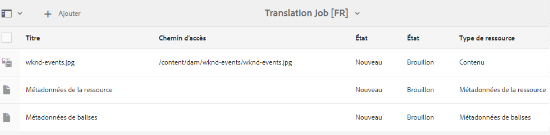
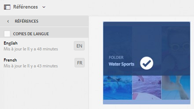

# Gestion de ressources composites {#managing-compound-assets}

Le composant Adobe Experience Manager (AEM) Assets peut déterminer si un fichier chargé contient des références à des ressources existant déjà dans le référentiel. Cette fonctionnalité est disponible uniquement pour les types de format pris en charge. Si le fichier chargé contient des références à des actifs AEM, un lien bidirectionnel est créé entre les ressources chargées et celles référencées.

En plus de supprimer toute redondance, le référencement des ressources AEM dans les applications Adobe Creative Cloud améliore la collaboration et accroît l’efficacité et la productivité des utilisateurs.

AEM Assets supports **bidirectional referencing**. Vous trouverez des ressources référencées dans la page des détails de la ressource du fichier chargé. Vous pouvez, en outre, afficher les fichiers de référencement des ressources AEM dans la page des détails de la ressource référencée.

Les références sont résolues sur la base du chemin d’accès, du document et de l’ID d’instance des ressources référencées.

## Ajout de ressources AEM Assets en tant que références dans Adobe Illustrator {#refai}

Vous pouvez référencer des ressources AEM existantes dans un fichier Adobe Illustrator.

1. Using [AEM desktop app](https://docs.adobe.com/content/help/en/experience-manager-desktop-app/using/using.html), mount AEM Assets repository as a drive on your local machine. Dans le lecteur monté, accédez à l’emplacement de la ressource à référencer.
1. Faites glisser la ressource du volume monté jusqu’au fichier Illustrator.
1. Save the Illustrator file to the mounted drive, or [upload](/help/assets/manage-digital-assets.md#uploading-assets) to the AEM repository.
1. Une fois le processus terminé, accédez à la page des détails de la ressource. Les références à des ressources AEM existantes sont répertoriées sous **Dépendances** dans la colonne **Références**.

   

1. The referenced assets that appear under **Dependencies** can also be referenced by files other than the current one. Pour afficher une liste des fichiers de référencement d’une ressource, cliquez sur son nom sous **Dépendances**.

   

1. Click the **View Properties** icon from the toolbar. Dans la page des propriétés, la liste des fichiers qui référencent l’actif en cours est visible sous la colonne **Références** dans l’onglet **De base**.

   

## Ajout de ressources AEM Assets en tant que références dans Adobe InDesign {#add-aem-assets-as-references-in-adobe-indesign}

Pour référencer des fichiers AEM depuis un fichier InDesign, faites glisser les fichiers AEM vers le fichier InDesign ou exportez le fichier InDesign sous forme de fichier ZIP.

Les ressources référencées existent déjà dans AEM Assets. <!-- You can extract subassets by [configuring InDesign server](/help/assets/indesign.md). Embedded assets in an InDesign file are extracted as subassets. -->

>[!NOTE]
>
>Si le serveur InDesign est soumis à un proxy, l’aperçu des fichiers InDesign est intégré à leurs métadonnées XMP. Dans ce cas, l’extraction de miniature n’est pas explicitement requise. Toutefois, si le serveur InDesign n’est pas soumis à un proxy, les miniatures doivent être explicitement extraites pour les fichiers InDesign.

### Création de références en faisant glisser des ressources AEM {#create-references-by-dragging-aem-assets}

Cette procédure est similaire à l’[ajout de ressources AEM en tant que références dans Adobe Illustrator](#refai).

### Création de références aux ressources AEM en exportant un fichier ZIP {#create-references-to-aem-assets-by-exporting-a-zip-file}

1. Créez un modèle de workflow.
1. Utilisez l’option Assemblage d’Adobe InDesign pour exporter le document.
Adobe InDesign peut exporter un document et les ressources liées sous la forme d’un assemblage. Dans ce cas, le dossier exporté contient un dossier Liens dans lequel se trouvent des sous-ressources dans le fichier InDesign.
1. Créez un fichier ZIP et transférez-le dans le référentiel AEM.
1. Commencez le workflow de désarchivage.
1. When the workflow completes, the references in the Links folder are automatically referenced as subassets. To view a list of referred assets, navigate to the asset details page of the InDesign asset and close the [Rail](/help/sites-cloud/authoring/getting-started/basic-handling.md#rail-selector).

## Ajout de ressources AEM Assets en tant que références dans Adobe Photoshop {#refps}

1. À l’aide d’un client WebDAV, montez AEM Assets comme lecteur.
1. Pour créer des références à des ressources AEM dans un fichier Photoshop, accédez aux ressources correspondantes sur le volume monté à l’aide de l’option Importer et lier dans Photoshop.

   

1. Save in Photoshop file to the mounted drive or or [upload](/help/assets/manage-digital-assets.md#uploading-assets) to the AEM repository.
1. Une fois le processus terminé, les références aux ressources AEM existantes sont répertoriées dans la page des détails de la ressource.

   To view the referenced assets, close the [Rail](/help/sites-cloud/authoring/getting-started/basic-handling.md#rail-selector) in the asset details page.

1. The referenced assets also contain the list of assets they are referenced from. To view a list of referenced assets, navigate to the asset details page and close the [Rail](/help/sites-cloud/authoring/getting-started/basic-handling.md#rail-selector).

>[!NOTE]
>
>Les ressources des ressources composées peuvent également être référencées en fonction de leur ID de document et de leur ID d’instance. Cette fonctionnalité est disponible avec les versions d’Adobe Illustrator et d’Adobe Photoshop uniquement. Pour les autres, le référencement s’effectue sur la base du chemin d’accès relatif des ressources liées dans la ressource composite principale, comme dans les versions précédentes d’AEM.

## Affichage des pages d’un fichier multipage {#view-pages-of-a-multi-page-file}

La visionneuse d’AEM Assets vous permet d’afficher séparément les pages de fichiers multipage aux formats PDF, INDD, PPT, PPTX et AI. S’agissant d’InDesign, vous pouvez extraire des pages à l’aide du serveur InDesign. Si les aperçus des pages sont enregistrés lors de la création du fichier InDesign, le serveur InDesign n’est pas nécessaire pour l’extraction des pages.

Vous pouvez parcourir les pages individuelles d’un fichier à partir de la page de ressource. Vous pouvez utiliser les options de la barre d’outils pour annoter chaque page du fichier. You can also use the **Page Overview** option to view all the pages simultaneously.

1. Dans AEM Assets, accédez au dossier qui contient le fichier de plusieurs pages.
1. Cliquez sur la ressource pour afficher sa page de ressource.

   

1. Cliquez sur l’icône de navigation globale, puis sélectionnez **Pages** dans le menu.

   

1. Cliquez sur les flèches gauche ou droite sous l’image pour accéder aux pages individuelles du fichier.

   

1. To annotate a page, click the **Annotate** icon from the toolbar and add a comment.

   

1. To download the file, click the **Download** icon.

   

1. To view all pages of the file simultaneously, click the **Page Overview** icon.

   

1. To view the activity stream for the file, including annotations and downloads, click the Global Nav ico and then choose **Timeline** from the menu.

   

1. To view and edit the metadata properties of the page, click the **View Properties** icon from the toolbar.

   
