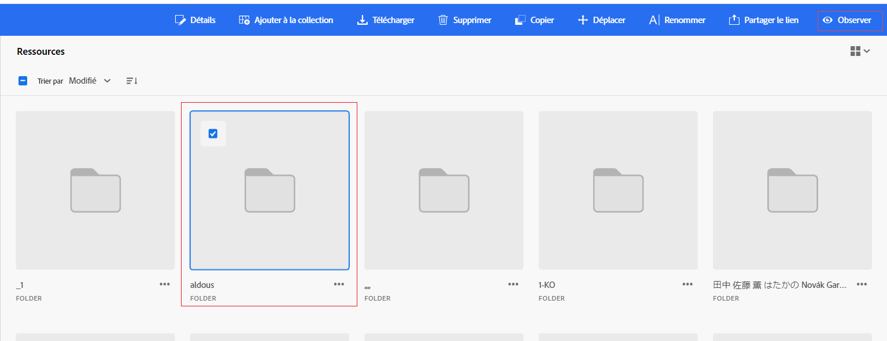

# Surveiller des ressources, des dossiers et des collections {#watch-assets-folders}

Les notifications de la vue Assets vous permettent de surveiller les opérations effectuées sur les ressources, les dossiers ou les collections disponibles dans le référentiel. Pour recevoir les notifications, vous devez sélectionner le contenu et vous y abonner. Vous pouvez également configurer les catégories pour lesquelles les notifications vous sont envoyées.

## S’abonner aux catégories de notification {#subscribe-to-notification-categories}

Vous pouvez choisir de vous abonner à une liste de catégories et recevoir des notifications. La vue Assets vous envoie les notifications uniquement pour les catégories que vous sélectionnez dans les options disponibles :

<table>
    <tbody>
     <tr>
      <th><strong>Catégorie de notification</strong></th>
      <th><strong>Description</strong></th>
     </tr>
     <tr>
      <td>Demandes</td>
      <td>Lorsque vous affectez une tâche à un utilisateur, vous recevez des notifications pour toute action effectuée sur cette tâche par cet utilisateur.</td>
     </tr>
     <tr>
      <td>Affecté à moi</td>
      <td>Vous recevez une notification lorsqu’une tâche vous est assignée par un autre utilisateur.</td>
     </tr>
     <tr>
      <td>Commentaire sur le contenu auquel vous êtes abonné</td>
      <td>Vous recevez une notification lorsqu’un utilisateur apporte un commentaire sur la ressource à laquelle vous êtes abonné.</td>
     </tr>
     <tr>
      <td>Suppression du contenu auquel vous êtes abonné</td>
      <td>Vous recevez une notification lorsqu’un utilisateur supprime une ressource, un dossier ou une collection auquel vous êtes abonné.</td>
     </tr>
     <tr>
      <td>Partage externe de contenu auquel vous êtes abonné</td>
      <td>Vous recevez une notification lorsqu’un utilisateur génère un lien public pour la ressource, le dossier ou la collection auquel vous êtes abonné.</td>
     </tr>
     <tr>
      <td>Modification du contenu auquel vous êtes abonné</td>
      <td>Vous recevez une notification lorsqu’un utilisateur crée une nouvelle version de la ressource à laquelle vous êtes abonné.</td>
     </tr>
     <tr>
      <td>Déplacement/changement de nom du contenu auquel vous êtes abonné</td>
      <td>Vous recevez une notification lorsqu’un utilisateur déplace ou renomme la ressource ou le dossier auquel vous êtes abonné.</td>
     </tr>
     <tr>
      <td>Mise à jour des dossiers et collections auxquels vous êtes abonné</td>
      <td>Vous recevez une notification lorsqu’un utilisateur ajoute ou supprime une ressource d’une collection ou d’un dossier auquel vous êtes abonné.</td>
     </tr>    
    </tbody>
   </table>

Pour vous abonner aux catégories de notification, procédez comme suit :

1. Cliquez sur l’ à l’extrémité droite de la barre de menu de l’interface utilisateur de la vue Assets.

1. Cliquez sur  pour consulter la page [!UICONTROL Préférences Experience Cloud].

1. Cliquez sur l’option **[!UICONTROL Notifications]** disponible dans le volet de gauche.

1. Dans la section **[!UICONTROL Notifications]**, accédez à la section [!UICONTROL vue Assets] et assurez-vous que le bouton (bascule) est bien activé.

   

1. Cliquez sur **[!UICONTROL Personnaliser]** pour afficher les catégories de notification.
   

1. Sélectionnez les catégories pour lesquelles vous souhaitez recevoir des notifications.

## Observer et ne pas observer de dossiers, ressources ou collections {#watch-unwatch-assets}

Vous pouvez observer et annuler l’observation de dossiers, ressources ou collections afin de rester informé, ce qui permet une meilleure collaboration autour des ressources que vous surveillez.

Une fois que vous êtes [abonné aux catégories de notification](#subscribe-to-notification-categories), vous devez vous abonner au contenu pour commencer à recevoir des notifications.

>[!NOTE]
>
>* Pour les catégories de notification **[!UICONTROL Demandes]** et **[!UICONTROL Attribué à moi]**, vous n’avez pas besoin de vous abonner au contenu après vous être abonné aux catégories de notification. Les notifications vous sont automatiquement envoyées dans les situations suivantes : lorsque vous créez une demande et lorsqu’une tâche vous est affectée.
>* La vue Assets envoie des notifications uniquement lorsque d’autres personnes utilisatrices effectuent des actions sur le contenu avec abonnement. Vous ne recevez pas de notifications pour les actions que vous effectuez sur le contenu avec abonnement.

### S’abonner au contenu {#subscribe-to-content}

Pour vous abonner à des dossiers, des ressources ou des collections, procédez comme suit :

1. Parcourez le dossier, la ressource ou la collection auquel vous souhaitez vous abonner, puis cliquez sur **[!UICONTROL Observer]**.

1. La vue Assets affiche un message de réussite. Vous pouvez cliquer sur **[!UICONTROL Accéder aux préférences de notification]** dans le message de réussite pour modifier votre [abonnement aux catégories de notification](#subscribe-to-notification-categories).

   

La vue Assets enverra désormais des notifications pour les catégories auxquelles vous êtes abonné. Pour gagner du temps, vous pouvez également sélectionner plusieurs ressources, dossiers ou collections puis cliquer sur **[!UICONTROL Observer]**. Toutefois, si vous sélectionnez plusieurs éléments et que certains sont déjà abonnés, l’option **[!UICONTROL Observer]** ne s’affiche pas.

### Afficher le contenu avec abonnement {#view-subscribed-content}

Pour afficher le contenu auquel vous êtes abonné, procédez comme suit :

1. Accédez à **[!UICONTROL Watched Assets]** sous [!UICONTROL Gestion des ressources].

1. La vue Assets affiche une liste des ressources auxquelles vous êtes abonné, y compris leur nom, leur type et leur chemin d’accès. Sélectionnez une ressource, un dossier ou une collection dans la liste pour afficher ses détails, son emplacement ou pour [se désabonner](#unsubscribe-to-content).

   

### Afficher les abonnés au contenu {#view-content-subscribers}

Pour afficher vos abonnés au contenu, procédez comme suit :

1. Parcourez le dossier, la ressource ou la collection et sélectionnez **[!UICONTROL Détails]**.

1. Cliquez sur icône œil dans le volet de droite pour afficher une liste d’observateurs du contenu.

   Vous pouvez également cliquer sur  dans le volet de droite pour afficher les observateurs de contenu.

### Se désabonner du contenu {#unsubscribe-to-content}

Pour annuler votre abonnement :

1. Accédez à **[!UICONTROL Watched Assets]** sous [!UICONTROL Gestion des ressources].

1. Sélectionnez la ressource, le dossier ou la collection dont vous souhaitez vous désabonner, puis cliquez sur **[!UICONTROL Ne pas observer]**.

   

Vous pouvez également parcourir le dossier, la ressource ou la collection sous [!UICONTROL Gestion des ressources]. Sélectionnez la [ressource avec abonnement](#subscribe-to-content) et cliquez sur **[!UICONTROL Ne pas observer]**.

## Consulter les notifications {#view-notifications}

Les notifications s’affichent à l’extrémité droite de la barre de menu dans l’interface utilisateur de la vue Assets.

Lorsque vous cliquez sur une notification, la vue Assets vous dirige vers la ressource à laquelle, ou le dossier auquel, cette notification fait référence.
