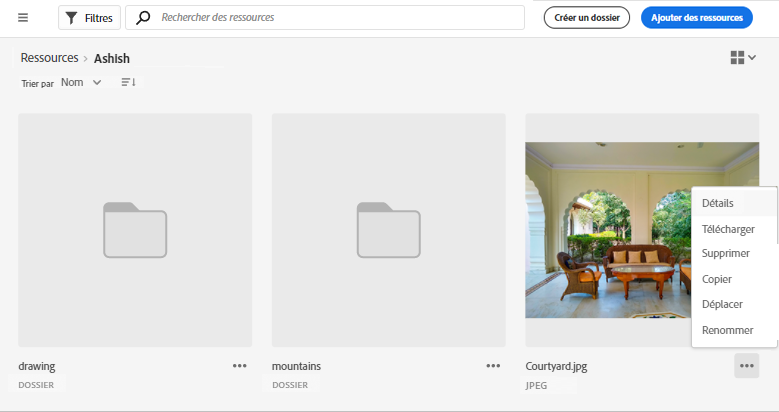
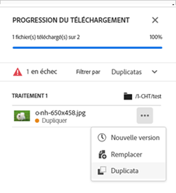

# Gestion des actifs {#manage-assets}

| [Bonnes pratiques de recherche](/help/assets/search-best-practices.md) | [Bonnes pratiques relatives aux métadonnées](/help/assets/metadata-best-practices.md) | [Hub de contenus](/help/assets/product-overview.md) | [Fonctionnalités Dynamic Media avec OpenAPI](/help/assets/dynamic-media-open-apis-overview.md) | [Documentation de développement pour AEM Assets](https://developer.adobe.com/experience-cloud/experience-manager-apis/) |
| ------------- | --------------------------- |---------|----|-----|

Vous pouvez effectuer facilement de nombreuses tâches de gestion des actifs numériques (DAM) grâce à l’interface conviviale d’[!DNL Assets view]. Une fois les ressources ajoutées, vous pouvez les rechercher, les télécharger, les déplacer, les copier, les renommer, les supprimer, les mettre à jour et les modifier.

Utilisez [!DNL Assets view] pour accomplir les tâches de gestion des actifs suivantes. Lorsque vous sélectionnez une ressource, les options suivantes s’affichent dans la barre d’outils supérieure.

*Image : options disponibles dans la barre d’outils lors de la sélection d’une image.*

*  Désélectionnez la sélection.

*  Recherchez une ressource d’image similaire dans l’interface utilisateur Assets en fonction des métadonnées et des balises intelligentes.

*  Cliquez pour prévisualiser une ressource et afficher le détail des métadonnées. Lors de la prévisualisation, vous pouvez afficher les versions et modifier une image.

*  Téléchargez la ressource sélectionnée vers votre système de fichiers local.

*  Ajoutez la ressource sélectionnée à une collection.

*  Épinglez une ressource pour y accéder plus rapidement lorsque vous en aurez besoin ultérieurement. Tous les éléments épinglés s’affichent dans la section **Accès rapide** de Mon espace de travail.

*  Modifiez une image dans Adobe Express intégré à Adobe Experience Manager Assets.

*  Modifiez l’image à l’aide d’Adobe Express.

*  Partagez des liens d’une ressource avec d’autres personnes, afin qu’elles puissent y accéder et la télécharger.

*  Supprimez la ressource ou le dossier sélectionné.

*  Copiez le fichier ou le dossier sélectionné.

*  Déplacez la ressource ou le dossier sélectionné vers un autre emplacement de la hiérarchie du référentiel.

*  Renommez la ressource ou le dossier sélectionné. Utilisez un nom unique sans quoi le renommage pourrait échouer avec un avertissement. Vous pouvez réessayer avec un nouveau nom.
Vous pouvez également cliquer sur le titre d’une ressource ou d’un dossier pour renommer. Mentionnez le nouveau texte dans la zone de texte **Renommer la ressource** et cliquez sur **Enregistrer**. Cette fonctionnalité est disponible dans les vues Grille, Galerie, Cascade et Liste.

*  [!UICONTROL Vue Cascade]

*  Ajoutez une ressource à la bibliothèque.

*  Affectez des tâches à d’autres utilisateurs et utilisatrices afin de collaborer sur une ressource.

*  Surveillez les opérations effectuées sur une ressource.

Vous pouvez afficher les mêmes options sur les miniatures des ressources.

[!DNL Assets view] affiche uniquement les options de la barre d’outils qui sont appropriées pour le type de la ressource sélectionnée.

*Image : options disponibles dans la barre d’outils lors de la sélection d’un dossier.*

*Image : options disponibles dans la barre d’outils lors de la sélection d’un fichier PDF.*

## Téléchargement et distribution de ressources {#download}

Vous pouvez sélectionner des ressources ou des dossiers, ou une combinaison des deux, et télécharger la sélection vers votre système de fichiers local. Vous pouvez modifier les ressources et les charger à nouveau ou les distribuer en dehors d’[!DNL Assets view]. Vous pouvez également [télécharger les rendus](/help/assets/add-delete-assets-view.md#renditions) d’une ressource.

## Contrôle de version des ressources {#versions-of-assets}

<!-- 
TBD: query for engineering: How many versions are maintained. What happens when we reach that limit? Are old versions automatically removed? -->

[!DNL Assets view] crée de nouvelles versions des ressources lorsque celles-ci sont à nouveau chargées et mises à jour ou modifiées. Vous pouvez afficher l’historique des versions et les versions antérieures, et restaurer une des versions antérieures de la ressource à la place de la dernière version, qui est quand à elle sauvegardée si nécessaire en tant que version précédente. De nouvelles versions des ressources sont créées dans les scénarios suivants :

* Chargement d’une nouvelle ressource dotée du même nom de fichier qu’une ressource existant déjà dans le même dossier. [!DNL Assets view] invite à remplacer la ressource précédente ou à enregistrer la nouvelle ressource en tant que nouvelle version. Consultez [Chargement de ressources en double](/help/assets/add-delete-assets-view.md).

  

  *Image : lors du chargement d’une ressource nommée de la même manière qu’une ressource existante, vous pouvez créer une nouvelle version de la ressource.*

* Modifiez une image et cliquez sur **[!UICONTROL Enregistrer comme version]**. Consultez [Modification d’images](/help/assets/edit-images-assets-view.md).

  

  *Image : enregistrez l’image modifiée en tant que nouvelle version.*

* Ouvrez les différentes versions d’une ressource existante. Cliquez sur **[!UICONTROL Nouvelle version]** et chargez une version plus récente de la ressource dans le référentiel.

  

### Affichage des versions d’une ressource {#view-versions}

Lors du chargement d’un doublon ou de la copie modifiée d’une ressource, vous pouvez créer ses versions. Le contrôle de version vous permet de passer en revue l’historique des ressources et de revenir à une version précédente si nécessaire.

Pour afficher les versions, ouvrez l’aperçu d’une ressource et cliquez sur  **[!UICONTROL Versions]** dans la barre latérale droite. Pour prévisualiser une version en particulier, sélectionnez-la. Pour la restaurer, cliquez sur **[!UICONTROL Restaurer en tant que dernière version]**.

Vous pouvez également créer des versions à partir de l’historique des versions. Sélectionnez la dernière version, cliquez sur **[!UICONTROL Nouvelle version]**, puis chargez une nouvelle copie de la ressource à partir de votre système de fichiers local.

*Image : affichez les différentes versions d’une ressource, revenez à une version précédente ou chargez une autre version.*

## Gestion du statut des ressources {#manage-asset-status}

**Autorisations requises :**  `Can Edit`, `Owner` ou les autorisations d’administrateur sur une ressource.

La vue Assets vous permet de définir le statut des ressources disponibles dans le référentiel. Définissez le statut d’une ressource pour mieux gouverner et gérer la consommation en aval des ressources numériques.

Vous pouvez définir le statut suivant pour les ressources :

* Approuvé

* Refusé

* Aucun statut

### Définition du statut de la ressource {#set-asset-status}

Pour définir le statut de la ressource :

1. Sélectionnez la ressource, puis cliquez sur **[!UICONTROL Détails]** dans la barre d’outils.

1. Dans l’onglet **[!UICONTROL De base]**, sélectionnez le statut de la ressource dans la liste déroulante **[!UICONTROL Statut]**. Les valeurs possibles sont Approuvé, Refusé et Aucun statut (par défaut).
Si des fonctionnalités OpenAPI de Dynamic Media sont fournies pour votre environnement, Experience Manager Assets génère une URL publique dès que vous marquez la ressource comme `Approved`.

   >[!VIDEO](https://video.tv.adobe.com/v/342495)

### Définir la cible de validation {#set-approval-target}

La vue Assets vous permet de publier des ressources approuvées dans Dynamic Media avec des fonctionnalités OpenAPI, Content Hub, ou les deux, en fonction de la valeur que vous avez définie dans le champ **Cible d’approbation** disponible sur la page Détails de la ressource.

Pour définir la cible de validation :

1. Sélectionnez la ressource, puis cliquez sur **[!UICONTROL Détails]** dans la barre d’outils.

1. Dans l’onglet **[!UICONTROL De base]**, sélectionnez le statut de la ressource dans la liste déroulante **[!UICONTROL Statut]**. Les valeurs possibles sont Approuvé, Refusé et Aucun statut (par défaut).

1. Si vous sélectionnez **Approuvé** à l’étape 2, sélectionnez une cible d’approbation. Les valeurs possibles sont les suivantes : Diffusion et Content Hub.

   * **Diffusion** est l’option par défaut sélectionnée dans le menu déroulant et elle publie la ressource dans [Dynamic Media avec OpenAPI](/help/assets/dynamic-media-open-apis-overview.md) et [Content Hub](/help/assets/product-overview.md), si les deux sont activés pour Experience Manager Assets.

   * La sélection de **Content Hub** publie la ressource uniquement dans Content Hub. Content Hub s’affiche en tant qu’option uniquement s’il est activé pour Experience Manager Assets.

   * Si vous ne sélectionnez pas d’option dans la liste déroulante, l’option par défaut activée pour votre environnement AEM as a Cloud Service est automatiquement appliquée à la ressource.

   Pour plus d’informations sur les options disponibles, consultez [Cible d’approbation par défaut et destinations de publication pour les ressources approuvées](#default-approval-target-options-publish-destinations).

   >[!NOTE]
   >
   >La définition d’une cible de validation est une fonctionnalité à disponibilité limitée. Vous pouvez l’activer ou la désactiver en créant un ticket d’assistance. Si Dynamic Media avec OpenAPI est activé, il l’est par défaut.

   

1. Spécifiez d’autres propriétés de ressource et cliquez sur **[!UICONTROL Enregistrer]**.

Voici quelques autres points à noter :

* Lorsque vous n’utilisez pas le formulaire de métadonnées par défaut et que vous ne pouvez pas afficher le champ **[!UICONTROL Cible d’approbation]**, [modifiez votre formulaire de métadonnées](/help/assets/metadata-assets-view.md#metadata-forms) pour faire glisser le champ **[!UICONTROL Approbation de]** des composants disponibles vers votre formulaire de métadonnées et cliquez sur **[!UICONTROL Enregistrer]**.

* Lorsque vous sélectionnez la cible de validation comme `Content Hub` dans la vue Assets, les ressources sont mises à la disposition des utilisateurs de la même organisation dans Content Hub.

#### Cible d’approbation par défaut et destinations de publication pour les ressources approuvées {#default-approval-target-options-publish-destinations}

Le tableau suivant illustre les conditions préalables à l’affichage de `Approval Target` liste déroulante et de la cible d’approbation par défaut en fonction de l’activation de DM avec OpenAPI et Content Hub dans votre environnement AEM as a Cloud Service :

| Dynamic Media avec OpenAPI | Content Hub | La liste déroulante Cible d&#39;approbation s&#39;affiche ? | Cible d’approbation par défaut des ressources approuvées | Destination Publish |
| --- | --- | --- | --- |---|
| Activé | Activé | Oui | Diffusion | Dynamic Media avec OpenAPI et Content Hub |
| Pas activé | Activé | Oui | Content Hub | Content Hub |
| Activé | Pas activé | Oui | Diffusion | Dynamic Media avec OpenAPI |
| Pas activé | Pas activé | Non | N/A | S/O |

### Définir la date d’expiration de ressources {#set-asset-expiration-date}

La vue Assets vous permet également de définir la date d’expiration des ressources disponibles dans le référentiel. Par conséquent, vous pouvez [filtrer les résultats de la recherche](search-assets-view.md#refine-search-results) en fonction du statut d’une ressource `Expired`. En outre, vous pouvez spécifier une période d’expiration pour les ressources afin de filtrer davantage les résultats de votre recherche.

Pour définir la date d’expiration de ressource :

1. Sélectionnez la ressource, puis cliquez sur **[!UICONTROL Détails]** dans la barre d’outils.

1. Dans l’onglet **[!UICONTROL De base]**, définissez la date d’expiration de la ressource à l’aide du champ  **[!UICONTROL Date d’expiration]**.

L’indicateur de carte de ressources `Expired` remplace l’indicateur `Approved` ou `Rejected` défini pour une ressource.

Vous pouvez également filtrer les ressources en fonction de leur statut. Pour plus d’informations, consultez [Rechercher des ressources dans la vue Assets](search-assets-view.md).

## Personnalisation des formulaires de métadonnées pour inclure un champ de statut de ressource {#customize-asset-status-metadata-form}

**Autorisations requises :** administrateur

La vue Assets fournit par défaut de nombreux champs de métadonnées standard. Les entreprises ont d’autres besoins en métadonnées et ont besoin de davantage de champs de métadonnées pour ajouter des métadonnées spécifiques à leur entreprise. Les formulaires de métadonnées permettent aux entreprises d’ajouter des champs de métadonnées personnalisés à la page [!UICONTROL Détails] d’une ressource. Les métadonnées spécifiques à l’entreprise améliorent la gouvernance et la découverte de ses ressources.

Pour plus d’informations sur l’ajout de champs de métadonnées supplémentaires au formulaire de métadonnées, consultez [Formulaires de métadonnées](metadata-assets-view.md#metadata-forms).

**Ajout du champ de métadonnées Statut de la ressource au formulaire**

Pour ajouter un champ de métadonnées Statut de la ressource au formulaire, faites glisser **[!UICONTROL Statut de la ressource]** du rail de gauche vers le formulaire. La propriété de mappage est prérenseignée automatiquement. Enregistrez le formulaire pour confirmer les modifications.

**Ajouter le champ de métadonnées Date d’expiration au formulaire**

Pour ajouter un champ de métadonnées Date d’expiration au formulaire, faites glisser le composant **[!UICONTROL Date]** du rail de gauche vers le formulaire. Spécifiez la **Date d’expiration** comme libellé et `pur:expirationDate` comme propriété de mappage. Enregistrez le formulaire pour confirmer les modifications.

## Étapes suivantes {#next-steps}

* [Regardez une vidéo pour gérer les ressources dans la vue Assets](https://experienceleague.adobe.com/fr/docs/experience-manager-learn/assets-essentials/basics/managing)

* Faites des commentaires sur le produit en utilisant l’option [!UICONTROL Commentaires] disponible dans l’interface utilisateur de la vue Assets

* Faites des commentaires sur la documentation en utilisant l’option [!UICONTROL Modifier cette page]  ou [!UICONTROL Enregistrer un problème]  disponible dans la barre latérale droite.

* Contactez l’[assistance clientèle](https://experienceleague.adobe.com/fr?support-solution=General#support).

