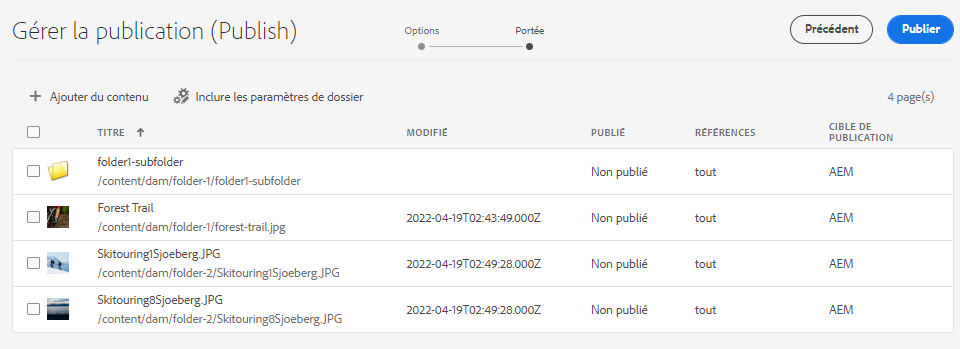

# Gestion de la publication dans Experience Manager Assets {#manage-publication-in-aem}

En tant qu’administrateur ou administratrice [!DNL Adobe Experience Manager Assets], vous pouvez publier des ressources et des dossiers contenant des ressources de votre instance de création sur [!DNL Experience Manager Assets], [!DNL Dynamic Media] et [!DNL Brand Portal]. Vous pouvez également planifier la publication d’une ressource ou d’un dossier à une date ou une heure ultérieure. Une fois ces éléments publiés, les utilisateurs peuvent accéder aux ressources et les distribuer à d’autres utilisateurs. Par défaut, vous pouvez publier des ressources et des dossiers sur [!DNL Experience Manager Assets]. Cependant, vous pouvez configurer [!DNL Experience Manager Assets] pour activer la publication sur [[!DNL Dynamic Media]](https://experienceleague.adobe.com/docs/experience-manager-cloud-service/content/assets/dynamicmedia/config-dm.html?lang=fr) et [[!DNL Brand Portal]](https://experienceleague.adobe.com/docs/experience-manager-cloud-service/content/assets/brand-portal/configure-aem-assets-with-brand-portal.html?lang=fr).

Vous pouvez publier ou dépublier des ressources au niveau de la ressource ou du dossier à l’aide de l’option **[!UICONTROL Publication rapide]** ou **[!UICONTROL Gérer la publication]**, disponibles dans l’interface [!DNL Experience Manager Assets]. Si vous apportez des modifications ultérieures à la ressource ou au dossier d’origine dans [!DNL Experience Manager Assets], les modifications ne sont pas répercutées dans l’instance de publication tant que vous n’avez pas republié à partir de [!DNL Experience Manager Assets]. Cela permet de s’assurer que les modifications en cours ne sont pas disponibles dans l’instance de publication. Seules les modifications approuvées publiées par un administrateur sont disponibles dans l’instance de publication.

* [Publication de ressources à l’aide de la publication rapide](#quick-publish)
* [Publication de ressources à l’aide de la fonction Gérer la publication](#manage-publication)
* [Publication ultérieure des ressources](#publish-assets-later)
* [Publication de ressources vers Dynamic Media](#publish-assets-to-dynamic-media)
* [Publication de ressources sur Brand Portal](#publish-assets-to-brand-portal)
* [Demander la publication](#request-publication)
* [Restrictions et conseils](#limitations-and-tips)

## Publication de ressources à l’aide de la publication rapide {#quick-publish}

La publication rapide vous permet de publier immédiatement le contenu vers la destination sélectionnée. Dans la console [!DNL Experience Manager Assets], accédez au dossier parent et sélectionnez toutes les ressources ou tous les dossiers à publier. Cliquez sur l’option **[!UICONTROL Publication rapide]** dans la barre d’outils, puis sélectionnez dans la liste déroulante la destination où vous souhaitez publier les ressources.

## Publication de ressources à l’aide de la fonction Gérer la publication {#manage-publication}

L’option Gérer la publication permet de publier ou de dépublier du contenu vers et depuis la destination sélectionnée, [d’ajouter du contenu](#add-content) à la liste de publication à partir du référentiel DAM, [d’inclure des paramètres de dossier](#include-folder-settings) de publier le contenu des dossiers sélectionnés et d’appliquer des filtres, et [de planifier la publication](#publish-assets-later) à une date ou une heure ultérieure.

Dans la console [!DNL Experience Manager Assets], accédez au dossier parent et sélectionnez toutes les ressources ou tous les dossiers à publier. Cliquez sur **[!UICONTROL Gérer la publication]** dans la barre d’outils. Si vous n’avez pas configuré [!DNL Dynamic Media] et [!DNL Brand Portal] dans votre instance [!DNL Experience Manager Assets], vous pouvez publier des ressources et des dossiers uniquement dans [!DNL Experience Manager Assets].

Les options suivantes sont disponibles dans l’interface [!UICONTROL Gérer la publication] :

* [!UICONTROL Actions]
   * `Publish` : publication de ressources et de dossiers vers la destination sélectionnée
   * `Unpublish` : dépublication de ressources et de dossiers à partir de la destination

* [!UICONTROL Destination]
   * `Publish` : publication de ressources et de dossiers sur [!DNL Experience Manager Assets] (`AEM`)
   * `Dynamic Media` : publication de ressources sur [!DNL Dynamic Media]
   * `Brand Portal` : publication de ressources et de dossiers sur [!DNL Brand Portal]

* [!UICONTROL Planification]
   * `Now` : publication immédiate des ressources
   * `Later` : publication des ressources en fonction de la date ou de l’heure `Activation`

Pour continuer, cliquez sur **[!UICONTROL Suivant]**. Selon la sélection, l’onglet **[!UICONTROL Portée]** reflète différentes options. Les options des sections **[!UICONTROL Ajouter du contenu]** et **[!UICONTROL Inclure des paramètres de dossier]** ne sont disponibles que pour la publication des ressources et des dossiers vers [!DNL Experience Manager Assets] (`Destination: Publish`).

### Ajouter du contenu {#add-content}

La publication vers [!DNL Experience Manager Assets] vous permet d’ajouter davantage de contenu (ressources et dossiers) à la liste de publication. Vous pouvez ajouter d’autres ressources ou dossiers à la liste dans les référentiels DAM. Cliquez sur le bouton **[!UICONTROL Ajouter du contenu]** pour ajouter plus de contenu.

Vous pouvez ajouter plusieurs ressources à partir d’un dossier ou ajouter plusieurs dossiers à la fois. Cependant, vous ne pouvez pas ajouter de ressources à partir de plusieurs dossiers à la fois.

### Inclure les paramètres de dossier {#include-folder-settings}

Par défaut, publier un dossier dans [!DNL Experience Manager Assets] publie toutes les ressources, tous les sous-dossiers et leurs références.

Pour filtrer le contenu du dossier que vous souhaitez publier, cliquez sur **[!UICONTROL Inclure des paramètres de dossier]** :

* `Include folder contents`

   * Activé : toutes les ressources du dossier sélectionné, les sous-dossiers (y compris toutes les ressources des sous-dossiers) et les références sont publiés.
   * Désactivé : seul le dossier sélectionné (vide) et les références sont publiés. Les ressources du dossier sélectionné ne sont pas publiées.

* `Include folder contents` et `Include only immediate folder contents`

  Si les deux options sont sélectionnées, toutes les ressources du dossier, des sous-dossiers (vides) et des références sélectionnés sont publiées. Les ressources des sous-dossiers ne sont pas publiées.

<!--
* [!UICONTROL Include only immediate folder contents]: Only the subfolders content and references are published. 

Only the selected folder content and references are published.
-->

Après avoir appliqué les filtres, cliquez sur **[!UICONTROL OK]**, puis cliquez sur **[!UICONTROL Publier]**. Lorsque vous cliquez sur le bouton de publication, un message de confirmation `Resource(s) have been scheduled for publication` apparaît. Les ressources et (ou) les dossiers sélectionnés sont publiés vers la destination définie en fonction du planificateur (`Now` ou `Later`). Connectez-vous à votre instance de publication pour vérifier que les ressources et (ou) les dossiers ont bien été publiés.

Dans l’illustration ci-dessus, vous pouvez voir différentes valeurs pour l’attribut **[!UICONTROL Cible de publication]**. Rappelons-nous que vous avez choisi de publier vers [!DNL Experience Manager Assets] (`Destination: Publish`). Alors, pourquoi indique-t-il que seuls un dossier et une ressource sont publiés vers `AEM`, et que les deux autres ressources sont publiées à la fois vers `AEM` et `Dynamic Media` ?

Ici, vous devez comprendre le rôle des propriétés du dossier. Le **[!UICONTROL mode de publication Dynamic Media]** d’un dossier joue un rôle important dans la publication. Pour afficher les propriétés d’un dossier, sélectionnez-le, puis cliquez sur **[!UICONTROL Propriétés]** dans la barre d’outils. Pour une ressource, consultez les propriétés de son dossier parent.

Le tableau suivant explique comment la publication se produit en fonction de la **[!UICONTROL Destination]** et du **[!UICONTROL Mode de publication Dynamic Media]** définis :

| [!UICONTROL Destination] | [!UICONTROL Mode de publication Dynamic Media] | [!UICONTROL Cible de publication] | Contenu autorisé |
| --- | --- | --- | --- |
| Publier | Publication sélective | `AEM` | Ressources et (ou) dossiers |
| Publication | Immédiat | `AEM` et `Dynamic Media` | Ressources et (ou) dossiers |
| Publication | Lors de l’activation | `AEM` et `Dynamic Media` | Ressources et (ou) dossiers |
| Dynamic Media | Publication sélective | `Dynamic Media` | Assets |
| Dynamic Media | Immédiat | `None` | Impossible de publier les ressources |
| Dynamic Media | Lors de l’activation | `None` | Impossible de publier les ressources |

>[!NOTE]
>
>Seules les ressources sont publiées vers [!DNL Dynamic Media].
>
>La publication d’un dossier vers [!DNL Dynamic Media] n’est pas prise en charge.
>
>Si vous sélectionnez un dossier (`Selective Publish`) et choisissez la destination [!DNL Dynamic Media], l’attribut [!UICONTROL Cible de publication] affiche `None`.

Changeons maintenant la **[!UICONTROL Destination]** dans le cas d’utilisation ci-dessus sur **[!UICONTROL Dynamic Media]**, et vérifions les résultats. Ce faisant, seule la ressource du dossier `Selective Publish` est publiée dans [!DNL Dynamic Media]. Les ressources des dossiers `Immediate` et `Upon Activation` ne sont pas publiées et affichent `None`.

>[!NOTE]
>
>Si [!DNL Dynamic Media] n’est pas configuré sur votre instance [!DNL Experience Manager Assets] et si la **[!UICONTROL Destination]** est sur **[!UICONTROL Publier]**, les ressources et les dossiers sont toujours publiés vers `AEM`.
>
>La publication vers [!DNL Brand Portal] est indépendante des propriétés d’un dossier. Toutes les ressources, tous les dossiers et toutes les collections peuvent être publiés sur Brand Portal. Consultez [Publication de ressources sur Brand Portal. ](#publish-assets-to-brand-portal)

>[!NOTE]
>
>Si vous avez personnalisé l’assistant [!DNL Manage Publication], votre personnalisation continue de fonctionner avec les fonctionnalités existantes.
>
>Cependant, vous pouvez supprimer la personnalisation existante pour utiliser les nouvelles fonctions [!DNL Manager Publication].

## Publication ultérieure des ressources {#publish-assets-later}

Pour planifier le workflow de publication des ressources à une date ou à une heure ultérieure :

1. Dans la console [!UICONTROL Experience Manager Assets], accédez au dossier parent et sélectionnez toutes les ressources ou tous les dossiers dont vous voulez planifier la publication.
1. Cliquez sur **[!UICONTROL Gérer la publication]** dans la barre d’outils.
1. Cliquez sur **[!UICONTROL Publier]** dans **[!UICONTROL Action]**, puis sélectionnez la **[!UICONTROL Destination]** vers laquelle vous souhaitez publier le contenu.
1. Sélectionnez **[!UICONTROL Plus tard]** dans **[!UICONTROL Planification]**.
1. Sélectionnez une **[!UICONTROL Date d’activation]** et spécifiez la date et l’heure. Cliquez sur **[!UICONTROL Suivant]**.

   

1. Dans l’onglet **[!UICONTROL Portée]**, sélectionnez **[!UICONTROL Ajouter du contenu]** (si nécessaire). Cliquez sur **[!UICONTROL Suivant]**.
1. Dans l’onglet **[!UICONTROL Workflows]**, spécifiez un titre de workflow. Cliquez sur **[!UICONTROL Publier ultérieurement]**.

   

   Connectez-vous à l’instance de destination pour vérifier les ressources publiées (selon la date ou l’heure planifiée).

## Publication de ressources vers Dynamic Media {#publish-assets-to-dynamic-media}

Seules les ressources sont publiées vers [!DNL Dynamic Media]. Cependant, le comportement de publication diffère en fonction des propriétés du dossier. Un dossier peut être configuré en **[!UICONTROL Mode de publication Dynamic Media]** pour une publication sélective selon l’une des options suivantes :

* `Selective Publish`
* `Immediate`
* `Upon Activation`

Le processus de publication en mode **[!UICONTROL Immédiat]** et **[!UICONTROL Lors de l’activation]** est cohérent mais différent de la **[!UICONTROL Publication sélective]**. Consultez la [Configuration de la publication sélective au niveau des dossiers dans Dynamic Media](https://experienceleague.adobe.com/docs/experience-manager-cloud-service/content/assets/dynamicmedia/selective-publishing.html?lang=fr). Après avoir configuré la publication sélective dans un dossier, vous pouvez effectuer l’une des opérations suivantes :

* [Publier sélectivement des ressources dans Dynamic Media ou Experience Manager à l’aide de la fonction Gérer la publication](https://experienceleague.adobe.com/docs/experience-manager-cloud-service/content/assets/dynamicmedia/selective-publishing.html?lang=fr#selective-publish-manage-publication)
* [Dépublier sélectivement des ressources dans Dynamic Media ou Experience Manager à l’aide de la fonction Gérer la publication](https://experienceleague.adobe.com/docs/experience-manager-cloud-service/content/assets/dynamicmedia/selective-publishing.html?lang=fr#selective-unpublish-manage-publication)
* [Publication de ressources dans Dynamic Media ou Experience Manager à l’aide de la publication rapide](https://experienceleague.adobe.com/docs/experience-manager-cloud-service/content/assets/dynamicmedia/selective-publishing.html?lang=fr#quick-publish-aem-dm)
* [Publier ou dépublier des ressources de manière sélective au moyen des résultats de recherche](https://experienceleague.adobe.com/docs/experience-manager-cloud-service/content/assets/dynamicmedia/selective-publishing.html?lang=fr#selective-publish-unpublish-search-results)

## Publication de ressources sur Brand Portal {#publish-assets-to-brand-portal}

Vous pouvez publier des ressources, des dossiers et des collections dans l’instance [!DNL Experience Manager Assets Brand Portal].

* [Publication de ressources sur Brand Portal](https://experienceleague.adobe.com/docs/experience-manager-cloud-service/content/assets/brand-portal/publish-to-brand-portal.html?lang=fr#publish-assets-to-bp)
* [Publication de dossiers sur Brand Portal](https://experienceleague.adobe.com/docs/experience-manager-cloud-service/content/assets/brand-portal/publish-to-brand-portal.html?lang=fr#publish-folders-to-brand-portal)
* [Publication de collections sur Brand Portal](https://experienceleague.adobe.com/docs/experience-manager-cloud-service/content/assets/brand-portal/publish-to-brand-portal.html?lang=fr#publish-collections-to-brand-portal)

## Demander la publication {#request-publication}

L’option `Request Publication` permet d’authentifier le workflow des ressources avant de les publier sur l’environnement [!DNL AEM] Assets. [!DNL AEM] fournit différents niveaux d’autorisations à différents utilisateurs et utilisatrices. Vous pouvez être *contributeur ou contributrice*, c’est-à-dire que vous pouvez charger des ressources, mais vous ne pouvez pas les publier tant que les chargements ne sont pas vérifiés. En outre, en tant qu’*administrateur*, vous pouvez gérer la lecture et l’écriture de workflows d’Assets.

L’option Demander la publication est disponible pour les personnes suivantes :

* **Contributeur ou contributrice :** si vous êtes un utilisateur ou une utilisatrice pouvant contribuer aux ressources [!DNL AEM], vous disposez alors d’un accès limité au workflow [!DNL AEM] Assets. Pour vous, le bouton `Manage publication` est masqué. En tant que contributeur ou contributrice, vous ne pouvez contribuer qu’en ajoutant des ressources, mais vous ne pouvez pas les publier ni disposer d’un accès en lecture au workflow.

* **Utilisateur ou utilisatrice du workflow :** cet utilisateur ou utilisatrice ne peut pas publier de ressources, mais dispose d’un accès en lecture au workflow. En tant qu’utilisateur ou utilisatrice de workflow, vous pouvez :
   * Demander la publication
   * Voir le bouton `Manage publication`
   * Planifier le workflow et afficher les options `schedule now` et `schedule later`

* **Administrateur ou administratrice :** en tant qu’administrateur ou administratrice, vous pouvez gérer les étapes globales du workflow pour les ressources. Vous pouvez voir le bouton `Manage publication`. Si la destination `publish` est sélectionnée, vous pouvez planifier une ressource ultérieurement pour l’étape du workflow.

>[!NOTE]
>
>Si vous sélectionnez [!DNL Dynamic Media] comme destination, l’étape de workflow est désactivée pour l’**utilisateur ou l’utilisatrice du workflow** et l’**administrateur ou l’administratrice**.
>

## Restrictions et conseils {#limitations-and-tips}

* `Manage publication` est disponible pour les utilisateurs disposant au minimum des autorisations de lecture sur le workflow.
* Les dossiers vides ne sont pas publiés.
* Si vous publiez une ressource en cours de traitement, seul le contenu original est publié. Les rendus sont absents. Vous pouvez attendre la fin du traitement avant de publier ou republier la ressource une fois le traitement terminé.
* Lors de la dépublication d’une ressource complexe, dépubliez uniquement la ressource. Évitez de dépublier des références, car elles peuvent être référencées par d’autres ressources publiées.
