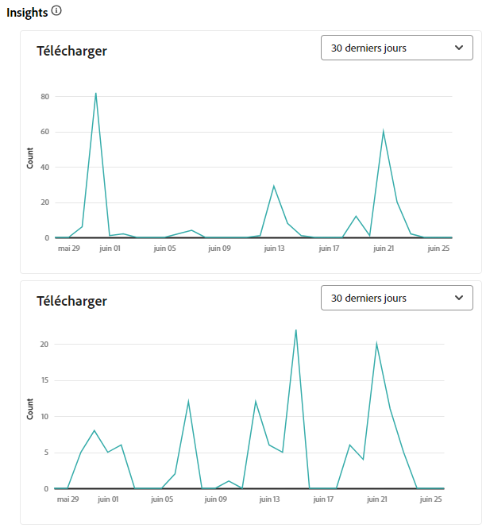
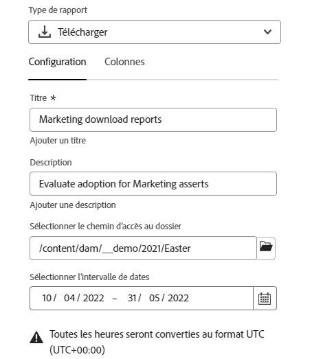
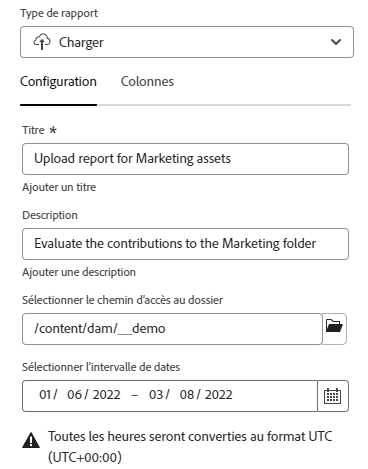
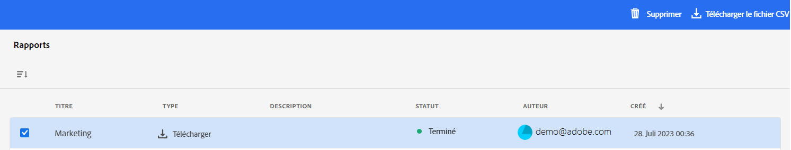

# Gérer les rapports {#manage-reports}

| [Bonnes pratiques de recherche](/help/assets/search-best-practices.md) | [ Bonnes pratiques en matière de métadonnées](/help/assets/metadata-best-practices.md) | [Hub de contenus](/help/assets/product-overview.md) | [Dynamic Media avec fonctionnalités OpenAPI](/help/assets/dynamic-media-open-apis-overview.md) | [Documentation destinée aux développeurs AEM Assets](https://developer.adobe.com/experience-cloud/experience-manager-apis/) |
| ------------- | --------------------------- |---------|----|-----|

Les rapports de ressources offrent aux administrateurs une visibilité sur l’activité de l’environnement Vue Adobe Experience Manager Assets. Ces données fournissent des informations utiles sur la façon dont les utilisateurs interagissent avec le contenu et le produit. Tous les utilisateurs et utilisatrices peuvent accéder au tableau de bord Insights et ceux qui sont affectés au profil de produit Administrateurs et administratrices peuvent créer des rapports définis par l’utilisateur ou l’utilisatrice.

## Accéder aux rapports {#access-reports}

Tous les utilisateurs et toutes les utilisatrices affectés au profil de produit Administration de la vue Assets peuvent accéder au tableau de bord des Insights ou créer des rapports définis par l’utilisateur dans la vue Assets.

Pour accéder aux rapports, accédez à **[!UICONTROL Rapports]** sous **[!UICONTROL Paramètres]**.

<!--
In the **[!UICONTROL Reports]** screen, various components are shown in the tabular format which includes the following:

* **Title**: Title of the report
* **Type**: Determines whether the report is uploaded or downloaded to the repository
* **Description**: Provide details of the report that was given during uploading/downloading the report
* **Status**: Determines whether the report is completed, under progress, or deleted.
* **Author**: Provides email of the author who has uploaded/downloaded the report.
* **Created**: Gives information of the date when the report was generated.
-->

## Afficher les insights {#view-live-statistics}

La vue Assets vous permet d’afficher des données en temps réel pour votre environnement Assets à l’aide du tableau de bord Insights. Vous pouvez afficher les mesures d’événement en temps réel au cours des 30 derniers jours ou au cours des 12 derniers mois.

<!---->

Cliquez sur les **[!UICONTROL Insights]** disponibles dans le volet de navigation de gauche pour afficher les graphiques générés automatiquement suivants :

* **Téléchargements** : nombre de ressources téléchargées à partir de l’environnement d’affichage Assets au cours des 30 ou 12 derniers jours représentés à l’aide d’un graphique linéaire.
  

* **Téléchargements** : nombre de ressources chargées dans l’environnement d’affichage Assets au cours des 30 ou 12 derniers jours représentés à l’aide d’un graphique linéaire.
  
  <!--* **Asset Count by Size**: The division of count of assets based on their range of various sizes from 0 MB to 100 GB.-->

* **Utilisation du stockage** : utilisation du stockage, en octets, pour l’environnement de vue Assets représenté à l’aide d’un graphique à barres.
  
  <!--* **Delivery**: The graph depicts the count of assets as the delivery dates.-->

<!--* **Asset Count by Asset Type**: Represents count of various MIME types of the available assets. For example, application/zip, image/png, video/mp4, application/postscripte.-->

* **Principales recherches** : affichez les termes recherchés les plus fréquemment, ainsi que le nombre de fois où ces termes ont été recherchés dans l’environnement de la vue Assets au cours des 30 derniers jours ou 12 derniers mois, représentés sous forme de tableau.
  
  <!--
   
   
   -->

## Créer un rapport de téléchargement {#create-download-report}

Pour créer un rapport de téléchargement, procédez comme suit :

1. Accédez à **[!UICONTROL Paramètres]** > **[!UICONTROL Rapports]** et cliquez sur **[!UICONTROL Créer un rapport]**.

1. Sous l’onglet [!UICONTROL Configuration], définissez le type de rapport comme **[!UICONTROL Téléchargement]**.

1. Entrez un titre et une description facultative pour le rapport.

1. Sélectionnez le chemin d’accès au dossier, qui contient les ressources sur lesquelles portera le rapport, à l’aide du champ **[!UICONTROL Sélectionner le chemin d’accès au dossier]**.

1. Sélectionnez la période du rapport.

   >[!NOTE]
   >
   > La vue Assets convertit tous les fuseaux horaires locaux en temps universel coordonné (UTC).

1. Sous l’onglet [!UICONTROL Colonnes], sélectionnez les noms des colonnes à afficher dans le rapport.

1. Cliquez sur **[!UICONTROL Créer]**.

   

Le tableau suivant décrit l’utilisation de toutes les colonnes que vous pouvez ajouter au rapport :

<table>
    <tbody>
     <tr>
      <th><strong>Nom de la colonne</strong></th>
      <th><strong>Description</strong></th>
     </tr>
     <tr>
      <td>Titre</td>
      <td>Titre de la ressource.</td>
     </tr>
     <tr>
      <td>Chemin </td>
      <td>Chemin d’accès au dossier qui contient la ressource dans la vue Assets.</td>
     </tr>
     <tr>
      <td>Type MIME</td>
      <td>Type MIME de la ressource.</td>
     </tr>
     <tr>
      <td>Taille</td>
      <td>Taille de la ressource en octets.</td>
     </tr>
     <tr>
      <td>Téléchargé par</td>
      <td>ID d’e-mail de l’utilisateur qui a téléchargé la ressource.</td>
     </tr>
     <tr>
      <td>Date de téléchargement</td>
      <td>Date à laquelle la ressource a été téléchargée.</td>
     </tr>
     <tr>
      <td>Créateur ou créatrice</td>
      <td>Le créateur ou la créatrice de la ressource.</td>
     </tr>
     <tr>
      <td>Date de création</td>
      <td>Date à laquelle la ressource a été chargée dans la vue Assets.</td>
     </tr>
     <tr>
      <td>Date de modification</td>
      <td>Date de dernière modification de la ressource.</td>
     </tr>
     <tr>
      <td>Expiré</td>
      <td>Statut d’expiration de la ressource.</td>
     </tr>
     <tr>
      <td>Téléchargé par « Nom d’utilisateur »</td>
      <td>Nom de l’utilisateur qui a téléchargé la ressource.</td>
     </tr>           
    </tbody>
   </table>

## Créer un rapport de chargement {#create-upload-report}

Pour créer un rapport de chargement, procédez comme suit :

1. Accédez à **[!UICONTROL Paramètres]** > **[!UICONTROL Rapports]** et cliquez sur **[!UICONTROL Créer un rapport]**.

1. Sous l’onglet [!UICONTROL Configuration], définissez le type de rapport comme **[!UICONTROL Chargement]**.

1. Entrez un titre et une description facultative pour le rapport.

1. Sélectionnez le chemin d’accès au dossier, qui contient les ressources sur lesquelles portera le rapport, à l’aide du champ **[!UICONTROL Sélectionner le chemin d’accès au dossier]**.

1. Sélectionnez la période du rapport.

1. Sous l’onglet [!UICONTROL Colonnes], sélectionnez les noms des colonnes à afficher dans le rapport.

1. Cliquez sur **[!UICONTROL Créer]**.

   

Le tableau suivant décrit l’utilisation de toutes les colonnes que vous pouvez ajouter au rapport :

<table>
    <tbody>
     <tr>
      <th><strong>Nom de la colonne</strong></th>
      <th><strong>Description</strong></th>
     </tr>
     <tr>
      <td>Titre</td>
      <td>Titre de la ressource.</td>
     </tr>
     <tr>
      <td>Chemin </td>
      <td>Chemin d’accès au dossier qui contient la ressource dans la vue Assets.</td>
     </tr>
     <tr>
      <td>Type MIME</td>
      <td>Type MIME de la ressource.</td>
     </tr>
     <tr>
      <td>Taille</td>
      <td>Taille de la ressource.</td>
     </tr>
     <tr>
      <td>Créateur ou créatrice</td>
      <td>Le créateur ou la créatrice de la ressource.</td>
     </tr>
     <tr>
      <td>Date de création</td>
      <td>Date à laquelle la ressource a été chargée dans la vue Assets.</td>
     </tr>
     <tr>
      <td>Date de modification</td>
      <td>Date de dernière modification de la ressource.</td>
     </tr>
     <tr>
      <td>Expiré</td>
      <td>Statut d’expiration de la ressource.</td>
     </tr>              
    </tbody>
   </table>

## Affichage des rapports existants {#view-report-list}

Une fois l’étape de [création du rapport](#create-download-report) effectuée, vous pouvez consulter la liste des rapports existants et choisir de les télécharger au format CSV ou de les supprimer.

Pour afficher la liste des rapports, accédez à **[!UICONTROL Paramètres]** > **[!UICONTROL Rapports]**.

Pour chaque rapport, vous pouvez afficher les éléments suivants : le titre, le type, la description spécifiée lors de la création, le statut, l’ID d’e-mail du créateur ou de la créatrice et la date de création.

Le statut `Completed ` du rapport indique que celui-ci est prêt à être téléchargé.

## Télécharger un rapport au format CSV {#download-csv-report}

Pour télécharger un rapport au format CSV, procédez comme suit :

1. Accédez à **[!UICONTROL Paramètres]** > **[!UICONTROL Rapports]**.

1. Sélectionnez un rapport, puis cliquez sur **[!UICONTROL Télécharger CSV]**.

Le rapport sélectionné sera téléchargé au format CSV. Les colonnes affichées dans le rapport CSV dépendent des colonnes que vous sélectionnez lors de la [création du rapport](#create-download-report).

## Supprimer un rapport {#delete-report}

Pour supprimer un rapport :

1. Accédez à **[!UICONTROL Paramètres]** > **[!UICONTROL Rapports]**.

1. Sélectionnez un rapport, puis cliquez sur **[!UICONTROL Supprimer]**.

1. Cliquez à nouveau sur **[!UICONTROL Supprimer]** pour confirmer.
