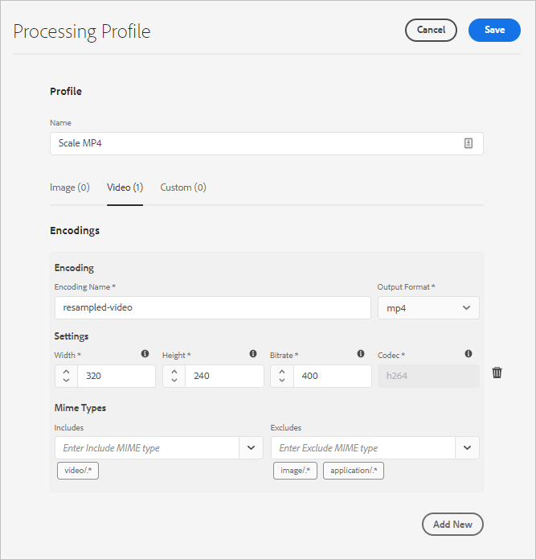

# Gestion des ressources vidéo  {#manage-video-assets}

Le format vidéo est un élément essentiel des ressources numériques d’une entreprise. [!DNL Adobe Experience Manager] propose des solutions et des fonctionnalités matures pour gérer l’ensemble du cycle de vie de vos ressources vidéo après leur création.

Découvrez comment gérer et modifier les ressources vidéo dans [!DNL Adobe Experience Manager Assets]. Le codage et le transcodage des vidéos, par exemple le transcodage FFmpeg, sont possibles à l’aide des profils de traitement et de l’intégration [!DNL Dynamic Media]. Sans licence [!DNL Dynamic Media], [!DNL Experience Manager] offre une prise en charge de base pour les vidéos (par exemple, le transcodage FFmpeg, l’extraction de miniatures d’aperçu pour les formats de fichiers pris en charge et l’aperçu dans l’interface utilisateur pour les formats directement pris en charge pour la lecture dans le navigateur).

## Chargement et prévisualisation des ressources vidéo {#upload-and-preview-video-assets}

[!DNL Adobe Experience Manager Assets] génère des aperçus pour les contenus vidéo dotés de l’extension MP4. Vous pouvez prévisualiser les rendus dans l’interface utilisateur [!DNL Assets].

1. Dans le dossier Ressources numériques ou ses sous-dossiers, accédez à l’emplacement où vous souhaitez ajouter les ressources numériques.
1. Pour charger le contenu, cliquez sur **[!UICONTROL Créer]** dans la barre d’outils, puis sélectionnez **[!UICONTROL Fichiers]**. Vous pouvez également faire glisser un fichier vers l’interface utilisateur. Voir [Ressources chargées](manage-digital-assets.md#uploading-assets) pour plus d’informations.
1. Pour prévisualiser une vidéo en mode carte, cliquez sur l’option **[!UICONTROL Lecture]**  du contenu vidéo. Vous pouvez suspendre ou lire une vidéo en mode Carte uniquement. Les options [!UICONTROL Lecture] et [!UICONTROL Pause] ne sont pas disponibles dans la vue de liste.
1. Pour prévisualiser la vidéo dans la page des détails de la ressource, sélectionnez **[!UICONTROL Modifier]** sur la carte. La vidéo se joue dans le lecteur vidéo natif du navigateur. Vous pouvez lire, suspendre, afficher la vidéo en plein écran et en contrôler le volume.

## Publication de ressources vidéo {#publish-video-assets}

Après la publication, vous pouvez inclure les ressources vidéo dans une page web sous la forme d’une URL ou les intégrer directement. Pour plus d’informations, voir [Publication de ressources Dynamic Media](/help/assets/dynamic-media/publishing-dynamicmedia-assets.md).

## Transcodage à l’aide du profil de traitement {#transcode-video}

[!DNL Experience Manager] as a Cloud Service permet de réaliser un transcodage de base des fichiers vidéo MP4 à l’aide de profils de traitement. Cette fonctionnalité vous permet non seulement de charger, mais aussi de prévisualiser et de mettre à l’échelle un fichier vidéo MP4.

*Figure : Profil de traitement pour le transcodage vidéo dans [!DNL Experience Manager].*

Si vous indiquez uniquement la largeur ou uniquement la hauteur et laissez l’autre champ vide, les rendus conservent les proportions. Actuellement, seul le codec h264 est disponible pour le transcodage.

Pour traiter des ressources à l’aide d’un profil de traitement, ajoutez un profil à un dossier. Voir [Utilisation de profils de traitement pour traiter des ressources](/help/assets/asset-microservices-configure-and-use.md#use-profiles).

## Annotation de ressources vidéo {#annotate-video-assets}

1. Dans la console [!DNL Assets], sélectionnez **[!UICONTROL Modifier]** sur la carte de ressources pour afficher la page de détails de la ressource.
1. Pour lire la vidéo, cliquez sur **[!UICONTROL Aperçu]**.
1. Pour annoter la vidéo, cliquez sur **[!UICONTROL Annoter]**. Une annotation est ajoutée à ce moment de la vidéo. Lorsque vous annotez, vous pouvez dessiner sur le canevas et inclure un commentaire avec le dessin. Les commentaires sont automatiquement enregistrés. Pour quitter l’assistant d’annotation, cliquez sur **[!UICONTROL Fermer]**.
1. Pour passer à un point spécifique de la vidéo, indiquez le moment en secondes dans le champ **texte** et cliquez sur **Aller**. Par exemple, pour sauter les 20 premières secondes de la vidéo, saisissez 20 dans le champ texte.
1. Pour l’afficher dans la chronologie, cliquez sur une annotation. Pour supprimer l’annotation de la chronologie, cliquez sur **[!UICONTROL Supprimer]**.

## Bonnes pratiques et restrictions {#tips-limitations}

* Sans licence Dynamic Media, vous pouvez seulement traiter les fichiers MP4 à l’aide de profils de traitement.
* Pour le transcodage de base avec

>[!MORELIKETHIS]
>
>* [Documentation vidéo de Dynamic Media](/help/assets/dynamic-media/video.md).
>* [En savoir plus sur l’utilisation, les types et la configuration des profils de traitement](/help/assets/asset-microservices-configure-and-use.md).

