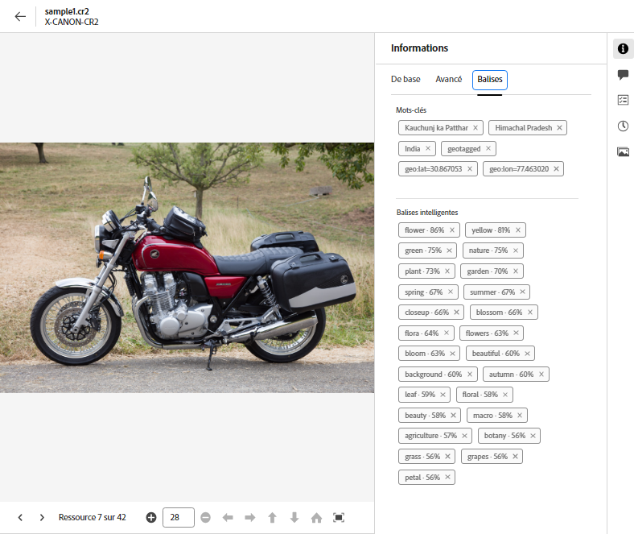
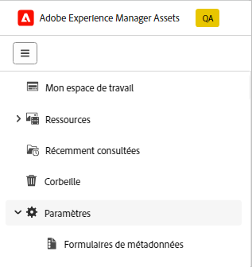
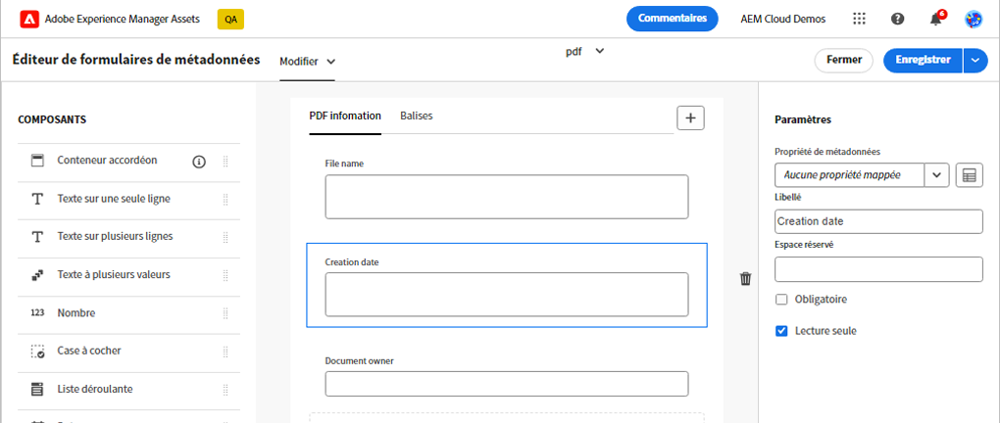
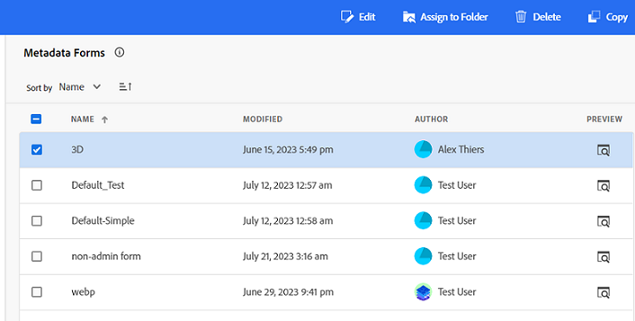

# Métadonnées dans la vue Assets {#metadata}

| [Bonnes pratiques de recherche](/help/assets/search-best-practices.md) | [ Bonnes pratiques en matière de métadonnées](/help/assets/metadata-best-practices.md) | [Hub de contenus](/help/assets/product-overview.md) | [Dynamic Media avec fonctionnalités OpenAPI](/help/assets/dynamic-media-open-apis-overview.md) | [Documentation destinée aux développeurs AEM Assets](https://developer.adobe.com/experience-cloud/experience-manager-apis/) |
| ------------- | --------------------------- |---------|----|-----|

Les métadonnées sont constituées de données ou de descriptions de données. Par exemple, vos images en tant que ressource peuvent contenir des informations sur l’appareil photo qui a pris la photo ou des informations relatives aux droits d’auteur. Ces informations représentent les métadonnées de l’image. Les métadonnées sont essentielles pour gérer efficacement des ressources. Elles constituent un ensemble de toutes les données disponibles pour cette ressource mais sans être nécessairement contenues dans cette ressource.

Les métadonnées permettent de classer les fichiers de manière détaillée à mesure que le volume d’informations numériques augmente. Il est ainsi possible de gérer quelques centaines de fichiers en ne prenant en compte que leurs noms, leurs miniature et leur taille. Pour autant, cette approche n’est pas évolutive. Elle est insuffisante si le nombre de personnes concernées et la quantité de ressources gérées augmentent.

Avec l’ajout de métadonnées, la valeur d’une ressource numérique augmente, car la ressource devient :

* plus accessible : les systèmes et les utilisateurs peuvent la trouver facilement ;
* plus facile à gérer : vous pouvez rechercher plus facilement des ressources avec un même ensemble de propriétés et leur apporter des modifications ;
* complète : la ressource contient davantage d’informations et de contexte grâce à un plus grand nombre de métadonnées.

Pour ces raisons, Assets vous offre des moyens pertinents pour créer, gérer et échanger des métadonnées pour vos ressources numériques.

## Affichage des métadonnées {#view-metadata}

Pour afficher les métadonnées d’une ressource, accédez à la ressource ou recherchez-la, sélectionnez-la, puis cliquez sur **[!UICONTROL Détails]** dans la barre d’outils.

*Image : pour afficher une ressource et ses métadonnées, cliquez sur **[!UICONTROL Détails]** dans la barre d’outils ou double-cliquez sur la ressource.*

Les métadonnées de base telles que le titre, la description et la date de chargement sont disponibles dans l’onglet [!UICONTROL De base]. L’onglet [!UICONTROL Avancé] contient des métadonnées plus précises telles que le modèle de l’appareil photo, les informations sur l’objectif et des informations de géolocalisation. L’onglet [!UICONTROL Balises] contient des balises appliquées automatiquement en fonction du contenu de l’image.

## Mettre à jour les métadonnées {#update-metadata}

Une fois que la personne administratrice configure le formulaire de métadonnées, d’autres champs peuvent être mis à jour manuellement. Vous pouvez modifier ce paramètre, car il se lit uniquement en fonction du formulaire de métadonnées prêt à l’emploi.

## Balises intelligentes {#smart-tags}

[!DNL Experience Manager Assets] utilise l’intelligence artificielle d’[Adobe Sensei](https://www.adobe.com/fr/sensei.html) pour appliquer automatiquement les balises pertinentes à toutes les ressources que vous avez chargées. Ces balises, les bien-nommées Balises intelligentes, augmentent la vitesse du contenu de vos projets en vous aidant à trouver rapidement les ressources appropriées. Les balises intelligentes sont un exemple de métadonnées qui ne sont pas contenues dans l’image.

Les balises intelligentes sont appliquées en temps quasi réel et sont générées en fonction du contenu de l’image. Lorsque vous chargez une ressource, l’interface utilisateur affiche [!UICONTROL Traitement] sur la miniature de la ressource pendant un certain temps. Une fois le traitement terminé, vous pouvez [afficher les métadonnées](#view-metadata) et les balises intelligentes.

*Image : pour afficher les balises intelligentes d’une ressource, cliquez sur **[!UICONTROL Détails]** dans la barre d’outils ou double-cliquez sur la ressource.*

Les balises intelligentes contiennent également un score de confiance en pourcentage. Elle indique le degré de confiance associé à la balise appliquée. Vous pouvez modérer les balises intelligentes qui ont été appliquées automatiquement.

## Ajouter ou mettre à jour des mots-clés {#manually-tag}

Vous pouvez ajouter d’autres balises à vos ressources en plus des balises intelligentes qui sont ajoutées automatiquement à l’aide du service intelligent [!DNL Adobe Sensei]. Ouvrez l’aperçu d’une ressource, cliquez sur [!UICONTROL Balises], puis saisissez les mots-clés souhaités dans le champ [!UICONTROL Mots-clés]. Pour ajouter la balise, appuyez sur Entrée. [!DNL Assets view] indexe le mot-clé en temps quasi réel et votre équipe peut bientôt rechercher les ressources mises à jour à l’aide des nouveaux mots-clés.

Vous pouvez également supprimer de la section [!UICONTROL Balises intelligentes] des balises qui ont été automatiquement ajoutées par [!DNL Assets view] à toutes les ressources chargées.

## Gestion de la taxonomie {#taxonomy-management}

Les balises peuvent également être imbriquées dans une hiérarchie pour prendre en charge des relations telles que la catégorie et la sous-catégorie. Si vous devez insérer des balises hiérarchiques, elles sont facilement gérées par l’administration dans la section [!UICONTROL Gestion de la taxonomie] des [!UICONTROL Paramètres]. Vous pouvez créer un ensemble régi d’espaces de noms et de balises auquel tous les utilisateurs et utilisatrices peuvent accéder pour décrire le contenu. Seules les personnes administratrices peuvent configurer des hiérarchies de balises dans le [!UICONTROL Gestionnaire de taxonomie] et s’assurer que les valeurs sont contrôlées et utilisées de manière cohérente.

## Configurer les formulaires de métadonnées {#metadata-forms}

>[!CONTEXTUALHELP]
>id="assets_metadata_forms"
>title="Formulaires de métadonnées"
>abstract="[!DNL Experience Manager Assets] fournit par défaut de nombreux champs de métadonnées standard. Les entreprises ont d’autres besoins en métadonnées et demandent des champs de métadonnées supplémentaires afin d’ajouter des métadonnées spécifiques à leur entreprise. Les formulaires de métadonnées permettent aux entreprises d’ajouter des champs de métadonnées personnalisés à la page Détails d’une ressource. Les métadonnées spécifiques à l’entreprise améliorent la gouvernance et la découverte de ses ressources."

La vue Assets fournit par défaut de nombreux champs de métadonnées standard. Les entreprises ont d’autres besoins en métadonnées et ont besoin de davantage de champs de métadonnées pour ajouter des métadonnées spécifiques à leur entreprise. Les formulaires de métadonnées permettent aux entreprises d’ajouter des champs de métadonnées personnalisés à la page [!UICONTROL Détails] d’une ressource. Les métadonnées spécifiques à l’entreprise améliorent la gouvernance et la découverte de ses ressources. Vous pouvez créer des formulaires entièrement ou réutiliser un formulaire existant.

Vous pouvez configurer des formulaires de métadonnées pour différents types de ressources (différents types MIME). Utilisez le même nom de formulaire que le type MIME du fichier. La vue Assets fait automatiquement correspondre le type MIME des ressources chargées au nom du formulaire et met à jour les métadonnées des ressources téléchargées en fonction des champs du formulaire.
<!--
For example, if a metadata form by the name `PDF` or `pdf` exists, then the uploaded PDF documents contain metadata fields as defined in the form.
-->
La vue Assets utilise la séquence suivante pour rechercher des noms de formulaires de métadonnées existants afin d’appliquer les champs de métadonnées aux ressources chargées d’un type particulier :

Formulaire de sous-type MIME > Type MIME > `default` > Formulaire prêt à l’emploi

Par exemple, si un formulaire de métadonnées portant le nom `PDF` ou `pdf` existe, les documents PDF chargés contiennent des champs de métadonnées tels que définis dans le formulaire. Si un formulaire de métadonnées du nom de `PDF` ou `pdf` n’existe pas, la vue Assets vérifie s’il existe un formulaire de métadonnées du nom de `application`. S’il existe un formulaire de métadonnées du nom de `application`, les documents PDF chargés contiennent les champs de métadonnées définis dans le formulaire. Si la vue Assets ne trouve toujours pas de formulaire de métadonnées correspondant, il recherche le formulaire de métadonnées `default` pour appliquer les champs de métadonnées définis dans le formulaire aux documents PDF chargés. Si aucune de ces étapes ne fonctionne, la vue Assets applique les champs de métadonnées définis dans le formulaire d’usine à tous les documents de PDF chargés.
Cependant, si vous souhaitez attribuer un formulaire de métadonnées à un dossier [voir](#assign-metadata-form-folder).

>[!IMPORTANT]
>
>Le nouveau formulaire de métadonnées pour un type de fichier spécifique remplace complètement le formulaire de métadonnées par défaut fourni par [!DNL Assets view]. Si vous supprimez ou renommez un formulaire de métadonnées, les champs de métadonnées par défaut sont à nouveau disponibles pour les nouvelles ressources.

Pour créer un formulaire de métadonnées, procédez comme suit :

1. Dans le rail de gauche, cliquez sur **[!UICONTROL Paramètres]** > **[!UICONTROL Formulaires de métadonnées]**.

   

1. Cliquez sur **[!UICONTROL Créer]**, dans la zone supérieure droite de l’interface utilisateur.
1. Indiquez un nom pour le formulaire puis cliquez sur **[!UICONTROL Créer]**.
1. Attribuez un nom à l’onglet dans **[!UICONTROL Paramètres]** dans le rail de droite.
1. Dans la section **[!UICONTROL Composants]** disponible dans le rail de gauche, faites glisser les composants requis sur un onglet du formulaire. Faites glisser les composants dans la séquence souhaitée.

   

   *Figure : interface de création de formulaire de métadonnées comprenant des options permettant d’ajouter des composants et une option pour prévisualiser le formulaire.*

1. Pour chaque composant, indiquez un nom dans la section **[!UICONTROL Paramètres]** du rail de droite, ainsi qu’un mappage avec les propriétés prises en charge.
1. Si vous le souhaitez, pour un composant, vous pouvez sélectionner **[!UICONTROL Obligatoire]** pour rendre le champ de métadonnées obligatoire et sélectionner **[!UICONTROL Lecture seule]** pour rendre le champ non modifiable dans la page [!UICONTROL Détails] de la ressource.
1. Si vous le souhaitez, cliquez sur **[!UICONTROL Aperçu]** pour prévisualiser le formulaire que vous êtes en train de créer.
1. Vous pouvez ajouter d’autres onglets et les composants requis dans chaque onglet.
1. Cliquez sur **[!UICONTROL Enregistrer]** une fois le formulaire terminé.

Regardez cette vidéo pour voir la séquence d’étapes :

>[!VIDEO](https://video.tv.adobe.com/v/341275)

Une fois qu’un formulaire est créé, il est automatiquement appliqué lorsque les utilisateurs chargent une ressource du type MIME correspondant.

Pour réutiliser un formulaire existant afin d’en créer un nouveau, sélectionnez un formulaire de métadonnées, cliquez sur **[!UICONTROL Copier]** dans la barre d’outils, choisissez un nom, puis cliquez sur **[!UICONTROL Confirmer]**. Vous pouvez modifier un formulaire de métadonnées. Lorsque vous modifiez un formulaire, il est utilisé pour les ressources chargées après la modification. Les ressources existantes ne sont pas modifiées.

### Composants de propriété {#property-components}

Vous pouvez personnaliser votre formulaire de métadonnées à l’aide de l’un des composants de propriété suivants. Il vous suffit de faire glisser et de déposer le type de composant sur le formulaire à l’emplacement souhaité et de modifier les paramètres du composant.
Vous trouverez ci-dessous un aperçu de chaque type de propriété et de leur mode de stockage.

| Nom du composant | Description |
|---|---|
| Conteneur en accordéon | Permet d’ajouter un en-tête réductible pour une liste de composants et de propriétés communs. Il peut être développé ou réduit par défaut. |
| Texte monoligne | Permet d’ajouter une propriété de texte d’une seule ligne. |
| Texte de plusieurs lignes | Permet d’ajouter plusieurs lignes de texte ou un paragraphe. Il se développe à mesure que la personne saisit et englobe tout le contenu. |
| Texte à plusieurs valeurs | Permet d’ajouter une propriété de texte à plusieurs valeurs. |
| Nombre | Permet d’ajouter un composant de nombre. |
| Case à cocher | Permet d’ajouter une valeur booléenne. Stockée comme TRUE ou FALSE quand une valeur est enregistrée. |
| Date | Permet d’ajouter un composant de date. |
| Liste déroulante | Permet d’ajouter une liste déroulante. |
| État | Permet d’ajouter la propriété d’état du référentiel (mappée sur repo:state) |
| Statut de la ressource | Permet d’ajouter la propriété du statut de la ressource par défaut (mappée sur dam:assetStatus) |
| Balises | Permettent d’ajouter une balise à partir des valeurs stockées dans la Gestion de la taxonomie (mappée sur xcm:tags). |
| Mots-clés | Permettent d’ajouter des mots-clés de forme libre (mappés sur dc:subject). |
| Balises intelligentes | Ajoutez ce composant pour augmenter les capacités de recherche en ajoutant automatiquement des balises de métadonnées. |

### Attribuer un formulaire de métadonnées à un dossier {#assign-metadata-form-folder}

Vous pouvez également affecter un formulaire de métadonnées à un dossier dans votre déploiement de vue Assets. Le formulaire de métadonnées attribué à un dossier selon le type MIME est remplacé lorsque vous appliquez manuellement un formulaire de métadonnées à un dossier. Toutes les ressources du dossier, y compris les ressources des sous-dossiers, affichent ensuite les propriétés définies dans le formulaire de métadonnées.

Pour attribuer un formulaire de métadonnées à un dossier :

1. Accédez à **[!UICONTROL Paramètres]** > **[!UICONTROL Formulaires de métadonnées]** et sélectionnez un formulaire de métadonnées.

2. Cliquez sur **[!UICONTROL Attribuer au dossier]**.

3. Sélectionnez le dossier et cliquez sur **[!UICONTROL Attribuer]**. Vous pouvez sélectionner les dossiers en cliquant sur leur nom.

   

   Vous pouvez également accéder à la page des détails du dossier et sélectionner un formulaire de métadonnées dans les propriétés du dossier disponibles dans le volet de droite pour attribuer le formulaire de métadonnées au dossier.

   

### Supprimer un formulaire de métadonnées des dossiers {#remove-metadata-form-folder}

Après avoir affecté un formulaire de métadonnées à un ou plusieurs dossiers, Experience Manager Assets vous permet également de le supprimer des dossiers sélectionnés.

Pour supprimer un formulaire de métadonnées d’un dossier :

1. Accédez à **[!UICONTROL Paramètres]** > **[!UICONTROL Formulaires de métadonnées]** et sélectionnez un formulaire de métadonnées.

1. Cliquez sur **[!UICONTROL Supprimer du ou des dossiers]**. La liste des dossiers attribués au formulaire de métadonnées s’affiche.

1. Sélectionnez le dossier et cliquez sur **[!UICONTROL Supprimer]**. Vous pouvez également sélectionner plusieurs dossiers dans la liste.

Vous pouvez également accéder à la page des détails du dossier et sélectionner **[!UICONTROL Formulaire de métadonnées mappées sur le système]** dans le champ **[!UICONTROL Formulaires de métadonnées]** pour supprimer le formulaire de métadonnées affecté d’un dossier.

## Étapes suivantes {#next-steps}

* [Regardez une vidéo pour gérer les formulaires de métadonnées dans la vue Assets](https://experienceleague.adobe.com/docs/experience-manager-learn/assets-essentials/configuring/metadata-forms.html?lang=fr)

* Faites des commentaires sur le produit en utilisant l’option [!UICONTROL Commentaires] disponible dans l’interface utilisateur de la vue Assets

* Faites des commentaires sur la documentation en utilisant l’option [!UICONTROL Modifier cette page]  ou [!UICONTROL Enregistrer un problème]  disponible dans la barre latérale droite.

* Contactez l’[assistance clientèle](https://experienceleague.adobe.com/?support-solution=General&amp;lang=fr#support).

<!-- TBD: Cannot create a form using the second option. Documenting only the first option for now.
To reuse an existing form to create a form, do one of these:

* Select a metadata form and click **[!UICONTROL Copy]** from the toolbar, provide a name, and click **[!UICONTROL Confirm]**.

* Click **[!UICONTROL Create]**, select **[!UICONTROL Use existing form structure as template]** option, and select an existing form. 
-->

<!-- TBD: Queries for PM and engg.

Can we edit the existing metadata in any form?

How to moderate smart tags?

Allow or deny list for smart tags?

What about Tags displayed just above Smart Tags in the UI?

Is there a detailed metadata tab. Where do the other details of an asset go?

How can one search based strictly on the metadata. Similar to AEM Assets GQL queries.
-->

<!-- TBD: Link to related articles if any.

>[!MORELIKETHIS]
>
>* [Search assets](search.md).
-->
