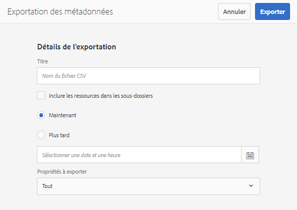
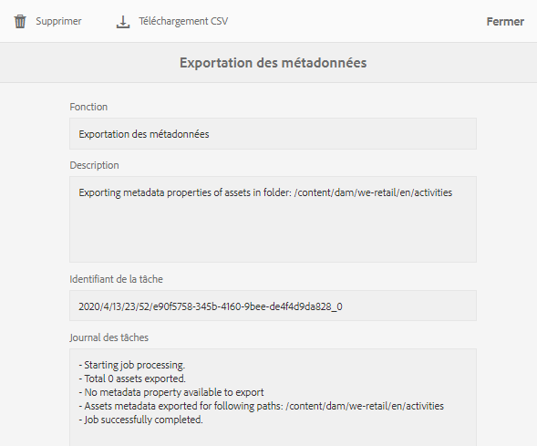

# Importation et exportation des métadonnées de fichier par lot   {#import-and-export-asset-metadata-in-bulk}

AEM Assets permet d’importer des métadonnées de ressources par lot à l’aide d’un fichier CSV. Vous pouvez effectuer des mises à jour par lot pour les ressources récemment transférées ou les ressources existantes en important un fichier CSV. Vous pouvez également assimiler des métadonnées de ressources par lot à partir d’un système tiers au format CSV.

## Importation de métadonnées   {#import-metadata}

L’importation de métadonnées est asynchrone et ne nuit pas aux performances du système. La mise à jour simultanée des métadonnées pour plusieurs ressources peut être gourmande en ressources en raison de l’activité d’écriture différée XMP si l’indicateur de workflow est coché. Planifiez une importation de ce type quand le serveur est peu utilisé afin que les performances d’autres utilisateurs ne soient pas affectées.

>[!NOTE]
>
>Pour importer des métadonnées sur des espaces de noms personnalisés, commencez par enregistrer les espaces de noms.

1. Accédez à l’IU Assets et appuyez/cliquez sur **[!UICONTROL Créer]** dans la barre d’outils.
1. Dans le menu, sélectionnez **[!UICONTROL Métadonnées]**.
1. Dans la page **[!UICONTROL Importation des métadonnées]**, appuyez/cliquez sur **[!UICONTROL Sélectionner un fichier]**. Sélectionnez le fichier CSV contenant les métadonnées.
1. Spécifiez les paramètres suivants :

   | Paramètre | Description |
   | ---------------------- | ------------------------------------------------------------------------------------------------------------------------------------------------------------------------------------------------------------------------ |
   | Taille du lot | Nombre de ressources dans un lot pour lesquelles les métadonnées doivent être importées. La valeur par défaut est 50. La valeur maximale est 100. |
   | Séparateur de champs | La valeur par défaut est `,` (une virgule). Vous pouvez spécifier n’importe quel autre caractère. |
   | Délimiteur à plusieurs valeurs | Séparateur des valeurs de métadonnées. La valeur par défaut est `|`. |
   | Lancer les workflows | Faux par défaut. Lorsque la valeur est définie sur `true` et que les paramètres par défaut du lanceur sont utilisés pour le workflow Écriture différée des métadonnées de gestion des ressources numériques (qui écrit des métadonnées dans les données XMP binaires). L’activation des workflows de lancement ralentit le système. |
   | Nom de colonne du chemin d’accès à la ressource | Définit le nom de la colonne du fichier CSV avec des ressources. |

1. Appuyez/cliquez sur **[!UICONTROL Importer]** dans la barre d’outils. Une fois les métadonnées importées, une notification est envoyée à votre boîte de réception de notifications. Accédez à la page de propriété des ressources et vérifiez que les valeurs des métadonnées sont correctement importées pour les ressources.

## Exportation des métadonnées {#export-metadata}

Vous pouvez exporter des métadonnées pour plusieurs fichiers au format CSV. Les métadonnées sont exportées de manière asynchrone et n’ont aucun impact sur les performances du système. Pour exporter des métadonnées, AEM parcourt les propriétés du nœud de ressource `jcr:content/metadata` et de ses nœuds enfants et exporte les propriétés de métadonnées dans un fichier CSV.

Voici quelques cas d’utilisation pour l’exportation de métadonnées par lot :

* Importation des métadonnées dans un système tiers lors de la migration des fichiers.
* Partage des métadonnées de ressources avec une équipe de projet plus large.
* Test ou contrôle des métadonnées pour la conformité.
* Externalisation des métadonnées pour une localisation distincte.

1. Sélectionnez le dossier de ressources pour lequel vous souhaitez exporter des métadonnées. Dans la barre d’outils, sélectionnez **[!UICONTROL Exporter les métadonnées]**.
1. Dans la boîte de dialogue Exportation des métadonnées, indiquez un nom pour le fichier CSV. Pour exporter des métadonnées des ressources dans les sous-dossiers, sélectionnez **[!UICONTROL Inclure les ressources dans les sous-dossiers]**.

   

1. Sélectionnez les options souhaitées. Indiquez un nom de fichier et, si nécessaire, une date.

1. Dans le champ **[!UICONTROL Propriétés à exporter]**, indiquez si vous voulez exporter toutes les propriétés ou certaines propriétés. Si vous choisissez Propriétés sélectives à exporter, ajoutez les propriétés souhaitées.

1. Dans la barre d’outils, appuyez/cliquez sur **[!UICONTROL Exporter]**. Un message confirme que les métadonnées ont été exportées. Fermez le message.
1. Ouvrez la notification de boîte de réception pour la tâche d’exportation. Sélectionnez la tâche et cliquez sur **[!UICONTROL Ouvrir]** dans la barre d’outils. Pour télécharger le fichier CSV contenant les métadonnées, appuyez/cliquez sur **[!UICONTROL Téléchargement CSV]** dans la barre d’outils. Cliquez sur **[!UICONTROL Fermer]**.

   
   *Image : boîte de dialogue de téléchargement du fichier CSV contenant les métadonnées exportées en bloc*
