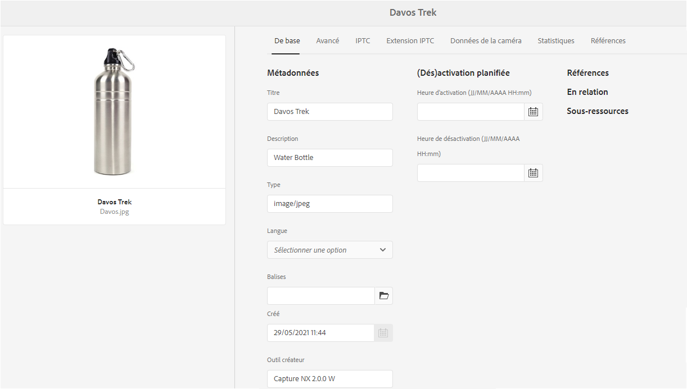
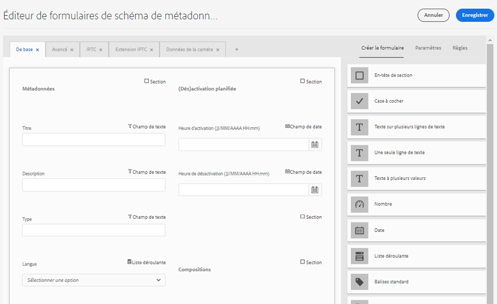

# Schémas de métadonnées {#metadata-schemas}

| [Bonnes pratiques de recherche](/help/assets/search-best-practices.md) | [ Bonnes pratiques en matière de métadonnées](/help/assets/metadata-best-practices.md) | [Hub de contenus](/help/assets/product-overview.md) | [Dynamic Media avec fonctionnalités OpenAPI](/help/assets/dynamic-media-open-apis-overview.md) | [Documentation destinée aux développeurs AEM Assets](https://developer.adobe.com/experience-cloud/experience-manager-apis/) |
| ------------- | --------------------------- |---------|----|-----|

| Version | Lien de l’article |
| -------- | ---------------------------- |
| AEM 6.5 | [Cliquez ici](https://experienceleague.adobe.com/docs/experience-manager-65/assets/administer/metadata-schemas.html?lang=fr) |
| AEM as a Cloud Service | Cet article |

Les entreprises disposent d’un modèle de métadonnées qui améliore la découverte, l’utilisation, l’interopérabilité des ressources, etc. L’application correcte des métadonnées est sacro-sainte pour gérer les workflows et les processus pilotés par les métadonnées. Pour respecter la stratégie et les normes de métadonnées à l’échelle de l’entreprise, vous pouvez utiliser des schémas de métadonnées qui aident les utilisateurs de la gestion des actifs numériques à s’aligner sur celles-ci. [!DNL Adobe Experience Manager] Met à disposition des méthodes simples et flexibles pour créer, gérer et appliquer des schémas de métadonnées.

Dans [!DNL Adobe Experience Manager Assets], les schémas contiennent des champs spécifiques pour renseigner des informations spécifiques. Il contient également des informations de mise en page pour afficher les champs de métadonnées de manière conviviale. Les propriétés de métadonnées incluent le titre, la description, les types MIME, les balises, etc. Vous pouvez utiliser l’éditeur de [!UICONTROL formulaires de schéma de métadonnées] pour modifier des schémas existants ou ajouter des schémas de métadonnées personnalisés.

Pour afficher et modifier la page des propriétés d’une ressource, procédez comme suit :

1. Cliquez sur l’option **[!UICONTROL Afficher les propriétés]** dans les actions rapides sur la mosaïque de la ressource en mode Carte. Vous pouvez également sélectionner une ressource, puis cliquer sur **[!UICONTROL Propriétés]**  dans la barre d’outils.

1. Vous pouvez modifier les différentes propriétés de métadonnées modifiables dans les onglets disponibles. Toutefois, vous ne pouvez pas modifier le [!UICONTROL type] de ressource dans l’onglet [!UICONTROL De base] de la page des propriétés.

   

   *Image : onglet De base des [!UICONTROL propriétés de la ressource].*

   Pour modifier le type MIME d’une ressource, utilisez un formulaire de schéma de métadonnées personnalisé ou modifiez un formulaire existant. Consultez [Modifier un formulaire de schéma de métadonnées](#edit-metadata-schema-forms) pour plus d’informations. Si vous modifiez le schéma de métadonnées d’un type MIME, la mise en page des propriétés des ressources et de tous les sous-types est modifiée. Par exemple, la modification d’un schéma jpeg sous `default/image` concerne uniquement la disposition des métadonnées (propriétés de ressource) des ressources du type MIME `image/jpeg`. Si vous modifiez le schéma par défaut, les modifications changent toutefois la disposition des métadonnées pour tous les types de ressources.

## Formulaires de schéma de métadonnées {#default-metadata-schema-forms}

Pour afficher la liste des formulaires ou des modèles, dans l’interface [!DNL Experience Manager], accédez à **[!UICONTROL Outils]** > **[!UICONTROL Ressources]** > **[!UICONTROL Schémas de métadonnées]**.

[!DNL Experience Manager] fournit les modèles de formulaire de schéma de métadonnées suivants.

| Modèles | | Description |
|---|---|---|
| [!UICONTROL default] | | Le formulaire de schéma de métadonnées de base pour les ressources |
| | Les formulaires enfants suivants héritent des propriétés du formulaire par [!UICONTROL défaut] : | |
| | <ul><li>[!UICONTROL dm_video]</li></ul> | Formulaire de schéma pour les vidéos Dynamic Media. |
| | <ul><li>[!UICONTROL image]</li></ul> | Formulaire de schéma pour les images dotées d’un type MIME telles que `image/jpeg` et `image/png`  Le formulaire [!UICONTROL image] possède les modèles de formulaire enfant suivants : <ul><li> [!UICONTROL jpeg] : formulaire de schéma pour les ressources avec le sous-type [!UICONTROL jpeg].</li> <li>[!UICONTROL tiff] : formulaire de schéma pour les ressources avec le sous-type TIFF.</li></ul> |
| | <ul><li>[!UICONTROL l’application ;]</li></ul> | Formulaire de schéma pour les ressources dotées du type MIME, par exemple `application/pdf` et `application/zip`  [!UICONTROL pdf] : formulaire de schéma pour les ressources avec le sous-type PDF. |
| | <ul><li>[!UICONTROL vidéo]</li></ul> | Formulaire de schéma pour les ressources vidéo dotées d’un type MIME telles que `video/avi` et `video/mp4` |
| [!UICONTROL collection] | | Formulaire de schéma pour les collections |
| [!UICONTROL contentfragment] | | Formulaire de schéma pour les fragments de contenu |
| [!UICONTROL forms] | | Ce formulaire de schéma réfère à [!DNL Adobe Experience Manager Forms]. |
| [!UICONTROL ugc_contentfragment] | | Formulaire de schéma pour les éléments de contenu et les ressources générés par l’utilisateur intégrés dans Experience Manager à partir des médias sociaux. |

>[!NOTE]
>
>Pour afficher les formulaires enfants d’un formulaire de schéma, cliquez sur le nom de ce dernier.

## Ajout d’un formulaire de schéma de métadonnées {#add-a-metadata-schema-form}

Pour ajouter un formulaire de schéma de métadonnées, procédez comme suit :

1. Pour ajouter un modèle personnalisé à la liste, cliquez sur **[!UICONTROL Créer]** dans la barre d’outils.

   >[!NOTE]
   >
   >Un cadenas s’affiche avec les modèles non modifiés. Si vous personnalisez un modèle, il n’est pas verrouillé .

1. Dans la boîte de dialogue, saisissez le titre du formulaire de schéma, puis cliquez sur **[!UICONTROL Créer]** pour terminer la création du formulaire.

## Modification des formulaires de schéma de métadonnées {#edit-metadata-schema-forms}

Vous pouvez modifier un formulaire de schéma de métadonnées existant ou nouvellement ajouté. Le formulaire de schéma de métadonnées comprend des onglets et des éléments de formulaire dans des onglets. Vous pouvez associer ou configurer ces éléments de formulaire dans un champ au sein d’un nœud de métadonnées dans le référentiel CRX. Vous pouvez ajouter des onglets ou des éléments de formulaire au formulaire de schéma de métadonnées. Les onglets et les éléments de formulaire dérivés du parent sont à l’état verrouillé. Vous ne pouvez pas les modifier au niveau des enfants.

1. Sur la page [!UICONTROL Formulaires de schéma de métadonnées], sélectionnez un formulaire et cliquez sur **[!UICONTROL Modifier]** dans la barre d’outils.

1. Sur la page **[!UICONTROL Éditeur de formulaire de schéma de métadonnées]**, personnalisez le formulaire de métadonnées. Faites glisser les composants nécessaires de l’onglet **[!UICONTROL Créer le formulaire]** vers l’un des onglets.

   

   *Image : page [!UICONTROL Éditeur de formulaire de schéma de métadonnées] avec les onglets disponibles.*

1. Pour configurer un composant, sélectionnez-le et modifiez ses propriétés dans l’onglet **[!UICONTROL Paramètres]**.

### Composants de l’onglet [!UICONTROL Créer le formulaire] {#components-within-the-build-form-tab}

L’onglet **[!UICONTROL Créer le formulaire]** répertorie les éléments de formulaire que vous utilisez dans votre formulaire de schéma. L’onglet **[!UICONTROL Paramètres]** contient les attributs de chaque élément sélectionné dans l’onglet **[!UICONTROL Créer le formulaire]**. Le tableau suivant répertorie les éléments de formulaire disponibles dans l’onglet **[!UICONTROL Créer le formulaire]** :

| Nom du composant | Description |
| -------------------------------- | ----------------------------------------------------------------------------------- |
| [!UICONTROL En-tête de section] | Permet d’ajouter un en-tête de section pour une liste de composants communs. |
| [!UICONTROL Une seule ligne de texte] | Permet d’ajouter une propriété d’une seule ligne de texte. Il est stocké sous la forme d’une chaîne. |
| [!UICONTROL Texte à plusieurs valeurs] | Permet d’ajouter une propriété de texte à plusieurs valeurs. Il est stocké sous forme de tableau de chaînes. |
| [!UICONTROL Nombre] | Permet d’ajouter un composant de nombre. |
| [!UICONTROL Date] | Permet d’ajouter un composant de date. |
| [!UICONTROL Liste déroulante] | Permet d’ajouter une liste déroulante. |
| [!UICONTROL Balises standard] | Permet d’ajouter une balise. |
| [!UICONTROL Balises intelligentes] | Ajoutez ce composant pour augmenter les capacités de recherche en ajoutant automatiquement des balises de métadonnées. |
| [!UICONTROL Champ masqué] | Permet d’ajouter un champ masqué. Il est envoyé en tant que paramètre POST lorsque la ressource est enregistrée. |
| [!UICONTROL Ressource référencée par] | Ajoutez ce composant pour afficher la liste des ressources référencées par la ressource. |
| [!UICONTROL Référencement des ressources] | Ajoutez ce composant pour afficher la liste des ressources qui référencent la ressource. |
| [!UICONTROL Références du produit] | Ajoutez ce composant pour afficher la liste des produits liés à la ressource. |
| [!UICONTROL Métadonnées contextuelles] | Ajoutez ce composant pour contrôler l’affichage des autres onglets de métadonnées dans la page de propriétés des ressources. |

<!-- TBD: Ratings are not available in Experience Manager as a Cloud Service. Removed via cqdoc-18089 ticket. 
| [!UICONTROL Asset Rating]        | Add to display options for rating the asset.                                       |
-->

#### Modification du composant de métadonnées {#edit-the-metadata-component}

Pour modifier les propriétés d’un composant de métadonnées dans le formulaire, cliquez sur le composant et modifiez l’ensemble ou un sous-ensemble des propriétés suivantes dans l’onglet **[!UICONTROL Paramètres.]** Il est recommandé de ne mapper qu’un champ à une propriété donnée dans le schéma de métadonnées. Sinon, le dernier champ ajouté mappé à la propriété est sélectionné par le système.

**Libellé du champ** : nom de la propriété de métadonnées qui s’affiche sur la page des propriétés de la ressource.

**Associer à la propriété** : cette propriété spécifie le chemin ou le nom relatif du nœud de la ressource où elle est enregistrée dans le référentiel CRX. Elle commence par `./` pour indiquer que le chemin d’accès se situe sous le nœud de la ressource.

Voici des exemples de valeurs valides pour une propriété :

* `./jcr:content/metadata/dc:title` : stocke la valeur dans le nœud de métadonnées de la ressource en tant que propriété `dc:title`.

* `./jcr:created` : stocke la date et l’heure de création d’une ressource. Il s’agit d’une propriété protégée. Si vous configurez ces propriétés, Adobe recommande de les marquer avec l’état Désactiver la modification. Dans le cas contraire, l’erreur « Échec de modification des ressources » est générée lorsque vous enregistrez les propriétés de la ressource.

Pour garantir que le composant s’affiche correctement dans le formulaire de schéma de métadonnées, le chemin de la propriété ne doit pas comporter d’espace.

* **Espace réservé** : utilisez cette propriété pour spécifier le texte d’espace réservé approprié concernant la propriété de métadonnées.
* **Obligatoire** : utilisez cette propriété pour marquer une propriété de métadonnées comme étant obligatoire sur la page Propriétés.
* **Désactiver la modification** : utilisez cette propriété pour interdire toute modification apportée à une propriété sur la page des propriétés.
* **Afficher le champ vide en lecture seule** : utilisez cette propriété pour afficher une propriété de métadonnées sur la page Propriétés même si elle ne possède pas de valeur. Par défaut, lorsqu’une propriété de métadonnées ne possède pas de valeur, elle n’est pas répertoriée sur la page Propriétés.
* **Afficher la liste classée** : utilisez cette propriété pour afficher une liste classée de choix.
* **Choix** : utilisez cette propriété pour spécifier des choix dans une liste.
* **Description** : utilisez cette propriété pour ajouter une brève description pour le composant de métadonnées.
* **Classe** : classe d’objet à laquelle la propriété est associée.
* **Supprimer** : cliquez sur [!UICONTROL Supprimer] pour supprimer un composant du formulaire de schéma.

>[!NOTE]
>
>Le composant [!UICONTROL Champ masqué] n’inclut pas ces attributs. Il inclut plutôt des propriétés, telles que le nom des attributs, la valeur, le libellé du champ et la description. Les valeurs du composant Champ masqué sont envoyées en tant que paramètre POST chaque fois que la ressource est enregistrée. Elle n’est pas enregistrée en tant que métadonnées pour la ressource.

Si vous sélectionnez l’option **[!UICONTROL Obligatoire]**, vous pouvez rechercher des fichiers dont les métadonnées obligatoires sont manquantes. Dans le panneau **[!UICONTROL Filtres]**, développez le prédicat **[!UICONTROL Validation des métadonnées]** et sélectionnez l’option **[!UICONTROL Non valide]**. Les résultats de la recherche affichent des fichiers dont les métadonnées obligatoires que vous avez configurées via le formulaire de schéma sont manquantes.

Si vous ajoutez le composant Métadonnées contextuelles à un onglet d’un formulaire de schéma, le composant apparaît sous forme de liste sur la page Propriétés des ressources auxquelles ce schéma s’applique. La liste inclut tous les autres onglets, à l’exception de celui auquel vous avez appliqué le composant Métadonnées contextuelles. Actuellement, cette fonctionnalité fournit des fonctions de base pour contrôler l’affichage des métadonnées en fonction du contexte.

Pour afficher un onglet sur la page Propriétés en plus de l’onglet auquel le composant Métadonnées contextuelles est appliqué, sélectionnez-le dans la liste. L’onglet est ajouté à la page Propriétés.

### Spécification des propriétés dans le fichier JSON {#specify-properties-in-json-file}

Au lieu de définir les propriétés des options sous l’onglet **[!UICONTROL Paramètres]**, vous pouvez définir les options d’un fichier JSON en spécifiant les paires clé-valeur correspondantes. Spécifiez le chemin d’accès au fichier JSON dans le champ **[!UICONTROL Chemin d’accès JSON]**.

#### Ajout ou suppression d’un onglet dans le formulaire de schéma {#add-delete-a-tab-in-the-schema-form}

L’éditeur de schéma vous permet d’ajouter ou de supprimer un onglet. Le formulaire de schéma par défaut inclut les onglets **[!UICONTROL De base]**, **[!UICONTROL Avancé]**, **[!UICONTROL IPTC]** et **[!UICONTROL Extension IPTC]**.

Cliquez sur `+` pour ajouter un onglet à un formulaire de schéma. Par défaut, le nouvel onglet porte le nom `Unnamed-1`. Vous pouvez modifier le nom à partir de l’onglet **[!UICONTROL Paramètres]**. Pour supprimer un onglet, cliquez sur `X`.

## Suppression de formulaires de schéma de métadonnées {#deleting-metadata-schema-forms}

Experience Manager vous permet uniquement de supprimer des formulaires de schéma personnalisés. Elle ne permet pas de supprimer les modèles/formulaires de schéma par défaut. Cependant, vous pouvez supprimer toutes les modifications personnalisées dans ces formulaires.

Pour supprimer un formulaire, sélectionnez-le puis cliquez sur l’icône Supprimer.

>[!NOTE]
>
>Après avoir supprimé les modifications personnalisées apportées à un formulaire par défaut, l’icône représentant un cadenas réapparaît devant celui-ci dans l’interface Schéma de métadonnées pour indiquer que l’état par défaut du formulaire a été rétabli.

>[!NOTE]
>
>* Après avoir supprimé les modifications personnalisées apportées à un formulaire par défaut, le verrouillage  réapparaît devant le formulaire. Il indique que l’état par défaut du formulaire a été rétabli.
>* Vous ne pouvez pas supprimer les formulaires de schéma de métadonnées par défaut dans [!DNL Assets].

## Formulaires de schéma pour les types MIME {#schema-forms-for-mime-types}

[!DNL Experience Manager] fournit des formulaires par défaut pour plusieurs types MIME prêts à l’emploi. Vous pouvez toutefois ajouter des formulaires personnalisés pour les ressources de plusieurs types MIME.

### Ajouter des formulaires pour les types MIME {#adding-new-forms-for-mime-types}

Créez un formulaire doté du type de formulaire approprié. Par exemple, pour ajouter un modèle pour le sous-type `image/png`, créez le formulaire dans les formulaires « image ». Le titre du formulaire de schéma est le nom du sous-type. Dans ce cas, le titre est `png`.

#### Utiliser un modèle de schéma existant pour divers types MIME {#use-an-existing-schema-template-for-various-mime-types}

Vous pouvez utiliser un modèle existant pour un autre type MIME. Par exemple, utilisez le formulaire `image/jpeg` pour les ressources de type MIME `image/png`.

Dans ce cas, créez un nœud sous `/etc/dam/metadataeditor/mimetypemappings` dans le référentiel CRX. Indiquez un nom pour le nœud et définissez les propriétés suivantes :

| Nom | Description | Type | Valeur |
|------|-------------|------|-------|
| `exposedmimetype` | Nom du formulaire existant à associer | `String` | `image/jpeg` |
| `mimetypes` | Liste des types MIME qui utilisent le formulaire défini dans l’attribut `exposedmimetype`. | `String` | `image/png` |

[!DNL Assets] mappe les types MIME et les formulaires de schéma suivants :

| Formulaire de schéma | Types MIME |
|---|---|
| image/jpeg | image/pjpeg |
| image/tiff | image/x-tiff |
| application/pdf | application/postscript |
| application/x-ImageSet | Multipart/Related; type=application/x-ImageSet |
| application/x-SpinSet | Multipart/Related; type=application/x-SpinSet |
| application/x-MixedMediaSet | Multipart/Related; type=application/x-MixedMediaSet |
| video/quicktime | video/x-quicktime |
| video/mpeg | video/mp4 |
| video/avi | video/avi, video/msvideo, video/x-msvideo |
| video/wmv | video/x-ms-wmv |
| video/flv | video/x-flv |

## Octroi de l’accès aux schémas de métadonnées {#grant-access-to-metadata-schemas}

La fonction Schéma de métadonnées est réservée aux administrateurs. Toutefois, les administrateurs peuvent fournir l’accès aux non-administrateurs en modifiant certaines autorisations. Fournissez les autorisations de création, de modification et de suppression des utilisateurs non-administrateurs sur le dossier `/conf`.

## Application de métadonnées spécifiques au dossier {#applying-folder-specific-metadata}

[!DNL Assets] vous permet de définir une variation d’un schéma de métadonnées et de l’appliquer à un dossier spécifique.

Par exemple, vous pouvez définir une variante du schéma de métadonnées par défaut et l’appliquer à un dossier. Lorsque vous appliquez le schéma modifié, il remplace le schéma de métadonnées par défaut d’origine appliqué aux ressources du dossier.

Les métadonnées modifiées définies dans le schéma de métadonnées de la variation seront uniquement appliquées aux ressources chargées dans le dossier auquel est appliqué le schéma. Dans les autres dossiers pour lesquels le schéma d’origine est appliqué, [!DNL Assets] continue à utiliser les métadonnées définies dans le schéma d’origine.

L’héritage des métadonnées par les ressources est basé sur le schéma appliqué au dossier de premier niveau dans la hiérarchie. Le même schéma est appliqué ou hérité par les sous-dossiers. Si un autre schéma est appliqué au niveau du sous-dossier, l’héritage s’arrête.

1. Dans l’interface [!DNL Experience Manager], accédez à **[!UICONTROL Outils]** > **[!UICONTROL Ressources]** > **[!UICONTROL Schémas de métadonnées]**. La page **[!UICONTROL Formulaires de schéma de métadonnées]** s’affiche.
1. Cochez la case en regard d’un formulaire, par exemple le formulaire de métadonnées par défaut, puis cliquez sur **[!UICONTROL Copier]** et enregistrez-le en tant que formulaire personnalisé. Spécifiez un nom personnalisé pour le formulaire, par exemple `my_default`. Vous pouvez également créer un formulaire personnalisé.

1. Sur la page **[!UICONTROL Formulaires de schéma de métadonnées]**, sélectionnez le formulaire `my_default`, puis cliquez sur **[!UICONTROL Modifier]**.
1. Sur la page **[!UICONTROL Éditeur de schéma de métadonnées]**, ajoutez un champ de texte au formulaire de schéma. Par exemple, ajoutez un champ avec le libellé **[!UICONTROL Catégorie]**.
1. Cliquez sur **[!UICONTROL Enregistrer]**. Le formulaire modifié figure sur la page **[!UICONTROL Formulaires de schéma de métadonnées]**.
1. Sélectionnez **[!UICONTROL Appliquer aux dossiers]** dans la barre d’outils pour appliquer les métadonnées personnalisées à un dossier.
1. Sélectionnez le dossier auquel appliquer le schéma modifié, puis sélectionnez **[!UICONTROL Appliquer]**.
1. Si d’autres métadonnées sont appliquées au dossier, un message s’affiche pour vous avertir que vous êtes sur le point de remplacer le schéma de métadonnées existant. Cliquez sur **Remplacer**.
1. Cliquez sur **OK** pour fermer le message de confirmation.
1. Accédez au dossier auquel vous avez appliqué le schéma de métadonnées modifié.

## Définition des métadonnées obligatoires {#defining-mandatory-metadata}

Vous pouvez définir des champs obligatoires au niveau d’un dossier, qui s’appliquent aux ressources chargées dans ce dossier. Si vous chargez des ressources présentant des métadonnées manquantes dans des champs obligatoires précédemment définis, une indication visuelle de métadonnées manquantes apparaît sur les ressources en vue Carte.

>[!NOTE]
>
>Un champ de métadonnées peut être défini comme obligatoire en fonction de la valeur d’un autre champ. Dans le mode Carte, Experience Manager n’affiche pas le message d’avertissement concernant les métadonnées manquantes pour ces champs de métadonnées obligatoires.

1. Cliquez sur le logo Experience Manager, puis accédez à **[!UICONTROL Outils]** > **[!UICONTROL Ressources]** > **[!UICONTROL Schémas de métadonnées]**. La page **[!UICONTROL Formulaires de schéma de métadonnées]** s’affiche.
1. Enregistrez le formulaire de métadonnées par défaut en tant que formulaire personnalisé. Par exemple, enregistrez-le sous le nom `my_default`.
1. Modifiez le formulaire personnalisé. Ajoutez un champ obligatoire. Par exemple, ajoutez un champ **[!UICONTROL Catégorie]** et rendez-le obligatoire.
1. Cliquez sur **[!UICONTROL Enregistrer]**. Le formulaire modifié figure sur la page **[!UICONTROL Formulaires de schéma de métadonnées]**. Sélectionnez le formulaire, puis **[!UICONTROL Appliquer aux dossiers]** dans la barre d’outils pour appliquer les métadonnées personnalisées à un dossier.
1. Accédez au dossier et chargez des ressources présentant des données manquantes pour le champ obligatoire que vous avez ajouté au formulaire personnalisé. Un message concernant les métadonnées manquantes pour le champ obligatoire apparaît dans l’affichage Carte de la ressource.
1. (Facultatif) Accédez à `https://[server]:[port]/system/console/components/`. Configurez et activez le composant `com.day.cq.dam.core.impl.MissingMetadataNotificationJob` ; celui-ci est désactivé par défaut. Définissez la fréquence à laquelle Experience Manager vérifie la validité des métadonnées sur les ressources.

   Cette configuration ajoute une propriété `hasValidMetadata` au nœud `jcr:content` des ressources. Cette propriété permet à Experience Manager de filtrer les résultats d’une recherche.

   >[!NOTE]
   >
   >Si une ressource est ajoutée après la vérification planifiée, elle n’est pas marquée avec l’indicateur `hasValidMetadata` avant la prochaine vérification planifiée. Les ressources ne figurent pas dans les résultats de recherche intermédiaires.

   >[!CAUTION]
   >
   >Les contrôles de validation des métadonnées sont des tâches qui nécessitent de nombreuses ressources et qui peuvent donc altérer les performances de votre système. Planifiez les contrôles en conséquence. Si le serveur ne peut pas gérer la charge, essayez de désactiver cette tâche.

**Voir également**

* [Traduire les ressources](translate-assets.md)
* [API HTTP Assets](mac-api-assets.md)
* [Formats de fichiers pris en charge par Assets](file-format-support.md)
* [Rechercher des ressources](search-assets.md)
* [Ressources connectées](use-assets-across-connected-assets-instances.md)
* [Rapports de ressources](asset-reports.md)
* [Télécharger des ressources](download-assets-from-aem.md)
* [Gestion des métadonnées](manage-metadata.md)
* [Facettes de recherche](search-facets.md)
* [Gérer les collections](manage-collections.md)
* [Import des métadonnées en bloc](metadata-import-export.md)
* [Publier des ressources sur AEM et Dynamic Media](/help/assets/publish-assets-to-aem-and-dm.md)