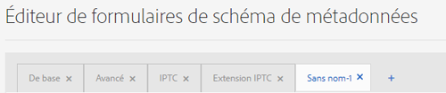

# Des schémas de métadonnées {#metadata-schemas}

Les entreprises proposent un modèle de métadonnées qui améliore la découverte, l’utilisation, l’interopérabilité des ressources, etc. Une application de métadonnées correcte est sacro-sainte pour la gestion de workflows et de processus reposant sur les métadonnées. Pour respecter la stratégie et les normes de métadonnées à l’échelle de l’entreprise, vous pouvez utiliser des schémas de métadonnées qui aident les utilisateurs de la gestion des actifs numériques à s’aligner. [!DNL Adobe Experience Manager] permet des méthodes simples et flexibles pour créer, gérer et appliquer des schémas de métadonnées.

Dans [!DNL Adobe Experience Manager Assets], les schémas contiennent des champs spécifiques pour des informations spécifiques à remplir. Il contient également des informations de mise en page pour afficher les champs de métadonnées d’une manière conviviale. Les propriétés de métadonnées comprennent le titre, la description, les types MIME, les balises, etc. Vous pouvez utiliser l’éditeur [!UICONTROL Forms] du Schéma de métadonnées pour modifier les schémas existants ou ajouter des schémas de métadonnées personnalisés.

Pour vue et modifier la page de propriétés d’un fichier, procédez comme suit :

1. Cliquez sur l’option **[!UICONTROL Propriétés de la Vue]** dans les actions rapides de la mosaïque de ressources dans la vue de carte. Vous pouvez également sélectionner une ressource, puis cliquer sur **[!UICONTROL Propriétés]**  dans la barre d’outils.

1. Vous pouvez modifier les différentes propriétés de métadonnées modifiables sous les onglets disponibles. Cependant, vous ne pouvez pas modifier la ressource [!UICONTROL Type] dans l&#39;onglet [!UICONTROL Basic] de la page de propriétés.

   

   *Figure : Onglet Simple sur  [!UICONTROL Propriétés] du fichier.*

   Pour modifier le type MIME d’une ressource, utilisez un formulaire de schéma de métadonnées personnalisé ou modifiez un formulaire existant. Voir [Modifier le Schéma de métadonnées Forms](#edit-metadata-schema-forms) pour plus d’informations. Si vous modifiez le schéma de métadonnées d’un type MIME, la mise en page des propriétés des fichiers et de tous les sous-types est modifiée. Par exemple, la modification d’un schéma jpeg sous `default/image` concerne uniquement la disposition des métadonnées (propriétés de ressource) des ressources du type MIME `image/jpeg`. Si vous modifiez le schéma par défaut, les modifications changent toutefois la disposition des métadonnées pour tous les types de ressources.

## Formulaires de Schéma de métadonnées {#default-metadata-schema-forms}

Pour vue d’une liste de formulaires ou de modèles, dans l’interface [!DNL Experience Manager], accédez à **[!UICONTROL Outils]** > **[!UICONTROL Ressources]** > **[!UICONTROL Schémas de métadonnées]**.

[!DNL Experience Manager] fournit les modèles de Schéma de métadonnées suivants.

| Modèles |  | Description |
|---|---|---|
| [!UICONTROL default] |  | Schéma de métadonnées de base pour les ressources. |
|  | Les formulaires enfants suivants héritent des propriétés du formulaire [!UICONTROL default] : |  |
|  | <ul><li>[!UICONTROL dm_video]</li></ul> | Schéma de formulaire pour les vidéos Dynamic Media. |
|  | <ul><li>[!UICONTROL image]</li></ul> | Schéma de formulaire pour les images de type MIME telles que `image/jpeg` et `image/png`.   Le   formulaire d’image comporte les modèles de formulaire enfant suivants : <ul><li> [!UICONTROL jpeg] : Schéma de formulaire pour les ressources avec un sous-type  [!UICONTROL jpeg].</li> <li>[!UICONTROL tiff] : Formulaire de schéma pour les actifs avec un sous-type TIFF.</li></ul> |
|  | <ul><li>[!UICONTROL l’application ;]</li></ul> | Schéma de formulaire pour les ressources de type MIME telles que `application/pdf` et `application/zip`.  [!UICONTROL pdf] : Schéma de formulaire pour les ressources avec un sous-type PDF. |
|  | <ul><li>[!UICONTROL vidéo]</li></ul> | Schéma de formulaire pour les ressources vidéo de type MIME telles que `video/avi` et `video/mp4`. |
| [!UICONTROL collection] |  | Schéma de formulaire pour les collections. |
| [!UICONTROL contentfragment] |  | Schéma de formulaire pour les fragments de contenu. |
| [!UICONTROL forms] |  | Ce formulaire de schéma porte sur [!DNL Adobe Experience Manager Forms]. |
| [!UICONTROL ugc_contentfragment] |  | Formulaire de schéma pour les éléments de contenu et les ressources générés par l’utilisateur intégrés dans le Experience Manager à partir des médias sociaux. |

>[!NOTE]
>
>Pour afficher les formulaires enfants d’un formulaire de schéma, cliquez sur le nom de ce dernier.

## Ajout d’un formulaire de schéma de métadonnées {#add-a-metadata-schema-form}

Pour ajouter un formulaire de schéma de métadonnées, procédez comme suit :

1. Pour ajouter un modèle personnalisé à la liste, cliquez sur **[!UICONTROL Créer]** dans la barre d’outils.

   >[!NOTE]
   >
   >Un symbole de verrouillage s’affiche avec les modèles non modifiés. Si vous personnalisez un modèle, il n’est pas verrouillé .

1. Dans la boîte de dialogue, indiquez le titre du formulaire de schéma et cliquez sur **[!UICONTROL Créer]** pour terminer le processus de création du formulaire.

## Modification des formulaires de schéma de métadonnées {#edit-metadata-schema-forms}

Vous pouvez modifier un formulaire de schéma de métadonnées existant ou nouvellement ajouté. Le formulaire de schéma de métadonnées contient des onglets et des éléments de formulaire dans les onglets. Vous pouvez associer ou configurer ces éléments de formulaire dans un champ au sein d’un nœud de métadonnées dans le référentiel CRX. Vous pouvez ajouter des onglets ou des éléments de formulaire au formulaire de schéma de métadonnées. Les onglets et les éléments de formulaire dérivés du parent sont à l’état verrouillé. Vous ne pouvez pas les modifier au niveau des enfants.

1. Sur la page [!UICONTROL Forms] Schéma de métadonnées, sélectionnez un formulaire et cliquez sur **[!UICONTROL Modifier]** dans la barre d’outils.

1. Sur la page **[!UICONTROL Éditeur de formulaire de Schéma de métadonnées]**, personnalisez le formulaire de métadonnées. Faites glisser les composants nécessaires de l&#39;onglet **[!UICONTROL Créer un formulaire]** vers l&#39;un des onglets.

   

   *Figure : Page d’ [!UICONTROL éditeur de Schéma de ] métadonnées avec des onglets disponibles.*

1. Pour configurer un composant, sélectionnez-le et modifiez ses propriétés dans l’onglet **[!UICONTROL Paramètres]**.

### Composants de l’onglet [!UICONTROL Créer un formulaire] {#components-within-the-build-form-tab}

L’onglet **[!UICONTROL Créer le formulaire]** répertorie les éléments de formulaire que vous utilisez dans votre formulaire de schéma. L’onglet **[!UICONTROL Paramètres]** contient les attributs de chaque élément sélectionné dans l’onglet **[!UICONTROL Créer le formulaire]**. Le tableau suivant répertorie les éléments de formulaire disponibles dans l’onglet **[!UICONTROL Créer le formulaire]** :

| Nom du composant | Description |
| -------------------------------- | ----------------------------------------------------------------------------------- |
| [!UICONTROL En-tête de section] | Permet d’ajouter un en-tête de section pour une liste de composants communs. |
| [!UICONTROL Une seule ligne de texte] | Permet d’ajouter une propriété d’une seule ligne de texte. Il est stocké sous la forme d’une chaîne. |
| [!UICONTROL Texte à plusieurs valeurs] | Permet d’ajouter une propriété de texte à plusieurs valeurs. Il est stocké sous forme de tableau de chaînes. |
| [!UICONTROL Nombre] | Permet d’ajouter un composant de nombre. |
| [!UICONTROL Date] | Permet d’ajouter un composant de date. |
| [!UICONTROL Liste déroulante] | Permet d’ajouter une liste déroulante. |
| [!UICONTROL Balises standard] | Permet d’ajouter une balise. |
| [!UICONTROL Balises intelligentes] | Ajoutez ce composant pour augmenter les capacités de recherche en ajoutant automatiquement des balises de métadonnées. |
| [!UICONTROL Champ masqué] | Permet d’ajouter un champ masqué. Il est envoyé en tant que paramètre POST lorsque la ressource est enregistrée. |
| [!UICONTROL Ressource référencée par] | Ajoutez ce composant pour afficher la liste des ressources référencées par la ressource. |
| [!UICONTROL Référencement des ressources] | Ajoutez ce composant pour afficher la liste des ressources qui référencent la ressource. |
| [!UICONTROL Références du produit] | Ajoutez ce composant pour afficher la liste des produits liés à la ressource. |
| [!UICONTROL Évaluation des ressources] | Ajoutez ce composant afin d’afficher des options pour évaluer la ressource. |
| [!UICONTROL Métadonnées contextuelles] | Ajoutez ce composant pour contrôler l’affichage des autres onglets de métadonnées dans la page de propriétés des ressources. |

#### Modification du composant de métadonnées {#edit-the-metadata-component}

Pour modifier les propriétés d’un composant de métadonnées sur le formulaire, cliquez sur le composant pour modifier l’ensemble ou un sous-ensemble des propriétés suivantes dans l’onglet **[!UICONTROL Paramètres]**.

**Libellé du champ** : nom de la propriété de métadonnées qui s’affiche sur la page des propriétés de la ressource.

**Associer à la propriété** : Cette propriété spécifie le chemin d’accès relatif ou le nom du noeud de ressource où il est enregistré dans le référentiel CRX. Il s’début avec `./` pour indiquer que le chemin d’accès se trouve sous le noeud de la ressource.

Les valeurs admises pour cette propriété sont les suivantes :

* `./jcr:content/metadata/dc:title` : stocke la valeur dans le nœud de métadonnées de la ressource en tant que propriété `dc:title`.

* `./jcr:created` : stocke la date et l’heure de création d’une ressource. Il s’agit d’une propriété protégée. Si vous configurez ces propriétés, Adobe recommande de les marquer avec l’état Désactiver la modification. Dans le cas contraire, l’erreur « Échec de modification des ressources » est générée lorsque vous enregistrez les propriétés de la ressource.

Pour garantir que le composant s’affiche correctement dans le formulaire de schéma de métadonnées, le chemin de la propriété ne doit pas comporter d’espace.

* **Espace réservé** : utilisez cette propriété pour spécifier du texte dans l’espace réservé concernant la propriété de métadonnées.
* **Obligatoire** : utilisez cette propriété pour marquer une propriété de métadonnées comme étant obligatoire dans la page Propriétés.
* **Désactiver la modification** : Utilisez cette propriété pour interdire toute modification d’une propriété sur la page des propriétés.
* **Afficher le champ vide en lecture seule** : utilisez cette propriété pour afficher une propriété de métadonnées sur la page Propriétés même si elle ne possède pas de valeur. Par défaut, lorsqu’une propriété de métadonnées ne possède pas de valeur, elle n’est pas répertoriée sur la page Propriétés.
* **Afficher la liste classée** : utilisez cette propriété pour afficher une liste classée de choix..
* **Choix** : utilisez cette propriété pour spécifier des choix dans une liste.
* **Description** : utilisez cette propriété pour ajouter une brève description pour le composant de métadonnées.
* **Classe** : classe d’objets à laquelle la propriété est associée.
* **Supprimer** : Cliquez sur   Supprimer pour supprimer un composant du schéma.

>[!NOTE]
>
>Le composant [!UICONTROL Champ masqué] n&#39;inclut pas ces attributs. À la place, il comprend des propriétés, telles que les attributs Nom, Valeur, Libellé du champ et Description. Les valeurs du composant Champ masqué sont envoyées en tant que paramètre POST lors de l’enregistrement de la ressource. Elles ne sont pas enregistrées sous forme de métadonnées pour la ressource.

Si vous sélectionnez l’option **[!UICONTROL Obligatoire]**, vous pouvez rechercher des fichiers dont les métadonnées obligatoires sont manquantes. Dans le panneau **[!UICONTROL Filtres]**, développez le prédicat **[!UICONTROL Validation des métadonnées]** et sélectionnez l’option **[!UICONTROL Non valide]**. Les résultats de la recherche affichent des fichiers dont les métadonnées obligatoires que vous avez configurées via le formulaire de schéma sont manquantes.

Si vous ajoutez le composant Métadonnées contextuelles à un onglet d’un formulaire de schéma, le composant apparaît sous forme de liste sur la page Propriétés des ressources auxquelles ce       schéma particulier est appliqué. La liste inclut tous les autres onglets, à l’exception de celui auquel vous avez appliqué le composant Métadonnées contextuelles. Actuellement, cette fonctionnalité fournit des fonctions de base pour contrôler l’affichage des métadonnées en fonction du contexte.

Pour afficher tout onglet de la page de propriétés en plus de l’onglet dans lequel le composant Métadonnées contextuelles est appliqué, sélectionnez l’onglet dans la liste. L’onglet est ajouté à la page Propriétés.

### Spécification des propriétés dans le fichier JSON {#specify-properties-in-json-file}

Au lieu de définir les propriétés des options sous l’onglet **[!UICONTROL Paramètres]**, vous pouvez définir les options d’un fichier JSON en spécifiant les paires clé-valeur correspondantes. Spécifiez le chemin d’accès au fichier JSON dans le champ **[!UICONTROL Chemin d’accès JSON]**.

#### Ajout ou suppression d’un onglet dans le formulaire de schéma {#add-delete-a-tab-in-the-schema-form}

L’éditeur de schéma vous permet d’ajouter ou de supprimer un onglet. Le formulaire de schéma par défaut comprend les onglets **[!UICONTROL Basic]**, **[!UICONTROL Advanced]**, **[!UICONTROL IPTC]** et **[!UICONTROL IPTC Extension]**.

Cliquez sur `+` pour ajouter un onglet à un formulaire de schéma. Par défaut, le nouvel onglet porte le nom `Unnamed-1`. Vous pouvez modifier le nom à partir de l&#39;onglet **[!UICONTROL Paramètres.]** Pour supprimer un onglet, cliquez sur `X`.

## Suppression de formulaires de schéma de métadonnées {#deleting-metadata-schema-forms}

AEM vous permet uniquement de supprimer des formulaires de schéma personnalisés. Il ne vous permet pas de supprimer les formulaires/modèles de schéma par défaut. Cependant, vous pouvez supprimer toutes les modifications personnalisées dans ces formulaires.

Pour supprimer un formulaire, sélectionnez-le puis cliquez sur l’icône Supprimer.

>[!NOTE]
>
>Après avoir supprimé les modifications personnalisées apportées à un formulaire par défaut, l’icône représentant un cadenas réapparaît devant celui-ci dans l’interface Schéma de métadonnées pour indiquer que l’état par défaut du formulaire a été rétabli.

>[!NOTE]
>
>* Après avoir supprimé les modifications personnalisées apportées à un formulaire par défaut, le verrou  réapparaît avant le formulaire. Il indique que l’état par défaut du formulaire est rétabli.
>* Vous ne pouvez pas supprimer les formulaires de schéma de métadonnées par défaut dans [!DNL Assets].

## Formulaires de schéma pour les types MIME    {#schema-forms-for-mime-types}

[!DNL Experience Manager] fournit des formulaires par défaut pour plusieurs types MIME prêts à l’emploi. Vous pouvez toutefois ajouter des formulaires personnalisés pour les ressources de plusieurs types MIME.

### Ajouter de nouveaux formulaires pour les types MIME {#adding-new-forms-for-mime-types}

Créez un formulaire sous le type de formulaire approprié. Par exemple, pour ajouter un modèle pour le sous-type `image/png`, créez le formulaire sous les formulaires &quot;image&quot;. Le titre du formulaire de schéma est le nom du sous-type. Dans ce cas, le titre est `png`.

#### Utiliser un modèle de schéma existant pour divers types MIME {#use-an-existing-schema-template-for-various-mime-types}

Vous pouvez utiliser un modèle existant pour un autre type MIME. Par exemple, utilisez le formulaire `image/jpeg` pour les ressources de type MIME `image/png`.

Dans ce cas, créez un noeud à `/etc/dam/metadataeditor/mimetypemappings` dans le référentiel CRX. Indiquez un nom pour le nœud et définissez les propriétés suivantes :

| Nom | Description | Type | Valeur |
|------|-------------|------|-------|
| `exposedmimetype` | Nom du formulaire existant à associer | `String` | `image/jpeg` |
| `mimetypes` | Liste des types MIME qui utilisent le formulaire défini dans l’attribut `exposedmimetype`. | `String` | `image/png` |

[!DNL Assets] mappe les types MIME et les formulaires de schéma suivants :

| Formulaire de schéma | Types MIME |
|---|---|
| image/jpeg | image/pjpeg |
| image/tiff | image/x-tiff |
| application/pdf | application/postscript |
| application/x-ImageSet | Multipart/Related; type=application/x-ImageSet |
| application/x-SpinSet | Multipart/Related; type=application/x-SpinSet |
| application/x-MixedMediaSet | Multipart/Related; type=application/x-MixedMediaSet |
| video/quicktime | video/x-quicktime |
| video/mpeg4 | video/mp4 |
| video/avi | video/avi, video/msvideo, video/x-msvideo |
| video/wmv | video/x-ms-wmv |
| video/flv | video/x-flv |

## Octroi de l’accès aux schémas de métadonnées {#grant-access-to-metadata-schemas}

La fonction Schéma de métadonnées n’est disponible que pour les administrateurs. Cependant, les administrateurs peuvent fournir un accès aux non-administrateurs en modifiant certaines autorisations. Indiquez aux utilisateurs non administrateurs les autorisations de création, de modification et de suppression sur le dossier `/conf`.

## Application de métadonnées spécifiques au dossier {#applying-folder-specific-metadata}

[!DNL Assets] vous permet de définir une variation d’un schéma de métadonnées et de l’appliquer à un dossier spécifique.

Par exemple, vous pouvez définir une variation du schéma de métadonnées par défaut et l’appliquer à un dossier. Lorsque vous appliquez le schéma modifié, il remplace le schéma de métadonnées d’origine par défaut qui est appliqué aux ressources du dossier.

Seuls les fichiers téléchargés vers le dossier auquel ce schéma est appliqué sont conformes aux métadonnées modifiées définies dans le schéma de métadonnées de variante. [!DNL Assets] dans d’autres dossiers où le schéma d’origine est appliqué, la conformité aux métadonnées définies dans le schéma d’origine est maintenue.

L’héritage des métadonnées par ressources dépend du schéma appliqué au dossier de niveau supérieur dans la hiérarchie. Le même schéma est appliqué ou hérité par les sous-dossiers. Si un autre schéma est appliqué au niveau du sous-dossier, l’héritage s’arrête.

1. Dans l&#39;interface [!DNL Experience Manager], accédez à **[!UICONTROL Outils]** > **[!UICONTROL Ressources]** > **[!UICONTROL Schémas de métadonnées]**. La page **[!UICONTROL Formulaires de schéma de métadonnées]** s’affiche.
1. Cochez la case située avant un formulaire, par exemple le formulaire de métadonnées par défaut, puis cliquez sur **[!UICONTROL Copier]** et enregistrez-le comme formulaire personnalisé. Spécifiez un nom personnalisé pour le formulaire, par exemple `my_default`. Vous pouvez également créer un formulaire personnalisé.

1. Dans la page **[!UICONTROL Forms]** du Schéma de métadonnées, sélectionnez le formulaire `my_default`, puis cliquez sur **[!UICONTROL Modifier]**.
1. Sur la page **[!UICONTROL Éditeur de schéma de métadonnées]**, ajoutez un champ de texte au formulaire de schéma. Par exemple, ajoutez un champ avec l’étiquette **[!UICONTROL Catégorie]**.
1. Cliquez sur **[!UICONTROL Enregistrer]**. Le formulaire modifié figure sur la page **[!UICONTROL Formulaires de schéma de métadonnées]**.
1. Cliquez/appuyez sur **[!UICONTROL Appliquer au(x) dossier(s)]** dans la barre d’outils pour appliquer les métadonnées personnalisées à un dossier.
1. Sélectionnez le dossier auquel appliquer le schéma modifié, puis cliquez/appuyez sur **[!UICONTROL Appliquer]**.
1. Si d’autres métadonnées sont appliquées au dossier, un message s’affiche pour vous avertir que vous êtes sur le point de remplacer le schéma de métadonnées existant. Cliquez sur **Remplacer**.
1. Cliquez sur **OK** pour fermer le message de confirmation.
1. Accédez au dossier auquel vous avez appliqué le schéma de métadonnées modifié.

## Définition des métadonnées obligatoires     {#defining-mandatory-metadata}

Vous pouvez définir des champs obligatoires au niveau d’un dossier, qui s’appliquent aux ressources chargées dans ce dossier. Si vous chargez des ressources présentant des métadonnées manquantes dans des champs obligatoires précédemment définis, une indication visuelle de métadonnées manquantes apparaît sur les ressources en mode Carte.

>[!NOTE]
>
>Un champ de métadonnées peut être défini comme obligatoire en fonction de la valeur d’un autre champ. Dans le mode Carte, AEM n’affiche pas le message d’avertissement concernant les métadonnées manquantes pour ces champs de métadonnées obligatoires.

1. Cliquez sur le logo AEM, puis accédez à **[!UICONTROL Outils]** > **[!UICONTROL Ressources]** > **[!UICONTROL Schémas de métadonnées]**. La page **[!UICONTROL Formulaires de schéma de métadonnées]** s’affiche.
1. Enregistrez le formulaire de métadonnées par défaut en tant que formulaire personnalisé. Par exemple, enregistrez-le sous le nom `my_default`.
1. Modifiez le formulaire personnalisé. Ajoutez un champ obligatoire. Par exemple, ajoutez un champ **[!UICONTROL Catégorie]** et rendez-le obligatoire.
1. Cliquez sur **[!UICONTROL Enregistrer]**. Le formulaire modifié figure sur la page **[!UICONTROL Formulaires de schéma de métadonnées.]** Sélectionnez le formulaire et cliquez/appuyez sur **[!UICONTROL Appliquer au(x) dossier(s)]** dans la barre d’outils pour appliquer les métadonnées personnalisées à un dossier.
1. Accédez au dossier et chargez des ressources présentant des données manquantes pour le champ obligatoire que vous avez ajouté au formulaire personnalisé. Un message concernant les métadonnées manquantes pour le champ obligatoire apparaît dans l’affichage Carte de la ressource.
1. (Facultatif) Accédez à `https://[server]:[port]/system/console/components/`. Configurez et activez le composant `com.day.cq.dam.core.impl.MissingMetadataNotificationJob` ; celui-ci est désactivé par défaut. Définissez la fréquence à laquelle AEM vérifie la validité des métadonnées sur les ressources.

   Cette configuration ajoute une propriété `hasValidMetadata` au nœud `jcr:content` des ressources. Cette propriété permet à AEM de filtrer les résultats d’une recherche.

   >[!NOTE]
   >
   >Si une ressource est ajoutée après la vérification planifiée, elle n’est pas marquée avec l’indicateur `hasValidMetadata` avant la prochaine vérification planifiée. Les ressources ne figurent pas dans les résultats de recherche intermédiaires.

   >[!CAUTION]
   >
   >Les contrôles de validation des métadonnées sont des tâches qui nécessitent de nombreuses ressources et qui peuvent donc altérer les performances de votre système. Planifiez les contrôles en conséquence. Si le serveur n’est pas en mesure de faire face à la charge, essayez de désactiver cette tâche
