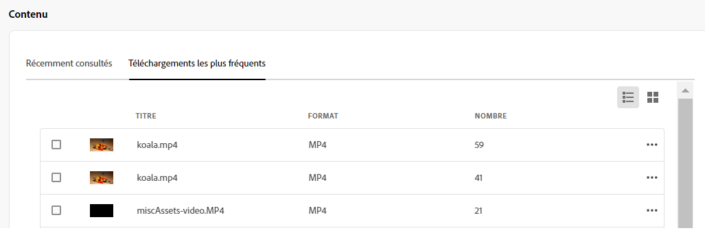

# Mon espace de travail d’Assets {#my-workspace}

<table>
    <tr>
        <td>
            <i>Nouveau</i> <a href="/help/assets/dynamic-media/dm-prime-ultimate.md"><b>Dynamic Media Prime et Ultimate</b></a>
        </td>
        <td>
            <i>Nouveau</i> <a href="/help/assets/assets-ultimate-overview.md"><b>AEM Assets Ultimate</b></a>
        </td>
        <td>
            <i>Nouvelle</i> <a href="/help/assets/integrate-aem-assets-edge-delivery-services.md"><b>Intégration d’AEM Assets à Edge Delivery Services</b></a>
        </td>
        <td>
            <i>Nouveau</i> <a href="/help/assets/aem-assets-view-ui-extensibility.md"><b>Extensibilité de l’interface utilisateur</b></a>
        </td>
          <td>
            <i>Nouveau</i> <a href="/help/assets/dynamic-media/enable-dynamic-media-prime-and-ultimate.md"><b>Activation de Dynamic Media Prime et Ultimate</b></a>
        </td>
    </tr>
    <tr>
        <td>
            <a href="/help/assets/search-best-practices.md"><b>Bonnes pratiques de recherche</b></a>
        </td>
        <td>
            <a href="/help/assets/metadata-best-practices.md"><b>Bonnes pratiques relatives aux métadonnées</b></a>
        </td>
        <td>
            <a href="/help/assets/product-overview.md"><b>Hub de contenus</b></a>
        </td>
        <td>
            <a href="/help/assets/dynamic-media-open-apis-overview.md"><b>Fonctionnalités Dynamic Media avec OpenAPI</b></a>
        </td>
        <td>
            <a href="https://developer.adobe.com/experience-cloud/experience-manager-apis/"><b>Documentation de développement pour AEM Assets</b></a>
        </td>
    </tr>
</table>

>[!CONTEXTUALHELP]
>id="assets_my_workspace"
>title="Mon espace de travail"
>abstract="Assets comprend désormais un espace de travail personnalisable, composé de widgets permettant d’accéder facilement aux éléments clés de l’interface utilisateur d’Assets et aux informations qui vous intéressent le plus. Sur une page unique, bénéficiez d’un aperçu de vos tâches et d’un accès rapide aux principaux workflows."

Assets comprend désormais un espace de travail personnalisable, composé de widgets permettant d’accéder facilement aux éléments clés de l’interface utilisateur d’Assets et aux informations qui vous intéressent le plus. Sur une page unique, bénéficiez d’un aperçu de vos tâches et d’un accès rapide aux principaux workflows. Grâce à un accès rapide et convivial aux menus pertinents, vous gagnez en efficacité et en vitesse de contenu.

Pour accéder à Mon espace de travail, cliquez sur **[!UICONTROL Mon espace de travail]** à partir des éléments disponibles dans le volet de navigation de gauche. Mon espace de travail comprend différents widgets qui affichent les widgets Accès rapide, Insights, Tâches et Contenu. Vous pouvez configurer l’affichage de ces widgets dans votre espace de travail en fonction de vos préférences.

>[!NOTE]
>
>Le widget Insights n’est visible que par l’administration.

<!--

**New features coming soon**

Highlights upcoming features for Assets.

-->

**Accès rapide**

Épinglez des fichiers, des dossiers et des collections pour accéder plus rapidement à ces éléments lorsque vous en aurez besoin ultérieurement. Tous les éléments épinglés s’affichent dans la section **Accès rapide** de Mon espace de travail. Vous pouvez y accéder à l’aide de Mon espace de travail au lieu d’accéder à l’emplacement où ils sont enregistrés dans le référentiel.

Pour épingler une ressource, un dossier ou une collection :

1. Sélectionnez l’élément et cliquez sur **[!UICONTROL Épingler à l’accès rapide]**.

1. Sélectionnez cette option si vous devez épingler l’élément uniquement pour vous, pour l’ensemble de l’organisation ou pour les groupes sélectionnés. Si vous sélectionnez **[!UICONTROL Pour les groupes]**, choisissez un nom de groupe existant dans le champ **[!UICONTROL Épingler pour les groupes]**.

   
1. Cliquez sur **[!UICONTROL Épingler]**.

   Les éléments épinglés s’affichent dans la section **[!UICONTROL Accès rapide]** de Mon espace de travail.
   

**Insights**

L’administration peut afficher un résumé du nombre de téléchargements et de chargements effectués dans l’environnement Assets au cours des 30 derniers jours. Vous pouvez cliquer sur **[!UICONTROL Afficher tout]** pour accéder rapidement à la page Insights afin de consulter des tableaux de bord plus détaillés.

Vous pouvez également afficher les principaux termes recherchés, ainsi que le nombre de fois où ces termes sont recherchés dans votre déploiement de la vue Assets à l’aide de la section **Informations** de Mon espace de travail. Vous pouvez également accéder aux informations pour afficher les principales recherches effectuées au cours des 30 derniers jours ou 12 derniers mois.

**Tâches**

Affiche la liste des tâches qui vous sont actuellement affectées dans l’onglet **[!UICONTROL Mes tâches]**, que vous avez créée dans l’onglet **[!UICONTROL Tâches affectées]** et les tâches que vous avez déjà effectuées dans l’onglet **[!UICONTROL Tâches terminées]**. Vous pouvez sélectionner une tâche et cliquer sur **[!UICONTROL Terminer la tâche]** pour l’approuver ou la rejeter. Vous pouvez également sélectionner une tâche et cliquer sur **[!UICONTROL Afficher les détails de la tâche]** pour afficher la tâche et l’approuver, la rejeter, la modifier ou la supprimer.

>[!NOTE]
>
> Le menu **[!UICONTROL Assigner des tâches]**, permettant d’assigner une tâche sur une ressource à un autre utilisateur, est disponible lorsque vous sélectionnez une ressource ou affichez le volet des détails de celle-ci.

**Contenu**

Présente les ressources sous différents affichages, y compris la liste des ressources que vous avez récemment consultées. Vous pouvez afficher les ressources du widget dans la vue Liste, Grille, Galerie ou Cascade et les trier par nom, taille ou date de modification. Vous pouvez également sélectionner une ressource pour en afficher les détails ou la supprimer de la liste des ressources récemment consultées.

L’onglet **[!UICONTROL Meilleurs téléchargements]** affiche les dix ressources les plus téléchargées disponibles dans votre environnement de la vue Assets. Vous pouvez choisir d’afficher les ressources en vue Liste ou vue Grille. Les deux vues affichent le type de format et le nombre de téléchargements pour chaque ressource. Vous pouvez également sélectionner une ressource et cliquer sur **[!UICONTROL Détails]** pour afficher ses propriétés.

## Personnaliser mon espace de travail {#configure-widgets}

Tous les widgets s’affichent par défaut, mais vous pouvez activer ou désactiver les widgets qui composent « Mon espace de travail ». Les préférences sont propres à chaque utilisateur et utilisatrice.

1. Cliquez sur **[!UICONTROL Mon espace de travail]**, disponible dans le volet de navigation de gauche, puis cliquez sur **[!UICONTROL Personnaliser]**.

1. Désactivez le bouton (bascule) du widget que vous ne souhaitez pas afficher dans votre espace de travail. Vous pouvez également faire glisser un widget vers un autre emplacement pour modifier son ordre d’affichage dans l’espace de travail.

1. Cliquez sur **[!UICONTROL Terminé]** pour enregistrer les modifications.

   
