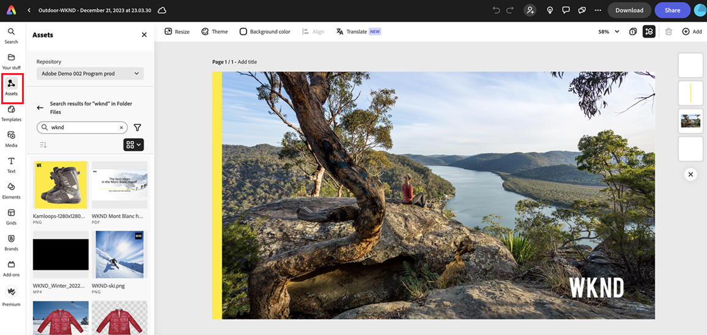

# Intégration native à Adobe Express {#native-integration-adobe-express}

AEM Assets s’intègre de manière native à Adobe Express, ce qui vous permet d’accéder directement aux ressources stockées dans AEM Assets depuis l’interface utilisateur d’Adobe Express. Vous pouvez placer du contenu géré dans AEM Assets dans la zone de travail d’Express, puis enregistrer du contenu nouveau ou modifié dans un référentiel AEM Assets. L’intégration offre les principaux avantages suivants :

* Réutilisation accrue du contenu en modifiant et en enregistrant de nouvelles ressources dans AEM.

* Réduction du temps et des efforts nécessaires à la création de nouvelles ressources ou de nouvelles versions de ressources existantes.

## Prérequis {#prerequisites}

Autorisations d&#39;accès à Adobe Express et à au moins un environnement dans AEM Assets. L’environnement peut être n’importe lequel des référentiels d’Assets as a Cloud Service ou d’Assets Essentials.

## Utilisation d’AEM Assets dans l’éditeur Adobe Express {#use-aem-assets-in-express}

Pour commencer à utiliser AEM Assets dans l’éditeur Adobe Express, procédez comme suit :

1. Ouvrez l’application web Adobe Express.

2. Ouvrez une nouvelle zone de travail vierge en chargeant un nouveau modèle ou un nouveau projet, ou en créant une ressource.

3. Cliquez sur **[!UICONTROL Assets]** disponible dans le volet de navigation de gauche. Adobe Express affiche la liste des référentiels auxquels vous avez accès, ainsi que la liste des ressources et des dossiers disponibles au niveau racine.

4. Parcourez ou recherchez des ressources dans votre référentiel à faire glisser et à déposer sur la zone de travail. Vous pouvez filtrer les ressources à l’aide de différents filtres disponibles, tels que le type de fichier, le type MIME et les dimensions.

   >[!NOTE]
   >
   >Le filtrage par dimension ne s’applique pas aux vidéos.

   

## Enregistrement de projets Adobe Express dans AEM Assets {#save-express-projects-in-assets}

Après avoir incorporé les modifications appropriées dans la zone de travail Express, vous pouvez l’enregistrer dans le référentiel AEM Assets.

1. Cliquez sur **[!UICONTROL Partager]** pour ouvrir la boîte de dialogue **[!UICONTROL Partager]**.

   

2. Dans la section Stockage du volet de droite, sélectionnez **AEM Assets**. Adobe Express affiche la boîte de dialogue de chargement.
3. Sélectionnez **Page actuelle** ou **Toutes les pages**. Spécifiez un nom et un format pour la ou les ressources à exporter. Vous pouvez exporter le contenu de la zone de travail aux formats PNG, JPEG, PDF, MP4, MP4+PNG ou MP4+JPEG. Le format s’ajuste automatiquement en fonction des ressources sur la ou les pages de la zone de travail.
Sélectionner **Page active** enregistre la ressource sur la page active dans le dossier de destination. Si vous sélectionnez **Toutes les pages** et que le format d’exportation n’est pas PDF, toutes les pages de la zone de travail sont enregistrées en tant que fichiers distincts dans un nouveau dossier de votre dossier de destination. Si le format d’exportation est PDF, toutes les pages de la zone de travail sont enregistrées en tant que fichier PDF unique dans le dossier de destination.

4. Cliquez sur l’icône de dossier sous **Dossier de destination** pour sélectionner un emplacement et enregistrer la ou les ressources.

   

5. Facultatif : vous pouvez ajouter des métadonnées de campagne pour votre chargement à l’aide du champ **Nom du projet ou de la campagne**. Vous pouvez utiliser un nom existant ou en créer un nouveau. Vous pouvez définir plusieurs noms de projet ou de campagne pour votre chargement. Pour enregistrer le nom, saisissez simplement le nom et appuyez sur Entrée.
Adobe recommande, en règle générale, de spécifier des valeurs dans le reste des champs et de créer une expérience de recherche améliorée pour les ressources que vous avez chargées.

6. De même, définissez des valeurs pour les champs **[!UICONTROL Mots-clés]** et **[!UICONTROL Canaux]**.

7. Cliquez sur **[!UICONTROL Charger]** pour charger la ou les ressources dans AEM Assets.

## Formats de fichiers pris en charge {#supported-formats}

[!DNL Content Hub] prend en charge tous les types et formats de ressources pris en charge par le référentiel [!DNL Assets] sous-jacent. Le tableau suivant répertorie les formats de fichiers clés dans [!DNL the Content Hub], qui offrent une prise en charge supplémentaire de la prévisualisation visuelle des ressources :

<table> 
    <tbody>
     <tr>
      <th><strong>Type de fichier</strong></th>
      <th><strong>Formats pris en charge</strong></th>
      <th><strong>Taille</strong></th>
     </tr>
     <tr>
        <td rowspan="4"> Image </td>
    </tr>
    </tr>
    <tr>
        <td>[!UICONTROL JPEG]</td>
        <td> 8 000 x 8 000 pixels, 40 Mo max.</td>
    </tr>
    <tr>
        <td>[!UICONTROL PNG]</td>
        <td> 8 000 x 8 000 pixels, 40 Mo max.</td>
    </tr>
    <tr>
        <td>[!UICONTROL SVG]</td>
        <td> Maximum 250 Ko</td>
    </tr>
    <tr>
        <td rowspan="4"> Vidéo </td>
    </tr>
    </tr>
    <tr>
        <td>[!UICONTROL Quicktime]</td>
        <td> - </td>
    </tr>
    <tr>
        <td>[!UICONTROL MP4]</td>
        <td> 3 840 x 3 840 pixels, 200 Mo maximum</td>
    </tr>
    <tr>
        <td>[!UICONTROL MPEG]</td>
        <td> 200 Mo maximum </td>
    </tr>
    <tr>
        <td rowspan="4"> Document </td>
    </tr>
    </tr>
    <tr>
        <td>[!UICONTROL txt] (brut)</td>
        <td> - </td>
    </tr>
    <tr>
        <td>[!UICONTROL Doc/Docx]</td>
        <td> - </td>
    </tr>
    <tr>
        <td>[!UICONTROL XML]</td>
        <td> - </td>
    </tr>
    <tr>
        <td rowspan="2"> Média imprimé </td>
    </tr>
    </tr>
    <tr>
        <td>[!UICONTROL PDF]</td>
        <td> - </td>
    </tr>
    </tbody>
   </table>

## Limites {#limitations}

1. Pour l’importation et l’exportation, le type de fichier vidéo pris en charge est MP4.

2. Pour l’importation de vidéos **MP4** reportez-vous à la section [Formats de fichiers pris en charge](#supported-formats). En outre, les vidéos avec arrière-plans transparents (couche alpha) ne sont pas prises en charge.
   <!--
   1. The maximum file size supported is 200 MB. If this limit exceeds, an alert message displays.
   2. The maximum supported resolution is 3840 X 3840 pixels.
   3. Videos with transparent backgrounds (alpha channel) are not supported.
   -->

3. Pour l’exportation de vidéo **MP4**, la taille de fichier maximale prise en charge est de 200 Mo. Si cette limite est dépassée, une alerte suggère de réduire la vidéo à 200 Mo ou moins, ou de la charger manuellement dans le dossier de destination AEM Assets après l’avoir téléchargée.

