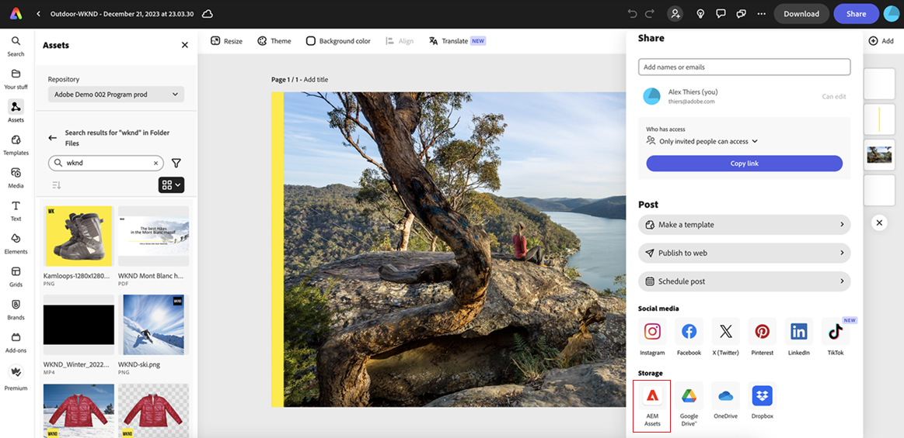

# Utilisation de la fonction de conseil en contenu pour accéder à AEM Assets dans Adobe Express {#native-integration-adobe-express-using-content-advisor}

Adobe Experience Manager (AEM) Assets s’intègre de manière native à Adobe Express, ce qui vous permet de découvrir, d’accéder et d’utiliser des ressources d’AEM Assets directement dans l’interface Express à l’aide de la fonction de conseil sur le contenu.

Content Advisor transforme la manière dont vous découvrez et utilisez des ressources dans Adobe Express en apportant une découverte de ressources intelligente et contextuelle directement à votre workflow de création. Au lieu de rechercher des ressources en saisissant des mots-clés, le gestionnaire d’accès recherche les ressources appropriées et approuvées en fonction du contenu de la zone de travail, du résumé de campagne et de l’intention, ce qui vous permet de trouver plus rapidement la ressource appropriée.

Grâce à des suggestions intelligentes, à l’accès aux rendus Dynamic Media et à une visibilité complète sur les métadonnées des ressources, le gestionnaire de contenu vous permet de localiser, d’évaluer et d’utiliser efficacement les ressources d’AEM Assets sans quitter Adobe Express. Cela permet une création de contenu plus rapide, une réutilisation des ressources améliorée et une utilisation cohérente des ressources approuvées et conformes à la marque.


Vous pouvez également placer des ressources dans la zone de travail Express et enregistrer le contenu nouveau ou modifié dans AEM Assets, assurant ainsi une gestion et une gouvernance des ressources centralisées. L’intégration native à Adobe Express offre les principaux avantages suivants :

* Création de contenu accélérée avec découverte de ressources et recommandations contextuelles.

* Augmentation de la réutilisation du contenu en modifiant les ressources existantes et en enregistrant de nouvelles ressources dans AEM Assets.

* Accès plus rapide aux rendus Dynamic Media optimisés pour les canaux approuvés.

* Réduction du temps et des efforts nécessaires pour créer de nouvelles ressources ou de nouvelles versions tout en préservant la cohérence de la marque.

## Conditions préalables {#prerequisites}

Autorisations d&#39;accès à Adobe Express et à au moins un environnement dans AEM Assets. L’environnement peut être n’importe lequel des référentiels as a Cloud Service d’Assets.

## Utilisation d’AEM Assets dans l’éditeur Adobe Express {#use-aem-assets-in-express}

Pour commencer à utiliser AEM Assets dans l’éditeur Adobe Express, procédez comme suit :

1. Ouvrez l’application web Adobe Express.

2. Ouvrez une nouvelle zone de travail vierge en chargeant un nouveau modèle ou un nouveau projet, ou en créant une ressource.

3. Cliquez sur **&#x200B;**&#x200B;disponible dans le volet de navigation de gauche. Adobe Express affiche le [gestionnaire d’accès](#intelligent-asset-discovery-content-advisor), qui répertorie les référentiels auxquels vous avez accès, ainsi que la liste des ressources et des dossiers disponibles au niveau racine.

4. Recherchez ou recherchez des ressources dans le référentiel à l’aide du [gestionnaire d’accès](#intelligent-asset-discovery-content-advisor), puis faites-les glisser et déposez-les sur la zone de travail. Vous pouvez également cliquer sur les ressources pour les placer sur la zone de travail. Vous pouvez également filtrer les ressources  selon différents critères, tels que le statut d’approbation, le type de fichier, le type MIME et les dimensions.

   >[!NOTE]
   >
   >Le filtrage par dimension ne s’applique pas aux vidéos.

   

## Détection intelligente des ressources avec le gestionnaire de contenu {#intelligent-asset-discovery-content-advisor}

Le gestionnaire de contenu vous aide à découvrir des ressources pertinentes à l’aide de recommandations intelligentes et contextuelles basées sur le contenu de la zone de travail ou le résumé de la campagne. Il vous permet également de sélectionner des rendus Dynamic Media prêts pour le canal optimisés pour votre cas d’utilisation.


Le gestionnaire d&#39;accès affiche la liste des fichiers, dossiers et collections dans les vues Liste et Grille. Il vous permet d’ajouter des ressources aux formats PNG, JPEG, PSD, MP4, SVG et PDF à la zone de travail Express. Vous pouvez également prévisualiser les fichiers PDF défilables ou tout autre type de format en cliquant sur l’icône  disponible sur la carte de la ressource.

Cliquez sur l’icône  pour afficher également les métadonnées de ressource disponibles dans l’onglet **[!UICONTROL De base]** ou afficher les rendus Dynamic Media disponibles dans l’onglet [Dynamic Media](#dynamic-media-renditions-content-advisor). Faites glisser et déposez le contenu suggéré sur la zone de travail. Vous pouvez également cliquer sur la ressource pour la placer automatiquement sur la zone de travail.


>[!IMPORTANT]
> 
>Veillez à sélectionner un référentiel **auteur** dans la liste déroulante **Référentiel**. Un référentiel **diffusion** n’affiche pas les fonctionnalités du gestionnaire de contenu.
>
> En outre, le référentiel **diffusion** ne dispose pas de ressources organisées dans des dossiers et des collections. Toutes les ressources s’affichent au niveau racine dans une structure plate.

Le gestionnaire d’accès propose les fonctionnalités clés suivantes :

* [Recherche optimisée par l&#39;IA pour une découverte de ressources plus intelligente](#content-advisor-ai-search)

* [Suggestions intelligentes basées sur le contexte et l’intention](#smart-suggestions-content-advisor)

* [Des résumés de campagne pour découvrir les ressources pertinentes](#campaign-briefs-content-advisor)

* [Rendus de ressources Dynamic Media disponibles](#dynamic-media-renditions-content-advisor)

* [Accès aux métadonnées des ressources cohérent avec la vue Assets](#asset-metadata-content-advisor)

* [Filtres d’accès cohérents avec la vue Assets](#filters-content-advisor)

* [Accès et réutilisation des recherches récentes et enregistrées](#saved-searches-content-advisor)

* [Recherche de ressources dans et entre les collections](#search-collections-content-advisor)

### Recherche optimisée par l&#39;IA pour une découverte de ressources plus intelligente {#content-advisor-ai-search}

Content Advisor utilise une fonctionnalité de recherche avancée qui comprend la signification et l’intention derrière la requête d’un utilisateur plutôt que de se fier à des correspondances exactes de mots-clés. Il utilise l’intelligence artificielle (IA) et le machine learning pour fournir des résultats plus précis et contextuels.

Contrairement à la recherche traditionnelle par mot-clé, qui recherche des termes exacts, Recherche optimisée par l&#39;IA interprète les relations entre les mots, les concepts et l’intention de l’utilisateur. Cela permet de s’assurer que les utilisateurs et les utilisatrices trouvent ce qu’ils recherchent, même si leur requête est formulée différemment, contient des fautes de frappe ou est dans une autre langue.


Voici quelques-uns de ses principaux avantages :

* Prise en charge multilingue : effectuez des recherches dans plusieurs langues sans nécessiter de traductions exactes. Les utilisateurs peuvent trouver du contenu pertinent quel que soit leur langage de requête.

* Gère les fautes d’orthographe : interprète les fautes de frappe et d’orthographe, en garantissant des résultats précis même avec une saisie imparfaite.

* Comprend les synonymes : fournit des résultats pour les termes et expressions associés, de sorte que les utilisateurs n’ont pas besoin de deviner le bon mot-clé.

* Recherche contextuelle : reconnaît l’intention derrière une requête, pas seulement les mots exacts.

>[!IMPORTANT]
> 
>* La version AEM minimale requise pour accéder à Recherche optimisée par l&#39;IA dans le gestionnaire d’accès est `21994`.


### Suggestions intelligentes basées sur le contexte et l’intention {#smart-suggestions-content-advisor}

Le gestionnaire de contenu affiche des suggestions intelligentes en fonction du contexte et de l’intention du contenu dans la zone de travail express. Cela vous permet de découvrir et d’utiliser rapidement des ressources qui correspondent à vos besoins en matière de contenu, sans avoir à effectuer de recherche manuelle fastidieuse.


>[!IMPORTANT]
> 
>* Le gestionnaire d’accès affiche des suggestions intelligentes en fonction du contexte et de l’intention du contenu disponible dans les calques de texte ou du titre dans la zone de travail express. Il n’affiche pas les résultats en fonction des images disponibles dans la zone de travail.
>* Vous devez signer un Cavalier GenAI pour accéder à cette fonctionnalité dans le gestionnaire de contenu. Pour signer GenAI rider, contactez votre représentant Adobe.
>* La version minimale requise d’AEM pour accéder à cette fonctionnalité est `21994`.
>* Les suggestions intelligentes ne se mettent pas automatiquement à jour lorsque vous mettez à jour la zone de travail. Cliquez sur l’icône d’actualisation dans le panneau **Contenu suggéré** pour afficher la liste mise à jour des suggestions,

### Des résumés de campagne pour découvrir les ressources pertinentes {#campaign-briefs-content-advisor}

Le gestionnaire d’accès vous permet de télécharger un document de résumé de campagne pour découvrir les ressources pertinentes sans saisir manuellement les mots-clés de recherche. Le conseiller d’accès analyse les informations du résumé de la campagne afin de comprendre l’intention de la campagne et recommande les ressources appropriées disponibles dans AEM Assets.


>[!IMPORTANT]
>
>* Le gestionnaire d’accès analyse les informations disponibles sous forme de texte dans le résumé de la campagne afin de recommander les ressources appropriées. Il n’analyse pas les informations disponibles sous forme d’images dans le résumé de la campagne.
>* Les types de fichiers pris en charge que vous pouvez charger en tant que résumé de campagne incluent les documents PDF, DOCX et TXT.
>* Vous devez signer un Cavalier GenAI pour accéder à cette fonctionnalité dans le gestionnaire de contenu. Pour signer GenAI rider, contactez votre représentant Adobe.
>* La version minimale requise d’AEM pour accéder à cette fonctionnalité est `21994`.

### Rendus de ressources Dynamic Media disponibles {#dynamic-media-renditions-content-advisor}

Les rendus Dynamic Media fournissent des versions de ressources prêtes à l’emploi et optimisées pour les canaux, notamment les [paramètres d’image prédéfinis](/help/assets/dynamic-media/managing-image-presets.md), [recadrages intelligents](/help/assets/dynamic-media/image-profiles.md), les types de format et les profils de couleurs. Ces rendus permettent de s’assurer que la ressource sélectionnée répond aux exigences de canal et de conception sans nécessiter de modification manuelle ou de duplication de ressources.

Vous pouvez également appliquer des modificateurs Dynamic Media pour prévisualiser les réglages en temps réel avant de placer le rendu sur la zone de travail Express, ce qui permet de sélectionner plus rapidement le rendu le plus approprié tout en préservant la cohérence et la qualité des ressources.

Cliquez sur l’icône  sur la carte de la ressource et sélectionnez l’onglet **[!UICONTROL Dynamic Media]** pour afficher les rendus disponibles pour une ressource. Vous pouvez choisir d’afficher les rendus [Dynamic Media en mode Scene7](/help/assets/dynamic-media/dynamic-media.md) ou [Dynamic Media avec OpenAPI](/help/assets/dynamic-media-open-apis-overview.md). Lorsque vous sélectionnez **[!UICONTROL OpenAPI]** pour une ressource, les rendus disponibles s’affichent uniquement si la ressource est approuvée et disponible pour Dynamic Media avec OpenAPI.

Vous devez disposer d’une licence Dynamic Media AEM valide pour afficher l’onglet Dynamic Media .


Cliquez sur l’icône  pour prévisualiser le rendu ou cliquez sur le nom du rendu pour le placer automatiquement sur la zone de travail. Vous pouvez également prévisualiser le rendu, puis le faire glisser et le déposer pour placer l’image sur la zone de travail.


Cliquez sur **[!UICONTROL Ajouter des modificateurs]**, spécifiez un modificateur dans la zone de texte, puis appuyez sur Entrée pour appliquer la transformation aux rendus en temps réel. De même, vous pouvez ajouter plusieurs modificateurs à un rendu et prévisualiser ces transformations. Effectuez un glisser-déposer de la ressource de l’aperçu dans la zone de travail. Le rendu après l’application de ces modificateurs n’est pas enregistré. Consultez la liste des modificateurs pris en charge pour [Dynamic Media Scene7](https://experienceleague.adobe.com/en/docs/dynamic-media-developer-resources/image-serving-api/image-serving-api/http-protocol-reference/command-reference/c-command-reference) et [Dynamic Media avec OpenAPI](https://developer.adobe.com/experience-cloud/experience-manager-apis/api/stable/assets/delivery/#operation/getAssetSeoFormat).

>[!IMPORTANT]
> 
>Dynamic Media permet de surmonter la limite de 80 Mo de la taille du fichier de chargement dans Adobe Express (web) en fournissant des rendus optimisés de ressources volumineuses. Les rendus Dynamic Media réduisent considérablement la taille du fichier tout en préservant la qualité visuelle. Par exemple, une ressource 300MB TIFF peut être diffusée sous la forme d’un rendu de 2,5 Mo sans compromettre la qualité, ce qui permet d’utiliser efficacement les ressources haute résolution dans Adobe Express.

### Accès aux métadonnées des ressources cohérent avec la vue Assets {#asset-metadata-content-advisor}

Le gestionnaire d’accès permet d’accéder aux propriétés des ressources définies dans AEM Assets, y compris aux métadonnées disponibles dans la vue Assets. Le gestionnaire d’accès utilise la même configuration de métadonnées que dans la vue Assets, répliquant la liste des onglets et du contenu de métadonnées dans la page des détails de la ressource de la vue Assets. Vous pouvez ainsi consulter les détails clés de la ressource, tels que le titre, la description, le format, la taille et d’autres métadonnées avant de sélectionner une ressource. L’accès aux propriétés de la ressource vous permet de choisir la ressource correcte et approuvée pour votre contenu.


Cliquez sur l’icône  sur la carte de la ressource et sélectionnez l’onglet **[!UICONTROL De base]** pour afficher les métadonnées de la ressource. Vous pouvez également afficher d’autres onglets de métadonnées de ressource, tels que Produit, Campagne et Balises, cohérents avec les métadonnées de ressource qui existent dans la vue Assets.

Le gestionnaire d&#39;accès affiche les propriétés (métadonnées) des fichiers dans une vue en lecture seule. Les propriétés ne s’affichent pas pour les collections et les dossiers.

### Filtres d’accès cohérents avec la vue Assets {#filters-content-advisor}

Content Advisor offre les mêmes fonctionnalités de filtrage dans Express que celles disponibles dans la vue Assets, ce qui vous permet d’affiner les ressources à l’aide de filtres prédéfinis. Les mêmes fonctionnalités de filtrage que celles disponibles dans la vue Assets s’appliquent également aux filtres spécifiques aux types de contenu, tels que les fichiers, les dossiers et les collections. Cela garantit une expérience de découverte de ressources cohérente et vous permet de localiser efficacement les ressources appropriées dans Adobe Express.

Si aucun filtre n&#39;est configuré dans la vue Assets via le schéma de filtre, la fonction de conseil en contenu affiche les filtres prêts à l&#39;emploi, notamment le type de fichier, le format de fichier, le statut de la ressource, la taille du fichier, la largeur de l&#39;image, la hauteur de l&#39;image, la date de modification et la date de création.

### Accès et réutilisation des recherches récentes et enregistrées {#saved-searches-content-advisor}

Les recherches enregistrées créées dans la vue Assets sont également disponibles, ce qui vous permet de réutiliser des critères de recherche prédéfinis. Les recherches enregistrées fonctionnent de manière cohérente entre la vue Assets et le gestionnaire de contenu sur tous les navigateurs. Vous pouvez ainsi localiser efficacement les ressources à l’aide de modèles de recherche cohérents dans AEM Assets et Adobe Express.

Pour enregistrer votre recherche fréquemment utilisée à l’aide du gestionnaire d’accès :

1. Spécifiez un terme de recherche (facultatif), cliquez sur l’icône filtres et sélectionnez les options en fonction de vos besoins pour créer une requête.

1. Cliquez sur **[!UICONTROL Appliquer]** pour afficher les résultats.

1. Cliquez sur l’icône Filtres > **Gérer les recherches enregistrées** > **Créer une recherche enregistrée**.

1. Indiquez le nom de la recherche et cliquez sur  pour l’enregistrer. La recherche s’affiche dans la liste des éléments.

   

Pour appliquer l’un des éléments de recherche enregistrés, cliquez sur l’icône Filtres, sélectionnez l’élément de recherche dans la liste déroulante **[!UICONTROL Recherches enregistrées]** et cliquez sur **[!UICONTROL Appliquer]**.

Le gestionnaire d’accès enregistre vos recherches récentes et vous permet également d’enregistrer les recherches fréquemment utilisées pour un accès rapide ultérieur. La liste des recherches récentes n’est pas cohérente entre la vue Assets et le gestionnaire de contenu. Un même utilisateur peut avoir un ensemble différent de recherches récentes dans la vue Assets et le gestionnaire de contenu. Si vous utilisez le mode Incognito pour accéder au gestionnaire d’accès, la liste des recherches récentes n’est pas disponible. En outre, les recherches récentes ne sont pas partagées entre différents navigateurs pour le même utilisateur et sont spécifiques à l’environnement AEM.


La fonction Recherche enregistrée par défaut, disponible dans la vue Assets, n’est pas encore disponible dans le gestionnaire de contenu.

### Recherche de ressources dans et entre les collections {#search-collections-content-advisor}

Le gestionnaire d’accès vous permet de rechercher des ressources ou des collections dans toutes les collections ou de limiter votre recherche à une collection spécifique. Cela vous permet de localiser et d’utiliser rapidement les ressources des collections sélectionnées tout en préservant leur contexte organisationnel prévu.

## Remplacer l’image à l’aide du chargement AEM {#replace-image-using-aem-upload}

De plus, vous pouvez remplacer les images ajoutées à l’aide de **[!UICONTROL AEM Upload]**. Pour cela, procédez comme suit :

1. Parcourez ou recherchez des ressources et effectuez un glisser-déposer sur la zone de travail.

1. Sélectionnez l’image à remplacer. Cliquez sur **[!UICONTROL Remplacer]** et sélectionnez **[!UICONTROL AEM Assets]** parmi diverses autres options.

   

1. [Gestionnaire de contenu](#intelligent-asset-discovery-content-advisor) s’ouvre dans le volet de navigation de gauche. Adobe Express affiche la liste des référentiels auxquels vous avez accès, ainsi que la liste des ressources et des dossiers disponibles au niveau racine. Sélectionnez une ressource à partir de là pour prévisualiser le remplacement sur la zone de travail, puis cliquez sur **[!UICONTROL Remplacer]** pour confirmer.

   >[!NOTE]
   >
   > Les types de fichiers SVG ne sont pas pris en charge.

## Enregistrement de projets Adobe Express dans AEM Assets {#save-express-projects-in-assets}

Après avoir incorporé les modifications appropriées dans la zone de travail Express, vous pouvez l’enregistrer dans AEM Assets.

1. Cliquez sur **[!UICONTROL Partager]** pour ouvrir la boîte de dialogue **[!UICONTROL Partager]**.

   

2. Sélectionnez **&#x200B;**. Adobe Express affiche la boîte de dialogue de chargement.

3. Sélectionnez **Page actuelle** ou **Toutes les pages**. Spécifiez un nom et un format pour la ou les ressources à exporter. Vous pouvez exporter le contenu de la zone de travail aux formats PNG, JPEG, PDF, MP4, MP4+PNG ou MP4+JPEG. Le format s’ajuste automatiquement en fonction des ressources sur la ou les pages de la zone de travail.Sélectionner **Page active** enregistre la ressource sur la page active dans le dossier de destination. Si vous sélectionnez **Toutes les pages** et que le format d’exportation n’est pas PDF, toutes les pages de la zone de travail sont enregistrées en tant que fichiers distincts dans un nouveau dossier de votre dossier de destination. Si le format d’exportation est PDF, toutes les pages de la zone de travail sont enregistrées en tant que fichier PDF unique dans le dossier de destination.

4. Cliquez sur l’icône de dossier sous **Dossier de destination** pour sélectionner un emplacement et enregistrer la ou les ressources.

   

5. Facultatif : vous pouvez ajouter des métadonnées de campagne pour votre chargement à l’aide du champ **Nom du projet ou de la campagne**. Vous pouvez utiliser un nom existant ou en créer un nouveau. Vous pouvez définir plusieurs noms de projet ou de campagne pour votre chargement. Pour enregistrer le nom, saisissez simplement le nom et appuyez sur Entrée.Adobe recommande, en règle générale, de spécifier des valeurs dans le reste des champs et de créer une expérience de recherche améliorée pour les ressources que vous avez chargées.

6. De même, définissez des valeurs pour les champs **[!UICONTROL Mots-clés]** et **[!UICONTROL Canaux]**.

7. Cliquez sur **[!UICONTROL Charger]** pour charger la ou les ressources dans AEM Assets.

   >[!NOTE]
   >
   > Si vous enregistrez une ou plusieurs ressources dans le référentiel de diffusion Content Hub, le nom du projet ou de la campagne est un champ obligatoire. Dans ce cas, il n’est pas non plus nécessaire de sélectionner un dossier de destination, car il est automatiquement dérivé des métadonnées.

## Formats de fichiers pris en charge {#supported-file-formats-import-assets}

Adobe Express prend en charge de manière native les formats disponibles à l’adresse [Consultez les exigences minimales en matière d’image](https://helpx.adobe.com/express/web/image-creation-and-editing/change-file-formats/image-requirements.html). Toutefois, AEM Assets prend en charge les types de formats suivants :

| Format pris en charge | Dimensions/résolution max. | Taille de fichier max |
|------------------|---------------------------------------------|---------------|
| JPEG | 65 MP (par exemple, 8 K × 8 K ou 16 K × 4 K) | Ordinateur de bureau de 80 Mo, mobile de 40 Mo |
| PNG | 65 MP (par exemple, 8 K × 8 K ou 16 K × 4 K) | Ordinateur de bureau de 80 Mo, mobile de 40 Mo |
| SVG | — | 250 KO |
| MP4 | 3 840 × 3 840 pixels | 200 MO |
| PSD | 65 MP (par exemple, 8 K × 8 K ou 16 K × 4 K) | Ordinateur de bureau de 80 Mo, mobile de 40 Mo |
| PDF | — | — |


## Limites {#limitations}

1. Pour l’importation et l’exportation, le type de fichier vidéo pris en charge est MP4.

2. Pour l’importation vidéo **MP4** les vidéos avec arrière-plans transparents (couche alpha) ne sont pas prises en charge.
   <!--
   1. The maximum file size supported is 200 MB. If this limit exceeds, an alert message displays.
   2. The maximum supported resolution is 3840 X 3840 pixels.
   3. Videos with transparent backgrounds (alpha channel) are not supported.
   -->

3. Pour l’exportation de vidéo **MP4**, la taille de fichier maximale prise en charge est de 200 Mo. Si cette limite est dépassée, une alerte suggère de réduire la vidéo à 200 Mo ou moins, ou de la charger manuellement dans le dossier de destination AEM Assets après l’avoir téléchargée.

<!--
## Content Advisor Properties {#content-advisor-props}

You can configure following properties for the content advisor:

* `featureSet` : This property enables the Content Advisor MFE.

    ```
    featureSet: [
        ...defaultFeatures, /* to include all default features */
        'advisor', /* enables Content Advisor features */
        'content-fragments', /* enables Content Fragments */
    ],
    ```

* `rail:true/false` : If marked true, Content Advisor is rendered in a left rail view. If it is marked false, the Content Advisor is rendered in modal view.

## Browse assets using Content Advisor {#browse-assets-content-advisor}

<!--In the Modal View of Content Advisor, you can access both [Assets](#using-assets-tab) and [Content Fragments](#using-content-fragments) within a unified interface.

### Assets tab{#assets-tab}

The **[!UICONTROL Assets]** tab allows you to browse or filter available assets, preview them before selection, and choose appropriate **[!UICONTROL Dynamic Media]** [renditions](renditions.md) or [smart crops](/help/assets/dynamic-media/image-profiles.md#creating-image-profiles) as needed. Assets, folders, and collections are presented together in a single, streamlined experience. The interface also provides contextual recommendations based on the integrated application context, helping you quickly identify relevant content.

Within assets tab, you can access content by browsing [Files and folders](#content-advisor-files-and-folders) or viewing [Collections](#content-advisor-collections).

### Files and Folders tab{#content-advisor-files-and-folders}

Browsing content using Files and Folders allows you navigate your assets in a familiar hierarchical structure, making it easy to locate assets within the repository. To browse assets within files and folders, navigate to the **[!UICONTROL Assets]** tab and select **[!UICONTROL Files & Folders]**. A hierarchical structure is then displayed, allowing you to easily locate and select the desired assets.


### Collections tab{#content-advisor-collections}

Browsing content using Collections allows you to access curated groups of assets within Collections. To browse assets within Collections, navigate to the **[!UICONTROL Assets]** tab and select **[!UICONTROL Collections]**. The interface then displays curated groups of assets, enabling you to browse the content you need.


<!--
### Content Fragments tab{#content-fragments}

The [Content Fragments](/help/assets/content-fragments/content-fragments.md) tab displays structured assets, allowing you to browse, search, and filter fragments efficiently within the same interface. To browse assets using Content Fragments, navigate to the **[!UICONTROL Content Fragments]** tab to access and explore the fragments available in the repository.


-->

## Questions fréquentes {#frequently-asked-questions-content-advisor}

### Qu’est-ce que le gestionnaire de contenu dans l’intégration AEM Assets et Adobe Express ? {#content-advisor-overview}

Content Advisor est une fonctionnalité de découverte de ressources intelligente et contextuelle, intégrée à l’intégration native d’AEM Assets dans Adobe Express. Il permet d’afficher les ressources appropriées et approuvées en fonction du contenu de la zone de travail Express, du résumé de campagne et de l’intention créative, sans nécessiter de recherches manuelles par mot-clé. Le gestionnaire d’accès permet également d’accéder aux rendus Dynamic Media, aux métadonnées des ressources, aux filtres, aux recherches enregistrées et aux collections, ce qui permet aux concepteurs et conceptrices de localiser, d’évaluer et d’utiliser AEM Assets directement dans l’interface d’Adobe Express sans changer d’outil.

### Quelles sont les conditions préalables à l&#39;utilisation d&#39;AEM Assets dans Adobe Express ? {#aem-assets-express-prerequisites}

L’utilisation d’AEM Assets dans Adobe Express nécessite des droits d’accès à Adobe Express et à au moins un environnement AEM Assets. L’environnement peut être n’importe quel référentiel Adobe Experience Manager Assets as a Cloud Service. Aucune installation de connecteur ou de plug-in supplémentaire n’est requise ; l’intégration est native d’Adobe Express.

### Comment puis-je commencer à utiliser AEM Assets dans l’éditeur Adobe Express ? {#access-aem-assets-in-express}

Pour commencer à utiliser AEM Assets dans Adobe Express, ouvrez l’application web Adobe Express, puis ouvrez une nouvelle zone de travail, un nouveau modèle ou un nouveau projet vierge. Cliquez sur Assets dans le volet de navigation de gauche pour ouvrir le gestionnaire d’accès, qui affiche les référentiels disponibles ainsi que les ressources et les dossiers au niveau racine. Recherchez ou recherchez des ressources, puis faites-les glisser et déposez-les sur la zone de travail ou cliquez sur une ressource pour la placer automatiquement. Assets peut également être filtré par statut d’approbation, type de fichier, type MIME et dimensions. Notez que le filtrage par dimension ne s’applique pas aux ressources vidéo.

### Quel type de référentiel dois-je sélectionner dans le gestionnaire de contenu pour accéder à toutes les fonctionnalités ? {#content-advisor-repository-selection}

Un référentiel d’auteur doit être sélectionné dans la liste déroulante Référentiel de la fonction de conseil Content Advisor pour accéder à toutes les fonctionnalités de cette dernière, notamment Recherche optimisée par l&#39;IA, les suggestions intelligentes, les résumés de campagne et les rendus Dynamic Media. Un référentiel de diffusion n’affiche aucune fonctionnalité de grille de contenu. Les Assets d’un référentiel de diffusion s’affichent au niveau racine uniquement dans une structure plate ; elles ne sont pas organisées dans des dossiers ou des collections.

### Quels formats de fichiers peuvent être ajoutés à la zone de travail d’Adobe Express à l’aide de la fonction de conseil ? {#content-advisor-supported-formats}

Content Advisor prend en charge l’ajout de ressources aux formats PNG, JPEG, PSD, MP4, SVG et PDF à la zone de travail Adobe Express. Vous pouvez prévisualiser les fichiers PDF en tant que documents défilables en cliquant sur l’icône Infos sur la carte de la ressource avant de les placer sur la zone de travail. Les métadonnées des ressources et les rendus Dynamic Media sont également accessibles via l’icône Infos pour chaque ressource en vue Liste et Grille.

### Comment Recherche optimisée par l&#39;IA fonctionne-t-il dans le gestionnaire de contenu ? {#content-advisor-ai-search-faq}

Recherche optimisée par l&#39;IA dans Content Advisor utilise l’intelligence artificielle et le machine learning pour interpréter la signification et l’intention derrière une requête de recherche plutôt que de correspondre aux mots-clés exacts. Il prend en charge les requêtes multilingues, gère les fautes d’orthographe et les fautes de frappe, comprend les synonymes et les termes associés, et fournit des résultats contextuels basés sur l’intention de l’utilisateur, ce qui permet aux utilisateurs de trouver les ressources appropriées même lorsque les requêtes sont formulées différemment ou saisies dans une autre langue. La version AEM minimale requise pour accéder à Recherche optimisée par l&#39;IA dans le gestionnaire d’accès est 21994.

### Que sont les suggestions intelligentes dans le gestionnaire de contenu et quel contenu analysent-elles ? {#content-advisor-smart-suggestions-overview}

Les suggestions intelligentes dans le gestionnaire d’accès font automatiquement apparaître les ressources pertinentes en fonction du contexte et de l’intention des calques de texte ou du titre présent dans la zone de travail d’Adobe Express. Les suggestions intelligentes analysent uniquement le contenu textuel de la zone de travail ; elles n’analysent pas les images disponibles dans la zone de travail. Les suggestions intelligentes ne se mettent pas automatiquement à jour à mesure que la zone de travail change. Cliquez sur l’icône d’actualisation dans le panneau Contenu suggéré pour afficher une liste mise à jour de suggestions. La version minimale requise d’AEM pour accéder aux suggestions intelligentes est 21994.

### Les suggestions intelligentes dans le gestionnaire d&#39;accès nécessitent-elles un accord supplémentaire pour y accéder ? {#content-advisor-smart-suggestions-genai-rider}

Pour accéder aux suggestions intelligentes dans le gestionnaire d’accès, vous devez signer un Cavalier GenAI. Contactez votre représentant ou représentante Adobe pour signer l’avenant GenAI et activer les suggestions intelligentes pour votre organisation. Une fois l’avenant GenAI signé, les suggestions intelligentes sont disponibles dans le gestionnaire de contenu d’Adobe Express pour tous les utilisateurs de l’entreprise qui répondent aux exigences de version minimale d’AEM de 21994.

### Comment utiliser un résumé de campagne pour découvrir des ressources dans le gestionnaire de contenu ? {#content-advisor-campaign-briefs}

Le gestionnaire d’accès prend en charge le téléchargement d’un document de résumé de campagne pour découvrir les ressources pertinentes sans saisir manuellement les mots-clés de recherche. Chargez un résumé de campagne au format PDF, DOCX ou TXT. Le gestionnaire de contenu analyse le contenu textuel pour comprendre l’intention de la campagne et recommande les ressources appropriées à partir d’AEM Assets. Les résumés de campagne sont analysés en fonction du contenu textuel uniquement ; les images du document de résumé ne sont pas analysées. Pour accéder aux résumés de campagne, vous devez signer un avenant GenAI — contactez votre représentant Adobe pour activer cette fonction. La version minimale requise d’AEM est 21994.

### Comment accéder aux rendus Dynamic Media d’une ressource dans le gestionnaire d’accès ? {#content-advisor-dynamic-media-renditions}

Pour accéder aux rendus Dynamic Media dans le gestionnaire d’accès, cliquez sur l’icône Infos sur une carte de ressource et sélectionnez l’onglet Dynamic Media . Les rendus disponibles comprennent les paramètres d’image prédéfinis, les recadrages intelligents, les types de format et les profils de couleurs optimisés pour des canaux spécifiques. Sélectionnez Dynamic Media en mode Scene7 ou Dynamic Media avec des rendus OpenAPI. Pour les rendus OpenAPI, les rendus disponibles s’affichent uniquement lorsque la ressource est approuvée et disponible dans Dynamic Media avec OpenAPI. Une licence Dynamic Media AEM valide est requise pour afficher l’onglet Dynamic Media .

### Puis-je prévisualiser et appliquer des modificateurs aux rendus Dynamic Media avant de les placer sur la zone de travail ? {#content-advisor-dynamic-media-modifiers}

Les rendus Dynamic Media dans le gestionnaire de contenu peuvent être prévisualisés et modifiés avant d’être placés sur la zone de travail Adobe Express. Cliquez sur l’icône d’aperçu d’un rendu pour le prévisualiser ou cliquez sur le nom du rendu pour le placer directement sur la zone de travail. Cliquez sur Ajouter des modificateurs, spécifiez un modificateur dans la zone de texte, puis appuyez sur Entrée pour appliquer des transformations en temps réel. Plusieurs modificateurs peuvent être appliqués et prévisualisés simultanément. Faites glisser et déposez le rendu prévisualisé sur la zone de travail pour le placer ; les modificateurs appliqués lors de la prévisualisation ne sont pas enregistrés dans la ressource dans AEM Assets.

### Comment Dynamic Media aide-t-il à respecter la limite de taille de fichier dans Adobe Express ? {#content-advisor-dynamic-media-file-size}

Dynamic Media dans le gestionnaire d’accès dépasse la taille limite de 80 Mo fixée pour le fichier de chargement dans Adobe Express en fournissant des rendus optimisés de ressources volumineuses directement depuis AEM Assets. Une ressource TIFF de 300 Mo, par exemple, peut être diffusée sous la forme d’un rendu de 2,5 Mo sans compromettre la qualité visuelle. Cela permet une utilisation efficace des ressources haute résolution dans Adobe Express sans nécessiter de réduction manuelle de la taille des fichiers ou de duplication avant l’importation.

### Comment fonctionnent les recherches enregistrées dans le gestionnaire d’accès et sont-elles partagées avec la vue Assets ? {#content-advisor-saved-searches}

Les recherches enregistrées créées dans la vue Assets sont disponibles dans le gestionnaire de contenu et fonctionnent de manière cohérente sur les navigateurs, ce qui permet la réutilisation de critères de recherche prédéfinis dans les deux interfaces. Pour enregistrer une recherche dans le gestionnaire d&#39;accès, appliquez les filtres souhaités, cliquez sur l&#39;icône Filtres, sélectionnez Gérer les recherches enregistrées, cliquez sur Créer une nouvelle recherche enregistrée et spécifiez un nom. Toutefois, les recherches récentes ne sont pas cohérentes entre la vue Assets et le gestionnaire de contenu ; un même utilisateur peut avoir des recherches récentes différentes dans chaque interface. Les recherches récentes ne sont pas partagées entre les différents navigateurs, ne sont pas disponibles en mode Incognito et sont spécifiques à un environnement AEM. La fonction Recherche enregistrée par défaut disponible dans la vue Assets n’est pas disponible dans le gestionnaire d’accès.

### Puis-je rechercher des ressources d’une collection spécifique à l’aide de la fonction de conseil ? {#content-advisor-collection-search}

Le gestionnaire d’accès prend en charge la recherche de ressources dans toutes les collections ou la limitation de la recherche à une collection spécifique. Cela permet d’accéder rapidement aux ressources des collections traitées tout en préservant le contexte organisationnel prévu. Les mêmes fonctionnalités de filtrage disponibles dans la vue Assets s’appliquent aux recherches dans les collections de la fonction de conseil en contenu, ce qui garantit une expérience de découverte de ressources cohérente dans AEM Assets et Adobe Express.

### Comment remplacer une image sur la zone de travail Express par une ressource d’AEM Assets ? {#replace-image-aem-assets-express}

Pour remplacer une image sur la zone de travail d’Adobe Express par une ressource d’AEM Assets, sélectionnez l’image sur la zone de travail, cliquez sur Remplacer, puis sélectionnez AEM Assets dans les options disponibles. Le gestionnaire d’accès s’ouvre dans le volet de navigation de gauche et affiche les référentiels et les ressources disponibles. Sélectionnez la ressource de remplacement pour la prévisualiser sur la zone de travail, puis cliquez sur Remplacer pour confirmer. Les types de fichiers SVG ne sont pas pris en charge pour le remplacement d’images avec ce workflow.

### Comment puis-je réenregistrer un projet Adobe Express dans le référentiel AEM Assets ? {#save-express-project-aem-assets}

Pour enregistrer un projet Adobe Express dans AEM Assets, cliquez sur Partager sur la zone de travail Express afin d’afficher la boîte de dialogue Partager, puis sélectionnez AEM Assets. Dans la boîte de dialogue de chargement, sélectionnez Page actuelle ou Toutes les pages, spécifiez un nom et un format d’exportation, puis cliquez sur l’icône de dossier sous Dossier de destination pour sélectionner un emplacement d’enregistrement. Les formats d’exportation pris en charge sont les suivants : PNG, JPEG, PDF, MP4, MP4+PNG et MP4+JPEG. Vous pouvez éventuellement ajouter des métadonnées de campagne à l’aide des champs Nom du projet ou de la campagne, Mots-clés et Canaux avant de cliquer sur Charger. Si vous enregistrez dans un référentiel de diffusion Content Hub, le champ Nom du projet ou de la campagne est obligatoire et le dossier de destination est automatiquement dérivé des métadonnées.

### Quelles sont la taille de fichier et les limites de dimension des ressources importées depuis AEM Assets dans Adobe Express ? {#aem-assets-express-file-size-limits}

Adobe Express via AEM Assets prend en charge les limites de taille et de dimension de fichier suivantes : les ressources JPEG et PNG prennent en charge jusqu’à 65 mégapixels (par exemple 8 Ko × 8 Ko ou 16 Ko × 4 Ko) avec une taille de fichier maximale de 80 Mo sur les ordinateurs de bureau et de 40 Mo sur les appareils mobiles. Les fichiers SVG prennent en charge une taille de fichier maximale de 250 Ko. Les vidéos MP4 prennent en charge jusqu’à 3 840 × 3 840 pixels avec une taille de fichier maximale de 200 Mo. Les fichiers PSD prennent en charge jusqu’à 65 mégapixels avec une taille de fichier maximale de 80 Mo sur les ordinateurs de bureau et de 40 Mo sur les appareils mobiles. Les fichiers PDF n’ont aucune limite de dimension ou de taille de fichier maximale définie.

### Quelles sont les limites vidéo de l’intégration d’AEM Assets et d’Adobe Express ? {#aem-assets-express-video-limitations}

L’intégration d’AEM Assets et d’Adobe Express prend en charge MP4 comme seul type de fichier vidéo pour l’importation et l’exportation. Pour l’importation de vidéos MP4, les vidéos avec arrière-plans transparents (couche alpha) ne sont pas prises en charge. Pour l’exportation de vidéo MP4, la taille de fichier maximale prise en charge est de 200 Mo. Si la taille du fichier d’exportation dépasse 200 Mo, une alerte recommande de réduire la vidéo à 200 Mo ou moins, ou de la charger manuellement dans le dossier de destination AEM Assets après l’avoir téléchargée localement.


**Voir également**

* [Traduire les ressources](/help/assets/translate-assets.md)
* [API HTTP Assets](/help/assets/mac-api-assets.md)
* [Formats de fichiers pris en charge par Assets](/help/assets/file-format-support.md)
* [Rechercher des ressources](/help/assets/search-assets.md)
* [Ressources connectées](/help/assets/use-assets-across-connected-assets-instances.md)
* [Rapports de ressources](/help/assets/asset-reports.md)
* [Schémas de métadonnées](/help/assets/metadata-schemas.md)
* [Télécharger des ressources](/help/assets/download-assets-from-aem.md)
* [Gestion des métadonnées](/help/assets/manage-metadata.md)
* [Gérer les modèles Dynamic Media](/help/assets/dynamic-media/manage-dynamic-media-templates.md)
* [Gérer les rapports](/help/assets/manage-reports-assets-view.md)
* [Facettes de recherche](/help/assets/search-facets.md)
* [Gérer les collections](/help/assets/manage-collections.md)
* [Import des métadonnées en bloc](/help/assets/metadata-import-export.md)
* [Publier des ressources sur AEM et Dynamic Media](/help/assets/publish-assets-to-aem-and-dm.md)

