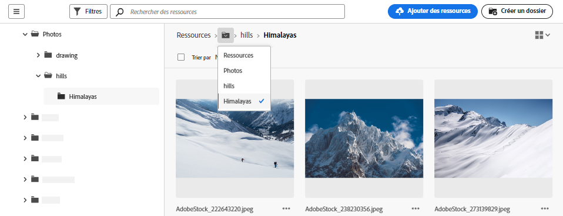
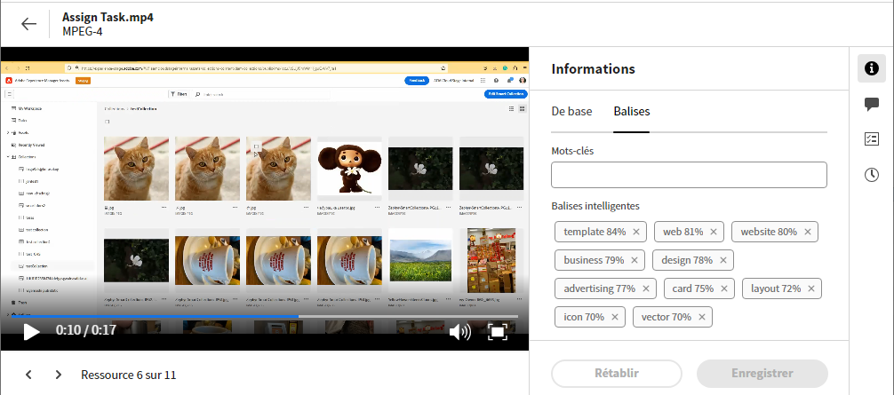

# Accédez aux fichiers et aux dossiers et affichez les ressources {#view-assets-and-details}

<!-- TBD: Give screenshots of all views with many assets. Zoom out to showcase how the thumbnails/tiles flow on the UI in different views. -->

<!-- TBD: The options in left sidebar may change. Shared with me and Shared by me are missing for now. Update this section as UI is updated. -->

## Comprendre l’interface utilisateur d’[!DNL Assets view]  {#understand-interface-navigation}

[!DNL Assets view] offre une interface utilisateur intuitive et conviviale. La clarté de son interface vous aide à rechercher et à mémoriser les ressources et les informations qui les concernent.

Lorsque vous vous connectez à [!DNL Assets view], l’interface suivante s’affiche.

![[!DNL Assets view]Interface utilisateur](assets/assets-view-interface.png)

**A** : barre latérale gauche pour parcourir le référentiel et accéder à d’autres options. **B** : afficher ou réduire la barre latérale gauche pour augmenter la zone d’affichage des ressources. **C** : filtrer les résultats de la recherche. **D** : sélectionner tout le contenu du dossier sélectionné. **E** : options de tri des ressources. **F** : zone de recherche. **G** : charger ou glisser-déposer des fichiers à l’aide du bouton `Add Assets`. **H** : créer un nouveau dossier. **I** : basculer entre différentes vues.

<!-- TBD: Need an embedded video here with narration. It has to be hosted on MPC to be embeddable. -->

## Parcourir et afficher les ressources et les dossiers {#browse-repository}

Vous pouvez accéder aux dossiers requis à partir de l’interface utilisateur principale ou de la barre latérale gauche. Experience Manager Assets affiche des aperçus visuels du contenu du dossier sur la miniature du dossier lors de la navigation ou de la recherche de contenu. Cela améliore la capacité de découverte des ressources disponibles dans le référentiel AEM Assets. Cette miniature de dossier vous permet de gagner du temps lors de la recherche de ressources spécifiques dans un dossier du référentiel AEM Assets.
Quand vous naviguez dans le dossier des ressources, vous pouvez utiliser l’interface pour afficher les miniatures et parcourir visuellement le référentiel ou bien afficher les détails pour trouver rapidement la ressource souhaitée. Les options disponibles dans la barre latérale gauche sont les suivantes :

* [Mon espace de travail](/help/assets/my-workspace-assets-view.md) : Assets comprend désormais un espace de travail personnalisable, composé de widgets permettant d’accéder facilement aux éléments clés de l’interface utilisateur d’Assets et aux informations qui vous intéressent le plus. Sur une page unique, bénéficiez d’un aperçu de vos tâches et d’un accès rapide aux principaux workflows. Grâce à un accès rapide et convivial aux menus pertinents, vous gagnez en efficacité et en vitesse de contenu.
* [Tâches](/help/assets/my-workspace-assets-view.md) : vous pouvez afficher les tâches qui vous sont affectées sous l’onglet **Mes tâches**. En revanche, les tâches que vous créez peuvent être affichées sous l’onglet **Tâches affectées**. En outre, les tâches que vous avez terminées se trouvent sous l’onglet **Tâches terminées**.
* [Ressources](/help/assets/manage-organize-assets-view.md) : liste de tous les dossiers auxquels vous avez accès sous la forme d’une arborescence.
* **Récemment consultés** : liste des ressources que vous avez récemment prévisualisées. [!DNL Assets view] affiche uniquement les ressources que vous prévisualisez. Cette fonctionnalité n’affiche pas les ressources que vous faites défiler en naviguant dans les fichiers ou dossiers du référentiel.
* [Collections](/help/assets/manage-collections-assets-view.md) : une collection est un ensemble de ressources, de dossiers ou d’autres collections dans la vue Assets d’Adobe Experience Manager. Vous pouvez utiliser des collections pour partager des ressources entre utilisateurs et utilisatrices. Contrairement aux dossiers, une collection peut comporter des ressources provenant de différents emplacements. Vous pouvez partager plusieurs collections avec un utilisateur ou une utilisatrice. Chaque collection contient des références aux ressources. L’intégrité du référentiel des ressources est préservée dans les collections.

* [Insights](/help/assets/manage-reports-assets-view.md#view-live-statistics) : dans [!DNL Assets view], vous pouvez afficher des insights en temps réel sur votre tableau de bord. La vue Assets vous permet d’afficher des données en temps réel pour votre environnement Assets à l’aide du tableau de bord Insights. Vous pouvez afficher les mesures d’événement en temps réel au cours des 30 derniers jours ou au cours des 12 derniers mois.
* **Corbeille** : répertorie les ressources supprimées du dossier racine **[!UICONTROL Ressources]**. Vous pouvez sélectionner une ressource dans le dossier Corbeille pour la restaurer à son emplacement d’origine ou la supprimer définitivement. Vous pouvez spécifier un mot-clé ou appliquer des filtres tels que le statut de la ressource, le type de fichier, le type MIME, la taille de l’image, la création, la modification et les dates d’expiration des ressources, ainsi que le filtrage par ressources ignorées par la personne actuelle. Vous pouvez également appliquer des filtres personnalisés pour rechercher les ressources appropriées dans le dossier Corbeille. Pour plus d’informations sur l’utilisation de filtres standard et personnalisés, consultez la section [Recherche de ressources dans la vue Assets](/help/assets/search-assets-view.md).
* **Paramètres** : vous pouvez configurer différentes options de la vue Assets à l’aide des **Paramètres**, par exemple, les formulaires de métadonnées, les rapports et la gestion de la taxonomie.

<!-- TBD: Not sure if we want to publish these right now. CC Libs are beta as per Greg.
* **Libraries**: Access to [!DNL Adobe Creative Cloud Team] (CCT) Libraries view. This view is visible only if the user is entitled to CCT Libraries.
-->

<!-- TBD: My Work Space shows task inbox and it is not visible on AEM Cloud Demos as of now. It is the source of truth server hence not documenting My Work Space option for now.
-->

Vous pouvez développer ou réduire la barre latérale gauche pour augmenter la zone d’affichage des ressources disponible.

Dans [!DNL Assets view], vous pouvez afficher les ressources, les dossiers et les résultats de recherche dans quatre types différents de mises en page.

*  [!UICONTROL Vue Liste]
*  [!UICONTROL Vue Grille]
*  [!UICONTROL Vue Galerie]
*  [!UICONTROL Vue Cascade]

Pour localiser une ressource, vous pouvez trier les ressources par ordre croissant ou décroissant de `Name`, `Relevancy`, `Size`, `Modified` et `Created`.

Pour naviguer dans un dossier, double-cliquez sur les miniatures du dossier ou sélectionnez le dossier dans la barre latérale gauche. Pour afficher les détails d’un dossier, sélectionnez-le et cliquez sur Détails dans la barre d’outils supérieure. Pour parcourir la hiérarchie de haut en bas, utilisez la barre latérale gauche ou le chemin de navigation en haut.

*Image : pour parcourir la hiérarchie, utilisez les chemins de navigation dans la partie supérieure ou la barre latérale gauche.*

## Aperçu des ressources {#preview-assets}

Avant d’utiliser, de partager ou de télécharger une ressource, vous pouvez l’afficher pour en connaître les détails. La fonction d’aperçu vous permet d’afficher non seulement les images, mais également quelques autres types de ressources pris en charge.

Pour prévisualiser une ressource, sélectionnez-la et cliquez sur  [!UICONTROL Détails] dans la barre d’outils supérieure. Vous pouvez non seulement afficher la ressource, mais également afficher le détail de ses métadonnées et effectuer d’autres actions.

**A** : revenez au dossier actuel ou au résultat de la recherche actuel dans le référentiel **B** : nom et format du fichier que vous prévisualisez **C** : affecter des tâches **D** : métadonnées avancées **E** : mots-clés et balises intelligentes **F** : commentaires et annotations **G** : afficher les tâches liées à la ressource sélectionnée **H** : [afficher et gérer les versions](/help/assets/manage-organize-assets-view.md#versions-of-assets)I **: afficher les rendus de l’image** J **: modifier l’image** K **** : afficher les rendus Dynamic Media, y compris le recadrage intelligent et les rendus avec fonctionnalités OpenAPI. **L** : métadonnées de base **M** : métadonnées avancées **N** : mots-clés et balises intelligentes **O** : passez à la ressource précédente ou suivante dans le dossier actif sans revenir au dossier **P** : aperçu plus détaillé. Zoom, plein écran et d’autres options.

Vous pouvez également prévisualiser des vidéos.

Si vous prévisualisez explicitement une ressource, [!DNL Assets view] l’affiche comme une ressource récemment affichée.

<!-- TBD: Describe the options.

Explicitly previewed assets are displayed as recently viewed assets. Give screenshot of this.
Other use cases after previewing.
-->

## Étapes suivantes {#next-steps}

* Faites des commentaires sur le produit en utilisant l’option [!UICONTROL Commentaires] disponible dans l’interface utilisateur de la vue Assets

* Faites des commentaires sur la documentation en utilisant l’option [!UICONTROL Modifier cette page]  ou [!UICONTROL Enregistrer un problème]  disponible dans la barre latérale droite.

* Contactez l’[assistance clientèle](https://experienceleague.adobe.com/fr?support-solution=General#support).

>[!MORELIKETHIS]
>
>* [Afficher les versions d’une ressource](/help/assets/manage-organize-assets-view.md#view-versions).
