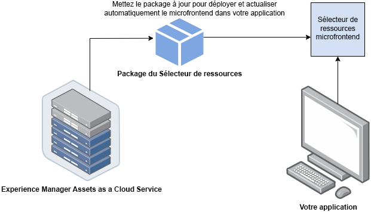
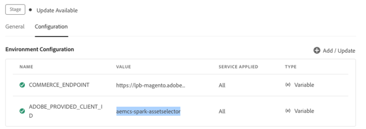
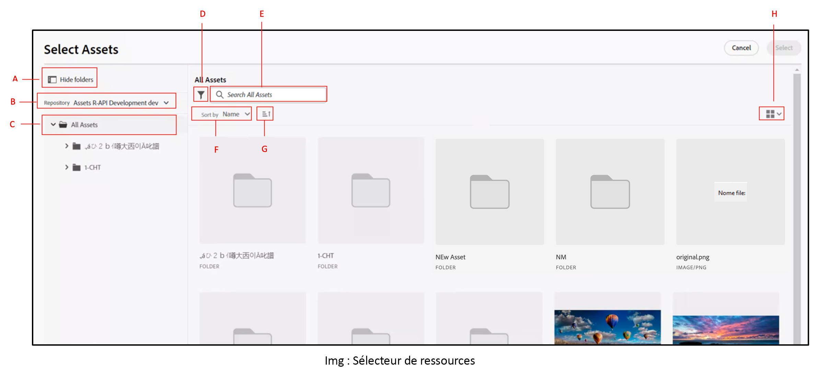
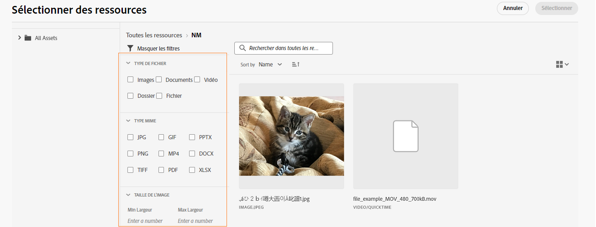

# Sélecteur de ressources micro front-end {#Overview}

<table>
    <tr>
        <td>
            <sup style= "background-color:#008000; color:#FFFFFF; font-weight:bold"><i>Nouveau</i></sup> <a href="/help/assets/dynamic-media/dm-prime-ultimate.md"><b>Dynamic Media Prime et Ultimate</b></a>
        </td>
        <td>
            <sup style= "background-color:#008000; color:#FFFFFF; font-weight:bold"><i>Nouveau</i></sup> <a href="/help/assets/assets-ultimate-overview.md"><b>AEM Assets Ultimate</b></a>
        </td>
        <td>
            <sup style= "background-color:#008000; color:#FFFFFF; font-weight:bold"><i>Nouveau</i></sup> <a href="/help/assets/integrate-aem-assets-edge-delivery-services.md"><b>Intégration d’AEM Assets à Edge Delivery Services</b></a>
        </td>
        <td>
            <sup style= "background-color:#008000; color:#FFFFFF; font-weight:bold"><i>Nouveau</i></sup> <a href="/help/assets/aem-assets-view-ui-extensibility.md"><b>Extensibilité de l’IU</b></a>
        </td>
          <td>
            <sup style= "background-color:#008000; color:#FFFFFF; font-weight:bold"><i>Nouveau</i></sup> <a href="/help/assets/dynamic-media/enable-dynamic-media-prime-and-ultimate.md"><b>Activer Dynamic Media Prime et Ultimate</b></a>
        </td>
    </tr>
    <tr>
        <td>
            <a href="/help/assets/search-best-practices.md"><b>Bonnes pratiques de recherche</b></a>
        </td>
        <td>
            <a href="/help/assets/metadata-best-practices.md"><b>Bonnes pratiques relatives aux métadonnées</b></a>
        </td>
        <td>
            <a href="/help/assets/product-overview.md"><b>Hub de contenus</b></a>
        </td>
        <td>
            <a href="/help/assets/dynamic-media-open-apis-overview.md"><b>Fonctionnalités Dynamic Media avec OpenAPI</b></a>
        </td>
        <td>
            <a href="https://developer.adobe.com/experience-cloud/experience-manager-apis/"><b>Documentation de développement pour AEM Assets</b></a>
        </td>
    </tr>
</table>

Le sélecteur de ressources micro front-end fournit une interface utilisateur qui s’intègre facilement au référentiel [!DNL Experience Manager Assets] afin que vous puissiez parcourir ou rechercher des ressources numériques disponibles dans le référentiel et les utiliser dans votre expérience de création d’applications.

L’interface utilisateur micro front-end est mise à disposition dans votre expérience de l’application à l’aide du package Sélecteur de ressources. Toutes les mises à jour du package sont automatiquement importées et le dernier sélecteur de ressources déployé est automatiquement téléchargé dans votre application.



Le sélecteur de ressources offre de nombreux avantages, notamment :

* Facile à intégrer avec n’importe quelle application [Adobe](/help/assets/integrate-asset-selector-adobe-app.md) ou [autre qu’Adobe](/help/assets/integrate-asset-selector-non-adobe-app.md) utilisant la bibliothèque JavaScript Vanilla.
* Facile à gérer, car les mises à jour du package Sélecteur de ressources sont automatiquement déployées vers le sélecteur de ressources disponible pour votre application. Aucune mise à jour n’est requise dans votre application pour télécharger les dernières modifications.
* Facile à personnaliser, car il existe des propriétés qui contrôlent l’affichage du sélecteur de ressources dans votre application.
* Recherche de texte intégral, filtres prêts à l’emploi et filtres personnalisés pour accéder rapidement aux ressources à utiliser dans l’expérience de création.
* Possibilité de changer de référentiels au sein d’une organisation IMS pour la sélection de ressources.
* Possibilité de trier les ressources par nom, dimension et taille, et de les afficher en mode Liste, Grille, Galerie ou Cascade.

<!--Perform the following tasks to integrate and use Asset Selector with your [!DNL Experience Manager Assets] repository:

1. [Install Asset Selector](#installation)
2. [Integrate Asset Selector using Vanilla JS](#integration-using-vanilla-js)
3. [Use Asset Selector](#using-asset-selector)
-->

<!--
## Setting up Asset Selector {#asset-selector-setup}


-->

## Prérequis{#prereqs}

Vous devez vous assurer que les méthodes de communication suivantes sont disponibles :

* L’application hôte s’exécute sur HTTPS.
* Vous ne pouvez pas exécuter l’application sur `localhost`. Si vous souhaitez intégrer le sélecteur de ressources sur votre ordinateur local, vous devez créer un domaine personnalisé, par exemple `[https://<your_campany>.localhost.com:<port_number>]`, et l’ajouter dans la `redirectUrl list`.
* Vous pouvez configurer et ajouter clientID dans la variable d’environnement AEM Cloud Service avec les `imsClientId` correspondantes.
<!--* You can configure and add `ADOBE_PROVIDED_CLIENT_ID` into the AEM Cloud Service environment variable with the respective `imsClientId`.
-->
* La liste des portées IMS doit être définie dans la configuration de l’environnement.
* L’URL de l’application se trouve dans la liste autorisée d’URL de redirection du client IMS.
* Le flux de connexion IMS est configuré et rendu à l’aide d’une fenêtre contextuelle sur le navigateur web. Par conséquent, les fenêtres contextuelles doivent être activées ou autorisées sur le navigateur cible.

Utilisez les conditions préalables ci-dessus si vous avez besoin du workflow d’authentification IMS du sélecteur de ressources. Si votre authentification est déjà effective avec le workflow IMS, vous pouvez également ajouter les informations IMS à la place.

**Voir plus**

* [Intégrer le sélecteur de ressources à une application Adobe](/help/assets/integrate-asset-selector-adobe-app.md)
* [Intégrer le sélecteur de ressources à une application autre qu’Adobe](/help/assets/integrate-asset-selector-non-adobe-app.md)
* [Intégrer des API ouvertes Dynamic Media du sélecteur de ressources](/help/assets/integrate-asset-selector-dynamic-media-open-api.md)


>[!IMPORTANT]
>
> Ce référentiel est destiné à servir de documentation supplémentaire décrivant les API disponibles et les exemples d’utilisation pour l’intégration du sélecteur de ressources. Avant d’essayer d’installer ou d’utiliser le sélecteur de ressources, assurez-vous que votre organisation a reçu l’accès au sélecteur de ressources dans le cadre du profil Experience Manager Assets as a Cloud Service. Si vous n’avez pas reçu les privilèges d’accès, vous ne pouvez pas intégrer ni utiliser ces composants. Pour demander l’approvisionnement, l’administrateur ou l’administratrice de votre programme doit envoyer à Admin Console un ticket d’assistance portant la mention P2 et inclure les informations suivantes :
>
>* Noms de domaine dans lesquels l’application d’intégration est hébergée.
>* Après l’approvisionnement, votre organisation reçoit `imsClientId`, `imsScope` et une `redirectUrl` correspondant aux environnements demandés qui sont essentiels à la configuration du sélecteur de ressources. Sans ces propriétés valides, vous ne pouvez pas exécuter les étapes d’installation.

## Installation {#installation}

Les sélecteurs de destination sont disponibles via le réseau CDN ESM (par exemple, [esm.sh](https://esm.sh/)/[skypack](https://www.skypack.dev/)) et la version [UMD](https://github.com/umdjs/umd).

Dans les navigateurs utilisant la **version UMD** (recommandé) :

```
<script src="https://experience.adobe.com/solutions/CQ-assets-selectors/static-assets/resources/assets-selectors.js"></script>

<script>
  const { renderAssetSelector } = PureJSSelectors;
</script>
```

Dans les navigateurs avec la prise en charge `import maps` à l’aide de la **version du réseau CDN ESM** :

```
<script type="module">
  import { AssetSelector } from 'https://experience.adobe.com/solutions/CQ-assets-selectors/static-assets/resources/@assets/selectors/index.js'
</script>
```

Dans la fédération de modules Deno/Webpack à l’aide de la **version du réseau CDN ESM** :

```
import { AssetSelector } from 'https://experience.adobe.com/solutions/CQ-assets-selectors/static-assets/resources/@assets/selectors/index.js'
```

## Utilisation du sélecteur de ressources {#using-asset-selector}

Une fois que le sélecteur de ressources est configuré et que vous êtes authentifié(e) pour l’utiliser avec votre application [!DNL Adobe Experience Manager] as a [!DNL Cloud Service], vous pouvez sélectionner des ressources ou effectuer d’autres opérations pour rechercher vos ressources dans le référentiel.



* **A** : [masquer/afficher le panneau](#hide-show-panel)
* **B** : [sélecteur de référentiels](#repository-switcher)
* **C** : [ressources](#repository)
* **D** : [filtres](#filters)
* **E** : [barre de recherche](#search-bar)
* **F** : [tri](#sorting)
* **G** : [tri par ordre croissant ou décroissant](#sorting)
* **H** : [vue](#types-of-view)

### Masquer/Afficher le panneau {#hide-show-panel}

Pour masquer les dossiers dans le volet de navigation de gauche, cliquez sur l’icône **[!UICONTROL Masquer les dossiers]**. Pour annuler les modifications, cliquez à nouveau sur l’icône **[!UICONTROL Masquer les dossiers]**.

### Sélecteur de référentiels {#repository-switcher}

Le sélecteur de ressources vous permet également de passer d’un référentiel à l’autre lors de la sélection de ressources. Vous pouvez sélectionner le référentiel de votre choix dans la liste déroulante disponible dans le panneau de gauche. Les options de référentiel disponibles dans la liste déroulante reposent sur la propriété `repositoryId` définie dans le fichier `index.html`. Cela dépend des environnements de l’organisation IMS sélectionnée à laquelle accède l’utilisateur ou l’utilisatrice connectés. Les clientes et clients peuvent transmettre une préférence `repositoryID` et, dans ce cas, le sélecteur de ressources arrête le rendu du sélecteur de référentiels et effectue uniquement le rendu des ressources à partir du référentiel donné.

### Référentiel de ressources

Il s’agit d’une collection de dossiers de ressources que vous pouvez utiliser pour effectuer des opérations.

### Filtres prêts à l’emploi {#filters}

Le sélecteur de ressources fournit également des options de filtres prêts à l’emploi pour affiner vos résultats de recherche. Les filtres suivants sont disponibles :

* **[!UICONTROL Statut] :** inclut le statut actuel de la ressource parmi `all`, `approved`, `rejected` ou `no status`.
* **[!UICONTROL Type de fichier] :** comprend `folder`, `file`, `images`, `documents` ou `video`.
* **[!UICONTROL Statut d’expiration] :** mentionne les ressources en fonction de leur durée d’expiration. Vous pouvez cocher la case `[!UICONTROL Expired]` pour filtrer les ressources expirées ou définir la `[!UICONTROL Expiration Duration]` d’une ressource pour afficher les ressources en fonction de leur durée d’expiration. Lorsqu’une ressource a expiré ou est sur le point d’expirer, un badge s’affiche pour vous informer. De plus, vous pouvez contrôler si vous souhaitez autoriser l’utilisation (ou le glisser-déposer) d’une ressource expirée. Pour en savoir plus sur la [personnalisation des ressources expirées](/help/assets/asset-selector-customization.md#customize-expired-assets). Par défaut, le badge **Va bientôt expirer** s’affiche pour les ressources qui expirent dans les 30 prochains jours. Cependant, vous pouvez configurer l’expiration à l’aide de la propriété `expirationDate`.

  >[!TIP]
  >
  > Si vous souhaitez afficher ou filtrer les ressources en fonction de leur date d’expiration, mentionnez la période dans le champ `[!UICONTROL Expiration Duration]`. Il affiche les ressources qui comportent le badge **Va bientôt expirer**.

* **[!UICONTROL Type MIME] :** comprend `JPG`, `GIF`, `PPTX`, `PNG`, `MP4`, `DOCX`, `TIFF`, `PDF`, `XLSX`.
* **[!UICONTROL Taille de l’image] :** inclut la largeur minimale et maximale, et la hauteur minimale et maximale de l’image.

  

### Recherche personnalisée

Outre la recherche en texte intégral, le sélecteur de ressources vous permet de rechercher des ressources dans des fichiers à l’aide d’une recherche personnalisée. Vous pouvez utiliser des filtres de recherche personnalisés en modes Modal et Rail.


Vous pouvez également créer un filtre de recherche par défaut pour enregistrer les champs que vous recherchez fréquemment et les utiliser ultérieurement. Pour créer une recherche personnalisée de vos ressources, vous pouvez utiliser la propriété `filterSchema`.

### Barre de recherche {#search-bar}

Le sélecteur de ressources vous permet d’effectuer une recherche en texte intégral des ressources dans le référentiel sélectionné. Par exemple, si vous saisissez le mot-clé `wave` dans la barre de recherche, toutes les ressources qui contiennent le mot-clé `wave` dans l’une des propriétés de métadonnées s’affichent.

### Tri {#sorting}

Vous pouvez trier les ressources du sélecteur de ressources selon le nom, les dimensions ou la taille d’une ressource. Vous pouvez également trier les ressources par ordre croissant ou décroissant.

### Types de vues {#types-of-view}

Le sélecteur de ressources vous permet d’afficher la ressource dans quatre vues différentes :

*  [!UICONTROL **Vue Liste**] : la vue Liste affiche les fichiers et dossiers à faire défiler dans une seule colonne.
*  [!UICONTROL **Vue Grille**] : la vue Grille affiche les fichiers et dossiers à faire défiler dans une grille de lignes et de colonnes.
*  [!UICONTROL **Vue Galerie**] : la vue Galerie affiche les fichiers ou les dossiers dans une liste horizontale verrouillée au milieu.
*  [!UICONTROL **Vue** Cascade] : la vue Cascade affiche les fichiers ou les dossiers sous la forme d’un pont.

## En savoir plus sur les principales fonctionnalités {#key-capabilities-asset-selector}

<table>
<tr>
    <td>
        <br/>
 <a href="integrate-asset-selector.md">Intégration du sélecteur de ressources</a>
        <p>
        <em>Découvrez les différentes fonctionnalités permettant d’intégrer le sélecteur de ressources à plusieurs applications.
        </p>
     </td>
    <td>
        <br/>
 <a href="integrate-asset-selector.md">Intégration du sélecteur de ressources à des applications Adobe</a>
        <p>
        <em>Découvrez comment intégrer le sélecteur de ressources à diverses applications Adobe.</em>
        </p>
    </td>
    <td>
        <br/>
 <a href="integrate-asset-selector.md">Intégration du sélecteur de ressources à des applications tierces</a>
        <p>
        <em>Augmentez les possibilités permettant d’intégrer le sélecteur de ressources à des applications autres qu’Adobe.</em>
        </p>
    </td>
    <td>
        <br/>
 <a href="integrate-asset-selector.md">Intégration du sélecteur de ressources aux API Dynamic Media OpenAPI</a>
        <p>
        <em>Découvrez comment intégrer le sélecteur de ressources aux API Dynamic Media OpenAPI.</em>
        </p>
     </td>
     <td>
        <br/>
        <a href="asset-selector-customization.md">Propriétés du sélecteur de ressources</a>
        <p>
        <em>Découvrez les principes de base de la personnalisation de composants du sélecteur de ressources, tels que les filtres, la sélection de ressources, les ressources expirées, etc. </em>
        </p>
    </td>
</tr>
<tr>
    <td>
        <br/>
 <a href="asset-selector-customization.md">Exemples du sélecteur de ressources</a>
        <p>
        <em>Utilisez les propriétés de manière pratique. </em>
        </p>
    </td>
    <td>
        <br/>
 <a href="asset-selector-customization.md">Personnalisation du sélecteur de ressources</a>
        <p>
        <em>Configurez et personnalisez des composants du sélecteur de ressources en fonction de votre usage. </em>
        </p>
    </td>
    <td>
        <br/>
 <a href="asset-selector-upload.md">Chargement dans le sélecteur de ressources</a>
        <p>
        <em>Découvrez comment charger des fichiers ou des dossiers dans le sélecteur de ressources à partir de votre système de fichiers local ou tiers. </em>
        </p>
    </td>
     <td>
        <br/>
 <a href="asset-selector-collections.md">Collections du sélecteur de ressources</a>
        <p>
        <em>Découvrez comment utiliser des collections dans le sélecteur de ressources à l’aide du référentiel Experience Manager. </em>
        </p>
    </td>
    <td>
    </td>
</tr>
</table>

>[!MORELIKETHIS]
>
>* [Personnalisation du sélecteur de ressources](/help/assets/asset-selector-customization.md)
>* [Intégration du sélecteur de ressources à diverses applications](/help/assets/integrate-asset-selector.md)
>* [Propriétés du sélecteur de ressources](/help/assets/asset-selector-properties.md)
>* [Intégration du sélecteur de ressources à Dynamic Media avec fonctionnalités OpenAPI](/help/assets/integrate-asset-selector-dynamic-media-open-api.md)
