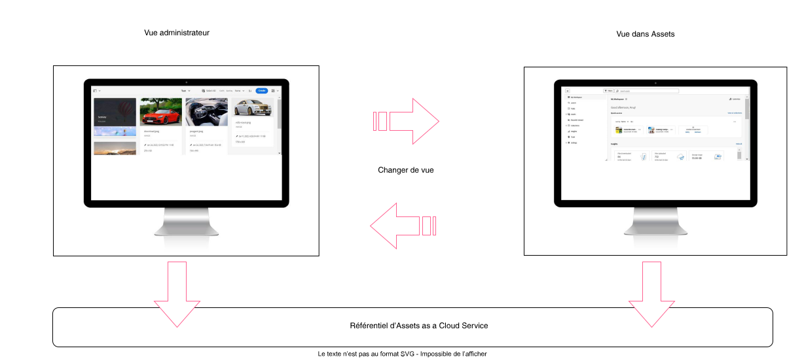

# Présentation d’Assets as a Cloud Service pour la gestion des ressources numériques dans AEM {#assets-as-cloud-service-digital-asset-management-aem}

AEM Assets as a Cloud Service offre une solution PaaS native cloud permettant aux entreprises non seulement d’effectuer leurs opérations de gestion des ressources numériques et Dynamic Media, mais également d’utiliser des fonctionnalités intelligentes de nouvelle génération, telles que l’IA et le ML. Et tout ceci depuis un système qui est toujours à jour, toujours disponible et qui apprend en permanence.

Adobe propose des solutions de gestion des ressources numériques (DAM) robustes qui vous permettent de tirer le meilleur parti de vos ressources numériques. Adobe Experience Manager Assets comporte deux expériences distinctes qui utilisent le même référentiel Cloud Services pour répondre à vos besoins. Pour plus d’informations sur les expériences basées sur les personas pour AEM Assets, consultez [Expériences basées sur les personas disponibles pour la gestion des ressources numériques](#persona-based-experiences).

Pour plus d’informations sur les offres AEM Assets Ultimate et AEM Assets Prime, consultez [Assets as a Cloud Service Ultimate](/help/assets/assets-ultimate-overview.md) et [Assets as a Cloud Service Prime](/help/assets/assets-prime.md).

Voici quelques-unes des principales fonctionnalités de la gestion des ressources numériques d’Adobe :

>[!BEGINTABS]

>[!TAB Ingestion]

## Ingestion de ressources {#asset-ingestion}

Utilisez la fonctionnalité d’importation en masse pour importer directement un grand nombre de ressources à partir d’une source de données, telle qu’Azure, AWS, Google Cloud, Dropbox et OneDrive, vers Assets as a Cloud Service.

Vous pouvez effectuer l’opération d’importation en masse dans la vue Administration ou dans la vue Assets. La vue Assets fournit plus d’options de source de données que la vue Administration.

Outre l’interface d’utilisation du navigateur web, Experience Manager prend en charge d’autres clients pour ordinateur de bureau. Ils permettent également de charger du contenu sans devoir passer par le navigateur web.

* Adobe Asset Link vous permet d’accéder aux ressources d’Experience Manager dans les applications de bureau Adobe Photoshop, Adobe Illustrator et Adobe InDesign. Vous pouvez charger le document ouvert dans Experience Manager. Vous pouvez le faire directement via l’interface d’Adobe Asset Link qui se trouve dans ces applications de bureau.

* L’application de bureau Experience Manager simplifie l’utilisation des ressources sur l’ordinateur de bureau, indépendamment de leur type de fichier ou de l’application native qui les utilise. Il est utile de charger des fichiers dans des hiérarchies de dossiers imbriqués à partir de votre système de fichiers local, car le chargement par le navigateur ne prend en charge que les listes de fichiers plats.

Utilisez ces liens pour accéder à la documentation détaillée sur ces outils d’ingestion de ressources :

<table>
<td>
   
   

      <a href="/help/assets/bulk-import-assets-view.md">
      <strong>Utiliser l’outil d’importation en masse</strong>
      </a>
   

   

      <em>Découvrez comment importer directement un grand nombre de ressources à partir d’une source de données.</em>
   

</td>

<td>
   
   

      <a href="https://experienceleague.adobe.com/fr/docs/experience-manager-desktop-app/using/get-started">
<strong>Utiliser l’application de bureau AEM</strong>
</a>
   

   

      <em>Découvrez comment utiliser l’application de bureau AEM pour charger des fichiers dans des hiérarchies de dossiers imbriqués à partir de votre système de fichiers local.</em>
   

</td>
<td>
   
   

      <a href="https://helpx.adobe.com/enterprise/using/adobe-asset-link.html">
      <strong>Utiliser Adobe Asset Link</strong>
      </a>
   

   

      <em>Découvrez comment charger des ressources vers Experience Manager à l’aide d’applications Creative Cloud.</em>
   

</td>
</table>

>[!TAB Fonctionnalités basées sur l’IA]

**Balises intelligentes** : les balises intelligentes utilisent le cadre d’intelligence artificielle d’Adobe AI pour entraîner son algorithme de reconnaissance d’images par rapport à votre structure de balises et de votre taxonomie métier. Cette intelligence de contenu est ensuite utilisée pour appliquer les balises pertinentes sur un ensemble de ressources différentes. Par défaut, AEM applique automatiquement les balises intelligentes aux ressources chargées.

**Balisage et recherche intelligents basés sur les couleurs** : AEM Assets utilise les fonctionnalités d’Adobe AI pour faire la distinction entre les couleurs d’une image et appliquer automatiquement ces caractéristiques sous forme de balises lors de l’ingestion. Ces balises permettent d’améliorer l’expérience de recherche en fonction de la composition des couleurs de l’image.

**Métadonnées générées par l’IA** : AEM Assets utilise l’IA pour générer automatiquement des métadonnées, y compris le titre, la description et les mots-clés. Ces champs générés par l’IA améliorent la précision des métadonnées, ce qui facilite la recherche, la classification et la recommandation des ressources. Non seulement cette approche améliore l’efficacité en éliminant le balisage manuel, mais elle garantit également la cohérence et l’évolutivité sur de gros volumes de contenu numérique.

**Renommage de ressources en bloc optimisé par l’IA** : [la vue Assets vous permet de renommer plusieurs ressources en une seule fois à l’aide de l’intelligence artificielle](/help/assets/bulk-rename-assets-view.md). Vous pouvez sélectionner plusieurs fichiers à la fois et les renommer tous ensemble. Voici quelques exemples de prompts de renommage conversationnels : *Renomme tous les fichiers en « mon-fichier » et ajouter un nombre incrémentiel* et *Ajoute le préfixe 001, 002, etc. aux fichiers et traduis en anglais*.

<table>
<td>
   
   

      <a href="/help/assets/smart-tags.md">
<strong>Ajouter des balises intelligentes d’IA aux ressources</strong>
</a>
   

   

      <em>Découvrez comment appliquer automatiquement des balises intelligentes aux ressources chargées.</em>
   

</td>

<td>
   
   

      <a href="/help/assets/manage-notifications-assets-view.md">
<strong>Ajouter des balises intelligentes basées sur la couleur</strong>
</a>
   

   

      <em>Découvrez comment appliquer automatiquement des balises basées sur la couleur lors de l’ingestion.</em>
   

</td>
<td>
   
   

      <a href="/help/assets/metadata-assets-view.md">
      <strong>Métadonnées générées par l’IA</strong>
      </a>
   

   

      <em>Utilisez l’IA pour générer des métadonnées de ressource, telles que le titre et la description.</em>
   

</td>
</table>

**Recherche contextuelle** : AEM Assets vous permet de rechercher des ressources disponibles dans le référentiel en définissant des prompts textuels. Experience Manager Assets transforme automatiquement les prompts textuels en filtres de recherche et affiche les résultats de la recherche. Vous pouvez afficher et modifier des filtres automatiques à l’aide du volet Filtres pour affiner davantage les résultats de la recherche. Voici quelques exemples de prompts textuels conversationnels :

* *Images d’au moins 200 pixels de hauteur et 100 pixels de largeur avec plage et ciel clair* et
* *J’ai besoin d’images de ciel bleu de 1 500 et 2 500 pixels de hauteur, créées au cours du dernier mois et qui ne sont pas expirées ni approuvées*.

**Générer des ressources à l’aide d’Adobe Firefly dans AEM** : AEM Assets vous permet de générer une ressource en temps réel à l’aide d’Adobe Firefly si votre requête de recherche ne renvoie aucun résultat. AEM Assets vous permet ensuite de charger l’image générée dans le référentiel AEM Assets depuis l’interface d’utilisation d’AEM Assets.

**Intégration à Adobe Express** : AEM Assets s’intègre de manière native à Adobe Express, ce qui vous permet d’accéder directement aux ressources stockées dans AEM Assets depuis l’interface d’utilisation d’Adobe Express. Vous pouvez également utiliser l’intelligence artificielle d’Adobe Firefly dans Express pour générer des images à l’aide de prompts textuels simples et les placer sur la zone de travail Express. Vous pouvez ensuite enregistrer le contenu nouveau ou modifié dans un référentiel AEM Assets.

<table>
<td>
   
   

      <a href="/help/assets/search-assets-view.md#contextual-search">
<strong>Recherche contextuelle</strong>
</a>
   

   

      <em>Découvrez comment rechercher des ressources à l’aide de prompts de texte simples.</em>
   

</td>

<td>
   
   

      <a href="/help/assets/search-assets-view.md#search-firefly">
      <strong>Générer des ressources à l’aide d’Adobe Firefly</strong>
      </a>
   

   

      <em>Générez des ressources en temps réel à l’aide d’Adobe Firefly.</em>
   

</td>
<td>
   
   

      <a href="/help/assets/native-integration-adobe-express.md">
      <strong>Intégration à Adobe Express</strong>
      </a>
   

   

      <em>Utilisez des fonctionnalités d’IA d’Adobe Express dans l’interface d’utilisation d’AEM Assets.</em>
   

</td>
</table>

**Imagerie intelligente** : l’imagerie intelligente offre de meilleures performances de diffusion des ressources d’image en optimisant automatiquement le format et la taille de fichier d’une image en fonction des fonctionnalités du navigateur d’un client ou d’une cliente. Elle fonctionne avec vos paramètres d’image prédéfinis existants et utilise des informations lors de la diffusion. Ces informations permettent de réduire davantage la taille du fichier image en fonction du navigateur et de la vitesse de connexion du réseau.

**Recadrage intelligent** : une fonctionnalité d’Adobe AI permettant de détecter automatiquement le point focal d’une image ou d’une vidéo et de le recadrer pour le gérer. Il capture le point ciblé prévu, quelle que soit la taille de l’écran, élimine ainsi les tâches manuelles fastidieuses et fournit des images et des vidéos à chargement rapide et de haute qualité qui s’affichent correctement sur n’importe quel appareil ou écran.

**Sous-titres vidéo générés par l’IA** : les sous-titres vidéo générés par l’IA dans Adobe Dynamic Media utilisent l’intelligence artificielle pour générer automatiquement des sous-titres pour le contenu vidéo. Cette fonctionnalité est conçue pour améliorer l’accessibilité et l’expérience d’utilisation en fournissant des sous-titres précis. Les sous-titres sont générés à partir de l’audio original, de pistes audio supplémentaires ou de sous-titres supplémentaires fournis dans l’onglet `Captions and Audio` de la page des propriétés vidéo. Avec une prise en charge de plus de 60 langues, les sous-titres peuvent être examinés et prévisualisés avant de publier la vidéo.
<table>
<td>
   
   

      <a href="/help/assets/dynamic-media/imaging-faq.md">
      <strong>Imagerie intelligente</strong>
      </a>
   

   

      <em>Optimisez le format et la taille de fichier d’une image en fonction des fonctionnalités du navigateur et de la vitesse du réseau d’un utilisateur ou d’une utilisatrice.</em>
   

</td>

<td>
   
   

      <a href="https://experienceleague.adobe.com/fr/docs/experience-manager-learn/assets/dynamic-media/video/dynamic-media-smart-crop-video">
<strong>Recadrage intelligent</strong>
</a>
   

   

      <em>Utilisez l’IA pour détecter automatiquement le point focal d’une image ou d’une vidéo et le recadrer pour pouvoir le gérer.</em>
   

</td>
<td>
   
   

      <a href="/help/assets/dynamic-media/video.md">
      <strong>Sous-titres vidéo générés par l’IA</strong>
      </a>
   

   

      <em>Utilisez l’intelligence artificielle pour générer automatiquement des sous-titres pour le contenu vidéo.</em>
   

</td>
</table>

>[!TAB Découverte]

## Visibilité des ressources {#asset-discovery}

Après avoir importé vos ressources dans AEM Assets, il est difficile de trouver rapidement les ressources appropriées au sein d’une collection aussi volumineuse.

AEM Assets offre des fonctionnalités qui vous aident à trouver rapidement la ressource appropriée. Ces fonctionnalités incluent le balisage généré par l’IA (balises intelligentes), les métadonnées personnalisées et les fonctionnalités de recherche améliorées.

**Gestion des métadonnées** : les métadonnées constituent l’élément le plus important lorsque vous débutez votre parcours de gestion des ressources. La gestion des métadonnées échappe complètement au contrôle des administrateurs et des administratrices une fois les ressources distribuées aux utilisateurs et aux utilisatrices. Des métadonnées de ressources efficaces permettent d’améliorer la recherche, qui est le but ultime de tout outil de gestion des ressources numériques.

**Formulaires de métadonnées** : Assets as a Cloud Service fournit par défaut de nombreux champs de métadonnées standard. Si vous avez des besoins supplémentaires en matière de métadonnées et de davantage de champs de métadonnées pour ajouter des métadonnées spécifiques à votre entreprise. Les formulaires de métadonnées permettent aux entreprises d’ajouter des champs de métadonnées personnalisés à la page Détails d’une ressource. Les métadonnées spécifiques à l’entreprise améliorent la gouvernance et la découverte de ses ressources. Vous pouvez créer des formulaires entièrement ou réutiliser un formulaire existant.

<table>
<td>
   
   

      <a href="/help/assets/metadata-assets-view.md">
      <strong>Gérer les métadonnées dans la vue Ressources</strong>
      </a>
   

   

      <em>Découvrez comment gérer les métadonnées et les formulaires de métadonnées à l’aide de la vue Ressources.</em>
   

</td>

<td>
   
   

      <a href="https://experienceleaguecommunities.adobe.com/t5/adobe-experience-manager-blogs/how-to-manage-metadata-before-and-after-migrating-to-aem-assets/ba-p/744298">
      <strong>Bonnes pratiques de gestion des métadonnées</strong>
      </a>
   

   

      <em>Découvrez comment gérer les métadonnées avant et après la migration de vos ressources vers AEM.</em>
   

</td>
<td>
   
   

      <a href="/help/assets/manage-metadata.md">
      <strong>Gérer les métadonnées dans la vue Administration</strong>
      </a>
   

   

      <em>Découvrez comment gérer les métadonnées et les formulaires de métadonnées à l’aide de la vue Administration.</em>
   

</td>
</table>

**Balises intelligentes** : les balises intelligentes utilisent le cadre d’intelligence artificielle d’Adobe AI pour entraîner son algorithme de reconnaissance d’images par rapport à votre structure de balises et de votre taxonomie métier. Cette intelligence de contenu est ensuite utilisée pour appliquer les balises pertinentes sur un ensemble de ressources différentes. Par défaut, AEM applique automatiquement les balises intelligentes aux ressources chargées.

**Recherche de ressources** : une fois les métadonnées appropriées en place, AEM Assets vous permet d’effectuer une recherche à l’aide de divers opérateurs, caractères génériques, requêtes avancées et filtres personnalisés.

**Recherche contextuelle** : AEM Assets inclut également une fonctionnalité de recherche contextuelle, qui vous permet de rechercher les ressources disponibles dans le référentiel en définissant des invites textuelles. Experience Manager Assets transforme automatiquement les prompts textuels en filtres de recherche et affiche les résultats de la recherche. Vous pouvez afficher et modifier des filtres automatiques à l’aide du volet Filtres pour affiner davantage les résultats de la recherche.

<table>
<td>
   
   

      <a href="/help/assets/smart-tags.md">
      <strong>Ajouter des balises intelligentes aux ressources</strong>
      </a>
   

   

      <em>Découvrez comment appliquer automatiquement des balises intelligentes aux ressources chargées.</em>
   

</td>

<td>
   
   

      <a href="/help/assets/search-assets-view.md">
      <strong>Rechercher des ressources dans la vue Ressources</strong>
      </a>
   

   

      <em>Découvrez comment utiliser efficacement la recherche contextuelle et d’autres fonctionnalités de recherche dans la vue Assets.</em>
   

</td>
<td>
   
   

      <a href="/help/assets/search-best-practices.md">
      <strong>Bonnes pratiques de recherche</strong>
      </a>
   

   

      <em>Découvrez divers scénarios pour aider les utilisateurs et utilisatrices d’AEM à effectuer une recherche basique ou avancée.</em>
   

</td>
</table>

>[!TAB  Gouvernance ]

## Gestion et gouvernance des ressources {#asset-management-governance}

Une fois que vous avez chargé vos ressources dans AEM Assets et configuré leurs métadonnées pour une meilleure visibilité, vous pouvez effectuer diverses tâches de gestion des ressources numériques à l’aide de l’interface conviviale de la vue Ressources.

**Tâches de gestion des ressources** : certaines des tâches de base comprennent les opérations de recherche, de téléchargement, de déplacement, de copie, de renommage, de suppression, de mise à jour et de modification.

Vous pouvez également gérer les versions des ressources et définir leur statut et leur délai d’expiration.

**Mon espace de travail** : la vue Assets comprend également un espace de travail personnalisable qui fournit des widgets. Ces widgets permettent d’accéder facilement aux éléments clés de l’interface d’utilisation d’Assets et aux informations qui vous intéressent le plus. Sur une page unique, bénéficiez d’une vue d’ensemble de vos tâches et d’un accès rapide aux principaux workflows.

**Identifiants de contenu** : les identifiants de contenu sont une autre fonctionnalité puissante prise en charge par AEM Assets. Les marques sont plus préoccupées que jamais par la transparence du contenu, la déclaration d’utilisation de l’IA et la prévention de l’altération des ressources. Le Content Authenticity Initiative (CAI) d’Adobe crée des outils conformes à la norme technique C2PA (Coalition for Content Provenance and Authenticity). Les identifiants de contenu, qui sont un nouveau type de métadonnées chiffrées et inviolables, peuvent aider les visiteurs à comprendre la traçabilité du contenu et garantir l’intégrité des ressources de la marque. Ils peuvent inclure un large éventail de données de provenance qui fournissent des informations dans l’historique d’une ressource numérique.

<table>
<td>
   
   

      <a href="/help/assets/manage-organize-assets-view.md">
      <strong>Tâches de gestion des ressources</strong>
      </a>
   

   

      <em>Découvrez comment effectuer certaines tâches de gestion des ressources de base et avancées.</em>
   

</td>

<td>
   
   

      <a href="/help/assets/my-workspace-assets-view.md">
      <strong>Mon espace de travail</strong>
      </a>
   

   

      <em>Découvrez comment utiliser Mon espace de travail pour accéder rapidement aux éléments clés de l’interface d’utilisation d’Assets.</em>
   

</td>
<td>
   
   

      <a href="/help/assets/content-credentials.md">
      <strong>Content Credentials</strong>
      </a>
   

   

      <em>Obtenez des informations sur l’historique d’une ressource numérique à l’aide de Content Credentials.</em>
   

</td>
</table>

**Collections** : AEM Assets vous permet également d’organiser vos ressources dans des collections. Une collection est un ensemble de ressources, de dossiers ou d’autres collections de la vue Adobe Experience Manager Assets. Vous pouvez utiliser des collections pour partager des ressources entre utilisateurs et utilisatrices. Contrairement aux dossiers, une collection peut comporter des ressources provenant de différents emplacements. Vous pouvez partager plusieurs collections avec un utilisateur ou une utilisatrice. Chaque collection contient des références aux ressources. L’intégrité du référentiel des ressources est préservée dans les collections.

**Notifications** : les notifications de la vue Assets vous permettent de surveiller les opérations effectuées sur les ressources, les dossiers ou les collections disponibles dans le référentiel. Pour recevoir les notifications, vous devez sélectionner le contenu et vous y abonner. Vous pouvez également configurer les catégories pour lesquelles les notifications vous sont envoyées.

**Détecter les ressources en double** : AEM Assets prend également en charge la détection des ressources en double. Si un utilisateur ou une utilisatrice DAM charge une ou plusieurs ressources qui existent déjà dans le référentiel, Experience Manager détecte la duplication et en informe l’utilisateur ou l’utilisatrice.

<table>
<td>
   
   

      <a href="/help/assets/manage-collections-assets-view.md">
      <strong>Gérer les collections</strong>
      </a>
   

   

      <em>Découvrez comment organiser vos ressources dans des collections pour un partage efficace des ressources.</em>
   

</td>

<td>
   
   

      <a href="/help/assets/manage-notifications-assets-view.md">
      <strong>Définir des notifications</strong>
      </a>
   

   

      <em>Découvrez comment définir des notifications pour surveiller les opérations effectuées sur les ressources, les dossiers ou les collections.</em>
   

</td>
<td>
   
   

      <a href="/help/assets/detect-duplicate-assets.md">
      <strong>Détecter les ressources en double</strong>
      </a>
   

   

      <em>Détectez les ressources en double chargées dans AEM Assets et en informer les utilisateurs et utilisatrices.</em>
   

</td>
</table>

>[!TAB Intégrations]

## Intégration aux applications Adobe et non Adobe {#integration-adobe-non-adode-apps}

AEM Assets peut s’intégrer de manière transparente à diverses applications Adobe et non Adobe. Vous trouverez ci-dessous une vue récapitulative des intégrations disponibles :

+++**Intégration aux applications Adobe et non Adobe**

* **Fonctionnalités Dynamic Media avec OpenAPI** : [Fonctionnalités Dynamic Media avec OpenAPI](/help/assets/dynamic-media-open-apis-overview.md) offre un ensemble complet d’API de [recherche](/help/assets/search-assets-api.md) et de [diffusion](/help/assets/deliver-assets-apis.md). Cela permet à vos développeurs et développeuses d’intégrer facilement la diffusion des ressources à leurs applications. Les applications comprennent les applications d’Adobe et tierces. Il fournit une interface de sélecteur de ressources micro front-end pour rechercher et sélectionner des ressources approuvées. Vous pouvez facilement intégrer le sélecteur à n’importe quelle application basée sur des frameworks JavaScript telles que React JS, Angular JS et Vanilla JS.

* **Sélecteur de ressources micro front-end** : le sélecteur de ressources micro front-end fournit une interface d’utilisation qui s’intègre facilement au référentiel Experience Manager Assets afin que vous puissiez parcourir ou rechercher des ressources numériques disponibles dans le référentiel. Vous pouvez ensuite les utiliser dans votre expérience de création d’applications.
Vous pouvez intégrer le sélecteur de ressources à une application Adobe ou non Adobe.

<table>
<td>
   
   

      <a href="/help/assets/dynamic-media-open-apis-overview.md">
      <strong>Vue d’ensemble de Dynamic Media avec fonctionnalités OpenAPI</strong>
      </a>
   

   

      <em>Découvrez les principaux avantages et comment en profiter. </em>
   

</td>

<td>
   
   

      <a href="/help/assets/restrict-assets-delivery.md">
 <strong>Limiter l’accès aux ressources dans Experience Manager</strong>
 </a>
   

   

      <em> Configurez des rôles pour limiter l’accès aux ressources approuvées.</em>
   

</td>
<td>
   
   

      <a href="/help/assets/overview-asset-selector.md">
      <strong>Sélecteur de ressources micro front-end</strong>
      </a>
   

   

      <em>Découvrez comment intégrer le sélecteur de ressources micro front-end à une application Adobe ou non Adobe.</em>
   

</td>
</table>

+++

+++**Intégration native aux applications Adobe**

* **Intégration à Adobe Workfront** : [!DNL Adobe Workfront] est une application de gestion du travail qui vous permet de gérer l’ensemble du cycle de vie du travail en un seul endroit. L’intégration entre [!DNL Workfront] et [!DNL Adobe Experience Manager Assets] permet aux entreprises d’améliorer la vitesse du contenu et le délai de mise sur le marché en établissant des liens intrinsèques entre le travail et la gestion des ressources numériques. Dans le cadre de la gestion de leur travail dans Workfront, les utilisateurs ont accès aux documents et images requis.

  Adobe offre la possibilité d’[intégrer [!DNL Workfront] et [!DNL Adobe Experience Manager Assets] de manière native](https://experienceleague.adobe.com/fr/docs/workfront/using/documents/wf-aem-integrations/wf-aem-essentials/aem-asset-integrations).

* **Intégration à Figma** : AEM Assets s’intègre de manière native à Figma, ce qui permet aux concepteurs et conceptrices d’accéder directement aux ressources stockées dans AEM Assets depuis l’interface d’utilisation de Figma. Vous pouvez placer du contenu géré dans AEM Assets dans la zone de travail de Figma, puis enregistrer du contenu nouveau ou modifié dans un référentiel AEM Assets. Pour accéder au connecteur AEM Assets disponible sur la page Communauté Figma, cliquez [ici](https://www.figma.com/community/plugin/1512561378275712210/adobe-experience-manager-aem-assets-connector).

* **Intégration native à Adobe Express** : AEM Assets s’intègre de manière native à Adobe Express, ce qui vous permet d’accéder directement aux ressources stockées dans AEM Assets depuis l’interface d’utilisation d’Adobe Express. Vous pouvez placer du contenu géré dans AEM Assets dans la zone de travail d’Express, puis enregistrer du contenu nouveau ou modifié dans un référentiel AEM Assets.

* **Connexion d’AEM Assets à Creative Cloud** : Experience Manager Assets peut se connecter à un droit Creative Cloud fourni par une autre organisation IMS. Cette fonctionnalité vous permet d’utiliser les dernières intégrations Creative Cloud dans AEM Assets, y compris Express et les bibliothèques Creative Cloud. Si vos produits Creative Cloud et AEM Assets sont configurés pour des organisations IMS distinctes, vous pouvez vous connecter à une autre organisation Creative Cloud pour pouvoir exécuter des workflows intégrés entre les deux solutions.

<table>
<td>
   
   

      <a href="/help/assets/workfront-integrations.md">
      <strong>Intégration à Adobe Workfront</strong>
      </a>
   

   

      <em>Intégrez à Adobe Workfront pour gérer l’ensemble du cycle de vie du travail en un seul endroit.</em>
   

</td>
<td>
   
   

      <a href="/help/assets/manage-collections-assets-view.md">
      <strong>Intégration à Figma</strong>
      </a>
   

   

      <em>Accédez aux ressources stockées dans AEM Assets depuis l’interface d’utilisation de Figma.</em>
   

</td>
<td>
   
   

      <a href="/help/assets/native-integration-adobe-express.md">
      <strong>Intégration native à Adobe Express</strong>
      </a>
   

   

      <em>Placez les ressources disponibles dans AEM Assets sur la zone de travail Express et enregistrez les ressources mises à jour dans AEM.</em>
   

</td>

</table>

* **Intégration à Adobe Journey Optimizer** : regroupez les workflows marketing et de création à l’aide d’Adobe Experience Manager Assets. Intégré de manière native à Adobe Journey Optimizer, accédez à Assets as a Cloud Service pour stocker, gérer, découvrir et distribuer des ressources numériques. Il fournit un référentiel de ressources unique et centralisé que vous pouvez utiliser pour renseigner vos messages.

* **Intégration à Commerce** : l’intégration d’Adobe Experience Manager (AEM) Assets pour Commerce associe les puissantes fonctionnalités du système de gestion des ressources numériques (DAM) AEM à Adobe Commerce pour améliorer les expériences d’e-commerce. Ces fonctionnalités sont fournies en connectant les projets Commerce à l’environnement de gestion des ressources puissant d’AEM afin de fournir un moyen transparent, évolutif et efficace de gérer et de diffuser les ressources sur les storefronts de commerce.
* **Intégration d’AEM Assets aux flux de création basés sur des documents pour Edge Delivery Services** : lorsqu’[!DNL AEM Assets] s’intègre à vos outils de création basés sur des documents, tels que [!DNL Microsoft Word] ou [!DNL Google Docs], il offre un sélecteur de ressources dans votre outil de création. Utilisez ce sélecteur de ressources pour accéder à [!DNL AEM Assets] et insérer des ressources approuvées dans votre contenu.
Si vous disposez déjà d’un site web [!DNL Edge Delivery Services], consultez la documentation du [[!DNL AEM Assets] plug-in](https://github.com/adobe-rnd/aem-assets-plugin/blob/main/README.md) pour savoir comment intégrer [!DNL AEM Assets] à votre projet [!DNL AEM] existant.

* **Intégration d’[!DNL AEM Assets] aux flux de création basés sur [!DNL Universal Editor] pour[!DNL Edge Delivery Services]** : configurez [!DNL Universal Editor] pour l’intégrer à [!DNL AEM Assets]. Cette intégration vous permet d’utiliser [!DNL Dynamic Media with OpenAPI capabilities] pour diffuser des ressources.

   * Voir [Configuration dans  [!DNL Edge Delivery]  Site](https://developer.adobe.com/uix/docs/extension-manager/extension-developed-by-adobe/configurable-asset-picker/#configuration-in-edge-delivery-site) pour savoir comment ajouter une fonction de sélecteur de ressources personnalisé dans [!DNL Universal Editor]. Le sélecteur de ressources personnalisé vous permet d’insérer directement des ressources dans votre contenu [!DNL Universal Editor].
   * Voir [Vue d’ensemble de l’extension](https://developer.adobe.com/uix/docs/extension-manager/extension-developed-by-adobe/configurable-asset-picker/#extension-overview) pour savoir comment accéder à [!DNL AEM Assets] et insérer les ressources lors de la création dans [!DNL Universal Editor].

<table>
<td>
   
   

      <a href="https://experienceleague.adobe.com/fr/docs/journey-optimizer/using/content-management/combine/assets">
      <strong>Intégration à Adobe Journey Optimizer</strong>
      </a>
   

   

      <em>Regroupez les workflows marketing et de création à l’aide de l’intégration à AJO.</em>
   

</td>
<td>
   
   

      <a href="https://experienceleague.adobe.com/en/docs/commerce/aem-assets-integration/overview">
      <strong>Intégration à Commerce</strong>
      </a>
   

   

      <em>Intégrez AEM Assets à Commerce pour améliorer les expériences d’e-commerce.</em>
   

</td>
<td>
   
   

      <a href="/help/assets/integrate-aem-assets-edge-delivery-services.md">
      <strong>Intégrer AEM Assets à EDS</strong>
      </a>
   

   

      <em>Intégrez AEM Assets aux flux de création basés sur des documents et sur l’éditeur universel.</em>
   

</td>
</table>

+++

>[!TAB Agents AI]

## Agents d’IA {#ai-agents}

AEM as a Cloud Service fournit des **agents** intelligents pour améliorer la gestion, l’optimisation et la gouvernance du contenu. Ces agents permettent aux utilisateurs de découvrir du contenu rapidement, d’optimiser les campagnes et de garantir la conformité sur l’ensemble des ressources numériques.

**Agent de découverte**

Discovery Agent diffuse du contenu AEM à la demande par le biais d’invites de conversation naturelles pour une expérience de découverte rationalisée et sans clic. Il effectue des recherches intelligentes dans **Assets, les fragments de contenu et le Forms adaptatif** pour fournir du contenu pertinent tel que des images, des vidéos, des fichiers PDF, des articles et des modèles de formulaire. Le langage naturel vous permet d’effectuer des recherches sans créer de requêtes complexes ni appliquer de filtres dans l’interface d’AEM Assets. En fonction de votre invite, l’agent renvoie les résultats traités, ainsi que les métadonnées de ressource et les URL de diffusion, prêts à être incorporés dans d’autres applications.

Voici quelques-uns des principaux avantages de Discovery Agent :

* **Découverte de contenu unifié :** accédez à tous les types de contenu AEM, tels que les images, les vidéos, les documents, les articles et les formulaires PDF, à partir d’une seule interface de conversation.
* **Planification rapide des campagnes :** rassemblez rapidement des visuels et des formulaires pour les campagnes marketing sur les canaux e-mail, web et sociaux.
* **Productivité améliorée :** réduisez le temps passé à parcourir les référentiels ou à filtrer les métadonnées par le biais d’une recherche automatisée basée sur l’intention.
* **Utilisation cohérente du contenu :** garantit la réutilisation des ressources et des fragments approuvés, tout en maintenant la cohérence de la marque sur l’ensemble des canaux.

**Compétences :** découverte de contenu en langage naturel, découverte de ressources basée sur les balises, découverte de contenu basé sur les dossiers, découverte de ressources basée sur le format et l’orientation\
**Personnes :** responsables de campagne, spécialistes du marketing des canaux, bibliothécaires de la gestion des ressources numériques, agences et partenaires\
**Accès :** via l’assistant AI dans AEM

**Cas d’utilisation courants/exemples d’invites :**

* Affichez les images balisées « office » dans le dossier WKND.
* Répertoriez tous les fragments de contenu publiés pour les boissons WKND.
* Recherchez les formulaires à remplir pour postuler à un emploi.
* Afficher les ressources avec une personne en orientation paysage

**Agent d’optimisation de contenu**

L’**agent d’optimisation de contenu** permet d’affiner et d’adapter les ressources à l’aide d’invites en langage naturel. Il peut générer de nouveaux rendus, ajuster les visuels, modifier les arrière-plans et créer automatiquement des variations prêtes pour le canal. Fonctionne avec l’agent Discovery et **Dynamic Media avec OpenAPI** pour une optimisation transparente.

**Principaux avantages :**

* **Transformation de ressources sans effort :** redimensionner, accentuer, recolorer ou mettre en miroir des images.
* **Sorties optimisées pour les canaux :** générez des rendus pour Instagram, les bannières web et d’autres canaux marketing.
* **Améliorations de Creative à grande échelle :** appliquer des modifications en arrière-plan ou des recouvrements pour les workflows de gros volume.

**Accès :** via l’assistant AI dans AEM.

**Exemples d’invites :**

* Créez un rendu JPEG de 2 000 pixels.
* Accentuez l’image.
* Remplacez la couleur d’arrière-plan par #ff8932.
* Créez un rendu pour une histoire Instagram.

**Limites :** certaines optimisations ne sont pas prises en charge pour les ressources PNG.

**Agent de gouvernance**

L’agent de gouvernance permet d’assurer la conformité, la cohérence de la marque et l’application des politiques sur tout le contenu AEM. Il identifie le contenu qui ne respecte pas les directives en matière de métadonnées, d’accessibilité ou d’entreprise.

Voici quelques-uns des principaux avantages de l’agent de gouvernance :

* **Surveillance de la conformité :** détecte les violations de politique dans le contenu.
* **Application des métadonnées :** garantit que les ressources disposent des métadonnées requises pour la gouvernance.
* **Cohérence de la marque :** signale le contenu qui ne répond pas aux normes de l’entreprise.

**Compétences :** contrôles de conformité aux politiques, validation des métadonnées, contrôle de l’accessibilité, alertes automatisées en cas de violation\
**Rôles :** administrateurs de gestion des ressources numériques, responsables de la conformité, chefs de marque\
**Accès :** via l’assistant AEM AI

**Cas d’utilisation courants/exemples d’invites :**

* Validez les métadonnées de toutes les ressources du dossier WKND.
* Identifier les ressources sans directives de marque.
* Audit du contenu publié pour la conformité en matière d’accessibilité.

<table>
<td>
   
   

      <a href="https://experienceleague.adobe.com/en/docs/experience-manager-cloud-service/content/ai-in-aem/agents/discovery/overview">
      <strong>Présentation de l’agent Discovery</strong>
      </a>
   

   

      <em>Présentation de Discovery Agent et de ses fonctionnalités de découverte de contenu conversationnel.</em>
   

</td>

<td>
   
   

      <a href="https://experienceleague.adobe.com/en/docs/experience-manager-cloud-service/content/ai-in-aem/agents/content-optimization/overview">
      <strong>Présentation de l’agent d’optimisation de contenu</strong>
      </a>
   

   

      <em>Présentation de l’agent d’optimisation de contenu et des workflows d’optimisation pris en charge.</em>
   

</td>

<td>
   
   

      <a href="https://experienceleague.adobe.com/en/docs/experience-manager-cloud-service/content/ai-in-aem/agents/governance/overview">
      <strong>Présentation de l’agent de gouvernance</strong>
      </a>
   

   

      <em>Présentation de l’agent de gouvernance pour la conformité et l’application des politiques.</em>
   

</td>
</table>

### **Accès aux agents dans AEM**

Les agents sont accessibles via l’**assistant AI** dans AEM Cloud Service. Connectez-vous à [experience.adobe.com](https://experience.adobe.com/) et interagissez avec l’assistant AI à l’aide d’invites en langage naturel.

>[!TAB Activation]

## Activation des ressources {#asset-activation}

Exploitez tout le potentiel de vos ressources numériques avec AEM Assets à l’aide de Content Hub vers Dynamic Media, y compris les puissantes fonctionnalités OpenAPI. AEM Assets propose une suite complète de solutions conçues pour rationaliser la transformation des ressources et optimiser la diffusion sur différents canaux.

+++**Hub de contenus**

Content Hub est disponible dans le cadre d’Experience Manager Assets as a Cloud Service pour démocratiser l’accès au contenu de marque pour les organisations et leurs partenaires commerciaux. Il se concentre sur la distribution des ressources pour activation à grande échelle et la création de variantes de contenu adaptées à la marque afin d’améliorer l’agilité marketing.

Content Hub offre les avantages clés suivants :

* **Rechercher et partager toutes les ressources approuvées par la marque disponibles dans un portail intuitif** : AEM Assets sert de source unique de vérité et toutes les ressources approuvées sont automatiquement disponibles sur Content Hub dans une hiérarchie plate pour améliorer l’expérience de recherche.

* **Interface d’utilisation configurable** : les propriétés les plus courantes de Content Hub, telles que les filtres de recherche, les champs disponibles lors de l’ajout ou de l’import de ressources, les propriétés de ressource, le contenu de bannière pour l’image de marque, sont configurables et un administrateur ou une administratrice peut facilement configurer l’interface d’utilisation de Content Hub en fonction de ses besoins.

* **Permettre aux utilisateurs et utilisatrices non créatifs de modifier et de remixer du contenu tout en respectant la marque** : Content Hub vous permet de créer du contenu avec Adobe Express (si vous disposez de droits Adobe Express). Vous pouvez modifier du contenu existant à l’aide d’outils simples d’utilisation, produire des variations de marque avec des modèles et des éléments de marque et créer du contenu avec les dernières fonctionnalités d’IA générative d’Adobe Firefly.

* **Obtenir des informations sur l’utilisation du contenu entre les équipes** : [!DNL Content Hub] fournit des informations précieuses sur les ressources, ce qui permet de répondre à un défi commun auquel les parties prenantes marketing sont souvent confrontées : les statistiques d’utilisation des ressources utilisées dans les campagnes marketing, les canaux et les différentes régions. En acquérant une compréhension claire des performances et de la popularité des ressources, il fournit des informations exploitables essentielles à l’amélioration de l’expérience d’utilisation.

<table>
<td>
   
   

      <a href="/help/assets/product-overview.md">
      <strong>Vue d’ensemble de Content Hub</strong>
      </a>
   

   

      <em>Apprenez-en plus sur Content Hub, ses principaux avantages et comment y accéder.</em>
   

</td>

<td>
   
   

      <a href="/help/assets/configure-content-hub-ui-options.md">
      <strong>Configurer l’interface d’utilisation de Content Hub</strong>
      </a>
   

   

      <em>Découvrez comment configurer les options disponibles dans l’interface d’utilisation de Content Hub.</em>
   

</td>
<td>
   
   

      <a href="/help/assets/edit-images-content-hub.md">
      <strong>Modifier à l’aide d’Adobe Express</strong>
      </a>
   

   

      <em>Découvrez comment modifier des images dans Content Hub à l’aide d’Adobe Express.</em>
   

</td>
</table>

+++

+++**Dynamic Media**

Dynamic Media vous aide à diffuser des ressources visuelles de merchandising et de marketing à la demande. Il vous permet également de créer et de diffuser des expériences de visionnage interactif, grâce notamment au zoom, à la rotation à 360° et à la vidéo. Vos ressources sont mises à l’échelle de manière dynamique pour être utilisées sur le web, les appareils mobiles et les réseaux sociaux. À l’aide d’un ensemble de ressources issues de sources originales (telles que des images, des vidéos et de la 3D), Dynamic Media génère et diffuse plusieurs variantes de ce contenu riche, en temps réel, par le biais de son réseau de diffusion de contenu (Content Delivery Network) mondial, évolutif et performant.

Dynamic Media propose les principales fonctionnalités suivantes :

* **Imagerie intelligente** : l’imagerie intelligente offre de meilleures performances de diffusion des ressources d’image en optimisant automatiquement le format et la taille de fichier d’une image en fonction des fonctionnalités du navigateur d’un client ou d’une cliente. Elle fonctionne avec vos paramètres d’image prédéfinis existants et utilise des informations lors de la diffusion. Ces informations permettent de réduire davantage la taille du fichier image en fonction du navigateur et de la vitesse de connexion du réseau.

* **Visionneuses de vidéos adaptatives** : une visionneuse de vidéos adaptative regroupe les versions d’une même vidéo codées à des débits et des formats différents. Vous commencez avec votre vidéo principale originale que vous chargez dans le système. Dynamic Media mesure automatiquement, ou transcode, cette vidéo en plusieurs vidéos. Ensuite, au moment de la diffusion, il est intelligemment déterminé quel écran vidéo, quelle qualité et quel format utiliser et la vidéo est diffusée sur le téléphone, la tablette ou l’ordinateur de bureau.

* **Recadrage intelligent** : une fonctionnalité d’Adobe AI permettant de détecter automatiquement le point focal d’une image ou d’une vidéo et de le recadrer pour le gérer. Il capture le point ciblé prévu, quelle que soit la taille de l’écran, élimine ainsi les tâches manuelles fastidieuses et fournit des images et des vidéos à chargement rapide et de haute qualité qui s’affichent correctement sur n’importe quel appareil ou écran.

* **Modèles Dynamic Media** : créez des modèles personnalisables en temps réel pour vos bannières et prospectus à l’aide des modèles Dynamic Media, un éditeur de modèles WYSIWYG. Publiez votre modèle Dynamic Media et utilisez-le dans les applications en aval. Un modèle Dynamic Media comprend des calques d’image et de texte. Ajoutez des paramètres aux calques d’image et de texte du modèle et utilisez les URL de Dynamic Media pour repositionner et redimensionner le calque et mettre à jour son contenu en temps réel.

* **Audio multiple et sous-titres** : ajoutez plusieurs sous-titres et plusieurs pistes audio à une vidéo principale. Cette fonctionnalité signifie que vos vidéos sont accessibles à une audience mondiale. Vous pouvez personnaliser une seule vidéo principale publiée pour une audience mondiale dans plusieurs langues et respecter les directives d’accessibilité pour différentes régions géographiques. Les auteurs et autrices peuvent également gérer les sous-titres et les pistes audio à partir d’un seul onglet de l’interface d’utilisation.

* **Prise en charge de Dynamic Adaptive Streaming over HTTP (DASH)** : Dynamic Media prend en charge le streaming adaptatif dans les diffusions vidéo Dynamic Media (avec CMAF activé), ce qui garantit une meilleure expérience de visionnage des vidéos aux utilisateurs et utilisatrices. Largement adopté dans le secteur, DASH est le protocole standard international pour la diffusion en continu à débit adaptatif de vidéos.

* **Sous-titres vidéo générés par l’IA** : les sous-titres vidéo générés par l’IA dans Adobe Dynamic Media utilisent l’intelligence artificielle pour générer automatiquement des sous-titres pour le contenu vidéo. Avec une prise en charge de plus de 60 langues, les sous-titres peuvent être examinés et prévisualisés avant de publier la vidéo.

Pour plus d’informations sur les offres Dynamic Media disponibles, consultez [Dynamic Media Prime et Ultimate](/help/assets/dynamic-media/dm-prime-ultimate.md).

<table>
<td>
   
   

      <a href="/help/assets/dynamic-media/dynamic-media.md">
<strong>Utiliser Dynamic Media</strong>
</a>
   

   

      <em>Découvrez comment diffuser des ressources pour une utilisation sur le web, les appareils mobiles et les réseaux sociaux.</em>
   

</td>

<td>
   
   

      <a href="/help/assets/dynamic-media/dm-journey-part1.md">
      <strong>Parcours Dynamic Media</strong>
      </a>
   

   

      <em>Découvrez comment Dynamic Media apporte de la valeur à votre travail.</em>
   

</td>
<td>
   
   

      <a href="/help/assets/dynamic-media/dm-best-practices.md">
      <strong>Bonnes pratiques relatives à Dynamic Media</strong>
      </a>
   

   

      <em>Bonnes pratiques relatives à l’utilisation des images, des vidéos et des visionneuses.</em>
   

</td>
</table>

+++

+++**Fonctionnalités Dynamic Media avec OpenAPI**

Dans le monde numérique actuel, qui évolue rapidement, vous devez être en mesure d’exploiter tout le potentiel des ressources numériques de votre marque afin de garder une longueur d’avance sur la concurrence. La solution de gestion des ressources numériques (Digital Assets Management, DAM) globale facilite la gouvernance des ressources, favorise la cohérence de la marque et accélère la diffusion du contenu tout en assurant l’intégrité de la marque et des expériences client hors pair.

Dynamic Media avec fonctionnalités OpenAPI place la gestion des ressources numériques au cœur d’un écosystème de chaîne d’approvisionnement de contenu agile et efficace pour assurer la gouvernance et la diffusion des ressources.

Dynamic Media avec fonctionnalités OpenAPI offre les avantages clés suivants :

* **Intégrations fluides** : Dynamic Media avec fonctionnalités OpenAPI offre un ensemble complet d’API de recherche et de diffusion. Cela permet à votre équipe de développement d’[ intégrer facilement la diffusion des ressources à leurs applications](/help/assets/integrate-dynamic-media-open-apis.md). Les applications comprennent les applications d’Adobe et tierces. Il fournit une [interface de sélecteur de ressources micro frontend](/help/assets/overview-asset-selector.md) pour rechercher et sélectionner des ressources approuvées. Vous pouvez facilement intégrer le sélecteur à n’importe quelle application basée sur des frameworks JavaScript telles que React JS, Angular JS et Vanilla JS.

* **Gestion centralisée des ressources numériques** : la DAM est la source unique de vérité pour toutes les ressources numériques. Vos ressources numériques sont gérées de manière centralisée dans AEM Assets et diffusées vers les applications consommatrices par référence à l’aide d’URL de diffusion, sans copier de fichiers binaires de ressources.

* **Mises à jour en temps réel** : toute modification apportée aux ressources approuvées dans DAM y compris les mises à jour de version et les modifications de métadonnées, est automatiquement répercutée dans les URL de diffusion. Avec une durée de vie (Time To Live, TTL) de 10 minutes configurée pour Dynamic Media avec fonctionnalités OpenAPI via CDN, les mises à jour deviennent visibles dans toutes les interfaces de création et de publication en moins de 10 minutes.

* **Cohérence de la marque** : seules les [ressources approuvées par la marque](/help/assets/approve-assets.md) sont exposées aux applications en aval. [Les responsables de marques et du marketing maintiennent un contrôle strict sur les ressources de la marque](/help/assets/restrict-assets-delivery.md). Seule la version approuvée la plus récente de la ressource peut être utilisée, ce qui garantit la cohérence de la marque sur tous les canaux et applications.

* **Diffusion optimisée pour le web** : les ressources numériques sont diffusées dans des formats optimisés pour le web afin d’améliorer les signaux web essentiels de vos expériences numériques. Cela inclut la prise en charge des rendus WebP pour les images, le streaming adaptatif via les protocoles HLS ou DASH pour les vidéos et les rendus originaux pour les documents.

* **Transformation dynamique des ressources** : notre système permet la transformation d’images à la volée à l’aide de paramètres d’URL connus sous le nom de modificateurs d’image. [Par exemple, largeur, hauteur, rotation, symétrie, qualité, recadrage, format et recadrage intelligent](/help/assets/deliver-assets-apis.md). Les rendus transformés sont générés dynamiquement et distribués de manière transparente via le réseau de diffusion de contenu.

* **Diffusion sécurisée des ressources** : Dynamic Media avec fonctionnalités OpenAPI fournit un mécanisme de contrôle d’accès à vos ressources numériques. Vous pouvez spécifier des rôles ou des groupes d’utilisateurs et utilisatrices comme métadonnées pour les ressources à sécuriser et définir un délai durant lequel [seuls les utilisateurs et utilisatrices autorisés peuvent accéder à ces ressources](/help/assets/restrict-assets-delivery.md). Les URL de diffusion des ressources sécurisées ne sont pas résolues pour les utilisateurs et les utilisatrices non autorisés au cours de la période limitée.

Pour plus d’informations sur les offres Dynamic Media disponibles, consultez [Dynamic Media Prime et Ultimate](/help/assets/dynamic-media/dm-prime-ultimate.md).

<table>
<td>
   
   

      <a href="/help/assets/dynamic-media-open-apis-overview.md">
      <strong>Vue d’ensemble de Dynamic Media avec fonctionnalités OpenAPI</strong>
      </a>
   

   

      <em>Découvrez les principaux avantages et comment en profiter. </em>
   

</td>

<td>
   
   

      <a href="/help/assets/restrict-assets-delivery.md">
 <strong>Limiter l’accès aux ressources dans Experience Manager</strong>
 </a>
   

   

      <em> Configurez des rôles pour restreindre l’accès aux ressources approuvées.</em>
   

</td>
<td>
   
   

      <a href="/help/assets/integrate-remote-approved-assets-with-sites.md">
 <strong>Intégrer AEMS Assets distant à AEM Sites</strong>
 </a>
   

   

      <em>Intégrez AEM Assets distant à l’environnement AEM Sites. </em>
   

</td>
</table>

+++

>[!TAB Insights]

## Insights sur les ressources {#asset-insights}

Les rapports de ressources offrent aux administrateurs et administratrices une visibilité sur l’activité de l’environnement de la vue Adobe Experience Manager Assets. Ces données fournissent des informations utiles sur la façon dont les utilisateurs et utilisatrices interagissent avec le contenu et le produit. Tout le monde peut accéder au tableau de bord Informations. Les personnes affectées au profil de produit Administrateurs et administratrices peuvent créer des rapports définis par l’utilisateur ou l’utilisatrice.

Vous pouvez générer différents types de rapports, tels que Chargement, Téléchargement et Diffusion Dynamic Media.

* **Vue Insights dans Assets** : la vue Assets vous permet d’afficher des données en temps réel pour votre environnement Assets à l’aide du tableau de bord Insights. Vous pouvez afficher les mesures d’événement en temps réel au cours des 30 derniers jours ou au cours des 12 derniers mois. Les événements incluent les téléchargements, les chargements, l’utilisation du stockage, les recherches les plus fréquentes, le nombre de ressources par taille et le nombre de ressources par type de ressource.

* **Intégration Adobe Analytics dans la vue Admin** : la fonctionnalité Insights d’Assets effectue le suivi des évaluations des utilisateurs et utilisatrices et des statistiques d’utilisation des images utilisées dans les sites web tiers, les campagnes marketing et les solutions de création d’Adobe. Elle permet d’obtenir des informations sur les performances et la popularité des images. La fonction Statistiques sur les ressources capture les détails de l’activité des utilisateurs, comme le nombre de fois où une image est évaluée et a fait l’objet d’un clic, ainsi que le nombre d’impressions (nombre de fois où une image est chargée sur le site web). Elle attribue des scores aux images en fonction de ces statistiques. Vous pouvez utiliser les scores et les statistiques de performances pour sélectionner les images populaires à inclure dans les catalogues, les campagnes marketing et ainsi de suite. Vous pouvez même formuler des politiques de reconduction de licence et d’archivage en fonction de ces statistiques. Pour permettre à Assets Insights d’afficher les statistiques d’utilisation des ressources, commencez par configurer la fonction afin qu’elle récupère les données de rapports d’Adobe Analytics.

* **Informations de Content Hub** : Content Hub fournit des informations précieuses sur les ressources, ce qui permet de répondre à un défi commun auquel les parties prenantes marketing sont souvent confrontées : les statistiques d’utilisation des ressources utilisées dans les campagnes marketing, les canaux et les différentes régions. En acquérant une compréhension claire des performances et de la popularité des ressources, il fournit des informations exploitables essentielles à l’amélioration de l’expérience d’utilisation.

<table>
<td>
   
   

      <a href="/help/assets/manage-reports-assets-view.md">
      <strong>Gérer les rapports dans la vue Assets</strong>
      </a>
   

   

      <em>Obtenez des informations sur les principales mesures de succès en utilisant la vue Assets.</em>
   

</td>

<td>
   
   

      <a href="/help/assets/asset-reports.md">
      <strong>Gérer les rapports dans la vue Administration</strong>
      </a>
   

   

      <em>Découvrez comment gérer les rapports intégrés d’Adobe Analytics dans la vue Admin.</em>
   

</td>
<td>
   
   

      <a href="/help/assets/insights-content-hub.md">
      <strong>Informations sur les ressources dans Content Hub</strong>
      </a>
   

   

      <em>Découvrez comment afficher les informations sur les ressources dans Content Hub.</em>
   

</td>
</table>

>[!ENDTABS]

## Expériences personnalisées disponibles pour la gestion des ressources numériques {#persona-based-experiences}

Adobe propose des solutions de gestion des ressources numériques (DAM) robustes qui vous permettent de tirer le meilleur parti de vos ressources numériques. Adobe Experience Manager Assets comporte deux expériences distinctes qui utilisent le même référentiel de Cloud Services :

* **Vue Admin** : interface utilisateur Assets as a Cloud Service existante. Vous trouverez dans la vue Admin toutes les fonctionnalités avancées de gestion des ressources numériques, notamment les intégrations, les workflows, l’automatisation du contenu, la publication, etc.

* **Vue Assets** : expérience allégée de gestion des ressources numériques d’Adobe permettant de stocker, gérer, découvrir et utiliser des ressources numériques. Interface d’utilisation rationalisée contenant les fonctionnalités essentielles de gestion des ressources numériques. Conçue pour les personnes utilisant la gestion des ressources numériques allégée et qui se concentrent sur le chargement, la gestion des métadonnées, la recherche, le téléchargement et le partage.

Les personnes ayant accès à la vue Admin peuvent également accéder à la vue Assets. La vue Ressources propose une interface d’utilisation simplifiée, qui facilite la gestion, la découverte et la distribution des ressources numériques. Un vaste ensemble de personnes provenant de différentes fonctions, y compris les équipes créatives, marketing et métier, peuvent collaborer et accéder aux ressources appropriées et approuvées, n’importe où et à tout moment. De nombreuses personnes dédiées à la gestion des actifs numériques préfèrent la vue Assets, car elle ne contient qu’un sous-ensemble de fonctionnalités. L’expérience est destinée aux créateurs et créatrices, aux consommateurs et consommatrices de ressources en lecture seule et aux utilisateurs et utilisatrices de DAM plus légers.

Les personnes bibliothécaires de la gestion des ressources numériques, les développeurs et développeuses et les super-utilisateurs et super-utilisatrices peuvent continuer à utiliser la vue Admin ou basculer entre les interfaces utilisateur, le cas échéant. Vous pouvez sélectionner l’expérience qui fonctionne le mieux pour votre rôle.

Pour plus d’informations sur l’accès à la vue Ressources et sur les simplifications qu’elle offre par rapport à la vue Admin, voir [Présentation de la vue Ressources](/help/assets/assets-view-introduction.md).

## Assistant IA dans AEM

Pour les clients et clientes qui ont [rempli les conditions préalables](/help/implementing/cloud-manager/ai-assistant-in-aem.md#get-access), l’assistant IA dans AEM est disponible pour les utilisateurs et utilisatrices de leur entreprise. Voir [Assistant IA dans AEM](/help/implementing/cloud-manager/ai-assistant-in-aem.md).
