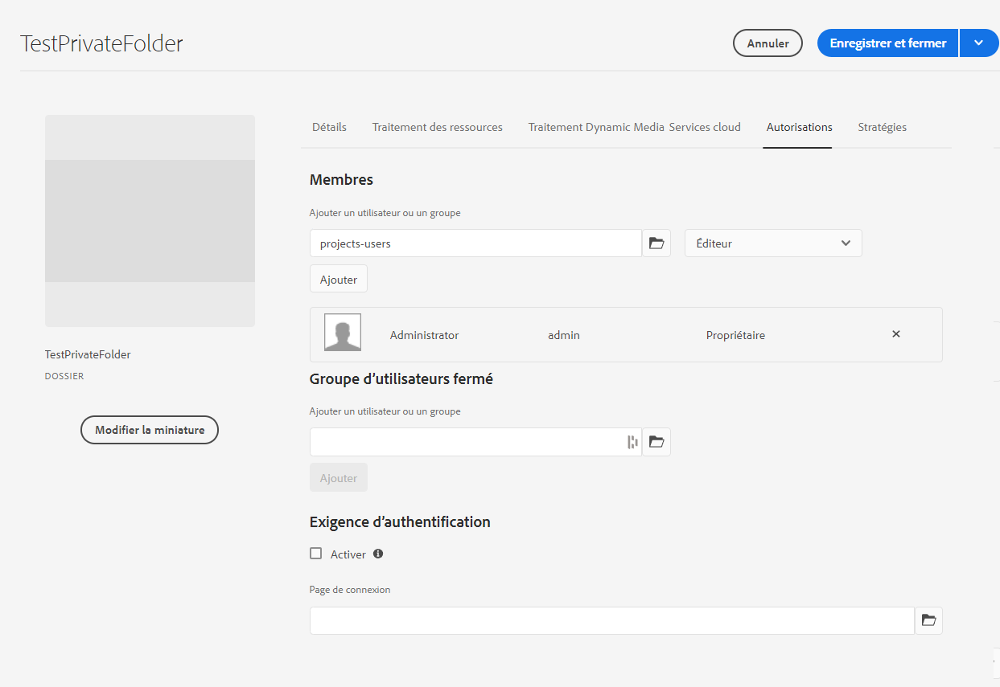

# Dossier privé dans [!DNL Adobe Experience Manager Assets] {#private-folder}

| [Bonnes pratiques de recherche](/help/assets/search-best-practices.md) | [ Bonnes pratiques en matière de métadonnées](/help/assets/metadata-best-practices.md) | [Hub de contenus](/help/assets/product-overview.md) | [Dynamic Media avec fonctionnalités OpenAPI](/help/assets/dynamic-media-open-apis-overview.md) | [Documentation destinée aux développeurs AEM Assets](https://developer.adobe.com/experience-cloud/experience-manager-apis/) |
| ------------- | --------------------------- |---------|----|-----|

| Version | Lien de l’article |
| -------- | ---------------------------- |
| AEM 6.5 | [Cliquez ici](https://experienceleague.adobe.com/docs/experience-manager-65/assets/managing/private-folder.html?lang=fr) |
| AEM as a Cloud Service | Cet article |

Vous pouvez créer un dossier privé dans l’interface utilisateur d’[!DNL Adobe Experience Manager Assets] qui n’est disponible que pour vous. Vous pouvez partager ce dossier privé avec d’autres utilisateurs auxquels vous attribuez différents privilèges. Selon le niveau de privilège que vous attribuez, les utilisateurs et utilisatrices peuvent effectuer différentes tâches dans le dossier, par exemple consulter ou modifier des ressources du dossier.

>[!NOTE]
>
>Le dossier privé comporte au moins un ou une membre ayant un rôle Propriétaire.
>
>Pour créer un dossier privé, vous avec besoin des autorisations `Read` et `Modify` sur le dossier parent sous lequel vous créez un dossier privé. Si vous n’êtes pas administrateur, ces autorisations ne sont pas activées pour vous par défaut au niveau de `/content/dam`. Dans ce cas, commencez par obtenir ces autorisations pour votre ID utilisateur/groupe avant d’essayer de créer des dossiers privés ou d’afficher les paramètres de dossier.

## Créer et partager un dossier privé  {#create-share-private-folder}

Pour créer et partager un dossier privé :

1. Dans la console [!DNL Assets], cliquez sur le bouton **[!UICONTROL Créer]** de la barre d’outils, puis sélectionnez **[!UICONTROL Dossier]** dans le menu.

   

1. Dans la boîte de dialogue **[!UICONTROL Créer un dossier]**, saisissez un `Title` et un `Name` (facultatif) pour le dossier.

   Sélectionnez la case **[!UICONTROL Privé]**, puis cliquez sur **[!UICONTROL Créer]**.

   

   Un dossier privé est créé. Vous pouvez désormais [ajouter des ressources](add-assets.md#upload-assets) dans le dossier et partager le dossier avec d’autres utilisateurs ou groupes. Le dossier n’est visible par aucun autre utilisateur tant que vous ne l’avez pas partagé et que vous ne lui avez pas attribué des privilèges.

1. Pour partager le dossier, sélectionnez-le, puis cliquez sur **[!UICONTROL Propriétés]** dans la barre d’outils.

1. Dans la page **[!UICONTROL Propriétés du dossier]**, sélectionnez un utilisateur ou un groupe dans la liste **[!UICONTROL Ajouter un utilisateur]**, attribuez un rôle (`Viewer`, `Editor`, ou `Owner`) dans votre dossier privé, puis cliquez sur **[!UICONTROL Ajouter]**.

   

   Vous pouvez affecter différents rôles, tels que `Editor`, `Owner`, ou `Viewer`, à l’utilisateur avec lequel vous partagez le dossier. Si vous attribuez un rôle `Owner` à l’utilisateur, ce dernier possède des privilèges `Editor` sur le dossier. En outre, il peut partager le dossier avec d’autres utilisateurs. Si vous attribuez le rôle `Editor`, l’utilisateur peut modifier les ressources de votre dossier privé. Si vous affectez le rôle Observateur, l’utilisateur peut uniquement consulter les ressources du dossier privé.

   >[!NOTE]
   >
   >Le dossier privé comporte au moins un membre ayant le rôle `Owner`. Par conséquent, l’administrateur ne peut pas supprimer tous les membres propriétaires d’un dossier privé. Toutefois, pour supprimer les propriétaires existants (et l’administrateur lui-même) du dossier privé, l’administrateur doit ajouter un autre utilisateur en tant que propriétaire.

1. Cliquez sur **[!UICONTROL Enregistrer et fermer]**. En fonction du rôle attribué, l’utilisateur se voit attribuer un ensemble de privilèges sur votre dossier privé lorsqu’il se connecte à [!DNL Assets].
1. Cliquez sur **[!UICONTROL OK]** pour fermer le message de confirmation.
1. L’utilisateur avec lequel vous partagez le dossier reçoit une notification de partage dans son interface utilisateur.

1. Cliquez sur [!UICONTROL Notifications] pour ouvrir une liste de notifications.

   

1. Cliquez sur l’entrée du dossier privé partagé par l’administrateur pour ouvrir le dossier.

## Suppression de dossiers privés {#delete-private-folder}

Vous pouvez supprimer un dossier en le sélectionnant et en sélectionnant [!UICONTROL Supprimer] à partir du menu supérieur ou à l’aide de la touche Retour arrière de votre clavier.

>[!CAUTION]
>
>Si vous supprimez un dossier privé de CRXDE Lite, les groupes d’utilisateurs redondants restent dans le référentiel.

>[!NOTE]
>
>Si vous supprimez un dossier de l’interface utilisateur à l’aide de la méthode ci-dessus, les groupes d’utilisateurs associés sont également supprimés.
>
>Cependant, les groupes d’utilisateurs existants redondants, inutilisés et générés automatiquement peuvent être supprimés du référentiel à l’aide de la méthode `clean` dans JMX dans l’instance de création (`http://[server]:[port]/system/console/jmx/com.day.cq.dam.core.impl.team%3Atype%3DClean+redundant+groups+for+Assets`).

**Voir également**

* [Traduire les ressources](translate-assets.md)
* [API HTTP Assets](mac-api-assets.md)
* [Formats de fichiers pris en charge par Assets](file-format-support.md)
* [Rechercher des ressources](search-assets.md)
* [Ressources connectées](use-assets-across-connected-assets-instances.md)
* [Rapports de ressources](asset-reports.md)
* [Schémas de métadonnées](metadata-schemas.md)
* [Télécharger des ressources](download-assets-from-aem.md)
* [Gestion des métadonnées](manage-metadata.md)
* [Facettes de recherche](search-facets.md)
* [Gérer les collections](manage-collections.md)
* [Import des métadonnées en bloc](metadata-import-export.md)
* [Publier des ressources sur AEM et Dynamic Media](/help/assets/publish-assets-to-aem-and-dm.md)
