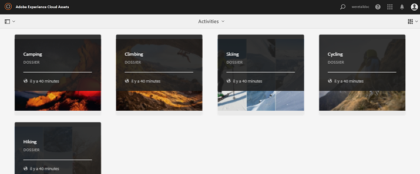

# Publication de ressources sur Brand Portal {#publish-assets-to-brand-portal}

| Version | Lien de l’article |
| -------- | ---------------------------- |
| AEM 6.5 | [Cliquez ici](https://experienceleague.adobe.com/fr/docs/experience-manager-65/content/assets/brandportal/brand-portal-publish-assets) |
| AEM as a Cloud Service | Cet article |

En tant qu’administrateur d’Adobe Experience Manager (AEM) Assets, vous pouvez publier des ressources, des dossiers et des collections sur l’instance AEM Assets Brand Portal. Vous pouvez également planifier le workflow de publication d’une ressource ou d’un dossier à une date ou une heure ultérieure. Une fois ces éléments publiés, les utilisateurs de Brand Portal peuvent accéder aux ressources, aux dossiers et aux collections et les distribuer à d’autres utilisateurs.

Cependant, vous devez d’abord configurer AEM Assets avec Brand Portal. Pour plus de détails, voir [Configuration d’AEM Assets avec Brand Portal](configure-aem-assets-with-brand-portal.md).

Si vous apportez des modifications ultérieures à la ressource, au dossier ou à la collection d’origine dans AEM Assets, les changements ne sont reflétés dans Brand Portal que lorsque vous republiez l’élément modifié depuis AEM Assets. Cette fonction assure que les modifications en cours ne sont pas disponibles dans Brand Portal. Seules les modifications approuvées publiées par un administrateur sont disponibles dans Brand Portal.

* [Publication de ressources sur Brand Portal](#publish-assets-to-bp)
* [Publication de dossiers sur Brand Portal](#publish-folders-to-brand-portal)
* [Publication de collections sur Brand Portal](#publish-collections-to-brand-portal)

>[!NOTE]
>
>Adobe recommande la publication décalée, de préférence en dehors des heures de pointe, de sorte que l’auteur AEM n’utilise pas une quantité excessive de ressources.
>>Assets doit être publié par lots. La recommandation pour la taille de lot est de 15 000.
>> Pour [!DNL Experience Manager Assets] en [!DNL Cloud Service], le taux de transfert observé dans les conditions du laboratoire est de 1 000 ressources par heure. Le taux est observé avec une taille moyenne de 10 Mo de ressources.

## Publication de ressources sur Brand Portal {#publish-assets-to-bp}

Vous trouverez ci-dessous les étapes de publication de ressources d’AEM Assets vers Brand Portal :

1. Dans la console Assets, ouvrez le dossier parent et sélectionnez toutes les ressources à publier, puis cliquez sur l’option **[!UICONTROL Publication rapide]** dans la barre d’outils.

   

1. Vous trouverez ci-dessous les deux méthodes de publication de ressources :
   * [Publier maintenant](#publish-to-bp-now) (publier les ressources immédiatement)
   * [Publier ultérieurement](#publish-to-bp-later) (planifier la publication des ressources)

### Publication immédiate des ressources {#publish-to-bp-now}

Pour publier les ressources sélectionnées sur Brand Portal, effectuez l’une des opérations suivantes :

* Dans la barre d’outils, sélectionnez **[!UICONTROL Publication rapide]**. Cliquez ensuite sur **[!UICONTROL Publier sur Brand Portal]** dans le menu.

* Dans la barre d’outils, sélectionnez **[!UICONTROL Gérer la publication]**.

   1. Dans **[!UICONTROL Action]**, sélectionnez **[!UICONTROL Publier sur Brand Portal]**.

      Dans **[!UICONTROL Planification]**, sélectionnez **[!UICONTROL Maintenant]**.

      Cliquez sur **[!UICONTROL Suivant]**.

   2. Confirmez votre sélection dans **[!UICONTROL Portée]** et cliquez sur **[!UICONTROL Publier sur Brand Portal]**.

Un message indique que les ressources ont été placées en file d’attente pour publication sur Brand Portal. Connectez-vous à l’interface Brand Portal pour voir les ressources publiées.

### Publication ultérieure des ressources {#publish-to-bp-later}

Pour planifier la publication des ressources sur Brand Portal à une date ou une heure ultérieure :

1. Sélectionnez les ressources dont vous souhaitez planifier la publication, puis cliquez sur **[!UICONTROL Gérer la publication]** dans la barre d’outils située en haut.

1. Sur la page **[!UICONTROL Gérer la publication]**, sélectionnez **[!UICONTROL Publier sur Brand Portal]** dans **[!UICONTROL Action]**.

   Sélectionnez **[!UICONTROL Plus tard]** dans **[!UICONTROL Planification]**.

   <!---->

   

1. Sélectionnez une **[!UICONTROL Date d’activation]** et spécifiez l’heure. Cliquez sur **[!UICONTROL Suivant]**.

1. Sélectionnez une **Date d’activation** et spécifiez l’heure. Cliquez sur **Suivant**.

1. Spécifiez un **[!UICONTROL Titre de workflow]** sous **[!UICONTROL Processus]**. Cliquez sur **[!UICONTROL Publier ultérieurement]**.

   <!---->

   

>[!NOTE]
>
> * Les utilisateurs existants appartenant au groupe DAM-Users ont un accès en lecture sur le chemin d’accès « /conf/global/settings/cloudconfigs/mediaportal »
> * Les nouveaux utilisateurs (ou utilisateurs non-administrateurs) ont besoin des droits suivants pour publier sur Brand Portal.
>   > Chemins d’accès :
>   > `"/conf/global/settings/cloudconfigs/mediaportal" : jcr:read `
>   >`/libs : jcr:read`
>   >`/conf : jcr:read`
>   >`/content : jcr:read, crx:replicate`
>   >`/content/dam/ : jcr:read,modify, crx:replicate`

## Publication de dossiers sur Brand Portal {#publish-folders-to-brand-portal}

Vous pouvez publier ou dépublier des dossiers de ressources immédiatement ou en planifier la publication à une date ou une heure ultérieure.

### Publication de dossiers sur Brand Portal {#publish-folders-to-bp}

1. Dans la console Assets, sélectionnez les dossiers à publier, puis cliquez sur **[!UICONTROL Publication rapide]** dans la barre d’outils.

   

1. **Publier immédiatement des dossiers**

   Pour publier les dossiers sélectionnés sur Brand Portal, effectuez l’une des opérations suivantes :

   * Dans la barre d’outils, sélectionnez **[!UICONTROL Publication rapide]**.

     Dans le menu, sélectionnez **[!UICONTROL Publier sur Brand Portal]**.

   * Dans la barre d’outils, sélectionnez **[!UICONTROL Gérer la publication]**.

      1. Dans **[!UICONTROL Action]**, sélectionnez **[!UICONTROL Publier sur Brand Portal]**.

         Dans **[!UICONTROL Planification]**, sélectionnez **[!UICONTROL Maintenant]**.

         Cliquez sur **Suivant.**

      1. Confirmez votre sélection dans **[!UICONTROL Portée]** et cliquez sur **[!UICONTROL Publier sur Brand Portal]**.

   Un message indique que le dossier a été placé en file d’attente pour publication sur Brand Portal. Connectez-vous à l’interface Brand Portal pour voir le dossier publié.

1. **Publication ultérieure de dossiers**
Pour planifier la publication des dossiers de ressources à une date ou une heure ultérieure :

   1. Sélectionnez les dossiers dont vous souhaitez planifier la publication, puis cliquez sur **[!UICONTROL Gérer la publication]** dans la barre d’outils située en haut.
   1. Dans **[!UICONTROL Action]**, sélectionnez **[!UICONTROL Publier sur Brand Portal]**.

      Dans **[!UICONTROL Planification]**, sélectionnez **[!UICONTROL Plus tard]**.

   1. Sélectionnez une **[!UICONTROL Date d’activation]** et spécifiez l’heure. Cliquez sur **[!UICONTROL Suivant]**.

      <!---->

   

   1. Confirmez votre sélection dans **[!UICONTROL Portée]**. Cliquez sur **[!UICONTROL Suivant]**.

   1. Spécifiez un titre de workflow sous **[!UICONTROL Processus]**. Cliquez sur **[!UICONTROL Publier ultérieurement]**.

      <!---->

   

### Afficher le fichier ou le dossier publié dans Brand Portal {#view-published-file-folder}

1. Connectez-vous à l’interface Brand Portal pour afficher les ressources publiées (selon la date ou l’heure planifiée).

   

1. Passez en mode Liste  pour afficher le statut de publication actuel de la ressource.

<!--2. On the [Asset Reports page](#https://experienceleague.adobe.com/en/docs/experience-manager-cloud-service/content/assets/admin/asset-reports), you can see the current state of the report job, for example, Success, Failed, Queued, or Scheduled.-->

### Dépublication de dossiers sur Brand Portal {#unpublish-folders-from-brand-portal}

Vous pouvez supprimer n’importe quel dossier de ressources publié sur Brand Portal en le dépubliant à partir de l’instance d’AEM Assets. Une fois que vous avez dépublié le dossier d’origine, sa copie n’est plus disponible pour les utilisateurs de Brand Portal.

Vous pouvez dépublier immédiatement des dossiers de ressources depuis Brand Portal ou en programmer la publication à une date et une heure ultérieures.

Pour dépublier des dossiers de ressources de Brand Portal :

1. Dans la console Assets, sélectionnez les dossiers de ressources dont vous souhaitez annuler la publication, puis cliquez sur **[!UICONTROL Gérer la publication]** dans la barre d’outils.

   

1. **Dépublication immédiate de dossiers de ressources**

   Pour dépublier immédiatement le dossier de ressources sélectionné sur Brand Portal :

   1. Dans la barre d’outils, sélectionnez **[!UICONTROL Gérer la publication]**.

   1. Dans **[!UICONTROL Action]**, sélectionnez **[!UICONTROL Dépublier sur Brand Portal]**.

      Dans **[!UICONTROL Planification]**, sélectionnez **[!UICONTROL Maintenant]**.

      Cliquez sur **[!UICONTROL Suivant]**.

   1. Confirmez votre sélection dans **[!UICONTROL Portée]** et cliquez sur **[!UICONTROL Dépublier sur Brand Portal]**.

      

1. **Dépublication ultérieure des dossiers de ressources**

   Pour planifier la dépublication d’un dossier de ressources à une date et une heure ultérieures :

   1. Dans la barre d’outils, sélectionnez **[!UICONTROL Gérer la publication]**.

   1. Dans **[!UICONTROL Action]**, sélectionnez **[!UICONTROL Dépublier sur Brand Portal]**.

      Dans **[!UICONTROL Planification]**, sélectionnez **[!UICONTROL Plus tard]**.

   1. Sélectionnez une **[!UICONTROL Date d’activation]** et spécifiez l’heure. Cliquez sur **[!UICONTROL Suivant]**.

   1. Confirmez votre sélection dans **[!UICONTROL Portée]** et cliquez sur **[!UICONTROL Suivant]**.

   1. Spécifiez un **[!UICONTROL Titre de workflow]** sous **[!UICONTROL Processus]**. Cliquez sur **[!UICONTROL Dépublier ultérieurement]**.

      

## Publication de collections sur Brand Portal {#publish-collections-to-brand-portal}

Vous pouvez publier ou dépublier des collections à partir de votre instance cloud AEM Assets.

>[!NOTE]
>
>Les fragments de contenu ne peuvent pas être publiés sur Brand Portal. Par conséquent, si vous sélectionnez un ou plusieurs fragments de contenu dans AEM Assets, l’action **[!UICONTROL Publier sur Brand Portal]** n’est pas disponible.
>
>Si des collections contenant des fragments de contenu sont publiées sur Brand Portal à partir d’AEM Assets, alors tout le contenu du dossier, à l’exception des fragments de contenu, est répliqué sur l’interface Brand Portal.

### Publication de collections {#publish-collections}

Vous trouverez ci-dessous les étapes de publication de collections d’AEM Assets vers Brand Portal :

1. Dans l’interface utilisateur AEM Assets, cliquez sur le logo AEM.

1. Dans la console **Navigation**, accédez à **[!UICONTROL Ressources]** > **[!UICONTROL Collections]**.

1. Dans la console **Collections**, sélectionnez les collections que vous souhaitez publier dans Brand Portal.

   

1. Dans la barre d’outils, cliquez sur **[!UICONTROL Publier sur Brand Portal]**.

1. Dans la boîte de dialogue de confirmation, cliquez sur **[!UICONTROL Publier]**.

1. Fermez le message de confirmation.

   Connectez-vous à Brand Portal en tant qu’administrateur. La collection publiée est disponible dans la console Collections.

   

### Dépublication de collections {#unpublish-collections}

Vous pouvez supprimer n’importe quelle collection publiée sur Brand Portal en la dépubliant à partir de l’instance d’AEM Assets. Une fois la collection d’origine dépubliée, sa copie n’est plus disponible pour les utilisateurs de Brand Portal.

Vous trouverez ci-dessous les étapes de dépublication d’une collection :

1. Dans la console **Collections** de votre instance AEM Assets, sélectionnez la collection que vous souhaitez dépublier.

   

1. Dans la barre d’outils, cliquez sur l’icône **[!UICONTROL Supprimer de Brand Portal]**.
1. Dans la boîte de dialogue, cliquez sur **[!UICONTROL Dépublier]**.
1. Fermez le message de confirmation. La collection est supprimée de l’interface de Brand Portal.

Outre ce qui précède, vous pouvez également publier des schémas de métadonnées, des paramètres d’image prédéfinis, des facettes de recherche et des balises d’AEM Assets sur Brand Portal.

* [Publication de paramètres prédéfinis, de schémas et de facettes sur Brand Portal](https://experienceleague.adobe.com/docs/experience-manager-brand-portal/using/publish/publish-schema-search-facets-presets.html?lang=fr)
* [Publication de balises sur Brand Portal](https://experienceleague.adobe.com/docs/experience-manager-brand-portal/using/publish/brand-portal-publish-tags.html?lang=fr)

Pour plus d’informations, voir [Publication de balises sur Brand Portal](https://experienceleague.adobe.com/docs/experience-manager-brand-portal/using/home.html?lang=fr).

<!--
   Comment Type: draft

   <li> </li>
   -->

<!--
   Comment Type: draft

   <li>Step text</li>
   -->

**Voir également**

* [Traduire les ressources](translate-assets.md)
* [API HTTP Assets](mac-api-assets.md)
* [Formats de fichiers pris en charge par Assets](file-format-support.md)
* [Rechercher des ressources](search-assets.md)
* [Ressources connectées](use-assets-across-connected-assets-instances.md)
* [Rapports de ressources](asset-reports.md)
* [Schémas de métadonnées](metadata-schemas.md)
* [Télécharger des ressources](download-assets-from-aem.md)
* [Gestion des métadonnées](manage-metadata.md)
* [Facettes de recherche](search-facets.md)
* [Gérer les collections](manage-collections.md)
* [Import des métadonnées en bloc](metadata-import-export.md)
* [Publier des ressources sur AEM et Dynamic Media](/help/assets/publish-assets-to-aem-and-dm.md)