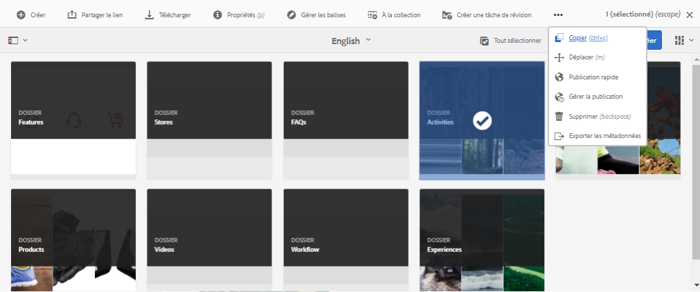
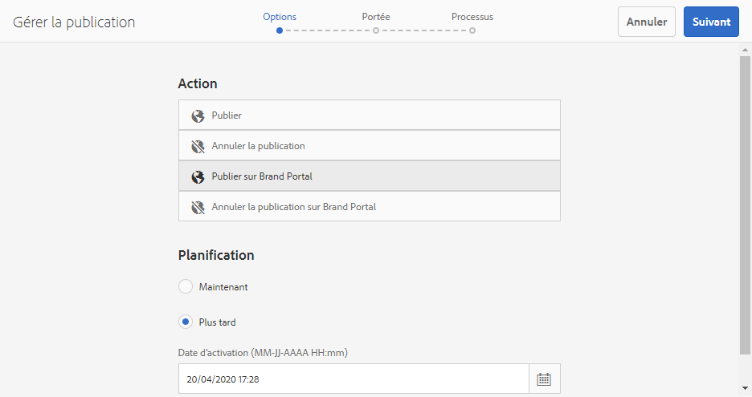
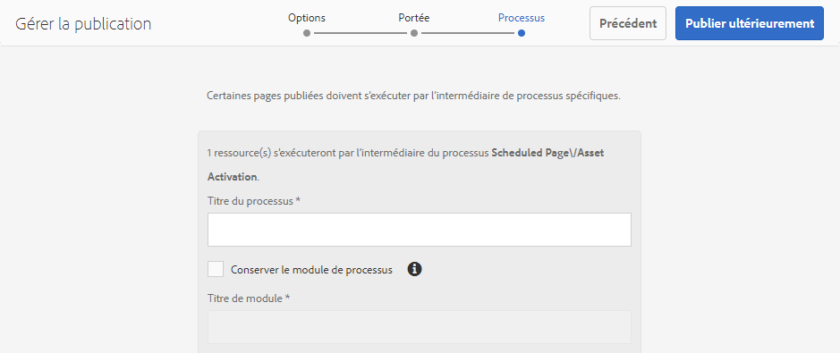
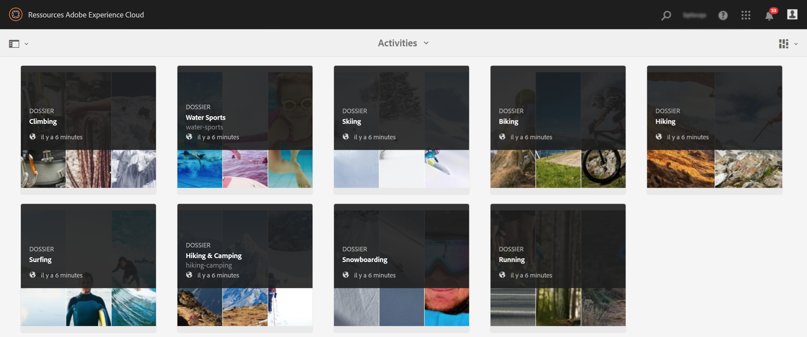
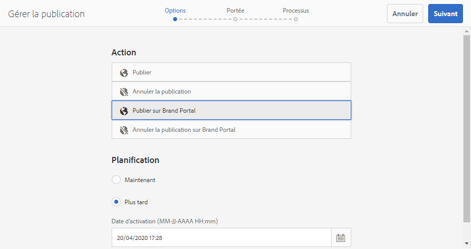
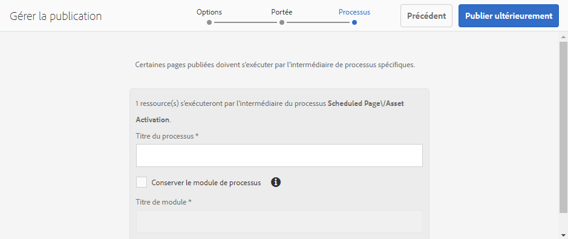
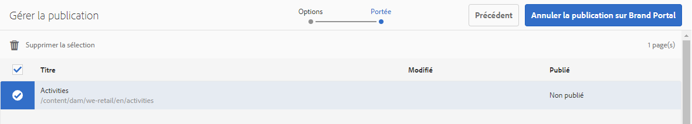
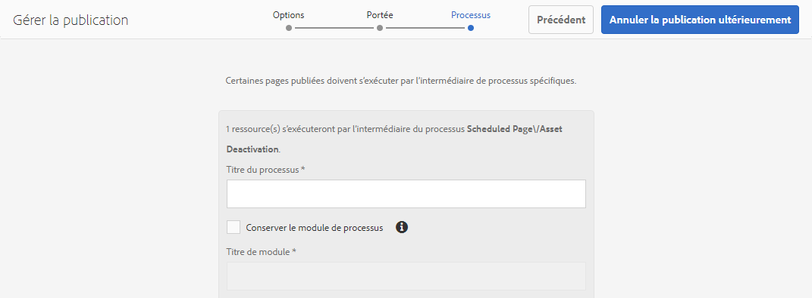
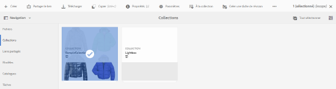

# Publish AEM Assets to Brand Portal {#publish-aem-assets-to-brand-portal}

En tant qu’administrateur des ressources d’Adobe Experience Manager (AEM), vous pouvez publier des fichiers, des dossiers et des collections sur l’instance du portail de marques AEM Assets. Vous pouvez également planifier le processus de publication d’un fichier ou d’un dossier à une date ou une heure ultérieure. Une fois publiée, les utilisateurs du portail de marque peuvent accéder aux fichiers, dossiers et collections et les distribuer à d’autres utilisateurs.

Toutefois, vous devez d’abord configurer AEM Assets avec Brand Portal. For details, see [Configure AEM Assets with Brand Portal](configure-aem-assets-with-brand-portal.md).

Si vous apportez des modifications ultérieures à la ressource, au dossier ou à la collection d’origine dans les ressources AEM, les modifications ne sont pas répercutées dans le portail de marque tant que vous n’avez pas republié les ressources AEM. Cette fonctionnalité garantit que les modifications en cours ne sont pas disponibles dans le portail de marque. Seules les modifications approuvées publiées par un administrateur sont disponibles dans le portail des marques.

* [Publication de ressources sur Brand Portal](#publish-assets-to-bp)
* [Publication de dossiers sur Brand Portal](#publish-folders-to-brand-portal)
* [Publication de collections sur Brand Portal](#publish-collections-to-brand-portal)

>[!NOTE]
>
>Adobe recommande la publication décalée, de préférence en dehors des heures de pointe, de sorte que l’auteur AEM n’utilise pas une quantité excessive de ressources.

## Publication de ressources sur Brand Portal {#publish-assets-to-bp}

Vous trouverez ci-dessous les étapes pour publier des ressources d’AEM Assets sur le portail de marque :

1. Dans la console Ressources, ouvrez le dossier parent et sélectionnez toutes les ressources à publier, puis cliquez sur l’option Publication **[!UICONTROL rapide]** dans la barre d’outils.

   

1. Vous trouverez ci-dessous deux méthodes pour publier des fichiers :
   * [Publier maintenant](#publish-to-bp-now) (Publier les ressources immédiatement)
   * [Publier plus tard](#publish-to-bp-now) (Planifier la publication des ressources)

### Publier les ressources maintenant {#publish-to-bp-now}

Pour publier les ressources sélectionnées sur Brand Portal, effectuez l’une des opérations suivantes :

* From the toolbar, select **[!UICONTROL Quick Publish]**. From the menu, click **[!UICONTROL Publish to Brand Portal]**.

* From the toolbar, select **[!UICONTROL Manage Publication]**.

   1. From **[!UICONTROL Action]**, select **[!UICONTROL Publish to Brand Portal]**, and from **[!UICONTROL Scheduling]**, select **[!UICONTROL Now]**. Cliquez sur **[!UICONTROL Suivant]**.

   2. Confirmez votre sélection dans **[!UICONTROL Scope]**, puis cliquez sur **[!UICONTROL Publier sur le portail]** de marque.

Un message indique que les ressources ont été placées en file d’attente pour publication sur Brand Portal. Connectez-vous à l’interface du portail des marques pour afficher les fichiers publiés.

### Publier les ressources plus tard {#publish-to-bp-later}

Pour planifier la publication des ressources sur Brand Portal à une date ou une heure ultérieure :

1. Sélectionnez les fichiers que vous souhaitez planifier pour publication, puis sélectionnez **[!UICONTROL Gérer la publication]** dans la barre d’outils située en haut.

1. On **[!UICONTROL Manage Publication]** page, select **[!UICONTROL Publish to Brand Portal]** from **[!UICONTROL Action]**, and select **[!UICONTROL Later]** from **[!UICONTROL Scheduling]**.

   

1. Select an **Activation date** and specify time. Cliquez sur **Suivant**.

1. Specify a **[!UICONTROL Workflow title]** in **[!UICONTROL Workflows]**. Click **[!UICONTROL Publish Later]**.

   

Connectez-vous à l’interface du portail de marque pour voir si les fichiers publiés sont disponibles.

<!--

End - Publish assets to Brand Portal
Start- Publish folders to Brand Portal
-->

## Publication de dossiers sur Brand Portal{#publish-folders-to-brand-portal}

Vous pouvez publier ou annuler la publication des dossiers de fichiers immédiatement ou programmer une date ou une heure ultérieure.

### Publication de dossiers sur Brand Portal {#publish-folders-to-brand-portal-1}

1. Dans la console Ressources, sélectionnez les dossiers à publier, puis cliquez sur l’option Publication **[!UICONTROL rapide]** dans la barre d’outils.

   

1. **Publication instantanée des dossiers**

   Pour publier les dossiers sélectionnés sur Brand Portal, effectuez l’une des opérations suivantes :

   * From the toolbar, select **[!UICONTROL Quick Publish]**. Dans le menu, sélectionnez **[!UICONTROL Publier sur Brand Portal]**.

   * From the toolbar, select **[!UICONTROL Manage Publication]**.

      1. Dans **[!UICONTROL Action]**, sélectionnez **[!UICONTROL Publier sur le portail]** de marque. Dans **[!UICONTROL Planification]**, sélectionnez **[!UICONTROL Maintenant]**. Cliquez sur **[!UICONTROL Suivant]**.
      1. Confirmez votre sélection dans **[!UICONTROL Scope]** et cliquez sur **[!UICONTROL Publier sur le portail]** de marque.
   Un message indique que le dossier a été placé en file d’attente pour publication sur Brand Portal. Connectez-vous à l’interface du portail de marque pour afficher le dossier publié.

1. **Publication ultérieure de dossiers**

   Pour programmer la publication des dossiers de fichiers à une date ou une heure ultérieure.

   1. Sélectionnez les dossiers à planifier pour la publication, puis **[!UICONTROL Gérer la publication]** dans la barre d’outils située en haut.
   1. From **[!UICONTROL Action]**, select **[!UICONTROL Publish to Brand Portal]**, and from **[!UICONTROL Scheduling]** select **[!UICONTROL Later]**.

      

   1. Select an **[!UICONTROL Activation date]** and specify time. Cliquez sur **[!UICONTROL Suivant]**.
   1. Confirm your selection in **[!UICONTROL Scope]**. Cliquez sur **[!UICONTROL Suivant]**.
   1. Specify a Workflow title under **[!UICONTROL Workflows]**. Click **[!UICONTROL Publish Later]**.
   

### Annulation de la publication de dossiers sur Brand Portal {#unpublish-folders-from-brand-portal}

Vous pouvez supprimer tout dossier de ressources publié sur le portail de marque en l’annulant de votre instance AEM Assets. Une fois le dossier d’origine dépublié, sa copie n’est plus disponible pour les utilisateurs du portail de marque.

Vous pouvez annuler immédiatement la publication des dossiers de fichiers depuis le portail de marque ou planifier une date et une heure ultérieures.

Pour annuler la publication de dossiers de ressources sur Brand Portal :

1. Dans la console Ressources AEM, sélectionnez le dossier que vous souhaitez annuler la publication.

   

1. From the toolbar, Click **[!UICONTROL Manage Publication]**.

1. **Annulation rapide d’une publication sur Brand Portal**

   Pour annuler immédiatement la publication du dossier sélectionné sur le portail de marque :

   1. From the toolbar, select **Manage Publication**.
   1. From **Action**, select **Unpublish from Brand Portal**, and from **Scheduling**, select **Now**. Cliquez sur **Suivant.**
   1. Confirmez votre sélection dans **Scope** et cliquez sur **Annuler la publication depuis le portail** de marque.
   

1. **Annuler la publication de Brand Portal ultérieurement**

   Pour programmer l’annulation de la publication d’un dossier de Brand Portal à une date et une heure ultérieures :

   1. From the toolbar, select **Manage Publication**.
   1. From **Action**, select **Unpublish from Brand Portal**, and from **Scheduling** select **Later**.
   1. Select an **Activation date** and specify the time. Cliquez sur **Suivant**.
   1. Confirmez votre sélection dans **Scope** et cliquez sur **Next**.
   1. Specify a **Workflow title** in **Workflows**. Click **Unpublish Later.**

      

<!--
End - Publish folders to Brand Portal
Start- Publish Collections to Brand Portal

-->

## Publication de collections sur Brand Portal {#publish-collections-to-brand-portal}

Vous pouvez publier ou annuler la publication de collections à partir de votre instance AEM Assets.

>[!NOTE]
>
>Les fragments de contenu ne peuvent pas être publiés sur Brand Portal. Therefore, if you select content fragment(s) in AEM Asset, then **[!UICONTROL Publish to Brand Portal]** action is not available.
>
>Si des collections contenant des fragments de contenu sont publiées à partir des ressources AEM vers le portail de marque, tout le contenu du dossier, à l’exception des fragments de contenu, est répliqué dans l’interface du portail de marque.

### Publication de collections {#publish-a-collection-to-brand-portal}

Vous trouverez ci-dessous les étapes de publication des collections d’AEM Assets sur le portail de marque :

1. Dans l’interface utilisateur d’AEM Assets, cliquez sur le logo AEM.
1. From **Navigation** page, go to **[!UICONTROL Assets]** > **[!UICONTROL Collections]**.
1. From the **Collections** console, select the collections that you want to publish to Brand Portal.

   

1. From the toolbar, click **[!UICONTROL Publish to Brand Portal]**.
1. In the confirmation dialog, click **[!UICONTROL Publish]**.
1. Fermez le message de confirmation.

   Connectez-vous à Brand Portal en tant qu’administrateur. The published collection is available in the **[!UICONTROL Collections]** console.

   

## Annulation de la publication de collections {#unpublish-collections}

Vous pouvez supprimer toute collection publiée sur le portail de marque en l’annulant de votre instance AEM Assets. Une fois la collection d’origine dépubliée, sa copie n’est plus disponible pour les utilisateurs du portail de marque.

Vous trouverez ci-dessous les étapes pour annuler la publication des collections :

1. Dans la console Collections de votre instance AEM Assets, sélectionnez la collection que vous souhaitez annuler la publication.

   

1. From the toolbar, click **[!UICONTROL Remove from Brand Portal]** icon.
1. In the dialog, click **[!UICONTROL Unpublish]**.
1. Fermez le message de confirmation. La collection est supprimée de l’interface de Brand Portal.

Voir la documentation [du portail](https://docs.adobe.com/content/help/en/experience-manager-brand-portal/using/home.html) de marque pour plus d’informations sur la distribution de fichiers, de dossiers et de collections aux utilisateurs finaux.

<!--

End - Publish Collections to Brand Portal

-->

