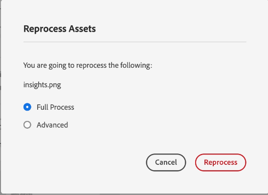

# Retraitement des ressources numériques {#reprocessing-digital-assets}

| [Bonnes pratiques de recherche](/help/assets/search-best-practices.md) | [Bonnes pratiques relatives aux métadonnées](/help/assets/metadata-best-practices.md) | [Hub de contenus](/help/assets/product-overview.md) | [Fonctionnalités Dynamic Media avec OpenAPI](/help/assets/dynamic-media-open-apis-overview.md) | [Documentation de développement pour AEM Assets](https://developer.adobe.com/experience-cloud/experience-manager-apis/) |
| ------------- | --------------------------- |---------|----|-----|

Vous pouvez traiter une nouvelle fois des ressources dans un dossier qui comporte déjà un profil de métadonnées que vous avez modifié. Si vous souhaitez que ce paramètre prédéfini modifié soit réappliqué aux ressources existantes du dossier, vous devez retraiter le dossier. Vous pouvez retraiter autant de ressources que nécessaire.

Retraitez les fichiers d’un dossier si vous rencontrez l’une des deux situations suivantes :

* Vous souhaitez appliquer un paramètre prédéfini de lot à un dossier de ressources existant dans lequel des ressources ont déjà été téléchargées.
* Vous modifiez ensuite un paramètre prédéfini de lot existant qui était précédemment appliqué à un dossier de ressources.

## Retraiter les ressources {#reprocessing-steps}

Pour retraiter des ressources dans un dossier :

1. Dans [!DNL Experience Manager], à partir de la page Assets , sélectionnez les ressources nouvellement ajoutées ou les ressources que vous souhaitez retraiter.
Si vous sélectionnez un dossier :

   * Le workflow prend en compte tous les fichiers du dossier sélectionné, de manière récursive.
   * Si le dossier principal sélectionné contient un ou plusieurs sous-dossiers avec des ressources, le workflow retraite chaque ressource de la hiérarchie de dossiers.
   * Il est conseillé d’éviter d’exécuter ce workflow sur une hiérarchie de dossiers contenant plus de 1 000 ressources.

1. Sélectionnez **[!UICONTROL Retraiter Assets]**. Choisissez entre les deux options :

   

   * **[!UICONTROL Processus complet] :** sélectionnez cette option lorsque vous souhaitez exécuter le processus global, y compris le profil par défaut, le profil personnalisé, le traitement dynamique (s’il est configuré) et les workflows de post-traitement.
   * **[!UICONTROL Avancé] :** sélectionnez cette option pour choisir le retraitement avancé.

     

     Sélectionnez l’une des options avancées suivantes :

      * **[!UICONTROL Rendus d’aperçu par défaut] :** sélectionnez cette option lorsque vous souhaitez retraiter les rendus prévisualisés par défaut.

      * **[!UICONTROL Métadonnées] :** sélectionnez cette option lorsque vous souhaitez extraire des informations de métadonnées et des balises intelligentes pour les ressources sélectionnées.

      * **[!UICONTROL Profils de traitement] :** sélectionnez cette option lorsque vous souhaitez retraiter un profil sélectionné. Vous pouvez choisir l’option **[!UICONTROL Processus complet]** pour inclure le traitement par défaut et le profil personnalisé affecté au niveau du dossier.
        <!--When assets are uploaded to a folder, [!DNL Experience Manager] checks the containing folder's properties for a processing profile. If none is applied, a parent folder in the hierarchy is checked for a processing profile to apply.-->

      * **[!UICONTROL Workflow de post-traitement] :** sélectionnez cette option lorsqu’un traitement supplémentaire des ressources est nécessaire, mais qu’il ne peut pas être effectué à l’aide des profils de traitement. D’autres workflows de post-traitement peuvent être ajoutés à la configuration. Le post-traitement permet d’ajouter un traitement entièrement personnalisé en plus du traitement configurable à l’aide des microservices de ressources.

Voir [Utilisation des microservices de ressources et des profils de traitement](https://experienceleague.adobe.com/docs/experience-manager-cloud-service/content/assets/manage/asset-microservices-configure-and-use.html?lang=fr) pour en savoir plus sur les profils de traitement et le workflow de post-traitement.

Après avoir sélectionné les options appropriées, cliquez sur **[!UICONTROL Retraiter]**. Le message de réussite s’affiche.

## Scénarios de retraitement des ressources numériques {#scenarios-reprocessing}

[!DNL Experience Manager] permet le retraitement des ressources numériques pour les composants suivants.

### Balises intelligentes {#reprocessing-smart-tags}

Les entreprises qui traitent des ressources numériques utilisent de plus en plus le vocabulaire contrôlé par taxonomie dans les métadonnées des ressources. Il s’agit essentiellement d’une liste des mots-clés que les employés, les partenaires et les clients et clientes utilisent fréquemment pour mentionner et rechercher des ressources numériques d’une classe particulière. Le balisage des ressources avec un vocabulaire contrôlé par taxonomie permet de s’assurer que les ressources sont facilement identifiées et récupérées.

Comparé aux vocabulaires des langages naturels, le balisage des ressources numériques basé sur la taxonomie métier aide à les aligner avec les activités d’une entreprise et à assurer que les ressources les mieux adaptées apparaissent dans les recherches.

En savoir plus sur les [balises intelligentes pour les ressources vidéo](https://experienceleague.adobe.com/docs/experience-manager-cloud-service/content/assets/manage/smart-tags-video-assets.html?lang=en).

En savoir plus sur [Retraitement des balises de couleurs pour les images existantes dans la gestion des ressources numériques](https://experienceleague.adobe.com/docs/experience-manager-cloud-service/content/assets/manage/color-tag-images.html?lang=en#color-tags-existing-images).

### Recadrage intelligent {#reprocessing-smart-crop}

En savoir plus sur le [recadrage intelligent Dynamic Media](https://experienceleague.adobe.com/docs/experience-manager-cloud-service/content/assets/dynamicmedia/image-profiles.html?lang=en) qui vous permet d’appliquer un recadrage spécifique (**[!UICONTROL recadrage intelligent]** et recadrage des pixels) et une configuration d’accentuation aux ressources chargées.

### Métadonnées {#reprocessing-metadata}

[!DNL Adobe Experience Manager Assets] conserve les métadonnées de chaque fichier. Cela permet d’obtenir une catégorisation et une organisation plus simples des ressources, ainsi que d’aider les personnes qui recherchent une ressource spécifique. Grâce à la possibilité d’extraire des métadonnées des fichiers chargés vers Experience Manager Assets, la gestion des métadonnées s’intègre au workflow de création. La possibilité de conserver et de gérer les métadonnées de vos fichiers permet aussi d’organiser et de traiter automatiquement les fichiers en fonction de leurs métadonnées.

En savoir plus sur le [retraitement des profils de métadonnées](https://experienceleague.adobe.com/docs/experience-manager-cloud-service/content/assets/manage/metadata-profiles.html?lang=fr).

### Retraitement de ressources Dynamic Media dans un dossier {#reprocessing-dynamic-media}

Vous pouvez traiter une nouvelle fois des ressources dans un dossier qui comporte déjà un profil d’image Dynamic Media ou un profil vidéo Dynamic Media que vous avez modifié. Pour plus d’informations, consultez [retraitement des ressources Dynamic Media dans un dossier](https://experienceleague.adobe.com/docs/experience-manager-cloud-service/content/assets/admin/about-image-video-profiles.html?lang=en).

>[!NOTE]
>
>Vous devez configurer [!DNL Dynamic Media] sur l’environnement pour activer la boîte de dialogue Dynamic Media.
>

### Workflows

En savoir plus sur les [profils de traitement et workflows de post-traitement](https://experienceleague.adobe.com/docs/experience-manager-cloud-service/content/assets/manage/asset-microservices-configure-and-use.html?lang=fr).
