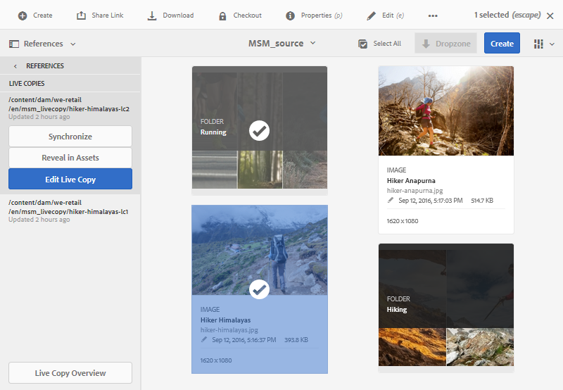
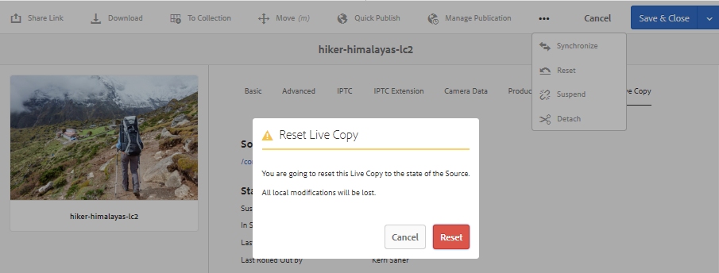

# Réutilisation de ressources à l’aide de MSM pour Assets{#reuse-assets-using-msm-for-assets}

La fonctionnalité Multi Site Manager (MSM) d’Adobe Experience Manager (AEM) permet aux utilisateurs de réutiliser du contenu créé une fois et réutilisé sur plusieurs emplacements web. Il en est de même pour les ressources numériques que pour la fonctionnalité MSM pour Assets. À l’aide de MSM pour Assets, vous pouvez :

* Créer des fichiers une fois, puis effectuer des copies de ces ressources pour les réutiliser dans d’autres zones du site.
* Conserver plusieurs copies dans la synchronisation et mettre à jour la copie originale maîtresse une fois pour transmettre les modifications aux copies enfants.
* Effectuer des modifications locales en suspendant temporairement ou définitivement la liaison entre les ressources parents et enfants.

## Présentation des avantages et des concepts {#concepts}

### Fonctionnement et avantages {#how-it-works-and-the-benefits}

AEM conserve un lien entre la ressource d’origine et ses copies liées, appelées Live Copies. La liaison conservée permet de transmettre des modifications centralisées à de nombreuses Live Copies. Cela permet d’effectuer des mises à jour plus rapides tout en éliminant les limites liées à la gestion des copies en double. La propagation des modifications n’entraîne aucune erreur et est centralisée. Cette fonctionnalité permet des mises à jour qui sont limitées aux Live Copies sélectionnées. Les utilisateurs peuvent annuler la liaison, ce qui rompt l’héritage, et apporter des modifications locales qui ne sont pas remplacées lorsque la copie originale est mise à jour et que les modifications sont déployées. La désolidarisation peut être effectuée pour certains champs de métadonnées sélectionnés ou pour une ressource entière. Elle permet de mettre à jour localement les ressources héritées d’une copie originale.

MSM entretient une relation dynamique entre la ressource source et ses Live Copies de sorte que :

* les modifications apportées aux ressources source soient appliquées (déployées) aux Live Copies (les Live Copies sont synchronisées avec la source) ;
* vous puissiez mettre à jour les Live Copies en suspendant la relation dynamique ou en supprimant l’héritage pour certains champs. Les modifications apportées à la source ne sont plus appliquées à la Live Copy.

### Glossaire des termes MSM pour Assets {#glossary}

**Source** Fichiers ou dossiers d’origine. Copie originale d’où sont dérivées les Live Copies.

**Copie** en direct Copie des fichiers/dossiers source synchronisés avec sa source. Les Live Copies peuvent être une source d’autres Live Copies. Découvrez comment créer des Live Copies.

**Héritage** Lien/référence entre un fichier/dossier de copie dynamique et sa source que le système utilise pour se rappeler où envoyer les mises à jour. L’héritage existe à un niveau granulaire pour les champs de métadonnées. L’héritage peut être supprimé pour les champs de métadonnées sélectionnés tout en conservant les relations dynamiques entre la source et sa Live Copy.

**Déploiement** Action qui pousse les modifications apportées à la source en aval vers ses copies dynamiques. Il est possible de mettre à jour une ou plusieurs Live Copies en une seule fois à l’aide de l’action de déploiement. Voir Déploiement.

**Règles de configuration** de déploiement qui déterminent les propriétés qui sont synchronisées, comment et quand. Ces configurations sont appliquées lors de la création de Live Copies ; elles peuvent être modifiées ultérieurement. De plus, un enfant peut hériter de la configuration de déploiement de sa ressource parent. Pour MSM pour Assets, utilisez uniquement la configuration de déploiement standard. Les autres configurations de déploiement ne sont pas disponibles pour MSM pour Assets.

**Synchroniser** une autre action, en plus du déploiement, qui assure la parité entre la source et sa copie dynamique en envoyant les mises à jour de la source vers les copies dynamiques. Une synchronisation est lancée pour une Live Copy spécifique et l’action récupère les modifications de la source. Cette action permet de mettre à jour uniquement l’une des Live Copies. Voir Action de synchronisation.

**Suspendre** Supprimez temporairement la relation active entre une copie dynamique et son fichier/dossier source. Vous pouvez reprendre la relation. Voir Action de suspension.

**Reprendre** la relation en direct pour qu’une copie en direct recommence à recevoir les mises à jour de la source. Voir Action de reprise.

**L’action Réinitialiser** la réinitialisation fait de la copie dynamique un réplica de la source en remplaçant les modifications locales. Elle supprime également les annulations d’héritage et réinitialise l’héritage sur tous les champs de métadonnées. Pour apporter dans l’avenir des modifications locales, vous devez à nouveau annuler l’héritage de champs spécifiques. Voir Modifications locales apportées à une Live Copy.

**Détacher** supprime irrévocablement la relation de production d’un fichier/dossier de copie dynamique. Après une action de désolidarisation, les Live Copies ne peuvent jamais recevoir les mises à jour de la source et elles cessent d’être des Live Copies. Voir Suppression des relations.

## Création d’une Live Copy d’une ressource {#createlc}

Pour créer une Live Copy à partir d’une ou de plusieurs ressources ou d’un ou plusieurs dossiers source, procédez de l’une des manières suivantes :

* Méthode 1 : sélectionnez la ou les ressources sources, puis cliquez sur **[!UICONTROL Créer > Live Copy]** dans la barre d’outils supérieure.

* Méthode 2 : dans l’interface utilisateur d’AEM, cliquez sur **[!UICONTROL Créer > Live Copy]** dans le coin supérieur droit de l’interface.

Vous pouvez créer des Live Copies d’une ressource ou d’un dossier à la fois. Vous pouvez créer des Live Copies dérivées d’une ressource ou d’un dossier étant une Live Copy.  Les fragments de contenu ne sont pas pris en charge dans le cas d’utilisation. Lorsque vous tentez de créer leurs Live Copies, les fragments de contenu sont copiés tels quels sans aucune relation. Les fragments de contenu copiés sont un instantané temporel et ne sont pas mis à jour lorsque les fragments de contenu d’origine sont mis à jour.

Pour créer des Live Copies à l’aide de la première méthode, procédez comme suit :

1. Sélectionnez des fichiers ou des dossiers sources. Dans la barre d’outils, cliquez sur **[!UICONTROL Créer > Live Copy]**.

   

   Création d’une Live Copy depuis l’interface d’AEM

1. Sélectionnez un dossier de destination. Cliquez sur **[!UICONTROL Suivant]**.
1. Indiquez un titre et un nom. Les ressources ne possèdent pas d’enfants. Lorsque vous créez une Live Copy des dossiers, vous pouvez choisir d’inclure ou d’exclure des enfants.
1. Sélectionnez une configuration de déploiement. Cliquez sur **[!UICONTROL Créer]**.

Pour créer des Live Copies à l’aide de la seconde méthode, procédez comme suit :

1. Dans l’interface d’AEM, dans le coin supérieur droit, cliquez sur **[!UICONTROL Créer > Live Copy]**.

   

   Création d’une Live Copy depuis l’interface d’AEM

1. Sélectionnez la ressource ou le dossier source. Cliquez sur **[!UICONTROL Suivant]**.
1. Sélectionnez le dossier de destination. Cliquez sur **[!UICONTROL Suivant]**.
1. Indiquez un titre et un nom. Les ressources ne possèdent pas d’enfants. Lorsque vous créez une Live Copy des dossiers, vous pouvez choisir d’inclure ou d’exclure des enfants.
1. Sélectionnez une configuration de déploiement. Cliquez sur **[!UICONTROL Créer]**.

>[!NOTE]
>
>Lorsqu’une source ou une Live Copy est déplacée, les relations sont conservées. Lorsqu’une Live Copy est supprimée, les relations sont retirées.

## Affichage de différentes propriétés et des états de la source et de la Live Copy {#properties}

Vous pouvez afficher les informations et les états associés à MSM d’une Live Copy, comme la relation, la synchronisation, les déploiements, et des informations supplémentaires dans les différentes zones de l’interface utilisateur d’AEM.

Les deux méthodes suivantes fonctionnent pour les ressources et les dossiers :

* Sélectionnez la ressource de Live Copy et recherchez les informations dans la page Propriétés.
* Sélectionnez le dossier source et recherchez les informations détaillées de chaque Live Copy dans la console Live Copy.

**Conseil** : pour vérifier l’état de quelques Live Copies distinctes, utilisez la première méthode qui consiste à consulter la page Propriétés. Pour vérifier l’état de nombreuses Live Copies, utilisez la seconde méthode, à savoir la consultation de la page **[!UICONTROL État de la relation]**.

### Informations et état d’une Live Copy {#statuslcasset}

Pour vérifier les informations et les états d’une ressource ou d’un dossier de Live Copy, procédez comme suit :

1. Sélectionnez une ressource ou un dossier de Live Copy. Cliquez sur **[!UICONTROL Propriétés]** dans la barre d’outils. Vous pouvez également utiliser le raccourci clavier `p`.
1. Cliquez sur **[!UICONTROL Live Copy]**. Vous pouvez vérifier le chemin de la source, l’état de suspension, l’état de synchronisation, la date du dernier déploiement et l’utilisateur ayant effectué le dernier déploiement.

   

   Informations et états d’une Live Copy

1. Vous pouvez procéder à l’activation ou la désactivation si les ressources enfants empruntent la configuration de la Live Copy.

1. Vous pouvez choisir que la Live Copy hérite de la configuration du déploiement du parent ou modifier la configuration.

### Informations et états de toutes les Live Copies d’un dossier {#statuslcfolder}

AEM fournit une console permettant de vérifier les états de toutes les Live Copies d’un dossier source. Cette console affiche l’état de toutes les ressources enfants.

1. Sélectionnez un dossier source. Cliquez sur **[!UICONTROL Propriétés]** dans la barre d’outils. Vous pouvez également utiliser le raccourci clavier `p`.
1. Cliquez sur **[!UICONTROL Source Live Copy]**. Pour ouvrir la console, cliquez sur **[!UICONTROL Aperçu de la live copy]**. Ce tableau de bord fournit un état de niveau supérieur de toutes les ressources enfants.

   

   Affichage des états des Live Copies dans la console Live Copy de la source

1. Pour afficher les informations détaillées sur chaque ressource dans le dossier de Live Copy, sélectionnez une ressource, puis cliquez sur **[!UICONTROL État de la relation]** dans la barre d’outils.

   

   Informations détaillées et état d’une ressource enfant de Live Copy dans un dossier

**Conseil** : vous pouvez afficher rapidement les états des Live Copies d’autres dossiers sans avoir à effectuer trop d’opérations. Il suffit de modifier le dossier dans la liste contextuelle dans la partie centrale supérieure de l’interface **[!UICONTROL Aperçu de la Live Copy]**.

### Actions rapides pour la source depuis le rail Références {#refrailsource}

Pour une ressource ou un dossier source, vous pouvez afficher les informations et effectuer les actions suivantes directement depuis le rail Références :

* Voir les chemins des Live Copies.
* Ouvrir ou afficher une Live Copy spécifique dans l’interface utilisateur d’AEM.
* Synchroniser les mises à jour d’une Live Copy spécifique.
* Suspendre la relation ou modifier la configuration de déploiement pour une Live Copy spécifique.
* Accéder à la console Aperçu de la Live Copy.

Sélectionnez la ressource ou le dossier source, ouvrez le rail gauche, puis cliquez sur **[!UICONTROL Références]**. Vous pouvez également sélectionner une ressource ou un dossier et utiliser le raccourci clavier `Alt + 4`.  

Actions et informations disponibles dans le rail Références pour la source sélectionnée

Pour une Live Copy spécifique, cliquez sur **[!UICONTROL Modifier la Live Copy]** pour suspendre la relation ou modifier la configuration du déploiement.

Suspension de la relation ou modification de la configuration du déploiement d’une Live Copy spécifique

### Actions rapides pour une Live Copy depuis le rail Références {#refraillc}

Pour une ressource ou un dossier de Live Copy, vous pouvez afficher les informations et effectuer les actions suivantes directement depuis le rail Références :

* Afficher le chemin d’accès à sa source.
* Ouvrir ou afficher une Live Copy spécifique dans l’interface utilisateur d’AEM.
* Déployer les mises à jour.

Sélectionnez une ressource ou un dossier de Live Copy, ouvrez le rail gauche, puis cliquez sur **[!UICONTROL Références]**. Vous pouvez également sélectionner une ressource ou un dossier et utiliser le raccourci clavier `Alt + 4`.  

Actions disponibles dans le rail Références pour la Live Copy sélectionnée

## Propagation des modifications de la source vers les Live Copies {#rolloutsync}

Une fois une source modifiée, les modifications peuvent être propagées aux Live Copies à l’aide d’une action de synchronisation ou de déploiement. Pour comprendre la différence entre les deux actions, voir le [glossaire](#glossary).

### Action de déploiement {#rollout}

Vous pouvez lancer une action de déploiement à partir de la ressource source et mettre à jour quelques ou toutes les Live Copies.

1. Sélectionnez une ressource ou un dossier de Live Copy. Cliquez sur **[!UICONTROL Propriétés]** dans la barre d’outils. Vous pouvez également utiliser le raccourci clavier `p`.
1. Cliquez sur **[!UICONTROL Source Live Copy]**. Cliquez sur **[!UICONTROL Déployer]** dans la barre d’outils supérieure.

1. Sélectionnez les Live Copies que vous souhaitez mettre à jour. Cliquez sur **[!UICONTROL Déployer]**.

   Pour déployer les mises à jour apportées aux ressources enfants, sélectionnez **[!UICONTROL Déployer la source et tous les enfants]**.

   

   Déploiement des modifications de la source vers quelques ou toutes les Live Copies

>[!NOTE]
>
>Les modifications apportées dans une ressource source sont déployées uniquement vers les Live Copies directement associées. Si une Live Copy est dérivée d’une autre, les modifications ne sont pas déployées vers la Live Copy dérivée.

Vous pouvez également lancer une action de déploiement à partir du rail Références après avoir sélectionné une Live Copy spécifique. Pour plus d’informations, voir [Actions rapides pour la Live Copy depuis le rail Références](#refraillc). Dans cette méthode de déploiement, seule la Live Copy sélectionnée et éventuellement ses enfants sont mis à jour.

Déploiement des modifications de la source vers la Live Copy sélectionnée

### À propos de l’action de synchronisation {#aboutsync}

Une action de synchronisation récupère les modifications d’une source uniquement pour la Live Copy sélectionnée. L’action de synchronisation respecte et gère les modifications locales effectuées après l’annulation de l’héritage. Les modifications locales ne sont pas remplacées et l’héritage annulé n’est pas rétabli. Vous pouvez lancer une action de synchronisation de trois manières différentes.

<table>
 <tbody>
  <tr>
   <th><strong>Emplacement dans l’interface d’AEM</strong>  </th>
   <th><strong>Utilisation : à quel moment et pourquoi</strong>  </th>
   <th><strong>Utilisation</strong>  </th>
  </tr>
  <tr>
   <td>Rail Références</td>
   <td>Effectuez rapidement une synchronisation lorsque la source est déjà sélectionnée.  </td>
   <td>Voir <a href="#refrailsource">Actions rapides pour la source depuis le rail Références</a></td>
  </tr>
  <tr>
   <td>Barre d’outils dans la page Propriétés  </td>
   <td>Lancez une synchronisation lorsque les propriétés de la Live Copy sont déjà ouvertes.  </td>
   <td>Voir <a href="#synclc">Synchronisation d’une Live Copy</a></td>
  </tr>
  <tr>
   <td>Console Aperçu de la Live Copy</td>
   <td>Synchronisez rapidement plusieurs ressources (pas nécessairement toutes) lorsque le dossier source est sélectionné ou que la console Aperçu de la Live Copy est déjà ouverte. L’action de synchronisation est lancée pour une ressource à la fois. Il s’agit toutefois d’une méthode plus rapide pour synchroniser plusieurs ressources simultanément.  </td>
   <td>Voir <a href="#bulkactions">Actions sur plusieurs ressources dans un dossier de Live Copy</a></td>
  </tr>
 </tbody>
</table>

### Synchronisation d’une Live Copy {#synclc}

Pour démarrer une action de synchronisation, ouvrez la page **[!UICONTROL Propriétés]** d’une Live Copy, cliquez sur **[!UICONTROL Live Copy]**, puis sur l’action souhaitée dans la barre d’outils.

Pour afficher les états et les informations liés à une action de synchronisation, voir [Informations et état d’une Live Copy](#statuslcasset) et [Informations et états de toutes les Live Copies d’un dossier](#statuslcfolder).

L’action de synchronisation récupère les modifications apportées à la source

>[!NOTE]
>
>Si la relation est suspendue, l’action de synchronisation n’est pas disponible dans la barre d’outils. Alors que l’action de synchronisation est disponible dans le rail Références, les modifications ne sont pas propagées même lors d’un déploiement réussi.

## Suspension et reprise d’une relation {#suspendresume}

Vous pouvez suspendre temporairement la relation afin d’empêcher une Live Copy de recevoir les modifications apportées à la ressource ou au dossier source. La relation peut également être reprise pour que la Live Copy commence à recevoir les modifications de la source.

Pour effectuer une suspension ou une reprise, ouvrez la page **[!UICONTROL Propriétés]** d’une Live Copy, cliquez sur **[!UICONTROL Live Copy]**, puis sur l’action souhaitée dans la barre d’outils.

Vous pouvez également suspendre ou reprendre rapidement les relations de plusieurs ressources dans un dossier de Live Copy depuis la console **[!UICONTROL Aperçu de la Live Copy]**. Voir [Actions sur plusieurs ressources dans des dossiers de Live Copy](#bulkactions).

## Apport de modifications locales à Live Copy {#localmods}

Une Live Copy est un réplica de la source d’origine lors de sa création. Les valeurs des métadonnées d’une Live Copy sont héritées de la source. Les champs de métadonnées conservent individuellement l’héritage avec les champs respectifs de la ressource source.

Vous avez toutefois la possibilité d’apporter des modifications locales à une Live Copy afin de modifier quelques propriétés sélectionnées. Pour apporter des modifications locales, annulez l’héritage de la propriété souhaitée. Lorsque l’héritage d’un ou de plusieurs champs de métadonnées est annulé, la relation dynamique de la ressource et l’héritage des autres champs de métadonnées sont conservés. Une synchronisation ou un déploiement ne remplace pas les modifications locales. Pour cela, ouvrez la page **[!UICONTROL Propriétés]** d’une ressource de Live Copy, cliquez sur l’icône **[!UICONTROL Annuler l’héritage]** en regard d’un champ de métadonnées.

Vous pouvez annuler toutes les modifications locales et rétablir l’état de la source de la ressource. L’action de réinitialisation remplace instantanément et de façon irrévocable toutes les modifications locales et rétablit l’héritage sur tous les champs de métadonnées. Pour effectuer un rétablissement, depuis la page **[!UICONTROL Propriétés]** d’une ressource de Live Copy, cliquez sur **[!UICONTROL Réinitialiser]** dans la barre d’outils.

L’action de réinitialisation remplace les modifications locales et apporte une partie de la Live Copy avec sa source.

## Suppression d’une relation dynamique {#detach}

Vous pouvez supprimer complètement la relation entre une source et une Live Copy à l’aide d’une action de désolidarisation. La Live Copy devient une ressource ou un dossier autonome après sa désolidarisation. Elle s’affiche en tant que nouvelle ressource dans l’interface AEM, immédiatement après la désolidarisation. Pour désolidariser une Live Copy de sa source, procédez comme suit :

1. Sélectionnez une ressource ou un dossier de Live Copy. Cliquez sur **[!UICONTROL Propriétés]** dans la barre d’outils. Vous pouvez également utiliser le raccourci clavier `p`.

1. Cliquez sur **[!UICONTROL Live Copy]**. Cliquez sur **[!UICONTROL Désolidariser]** dans la barre d’outils. Cliquez sur **[!UICONTROL Désolidariser]** dans la boîte de dialogue qui s’affiche.

   

   L’action de désolidarisation supprime complètement la relation entre la source et la Live Copy

   >[!CAUTION]
   >
   >La relation est supprimée dès que vous cliquez sur **[!UICONTROL Désolidariser]** dans la boîte de dialogue. Vous ne pouvez pas annuler cette action en cliquant sur **[!UICONTROL Annuler]** dans la page Propriétés.

Vous pouvez également désolidariser rapidement plusieurs ressources d’un dossier de Live Copy dans la console **[!UICONTROL Aperçu de la Live Copy]**. Voir [Actions sur plusieurs ressources dans des dossiers de Live Copy](#bulkactions).

## Actions sur plusieurs ressources dans des dossiers de Live Copy {#bulkactions}

Si un dossier de Live Copy comporte plusieurs ressources, il peut être fastidieux de lancer des actions sur chaque ressource. Vous pouvez rapidement lancer les actions de base sur de nombreuses ressources dans la console de Live Copy. Les méthodes ci-dessus continuent de fonctionner pour chaque ressource.

1. Sélectionnez un dossier source. Cliquez sur **[!UICONTROL Propriétés]** dans la barre d’outils. Vous pouvez également utiliser le raccourci clavier `p`.
1. Cliquez sur **[!UICONTROL Source Live Copy]**. Pour ouvrir la console, cliquez sur **[!UICONTROL Aperçu de la live copy]**.

1. Dans ce tableau de bord, sélectionnez une ressource de Live Copy dans un dossier de Live Copy. Cliquez sur les actions de votre choix dans la barre d’outils. Les actions disponibles sont **[!UICONTROL Synchroniser]**, **[!UICONTROL Réinitialiser]**, **[!UICONTROL Suspendre]** et **[!UICONTROL Désolidariser]**.

   Vous pouvez rapidement lancer ces actions sur une ressource dans n’importe quel dossier de Live Copy ayant une relation dynamique avec le dossier source sélectionné.

   

   Mettez facilement à jour de nombreuses ressources dans les dossiers de Live Copy depuis la console Aperçu de la Live Copy

<!--
## Extend MSM for Assets {#extendapi}

AEM allows you to extend the functionality using the MSM Java APIs. For Assets, the extending works just the same as it works with MSM for Site. For details, see [Extending the MSM](/help/sites-developing/extending-msm.md) and the following for information about specific tasks:

* [Overview of APIs](/help/sites-developing/extending-msm.md#overview-of-the-java-api)

* [Create a new synchronization action](/help/sites-developing/extending-msm.md#creating-a-new-synchronization-action)
* [Create a new rollout configuration](/help/sites-developing/extending-msm.md#creating-a-new-rollout-configuration)

* [Create and use a simple LiveActionFactory class](/help/sites-developing/extending-msm.md#creating-and-using-a-simple-liveactionfactory-class)

>[!NOTE]
>
>* Blueprint in MSM for Site is called Live Copy source in MSM for Assets.
>* Removing the chapters step in the create site wizard is not supported in MSM for Assets.
>* Configuring MSM locks on page properties (Touch-enabled UI) is not supported in MSM for Assets.

-->

## Impact des tâches de gestion des ressources sur les Live Copies {#manageassets}

Les Live Copies et les sources sont des ressources ou des dossiers pouvant être gérés, dans une certaine mesure, comme des ressources numériques. Certaines tâches de gestion des ressources dans AEM ont un impact spécifique sur les Live Copies.

* La copie d’une Live Copy crée une ressource de Live Copy avec la même source que la première Live Copy.
* Lorsque vous déplacez une source ou sa Live Copy, la relation dynamique est conservée.
* L’action de modification ne fonctionne pas pour les ressources de Live Copy. Si la source d’une Live Copy est une Live Copy, l’action de modification ne fonctionne pas pour elle.
* L’action d’extraction n’est pas disponible pour les ressources de Live Copy.
* Pour le dossier source, l’option permettant de créer des tâches de révision est disponible.
* Lorsque vous affichez la liste des ressources en mode Liste et Colonne, une ressource ou un dossier de Live Copy affiche la mention « live copy ». Vous pouvez ainsi identifier facilement des Live Copies dans un dossier.

## Comparaison de MSM pour Assets et de MSM pour Sites {#comparison}

Dans d’autres scénarios, MSM pour Assets correspond au comportement de la fonctionnalité MSM pour Sites. Voici quelques différences importantes à noter :

* Blueprint dans MSM pour Site est appelé Source Live Copy dans MSM pour Assets.
* Dans Sites, vous pouvez comparer un blueprint et sa Live Copy, mais il n’est pas possible de comparer dans Assets une source à sa Live Copy.
* Vous ne pouvez pas modifier une Live Copy dans Assets.
* Sites possède généralement des enfants, mais pas Assets. L’option permettant d’inclure ou d’exclure des enfants n’est pas présente lors de la création de Live Copies de ressources distinctes.
* La suppression de l’étape des chapitres dans l’assistant de création de site n’est pas prise en charge dans MSM pour Assets.
* La configuration des verrous MSM sur les propriétés de la page (IU tactile) n’est pas prise en charge dans MSM pour Assets.
* Pour MSM pour Assets, utilisez uniquement la **[!UICONTROL configuration de déploiement standard]**. Les autres configurations de déploiement ne sont pas disponibles pour MSM pour Assets.

## Bonnes pratiques {#bestpractices}

Voici quelques bonnes pratiques pour les modules multimédias :

* Planifiez les relations parents-enfants des ressources et des flux de contenu avant de commencer l’implémentation.
* 

## Limites et problèmes connus de MSM pour Assets {#limitations}

Voici une limite de MSM pour Assets :

* Les fragments de contenu ne sont pas pris en charge dans le cas d’utilisation. Lorsque vous tentez de créer leurs Live Copies, les fragments de contenu sont copiés tels quels sans aucune relation. Les fragments de contenu copiés sont un instantané temporel et ne sont pas mis à jour lorsque les fragments de contenu d’origine sont mis à jour.

