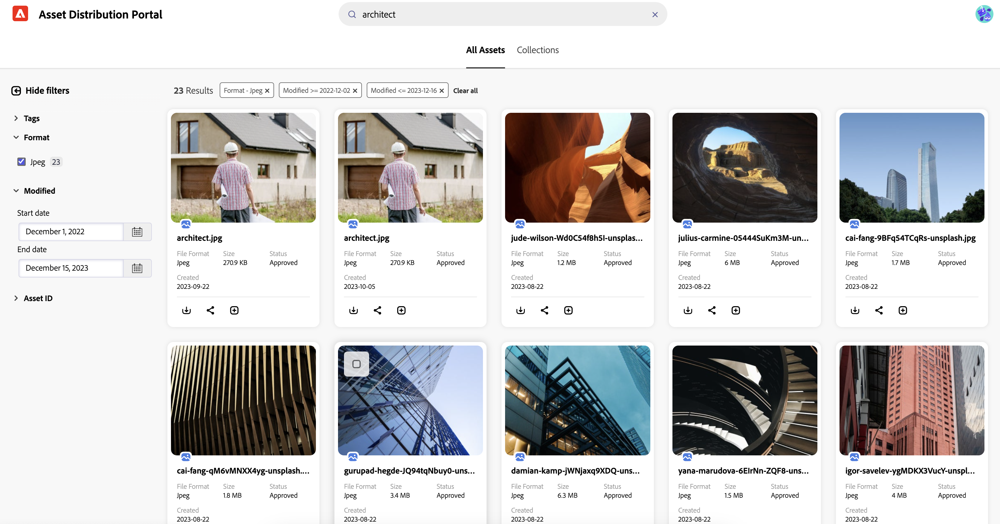

# Rechercher dans Assets en [!DNL Content Hub] {#search-assets}

Lorsque vous disposez d’un grand nombre de ressources dans votre référentiel, la recherche de la bonne ressource prend du temps. [!DNL The Content Hub] recherche vous permet de rechercher les ressources approuvées afin d’effectuer des actions supplémentaires sur celles-ci, telles que le téléchargement, le partage ou la création de collections. Vous pouvez utiliser différentes fonctionnalités pour affiner les résultats de votre recherche, telles que l’exécution d’une recherche textuelle, l’utilisation de filtres, l’exécution de balises ou d’une recherche spécifique aux balises intelligentes, la recherche d’un format de fichier particulier, etc.

## Conditions préalables {#prerequisites}

[Les utilisateurs de ](deploy-content-hub.md#onboard-content-hub-users) peuvent effectuer les actions mentionnées dans cet article.

## Ce que vous pouvez rechercher  {#what-you-can-search}

La recherche [!DNL Content Hub] fournit des résultats en fonction des éléments suivants :

* **Texte correspondant :** la recherche [!DNL Content Hub] vous permet de rechercher une ressource à l’aide de son nom ou de sa description. Vous pouvez effectuer une recherche par mot-clé, qui compare le mot-clé au texte disponible dans les propriétés d’une ressource.

* **Contexte de correspondance :** [!DNL Content Hub] liste de résultats de recherche contient les résultats immédiats des ressources obtenues en fonction du contexte de correspondance. Par exemple, si vous saisissez `cool` dans la barre de recherche, les ressources liées à `winter`, `snow`, `cold surroundings` s’affichent dans la liste de recherche.

* **Informations sur les ressources (titre, balises ou balises intelligentes) :** [!DNL Content Hub] utilise un algorithme de recherche dynamique pour classer les résultats de recherche avec précision et autant de pertinence que possible. Les [métadonnées](#asset-properties.md) sont la collection de toutes les données disponibles pour une ressource, mais elles ne sont pas nécessairement contenues dans cette ressource. [Cela vous permet de classer les ressources de manière détaillée à mesure que le volume d’informations numériques augmente](/help/assets/configure-content-hub-ui-options.md##configure-metadata-search-content-hub).

* **Date de dernière modification :** les ressources qui ont été modifiées récemment apparaissent en haut de la liste des résultats de recherche. Vous pouvez également filtrer la période en fonction de vos besoins.

* **Utilisation :** les ressources couramment utilisées apparaissent en haut de la liste de recherche.

* **Historique de recherche :** cliquez dans la zone de recherche sans saisir de caractère pour obtenir votre historique de recherche. Vous pouvez également supprimer n’importe quel mot-clé de l’historique. L’historique de recherche est enregistré dans la mémoire cache d’un navigateur web, ce qui signifie que si vous accédez à la recherche [!DNL Content Hub] dans un autre navigateur ou effacez la mémoire cache du navigateur, vous ne pouvez plus afficher l’historique de recherche.

* **Recherche en cours de saisie :** la recherche [!DNL Content Hub] améliore votre expérience de recherche en fournissant des suggestions de saisie semi-automatique lorsque vous commencez à saisir du texte.

## Recherche de base {#basic-search}

Pour effectuer une recherche de base sur [!DNL the Content Hub], accédez à la barre de recherche et indiquez le mot-clé à rechercher. Accédez aux filtres disponibles dans le volet de gauche et appliquez-les pour affiner vos résultats de recherche.

Par exemple, recherchez toutes les images **** contenant le mot-clé `architect`, qui a été modifié au cours de l’année dernière. Pour exécuter ce scénario, procédez comme suit :

1. Spécifiez `architect` comme mot-clé de recherche.

1. Accédez au panneau Filtres > **[!UICONTROL Format]** > sélectionnez **[!UICONTROL JPEG]**.

1. Accédez à **[!UICONTROL Modifié]** > spécifiez la période.

   

## Limitation des résultats de recherche à l’aide de filtres {#narrow-down-search-results}

Utilisez le panneau Filtres pour rechercher des ressources en fonction des métadonnées. Vous pouvez filtrer les résultats de la recherche en fonction de divers prédicats de recherche. Vous pouvez sélectionner tous les prédicats appropriés pour réduire ou affiner vos résultats de recherche. Vous pouvez choisir plus de 10 prédicats lors du filtrage des résultats de la recherche. Lorsque vous sélectionnez plusieurs options dans un filtre, Content Hub affiche les ressources qui correspondent à l’une des options sélectionnées dans un filtre. Cependant, lorsque vous sélectionnez plusieurs options dans les filtres, Content Hub affiche uniquement les ressources correspondant à toutes les options sélectionnées dans les filtres pour affiner les résultats de la recherche.

Les filtres par défaut incluent le format de fichier, approuvé par, la date d’approbation, les ressources expirées et non expirées, ainsi que la date d’expiration. Les administrateurs peuvent également configurer les filtres qui s’affichent dans la liste des filtres. Pour plus d’informations, voir [Configuration de l’interface utilisateur de Content Hub](configure-content-hub-ui-options.md#configure-filters-content-hub).

## Recherche optimisée par l&#39;IA dans Content Hub {#ai-search-aem-assets-content-hub}

Recherche optimisée par l&#39;IA dans AEM Assets Content Hub est une fonctionnalité de recherche avancée qui comprend la signification et l’intention derrière la requête d’un utilisateur ou d’une utilisatrice plutôt que de s’appuyer sur des correspondances exactes de mots-clés. Il utilise l’intelligence artificielle (IA) et le machine learning pour fournir des résultats plus précis et plus pertinents selon le contexte.

Contrairement à la recherche traditionnelle par mot-clé, qui recherche des termes exacts, Recherche optimisée par l&#39;IA interprète les relations entre les mots, les concepts et l’intention de l’utilisateur. Cela permet de s’assurer que les utilisateurs et les utilisatrices trouvent ce qu’ils recherchent, même si leur requête est formulée différemment, contient des fautes de frappe ou est dans une autre langue.

Voici quelques-uns de ses principaux avantages :

* **Prise en charge multilingue** : effectuez des recherches dans plusieurs langues sans nécessiter de traduction exacte. Les utilisateurs peuvent trouver du contenu pertinent quel que soit leur langage de requête.

* **Gère les fautes d’orthographe** : interprète les fautes de frappe et d’orthographe pour garantir des résultats précis même avec une saisie imparfaite.

* **Comprend les synonymes** : fournit des résultats pour les termes et expressions associés, de sorte que les utilisateurs n’ont pas besoin de deviner le bon mot-clé.

* **Recherche pertinente du point de vue contextuel** : reconnaît l’intention derrière une requête, pas seulement les mots exacts.

### Exemples de Recherche optimisée par l&#39;IA dans Content Hub {#examples-ai-search-aem-assets-content-hub}

**Exemple d’invite** : *Femme buvant du café*

La recherche traditionnelle par mot-clé recherche les correspondances exactes des métadonnées de ressource, telles que `Woman`, `drinking`, `Coffee`, et renvoie les ressources qui incluent tous ces termes dans les métadonnées.

Cependant, Recherche optimisée par l&#39;IA correspond à des mots similaires tels que `Girl`, `Lady` dans le cas de `Woman` et `Cappuccino` et `Latte` dans le cas de `Coffee`.

De même, vous pouvez spécifier cette invite en espagnol ou mal orthographier `Woman` comme `Wman` et obtenir toujours les mêmes résultats.

### Activation ou désactivation de Recherche optimisée par l&#39;IA dans Content Hub {#enable-disable-ai-search-content-hub}

Pour activer ou désactiver Recherche optimisée par l&#39;IA dans Content Hub, procédez comme suit :

1. Accédez à l’icône de votre profil utilisateur et cliquez sur **[!UICONTROL Configurations]**.

1. Dans l’onglet **[!UICONTROL Rechercher]**, sélectionnez **[!UICONTROL Recherche optimisée par l&#39;IA]** pour activer Recherche optimisée par l&#39;IA for Content Hub ou **[!UICONTROL Mot-clé]** pour le désactiver.

   

1. Cliquez sur **[!UICONTROL Enregistrer]**.

<!--

<table>
    <tbody>
     <tr>
      <th><strong>Search Predicate</strong></th>
      <th><strong>Description</strong></th>
      <th><strong>Properties</strong></th>
     </tr>
     <tr>
      <td> Campaigns </td>
      <td> Allows you to search using planned activity performed to take any particular action. For example, advertisement campaign run on Ferrari to know the understand the interests of people using number of clicks people perform.</td>
      <td>NA</td>
     </tr>
     <tr>
      <td> Channels </td>
      <td> Helps you to understand the path from where the asset is coming from. For example, web, social media, books, catalog, etc.</td>
      <td>NA</td>
     </tr>
     <tr>
      <td> Region </td>
      <td> Helps you to understand the location where the asset is created. For example, Japan, EMEA, Worldwide, etc.</td>
      <td>NA</td>
     </tr>
     <tr>
      <td> Keywords </td>
      <td> Keyword helps you search using terms or the words that you enter based on the topic. For example, images, low-resolution, etc.</td>
      <td>NA</td>
     </tr>
     <tr>
      <td> Timeframe </td>
      <td> Helps you search assets using timeline. For example, search by year 2024, Q3 2023, etc.</td>
      <td>NA</td>
     </tr>
     <tr>
      <td>File format</td>
      <td>Composition of an asset. The supported assets include image, document, video, printable media, and so on.</td>
      <td>
        <ul>
            <li>[!UICONTROL JPEG]</li> 
            <li>[!UICONTROL Quicktime]</li> 
            <li>[!UICONTROL PNG]</li> 
            <li>[!UICONTROL WebP]</li> 
            <li>[!UICONTROL MP4]</li> 
            <li>[!UICONTROL Plain]</li> 
            <li>[!UICONTROL PDF]</li>
            <li>[!UICONTROL SVG + XML]</li>
        </ul>
      </td>
     </tr>
     <tr>
      <td>Tags</td>
      <td>Tags help you categorize assets that can be browsed and searched more efficiently based on hierarchical taxonomies.</td>
      <td>
        <ul>
            <li>Field label</li>
            <li>Property name</li>
            <li>Path</li>
            <li>Description</li>
        </ul>
      </td>
     </tr>
     <tr>
      <td>Subject</td>
      <td>Classification of assets based on their theme. For example, colorful, hiking, outdoors.</td>
      <td>NA</td>
     </tr>
          <tr>
      <td>Last modified</td>
      <td>Search assets based on their last modification. Specify the date range using the Start date and End date fields.</td>
      <td>
        <ul>
            <li>Range text (From)</li> 
            <li>Range text (To) </li>
        </ul>
      </td>
     </tr>    
     <tr>
      <td>Asset ID</td>
      <td>Unique number that identifies the asset.</td>
      <td>NA</td>
     </tr>
     <tr>
      <td> Colors </td>
      <td> Helps you search assets using colors that are automatically identified in an asset using Adobe's AI capabilities.</td>
      <td>NA</td>
     </tr>  
    </tbody>
   </table>

-->

## Recherche en masse {#bulk-search}

La recherche en bloc de ressources vous permet de rechercher plusieurs ressources simultanément en saisissant une liste d’identifiants (tels que les noms, les formats de fichiers, les couleurs, les balises, etc.). Au lieu de rechercher des ressources une par une, [!DNL Content Hub] recherche en bloc accélère la découverte des ressources dont vous avez besoin. Grâce à cette fonctionnalité, vous pouvez saisir plusieurs valeurs pour n’importe quelle propriété de filtre (séparée par un délimiteur (par exemple, plusieurs ID de SKU)) et récupérer instantanément toutes les ressources correspondantes à l’aide d’une seule recherche.

Pour rechercher plusieurs ressources à la fois, saisissez plusieurs valeurs dans une seule requête en les séparant par des délimiteurs ` [ , | \t | \r | \n | \r\n ]`. Vous pouvez également ajouter d’autres délimiteurs en fonction de votre cas d’utilisation. Voir [Configurer la recherche en bloc](configure-content-hub-ui-options.md#bulk-search-configuration).

Pour effectuer une recherche en bloc dans le [!DNL Content Hub], procédez comme suit :

1. Une fois la recherche en bloc [configurée](configure-content-hub-ui-options.md#bulk-search-configuration), vous pouvez voir le bouton (bascule) Recherche en bloc dans les propriétés de filtre de [!DNL Content Hub] que vous avez configurées. Vous pouvez l’activer ou le désactiver en fonction des besoins.

1. Ajoutez une requête de recherche contenant les délimiteurs spécifiés dans la configuration . La requête de recherche doit contenir une chaîne accompagnée de plusieurs valeurs séparées par des virgules.

## Configuration du tri dans Content Hub {#configure-sorting-aem-assets-content-hub}

Content Hub fournit des options de tri prêtes à l’emploi pour aider les utilisateurs à organiser les résultats de recherche de ressources. Les administrateurs peuvent également activer les champs de métadonnées personnalisés en tant qu’options de tri afin que les utilisateurs puissent trier les ressources en fonction de métadonnées spécifiques à l’entreprise, telles que le canal, la région, le SKU ou la campagne.

### Options de tri par défaut {#default-sorting-options}

Par défaut, Content Hub inclut les options de tri suivantes sur la page d’accueil de Content Hub :

* Taille

* Modifié

* Nom

* Pertinence

### Ajout de champs de métadonnées personnalisés en tant qu’options de tri {#add-custom-metadata-fields-for-sorting}

L’administration peut configurer des champs de métadonnées supplémentaires pour qu’ils apparaissent dans le menu de tri.

Pour activer un champ de métadonnées pour le tri :

1. Cliquez sur l’icône de profil utilisateur et sélectionnez **Configurations**.
1. Accédez à l’onglet **Filtres**.
1. Recherchez le champ de métadonnées que vous souhaitez activer pour le tri.
1. Cliquez sur l’icône de modification disponible pour ce champ de métadonnées spécifique.
1. Dans la boîte de dialogue Modifier le filtre , activez l’option **Tri**.
1. Cliquez sur **Confirmer** et enregistrez la configuration. Les mises à jour prennent effet lorsque la valeur du champ de métadonnées **Status** s’affiche comme `Active`.

Par exemple, l’activation du tri pour le champ de métadonnées de canal permet aux utilisateurs de trier les résultats des ressources à l’aide de la valeur de canal .

### Utilisation d’options de tri personnalisées sur la page d’accueil de Content Hub {#use-custom-sorting-options}

Après avoir activé le tri pour un champ de métadonnées :

* Le champ s’affiche dans le menu Tri de la page d’accueil de Content Hub.
* Les champs de tri personnalisés s’affichent sous une ligne de séparation dans le menu de tri.
* Le séparateur différencie visuellement les champs personnalisés configurés par l’administrateur des options de tri prêtes à l’emploi par défaut.

Par exemple, si le champ Métadonnées de canal est activé pour le tri, le menu Tri affiche :

* Champs par défaut tels que Taille, Modifié, Nom et Pertinence
* Une ligne de séparation
* Le canal du champ personnalisé

Cette distinction permet aux utilisateurs et utilisatrices d’identifier rapidement les options de tri standard par rapport aux options de tri basées sur les métadonnées spécifiques à une organisation.

## En savoir plus avec la recherche {#do-more-with-search}

[!DNL The Content Hub] ne se limite pas à la recherche. Il vous permet plutôt d’effectuer des actions supplémentaires, telles que [télécharger](download-assets-content-hub.md), [partager](share-assets-content-hub.md) et [ajouter des ressources à la collection](collections-content-hub.md), directement à partir de l’interface de recherche ou de prévisualisation. Sélectionnez les ressources sur la page des résultats de la recherche pour afficher ces options.

En savoir plus sur la [configuration des ressources dans la  [!DNL Content Hub]](configure-content-hub-ui-options.md).

## Questions fréquemment posées {#faqs-deploy-content-hub}

### Comment puis-je affiner mes résultats de recherche dans AEM Assets Content Hub ?

Vous pouvez affiner les résultats de la recherche dans AEM Assets Content Hub à l’aide de la recherche textuelle, en appliquant divers filtres (tels que le format de fichier, le statut d’approbation, la date de modification, etc.), en effectuant une recherche par balises ou balises intelligentes, et en utilisant le panneau Filtres. La combinaison de plusieurs prédicats ou options de filtre vous permet de cibler précisément les ressources dont vous avez besoin.

### Puis-je effectuer une recherche en bloc de plusieurs ressources à la fois dans AEM Assets Content Hub ?

Oui, vous pouvez effectuer une recherche en bloc dans AEM Assets Content Hub en saisissant plusieurs valeurs (telles que des noms, des formats de fichiers, des balises) séparées par des délimiteurs spécifiés. La fonctionnalité de recherche en bloc vous permet de trouver rapidement plusieurs ressources dans une seule requête, ce qui la rend plus efficace que la recherche de ressources une par une.

### Les administrateurs peuvent-ils personnaliser les filtres disponibles dans la recherche AEM Assets Content Hub ?

Oui, les administrateurs peuvent utiliser l’interface utilisateur de configuration d’AEM Assets Content Hub pour configurer les filtres disponibles dans l’interface de recherche. Bien que les filtres par défaut incluent le format de fichier, le statut d’approbation, la date d’expiration, etc., les administrateurs et administratrices peuvent adapter ces options aux besoins de l’entreprise.

**Voir également**

* [Traduire les ressources](/help/assets/translate-assets.md)
* [API HTTP Assets](/help/assets/mac-api-assets.md)
* [Formats de fichiers pris en charge par Assets](/help/assets/file-format-support.md)
* [Rechercher des ressources](/help/assets/search-assets.md)
* [Ressources connectées](/help/assets/use-assets-across-connected-assets-instances.md)
* [Rapports de ressources](/help/assets/asset-reports.md)
* [Schémas de métadonnées](/help/assets/metadata-schemas.md)
* [Télécharger des ressources](/help/assets/download-assets-from-aem.md)
* [Gestion des métadonnées](/help/assets/manage-metadata.md)
* [Gérer les modèles Dynamic Media](/help/assets/dynamic-media/manage-dynamic-media-templates.md)
* [Gérer les rapports](/help/assets/manage-reports-assets-view.md)
* [Facettes de recherche](/help/assets/search-facets.md)
* [Gérer les collections](/help/assets/manage-collections.md)
* [Import des métadonnées en bloc](/help/assets/metadata-import-export.md)
* [Publier des ressources sur AEM et Dynamic Media](/help/assets/publish-assets-to-aem-and-dm.md)

