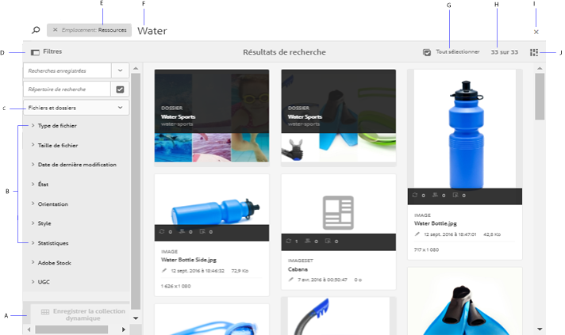
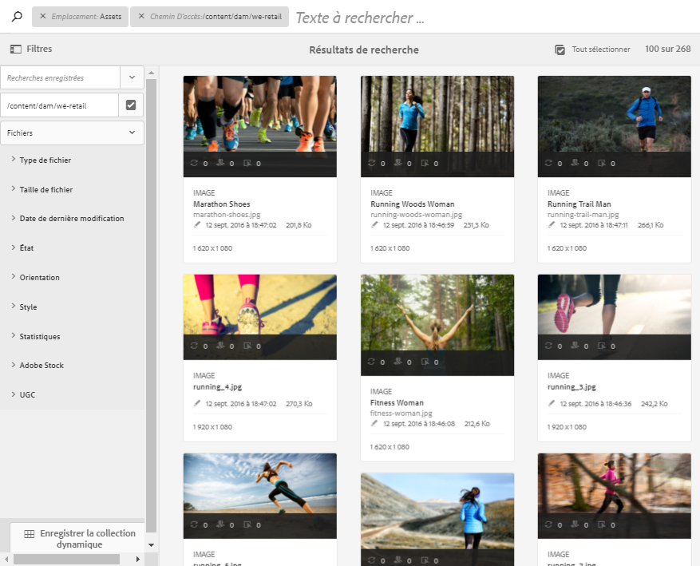
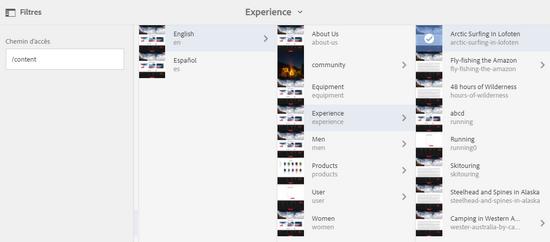

# Recherche de ressources dans AEM  {#search-assets-in-aem}

Vous pouvez passer à la vitesse supérieure en matière de contenu à l’aide des options conviviales de découverte de ressources dans Experience Manager. Vos équipes peuvent réduire les délais de mise sur le marché grâce à une expérience de recherche intelligente et transparente, aux fonctionnalités prêtes à l’emploi et aux méthodes personnalisées. La recherche de ressources est essentielle pour l’utilisation d’un système de gestion des ressources numériques, que ce soit pour une utilisation plus poussée par les créatifs, pour une gestion robuste des ressources par les utilisateurs et spécialistes marketing ou pour l’administration par les administrateurs DAM. Les recherches simples, avancées et personnalisées que vous pouvez effectuer via l’interface utilisateur d’AEM Assets ou d’autres applications et surfaces permettent de répondre à ces cas d’utilisation.

AEM prend en charge les cas d’utilisation suivants dont cet article décrit l’utilisation, les concepts, les configurations, les limitations et le dépannage.

| Recherche de ressources | Configuration et administration | Utilisation des résultats de recherche |
|--- |--- |--- |
| [Recherches de base](#searchbasics) | [Index de recherche](#searchindex) | [Tri des résultats](#sort) |
| [Présentation de l’interface utilisateur de recherche](#searchui) |  | [Vérification des propriétés et des métadonnées d’une ressource](#checkinfo) |
| [Suggestions de recherche](#searchsuggestions) | [Métadonnées obligatoires](#mandatorymetadata) | [Téléchargement](#download) |
| [Présentation des résultats de recherche et du comportement](#searchbehavior) | [Modification des facettes de recherche](#searchfacets) | [Mises à jour des métadonnées en masse](#metadataupdates) |
| [Classement et amplification des recherches](#searchrank) | [Extraction de texte](#extracttextupload) | [Collections dynamiques](#collections) |
| [Recherche avancée : filtrage et portée de la recherche](#scope) | [Prédicats personnalisés](#custompredicates) | [Présentation des résultats inattendus](#unexpectedresults) et [dépannage](#troubleshoot) |
| [Recherche à partir d’autres solutions et applications](#beyondomnisearch) :   [Asset Link](#aal)   [Application de bureau](#desktopapp)       [Images Adobe Stock](#adobestock)       [Ressources Dynamic Media](#dynamicmedia) |  |  |
| [Sélecteur de ressources](#assetselector) |  |  |
| [Limites](#tips) et [conseils](#limitations) |  |  |
| [Exemples illustrés](#samples) |  |  |

Recherchez des ressources à l’aide du champ Omni-recherche situé en haut de l’interface web d’AEM. Accédez à **[!UICONTROL Ressources]** > **[!UICONTROL Fichiers]** dans AEM, cliquez sur  dans la barre supérieure, entrez le mot-clé de recherche et appuyez sur Retour. Vous pouvez également utiliser le raccourci `/` (barre oblique) pour ouvrir le champ Omni-recherche. `Location:Assets` est présélectionné afin de limiter les recherches aux ressources de la gestion des ressources numériques. Vous pouvez effectuer des recherches avancées de façon à augmenter ou limiter la [portée de recherche](#scope).

Utilisez le panneau **[!UICONTROL Filtres]** pour rechercher des ressources, des dossiers, des balises et des métadonnées. Vous pouvez filtrer les résultats de recherche en fonction des différentes options (prédicats), telles que le type et la taille de fichier, la date de dernière modification, l’état de la ressource, les données de renseignement et les licences Adobe Stock. Vous pouvez personnaliser le panneau Filtres et ajouter/supprimer des prédicats de recherche à l’aide des [facettes de recherche](/help/assets/search-facets.md).

La fonctionnalité de recherche AEM prend en charge la recherche de collections et la recherche de ressources dans une collection. Voir [Recherche de collections](/help/assets/manage-collections.md).

## Présentation de l’interface de recherche {#searchui}

Familiarisez-vous avec l’interface de recherche et les actions disponibles.

*Figure :* Présentation des éléments de l’interface des résultats de la recherche Assets

**A.** Enregistrer la recherche en tant que collection dynamique. **B.** Filtres (prédicats) pour limiter les résultats de recherche. **C.** Afficher les fichiers, les dossiers ou les deux dans les résultats de recherche. **D.** Cliquer sur Filtres pour ouvrir ou fermer le rail de gauche. **E.** L’emplacement de recherche est la gestion des ressources numériques. **F.** Champ Omni-recherche avec le mot-clé de recherche fourni par l’utilisateur. **G.** Cocher cette case pour sélectionner tous les résultats de recherche. **H.** Nombre de résultats de recherche affichés sur le total des résultats de recherche. **I.** Fermer la recherche. **J.** Basculer entre le mode Carte et le mode Liste.

### Facettes de recherche dynamique {#dynamicfacets}

Vous pouvez découvrir plus rapidement les ressources de votre choix à partir de la page des résultats de recherche en utilisant le nombre de résultats de recherche attendus mis à jour dynamiquement dans les facettes de recherche. Le nombre prévu de ressources est mis à jour avant même d’appliquer le filtre de recherche. L’affichage du nombre prévu par rapport au filtre vous aide à parcourir rapidement et efficacement les résultats de la recherche. Pour plus d’informations, voir [Recherche de ressources dans AEM](/help/assets/search-assets.md).

Affichage du nombre approximatif de ressources sans filtrer les résultats de la recherche dans les facettes de recherche.

## Suggestions de recherche en cours de frappe {#searchsuggestions}

Lorsque vous commencez à saisir un mot-clé, AEM suggère les mots-clés ou expressions de recherche possibles. Les suggestions sont basées sur les ressources dans AEM. AEM indexe tous les champs de métadonnées pour faciliter la recherche. Pour fournir des suggestions de recherche, le système utilise les valeurs des quelques champs de métadonnées suivants. Pour fournir des suggestions de recherche, pensez à renseigner les champs suivants avec les mots-clés appropriés :

* Balises de ressources. (mappage avec `jcr:content/metadata/cq:tags`)
* Titre de la ressource. (mappage avec `jcr:content/metadata/dc:title`)
* Description de la ressource. (mappage avec `jcr:content/metadata/dc:description`)
* Titre dans le référentiel JCR. La valeur peut être mappée au titre de la ressource. (mappage avec `jcr:content/jcr:title`)
* Description dans le référentiel JCR. La valeur peut être mappée à la description de la ressource. (mappage avec `jcr:content/jcr:description`)

## Présentation des résultats de recherche et du comportement {#searchbehavior}

### Termes et résultats de recherche de base {#searchbasics}

Vous pouvez exécuter des recherches de mots-clés à partir du champ Omni-recherche. La recherche de mots-clés n’est pas sensible à la casse et il s’agit d’une recherche en texte intégral (dans les champs de métadonnées courants). Si plusieurs mots-clés sont utilisés, `AND` est l’opérateur par défaut entre les mots-clés. Les résultats sont triés par pertinence, en commençant par les correspondances les plus proches. Pour plusieurs mots-clés, les ressources qui contiennent les deux termes dans leurs métadonnées génèrent des résultats plus pertinents. Dans les métadonnées, les mots-clés qui apparaissent sous forme de balises intelligentes sont classés plus haut que les mots-clés qui apparaissent dans d’autres champs de métadonnées.

AEM permet de donner plus de poids à un terme de recherche particulier. Il est également possible d’améliorer le classement de quelques ressources ciblées pour des termes de recherche spécifiques. Les administrateurs AEM peuvent effectuer ces configurations comme décrit ci-dessous.

Pour rechercher rapidement les ressources appropriées, l’interface riche fournit des mécanismes de filtrage, de tri et de sélection. Vous pouvez filtrer les résultats selon plusieurs critères et afficher le nombre de ressources recherchées pour différents filtres. Vous pouvez également réexécuter la recherche en modifiant la requête dans le champ Omni-recherche. Lorsque vous modifiez les termes ou filtres de recherche, les autres filtres restent appliqués pour préserver le contexte de la recherche.

Il arrive que des ressources inattendues apparaissent dans les résultats de la recherche. Pour plus d’informations, voir [Résultats inattendus](#unexpectedresults).

AEM peut effectuer des recherches dans de nombreux formats de fichiers et les filtres de recherche peuvent être personnalisés en fonction des besoins de votre entreprise. Contactez vos administrateurs pour savoir quelles options de recherche sont mises à disposition pour votre référentiel de gestion des ressources numériques et quelles restrictions votre connexion peut comporter.

<!-- 
### Results with and without Enhanced Smart Tags {#withsmarttags}

By default, AEM search combines the search terms with an AND clause. For example, consider searching for keywords woman running. Only the assets with both woman and running keywords in the metadata appear in the search results by default. The same behavior is retained when special characters (periods, underscores, or dashes) are used with the keywords. The following search queries return the same results:

* `woman running`
* `woman.running`
* `woman-running`

However, the query `woman -running` returns assets without `running` in their metadata.
Using smart tags adds an extra `OR` clause to find any of the search terms as the applied smart tags. An asset tagged with either `woman` or `running` using Smart Tags also appear in such a search query. So the search results are a combination of,

* Assets with `woman` and `running` keywords in the metadata (default behavior).

* Assets smart tagged with either of the keywords (Smart Tags behavior).
-->

### Classement et amplification des recherches {#searchrank}

Les résultats de recherche qui correspondent à tous les termes de recherche dans les champs de métadonnées s’affichent en premier, suivis des résultats de recherche correspondant à l’un des termes de recherche des balises dynamiques. Dans l’exemple ci-dessus, l’ordre approximatif de l’affichage des résultats de recherche est le suivant :

1. Correspondances de `woman running` dans les différents champs de métadonnées.
1. Correspondances de `woman running` dans les balises intelligentes.
1. Correspondances de `woman` ou de `running` dans les balises intelligentes.

Vous pouvez améliorer la pertinence des mots-clés pour des ressources données afin d’améliorer les résultats de recherches basées sur ces mots-clés. En d’autres termes, les images pour lesquelles vous faites la promotion de mots-clés spécifiques apparaissent en haut des résultats lorsque vous lancez une recherche basée sur ces mots-clés.

1. Dans l’interface utilisateur d’Assets, ouvrez la page des propriétés de la ressource. Cliquez sur **[!UICONTROL Avancé]** et cliquez/appuyez sur **[!UICONTROL Ajouter]** sous **[!UICONTROL Élever pour les mots-clés de recherche]**.
1. Dans la boîte de dialogue **[!UICONTROL Rechercher une promotion]**, indiquez un mot-clé pour lequel vous souhaitez améliorer la recherche d’image, puis cliquez/appuyez sur **[!UICONTROL Ajouter]**. Vous pouvez indiquer plusieurs mots-clés de la même manière.
1. Cliquez/appuyez sur **[!UICONTROL Enregistrer et fermer]**. La ressource pour laquelle vous avez promu ce mot-clé apparaît en tête des résultats de recherche.

Vous pouvez l’utiliser à votre avantage en améliorant le classement de certaines ressources dans les résultats de recherche du mot-clé ciblé. Voir la vidéo d’exemple ci-dessous. Pour plus d’informations, voir [Recherche dans AEM](https://helpx.adobe.com/fr/experience-manager/kt/help/assets/search-feature-video-use.html).

>[!VIDEO](https://video.tv.adobe.com/v/16766/?quality=6)

*Découvrez comment les résultats de recherche sont classés et comment le classement peut être influencé.*

## Recherche avancée {#scope}

AEM fournit diverses méthodes, telles que des filtres qui s’appliquent aux ressources recherchées, pour vous aider à localiser plus rapidement les ressources qu’il vous faut. Quelques méthodes fréquemment utilisées sont décrites ci-dessous. Vous trouverez ci-dessous plusieurs [exemples illustrés](#samples).

**Recherche de fichiers ou de dossiers** : dans les résultats de recherche, reportez-vous aux fichiers, aux dossiers ou aux deux. Dans le panneau **[!UICONTROL Filtres]**, vous pouvez sélectionner l’option appropriée. Voir [Interface de recherche](#searchui).

**Recherche de ressources dans un dossier** : vous pouvez limiter la recherche à un dossier spécifique. Dans le panneau **[!UICONTROL Filtres]**, ajoutez le chemin d’un dossier. Vous ne pouvez sélectionner qu’un dossier à la fois.

Limitation des résultats de recherche à un dossier en ajoutant un chemin de dossier dans le panneau Filtres

<!--
### Find similar images {#visualsearch}

To find images that are visually similar to a user-selected image, click **[!UICONTROL Find Similar]** option from the card view of an image or from the toolbar. AEM displays the smart tagged images from the DAM repository that are similar to a user-selected image. See [how to configure similarity search](#configvisualsearch).

*Figure: Find similar images using the option in the card view*
-->

### Images Adobe Stock {#adobestock}

Dans l’interface utilisateur AEM, les utilisateurs peuvent rechercher des [ressources Adobe Stock](/help/assets/aem-assets-adobe-stock.md) et obtenir des licences pour les ressources requises. Ajoutez `Location: Adobe Stock` dans la barre Omni-recherche. Vous pouvez également utiliser le panneau Filtres pour trouver toutes les ressources qui sont ou non sous licence, ou effectuer des recherches dans une ressource spécifique à l’aide du numéro de fichier Adobe Stock.

### Ressources Dynamic Media {#dmassets}

Vous pouvez filtrer les images Dynamic Media en sélectionnant **[!UICONTROL Dynamic Media > Visionneuses]** dans le panneau **[!UICONTROL Filtres]**. Il filtre et affiche des ressources telles que des visionneuses d’images, des carrousels, des visionneuses de supports variés et des visionneuses à 360°.

### Recherche de valeurs spécifiques dans les champs de métadonnées {#gqlsearch}

Vous pouvez rechercher des ressources en fonction des valeurs exactes de champs de métadonnées spécifiques, tels que le titre, la description et l’auteur. La fonction de recherche en texte intégral GQL récupère uniquement les ressources dont la valeur de métadonnées correspond exactement à votre requête. Les noms des propriétés (auteur, titre, etc.) et les valeurs sont sensibles à la casse.

| Champ de métadonnées | Valeur et utilisation des facettes |
|---|---|
| Titre | title:John |
| Créateur | creator:John |
| Emplacement | location:NA |
| Description | description:&quot;Sample Image&quot; |
| Outil créateur | creatortool:&quot;Adobe Photoshop CC 2015&quot; |
| Détenteur de copyright | copyrightowner:&quot;Adobe Systems&quot; |
| Contributeur | contributor:John |
| Conditions d’utilisation | usageterms:&quot;CopyRights Reserved&quot; |
| Créé | created:AAAA-MM-JJTHH |
| Date d’expiration | expires:AAAA-MM-JJTHH |
| Heure d’activation | ontime:AAAA-MM-JJTHH |
| Heure de désactivation | offtime:AAAA-MM-JJTHH |
| Intervalle de temps (expires dateontime, offtime) | facet field : lowerboundupperbound |
| Chemin | /content/dam/&lt;nom_dossier> |
| Titre du PDF | pdftitle:&quot;Adobe Document&quot; |
| Objet | subject:&quot;Training&quot; |
| Balises | tags:&quot;Location And Travel&quot; |
| Type | type:&quot;image\png&quot; |
| Largeur de l’image | width:lowerboundupperbound |
| Hauteur de l’image | height:lowerboundupperbound |
| Personne | person:John |

Les propriétés path, limit, size et orderby ne peuvent pas être combinées à une autre propriété avec un opérateur OU.

Le mot-clé d’une propriété générée par un utilisateur correspond au libellé de son champ dans l’éditeur de propriétés en minuscules et sans espace.

Voici quelques exemples de formats de recherche pour des requêtes complexes :

* Pour afficher toutes les ressources avec plusieurs champs de facettes (par exemple : title=John Doe et creator tool=Adobe Photoshop) :  `title:"John Doe" creatortool : Adobe*`
* Pour afficher toutes les ressources lorsque la valeur de la facette est une expression et non un seul mot (par exemple : le titre est Scott Reynolds) : `title:"Scott Reynolds"`
* Pour afficher les ressources avec plusieurs valeurs d’une seule propriété (le titre est Scott Reynolds ou John Doe, par exemple) : `title:"Scott Reynolds" OR "John Doe"`
* Pour afficher les ressources avec des valeurs de propriété commençant par une chaîne spécifique (par exemple : le titre est Scott Reynolds) : `title:Scott*`
* Pour afficher les ressources avec des valeurs de propriété se terminant par une chaîne spécifique (par exemple : le titre est Scott Reynolds) : `title:*Reynolds`
* Pour afficher les ressources avec une valeur de propriété contenant une chaîne spécifique (par exemple : le titre est Basel Meeting Room) : `title:*Meeting*`
* Pour afficher les ressources qui contiennent une chaîne spécifique et qui possèdent une valeur de propriété en particulier (par exemple : rechercher une chaîne Adobe parmi les ressources dont le titre est John Doe) : `*Adobe* title:"John Doe"`

## Recherche de ressources à partir d’autres offres ou interfaces AEM {#beyondomnisearch}

Adobe Experience Manager (AEM) connecte le référentiel de gestion des ressources numériques à d’autres solutions AEM afin de fournir un accès plus rapide aux ressources numériques et de rationaliser les workflows de création. Toute découverte de ressources commence par la navigation ou la recherche. Le comportement de recherche reste largement le même sur les différentes surfaces et solutions. Certaines méthodes de recherche changent lorsque le public cible, les cas d’utilisation et l’interface utilisateur varient d’une solution AEM à l’autre. Les méthodes spécifiques sont documentées pour les solutions individuelles dans les liens ci-dessous. Les conseils et comportements universellement applicables sont décrits dans cet article.

### Recherche de ressources à partir du panneau Adobe Asset Link {#aal}

Grâce à Adobe Asset Link, les professionnels de la création peuvent désormais accéder au contenu stocké dans AEM Assets, sans quitter les applications Adobe Creative Cloud prises en charge. Ils peuvent parcourir, rechercher, extraire et archiver des ressources de manière transparente à l’aide du panneau intégré à l’application dans les applications Creative Cloud : Photoshop, Illustrator et InDesign. Asset Link permet également aux utilisateurs de rechercher des résultats visuellement similaires. Les résultats d’affichage de la recherche visuelle sont optimisés par les algorithmes d’apprentissage automatique d’Adobe Sensei et aident les utilisateurs à trouver des images à l’esthétique similaire. Voir [Rechercher et parcourir des ressources](https://helpx.adobe.com/fr/enterprise/using/manage-assets-using-adobe-asset-link.html#UseAdobeAssetLink) à l’aide d’Adobe Asset Link.

### Recherche de ressources dans l’application de bureau AEM {#desktopapp}

Les professionnels de la création utilisent l’application de bureau pour rendre les ressources AEM facilement consultables et disponibles sur leur bureau local (Windows ou Mac). Les créatifs peuvent facilement afficher les ressources souhaitées dans le Finder du Mac ou l’Explorateur Windows, ouvertes dans des applications de bureau et modifiées localement ; les modifications sont réenregistrées dans AEM avec une nouvelle version créée dans le référentiel. L’application prend en charge les recherches de base à l’aide d’un ou de plusieurs mots-clés, les caractères génériques * et ? et l’opérateur ET. Voir [Navigation, recherche et prévisualisation des ressources](https://docs.adobe.com/content/help/fr-FR/experience-manager-desktop-app/using/using.html#browse-search-preview-assets) dans l’application de bureau.

### Recherche de ressources dans Brand Portal {#brandportal}

Les utilisateurs métiers et les spécialistes marketing utilisent Brand Portal pour partager efficacement et en toute sécurité les ressources numériques approuvées avec leurs équipes internes étendues, partenaires et revendeurs. Voir [Recherche de ressources sur Brand Portal](https://docs.adobe.com/content/help/fr-FR/experience-manager-brand-portal/using/search-capabilities/brand-portal-searching.html).

### Recherche d’images Adobe Stock {#adobestock-1}

Dans l’interface utilisateur AEM, les utilisateurs peuvent rechercher des ressources Adobe Stock et obtenir des licences pour les ressources requises. Ajoutez `Location: Adobe Stock` dans le champ Omni-recherche. Vous pouvez également utiliser le panneau **[!UICONTROL Filtres]** pour trouver toutes les ressources qui sont ou non sous licence, ou effectuer des recherches dans une ressource spécifique à l’aide du numéro de fichier Adobe Stock. Voir [Gestion des images Adobe Stock dans AEM](/help/assets/aem-assets-adobe-stock.md#usemanage).

### Recherche de ressources Dynamic Media {#dynamicmedia}

Vous pouvez filtrer les images Dynamic Media en sélectionnant **[!UICONTROL Dynamic Media]** > **[!UICONTROL Visionneuses]** dans le panneau **[!UICONTROL Filtres]**. Il filtre et affiche des ressources telles que des visionneuses d’images, des carrousels, des visionneuses de supports variés et des visionneuses à 360°. Lors de la création de pages web, les auteurs peuvent rechercher des visionneuses dans l’outil de recherche de contenu. Un filtre est disponible pour les visionneuses dans un menu contextuel.

### Recherche de ressources dans l’outil de recherche de contenu lors de la création de pages web {#contentfinder}

Les auteurs peuvent utiliser l’outil de recherche de contenu pour rechercher les ressources appropriées dans le référentiel de gestion des ressources numériques et les utiliser dans les pages web qu’ils créent.

<!-- Authors can also use the Connected Assets functionality to search for assets that are available on a remote AEM deployment. Authors can then use these assets in web pages on a local AEM deployment. See [use remote assets](use-assets-across-connected-assets-instances.md#use-remote-assets).
-->

### Recherche de collections {#collections}

La fonctionnalité de recherche AEM prend en charge la recherche de collections et la recherche de ressources dans une collection. Voir [Recherche de collections](/help/assets/manage-collections.md).

## Sélecteur de ressources {#assetselector}

Le sélecteur de ressources vous permet de rechercher, de filtrer et de parcourir les ressources de la gestion des ressources numériques de façon spéciale. Le sélecteur de ressources est disponible à l’adresse `https://[aem_server]:[port]/aem/assetpicker.html`. Vous pouvez récupérer les métadonnées des ressources sélectionnées à l’aide du sélecteur de ressources. Vous pouvez le lancer avec les paramètres de requête pris en charge, tels que le type de ressource (image, vidéo, texte) et le mode de sélection (sélections simples ou multiples). Ces paramètres définissent le contexte du sélecteur de ressources pour une instance de recherche particulière et restent inchangés tout au long de la sélection.

Le sélecteur de ressources utilise le message HTML5 `Window.postMessage` pour envoyer au destinataire les données correspondant à la ressource sélectionnée. Le sélecteur de ressources utilise le vocabulaire d’interface foundation picker de Granite. Par défaut, le sélecteur de ressources fonctionne en mode Navigation.

Vous pouvez transmettre les paramètres de requête suivants dans une URL pour démarrer le sélecteur de ressources dans un contexte spécifique :

| Nom | Valeurs | Exemple | Objectif |
|---|---|---|---|
| suffixe de la ressource (B) | Chemin d’accès au dossier indiqué comme suffixe de la ressource dans l’URL :[https://localhost:4502/aem/assetpicker.html/&lt;chemin_dossier>](https://localhost:4502/aem/assetpicker.html) | Pour démarrer le sélecteur de ressources avec un dossier particulier sélectionné, par exemple avec le dossier /content/dam/we-retail/en/activities sélectionné, l’URL doit avoir la forme suivante : [https://localhost:4502/aem/assetpicker.html/content/dam/we-retail/en/activities?assettype=images](https://localhost:4502/aem/assetpicker.html/content/dam/we-retail/en/activities?assettype=images) | Si vous avez besoin de sélectionner un dossier en particulier au démarrage du sélecteur de ressources, vous pouvez l’indiquer comme suffixe de ressource. |
| mode | single, multiple | [https://localhost:4502/aem/assetpicker.html?mode=multiplehttps://localhost:4502/aem/assetpicker.html?mode=single](https://localhost:4502/aem/assetpicker.html?mode=multiplehttps://localhost:4502/aem/assetpicker.html?mode=single) | En mode multiple, vous pouvez sélectionner plusieurs ressources simultanément à l’aide du sélecteur de ressources. |
| mimetype | Type(s) MIME (`/jcr:content/metadata/dc:format`) d’une ressource (le caractère générique est également pris en charge) | <ul><li>[https://localhost:4502/aem/assetpicker.html?mimetype=image/png](https://localhost:4502/aem/assetpicker.html?mimetype=image/png)</li><li>[https://localhost:4502/aem/assetpicker.html?mimetype=*png](https://localhost:4502/aem/assetpicker.html?mimetype=*png)</li><li>[https://localhost:4502/aem/assetpicker.html?mimetype=*presentation](https://localhost:4502/aem/assetpicker.html?mimetype=*presentation)</li><li>[https://localhost:4502/aem/assetpicker.html?mimetype=*presentation&amp;mimetype=*png](https://localhost:4502/aem/assetpicker.html?mimetype=*presentation&amp;mimetype=*png)</li></ul> | Utilisez-le pour filtrer les ressources basées sur le(s) type(s) de MIME |
| dialog | true, false | [https://localhost:4502/aem/assetpicker.html?dialog=true](https://localhost:4502/aem/assetpicker.html?dialog=true) | Utilisez ces paramètres pour ouvrir le sélecteur de ressources en tant que boîte de dialogue Granite. Cette option ne peut être appliquée qu’au démarrage du sélecteur de ressources via le champ Chemin de Granite, en la configurant comme URL pickerSrc. |
| assettype (S) | images, documents, multimedia, archives | <ul><li>[https://localhost:4502/aem/assetpicker.html?assettype=images](https://localhost:4502/aem/assetpicker.html?assettype=images)</li><li>[https://localhost:4502/aem/assetpicker.html?assettype=documents](https://localhost:4502/aem/assetpicker.html?assettype=documents)</li><li>[https://localhost:4502/aem/assetpicker.html?assettype=multimedia](https://localhost:4502/aem/assetpicker.html?assettype=multimedia)</li><li>[https://localhost:4502/aem/assetpicker.html?assettype=archives](https://localhost:4502/aem/assetpicker.html?assettype=archives)</li></ul> | Utilisez cette option pour filtrer les types de ressources en fonction de la valeur indiquée. |
| root | &lt;chemin_dossier> | [https://localhost:4502/aem/assetpicker.html?assettype=images&amp;root=/content/dam/we-retail/en/activities](https://localhost:4502/aem/assetpicker.html?assettype=images&amp;root=/content/dam/we-retail/en/activities) | Utilisez cette option pour spécifier le dossier racine du sélecteur de ressources. Ici, le sélecteur de ressources ne vous permet de sélectionner qu’une seule ressource enfant (directe/indirecte) sous le dossier racine. |

Pour accéder à l’interface du sélecteur de ressources, accédez à `https://[AEM server]:[port]/aem/assetpicker`. Recherchez le dossier souhaité, puis sélectionnez une ou plusieurs ressources. Vous pouvez également rechercher la ressource souhaitée dans la zone Omni-recherche, appliquer un filtre selon vos besoins, puis la sélectionner.

Parcourir et sélectionner une ressource dans le sélecteur de ressources

## Restrictions {#limitations}

La fonctionnalité de recherche dans AEM Assets présente les restrictions suivantes :

* N’entrez pas d’espace de début dans la requête, sinon la recherche ne fonctionne pas.
* AEM peut continuer à afficher le terme de recherche une fois que vous avez sélectionné les propriétés d’une ressource à partir des résultats de recherche, puis annuler la recherche (CQ-4273540).
* Lors de la recherche de dossiers ou de fichiers et de dossiers, les résultats de recherche ne peuvent être triés selon aucun paramètre.
* Si vous appuyez sur Entrée sans rien taper dans la barre Omni-recherche, AEM renvoie une liste contenant uniquement des fichiers et non des dossiers. Si vous recherchez spécifiquement des dossiers sans utiliser de mot-clé, AEM ne renvoie aucun résultat.

La recherche visuelle ou par analogie présente les restrictions suivantes :

* La recherche visuelle fonctionne mieux avec les référentiels plus volumineux. Bien qu’il n’y ait pas de nombre minimal d’images requis pour obtenir de bons résultats, la qualité des correspondances avec quelques images peut ne pas être aussi bonne qu’avec un référentiel de taille plus conséquente.
* Vous ne pouvez pas modifier le modèle ni entraîner AEM à rechercher des images similaires. Par exemple, l’ajout ou la suppression de balises intelligentes dans quelques ressources ne modifie pas le modèle. Les ressources sont exclues des résultats de recherche visuellement similaires.

## Conseils de recherche {#tips}

* Si vous surveillez l’état de révision des ressources, utilisez l’option appropriée pour trouver les ressources qui sont approuvées ou en attente d’approbation.
* Utilisez le prédicat Statistiques pour rechercher les ressources prises en charge en fonction de leurs statistiques d’utilisation obtenues auprès de diverses applications Creative. Les données d’utilisation sont regroupées sous Note d’utilisation, Impressions, Clics et Canaux de médias où les ressources apparaissent dans des catégories.
* Utilisez la case à cocher pour sélectionner tous les résultats de recherche ou les résultats de recherche filtrés à appliquer à la sélection. Elle sélectionne toutes les ressources recherchées, quel que soit le nombre de ressources affichées dans la vue utilisateur actuelle. Par exemple, vous pouvez télécharger toutes les ressources sélectionnées, mettre à jour les propriétés de métadonnées en masse pour toutes les ressources sélectionnées ou ajouter les ressources sélectionnées à une collection.
* Pour rechercher les ressources qui ne contiennent pas les métadonnées obligatoires, voir [Métadonnées obligatoires](#mandatorymetadata).
* La recherche utilise tous les champs de métadonnées. Une recherche générique, telle que la recherche du nombre 12, renvoie généralement de nombreux résultats. Pour de meilleurs résultats, utilisez des guillemets doubles (et non des guillemets simples) ou assurez-vous que le nombre est attaché à un mot sans caractère spécial (par exemple, *chaussure12*).
* La recherche de texte intégral prend en charge des opérateurs tels que -, ^, etc. Pour rechercher des informations sous forme de chaînes littérales, indiquez la phrase de recherche entre guillemets. Par exemple, entrez « Notebook - Beauté » au lieu de Notebook - Beauté.
* Si les résultats de recherche sont trop nombreux, limitez la [portée de la recherche](#scope) pour trouver les ressources souhaitées. Cela fonctionne mieux lorsque vous avez une idée de la meilleure manière de rechercher les ressources que vous recherchez, par exemple un type de fichier, un emplacement ou des métadonnées spécifiques.

* **Balisage** : les balises permettent de classer les ressources pour une navigation et une recherche plus efficaces. Le balisage permet de propager la taxonomie appropriée à d’autres utilisateurs et workflows. AEM propose des méthodes pour baliser automatiquement les ressources à l’aide des services d’intelligence artificielle d’Adobe Sensei, qui améliorent constamment le balisage de vos ressources au fil de l’utilisation et de l’entraînement. Lorsque vous recherchez des ressources, les balises intelligentes sont prises en compte si la fonction est activée sur votre compte. Cela fonctionne avec la fonctionnalité de recherche intégrée. Voir [Comportement de la recherche](#searchbehavior). Pour optimiser l’ordre d’affichage des résultats de recherche, vous pouvez [améliorer le classement](#searchrank) de quelques ressources sélectionnées.

* **Indexation** : seules les métadonnées et les ressources indexées sont renvoyées dans les résultats de recherche. Pour une meilleure couverture et de meilleures performances, veillez à une indexation appropriée et suivez les bonnes pratiques. Voir [Indexation](#searchindex).

## Quelques exemples illustrant la recherche {#samples}

Utilisez des guillemets doubles autour des mots-clés pour rechercher des ressources contenant exactement l’expression dans l’ordre exact spécifié par l’utilisateur.

Comportement de recherche avec et sans guillemets

**Recherche avec un caractère générique (astérisque)** : pour élargir la recherche, utilisez un astérisque avant ou après le mot recherché afin de faire correspondre n’importe quel nombre de caractères. Par exemple, la recherche du mot run sans astérisque ne renvoie pas les ressources contenant une variante du mot (y compris dans les métadonnées). L’astérisque remplace n’importe quel nombre de caractères. Par exemple :

* `run` renvoie les ressources contenant exactement le mot-clé « run ».
* `run*` renvoie les ressources concernant « running », « run », « runaway », etc.
* `*run` renvoie « outrun », « rerun », etc.
* `*run*` renvoie toutes les combinaisons possibles.

Exemple d’utilisation d’un caractère générique (astérisque) dans la recherche de ressources

**Recherche avec un caractère générique (point d’interrogation)** : pour élargir la recherche, utilisez un ou plusieurs caractères « ? » pour correspondre au nombre exact de caractères. Par exemple, dans l’illustration suivante :

* la requête `run???` ne correspond à aucune ressource ;

* la requête `run????` correspond au mot `running` avec quatre caractères après `run` ;

* la requête `??run` correspond au mot `rerun` avec deux caractères avant `run`.

Exemple d’utilisation d’un caractère générique (point d’interrogation) dans la recherche de ressources

**Exclusion d’un mot-clé** : utilisez le tiret pour rechercher des ressources qui ne contiennent pas de mot-clé. Par exemple, la requête `running -shoe` renvoie les ressources qui contiennent `running`, mais pas `shoe`. De même, la requête `camp -night` renvoie les ressources qui contiennent `camp`, mais pas `night`. Notez que la requête `camp-night` renvoie les ressources qui contiennent à la fois `camp` et `night`.

*Figure : Utilisation du tiret pour rechercher des ressources ne contenant pas de mot-clé exclu*

<!--
## Configuration and administration tasks related to search functionality {#configadmin}

### Search index configurations {#searchindex}

Asset discovery relies on indexing of DAM contents, including the metadata. Faster and accurate asset discovery relies on optimized indexing and appropriate configurations. See [indexing](/help/operations/indexing.md).

<!--
### Visual or similarity search {#configvisualsearch}

Visual search uses smart tagging and requires AEM 6.5.2.0 or later. After configuring smart tagging functionality, follow these steps.

1. In AEM CRXDE, in `/oak:index/lucene` node, add the following properties and values and save the changes.

    * `costPerEntry` property of type `Double` with the value `10`.

    * `costPerExecution` property of type `Double` with the value `2`.

    * `refresh` property of type `Boolean` with the value `true`.

   This configuration allows searches from the appropriate index.

1. To create Lucene index, in CRXDE, at `/oak:index/damAssetLucene/indexRules/dam:Asset/properties`, create node named `imageFeatures` of type `nt-unstructured`. In `imageFeatures` node,

    * Add `name` property of type `String` with the value `jcr:content/metadata/imageFeatures/haystack0`.

    * Add `nodeScopeIndex` property of type `Boolean` with the value of `true`.

    * Add `propertyIndex` property of type `Boolean` with the value of `true`.

    * Add `useInSimilarity` property of type `Boolean` with the value `true`.

   Save the changes.

1. Access `/oak:index/damAssetLucene/indexRules/dam:Asset/properties/predictedTags` and add `similarityTags` property of type `Boolean` with the value of `true`.
1. Apply Smart Tags to the assets in your AEM repository. See [how to configure smart tags](https://docs.adobe.com/content/help/en/experience-manager-learn/assets/metadata/smart-tags-technical-video-setup.html).
1. In CRXDE, in `/oak-index/damAssetLucene` node, set the `reindex` property to `true`. Save the changes.
1. (Optional) If you have customized search form then copy the `/libs/settings/dam/search/facets/assets/jcr%3Acontent/items/similaritysearch` node to `/conf/global/settings/dam/search/facets/assets/jcr:content/items`. Save all the changes.

For related information, see [understand smart tags in AEM](https://helpx.adobe.com/experience-manager/kt/help/assets/smart-tags-feature-video-understand.html) and [how to manage smart tags](/help/assets/smart-tags.md).

-->

<!--
### Mandatory metadata {#mandatorymetadata}

Business users, administrators, or DAM librarians can define some metadata as mandatory metadata that is a must for the business processes to work. For various reasons, some assets may be missing this metadata, such as legacy assets or assets migrated in bulk. Assets with missing or invalid metadata are detected and reported based on the indexed metadata property. To configure it, see [mandatory metadata](/help/assets/metadata-schemas.md#defining-mandatory-metadata).

### Modify search facets {#searchfacets}

To improve the speed of discovery, AEM Assets offers search facets using which you can filter the search results. The Filters panel includes a few standard facets by default. Administrators can customize the Filters panel to modify the default facets using the in-built predicates. AEM provides a good collection of in-built predicates and an editor to customize the facets. See [search facets](/help/assets/search-facets.md).

### Extract text when uploading assets {#extracttextupload}

You can configure AEM to extract the text from the assets when users upload assets, such as PSD or PDF files. AEM indexes the extracted text and helps users search these assets based on the extracted text. See [upload assets](/help/assets/manage-digital-assets.md#uploading-assets).

<!-- Check with gklebus if this customization is possible in Cloud Service now

### Custom predicates to filter search results {#custompredicates}

Predicates are used to create facets. Administrators can customize the search facets in the Filters panel using pre-configured predicates. These predicates can be customized using overlays. See [create custom predicates](/help/assets/searchx.md).

You can search for digital assets based on one or more of the following properties. Filters that apply on some of these properties are available by default and some other filters can be custom-created to apply on the other properties.

| Search field | Search property values |
|---|---|
| MIME Types | Images, Documents, Multimedia, Archives, or Other. |
| Last Modified | Hour, Day, Week, Month, or Year. |
| File Size | Small, Medium, or Large. |
| Publish Status | Published or Unpublished. |
| Approved Status | Approved or Rejected. |
| Orientation | Horizontal, Vertical, or Square. |
| Style | Color, or Black & White. |
| Video Height | Specified as a minimum and maximum value. Value is stored in the metadata of video renditions only. |
| Video Width | Specified as a minimum and maximum value. Value is stored in the metadata of video renditions only. |
| Video Format | DVI, Flash, MPEG4, MPEG, OGG Theora, QuickTime, Windows Media. Value is stored in the metadata of the source video and any renditions. |
| Video Codec | x264. Value is stored in the metadata of video renditions only. |
| Video Bitrate | Specified as a minimum and maximum value. Value is stored in the metadata of video renditions only. |
| Audio Codec | Libvorbis, Lame MP3, AAC Encoding. Value is stored in the metadata of video renditions only. |
| Audio Bitrate | Specified as a minimum and maximum value. Value is stored in the metadata of video renditions only. |

-->

## Utilisation des résultats de recherche de ressources {#aftersearch}

Une fois que vous voyez des ressources recherchées qui correspondent à vos critères, vous pouvez effectuer les tâches standard suivantes avec les résultats de recherche ou entreprendre les actions suivantes :

* Afficher les propriétés de métadonnées et d’autres informations
* Télécharger une ou plusieurs ressources
* Utiliser les actions de bureau pour ouvrir ces ressources dans l’application de bureau
* Créer des collections dynamiques

### Trier les résultats de la recherche {#sort}

Le tri des résultats de recherche vous permet de trouver plus rapidement les ressources requises. Le tri des résultats de recherche fonctionne en mode Liste et uniquement lorsque vous sélectionnez **[!UICONTROL [Fichiers](#searchui)]**dans le panneau**[!UICONTROL  Filtres ]**.[!DNL Assets]utilise le tri côté serveur pour trier rapidement toutes les ressources (quel que soit leur nombre) dans un dossier ou les résultats d’une requête. Le tri côté serveur fournit des résultats plus rapides et plus précis que le tri côté client.

En mode Liste, vous pouvez trier les résultats de recherche tout comme vous pouvez trier les ressources de n’importe quel dossier. Le tri fonctionne sur ces colonnes — Nom, Titre, État, Dimensions, Taille, Évaluation, Utilisation, (Date) Créée, (Date) Modifiée, (Date) Publiée, Workflow et Extrait.

Pour connaître les restrictions de la fonctionnalité de tri, voir [Restrictions](#limitations).

### Consultation des informations détaillées d’une ressource {#checkinfo}

Vous pouvez consulter les informations détaillées d’une ressource recherchée à partir de la page des résultats de recherche.

Pour afficher toutes les métadonnées d’une ressource, sélectionnez-la, puis cliquez sur **[!UICONTROL Propriétés]** dans la barre d’outils.

Pour consulter les commentaires sur une ressource ou son historique de versions, cliquez sur la ressource afin d’ouvrir l’aperçu de grande taille. Ouvrez la chronologie dans le rail de gauche et sélectionnez **[!UICONTROL Commentaires]** ou **[!UICONTROL Versions]**. Vous pouvez également trier l’activité de la chronologie comme les commentaires ou les versions dans un ordre chronologique.

Tri des entrées de chronologie d’une ressource recherchée

### Téléchargement des ressources recherchées {#download}

Vous pouvez télécharger les ressources recherchées et leurs rendus de la même façon que vous téléchargez des ressources ordinaires à partir de dossiers. Sélectionnez une ou plusieurs ressources dans les résultats de recherche, puis cliquez sur **[!UICONTROL Télécharger]** dans la barre d’outils.

### Mise à jour des propriétés de métadonnées en masse {#metadataupdates}

Il est possible d’effectuer des mises à jour en masse des champs de métadonnées courants de plusieurs ressources. Dans les résultats de recherche, sélectionnez une ou plusieurs ressources. Cliquez sur **[!UICONTROL Propriétés]** dans la barre d’outils et mettez à jour les métadonnées selon les besoins. Cliquez sur **[!UICONTROL Enregistrer et fermer]** lorsque vous avez terminé. Les métadonnées figurant précédemment dans les champs mis à jour sont remplacées.

Pour les ressources se trouvant dans un dossier ou une collection unique, il est plus facile de [mettre à jour les métadonnées en masse](/help/assets/manage-metadata.md#manage-assets-metadata). Pour les ressources disponibles dans plusieurs dossiers ou correspondant à un critère commun, il est plus rapide de mettre à jour les métadonnées en masse par l’intermédiaire d’une recherche.

### Collections dynamiques {#collections-1}

Une collection est un ensemble ordonné de ressources pouvant inclure des ressources provenant de différents emplacements, car les collections ne contiennent que des références à ces ressources. Les collections sont de deux types :

* Une liste de référence statique de ressources, dossiers et autres collections
* Une liste dynamique (collection dynamique) qui peuple la collection de ressources en fonction de critères de recherche

Vous pouvez créer des collections dynamiques en fonction des critères de recherche. Dans le panneau **[!UICONTROL Filtres]**, sélectionnez **[!UICONTROL Fichiers]** et cliquez sur **[!UICONTROL Enregistrer la collection dynamique]**. Voir [Gestion des collections](/help/assets/manage-collections.md).

## Résultats de recherche inattendus {#unexpectedresults}

**Recherche des métadonnées manquantes** : lors de la recherche de ressources qui ne contiennent pas les métadonnées obligatoires, AEM peut afficher certaines ressources qui possèdent des métadonnées valides. Les métadonnées manquantes sont détectées et rapportées en fonction de la propriété de métadonnées indexée. Même si les métadonnées des ressources sont réparées, elles continuent à s’afficher comme des métadonnées manquantes jusqu’à ce que la réindexation se produise. Voir [Métadonnées obligatoires](/help/assets/metadata-schemas.md#defining-mandatory-metadata).

**Trop de résultats de recherche** : pour éviter d’obtenir trop de résultats de recherche, pensez à les limiter. Par exemple, pour rechercher des ressources dans la gestion des ressources numériques, sélectionnez `Location:Assets` dans la barre Omni-recherche. Pour plus d’informations sur les filtres de recherche, voir [Portée de la recherche](#scope).

<!-- Another reason to get more than expected search results can be use of smarts tags. See [search behavior with smart tags](#withsmarttags). 
-->

<!--
**Partially related or unrelated search results**: AEM may display seemingly partially related or unrelated assets, alongside the desired assets in the search results. If you enable Enhanced Smart Tags, the search behavior changes slightly. See how it changes [after smart tagging](#withsmarttags).
-->

**Aucune suggestion de saisie semi-automatique pour les ressources nouvellement chargées** : les métadonnées (titres, balises, etc.) des ressources récemment chargées ne sont pas immédiatement disponibles en tant que suggestions lorsque vous commencez à saisir un mot-clé de recherche dans la barre Omni-recherche. AEM Assets attend jusqu’à l’expiration d’un délai d’attente (par défaut, une heure) avant d’effectuer une tâche en arrière-plan afin d’indexer les métadonnées pour toutes les ressources chargées/mises à jour dernièrement et de les ajouter à la liste de suggestions.

**Aucun résultat de recherche** : si AEM affiche une page vide pour une requête, les raisons suivantes peuvent être invoquées :

* Il n’existe aucune ressource correspondant à votre requête.
* Vous ajoutez un espace blanc avant la requête. C’est une [limitation connue](#limitations).

* Un champ de métadonnées non pris en charge contient le mot-clé que vous recherchez. Les champs de métadonnées ne sont pas tous pris en compte pour les recherches. Voir [Portée](#scope).
* L’heure d’activation et de désactivation est configurée pour la ressource et la recherche a été effectuée pendant l’heure de désactivation de la ressource.

**Le filtre/prédicat de recherche n’est pas disponible** : si une personnalisation attendue des filtres de recherche n’est pas disponible dans l’interface utilisateur, contactez votre administrateur pour vérifier si la personnalisation a été implémentée pour tous les auteurs et sur le serveur de production que vous utilisez. Il est possible que la configuration ne soit pas correcte.

## Dépannage des problèmes liés à la recherche {#troubleshoot}

Voir ci-dessous les problèmes et les solutions possibles :

* Si un filtre/prédicat de recherche attendu n’est pas visible, contactez votre administrateur.
* Lorsque vous recherchez des images visuellement similaires, il arrive qu’une image attendue ne figure pas dans les résultats de recherche. Vérifiez si ces ressources sont indexées et présentent des balises intelligentes.
* Lors de la recherche d’images visuellement similaires, il arrive qu’une image apparemment sans pertinence apparaisse dans les résultats de recherche. AEM affiche autant de ressources potentiellement pertinentes que possible. Les images moins pertinentes, le cas échéant, sont ajoutées aux résultats, mais avec un classement inférieur dans les résultats de recherche. La qualité des correspondances et la pertinence des ressources recherchées diminuent à mesure que vous descendez dans les résultats de la recherche.
