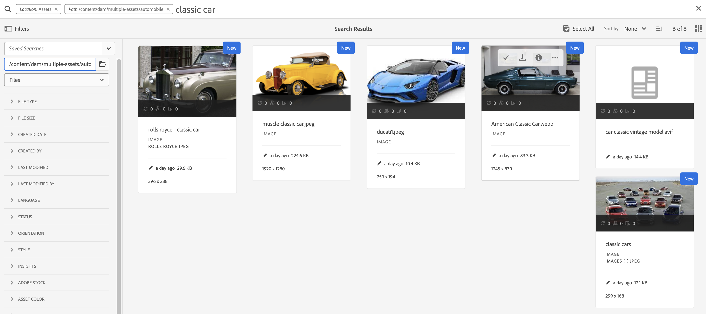
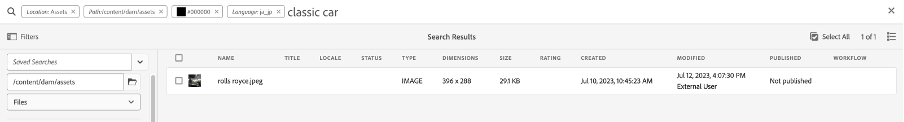
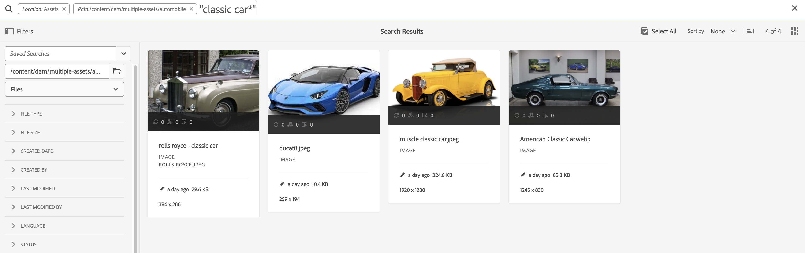

# Bonnes pratiques de recherche d’AEM Assets

<table>
    <tr>
        <td>
            <i>Nouveau</i> <a href="/help/assets/dynamic-media/dm-prime-ultimate.md"><b>Dynamic Media Prime et Ultimate</b></a>
        </td>
        <td>
            <i>Nouveau</i> <a href="/help/assets/assets-ultimate-overview.md"><b>AEM Assets Ultimate</b></a>
        </td>
        <td>
            <i>Nouvelle</i> <a href="/help/assets/integrate-aem-assets-edge-delivery-services.md"><b>Intégration d’AEM Assets à Edge Delivery Services</b></a>
        </td>
        <td>
            <i>Nouveau</i> <a href="/help/assets/aem-assets-view-ui-extensibility.md"><b>Extensibilité de l’interface utilisateur</b></a>
        </td>
          <td>
            <i>Nouveau</i> <a href="/help/assets/dynamic-media/enable-dynamic-media-prime-and-ultimate.md"><b>Activation de Dynamic Media Prime et Ultimate</b></a>
        </td>
    </tr>
    <tr>
        <td>
            <a href="/help/assets/metadata-best-practices.md"><b>Bonnes pratiques relatives aux métadonnées</b></a>
        </td>
        <td>
            <a href="/help/assets/product-overview.md"><b>Hub de contenus</b></a>
        </td>
        <td>
            <a href="/help/assets/dynamic-media-open-apis-overview.md"><b>Fonctionnalités Dynamic Media avec OpenAPI</b></a>
        </td>
        <td>
            <a href="https://developer.adobe.com/experience-cloud/experience-manager-apis/"><b>Documentation de développement pour AEM Assets</b></a>
        </td>
    </tr>
</table>

[!DNL Adobe Experience Manager Assets] fournit des méthodes robustes de découverte de ressources qui vous aident à atteindre une vitesse de contenu plus élevée. Dans certains cas, la recherche de la bonne ressource peut être difficile et longue. Par conséquent, la fonctionnalité de recherche de ressources dans [!DNL Adobe Experience Manager Assets] est essentielle pour l’utilisation d’un système de gestion des ressources numériques, que ce soit pour une utilisation plus poussée par les créatifs, pour une gestion robuste des ressources par les utilisateurs et spécialistes marketing ou pour l’administration par les administrateurs de gestion des ressources numériques.

Ce document d’aide contient les bonnes pratiques de recherche d’AEM à l’aide de divers scénarios pour aider les utilisateurs d’AEM à effectuer une recherche de base au niveau avancé.

## Accéder à la recherche Experience Manager {#access-experience-manager-search}

Voici les étapes de base à effectuer dans Experience Manager avant de commencer votre recherche :

* Dans la **vue Administration**, accédez à Assets > Fichiers dans Experience Manager et cliquez sur l’icône de recherche dans la barre supérieure. Vous pouvez également utiliser une barre oblique (/) pour ouvrir le champ Omni Recherche .
Dans la vue **Assets**, la barre de recherche est visible en haut et est directement accessible.
* `Location:Assets` et `Path:/content/dam` sont présélectionnés afin de limiter la portée de la recherche à votre référentiel Experience Manager Assets. Si vous accédez à un autre dossier, `Path:/content/dam/<folder name>` s’affiche dans le champ Recherche omni pour limiter l’étendue de la recherche au dossier actif.

## Recherche simple {#basic-search}

**Scénario 1 : effectuez une recherche de base à l’aide d’un `classic car` comme mot-clé de recherche.**

La recherche par mot-clé n’est pas sensible à la casse et consiste en une recherche de texte intégral dans les champs de métadonnées inclus dans l’index Ressource *recherche de texte intégral* (configurable dans la définition d’index). Si plusieurs mots-clés sont utilisés, **AND est l’opérateur par défaut entre les mots-clés. Par conséquent, il considère qu’une recherche pour « classic car » est « classic AND car »**.

Les résultats de recherche qui correspondent à tous les termes de recherche dans les champs de métadonnées s’affichent en premier, suivis des résultats de recherche correspondant à l’un des termes de recherche dans les balises intelligentes. L’ordre approximatif d’affichage des résultats de recherche est le suivant :

1. Correspondances de `Classic Car` dans les différents champs de métadonnées.
2. Correspondances de `Classic Car` dans les balises intelligentes.
3. Correspondances de `Classic` ou de `Car` dans les balises intelligentes.

Indiquez `classic car` comme mot-clé de recherche, puis cliquez sur Rechercher. Vous pouvez afficher les suggestions de recherche dans une liste déroulante lorsque vous saisissez le mot-clé. Les suggestions de recherche sont basées sur le contenu de l’index de recherche sur votre déploiement Experience Manager. Si vous ne pouvez pas afficher les ressources appropriées dans le menu déroulant, appuyez sur la touche Entrée pour afficher la liste des résultats. Les résultats sont triés par pertinence, en commençant par les correspondances les plus proches.

<!---->

Vous pouvez rendre la recherche plus spécifique en ajoutant votre mot-clé de recherche entre guillemets (« »). Cette recherche inclut uniquement les Assets qui contiennent ensemble les termes spécifiés. Les critères de recherche ressemblent à - `"classic car"`. Par conséquent, les résultats de la recherche avec les termes `classic` et `car` s’affichent.

<!---->

La recherche affiche également des résultats similaires si vous travaillez dans la vue Assets **&#x200B;**.

>[!VIDEO](https://video.tv.adobe.com/v/3425489)

## Fichiers et dossiers {#files-folders}

**Scénario 2 : recherchez tous les fichiers à l’aide du mot-clé `classic car` dans le dossier `automobile`.**

Le filtre Fichiers et dossiers permet d’affiner la recherche. Utilisez les options Fichiers, Dossiers ou Fichiers et dossiers disponibles dans la liste déroulante en fonction de vos besoins. L’option permettant de choisir parmi des fichiers, des dossiers ou des fichiers et des dossiers est accessible uniquement dans la vue **[!UICONTROL Admin]**. Dans la vue **[!UICONTROL Assets]**, accédez à [!UICONTROL Chemin d’accès] et recherchez le dossier dans lequel vous souhaitez effectuer une recherche.

* Utilisez l’option **[!UICONTROL Fichiers]** lorsque vous devez rechercher spécifiquement des fichiers à un chemin d’accès spécifique dans le référentiel. Il n’est pas nécessaire de rechercher des dossiers dans le chemin d’accès défini.
* Utilisez l’option **[!UICONTROL Dossiers]** lorsque vous devez limiter votre recherche aux dossiers situés à un chemin d’accès spécifique.
* Utilisez l’option **[!UICONTROL Fichiers et dossiers]** si vous devez effectuer une recherche dans toutes les ressources disponibles au chemin d’accès spécifié dans le référentiel.

Pour réaliser ce scénario, procédez comme suit :

1. Indiquez `classic car` comme mot-clé de recherche, puis cliquez sur Rechercher.
2. Cliquez sur Filtres et définissez le chemin d’accès au dossier `automobile`. Par exemple, `/content/dam/multiple-assets/automobile`
Sélectionnez le dossier dans le chemin d’accès et accédez au dossier requis si vous souhaitez effectuer une recherche dans le dossier spécifique.
3. Sélectionnez Fichiers dans la liste déroulante pour afficher tous les fichiers contenant le mot-clé `classic car`.

<!---->

>[!VIDEO](https://video.tv.adobe.com/v/3425487)

## Opérateurs  {#operators}

**Scénario 3 : recherchez des mots-clés `Classic Car` ou `Car` à l’aide de diverses combinaisons d’opérateurs pour affiner votre recherche.**

Pour exécuter le scénario ci-dessus dans la **[!UICONTROL vue Administration]**, vous pouvez combiner divers opérateurs afin d’améliorer votre expérience de recherche. Les opérateurs pris en charge sont les suivants :

### Opérateur AND {#and-operator}

L’opérateur AND est l’opérateur par défaut entre deux mots-clés dans Omni Search. Par exemple, lorsque vous saisissez `classic car` dans la barre de recherche, les résultats contenant les mots-clés `classic` et `car` s’affichent par défaut dans vos résultats de recherche.

### Opérateur OU {#or-operator}

Lorsque vous souhaitez être spécifique avec les résultats de la recherche et que vous souhaitez une option dans les résultats de la recherche, vous pouvez utiliser l’opérateur OR. Par exemple, le mot-clé `classic OR car` fournit des résultats de recherche avec l’un des mots-clés dans leurs métadonnées.

### Opérateur NOT {#not-operator}

Lorsque vous souhaitez récupérer des résultats en excluant certains mots-clés, vous pouvez utiliser l’opérateur NOT. L’opérateur NOT utilise le trait d’union (-) pour indiquer à la recherche AEM les éléments à exclure des résultats de la recherche. Par exemple, la requête de recherche `car - classic` qui spécifie les métadonnées contenant des `car` mais excluant des `classic`.

De même, vous pouvez rechercher toutes les voitures, mais pas les jeep. La requête ressemble à ceci : `car - jeep`. Elle affiche toutes les ressources avec des `car` de métadonnées, mais exclut les ressources avec des `jeep` de métadonnées.

La vue Assets **&#x200B;**&#x200B;ne prend pas en charge l’utilisation des opérateurs.

## Caractères génériques {#wildcards}

Les caractères génériques sont utilisés pour remplacer un ou plusieurs caractères dans la recherche. Pour exécuter le scénario ci-dessus en **[!UICONTROL vue Administration]**, vous pouvez utiliser une combinaison de différents caractères génériques pour améliorer votre expérience de recherche. Deux caractères génériques sont utilisés pour effectuer la recherche : point d’interrogation (?) et astérisque (*). Le symbole de point d’interrogation est utilisé pour rechercher un seul caractère, tandis que le symbole astérisque est utilisé pour rechercher plusieurs caractères.

### Point d’interrogation (?) {#question-mark}

Le symbole de point d’interrogation peut être utilisé comme opérateur conditionnel pour faciliter votre recherche dans Experience Manager.

* `car?` requête correspond au mot avec un caractère après car. Par exemple, panier.
* `?car` requête correspond au mot avec un caractère avant car. Par exemple, cicatrice.
* `car????` requête correspond au mot avec quatre caractères après car. Par exemple, le lavage de voiture.

### Astérisque (*) {#asterisk}

L’astérisque est un opérateur de caractère générique utilisé pour élargir votre recherche en saisissant moins de caractères. Lorsque vous connaissez les caractères de départ de la ressource que vous recherchez, mais que vous ne connaissez pas le reste, vous pouvez utiliser l’opérateur astérisque dans votre recherche. Par exemple, la requête `*car` renvoie toutes les ressources avec le suffixe « car » disponible dans leurs métadonnées. Les résultats peuvent être une voiture classique, une voiture de sport, une voiture classique et une voiture de sport, etc. Vous trouverez ci-dessous quelques exemples d’utilisation de l’opérateur astérisque de différentes manières :

* `*car*` renvoie toutes les combinaisons possibles.
* `car*` renvoie des ressources avec lavage de voiture, transporteur, chariot, etc.
* `*car` renvoie les ressources avec une voiture moderne, une voiture de sport, etc.

>[!VIDEO](https://video.tv.adobe.com/v/3425488)

La vue Assets **&#x200B;**&#x200B;ne prend pas en charge l’utilisation de caractères génériques.

## Filtres {#filters}

Adobe Experience Manager fournit différents filtres de recherche que vous pouvez utiliser pour affiner et segmenter votre recherche à l’aide d’une requête étendue. Lorsque vous n’êtes pas sûr du titre ou de la méta-description d’une ressource, vous pouvez utiliser différents filtres de recherche pour rendre votre recherche plus pertinente. Vous pouvez utiliser des filtres de recherche avec ou sans saisir de mot-clé. Pour ouvrir le panneau Filtres dans la **[!UICONTROL vue Administration]**, cliquez sur l’icône **Navigation globale** et sélectionnez **[!UICONTROL Filtres]**. En revanche, pour ouvrir le panneau Filtres dans la vue **[!UICONTROL Assets]**, cliquez sur [!UICONTROL Filtres] à côté de la barre de recherche.

Vous pouvez sélectionner un ou plusieurs filtres pour affiner votre recherche dans Adobe Experience Manager.
<!--The following filters are available out of the box for all the users of Experience Manager:

* File Type Search Filters  
* File Size Search Filters 
* Date of Creation 
* Created by 
* Last Modified date 
* Last Modified by 
* Search by Language 
* Search by Status 
* Search based on Orientation 
* Search by Style 
* Search based on insights 
* Search by Adobe Stock 
* Color specific Asset search 
* Content fragment model 
 -->

<!--**Scenario 5: Search for an Asset named 'classic car' in Black color which has either meta description or a similar asset in Japanese language.**  
 
To perform a search on such a requirement, type 'classic car' in the search bar.  Navigate to the filters panel and expand the language search filter drop-down. Type "ja-jp", which represents the Japanese language. Expand the 'Asset Color' filter and select black color or add the hexadecimal code for the black color (#000000).

-->

**Scénario 4 : recherche les documents de type fichier PDF dépubliés avec le mot-clé `classic car`.**

Exécutez les étapes suivantes dans **[!UICONTROL vue Administration]** :

1. Saisissez `classic car` dans la barre de recherche.
1. Accédez à Filtres. Sous [!UICONTROL Type de fichier], développez [!UICONTROL Documents], puis développez [!UICONTROL Traitement de texte].
1. Sélectionnez [!UICONTROL PDF].
1. Accédez à [!UICONTROL Statut] > [!UICONTROL Publier] > [!UICONTROL Dépublié].

<!---->

Exécutez les étapes suivantes dans la vue Assets **&#x200B;**&#x200B;:

1. Saisissez `classic car` dans la barre de recherche.
1. Accédez à Filtres. Sous [!UICONTROL &#x200B; Type MIME &#x200B;], sélectionnez [!UICONTROL PDF].
1. Accédez à [!UICONTROL Statut de la ressource], sélectionnez [!UICONTROL Tous] pour inclure toutes les ressources publiées et dépubliées.

**Scénario 5 : rechercher toutes les images à l’exception de PNG**

Lorsque vous n’êtes pas sûr du titre ou de la méta-description d’une ressource, vous pouvez utiliser différents filtres de recherche pour rendre votre recherche plus pertinente. Par exemple, pour rechercher des ressources dans **[!UICONTROL vue Administration]**, procédez comme suit :

1. Accédez aux filtres de recherche.
1. Accédez à Filtres. Sous [!UICONTROL Type de fichier], développez [!UICONTROL Images] et sélectionnez [!UICONTROL Web activé]
1. Désélectionnez PNG.

<!---->

Pour rechercher des ressources à l’aide du scénario mentionné dans la vue Assets **&#x200B;**, procédez comme suit :

1. Accédez aux filtres de recherche.
1. Accédez à Filtres. Sous [!UICONTROL Type MIME], sélectionnez tous les types MIME donnés, mais désélectionnez PNG.

>[!VIDEO](https://video.tv.adobe.com/v/3425486)

## Recherche avancée {#advanced-search}

La recherche AEM vous permet de concevoir des requêtes de recherche complexes avec moins d’effort. Voici les différents exemples pour vous aider à créer des requêtes de recherche complexes :

**Scénario 6 : recherche tous les documents dans le référentiel Experience Manager avec des `classic car` dans leurs métadonnées. Le contenu du document doit contenir `classic car` mot-clé.**

Adobe Experience Manager vous permet d’ajouter plusieurs critères à votre recherche. Vous pouvez utiliser une combinaison de mots-clés, d’opérateur(s) et de filtre(s) pour affiner vos résultats de recherche.

Pour rechercher le scénario 6, procédez comme suit :

1. Saisissez le mot-clé `classic car` dans la barre de recherche.
2. Accédez au panneau Filtres et sélectionnez Documents sous Type de fichier.
3. Affinez votre recherche à l’aide du caractère générique astérisque. Saisissez `"classic car"` pour rechercher toutes les ressources contenant le mot-clé `classic car`.

<!---->

Le scénario 6 ne peut pas être exécuté dans la vue Assets **&#x200B;**&#x200B;car il ne prend pas en charge l’utilisation de caractères génériques.

**Scénario 7 : recherchez tous les documents du référentiel Experience Manager dans lesquels le contenu du document doit inclure des `car` mais en exclure `classic`. La même condition s’applique aux métadonnées d’une ressource.**

Pour rechercher le scénario 7, procédez comme suit :

Saisissez le mot-clé `car - classic` dans la barre de recherche. Accédez au panneau Filtres et sélectionnez Documents sous Type de fichier. L’ordre de priorité de la recherche repose sur les éléments suivants :
Priorité 1 : Métadonnées
Priorité 2 : Balises intelligentes

<!---->

Le scénario 7 ne peut pas être exécuté dans la vue Assets **&#x200B;**&#x200B;car il ne prend pas en charge l’utilisation de caractères génériques.

<!--
**Scenario 9: Search for all images except PNG**

When you are unsure about the title or meta description of an asset, you can use various search filters to make your search more relevant. Follow the steps below:

1. Go to search filters. 
1. Under [!UICONTROL File Type], expand [!UICONTROL Images] and select [!UICONTROL Web enabled]
1. Deselect PNG.

**Method 1:** Go to search bar and type `images - PNG`. All the images appear excluding PNG.

**Method 2:** Go to search filters. Under [!UICONTROL File Type], expand [!UICONTROL Images] > select [!UICONTROL Web enabled] > deselect PNG.

-->

**Scénario 8 : recherche de balises de métadonnées avec la jeep de métadonnées**

Vous pouvez capturer un critère spécifique à l’aide de différents filtres de recherche. La balise est un mot-clé attribué à une ressource pour la rendre identifiable parmi un grand nombre de ressources. Par exemple, dans ce scénario, recherchez les ressources qui contiennent des balises *jeep*. Pour ce faire, saisissez `tags:jeep` dans la barre de recherche. Seules les ressources répondant à ces critères sont répertoriées dans les résultats de la recherche.

<!---->

La recherche affiche également des résultats similaires si vous travaillez dans la vue Assets **&#x200B;**.

>[!VIDEO](https://video.tv.adobe.com/v/3425490)

**Scénario 9 : Trouvez une correspondance similaire pour la voiture rouge**

Lors de l’exécution de la recherche sur AEM, vous pouvez filtrer les résultats en affichant des ressources similaires à celles sélectionnées. Vous pouvez utiliser l’option **Rechercher des éléments similaires** pour affiner votre recherche vers la correspondance exacte ou similaire de la ressource recherchée. Cela permet de rechercher des ressources présentant des balises intelligentes similaires à la ressource sélectionnée. Par exemple, lorsque vous souhaitez rechercher des ressources similaires, procédez comme suit :

1. Recherchez la ressource en fonction de vos besoins.
1. Pointez sur la ressource > cliquez sur les points de suspension > sélectionnez [!UICONTROL Rechercher des éléments similaires].
ou
Sélectionnez la ressource > accédez aux points de suspension en haut à droite > sélectionnez [!UICONTROL Rechercher des éléments similaires].

   

1. Remarquez la barre de recherche. La miniature de la ressource sélectionnée s’affiche sur la barre de recherche pour indiquer vos besoins en matière de recherche. Par conséquent, il renvoie des ressources avec des balises intelligentes similaires.

Exécutez les étapes suivantes dans la vue Assets **&#x200B;**&#x200B;:

1. Recherchez la ressource en fonction de vos besoins.
1. Sélectionnez l’option image > accéder à [!UICONTROL Rechercher une image similaire] dans la barre de navigation supérieure.
Vous accédez ainsi à la collection de ressources avec des métadonnées et une couleur similaires.

## Facettes de recherche personnalisées {#custom-search-facets}

Les facettes de recherche dans Adobe Experience Manager vous permettent de rechercher des ressources de plusieurs manières plutôt que dans un seul ordre taxonomique, prédéfini ou . Vous pouvez personnaliser les facettes de recherche et ajouter des prédicats en fonction de vos besoins. Lisez [Facettes de recherche](https://experienceleague.adobe.com/docs/experience-manager-cloud-service/content/assets/admin/search-facets.html?lang=fr#) pour obtenir un guide détaillé sur l’ajout d’un prédicat personnalisé.

<!--**Scenario 10: Search assets based on Sku ID**
to be added later
-->

**Scénario 10 : Rechercher des ressources spécifiques en fonction de leur date de dernière modification ou d’expiration**

Les contraintes de date vous permettent d’affiner votre recherche personnalisée à une période particulière, par exemple à l’aide des filtres de recherche de période. Pour rechercher l’exigence ci-dessus, saisissez `classic car` dans la barre de recherche. Sélectionnez la période dans les filtres de date [!UICONTROL Date de création] et [!UICONTROL Dernière modification].

La recherche affiche également des résultats similaires si vous travaillez dans la vue Assets .

## Améliorer la pertinence des mots-clés {#boosting-keywords}

Vous pouvez améliorer la pertinence des mots-clés pour des ressources particulières afin d’améliorer les recherches basées sur les mots-clés. En d’autres termes, les images pour lesquelles vous convertissez des mots-clés spécifiques apparaissent en haut des résultats de la recherche lorsque vous effectuez une recherche en fonction de ces mots-clés.

1. Dans l’interface utilisateur d’Assets, ouvrez la page des propriétés de la ressource. Cliquez sur [!UICONTROL Avancé] et cliquez sur [!UICONTROL Ajouter] sous [!UICONTROL Élever pour les mots-clés de recherche].
2. Dans la zone Promouvoir la recherche , spécifiez un mot-clé pour lequel vous souhaitez améliorer la recherche de l’image, puis cliquez sur [!UICONTROL Ajouter]. Vous pouvez indiquer plusieurs mots-clés de la même manière.
3. Cliquez sur [!UICONTROL Enregistrer et fermer]. La ressource pour laquelle vous avez promu ce mot-clé apparaît en tête des résultats de recherche.

## Éléments notables lors de l’exécution d’une recherche dans Experience Manager {#notable-things}

* Fournissez des informations de métadonnées sur la ressource pour préparer votre ressource consultable par l’algorithme de recherche omni. Vérifiez que les informations de métadonnées de la ressource sont mises à jour.
* Utilisez des guillemets doubles (« ») pour que votre recherche soit exacte et pertinente.
* Vérifiez le chemin que vous recherchez. Sélectionnez l’option appropriée parmi dossier, fichier ou fichier et dossier pour exécuter votre requête à l’emplacement approprié.
* Vous pouvez vérifier les filtres que vous appliquez à votre recherche dans la barre Omni Search.
* Au cas où vous n’obtiendriez aucun résultat, vérifiez le chemin que vous recherchez. Vérifiez également le dossier à partir duquel vous effectuez votre recherche. Par exemple, si vous effectuez une recherche dans le « dossier Automobile », mais que le mot-clé que vous utilisez est associé à « Appareils », les résultats de la recherche ne sont pas appropriés.
* Vérifiez si vous avez ajouté un espace avant le mot-clé que vous recherchez.
* L’utilisation d’un mélange de mots-clés, d’opérateurs et de filtres peut faciliter et améliorer votre expérience de recherche.

<!--
* Use stemming search approach while searching for the asset. It means using an exact keyword that you are looking for.
* Specify Smart tags to the asset properties to boost the ranking of the search results.
The newly added assets are not indexed.
-->

## Différences entre la vue [!UICONTROL Admin] et la vue [!UICONTROL Assets] Rechercher {#differences-asset-and-admin-view}

<table>
    <tr>
        <th> Paramètres </th>
        <th> Vue d’administration </th>
        <th> Vue Assets </th>
    </tr>
    <tr>
        <td> Facettes personnalisées </td>
        <td> Vous pouvez ajouter des facettes de recherche <a href="https://experienceleague.adobe.com/docs/experience-manager-cloud-service/content/assets/admin/search-facets.html?lang=fr"> personnalisées selon vos besoins.</td>
        <td> Les facettes personnalisées sont partiellement prises en charge dans la vue Assets. Les facettes prises en charge sont les suivantes :
            <ul>
            <li> Balises prédites
            <li> Nom
            <li> Degré de confiance prévu des balises
            <li> Taille de ressource
            <li> Titre
            </ul>
        </td>
    </tr>
    <tr>
        <td> Opérateurs  </td>
        <td> Prend en charge AND, OR et NOT </td>
        <td> Pas de prise en charge </td>
    </tr>
    <tr>
        <td> Caractères génériques </td>
        <td> Prend en charge le point d’interrogation (?) et un astérisque (*).</td>
        <td> Pas de prise en charge </td>
    </tr>
    <tr>
        <td> Amélioration des résultats de recherche </td>
        <td> Pris en charge </td>
        <td> Pas de prise en charge </td>
    </tr>
     <tr>
        <td> Effacer tous les filtres à la fois </td>
        <td> Pas de prise en charge </td>
        <td> Pris en charge</td>
    </tr>
     <tr>
        <td> Fichiers/Dossiers/Fichiers et Dossiers </td>
        <td> Pris en charge </td>
        <td> Une option permettant de sélectionner un dossier est disponible sous « Type de fichier » </td>
    </tr>
     <tr>
        <td> Statut de la ressource </td>
        <td> 
            Les options prises en charge sont les suivantes :
            <ul>
            <li> Publication
            <li> Date de publication
            <li> Dernière publication par
            <li> Approbation 
            <li> Passage en caisse
            <li> Expiration
            <li> Dynamic Media
            </ul>
        </td>
        <td>
        Les options prises en charge sont les suivantes :
            <ul>
            <li> Tous
            <li> Approuvé
            <li> Refusé
            <li> Aucun statut
            </ul> 
        </td>
    </tr>
     <tr>
        <td> Type de fichier </td>
        <td>
        Les options prises en charge sont les suivantes :
            <ul>
            <li> Images
            <li> Documents
            <li> Multimédia
            <li> Archives 
            </ul>
            Elles comportent d’autres options hiérarchiques.
        </td>
        <td>
        Les options prises en charge sont les suivantes :
            <ul>
            <li> Images
            <li> Documents
            <li> Vidéo
            <li> Dossier 
            </ul> 
        D’autres options sont répertoriées sous Type MIME.
        </td>
    </tr>
     <tr>
        <td> Taille du fichier </td>
        <td>
        Les options prises en charge sont les suivantes :
            <ul>
            <li> De - À
            <li> Taille (octets, Ko, Mo, Go)
            </ul> 
        </td>
        <td> Pas de prise en charge </td>
    </tr>
     <tr>
        <td> Autres filtres </td>
        <td>
            <ul>
            <li> Langue
            <li> Statut
            <li> Orientation
            <li> Style 
            <li> Insights
            <li> Stock
            <li> Couleur de ressource
            <li> Modèle de fragment de contenu
            </ul> 
        </td>
        <td> Pas de prise en charge </td>
    </tr>
</table>

>[!MORELIKETHIS]
>
>* [Recherche de ressources](https://experienceleague.adobe.com/docs/experience-manager-cloud-service/content/assets/manage/search-assets.html?lang=fr)
>* [Facettes de recherche](https://experienceleague.adobe.com/docs/experience-manager-cloud-service/content/assets/admin/search-facets.html?lang=fr)
