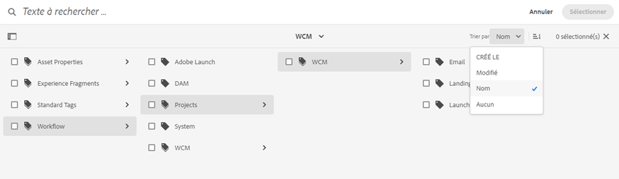

# Facettes de recherche {#search-facets}

| Version | Lien de l’article |
| -------- | ---------------------------- |
| AEM 6.5 | [Cliquez ici](https://experienceleague.adobe.com/docs/experience-manager-65/assets/administer/search-facets.html?lang=fr) |
| AEM as a Cloud Service | Cet article |

Un déploiement à l’échelle de l’entreprise d’Adobe Experience Manager Assets permet de stocker des quantités importantes de ressources. Dans certains cas, la recherche de la bonne ressource peut être difficile et longue si vous utilisez uniquement les fonctionnalités de recherche génériques d’Experience Manager.

Utilisez les facettes de recherche du panneau Filtres pour ajouter plus de granularité à votre expérience de recherche et rendre la fonctionnalité de recherche plus efficace et plus polyvalente. Ces facettes de recherche utilisent plusieurs dimensions (prédicats) qui vous permettent d’effectuer des recherches plus complexes. Le panneau Filtres inclut quelques facettes standard. Vous pouvez également ajouter des facettes de recherche personnalisées.

En résumé, les facettes de recherche permettent de rechercher des ressources de plusieurs façons plutôt que selon un seul ordre taxonomique prédéterminé. Vous pouvez facilement descendre dans la hiérarchie jusqu’au niveau de détail souhaité pour effectuer une recherche plus précise.

Par exemple, si vous recherchez une image, vous pouvez choisir si vous souhaitez une bitmap ou une image vectorielle. Vous pouvez réduire davantage la portée de la recherche en spécifiant le type MIME de l’image. De même, lors de la recherche de documents, vous pouvez spécifier le format, par exemple PDF ou MS Word.

## Ajout d’un prédicat {#adding-a-predicate}

Les facettes de recherche qui apparaissent dans le panneau Filtres sont définies dans le formulaire de recherche sous-jacent à l’aide de prédicats. Pour afficher d’autres facettes, ajoutez des prédicats au formulaire par défaut ou utilisez un formulaire personnalisé qui comprend les facettes de votre choix.

Pour des recherches de texte intégral, ajoutez le prédicat `Fulltext` au formulaire. Utilisez le prédicat Propriété pour rechercher des ressources qui correspondent à une seule propriété que vous spécifiez. Ajoutez le prédicat Options pour rechercher des ressources correspondant à une ou plusieurs valeurs pour une propriété spécifique. Ajoutez le prédicat Période pour rechercher des ressources créées au cours d’une période donnée.

1. Cliquez sur le logo Experience Manager, puis accédez à **[!UICONTROL Outils]** > **[!UICONTROL Général]** > **[!UICONTROL Formulaires de recherche]**.
1. Sur la page Search Forms, sélectionnez **[!UICONTROL Rail de recherche d’administration Assets]** puis sélectionnez **Modifier** .

   

1. Sur la page Modifier des formulaires de recherche, faites glisser un prédicat de l’onglet **[!UICONTROL Sélectionner le prédicat]** vers le volet principal. Faites glisser, par exemple, **[!UICONTROL Prédicat de la propriété]**.

   

   *Figure : Sélectionner et déplacer un prédicat pour personnaliser les filtres de recherche.*

1. Sous l’onglet Paramètres, saisissez un libellé de champ, un texte d’espace réservé et une description pour le prédicat. Indiquez un nom valide pour la propriété de métadonnées que vous souhaitez associer au prédicat. Le libellé d’en-tête de l’onglet Paramètres identifie le type de prédicat sélectionné.

   

   *Figure : Utilisez l’onglet Paramètres pour définir les options d’un prédicat requises.*

1. Dans le champ **[!UICONTROL Nom de la propriété]**, indiquez un nom valide pour la propriété de métadonnées que vous souhaitez associer au prédicat. Il s’agit du nom sur lequel la recherche se base. Par exemple, saisissez `jcr:content/metadata/dc:description` ou `./jcr:content/metadata/dc:description`. Vous pouvez également sélectionner un nœud existant dans la boîte de dialogue de sélection.

   

   *Figure : Associez une propriété de métadonnées à un prédicat dans le champ Nom de la propriété.*

1. Cliquez sur **[!UICONTROL Aperçu]**  pour générer un aperçu du panneau Filtres tel qu’il apparaît une fois le prédicat ajouté.
1. Examinez la structure du prédicat en mode Aperçu.

   

   Aperçu du formulaire de recherche avant de soumettre les modifications

1. Pour fermer l’aperçu, cliquez sur **[!UICONTROL Fermer]**  dans le coin supérieur droit de l’aperçu.
1. Sélectionnez **[!UICONTROL Terminé]** pour enregistrer les paramètres.
1. Accédez au panneau Rechercher dans l’interface utilisateur d’Assets. Le prédicat Propriété est ajouté au panneau.
1. Dans la zone de texte, saisissez une description de la ressource à rechercher. Saisissez par exemple « Adobe ». Lorsque vous effectuez une recherche, les ressources dont la description correspond à « Adobe » sont répertoriées dans les résultats de la recherche.

## Ajout d’un prédicat Options {#adding-an-options-predicate}

Le prédicat Options vous permet d’ajouter plusieurs options de recherche dans le panneau Filtres. Vous pouvez choisir une ou plusieurs options dans le panneau Filtres pour rechercher des ressources. Par exemple, pour rechercher des ressources en fonction du type de fichier, configurez des options telles que Images, Multimédia, Documents et Archives dans le formulaire de recherche. Une fois ces options configurées, la recherche est effectuée sur les ressources de type GIF, JPEG, PNG, etc. lorsque vous sélectionnez l’option Images dans le panneau Filtres.

Pour mapper les options à la propriété correspondante, créez une structure de nœud pour les options et fournissez le chemin du nœud parent dans la propriété Nom de la propriété du prédicat Options. Le nœud parent doit être du type `sling` : `OrderedFolder`. Les options doivent être du type `nt:unstructured`. Les propriétés `jcr:title` et `value` doivent être configurées pour les nœuds d’option.

La propriété `jcr:title` est un nom convivial de l’option qui apparaît dans le panneau Filtres. Le champ `value` est utilisé dans la demande pour correspondre à la propriété spécifiée.

Lorsque vous sélectionnez une option, la recherche est effectuée en fonction de la propriété `value` du nœud d’option et de ses nœuds enfants, le cas échéant. L’arborescence entière sous le nœud d’option est parcourue et la propriété `value` de chaque nœud enfant est combinée à l’aide d’une opération OR pour former la requête.

Par exemple, si vous sélectionnez Images comme type de fichier, la requête de ressources est créée en combinant la propriété `value` à l’aide d’une opération OR. Par exemple, la requête relative à des images est créée en combinant les résultats correspondants pour *image/jpeg*, *image/gif*, *image/png*, *image/pjpeg* et *image/tiff* pour la propriété `jcr:content/metadata/dc:format` à l’aide d’une opération OR.

La propriété de valeur d’un type de fichier, telle que vue dans CRXDE, est utilisée pour que les requêtes fonctionnent.

Au lieu de créer manuellement une structure de nœud pour les options du référentiel CRX, vous pouvez définir les options d’un fichier JSON en spécifiant les paires clé-valeur correspondantes. Spécifiez le chemin du fichier JSON dans le champ **[!UICONTROL Nom de la propriété]**. Par exemple, vous pouvez définir les paires clé-valeur `image/bmp`, `image/gif`, `image/jpeg` et `image/png`, puis spécifier leurs valeurs comme illustré dans l’échantillon de fichier JSON ci-dessous. Dans le champ **[!UICONTROL Nom de la propriété]**, vous pouvez spécifier le chemin d’accès CRX de ce fichier.

```json
{
    "options" :
 [
          {"value" : "image/bmp","text" : "BMP"},
          {"value" : "image/gif","text" : "GIF"},
          {"value" : "image/jpeg","text" : "JPEG"},
          {"value" : "image/png","text" : "PNG"}
 ]
}
```

Si vous souhaitez utiliser un nœud existant, indiquez-le à l’aide de la boîte de dialogue de sélection.

>[!NOTE]
>
>Le prédicat Options est un wrapper personnalisé qui comprend des prédicats de propriété pour démontrer le comportement décrit. Pour l’heure, aucun point d’entrée REST n’est disponible pour la prise en charge native de cette fonctionnalité.

1. Sélectionnez le logo Experience Manager, puis accédez à **[!UICONTROL Outils > Général > Rechercher dans Forms]**.
1. Sur la page **[!UICONTROL Rechercher dans Forms]**, sélectionnez **[!UICONTROL Rail de recherche d’administration d’Assets]** puis sélectionnez l’icône Modifier.
1. Sur la page **[!UICONTROL Modifier le formulaire de recherche]**, faites glisser **[!UICONTROL Options du prédicat]** de l’onglet **[!UICONTROL Sélectionner le prédicat]** jusqu’au volet principal.
1. Dans l’onglet **[!UICONTROL Paramètres]**, saisissez un libellé et un nom pour la propriété. Par exemple, pour rechercher des ressources en fonction de leur format, indiquez un nom convivial pour le libellé ; **[!UICONTROL Type de fichier]**, par exemple. Spécifiez la propriété en fonction de laquelle la recherche doit être effectuée dans le champ de propriété, par exemple, `jcr:content/metadata/dc:format.`.
1. Utilisez l’une des méthodes suivantes :

   * Dans le champ **[!UICONTROL Nom de la propriété]**, indiquez le chemin du fichier JSON où sont définis les nœuds des options et spécifiez les paires clé-valeur correspondantes.
   * Sélectionnez  en regard du champ Options pour spécifier le texte affiché et la valeur pour les options que vous souhaitez fournir dans le panneau Filtres. Pour ajouter une autre option, sélectionnez  et répétez l’étape.

1. Assurez-vous que l’option **[!UICONTROL Sélection simple]** est désactivée pour permettre à l’utilisateur de sélectionner plusieurs options à la fois pour les types de fichiers (Images, Documents, Multimédia et Archives, par exemple). Si vous choisissez **[!UICONTROL Sélection simple]**, l’utilisateur ne peut sélectionner qu’une seule option à la fois pour les types de fichiers.

   

   Champs disponibles dans le prédicat Options

1. Dans le champ **Description**, saisissez une description facultative, puis cliquez sur **[!UICONTROL Terminé]**.
1. Accédez au panneau Rechercher. Le prédicat Options est ajouté au panneau **Rechercher**. Les options proposées pour **[!UICONTROL Type de fichier]** sont présentées sous la forme de cases à cocher.

## Ajout d’un prédicat Propriété à plusieurs valeurs {#adding-a-multi-value-property-predicate}

Le prédicat `Multi Value Property` vous permet de rechercher plusieurs valeurs dans des ressources. Supposons que vous disposiez des images de plusieurs produits dans [!DNL Assets] et que les métadonnées de chaque image comprennent un numéro de SKU qui est associé au produit. Vous pouvez utiliser ce prédicat pour rechercher des images de produit sur la base de plusieurs numéros de SKU.

1. Cliquez sur le logo Experience Manager, puis accédez à **[!UICONTROL Outils]** > **[!UICONTROL Général]** > **[!UICONTROL Formulaires de recherche]**.
1. Sur la page Search Forms, sélectionnez **[!UICONTROL Rail de recherche d’administration Assets]**, puis sélectionnez **Modifier** .
1. Sur la page Modifier le formulaire de recherche, faites glisser **[!UICONTROL Prédicat de propriété à plusieurs valeurs]** de l’onglet **[!UICONTROL Sélectionner le prédicat]** jusqu’au volet principal.
1. Dans l’onglet **[!UICONTROL Paramètres]**, saisissez un libellé et un texte d’espace réservé pour le prédicat. Indiquez le nom de la propriété sur laquelle sera axée la recherche dans le champ de propriété ; `jcr:content/metadata/dc:value`, par exemple. Vous pouvez également utiliser la boîte de dialogue de sélection pour sélectionner un nœud.
1. Assurez-vous que l’option **[!UICONTROL Prise en charge des délimiteurs]** est sélectionnée. Dans le champ **[!UICONTROL Délimiteurs d’entrée]**, spécifiez des délimiteurs pour séparer les valeurs individuelles. Par défaut, la virgule est spécifiée comme séparateur. Vous pouvez spécifier un autre délimiteur.
1. Dans le champ **Description**, saisissez une description facultative, puis sélectionnez **[!UICONTROL Terminé]**.
1. Accédez au panneau Filtres dans l’interface utilisateur d’Assets. Le prédicat **[!UICONTROL Propriété à plusieurs valeurs]** est ajouté au panneau.
1. Spécifiez plusieurs valeurs dans le champ à plusieurs valeurs séparées par des délimiteurs et effectuez la recherche. Le prédicat récupère une correspondance de texte exacte pour les valeurs que vous spécifiez.

## Ajout d’un prédicat de balises {#adding-a-tags-predicate}

Le prédicat `Tags` vous permet de rechercher des ressources sur la base des balises. Par défaut, [!DNL Assets] recherche une ou plusieurs correspondances de balise dans les ressources en fonction des balises que vous avez spécifiées. En d’autres termes, la requête de recherche effectue une opération OU à l’aide des balises spécifiées. Cependant, vous pouvez utiliser l’option Correspondre à toutes les balises pour rechercher des ressources qui incluent toutes les balises que vous spécifiez.

1. Cliquez sur le logo Experience Manager, puis accédez à **[!UICONTROL Outils]** > **[!UICONTROL Général]** > **[!UICONTROL Formulaires de recherche]**.
1. Sur la page Search Forms, sélectionnez **[!UICONTROL Rail de recherche d’administration Assets]** puis sélectionnez **Modifier** .
1. Sur la page Modifier le formulaire de recherche, faites glisser **[!UICONTROL Prédicat de balises]** de l’onglet Sélectionner le prédicat jusqu’au volet principal.
1. Dans l’onglet Paramètres, saisissez un texte d’espace réservé pour le prédicat. Indiquez le nom de la propriété sur laquelle sera axée la recherche dans le champ de propriété ; `jcr:content/metadata/cq:tags`, par exemple. Vous pouvez également sélectionner un nœud dans CRXDE à partir de la boîte de dialogue de sélection.
1. Configurez la propriété Chemin d’accès racine aux balises de ce prédicat pour renseigner différentes balises dans la liste Balises.
1. Sélectionnez **[!UICONTROL Option d’affichage de correspondance de toutes les balises]** pour rechercher les ressources qui contiennent toutes les balises que vous spécifiez.

   

1. Dans le champ **[!UICONTROL Description]**, saisissez une description facultative, puis sélectionnez **[!UICONTROL Terminé]**.
1. Accédez au panneau Rechercher. Le prédicat **[!UICONTROL Balises]** est ajouté au panneau Rechercher.
1. Spécifiez des balises en fonction desquelles vous souhaitez rechercher des ressources ou faites votre choix dans la liste de suggestions.
1. Sélectionnez **[!UICONTROL Correspondre à toutes]** pour rechercher les correspondances qui incluent toutes les balises que vous spécifiez.

Vous pouvez trier la structure des balises par ordre croissant ou décroissant en fonction du **[!UICONTROL Nom]** (par ordre alphabétique), de la date de **[!UICONTROL Création]** ou de la date de **[!UICONTROL Modification]**. Dans l’illustration suivante, la structure des balises est triée par ordre alphabétique en fonction de la variable **[!UICONTROL Nom]**.




## Ajout d’autres prédicats {#adding-other-predicates}

Tout comme vous ajoutez un prédicat Propriété ou un prédicat Options, vous pouvez ajouter les autres prédicats suivants au panneau Rechercher :

<table>
 <tbody>
  <tr>
   <td><p><strong>Nom du prédicat</strong></p> </td>
   <td><p><strong>Description</strong></p> </td>
   <td><p><strong>Propriétés</strong></p> </td>
  </tr>
  <tr>
   <td><p>Texte intégral</p> </td>
   <td>Prédicat de recherche permettant d’effectuer une recherche de texte intégral dans un nœud de ressource entier. Il est mappé à l’opérateur <code>jcr</code>:<code>contains</code>. Vous pouvez spécifier un chemin d’accès relatif si vous souhaitez effectuer une recherche de texte intégral sur une partie spécifique du nœud de ressource.</td>
   <td>
    <ul>
     <li>Libellé</li>
     <li>Espace réservé</li>
     <li>Nom de la propriété</li>
     <li>Description</li>
    </ul> </td>
  </tr>
  <tr>
   <td>Explorateur de chemins d’accès</td>
   <td>Prédicat de recherche permettant de rechercher des ressources dans des dossiers et des sous-dossiers à un chemin d’accès racine préconfiguré.</td>
   <td>
    <ul>
     <li>Espace réservé</li>
     <li>Chemin d’accès racine</li>
     <li>Description</li>
    </ul> </td>
  </tr>
  <tr>
   <td><p>Chemin</p> </td>
   <td><p>Utilisez-le pour filtrer les résultats selon l’emplacement. Vous pouvez spécifier plusieurs chemins d’accès en tant qu’options.</p> </td>
   <td>
    <ul>
     <li>Libellé</li>
     <li>Chemin</li>
     <li>Description</li>
    </ul> </td>
  </tr>
  <tr>
   <td><p>Statut de publication</p> </td>
   <td><p>Prédicat de recherche permettant de rechercher des ressources en fonction de leur statut de publication.</p> </td>
   <td>
    <ul>
     <li>Libellé</li>
     <li>Nom de la propriété</li>
     <li>Description</li>
    </ul> </td>
  </tr>
  <tr>
   <td><p>Date relative</p> </td>
   <td><p>Prédicat de recherche permettant de rechercher des ressources en fonction de leur date de création. Vous pouvez, par exemple, configurer des options telles qu’il y a 2 mois, il y a 3 semaines, etc. </p> </td>
   <td>
    <ul>
     <li>Libellé</li>
     <li>Nom de la propriété</li>
     <li>Date relative</li>
    </ul> </td>
  </tr>
  <tr>
   <td><p>Plage</p> </td>
   <td><p>Prédicat de recherche permettant de rechercher des ressources comprises dans une étendue spécifiée. Dans le panneau Rechercher, vous pouvez spécifier des valeurs maximale et minimale pour l’étendue.</p> </td>
   <td>
    <ul>
     <li>Libellé</li>
     <li>Nom de la propriété</li>
     <li>Description</li>
    </ul> </td>
  </tr>
  <tr>
   <td><p>Période</p> </td>
   <td><p>Prédicat de recherche permettant de rechercher des ressources créées pendant une période spécifiée pour une propriété de date. Dans le panneau de recherche, vous pouvez spécifier des dates de début et de fin à l’aide du sélecteur de dates.</p> </td>
   <td>
    <ul>
     <li>Libellé</li>
     <li>Espace réservé</li>
     <li>Nom de la propriété</li>
     <li>Texte de la plage (De)</li>
     <li>Texte de la plage (À)</li>
     <li>Description</li>
    </ul> </td>
  </tr>
  <tr>
   <td><p>Date</p> </td>
   <td><p>Prédicat de recherche permettant de rechercher à l’aide d’un curseur des ressources selon une propriété de date.</p> </td>
   <td>
    <ul>
     <li>Libellé</li>
     <li>Nom de la propriété</li>
     <li>Description</li>
    </ul> </td>
  </tr>
  <tr>
   <td><p>Taille de fichier</p> </td>
   <td><p>Prédicat de recherche permettant de rechercher des ressources en fonction de leur taille. Il s’agit d’un prédicat basé sur un curseur, dans lequel vous sélectionnez les options de curseur à partir d’un nœud configurable. Les options par défaut sont définies sous /libs/dam/options/predicates/filesize dans le référentiel CRX. La taille du fichier est exprimée en octets.</p> </td>
   <td>
    <ul>
     <li>Libellé</li>
     <li>Nom de la propriété</li>
     <li>Chemin</li>
     <li>Description</li>
    </ul> </td>
  </tr>
  <tr>
   <td>Dernière modification de la ressource</td>
   <td>Prédicat de recherche permettant de rechercher des ressources récemment modifiées. </td>
   <td>
    <ul>
     <li>Nom de la propriété</li>
     <li>Valeur de propriété</li>
     <li>Description</li>
    </ul> </td>
  </tr>
  <tr>
   <td>Statut de publication</td>
   <td>Prédicat de recherche permettant de rechercher des ressources en fonction de leur état de publication. </td>
   <td>
    <ul>
     <li>Libellé</li>
     <li>Nom de la propriété</li>
     <li>Description</li>
    </ul> </td>
  </tr>
  <tr>
   <td>État d’expiration</td>
   <td>Prédicat de recherche permettant de rechercher des ressources en fonction de leur état d’expiration. </td>
   <td>
    <ul>
     <li>Libellé</li>
     <li>Nom de la propriété</li>
     <li>Description</li>
    </ul> </td>
  </tr>
  <tr>
   <td>Masqué</td>
   <td>Prédicat de recherche qui définit une propriété de champ masqué pour rechercher des ressources.</td>
   <td>
    <ul>
     <li>Nom de la propriété</li>
     <li>Valeur de propriété</li>
     <li>Description</li>
    </ul> </td>
  </tr>
 </tbody>
</table>

## Suppression des facettes de recherche par défaut {#removing-default-search-facets}

Adobe vous recommande de faire attention lors de la suppression des facettes de recherche par défaut afin d’éviter tout problème de performances. La suppression des facettes de recherche par défaut peut également avoir un impact sur le comportement de la fonction par défaut.

Ne supprimez pas les champs masqués suivants, car cela entraînerait un problème de performances des requêtes avec OmniSearch et les collections dynamiques :

* group.2_group.type=dam:Asset

* group.1_group.type=nt:folder

* group.p.or=true

## Restauration des facettes de recherche par défaut {#restoring-default-search-facets}

Par défaut, une icône représentant un cadenas s’affiche devant **[!UICONTROL Rail de recherche d’administrateurs de ressources]** sur la page **[!UICONTROL Formulaires de recherche]**. L’icône représentant un cadenas disparaît lorsque vous ajoutez des facettes de recherche au formulaire, ce qui indique que le formulaire par défaut a été modifié.

L’icône de cadenas en regard d’une option de la page Formulaires de recherche indique que les paramètres par défaut sont intacts et non personnalisés.

Pour restaurer la facette de recherche par défaut, procédez comme suit :

1. Sélectionnez **[!UICONTROL Rail de recherche d’administrateurs de ressources]** sur la page **[!UICONTROL Formulaires de recherche]**.
1. Sélectionnez **[!UICONTROL Supprimer]**  dans la barre d’outils.
1. Dans la boîte de dialogue de confirmation, sélectionnez **[!UICONTROL Supprimer]** pour supprimer les modifications personnalisées.

   Après avoir supprimé les modifications personnalisées apportées aux facettes de recherche, l’icône représentant un cadenas réapparaît devant **[!UICONTROL Rail de recherche d’administrateurs de ressources]** sur la page **[!UICONTROL Formulaires de recherche]**.

## Autorisations d’utilisateur {#user-permissions}

Si le rôle d’administrateur ne vous a pas été attribué, voici la liste des autorisations dont vous avez besoin pour réaliser des actions de modification, de suppression et d’affichage d’aperçu impliquant des facettes de recherche.

| Action | Autorisation |
|---|---|
| Modifier | Autorisations de lecture et d’écriture sur le nœud `/apps` dans CRX. |
| Supprimer | Autorisations de lecture, d’écriture et de suppression sur le nœud `/apps` dans CRX. |
| Aperçu | Autorisations de lecture, d’écriture et de suppression sur le nœud `/var/dam/content` dans CRX. De même que les autorisations de lecture et d’écriture sur le nœud `/apps`. |

**Voir également**

* [Bonnes pratiques de recherche](search-best-practices.md)
* [Traduire les ressources](translate-assets.md)
* [API HTTP Assets](mac-api-assets.md)
* [Formats de fichiers pris en charge par Assets](file-format-support.md)
* [Rechercher des ressources](search-assets.md)
* [Ressources connectées](use-assets-across-connected-assets-instances.md)
* [Rapports de ressources](asset-reports.md)
* [Schémas de métadonnées](metadata-schemas.md)
* [Télécharger des ressources](download-assets-from-aem.md)
* [Gestion des métadonnées](manage-metadata.md)
* [Gérer les collections](manage-collections.md)
* [Import des métadonnées en bloc](metadata-import-export.md)
* [Publier des ressources sur AEM et Dynamic Media](/help/assets/publish-assets-to-aem-and-dm.md)

>[!MORELIKETHIS]
>
>* [Rechercher des ressources numériques](search-assets.md).
