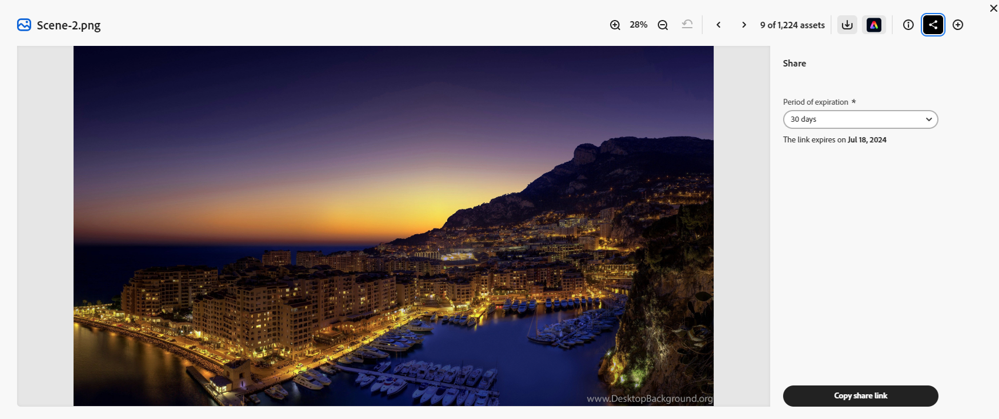

# Partager des ressources dans le hub de contenus {#search-assets-as-a-link}

| [Bonnes pratiques de recherche](/help/assets/search-best-practices.md) | [Bonnes pratiques relatives aux métadonnées](/help/assets/metadata-best-practices.md) | [Hub de contenus](/help/assets/product-overview.md) | [Fonctionnalités Dynamic Media avec OpenAPI](/help/assets/dynamic-media-open-apis-overview.md) | [Documentation de développement pour AEM Assets](https://developer.adobe.com/experience-cloud/experience-manager-apis/) |
| ------------- | --------------------------- |---------|----|-----|

>[!AVAILABILITY]
>
>Le guide Content Hub est désormais disponible au format PDF. Téléchargez l’intégralité du guide et utilisez l’assistant Adobe Acrobat AI pour répondre à vos requêtes.
>
>[!BADGE PDF de guide Content Hub]{type=Informative url="https://helpx.adobe.com/content/dam/help/en/experience-manager/aem-assets/content-hub.pdf"}

Le partage de ressources par le biais d’un lien est un moyen pratique de mettre les ressources à la disposition des utilisateurs [!DNL the Content Hub]. La fonctionnalité permet aux utilisateurs autorisés d’accéder aux ressources partagées avec eux et de les télécharger. Lors du téléchargement de ressources à partir d’un lien partagé, [!DNL the Content Hub] utilise un service asynchrone qui offre un téléchargement plus rapide et ininterrompu.

## Conditions préalables {#prerequisites}

[Les utilisateurs de Content Hub](deploy-content-hub.md#onboard-content-hub-users) peuvent effectuer les actions mentionnées dans cet article.

## Partage d’une seule ressource {#share-a-single-asset}

Vous pouvez partager une seule ressource en exécutant les étapes suivantes :

1. Sélectionnez une ressource et cliquez sur l’icône  pour partager une ressource.

   

1. Utilisez le champ **[!UICONTROL Expiration]** pour spécifier une date d’expiration pour le lien. Sélectionnez l’une des options disponibles, par exemple 24 heures, 1 semaine, 30 jours, 90 jours, 1 an, ou spécifiez une date personnalisée.

1. Cliquez sur **[!UICONTROL Copier le lien de partage]**. Vous pouvez ensuite partager le lien copié avec le destinataire.

## Partage de plusieurs ressources {#share-multiple-assets}

[!DNL The Content Hub] vous permet de partager plusieurs ressources via un lien partagé. Procédez comme suit :

1. Sélectionnez les ressources que vous devez partager avec le destinataire autorisé. Vous pouvez sélectionner plusieurs ressources une par une ou cliquer sur **[!UICONTROL Sélectionner tout]** pour sélectionner toutes les ressources disponibles en même temps. L’option **[!UICONTROL Sélectionner tout]** s’affiche uniquement lorsque vous sélectionnez au moins une ressource.

1. Cliquez sur l&#39;icône  .

   

1. Dans la section d’aperçu, vous pouvez également supprimer des ressources en fonction de vos besoins. Utilisez le champ **[!UICONTROL Expiration]** pour spécifier une date d’expiration pour le lien. Sélectionnez l’une des options disponibles, par exemple 24 heures, 1 semaine, 30 jours, 90 jours, 1 an, ou spécifiez une date personnalisée.

1. Cliquez sur **[!UICONTROL Copier le lien de partage]**. Vous pouvez ensuite partager le lien copié avec le destinataire.

## Prévisualisation et partage de ressources {#preview-assets}

Vous pouvez prévisualiser pour voir à quoi ressemble une ressource numérique que vous allez partager avant de la partager avec un destinataire de lien. Cliquez sur la ressource à prévisualiser. [!DNL Content Hub] affiche la [vue détaillée de la ressource](asset-properties-content-hub.md).

Cliquez sur l’icône  pour partager une ressource. Utilisez le champ **[!UICONTROL Expiration]** pour spécifier une date d’expiration pour le lien. Sélectionnez l’une des options disponibles, par exemple 24 heures, 1 semaine, 30 jours, 90 jours, 1 an, ou spécifiez une date personnalisée. Cliquez sur **[!UICONTROL Copier le lien de partage]**. Vous pouvez ensuite partager le lien copié avec le destinataire.

## Accéder aux ressources partagées {#access-shared-assets}

Après avoir partagé le lien des ressources, les destinataires autorisés peuvent cliquer sur le lien pour prévisualiser ou télécharger les ressources partagées dans un navigateur web.

Cliquez sur le lien partagé et cliquez sur l’icône de téléchargement disponible sur la carte de la ressource pour télécharger une ressource.  Vous pouvez également sélectionner plusieurs ressources et cliquer sur **[!UICONTROL Télécharger]**. <!--You can either download original assets or Original+Renditions of an asset.--> [!DNL The Content Hub] télécharge chaque ressource une par une sur le système de fichiers local.

