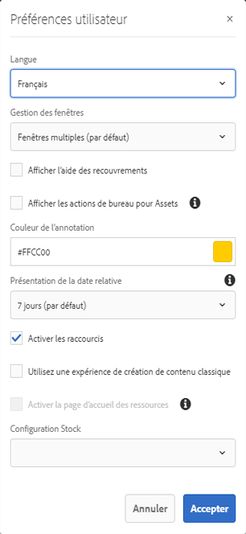

# Partage et distribution de fichiers gérés dans Experience Manager {#share-assets-from-aem}

Les ressources d’Adobe Experience Manager (AEM) vous permettent de partager des ressources, des dossiers et des collections avec des membres de votre organisation et des entités externes, y compris des partenaires et des fournisseurs. Utilisez les méthodes suivantes pour partager des ressources à partir des ressources Experience Manager en tant que service Cloud :

* Partager en tant que lien.
* Téléchargez des ressources et partagez-les séparément.
* Partager via l’application de bureau AEM.
* Partager via Adobe Asset Link.
* (Fonctionnalité à venir) Partagez à l’aide de Brand Portal.

## Partage de ressources en tant que lien {#sharelink}

Pour générer une URL pour les ressources que vous souhaitez partager avec des utilisateurs, utilisez la boîte de dialogue Partage de lien. Users with administrator privileges or with read permissions at `/var/dam/share` location are able to view the links shared with them. Le partage de ressources au moyen d’un lien est très pratique dans la mesure où il permet à des tiers d’y accéder sans avoir besoin de se connecter au préalable à AEM Assets.

>[!NOTE]
>
>* Vous devez disposer de l’autorisation Modifier la liste de contrôle d’accès sur le dossier ou la ressource que vous souhaitez partager en tant que lien.
>* Avant de partager un lien avec des utilisateurs, assurez-vous que le service de messagerie Day CQ est bien configuré. Dans le cas contraire, une erreur se produit.

1. Dans l’interface utilisateur Assets, sélectionnez la ressource à partager sous la forme de lien.
1. Dans la barre d’outils, cliquez/appuyez sur **[!UICONTROL Partager le lien]**. An asset link is auto-created in the **[!UICONTROL Share Link]** field. Copiez ce lien et partagez-le avec des utilisateurs. Le délai d’expiration par défaut du lien est de 1 jour.

   >[!NOTE]
   >
   >Si une ressource partagée est déplacée vers un autre emplacement, son lien cesse de fonctionner. Recréez ce lien et partagez-le de nouveau avec les utilisateurs.

<!--
## Share assets as a link {#sharelink}

To generate the URL for assets you want to share with users, use the Link Sharing dialog. Users with administrator privileges or with read permissions at `/var/dam/share` location are able to view the links shared with them. Sharing assets through a link is a convenient way of making resources available to external parties without them having to first log in to AEM Assets.

>[!NOTE]
>
>* You need Edit ACL permission on the folder or the asset that you want to share as a link.
>* Before you share a link with users, ensure that Day CQ Mail Service is configured. Otherwise, an error occurs.

1. In the Assets user interface, select the asset to share as a link.
1. From the toolbar, click/tap the **[!UICONTROL Share Link]**.

   An asset link is auto-created in the **[!UICONTROL Share Link]** field. Copy this link and share it with the users. The default expiration time for the link is one day.

   Alternatively, proceed to perform steps 3-7 of this procedure to add email recipients, configure the expiration time for the link, and send it from the dialog.

   >[!NOTE]
   >
   >If a shared asset is moved to a different location, its link stops working. Re-create the link and re-share with the users.

1. From the web console, open the **[!UICONTROL Day CQ Link Externalizer]** configuration and modify the following properties in the **[!UICONTROL Domains]** field with the values mentioned against each:

    * local
    * author
    * publish

   For the local and author properties, provide the URL for the local and author instance respectively. Both local and author properties have the same value if you run a single AEM author instance. For publish, provide the URL for the publish instance.

1. In the email address box of the **[!UICONTROL Link Sharing]** dialog, type the email ID of the user you want to share the link with. You can also share the link with multiple users.

   If the user is a member of your organization, select the user's email ID from the suggested email IDs that appear in the list below the typing area. For an external user, type the complete email ID and then select it from the list.

   To enable emails to be sent out to users, configure the SMTP server details in [Day CQ Mail Service](/help/assets/configure-asset-sharing.md#configmailservice).

   >[!NOTE]
   >
   >If you enter an email ID of a user that is not a member of your organization, the words "External User" are prefixed with the email ID of the user.

1. In the **[!UICONTROL Subject]** box, enter a subject for the asset you want to share.
1. In the **[!UICONTROL Message]** box, enter an optional message.
1. In the **[!UICONTROL Expiration]** field, specify an expiration date and time for the link using the date picker. By default, the expiration date is set for a week from the date you share the link.
1. To let users download the original image along with the renditions, select **[!UICONTROL Allow download of original file]**.

   >[!NOTE]
   >
   >By default, users can only download the renditions of the asset that you share as a link.

1. Click **[!UICONTROL Share]**. A message confirms that the link is shared with the users through an email.
1. To view the shared asset, click/tap the link in the email that is sent to the user. The shared asset is displayed in the **[!UICONTROL Adobe Marketing Cloud]** page.

   To toggle to the list view, click/tap the layout icon in the toolbar.

1. To generate a preview of the asset, click/tap the shared asset. To close the preview and return to the **[!UICONTROL Marketing Cloud]** page, click/tap **[!UICONTROL Back]** in the toolbar. If you have shared a folder, click/tap **[!UICONTROL Parent Folder]** to return to the parent folder.

   >[!NOTE]
   >
   >AEM supports generating the preview of assets of these MIME types: JPG, PNG, GIF, BMP, INDD, PDF, and PPT. You can only download the assets of the other MIME types.

1. To download the shared asset, click/tap **[!UICONTROL Select]** from the toolbar, click/tap the asset, and then click/tap **[!UICONTROL Download]** from the toolbar.
1. To view the assets you shared as links, go to the Assets user interface and click/tap the GlobalNav icon. Choose **[!UICONTROL Navigation]** from the list to display the Navigation pane.
1. From the Navigation pane, choose **[!UICONTROL Shared Links]** to display a list of shared assets.
1. To un-share an asset, select it and tap/click **[!UICONTROL Unshare]** from the toolbar.

A message confirms that you unshared the asset. In addition, the entry for the asset is removed from the list.
-->

## Téléchargement et partage de fichiers {#download-and-share-assets}

Les utilisateurs peuvent télécharger certains fichiers et les partager en dehors d’Experience Manager. Pour plus d’informations, voir [comment rechercher des ressources](/help/assets/search-assets.md), [comment télécharger des ressources](/help/assets/download-assets-from-aem.md)et [comment télécharger des collections](manage-collections.md#download-a-collection)

## Partage de fichiers avec des professionnels de la création {#share-with-creatives}

Les spécialistes du marketing et les utilisateurs de la ligne d’entreprise peuvent facilement partager des ressources approuvées avec leurs créatifs à l’aide de la fonction

* **Application** de bureau AEM : L’application fonctionne sous Windows et Mac. Reportez-vous à la page Présentation [des applications de](https://docs.adobe.com/content/help/en/experience-manager-desktop-app/using/introduction.html)bureau. Pour savoir comment un utilisateur de bureau autorisé peut facilement accéder aux ressources partagées, voir [Parcourir, Rechercher et  ressources](https://docs.adobe.com/content/help/en/experience-manager-desktop-app/using/using.html#browse-search-preview-assets). Les utilisateurs de bureau peuvent créer des fichiers et les partager avec leurs homologues qui sont des utilisateurs d’AEM, par exemple en téléchargeant de nouvelles images. Voir [Téléchargement de fichiers à l’aide d’une application](https://docs.adobe.com/content/help/en/experience-manager-desktop-app/using/using.html#upload-and-add-new-assets-to-aem)de bureau.

* **Lien vers** Adobe Asset : Les professionnels de la création peuvent rechercher et utiliser des fichiers directement depuis Adobe InDesign, Adobe Illustrator et Adobe Photoshop.

## Configuration du partage de ressources {#configure-sharing}

Les différentes options de partage des ressources nécessitent une configuration spécifique et des conditions préalables spécifiques.

### Configuration du partage de liens de ressources {#asset-link-sharing}

<!-- TBD: Web Console is not there so how to configure Day CQ email service? Or is it not required now? -->

Pour générer une URL pour les ressources que vous souhaitez partager avec des utilisateurs, utilisez la boîte de dialogue Partage de lien. Users with administrator privileges or with read permissions at `/var/dam/share` location are able to view the links shared with them. Le partage de ressources au moyen d’un lien est très pratique dans la mesure où il permet à des tiers d’y accéder sans avoir besoin de se connecter au préalable à AEM Assets.

>[!NOTE]
>
>Si vous souhaitez partager des liens de votre instance Auteur AEM vers des entités externes, veillez à n’exposer que les URL suivantes pour `GET` les requêtes. Bloquez d’autres URL pour vous assurer que votre instance Auteur AEM est sécurisée.
>* `[aem_server]:[port]/linkshare.html`
>* `[aem_server]:[port]/linksharepreview.html`
>* `[aem_server]:[port]/linkexpired.html`

<!--
## Configure Day CQ mail service {#configmailservice}

Before you can share assets as links, configure the email service.

1. Click or tap the AEM logo, and then navigate to **[!UICONTROL Tools]** &gt; **[!UICONTROL Operations]** &gt; **[!UICONTROL Web Console]**.
1. From the list of services, locate **[!UICONTROL Day CQ Mail Service]**.
1. Click the **[!UICONTROL Edit]** icon beside the service, and configure the following parameters for **Day CQ Mail Service]** with the details mentioned against their names:

    * SMTP server host name: email server host name
    * SMTP server port: email server port
    * SMTP user: email server user name
    * SMTP password: email server password

1. Click/tap **[!UICONTROL Save]**.
-->

### Configuration de la taille maximale des données {#maxdatasize}

Lorsque vous téléchargez des ressources via le lien partagé avec la fonction de partage de lien, AEM compresse l’intégralité de la hiérarchie de cette ressource depuis le référentiel et renvoie la ressource sous forme de fichier ZIP. Toutefois, en l’absence de limite à la quantité de données pouvant être compressées dans un fichier ZIP, il est possible que des volumes de données considérables à compresser entraînent des erreurs d’insuffisance de mémoire dans JVM. Pour protéger le système d’une attaque par déni de service potentielle en raison de cette situation, vous pouvez configurer la taille maximale des fichiers téléchargés. Si la taille non compressée de l’actif dépasse la valeur configurée, les demandes de téléchargement sont rejetées. La valeur par défaut est de 100 Mo.

1. Cliquez/appuyez sur le logo AEM, puis sélectionnez **[!UICONTROL Outils]** > **[!UICONTROL Opérations]** > **[!UICONTROL Console web]**.
1. From the web console, locate the **[!UICONTROL Day CQ DAM Adhoc Asset Share Proxy Servlet]** configuration.
1. Open the configuration in edit mode, and modify the value of the **[!UICONTROL Max Content Size (uncompressed)]** parameter.
1. Enregistrez les modifications.

<!--
Add content or link about how to configure sharing via BP, DA, AAL, etc.
-->

### Activer les actions de bureau à utiliser avec l’application de bureau {#desktop-actions}

À partir de l’interface utilisateur Assets ouverte dans un navigateur, vous pouvez explorer l’emplacement des ressources ou extraire et ouvrir une ressource pour la modifier dans votre application de bureau. Ces options sont appelées actions de bureau et pour les activer, voir [Activer les actions de bureau dans l’interface](https://docs.adobe.com/help/en/experience-manager-desktop-app/using/using.html#desktopactions-v2)Web d’AEM.

### Configurations pour utiliser Adobe Asset Link {#configure-asset-link}

Adobe Asset Link simplifie la collaboration entre les créatifs et les marketeurs dans le processus de création de contenu. Il connecte les ressources Adobe Experience Manager (AEM) aux applications de bureau Creative Cloud Adobe InDesign, Adobe Photoshop et Adobe Illustrator. Le panneau Adobe Asset Link permet aux créatifs d’accéder au contenu stocké dans AEM Assets et de le modifier sans quitter les applications de création qui leur sont les plus familières.

Découvrez [comment configurer AEM pour une utilisation avec Adobe Asset Link](https://helpx.adobe.com/enterprise/using/configure-aem-assets-for-asset-link.html).

## Bonnes pratiques et résolution des problèmes {#bestpractices}

* Les dossiers de fichiers ou les collections qui contiennent un espace blanc dans leur nom peuvent ne pas être partagés.
* Si les utilisateurs ne peuvent pas télécharger les ressources partagées, contactez votre administrateur AEM pour connaître les [limites de téléchargement](#maxdatasize).

<!--
* If you cannot send email with links to shared assets or if the other users cannot receive your email, check with your AEM administrator if the [email service](/help/assets/configure-asset-sharing.md#configmailservice) is configured or not. 
* If you cannot share assets using link sharing functionality, ensure that you have the appropriate permissions. See [share assets](#sharelink).
-->

<!--
Add content or link about how to share using Brand Portal when it is available on Cloud Service.
-->
