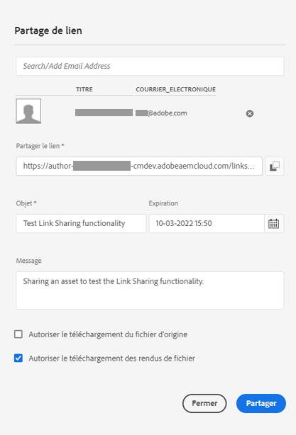
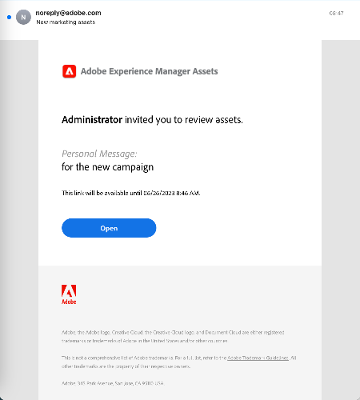

# Partager et distribuer des ressources gérées dans [!DNL Experience Manager] {#share-assets-from-aem}

| Version | Lien de l’article |
| -------- | ---------------------------- |
| AEM 6.5 | [Cliquez ici](https://experienceleague.adobe.com/docs/experience-manager-65/assets/administer/link-sharing.html?lang=fr) |
| AEM as a Cloud Service | Cet article |

[!DNL Adobe Experience Manager Assets] vous permet de partager des ressources, des dossiers et des collections avec des membres de votre entreprise et des tiers, notamment des partenaires et des fournisseurs. Procédez comme suit pour partager des ressources à partir d’[!DNL Experience Manager Assets] as a [!DNL Cloud Service] :

* [Partager des ressources sous la forme d’un lien](#sharelink)
* [Télécharger des ressources et les partager séparément.](/help/assets/download-assets-from-aem.md)
* Partagez à l’aide de l’appli de bureau [[!DNL Experience Manager]  ](https://experienceleague.adobe.com/docs/experience-manager-desktop-app/using/introduction.html?lang=fr).
* Partagez à l’aide d’[[!DNL Adobe Asset Link]](https://www.adobe.com/fr/creativecloud/business/enterprise/adobe-asset-link.html).
* Partagez à l’aide de [[!DNL Brand Portal]](https://experienceleague.adobe.com/docs/experience-manager-brand-portal/using/introduction/brand-portal.html?lang=fr).

## Partager des ressources en tant que lien {#sharelink}

Le partage de ressources par le biais d’un lien est un moyen pratique de mettre les ressources à la disposition de tiers, de spécialistes marketing et d’autres utilisateurs [!DNL Experience Manager]. Cette fonctionnalité permet aux utilisateurs anonymes d’accéder aux ressources partagées avec eux et de les télécharger. Lors du téléchargement des ressources à partir d’un lien partagé, [!DNL Experience Manager Assets] utilise un service asynchrone qui permet d’effectuer des téléchargements plus rapides et ininterrompus. Les ressources à télécharger sont placées en file d’attente en arrière-plan dans les archives ZIP de taille de fichier gérable. Pour les téléchargements volumineux, le téléchargement est regroupé en plusieurs fichiers de 100 Go par taille de fichier.

<!--
Users with administrator privileges or with read permissions at `/var/dam/share` location are able to view the links shared with them. 
-->

>[!NOTE]
>
>* Vous devez disposer de l’autorisation Modifier l’ACL pour le dossier ou la ressource que vous souhaitez partager sous forme d’un lien.
>* [Activer les e-mails sortants](/help/implementing/developing/introduction/development-guidelines.md#sending-email) avant de partager un lien avec les utilisateurs.

Il existe deux façons de partager les ressources à l’aide de la fonctionnalité de partage de lien :

1. Générer un lien partagé, [le copier et partager le lien de la ressource](#copy-and-share-assets-link) avec d’autres utilisateurs. Le délai d’expiration par défaut du lien est de 1 jour. Vous ne pouvez pas modifier le délai d’expiration lors du partage du lien copié avec d’autres utilisateurs.

1. Générer un lien partagé et [partager le lien de la ressource par e-mail](#share-assets-link-through-email). Dans ce cas, vous pouvez modifier les valeurs par défaut, telles que la date et l’heure d’expiration, et permettre le téléchargement des ressources d’origine et de ses rendus. Vous pouvez envoyer des e-mails à plusieurs utilisateurs en ajoutant leurs adresses électroniques.

   

### Copier et partager le lien de la ressource{#copy-and-share-asset-link}

Pour partager des ressources sous la forme d’une URL publique :

1. Connectez-vous à [!DNL Experience Manager Assets] et accédez à **[!UICONTROL Fichiers]**.
1. Sélectionnez les ressources ou le dossier contenant les ressources. Dans la barre d’outils, cliquez sur **[!UICONTROL Partager le lien]**.
1. La boîte de dialogue **[!UICONTROL Partage de liens]** s’affiche, avec un lien de ressource généré automatiquement dans le champ **[!UICONTROL Partager le lien]**.
1. Copiez ce lien de ressource et partagez-le avec des utilisateurs.

### Partager des liens de ressources avec des notifications d’e-mails {#share-assets-link-through-email}

Pour partager des ressources par e-mail :

1. Sélectionnez les ressources ou le dossier contenant les ressources. Dans la barre d’outils, cliquez sur **[!UICONTROL Partager le lien]**.
1. La boîte de dialogue **[!UICONTROL Partage de liens]** s’affiche, avec un lien de ressource généré automatiquement dans le champ **[!UICONTROL Partager le lien]**.

   * Dans la zone d’e-mail, saisissez l’adresse e-mail de l’utilisateur avec lequel vous souhaitez partager le lien. Vous pouvez partager le lien avec plusieurs utilisateurs. Si l’utilisateur ou l’utilisatrice fait partie de votre entreprise, sélectionnez son ID d’e-mail parmi les suggestions qui s’affichent dans la liste déroulante. Si l’utilisateur est externe à votre organisation, saisissez l’e-mail complet et appuyez sur **[!UICONTROL Entrée]** pour l’ajouter à la liste des utilisateurs.

   * Dans la zone **[!UICONTROL Objet]**, saisissez un objet pour préciser l’objectif des ressources partagées.
   * Dans la zone **[!UICONTROL Message]**, vous pouvez, au besoin, saisir un message.
   * Dans le champ **[!UICONTROL Expiration]**, indiquez une date et une heure d’expiration du lien à l’aide du sélecteur de date.
   * Cochez la case **[!UICONTROL Autoriser le téléchargement du fichier original]** pour permettre aux destinataires de télécharger le rendu original.

1. Cliquez sur **[!UICONTROL Partager]**. Un message confirme le partage du lien avec les utilisateurs. Les utilisateurs reçoivent un e-mail contenant le lien partagé.

   

### Télécharger les ressources à l’aide du lien de ressource

Tout utilisateur ayant accès au lien de la ressource partagée peut télécharger les ressources regroupées dans un dossier zip. Le processus de téléchargement est le même, qu’un utilisateur accède au lien de la ressource copiée ou qu’il utilise le lien de la ressource partagé par e-mail.

* Cliquez sur le lien de la ressource ou collez l’URL dans votre navigateur. L’interface [!UICONTROL Partage de liens] s’ouvre et vous pouvez basculer vers la [!UICONTROL Vue Vignette] ou la [!UICONTROL Vue Liste].

* Dans la [!UICONTROL Vue Vignette], vous pouvez placer le pointeur de la souris sur la ressource partagée ou le dossier de ressources partagées pour sélectionner les ressources ou les mettre en file d’attente pour téléchargement.

* Par défaut, l’interface utilisateur affiche l’option **[!UICONTROL Boîte de réception de téléchargement]**. Elle indique la liste de toutes les ressources partagées ou de tous les dossiers mis en file d’attente pour téléchargement, ainsi que leur statut.

* Lorsque vous sélectionnez les ressources ou le dossier, une option **[!UICONTROL Mettre le téléchargement en file d’attente]** s’affiche à l’écran. Cliquez sur l’option **[!UICONTROL Mettre le téléchargement en file d’attente]** pour lancer le processus de téléchargement.

  

* Pendant la préparation du fichier de téléchargement, cliquez sur l’option **[!UICONTROL Boîte de réception de téléchargement]** pour afficher le statut de votre téléchargement. Pour les téléchargements volumineux, cliquez sur le bouton **[!UICONTROL Actualiser]** pour mettre à jour le statut.

  

* Une fois le traitement terminé, cliquez sur le bouton **[!UICONTROL Télécharger]** pour télécharger le fichier zip.

<!--
You can also copy the auto-generated link and share it with the users. The default expiration time for the link is one day.
-->

>[!NOTE]
>
>Si une ressource partagée est déplacée vers un autre emplacement, son lien cesse de fonctionner. Recréez ce lien et partagez-le de nouveau avec les utilisateurs et utilisatrices.

<!--
## Share assets as a link {#sharelink}

To generate the URL for assets you want to share with users, use the Link Sharing dialog. Users with administrator privileges or with read permissions at `/var/dam/share` location are able to view the links shared with them. Sharing assets through a link is a convenient way of making resources available to external parties without them having to first log in to Experience Manager Assets.

>[!NOTE]
>
>* You need Edit ACL permission on the folder or the asset that you want to share as a link.
>* Before you share a link with users, ensure that Day CQ Mail Service is configured. Otherwise, an error occurs.

1. In the Assets user interface, select the asset to share as a link.
1. From the toolbar, select the **[!UICONTROL Share Link]**.

   An asset link is auto-created in the **[!UICONTROL Share Link]** field. Copy this link and share it with the users. The default expiration time for the link is one day.

   Alternatively, proceed to perform steps 3-7 of this procedure to add email recipients, configure the expiration time for the link, and send it from the dialog.

   >[!NOTE]
   >
   >If a shared asset is moved to a different location, its link stops working. Re-create the link and re-share with the users.

1. From the web console, open the **[!UICONTROL Day CQ Link Externalizer]** configuration and modify the following properties in the **[!UICONTROL Domains]** field with the values mentioned against each:

    * local
    * author
    * publish

   For the local and author properties, provide the URL for the local and author instance respectively. Both local and author properties have the same value if you run a single Experience Manager author instance. For publish, provide the URL for the publish instance.

1. In the email address box of the **[!UICONTROL Link Sharing]** dialog, type the email ID of the user you want to share the link with. You can also share the link with multiple users.

   If the user is a member of your organization, select the user's email ID from the suggested email IDs that appear in the list below the typing area. For an external user, type the complete email ID and then select it from the list.

   To enable emails to be sent out to users, configure the SMTP server details in [Day CQ Mail Service](/help/assets/configure-asset-sharing.md#configmailservice).

   >[!NOTE]
   >
   >If you enter an email ID of a user that is not a member of your organization, the words "External User" are prefixed with the email ID of the user.

1. In the **[!UICONTROL Subject]** box, enter a subject for the asset you want to share.
1. In the **[!UICONTROL Message]** box, enter an optional message.
1. In the **[!UICONTROL Expiration]** field, specify an expiration date and time for the link using the date picker. By default, the expiration date is set for a week from the date you share the link.
1. To let users download the original image along with the renditions, select **[!UICONTROL Allow download of original file]**.

   >[!NOTE]
   >
   >By default, users can only download the renditions of the asset that you share as a link.

1. Click **[!UICONTROL Share]**. A message confirms that the link is shared with the users through an email.
1. To view the shared asset, select the link in the email that is sent to the user. The shared asset is displayed in the **[!UICONTROL Adobe Marketing Cloud]** page.

   To toggle to the list view, select the layout icon in the toolbar.

1. To generate a preview of the asset, select the shared asset. To close the preview and return to the **[!UICONTROL Marketing Cloud]** page, select **[!UICONTROL Back]** in the toolbar. If you have shared a folder, select **[!UICONTROL Parent Folder]** to return to the parent folder.

   >[!NOTE]
   >
   >Experience Manager supports generating the preview of assets of these MIME types: JPG, PNG, GIF, BMP, INDD, PDF, and PPT. You can only download the assets of the other MIME types.

1. To download the shared asset, select **[!UICONTROL Select]** from the toolbar, select the asset, and then select **[!UICONTROL Download]** from the toolbar.
1. To view the assets you shared as links, go to the Assets user interface and select the GlobalNav icon. Choose **[!UICONTROL Navigation]** from the list to display the Navigation pane.
1. From the Navigation pane, choose **[!UICONTROL Shared Links]** to display a list of shared assets.
1. To un-share an asset, select it and select **[!UICONTROL Unshare]** from the toolbar.

A message confirms that you unshared the asset. In addition, the entry for the asset is removed from the list.
-->

## Télécharger des ressources et les partager séparément {#download-and-share-assets}

Les utilisateurs peuvent télécharger les ressources requises et les partager en dehors d’[!DNL Experience Manager]. Pour plus d’informations, consultez les pages suivantes [Recherche de ressources](/help/assets/search-assets.md), [Télécharger des ressources](/help/assets/download-assets-from-aem.md) et [Téléchargement de collections](manage-collections.md#download-a-collection)

## Partage de ressources avec des professionnels de la création {#share-with-creatives}

Les spécialistes marketing et les utilisateurs de services dédiés peuvent facilement partager des ressources approuvées avec des professionnels de la création à l’aide des solutions suivantes :

* **Appli de bureau Experience Manager** : cette application fonctionne sous Windows et Mac. Voir [Vue d’ensemble de l’appli de bureau AEM](https://experienceleague.adobe.com/docs/experience-manager-desktop-app/using/introduction.html?lang=fr). Pour savoir comment un utilisateur autorisé peut facilement accéder aux ressources partagées, voir [Parcourir, rechercher et prévisualiser des ressources](https://experienceleague.adobe.com/docs/experience-manager-desktop-app/using/using.html?lang=fr#browse-search-preview-assets). Les utilisateurs peuvent créer des ressources et les repartager avec leurs collaborateurs qui sont des utilisateurs d’Experience Manager (par exemple, en chargeant de nouvelles images). Voir [Chargement de ressources à l’aide de l’application de bureau](https://experienceleague.adobe.com/docs/experience-manager-desktop-app/using/using.html?lang=fr#upload-and-add-new-assets-to-aem).

* **Adobe Asset Link** : les professionnels de la création peuvent rechercher et utiliser des ressources directement dans [!DNL Adobe InDesign], [!DNL Adobe Illustrator] et [!DNL Adobe Photoshop].

## Configuration du partage de ressources {#configure-sharing}

Les différentes options de partage des ressources nécessitent une configuration spécifique et sont soumises à des prérequis spécifiques.

### Configuration du partage de liens de ressources {#asset-link-sharing}

<!-- TBD: Web Console is not there so how to configure Day CQ email service? Or is it not required now? -->

Pour générer une URL pour les ressources que vous souhaitez partager avec des utilisateurs, utilisez la boîte de dialogue Partage de lien. Les utilisateurs et les utilisatrices disposant de privilèges d’administration ou avec des autorisations de lecture à l’emplacement `/var/dam/share` peuvent afficher les liens partagés avec eux. Le partage de ressources au moyen d’un lien est très pratique dans la mesure où il permet à des tiers d’y accéder sans avoir besoin de se connecter au préalable à [!DNL Assets].

>[!NOTE]
>
>Si vous souhaitez partager des liens de votre instance de création vers des entités externes, veillez à n’exposer que les URL suivantes pour les requêtes `GET`. Bloquez les autres URL pour garantir la sécurité de votre instance de création.
>
>* `[aem_server]:[port]/linkshare.html`
>* `[aem_server]:[port]/linksharepreview.html`
>* `[aem_server]:[port]/linkexpired.html`

<!--
## Configure Day CQ mail service {#configmailservice}

Before you can share assets as links, configure the email service.

1. Select the Experience Manager logo, and then navigate to **[!UICONTROL Tools]** &gt; **[!UICONTROL Operations]** &gt; **[!UICONTROL Web Console]**.
1. From the list of services, locate **[!UICONTROL Day CQ Mail Service]**.
1. Click the **[!UICONTROL Edit]** icon beside the service, and configure the following parameters for **Day CQ Mail Service]** with the details mentioned against their names:

    * SMTP server host name: email server host name
    * SMTP server port: email server port
    * SMTP user: email server user name
    * SMTP password: email server password

1. Select **[!UICONTROL Save]**.
-->

<!-- TBD: Commenting as Web Console is not available. Document the appropriate OSGi config method if available in CS.
### Configure maximum data size {#maxdatasize}

When you download assets from the link shared using the Link Sharing feature, Experience Manager compresses the asset hierarchy from the repository and then returns the asset in a ZIP file. However, in the absence of limits to the amount of data that can be compressed in a ZIP file, huge amounts of data is subjected to compression, which causes out of memory errors in JVM. To secure the system from a potential denial of service attack due to this situation, you can configure the maximum size of the downloaded files. If uncompressed size of the asset exceeds the configured value, asset download requests are rejected. The default value is 100 MB.

1. Click/Tap the Experience Manager logo and then go to **[!UICONTROL Tools]** &gt; **[!UICONTROL Operations]** &gt; **[!UICONTROL Web Console]**.
1. From the web console, locate the **[!UICONTROL Day CQ DAM Adhoc Asset Share Proxy Servlet]** configuration.
1. Open the configuration in edit mode, and modify the value of the **[!UICONTROL Max Content Size (uncompressed)]** parameter.
1. Save the changes.
-->

<!--
Add content or link about how to configure sharing by way of BP, DA, AAL, and so on.
-->

### Activation des actions de bureau à utiliser avec l’application de bureau {#desktop-actions}

À partir de l’interface utilisateur d’[!DNL Assets] ouverte dans un navigateur, vous pouvez explorer l’emplacement des ressources ou extraire et ouvrir une ressource pour la modifier dans votre appli de bureau. Ces options sont appelées actions de bureau ; pour les activer, voir [Activation des actions de bureau dans l’interface web [!DNL Assets] ](https://experienceleague.adobe.com/docs/experience-manager-desktop-app/using/using.html?lang=fr#desktopactions-v2).

### Configurations pour utiliser [!DNL Adobe Asset Link] {#configure-asset-link}

Adobe Asset Link simplifie la collaboration entre les créatifs et les spécialistes du marketing dans le processus de création de contenu. Il connecte [!DNL Adobe Experience Manager Assets] aux applications de bureau [!DNL Creative Cloud], [!DNL Adobe InDesign], [!DNL Adobe Photoshop] et [!DNL Adobe Illustrator]. Le panneau [!DNL Adobe Asset Link] permet aux créatifs d’accéder au contenu stocké dans [!DNL Assets] et de le modifier sans quitter les applications de création qui leur sont les plus familières.

Voir [comment configurer [!DNL Assets] pour l’utiliser avec [!DNL Adobe Asset Link]](https://helpx.adobe.com/fr/enterprise/using/configure-aem-assets-for-asset-link.html).

## Bonnes pratiques et résolution des problèmes {#bestpractices}

* Les collections ou les dossiers de ressources dont le nom contient un espace blanc risquent de ne pas être partagés.
* Si les utilisateurs ou les utilisatrices ne peuvent pas télécharger les ressources partagées, contactez votre administrateur ou votre administratrice Experience Manager pour connaître les limites de téléchargement. La valeur par défaut est de 100 Mo.
* Pour qu’un utilisateur puisse prévisualiser une vidéo partagée à l’aide du partage de liens, la vidéo doit disposer d’un rendu vidéo statique disponible à l’emplacement `/jcr:content/renditions` du nœud de la vidéo, dans le référentiel. La prévisualisation ne dépend pas de la disponibilité d’un rendu [!DNL Dynamic Media].
* Lors du téléchargement d’une ressource vidéo via le partage de liens, les rendus [!DNL Dynamic Media] ne sont pas inclus dans l’archive téléchargée.

<!--
* If you cannot send email with links to shared assets or if the other users cannot receive your email, check with your Experience Manager administrator if the [email service](/help/assets/configure-asset-sharing.md#configmailservice) is configured or not. 
* If you cannot share assets using link sharing functionality, ensure that you have the appropriate permissions. See [share assets](#sharelink).
-->

<!-- TBD: Add content or link about how to share using Brand Portal when it is available on [!DNL Cloud Service].
-->

**Voir également**

* [Traduire les ressources](translate-assets.md)
* [API HTTP Assets](mac-api-assets.md)
* [Formats de fichiers pris en charge par Assets](file-format-support.md)
* [Rechercher des ressources](search-assets.md)
* [Ressources connectées](use-assets-across-connected-assets-instances.md)
* [Rapports de ressources](asset-reports.md)
* [Schémas de métadonnées](metadata-schemas.md)
* [Télécharger des ressources](download-assets-from-aem.md)
* [Gestion des métadonnées](manage-metadata.md)
* [Facettes de recherche](search-facets.md)
* [Gérer les collections](manage-collections.md)
* [Import des métadonnées en bloc](metadata-import-export.md)