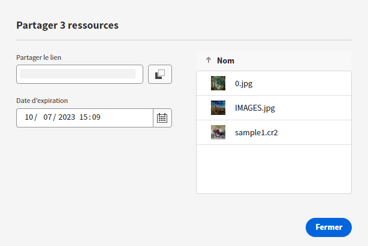
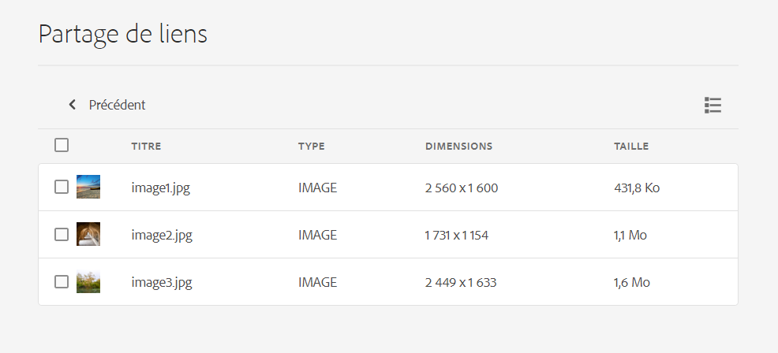

# Partager des liens vers des ressources {#share-links-assets}

<table>
    <tr>
        <td>
            <i>Nouveau</i> <a href="/help/assets/dynamic-media/dm-prime-ultimate.md"><b>Dynamic Media Prime et Ultimate</b></a>
        </td>
        <td>
            <i>Nouveau</i> <a href="/help/assets/assets-ultimate-overview.md"><b>AEM Assets Ultimate</b></a>
        </td>
        <td>
            <i>Nouvelle</i> <a href="/help/assets/integrate-aem-assets-edge-delivery-services.md"><b>Intégration d’AEM Assets à Edge Delivery Services</b></a>
        </td>
        <td>
            <i>Nouveau</i> <a href="/help/assets/aem-assets-view-ui-extensibility.md"><b>Extensibilité de l’interface utilisateur</b></a>
        </td>
          <td>
            <i>Nouveau</i> <a href="/help/assets/dynamic-media/enable-dynamic-media-prime-and-ultimate.md"><b>Activation de Dynamic Media Prime et Ultimate</b></a>
        </td>
    </tr>
    <tr>
        <td>
            <a href="/help/assets/search-best-practices.md"><b>Bonnes pratiques de recherche</b></a>
        </td>
        <td>
            <a href="/help/assets/metadata-best-practices.md"><b>Bonnes pratiques relatives aux métadonnées</b></a>
        </td>
        <td>
            <a href="/help/assets/product-overview.md"><b>Hub de contenus</b></a>
        </td>
        <td>
            <a href="/help/assets/dynamic-media-open-apis-overview.md"><b>Fonctionnalités Dynamic Media avec OpenAPI</b></a>
        </td>
        <td>
            <a href="https://developer.adobe.com/experience-cloud/experience-manager-apis/"><b>Documentation de développement pour AEM Assets</b></a>
        </td>
    </tr>
</table>

[!DNL Assets view] vous permet de générer un lien et de partager des ressources avec des parties prenantes externes qui n’ont pas accès à l’application [!DNL Assets view]. Vous pouvez définir une date d’expiration pour le lien, puis le partager avec d’autres utilisateurs en utilisant votre méthode de communication préférée, comme les e-mails ou les services de messagerie. Les destinataires du lien peuvent prévisualiser les ressources et les télécharger.

## Générer un lien pour les ressources {#generate-link-for-assets}

Pour générer un lien pour une ressource ou un dossier contenant des ressources :

1. Sélectionnez les ressources ou les dossiers contenant des ressources, ou les deux, et cliquez sur **[!UICONTROL Partager le lien]**.

1. Si vous souhaitez l’ajuster, cliquez sur l’icône Calendrier pour définir une date d’expiration pour le lien à l’aide du champ **[!UICONTROL Date d’expiration]**. Vous pouvez également spécifier une date directement au format `yyyy-mm-dd`. Par défaut, la date d’expiration d’un lien est fixée à 2 semaines à compter de la date de partage.

1. Copiez le lien à partir du champ **[!UICONTROL Partager le lien]**.

   

1. Cliquez sur **[!UICONTROL Fermer]** et partagez le lien par e-mail ou par avec d’autres outils de collaboration.

## Accéder aux ressources partagées {#access-shared-assets}

Après avoir partagé le lien public pour les ressources, les destinataires peuvent cliquer sur le lien pour prévisualiser ou télécharger les ressources partagées dans un navigateur Web sans avoir à se connecter à [!DNL Assets view].

Cliquez sur le lien, cliquez sur le dossier pour accéder à la ressource, puis cliquez sur la ressource pour la prévisualiser. Vous pouvez choisir d’afficher les ressources partagées en Vue Liste ou Vue Vignette.

Vous pouvez pointer la souris sur la ressource partagée ou le dossier de ressources partagées pour la sélectionner ou la télécharger.

Vous pouvez également sélectionner plusieurs ressources et cliquer sur **[!UICONTROL Télécharger]**. [!DNL Assets view] télécharge les ressources sélectionnées sous la forme d’un fichier zip. [!DNL Assets view] crée un sous-dossier dans le fichier zip parent, portant le même nom que la ressource, pour chaque ressource que vous choisissez de télécharger.

Pour télécharger toutes les ressources en une seule fois, basculez sur la **[!UICONTROL Vue liste]**, cliquez sur **[!UICONTROL Tout sélectionner]** et ensuite sur **[!UICONTROL Télécharger]**.

## Étapes suivantes {#next-steps}

* [Regardez une vidéo pour partager des liens pour les ressources dans Assets Essentials](https://experienceleague.adobe.com/docs/experience-manager-learn/assets-essentials/basics/link-sharing.html?lang=fr)

* Faites des commentaires sur le produit en utilisant l’option [!UICONTROL Commentaires] disponible dans l’interface utilisateur d’Assets Essentials.

* Faites des commentaires sur la documentation en utilisant l’option [!UICONTROL Modifier cette page]  ou [!UICONTROL Enregistrer un problème]  disponible dans la barre latérale droite.

* Contactez l’[assistance clientèle](https://experienceleague.adobe.com/?support-solution=General&amp;lang=fr#support).
