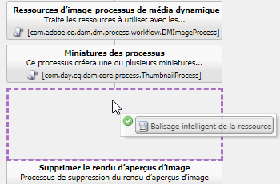
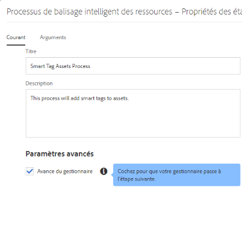

# Configuration d’Experience Manager pour le balisage intelligent des ressources {#configure-aem-for-smart-tagging}

Le balisage des actifs avec un vocabulaire contrôlé par taxonomie permet d’identifier et de récupérer facilement les actifs par des recherches basées sur les balises. Adobe fournit des balises intelligentes qui utilisent l’intelligence artificielle et des algorithmes d’apprentissage automatique pour former des images. Smart Tags utilise un cadre d’intelligence artificielle de [Adobe Sensei](https://www.adobe.com/sensei/experience-cloud-artificial-intelligence.html) pour former son algorithme de reconnaissance d’image à la structure de vos balises et à la taxonomie de votre entreprise.

La fonctionnalité Balises dynamiques est disponible à l’achat en tant que module complémentaire à [!DNL Experience Manager]. Après l’achat, un courrier électronique est envoyé à l’administrateur de votre organisation avec un lien vers les E/S Adobe. L’administrateur accède au lien pour intégrer les balises actives à [!DNL Experience Manager] l’aide des E/S Adobe.

<!-- TBD: 
1. Can a similar flowchart be created about how training works in CS? 
2. Is there a link to buy SCS or initiate a sales call.
3. Keystroke all steps and check all screenshots.
4. Post-GA, if time permits, create a video.
-->

## Intégration des E/S Adobe {#aio-integration}

Avant de pouvoir marquer les images à l’aide de SCS, intégrez-les [!DNL Adobe Experience Manager] au service Balises dynamiques à l’aide des E/S Adobe. À l’arrière-plan, le [!DNL Experience Manager] serveur authentifie vos informations d’identification de service auprès de la passerelle d’E/S Adobe avant de transférer votre demande au service.

* Créez une configuration dans [!DNL Experience Manager] pour générer une clé publique. Obtention d’un certificat public pour l’intégration OAuth.
* Création d’une intégration dans Adobe I/O et téléchargement de la clé publique générée.
* Configure your [!DNL Experience Manager] instance using the API key and other credentials from Adobe I/O.
* Facultativement, activation du balisage automatique lors du téléchargement de ressources.

### Conditions préalables à l&#39;intégration E/S Adobe {#prerequisite-for-aio-integration}

Avant de pouvoir utiliser les balises actives, vérifiez les éléments suivants pour créer une intégration sur les E/S Adobe :

* L’organisation doit disposer d’un compte Adobe ID pourvu de droits d’administrateur.
* Les balises actives sont activées pour votre organisation.

### Obtain a public certificate {#obtain-public-certificate}

Un certificat public permet d’authentifier votre profil sur Adobe I/O.

1. Dans l’interface [!DNL Experience Manager] utilisateur, accédez à **[!UICONTROL Outils]** > **[!UICONTROL Cloud Services]** > **[!UICONTROL Legacy Cloud Services]**.

1. On the Cloud Services page, click **[!UICONTROL Configure Now]** under **[!UICONTROL Assets Smart Tags]**.

1. Dans la boîte de dialogue **[!UICONTROL Créer une configuration]**, spécifiez un titre et un nom pour la configuration de balises intelligentes. Cliquez sur **[!UICONTROL Créer]**.

1. Dans la boîte de dialogue **[!UICONTROL Service de contenu dynamique AEM]**, utilisez les valeurs suivantes :

   **[!UICONTROL URL du service]**: `https://mc.adobe.io/marketingcloud/smartcontent`

   **[!UICONTROL Serveur d’autorisation]**: `https://ims-na1.adobelogin.com`

   Laissez les autres champs vides pour l’instant (pour les remplir ultérieurement). Cliquez sur **[!UICONTROL OK]**.

   

1. Click **[!UICONTROL Download Public Certificate for OAuth Integration]**, and download the public certificate file `AEM-SmartTags.crt`.

   

### Reconfigurer si un certificat expire {#certrenew}

Lorsque le certificat expire, il n’est plus approuvé. Pour ajouter un nouveau certificat, procédez comme suit. Vous ne pouvez pas renouveler un certificat expiré.

1. Log in your [!DNL Experience Manager] deployment as an administrator. Cliquez sur **[!UICONTROL Outils]** > **[!UICONTROL Sécurité]** > **[!UICONTROL Utilisateurs]**.

1. Recherchez et cliquez sur l’utilisateur **[!UICONTROL dam-update-service]** . Cliquez sur l’onglet **[!UICONTROL KeyStore]**.
1. Supprimez le fichier de stockage de clés **[!UICONTROL similaritysearch]** existant avec le certificat arrivé à expiration. Cliquez sur **[!UICONTROL Enregistrer et fermer]**.

   

   *Figure : Supprimez l’`similaritysearch`entrée existante dans Keystore pour ajouter un nouveau certificat de sécurité.*

1. Accédez à **[!UICONTROL Outils]** > **[!UICONTROL Cloud Services]** > **[!UICONTROL Ancienne version de Cloud Services]**. Cliquez sur **[!UICONTROL Balises dynamiques de ressources]** > **[!UICONTROL Afficher la configuration]** > **[!UICONTROL Configurations disponibles]**. Cliquez sur la configuration requise.

1. Pour télécharger un certificat public, cliquez sur **[!UICONTROL Télécharger le certificat public pour l’intégration Oauth]**.

1. Accédez à [https://console.adobe.io](https://console.adobe.io) et accédez au service existant dans le projet. Téléchargez le nouveau certificat. Pour plus d’informations, reportez-vous aux instructions de la section [Création de l’intégration Adobe I/O](#create-aio-integration).

### Création d’une intégration {#create-aio-integration}

Pour utiliser les API Balises intelligentes, créez une intégration dans les E/S Adobe pour générer la clé d’API, l’ID de compte technique, l’ID d’organisation et la clé secrète client.

1. Accédez à [https://console.adobe.io](https://console.adobe.io/).
1. Sélectionnez le compte approprié et vérifiez que le rôle d’organisation associé est un administrateur système. Créez un projet ou ouvrez un projet existant. Dans la page du projet, cliquez sur **[!UICONTROL Ajouter l’API]**.
1. Sur la page **[!UICONTROL Ajouter une API]** , sélectionnez **[!UICONTROL Experience Cloud]** et sélectionnez Contenu **** intelligent. Cliquez sur **[!UICONTROL Continuer]**.
1. Sur la page suivante, sélectionnez **[!UICONTROL Nouvelle intégration]**. Cliquez sur **[!UICONTROL Continuer]**.
1. Sur la page **[!UICONTROL Informations concernant l’intégration]**, indiquez un nom pour la passerelle d’intégration et ajoutez une description.
1. Dans **[!UICONTROL Certificats de clés publiques]**, chargez le fichier `AEM-SmartTags.crt` que vous avez téléchargé ci-dessus.
1. Cliquez sur **[!UICONTROL Créer une intégration]**.
1. To view the integration information, click **[!UICONTROL Continue to integration details]**.

   

### Configuration des balises actives {#configure-smart-content-service}

Pour configurer l’intégration, utilisez les valeurs des champs Identifiant de compte technique, Identifiant d’organisation, Secret du client, Serveur d’autorisation et Clé API de l’intégration Adobe I/O. Creating a Smart Tags cloud configuration allows authentication of API requests from the [!DNL Experience Manager] instance.

1. In [!DNL Experience Manager], navigate to **[!UICONTROL Tools > Cloud Service > Legacy Cloud Services]** to open the [!UICONTROL Cloud Services] console.
1. Sous **[!UICONTROL Ressources – Balises intelligentes]**, ouvrez la configuration créée ci-dessus. Sur la page de paramètres du service, cliquez sur **[!UICONTROL Modifier]**.
1. Dans la boîte de dialogue **[!UICONTROL Service de contenu dynamique AEM]**, utilisez les valeurs préremplies pour les champs **[!UICONTROL URL de service]** et **[!UICONTROL Serveur d’autorisation]**.
1. Pour les champs **[!UICONTROL Clé API]**, **[!UICONTROL ID de compte technique]**, **[!UICONTROL ID d’organisation]** et **[!UICONTROL Client secret]**, utilisez les valeurs générées ci-dessus.

### Valider la configuration {#validate-the-configuration}

Une fois la configuration terminée, vous pouvez utiliser un MBean JMX pour valider la configuration. Pour procéder à la validation, suivez ces étapes.

1. Accédez à votre [!DNL Experience Manager] serveur à `https://[aem_server]:[port]`.

1. Accédez à **[!UICONTROL Outils > Opérations > Console Web]** pour ouvrir la console OSGi. Cliquez sur **[!UICONTROL Principal > JMX]**.
1. Cliquez sur **[!UICONTROL com.day.cq.dam.similaritysearch.internal.impl]**. Les **[!UICONTROL tâches relatives à SimilaritySearch]** s’ouvrent alors..
1. Cliquez sur **[!UICONTROL validateConfigs()]**. In the **[!UICONTROL Validate Configurations]** dialog, click **[!UICONTROL Invoke]**.

   Le résultat de la validation s’affiche dans la même boîte de dialogue.

## Activer le balisage intelligent pour les ressources nouvellement transférées (facultatif) {#enable-smart-tagging-for-uploaded-assets}

1. Dans [!DNL Experience Manager], accédez à **[!UICONTROL Outils > Processus > Modèles]**.
1. Sur la page **[!UICONTROL Modèles de processus]**, sélectionnez le modèle de processus **[!UICONTROL Ressources de mise à jour de DAM]**.
1. Click **[!UICONTROL Edit]** from the toolbar.
1. Développez le panneau latéral pour afficher les étapes. Faites glisser l’étape **[!UICONTROL Balisage intelligent de la ressource]** disponible dans la section Processus de DAM (gestion des actifs numériques) et placez-la après l’étape **[!UICONTROL Traiter les miniatures]**.

   

   *Figure : Ajoutez l’étape de la ressource de balise active après l’étape de la miniature de processus dans le processus de mise à jour de la ressource de gestion des actifs numériques.*

1. Ouvrez l’étape à configurer. Sous **[!UICONTROL Paramètres avancés]**, vérifiez que l’option **[!UICONTROL Avance du gestionnaire]** est sélectionnée.

   

1. Dans l’onglet **[!UICONTROL Arguments]** , sélectionnez **[!UICONTROL Ignorer les erreurs]** si vous souhaitez que le processus ignore les échecs lors de la prédiction des balises. Pour baliser les ressources lors de leur chargement, que le balisage intelligent soit activé ou non dans les dossiers, cochez la case **[!UICONTROL Ignorer l’indicateur de balise intelligente]**.

1. Click **[!UICONTROL OK]** to close the process step, and then save the workflow. Cliquez sur **[!UICONTROL Synchroniser]**.

>[!MORELIKETHIS]
>
>* [Marquer des fichiers à l’aide du service dynamique](smart-tags.md)

