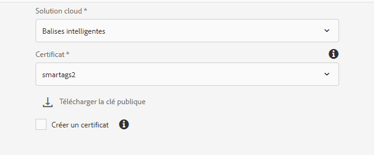
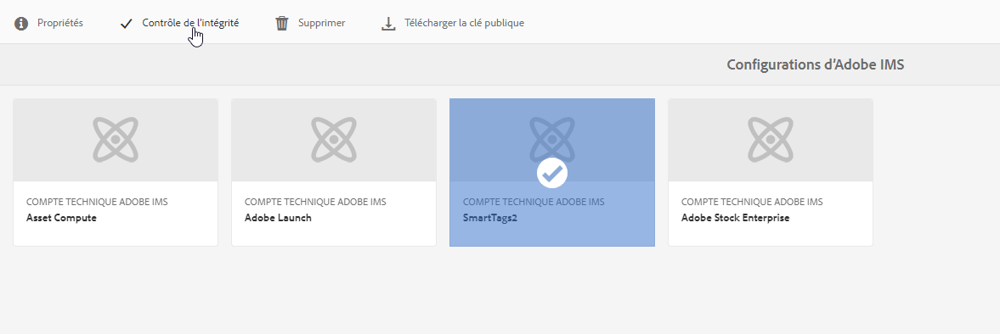

# Configuration d’Experience Manager pour le balisage intelligent des ressources {#configure-aem-for-smart-tagging}

Le balisage des actifs avec un vocabulaire contrôlé par taxonomie permet d’identifier et de récupérer facilement les actifs par des recherches basées sur les balises. Adobe fournit des balises intelligentes qui utilisent l’intelligence artificielle et des algorithmes d’apprentissage automatique pour former des images. Smart Tags utilise un cadre d’intelligence artificielle de [Adobe Sensei](https://www.adobe.com/sensei/experience-cloud-artificial-intelligence.html) pour former son algorithme de reconnaissance d’image à la structure de vos balises et à la taxonomie de votre entreprise.

La fonctionnalité Balises dynamiques est disponible à l’achat en tant que module complémentaire à [!DNL Experience Manager]. Après l’achat, un courrier électronique est envoyé à l’administrateur de votre organisation avec un lien vers Adobe Developer Console. L’administrateur accède au lien pour intégrer les balises actives à [!DNL Experience Manager] l’aide d’Adobe Developer Console.

<!-- TBD: 
1. Can a similar flowchart be created about how training works in CS? 
2. Is there a link to buy SCS or initiate a sales call.
3. Keystroke all steps and check all screenshots.
4. Post-GA, if time permits, create a video.
-->

## Intégration d’Adobe Developer Console {#aio-integration}

Avant de pouvoir marquer les images à l’aide de SCS, intégrez-les [!DNL Adobe Experience Manager] au service Smart Tags à l’aide de Adobe Developer Console. At the back end, the [!DNL Experience Manager] server authenticates your service credentials with the Adobe Developer Console gateway before forwarding your request to the service.

* Créez une configuration dans [!DNL Experience Manager] pour générer une clé publique. Obtention d’un certificat public pour l’intégration OAuth.
* Créez une intégration dans Adobe Developer Console et téléchargez la clé publique générée.
* Configure your [!DNL Experience Manager] instance using the API key and other credentials from Adobe Developer Console.
* Facultativement, activation du balisage automatique lors du téléchargement de ressources.

### Conditions préalables à l’intégration de Adobe Developer Console {#prerequisite-for-aio-integration}

Avant d’utiliser les balises actives, assurez-vous que les éléments suivants sont nécessaires pour créer une intégration dans Adobe Developer Console :

* L’organisation doit disposer d’un compte Adobe ID pourvu de droits d’administrateur.
* Les balises actives sont activées pour votre organisation.

### Obtain a public certificate {#obtain-public-certificate}

Un certificat public vous permet d’authentifier votre profil sur Adobe Developer Console. Vous créez un certificat à partir de [!DNL Experience Manager].

1. Dans l’interface [!DNL Experience Manager] utilisateur, accédez à **[!UICONTROL Outils]** > **[!UICONTROL Sécurité]** > Configurations **[!UICONTROL IMS]** Adobe.

1. Dans la page Configurations [!UICONTROL IMS] Adobe, cliquez sur **[!UICONTROL Créer]**. Dans le menu Solution **** Cloud, sélectionnez Balises **** dynamiques.

1. Select **[!UICONTROL Create new certificate]**. Indiquez un nom et cliquez sur **[!UICONTROL Créer un certificat]**. Cliquez sur **[!UICONTROL OK]**.

1. Click **[!UICONTROL Download Public Key]**.

   

### Reconfigurer si un certificat expire {#certrenew}

Lorsque le certificat expire, il n’est plus approuvé. Pour ajouter un nouveau certificat, procédez comme suit. Vous ne pouvez pas renouveler un certificat expiré.

1. Log in your [!DNL Experience Manager] deployment as an administrator. Cliquez sur **[!UICONTROL Outils]** > **[!UICONTROL Sécurité]** > **[!UICONTROL Utilisateurs]**.

1. Recherchez et cliquez sur l’utilisateur **[!UICONTROL dam-update-service]** . Cliquez sur l’onglet **[!UICONTROL KeyStore]**.
1. Supprimez le fichier de stockage de clés **[!UICONTROL similaritysearch]** existant avec le certificat arrivé à expiration. Cliquez sur **[!UICONTROL Enregistrer et fermer]**.

   

   *Figure : Supprimez l’`similaritysearch`entrée existante dans Keystore pour ajouter un nouveau certificat de sécurité.*

1. Dans l’interface [!DNL Experience Manager] utilisateur, accédez à **[!UICONTROL Outils]** > **[!UICONTROL Sécurité]** > Configurations **[!UICONTROL IMS]** Adobe. Ouvrez la configuration des balises actives disponible. To download a public certificate, click **[!UICONTROL Download Public Certificate]**.

1. Accédez à [https://console.adobe.io](https://console.adobe.io) et accédez au service existant dans le projet. Téléchargez le nouveau certificat et configurez-le. Pour plus d’informations sur la configuration, voir les instructions de la section [Création de l’intégration](#create-aio-integration)de la Console développeur Adobe.

### Création d’une intégration {#create-aio-integration}

Pour utiliser les balises actives, créez une intégration dans Adobe Developer Console afin de générer une clé d’API, un ID de compte technique, un ID d’organisation et une clé secrète client.

1. Accédez à [https://console.adobe.io](https://console.adobe.io/) dans un navigateur. Sélectionnez le compte approprié et vérifiez que le rôle d’organisation associé est un administrateur système.
1. Créez un projet avec le nom de votre choix. Cliquez sur **[!UICONTROL Ajouter l’API]**.
1. Sur la page **[!UICONTROL Ajouter une API]** , sélectionnez **[!UICONTROL Experience Cloud]** et sélectionnez Contenu **** intelligent. Cliquez sur **[!UICONTROL Suivant]**.
1. Sélectionnez **[!UICONTROL Télécharger votre clé]** publique. Fournissez le fichier de certificat téléchargé à partir de [!DNL Experience Manager]. Un message indiquant que les clés [!UICONTROL publiques chargées avec succès] s’affichent. Cliquez sur **[!UICONTROL Suivant]**.
1. [!UICONTROL Créer une nouvelle page d’informations d’identification] de compte de service (JWT) affiche la clé publique du compte de service qui vient d’être configuré. Cliquez sur **[!UICONTROL Suivant]**.
1. Dans la page **[!UICONTROL Sélectionner des profils]** de produits, sélectionnez **[!UICONTROL Smart Content Services]**. Cliquez sur **[!UICONTROL Enregistrer l’API]** configurée. Une page affiche plus d’informations sur la configuration. Gardez cette page ouverte pour copier et ajouter ces valeurs dans Experience Manager lors de la configuration ultérieure des balises actives dans [!DNL Experience Manager].

   

### Configuration des balises actives {#configure-smart-content-service}

Pour configurer l’intégration, utilisez les valeurs des champs Charge, Clé client, Serveur d’autorisation et Clé d’API de l’intégration Adobe Developer Console.

1. Dans l’interface [!DNL Experience Manager] utilisateur, accédez à **[!UICONTROL Outils]** > **[!UICONTROL Sécurité]** > Configurations **[!UICONTROL IMS]** Adobe.
1. Accédez à la page Configuration **[!UICONTROL du compte technique]** Adobe IMS **[!UICONTROL , fournissez un]** titresouhaité.
1. Dans le champ **[!UICONTROL Authorization Server]** , indiquez `https://ims-na1.adobelogin.com` URL.
1. Dans le champ Clé **** d’API, indiquez l’ID **** du client à partir du [!DNL Adobe Developer Console].
1. Dans le champ **[!UICONTROL Clé secrète]** client, fournissez la clé secrète **** client à partir du [!DNL Adobe Developer Console]. Cliquez sur l’option **[!UICONTROL Récupérer la clé secrète]** du client pour l’afficher.
1. Dans [!DNL Adobe Developer Console]votre projet, cliquez sur **[!UICONTROL Compte de service (JWT)]** dans la marge de gauche. Cliquez sur **[!UICONTROL l’onglet Générer JWT]** . Cliquez sur **[!UICONTROL Copier]** pour copier la charge **** JWT affichée. Indiquez cette valeur dans le champ **[!UICONTROL Charge]** de [!DNL Experience Manager]. Cliquez sur **[!UICONTROL Créer]**.

### Valider la configuration {#validate-the-configuration}

Une fois la configuration terminée, procédez comme suit pour la valider.

1. Dans l’interface [!DNL Experience Manager] utilisateur, accédez à **[!UICONTROL Outils]** > **[!UICONTROL Sécurité]** > Configurations **[!UICONTROL IMS]** Adobe.

1. Sélectionnez la configuration des balises actives. Cliquez sur **[!UICONTROL Vérifier l’intégrité]** dans la barre d’outils. Cliquez sur **[!UICONTROL Vérifier]**. Une boîte de dialogue contenant un message de configuration  saine confirme que la configuration fonctionne.

## Activer le balisage intelligent pour les ressources nouvellement transférées (facultatif) {#enable-smart-tagging-for-uploaded-assets}

1. Dans [!DNL Experience Manager], accédez à **[!UICONTROL Outils > Processus > Modèles]**.
1. Sur la page **[!UICONTROL Modèles de processus]**, sélectionnez le modèle de processus **[!UICONTROL Ressources de mise à jour de DAM]**.
1. Click **[!UICONTROL Edit]** from the toolbar.
1. Développez le panneau latéral pour afficher les étapes. Faites glisser l’étape **[!UICONTROL Balisage intelligent de la ressource]** disponible dans la section Processus de DAM (gestion des actifs numériques) et placez-la après l’étape **[!UICONTROL Traiter les miniatures]**.

   

   *Figure : Ajoutez l’étape de la ressource de balise active après l’étape de la miniature de processus dans le processus de mise à jour de la ressource de gestion des actifs numériques.*

1. Ouvrez l’étape à configurer. Sous **[!UICONTROL Paramètres avancés]**, vérifiez que l’option **[!UICONTROL Avance du gestionnaire]** est sélectionnée.

   

1. Dans l’onglet **[!UICONTROL Arguments]** , sélectionnez **[!UICONTROL Ignorer les erreurs]** si vous souhaitez que le processus ignore les échecs lors de la prédiction des balises. Pour baliser les ressources lors de leur chargement, que le balisage intelligent soit activé ou non dans les dossiers, cochez la case **[!UICONTROL Ignorer l’indicateur de balise intelligente]**.

1. Click **[!UICONTROL OK]** to close the process step, and then save the workflow. Cliquez sur **[!UICONTROL Synchroniser]**.

>[!MORELIKETHIS]
>
>* [Marquer des fichiers à l’aide du service dynamique](smart-tags.md)

