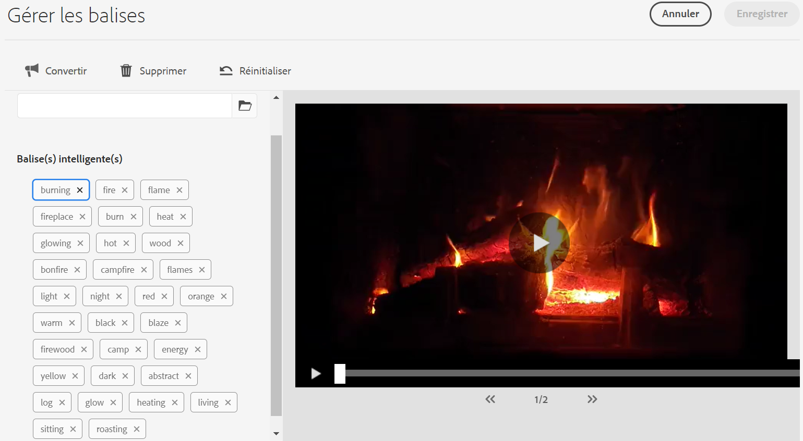

# Balisage intelligent de vos ressources vidéo {#video-smart-tags}

| [Bonnes pratiques de recherche](/help/assets/search-best-practices.md) | [ Bonnes pratiques en matière de métadonnées](/help/assets/metadata-best-practices.md) | [Hub de contenus](/help/assets/product-overview.md) | [Dynamic Media avec fonctionnalités OpenAPI](/help/assets/dynamic-media-open-apis-overview.md) | [Documentation destinée aux développeurs AEM Assets](https://developer.adobe.com/experience-cloud/experience-manager-apis/) |
| ------------- | --------------------------- |---------|----|-----|

Le besoin croissant de nouveaux contenus impose de recourir à des opérations manuelles réduites pour obtenir en un rien de temps des expériences digitales attrayantes. [!DNL Adobe Experience Manager] as a [!DNL Cloud Service] prend en charge le balisage automatique des ressources vidéo à l’aide de l’intelligence artificielle. Le balisage manuel des vidéos peut prendre beaucoup de temps. Cependant, la fonctionnalité de balisage intelligent des vidéos optimisée à l’aide d’[!DNL Adobe Sensei] s’appuie sur des modèles d’intelligence artificielle pour analyser le contenu vidéo et ajouter des balises aux ressources concernées. Ainsi, les utilisateurs des systèmes de gestion des ressources numériques (DAM) peuvent réduire le temps consacré à mettre des expériences enrichissantes à la disposition de leurs clients. Le service de machine learning d’Adobe génère deux jeux de balises pour une vidéo. Le premier ensemble correspond aux objets, scènes et attributs de cette vidéo ; l’autre jeu concerne des actions comme boire, courir et faire du jogging.

Le balisage vidéo est activé par défaut dans [!DNL Adobe Experience Manager] as a [!DNL Cloud Service]. Cependant, vous pouvez [exclure le balisage intelligent de vidéos](#opt-out-video-smart-tagging) pour un dossier. Les vidéos sont automatiquement balisées lorsque vous en chargez de nouvelles ou que vous retraitez des vidéos existantes. [!DNL Experience Manager] crée également les miniatures et extrait les métadonnées des fichiers vidéo. Les balises intelligentes s’affichent dans l’ordre décroissant de leur [score de confiance](#confidence-score-video-tag) dans les [!UICONTROL Propriétés] de la ressource.

## Balisage intelligent des vidéos lors du chargement {#smart-tag-assets-on-ingestion}

Lorsque vous [chargez des ressources vidéo](add-assets.md#upload-assets) vers [!DNL Adobe Experience Manager] as a [!DNL Cloud Service], les vidéos font l’objet d’un traitement. Une fois le traitement terminé, observez l’onglet [!UICONTROL Simple] de la page [!UICONTROL Propriétés] de la ressource. Les balises intelligentes sont automatiquement ajoutées à la vidéo sous [!UICONTROL Balises intelligentes]. Les microservices de ressources utilisent [!DNL Adobe Sensei] pour créer ces balises intelligentes.


Les balises intelligentes appliquées sont triées par ordre décroissant de [score de confiance](#confidence-score-video-tag), combinées pour les balises d’objet et d’action, dans les [!UICONTROL Balises intelligentes].

>[!IMPORTANT]
>
>Il est conseillé de revoir ces balises générées automatiquement pour vous assurer qu’elles sont conformes à votre marque et à ses valeurs.

## Balisage intelligent des vidéos existantes dans la gestion des ressources numériques (DAM)  {#smart-tag-existing-videos}

Les ressources vidéo présentes dans la gestion des ressources numériques (DAM) ne sont pas balisées automatiquement. Vous devez [!UICONTROL retraiter les ressources] manuellement pour générer leurs balises intelligentes.

Pour baliser de manière dynamique des ressources vidéo ou des dossiers (y compris des sous-dossiers) de ressources qui existent déjà dans le référentiel, procédez comme suit :

1. Sélectionnez le logo [!DNL Adobe Experience Manager], puis les ressources dans la page [!UICONTROL Navigation].

1. Sélectionnez [!UICONTROL Fichiers] pour afficher l’interface d’Assets.

1. Accédez au dossier auquel vous souhaitez appliquer des balises intelligentes.

1. Sélectionnez le dossier complet ou des ressources vidéo spécifiques.

1. Sélectionnez  l’icône [!UICONTROL Retraiter les ressources] et sélectionnez l’option [!UICONTROL Processus complet].

<!-- TBD: Limit size -->


Une fois le processus terminé, accédez à la page [!UICONTROL Propriétés] des ressources vidéo dans le dossier. Les balises ajoutées automatiquement sont affichées dans la section [!UICONTROL Balises intelligentes] de l’onglet [!UICONTROL Simple]. Ces balises intelligentes appliquées sont triées par ordre décroissant de [score de confiance](#confidence-score-video-tag).

## Recherche de vidéos balisées {#search-smart-tagged-videos}

Pour rechercher des ressources vidéo en fonction des balises intelligentes générées automatiquement, utilisez [Omnisearch](search-assets.md#search-assets-in-aem) :

1. Sélectionnez l’icône de recherche  pour afficher le champ Omnisearch.

1. Dans le champ Omnisearch, spécifiez une balise que vous n’avez pas explicitement ajoutée à une vidéo.

1. Recherche basée sur la balise.

Les résultats de la recherche affichent les ressources vidéo en fonction de la balise spécifiée.

Les résultats de la recherche conjuguent les ressources vidéo avec des mots-clés recherchés dans les métadonnées et les ressources vidéo associées à des balises intelligentes avec les mots-clés recherchés. Cependant, les résultats de recherche qui correspondent à tous les termes de recherche dans les champs de métadonnées s’affichent en premier, suivis des résultats correspondant à l’un des termes de recherche des balises intelligentes. Pour plus d’informations, voir [Comprendre les résultats de recherches [!DNL Experience Manager] avec des balises intelligentes](smart-tags.md#understand-search).

## Modération des balises intelligentes des vidéos {#moderate-video-smart-tags}

[!DNL Adobe Experience Manager] vous permet de traiter les balises intelligentes pour :

* Supprimer les balises inexactes attribuées aux vidéos de votre marque.

* Affiner les recherches de vidéos basées sur des balises en vous assurant qu’elles apparaissent dans les résultats de recherche pour les balises les plus pertinentes. Tout risque d’afficher des vidéos inappropriées dans les résultats de la recherche est donc écarté.

* Attribuez un rang supérieur à une balise pour augmenter sa pertinence par rapport à une vidéo. La promotion d’une balise pour une vidéo augmente la probabilité qu’une image apparaisse dans les résultats si la recherche est basée sur cette balise.

Pour en savoir plus sur la manière de modérer les balises intelligentes pour les ressources, voir [Gestion des balises intelligentes](smart-tags.md#manage-smart-tags-and-searches).



>[!NOTE]
>
>Les balises modérées selon la procédure décrite dans la section [Gestion des balises intelligentes](smart-tags.md#manage-smart-tags-and-searches) ne sont pas mémorisées lors du retraitement de la ressource. Le jeu de balises d’origine s’affiche à nouveau.

## Exclusion (opt-out) du balisage intelligent des vidéos {#opt-out-video-smart-tagging}

Comme le balisage automatique des vidéos est effectué en parallèle à d’autres tâches de traitement des ressources, telles que la création de miniatures et l’extraction des métadonnées, cela peut prendre du temps. Pour accélérer le traitement des ressources, vous pouvez exclure le balisage intelligent des vidéos lors du chargement dans le dossier.

Pour exclure (opt-out) la génération automatique de balises intelligentes des vidéos pour les ressources chargées dans un dossier spécifique :

1. Ouvrez l’onglet [!UICONTROL Traitement des ressources] dans le dossier [!UICONTROL Propriétés].

1. Dans le menu [!UICONTROL Balises intelligentes pour les vidéos], l’option [!UICONTROL Hérité] est sélectionnée par défaut et la balise intelligente des vidéos est activée.

   Lorsque l’option [!UICONTROL Hérité] est sélectionnée, le chemin d’accès au dossier hérité est également visible avec les informations indiquant s’il est défini sur [!UICONTROL Activer] ou [!UICONTROL Désactiver].

   

1. Sélectionnez [!UICONTROL Désactiver] pour exclure le balisage intelligent des vidéos chargées dans le dossier.

>[!IMPORTANT]
>
>Si vous avez choisi de ne pas baliser les vidéos dans un dossier au moment du chargement et que vous souhaitez appliquer des balises intelligentes aux vidéos après le chargement, **[!UICONTROL activez les balises intelligentes pour les vidéos]** à partir de l’onglet [!UICONTROL Traitement des ressources] du dossier [!UICONTROL Propriétés] et utilisez [[!UICONTROL Retraiter les ressources]](#smart-tag-existing-videos) pour ajouter des balises intelligentes dans la vidéo.

## Score de confiance {#confidence-score-video-tag}

[!DNL Adobe Experience Manager] applique un seuil minimal de confiance aux balises intelligentes d’objet et d’action pour éviter toute surcharge en balises, ce qui pourrait ralentir l’indexation. Les résultats de la recherche de ressources sont classés en fonction des scores de confiance, ce qui améliore généralement ces résultats au-delà de ce qu’une inspection des balises affectées aux ressources vidéo suggérerait. Les balises inexactes présentent souvent des scores de confiance faibles, de sorte qu’elles apparaissent rarement en haut de la liste des balises intelligentes des ressources.

Le seuil par défaut pour les balises d’action et d’objet dans [!DNL Adobe Experience Manager] est de 0,7 (il doit être compris entre 0 et 1). Si certaines ressources vidéo ne sont pas munies d’une balise spécifique, c’est que l’algorithme donne un score de confiance inférieur à 70 % d’assurance pour les balises possédant une prédiction. Le seuil par défaut n’est pas systématiquement optimal pour tous les utilisateurs. Vous pouvez donc modifier la valeur du score de confiance dans la configuration OSGI.

Pour ajouter la configuration OSGI du score de confiance au projet déployé dans [!DNL Adobe Experience Manager] as a [!DNL Cloud Service] à l’aide de [!DNL Cloud Manager] :

* Dans le projet [!DNL Adobe Experience Manager] (`ui.config` depuis Archetype 24, ou précédemment `ui.apps`), la configuration OSGi`config.author`, incluez un fichier de configuration nommé `com.adobe.cq.assetcompute.impl.senseisdk.SenseiSdkImpl.cfg.json` avec le contenu suivant :

```json
{
  "minVideoActionConfidenceScore":0.5,
  "minVideoObjectConfidenceScore":0.5,
}
```

>[!NOTE]
>
>Les balises manuelles se voient attribuer un degré de confiance égal à 100 % (fiabilité maximale). Ainsi, s’il existe des ressources vidéo possédant des balises manuelles qui correspondent à la requête de recherche, elles s’affichent avant les balises intelligentes correspondant à cette requête.

## Restrictions {#video-smart-tagging-limitations}

* Vous ne pouvez pas entraîner le service qui applique les balises intelligentes aux vidéos en utilisant des vidéos spécifiques. Le processus fonctionne avec les paramètres [!DNL Adobe Sensei] par défaut.

* La progression du balisage n’est pas affichée.

* Seules les vidéos d’une taille de fichier de moins de 300 Mo sont balisées automatiquement. Le service [!DNL Adobe Sensei] ignore les fichiers vidéo de plus grande taille.

* Seules sont balisées les vidéos dans les formats de fichier et les codecs pris en charge mentionnés dans [Balises intelligentes](/help/assets/smart-tags.md#smart-tags-supported-file-formats).

**Voir également**

* [Traduire les ressources](translate-assets.md)
* [API HTTP Assets](mac-api-assets.md)
* [Formats de fichiers pris en charge par Assets](file-format-support.md)
* [Rechercher des ressources](search-assets.md)
* [Ressources connectées](use-assets-across-connected-assets-instances.md)
* [Rapports de ressources](asset-reports.md)
* [Schémas de métadonnées](metadata-schemas.md)
* [Télécharger des ressources](download-assets-from-aem.md)
* [Gestion des métadonnées](manage-metadata.md)
* [Facettes de recherche](search-facets.md)
* [Gérer les collections](manage-collections.md)
* [Import des métadonnées en bloc](metadata-import-export.md)
* [Publier des ressources sur AEM et Dynamic Media](/help/assets/publish-assets-to-aem-and-dm.md)

>[!MORELIKETHIS]
>
>* [Gestion des balises intelligentes et des recherches de ressources](smart-tags.md#manage-smart-tags-and-searches)
>* [Entraîner le service de balises intelligentes et baliser vos images](smart-tags.md)
