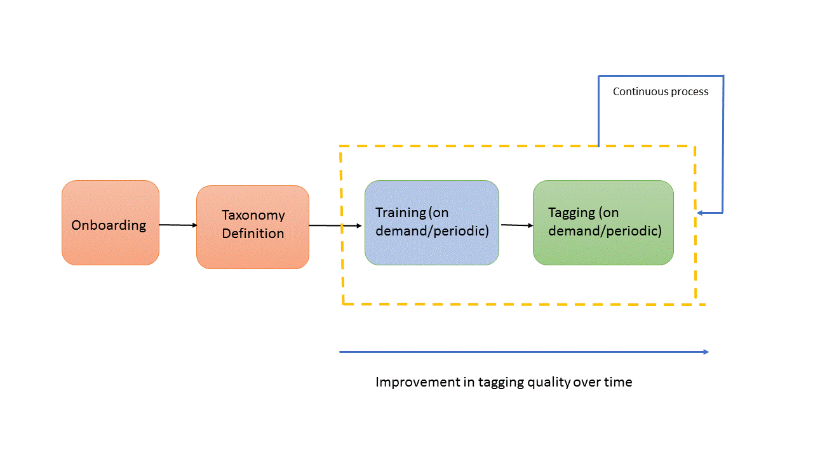
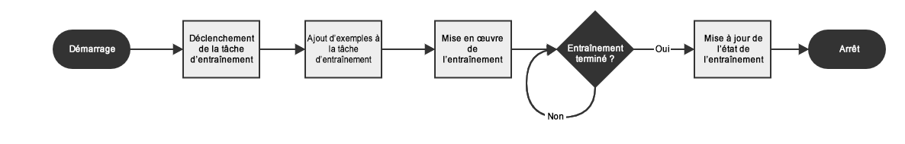
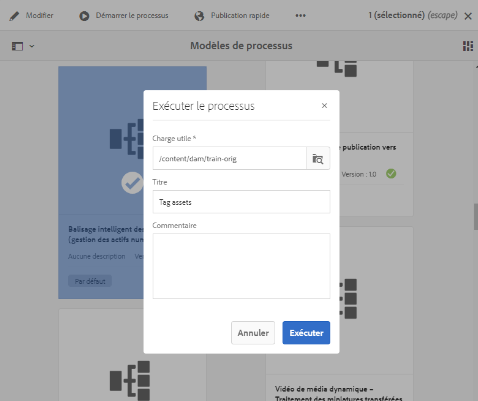
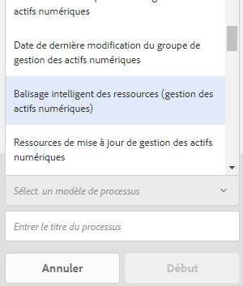

# Formation du service Smart Tag et balisage de vos images {#train-service-tag-assets}

Les entreprises qui traitent les ressources numériques utilisent de plus en plus le vocabulaire contrôlé par taxonomie dans les métadonnées des ressources. Il comprend essentiellement une liste de mots-clés que les employés, les partenaires et les clients utilisent couramment pour se référer à leurs ressources numériques et les rechercher. Le balisage des actifs avec un vocabulaire contrôlé par taxonomie permet d’identifier et de récupérer facilement les actifs par des recherches basées sur les balises.

Par rapport aux vocabulaires de langue naturelle, le balisage basé sur la taxonomie métier permet d’aligner les actifs avec une société et de s’assurer que les actifs les plus pertinents apparaissent dans les recherches. Par exemple, un fabricant de voiture peut baliser des images de voiture avec des noms de modèle afin que seules les images pertinentes s’affichent lors de la recherche pour concevoir une campagne de promotion.

In the background, the Smart Tags uses an artificial intelligence framework of [Adobe Sensei](https://www.adobe.com/sensei/experience-cloud-artificial-intelligence.html) to train its image recognition algorithm on your tag structure and business taxonomy. Cette intelligence de contenu est ensuite utilisée pour appliquer les balises pertinentes sur un ensemble de ressources différentes.

<!-- TBD: Create a similar flowchart for how training works in CS.
 
-->

Pour utiliser le balisage intelligent, effectuez les tâches suivantes :

* [Intégration d’Experience Manager à Adobe Developer Console](#integrate-aem-with-aio).
* [Comprendre les modèles de balises et les directives](#understand-tag-models-guidelines).
* [Entraînez le modèle](#train-model).
* [Balisez vos ressources](#tag-assets)numériques.
* [Gérez les balises et les recherches](#manage-smart-tags-and-searches).

Les balises actives ne s’appliquent qu’aux [!DNL Adobe Experience Manager Assets] clients. Les balises actives sont disponibles à l’achat en tant que module complémentaire à [!DNL Experience Manager].

<!-- TBD: Is there a link to buy SCS or initiate a sales call. How are AIO services sold? -->

## Intégration [!DNL Experience Manager] à Adobe Developer Console {#integrate-aem-with-aio}

Vous pouvez intégrer [!DNL Adobe Experience Manager] des balises actives à l’aide de Adobe Developer Console. Utilisez cette configuration pour accéder au service de balises intelligentes depuis [!DNL Experience Manager].

Voir [Configuration d’Experience Manager pour le balisage intelligent des ressources](smart-tags-configuration.md) pour les tâches de configuration des balises actives. At the back end, the [!DNL Experience Manager] server authenticates your service credentials with the Adobe Developer Console gateway before forwarding your request to the Smart Tags service.

## Comprendre les modèles de balises et les directives {#understand-tag-models-guidelines}

Un modèle de balise est un groupe de balises connexes qui sont associées à un aspect visuel de l’image. Par exemple, une collection de chaussures peut avoir des balises différentes mais toutes les balises sont liées à des chaussures et peuvent appartenir au même modèle de balise. Les balises ne peuvent concerner que les aspects visuels distinctement différents des images. Pour comprendre la représentation du contenu d’un modèle de formation dans [!DNL Experience Manager], visualisez un modèle de formation en tant qu’entité de niveau supérieur composée d’un groupe de balises ajoutées manuellement et d’exemples d’images pour chaque balise. Chaque balise peut être appliquée exclusivement à une image.

Les balises qui ne peuvent pas être gérées de manière réaliste sont liées à :

* Aspects non visuels et abstraits, tels que l&#39;année ou la saison de la sortie d&#39;un produit, l&#39;humeur ou l&#39;émotion évoquée par une image.
* Des différences visuelles fines dans des produits tels que des chemises avec ou sans colliers ou de petits logos de produits incorporés sur des produits.

Avant de créer un modèle de balise et de former le service, identifiez un ensemble de balises uniques qui décrivent le mieux les objets des images dans le contexte de votre entreprise. Ensure that the assets in your curated set conform to [the training guidelines](#training-guidelines).

### Directives de formation {#training-guidelines}

Les images de votre visionneuse de formations doivent respecter les consignes suivantes :

**Quantité et taille :** 10 images au minimum et 50 images au maximum par balise.

**Cohérence** : les images pour une balise doivent être visuellement similaires. Il est préférable d’additionner les balises portant sur les mêmes aspects visuels (tels que le même type d’objets dans une image) dans un modèle de balise unique. For example, it is not a good idea to tag all of these images as `my-party` (for training) because they are not visually similar.

**Couverture** : les images d’entraînement doivent être suffisamment variées. L’idée est de fournir quelques exemples raisonnablement différents pour apprendre à AEM à se concentrer sur les bons éléments. Si vous appliquez la même balise sur des images visuellement différentes, incluez au moins cinq exemples de chaque type. Par exemple, pour la balise *pose-tête-baissée-mannequin*, incluez davantage d’images d’entraînement similaires à l’image mise en évidence ci-dessous pour que le service reconnaisse les images similaires avec plus de précision lors du balisage.

**Distraction/obstruction** : l’entraînement du service donne de meilleurs résultats sur les images qui ont moins de distractions (telles que des arrière-plans importants ou des objets/personnes sans lien avec le sujet principal). Par exemple, pour la balise *chaussure-décontractée*, la seconde image n’est pas un bon candidat pour l’entraînement.

**Complétude :** si une image est admissible pour plusieurs balises, ajoutez toutes les balises applicables avant d’inclure l’image à des fins de formation. Par exemple, pour les balises telles que *raincoat* et *model-side-view*, ajoutez les deux balises sur la ressource éligible avant de l’inclure pour la formation.

**Nombre de balises**: Adobe recommande de former un modèle à l’aide d’au moins deux balises distinctes et d’au moins 10 images différentes pour chaque balise. Dans un modèle de balise unique, n’ajoutez pas plus de 50 balises.

**Nombre d&#39;exemples**: Pour chaque balise, ajoutez au moins 10 exemples. Cependant, Adobe recommande environ 30 exemples. 50 exemples au maximum par balise sont pris en charge.

**Empêcher les faux positifs et les conflits**: Adobe recommande de créer un modèle de balise unique pour un aspect visuel unique. Organisez les modèles de balises de manière à éviter le chevauchement des balises entre les modèles. Par exemple, n’utilisez pas de balises communes comme `sneakers` dans deux noms de modèles de balises différents `shoes` et `footwear`. Le processus de formation remplace un modèle de balise entraîné par l’autre pour un mot-clé commun.

**Exemples**: Voici d&#39;autres exemples d&#39;orientation :

* Créez un modèle de balise qui inclut,
   * uniquement les balises relatives aux modèles de voiture.
   * uniquement les balises liées aux couleurs des chemises.
   * seulement les étiquettes relatives aux vestes pour les femmes et les hommes.
* Ne pas créer,
   * un modèle de balise qui inclut les modèles de voiture publiés en 2019 et 2020.
   * plusieurs modèles de balises qui incluent les mêmes quelques modèles de voiture.

**Images utilisées pour la formation**: Vous pouvez utiliser les mêmes images pour former différents modèles de balises. Cependant, elles n’associent pas une image à plusieurs balises dans un modèle de balise. Il est donc possible de baliser la même image avec des balises différentes appartenant à différents modèles de balises.

Vous ne pouvez pas annuler la formation. Les directives ci-dessus doivent vous aider à choisir les bonnes images à former.

## Formation du modèle pour vos balises personnalisées {#train-model}

Pour créer et former un modèle pour vos balises spécifiques à votre entreprise, procédez comme suit :

1. Créez les balises nécessaires et la structure de balises appropriée. Téléchargez les images appropriées dans le référentiel DAM.
1. Dans [!DNL Experience Manager] l’interface utilisateur, accédez à **[!UICONTROL Ressources]** > Modèle **** de formation.
1. Cliquez sur **[!UICONTROL Créer]**. Fournissez un **[!UICONTROL titre]**, **[!UICONTROL description]**.
1. Recherchez et sélectionnez les balises existantes dans `cq:tags` lesquelles vous souhaitez former le modèle. Cliquez sur **[!UICONTROL Suivant]**.
1. Dans la boîte de dialogue **[!UICONTROL Sélectionner les ressources]** , cliquez sur **[!UICONTROL Ajouter les ressources]** par rapport à chaque balise. Recherchez dans le référentiel DAM ou parcourez le référentiel pour sélectionner au moins 10 et au plus 50 images. Sélectionnez des fichiers et non le dossier. Une fois les images sélectionnées, cliquez sur **[!UICONTROL Sélectionner]**.
1. Pour prévisualisation des miniatures des images sélectionnées, cliquez sur l’accordéon devant une balise . Vous pouvez modifier votre sélection en cliquant sur **[!UICONTROL Ajouter les ressources]**. Une fois la sélection effectuée, cliquez sur **[!UICONTROL Envoyer]**. L’interface utilisateur affiche une notification au bas de la page indiquant que la formation est lancée.
1. Vérifiez l’état de la formation dans la colonne **[!UICONTROL État]** pour chaque modèle de balise. Les états possibles sont [!UICONTROL En attente], [!UICONTROL Formation]et [!UICONTROL Echec].

*Figure : Etapes du processus de formation pour former le modèle de balisage.*

### État et rapport de la formation à la Vue {#training-status}

Pour vérifier si le service Balises intelligentes est formé à vos balises dans l’ensemble de ressources d’identification, consultez le rapport de processus d’identification dans la console Rapports.

1. Dans [!DNL Experience Manager] l’interface, accédez à **[!UICONTROL Outils > Ressources > Rapports]**.
1. In the **[!UICONTROL Asset Reports]** page, click **[!UICONTROL Create]**.
1. Select the **[!UICONTROL Smart Tags Training]** report, and then click **[!UICONTROL Next]** from the toolbar.
1. Indiquez un titre et une description pour le rapport. Sous **[!UICONTROL Planifier le rapport]**, laissez l’option **[!UICONTROL Maintenant]** sélectionnée. Si vous souhaitez planifier le rapport pour une date ultérieure, sélectionnez **[!UICONTROL Plus tard]** et spécifiez une date et une heure. Then, click **[!UICONTROL Create]** from the toolbar.
1. Dans la page **[!UICONTROL Rapports de ressources]**, sélectionnez le rapport que vous avez généré. To view the report, click **[!UICONTROL View]** from the toolbar.
1. Passez en revue les détails du rapport. Le rapport affiche l’état d’identification des balises que vous avez formées. The green color in the **[!UICONTROL Training Status]** column indicates that the Smart Tags service is trained for the tag. La couleur jaune indique que le service n’est pas complètement entraîné pour une balise particulière. Dans ce cas, ajoutez d’autres images avec la balise particulière et exécutez le processus d’entraînement pour l’entraînement complet du service sur la balise. Si vos balises ne s’affichent pas dans ce rapport, réexécutez le processus de formation pour ces balises.Balises
1. To download the report, select it from the list, and click **[!UICONTROL Download]** from the toolbar. Le rapport est téléchargé sous forme de feuille de calcul Microsoft Excel.

## Marquer des ressources {#tag-assets}

Après avoir formé le service Balises dynamiques, vous pouvez déclencher le processus de balisage afin d’appliquer automatiquement les balises appropriées à un ensemble différent de ressources similaires. Vous pouvez appliquer le processus de balisage régulièrement ou à tout moment. Le processus de balisage s’applique à la fois aux fichiers et aux dossiers.

### Tag assets from the workflow console {#tagging-assets-from-the-workflow-console}

1. Dans l’interface d’Experience Manager, accédez à **[!UICONTROL Outils > Processus > Modèles]**.
1. From the **[!UICONTROL Workflow Models]** page, select the **[!UICONTROL DAM Smart Tags Assets]** workflow and then click **[!UICONTROL Start Workflow]** from the toolbar.

   

1. In the **[!UICONTROL Run Workflow]** dialog, browse to the payload folder containing assets on which you want to apply your tags automatically.
1. Indiquez un titre pour le workflow et un commentaire facultatif. Cliquez sur **[!UICONTROL Exécuter]**.

   

   Accédez au dossier Fichiers et passez en revue les balises pour vérifier si vos ressources sont correctement balisées. For details, see [manage smart tags](#manage-smart-tags-and-searches).

### Tag assets from the timeline {#tagging-assets-from-the-timeline}

1. Depuis l’interface utilisateur Assets, sélectionnez le dossier contenant les ressources ou des ressources spécifiques auxquelles vous souhaitez appliquer des balises intelligentes.
1. Dans le coin supérieur gauche, ouvrez le **[!UICONTROL journal]**.
1. Ouvrez les actions dans la partie inférieure de la barre latérale gauche et cliquez sur Processus **[!UICONTROL de]** Début.

   

1. Sélectionnez le workflow **[!UICONTROL Balisage intelligent des ressources (gestion des actifs numériques)]** et spécifiez un titre pour le workflow.
1. Cliquez sur **[!UICONTROL Démarrer]**. Le workflow applique vos balises sur les ressources. Accédez au dossier Fichiers et passez en revue les balises pour vérifier si vos fichiers sont correctement balisés. For details, see [manage smart tags](#manage-smart-tags-and-searches).

>[!NOTE]
>
>Lors des cycles de balisage suivants, seules les ressources modifiées sont à nouveau balisées avec des balises nouvellement entraînées. Cependant, même les ressources non altérées sont balisées si l’écart entre le dernier cycle de balisage et le cycle de balisage actuel pour le processus de balisage dépasse 24 heures. Pour les workflows de balisage périodiques, les ressources non modifiées sont balisées lorsque l’intervalle de temps dépasse 6 mois.

### Marquer les fichiers téléchargés {#tag-uploaded-assets}

Experience Manager peut automatiquement baliser les ressources que les utilisateurs téléchargent vers DAM. Pour ce faire, les administrateurs configurent un flux de travail afin d’ajouter une étape disponible de la section aux ressources des balises actives. Voir [comment activer le balisage intelligent pour les fichiers](/help/assets/smart-tags-configuration.md#enable-smart-tagging-for-uploaded-assets)téléchargés.

## Manage smart tags and image searches {#manage-smart-tags-and-searches}

Vous pouvez organiser les balises intelligentes pour supprimer toute balise non pertinente qui pourrait avoir été attribuée à vos images de marque, afin que seules les balises les plus pertinentes s’affichent.

La modération de balises intelligentes contribue également à affiner les résultats des recherches d’images basées sur des balises, en garantissant que votre image apparaisse dans les résultats de la recherche pour les balises les plus pertinentes. Essentiellement, cela réduit les risques que des images non pertinentes apparaissent dans les résultats de la recherche.

Vous pouvez également attribuer un rang supérieur à une balise afin d’accroître son degré de pertinence par rapport à une image. La promotion d’une balise pour une image augmente les risques qu’une image apparaisse dans les résultats de la recherche lorsqu’une recherche est basée sur cette balise.

1. Dans l’encadré Omnisearch, recherchez des ressources sur la base d’une balise.
1. Examinez les résultats de la recherche pour identifier une image que vous ne trouvez pas pertinente.
1. Select the image, and then click the **[!UICONTROL Manage Tags]** icon from the toolbar.
1. Examinez les balises sur la page **[!UICONTROL Gérer les balises]**. Si vous ne souhaitez pas que l’image soit recherchée en fonction d’une balise spécifique, sélectionnez la balise, puis cliquez sur l’icône Supprimer de la barre d’outils. Alternatively, click `X` symbol that appears beside the label.
1. Pour attribuer un rang supérieur à une balise, sélectionnez-la et cliquez sur l’icône Promouvoir dans la barre d’outils. La balise faisant l’objet d’une conversion est déplacée dans la section **[!UICONTROL Balises]**.
1. Click **[!UICONTROL Save]**, and then click **[!UICONTROL OK]** to close the Success dialog.
1. Accédez à la page Propriétés de l’image. Remarquez que la balise que vous avez convertie se voit attribuer une pertinence élevée et apparaît donc plus haut dans les résultats de la recherche.

### Comprendre les résultats de recherche AEM avec des balises dynamiques   {#understandsearch}

Par défaut, la recherche AEM associe les termes de recherche avec une clause `AND`. L’utilisation de balises intelligentes ne modifie pas ce comportement par défaut. Elle ajoute une clause `OR` supplémentaire pour trouver l’un des termes de recherche dans les balises intelligentes. Par exemple, pour la recherche de `woman running`. Les ressources avec les mots-clés `woman` ou `running` uniquement dans les métadonnées n’apparaissent pas dans les résultats de recherche par défaut. Toutefois, une ressource balisée avec `woman` ou `running` à l’aide de balises intelligentes apparaît dans une telle requête de recherche. Les résultats de la recherche sont donc une combinaison de

* ressources avec les mots-clés `woman` et `running` dans les métadonnées.

* ressources avec balise dynamique avec l’un des mots-clés.

Les résultats de recherche qui correspondent à tous les termes de recherche dans les champs de métadonnées s’affichent en premier, suivis des résultats de recherche correspondant à l’un des termes de recherche des balises dynamiques. Dans l’exemple ci-dessus, l’ordre approximatif de l’affichage des résultats de recherche est le suivant :

1. correspondances de `woman running` dans les différents champs de métadonnées.
1. correspondances de `woman running` dans les balises intelligentes.
1. correspondances de `woman` ou de `running` dans des balises intelligentes.

### Limites du balisage {#limitations}

Les balises intelligentes améliorées sont basées sur des modèles d’apprentissage d’images de marque et de leurs balises. Ces modèles ne sont pas toujours parfaits pour identifier les balises. La version actuelle des balises actives présente les restrictions suivantes :

* Impossibilité d’identifier des différences subtiles dans les images. Par exemple, les chemises à l&#39;état mince ou les chemises à l&#39;état normal.
* Impossibilité d’identifier des balises basées sur des motifs/éléments minuscules d’une image. Par exemple, des logos sur des T-shirts.
* Le balisage est pris en charge dans les paramètres régionaux gérés par AEM. For a list of languages, see [Smart Tags release notes](https://docs.adobe.com/content/help/en/experience-manager-64/release-notes/smart-content-service-release-notes.html).

Pour rechercher des ressources avec des balises actives (régulières ou améliorées), utilisez la fonction Ressources Omnisearch (recherche de texte intégral). Il n’y a aucun prédicat de recherche distinct pour les balises intelligentes.

>[!NOTE]
>
>La capacité des balises actives à apprendre à utiliser vos balises et à les appliquer à d’autres images dépend de la qualité des images que vous utilisez pour la formation.
>Pour obtenir des résultats optimaux, Adobe recommande d’utiliser des images visuellement similaires afin d’entraîner le service pour chaque balise.

>[!MORELIKETHIS]
>
>* [Configuration d’Experience Manager pour le balisage intelligent](smart-tags-configuration.md)
>* [Comprendre comment les balises actives aident à gérer les ressources](https://medium.com/adobetech/efficient-asset-management-with-enhanced-smart-tags-887bd47dbb3f)

