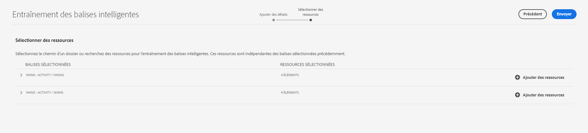

# Ajouter des balises intelligentes aux ressources dans AEM {#smart-tags-assets-aem}

<table>
    <tr>
        <td>
            <i>Nouveau</i> <a href="/help/assets/dynamic-media/dm-prime-ultimate.md"><b>Dynamic Media Prime et Ultimate</b></a>
        </td>
        <td>
            <i>Nouveau</i> <a href="/help/assets/assets-ultimate-overview.md"><b>AEM Assets Ultimate</b></a>
        </td>
        <td>
            <i>Nouvelle</i> <a href="/help/assets/integrate-aem-assets-edge-delivery-services.md"><b>Intégration d’AEM Assets à Edge Delivery Services</b></a>
        </td>
        <td>
            <i>Nouveau</i> <a href="/help/assets/aem-assets-view-ui-extensibility.md"><b>Extensibilité de l’interface utilisateur</b></a>
        </td>
          <td>
            <i>Nouveau</i> <a href="/help/assets/dynamic-media/enable-dynamic-media-prime-and-ultimate.md"><b>Activation de Dynamic Media Prime et Ultimate</b></a>
        </td>
    </tr>
    <tr>
        <td>
            <a href="/help/assets/search-best-practices.md"><b>Bonnes pratiques de recherche</b></a>
        </td>
        <td>
            <a href="/help/assets/metadata-best-practices.md"><b>Bonnes pratiques relatives aux métadonnées</b></a>
        </td>
        <td>
            <a href="/help/assets/product-overview.md"><b>Hub de contenus</b></a>
        </td>
        <td>
            <a href="/help/assets/dynamic-media-open-apis-overview.md"><b>Fonctionnalités Dynamic Media avec OpenAPI</b></a>
        </td>
        <td>
            <a href="https://developer.adobe.com/experience-cloud/experience-manager-apis/"><b>Documentation de développement pour AEM Assets</b></a>
        </td>
    </tr>
</table>

| Version | Lien de l’article |
| -------- | ---------------------------- |
| AEM 6.5 | [Cliquez ici](https://experienceleague.adobe.com/docs/experience-manager-65/assets/using/enhanced-smart-tags.html?lang=fr) |
| AEM as a Cloud Service | Cet article |

Les entreprises qui traitent des ressources numériques utilisent de plus en plus le vocabulaire contrôlé par taxonomie dans les métadonnées des ressources. Il s’agit essentiellement d’une liste des mots-clés que les employés, les partenaires et les clients utilisent fréquemment pour mentionner et rechercher des ressources numériques. Le balisage des ressources avec vocabulaire contrôlé par taxonomie permet de s’assurer qu’elles peuvent être facilement identifiées et récupérées dans des recherches.

Comparé aux vocabulaires des langages naturels, le balisage basé sur la taxonomie métier aide à aligner les ressources avec les activités d’une entreprise et à veiller à ce que les mieux adaptées apparaissent dans les recherches. Par exemple, un constructeur de voitures peut baliser les images de voitures avec les noms de modèles afin de n’afficher que les images appropriées lors de recherches servant à concevoir une campagne de promotion.

En arrière-plan, cette fonctionnalité utilise le cadre d’intelligence artificielle d’[Adobe Sensei](https://business.adobe.com/why-adobe/experience-cloud-artificial-intelligence.html) pour entraîner son algorithme de reconnaissance d’images par rapport à votre structure de balises et de votre taxonomie métier. Cette intelligence de contenu est ensuite utilisée pour appliquer les balises pertinentes sur un ensemble de ressources différentes. Par défaut, AEM applique automatiquement les balises intelligentes aux ressources chargées.

<!-- TBD: Create a flowchart for how training works in CS.
 
-->

## Types de ressources pris en charge pour les balises intelligentes dans AEM {#smart-tags-supported-file-formats}

Vous pouvez baliser les types de ressources suivants :

* **Images** : de nombreux formats d’images peuvent être balisés à l’aide du service de contenu dynamique Adobe Sensei. Vous [créez un modèle d’entraînement](#train-model), puis les images téléchargées sont automatiquement balisées. Les balises intelligentes sont appliquées aux types de fichiers pris en charge qui génèrent des rendus aux formats JPG et PNG.
* **Ressources textuelles** : [!DNL Experience Manager Assets] balise automatiquement les ressources textuelles compatibles lors du chargement.
* **Ressources vidéo** : le balisage vidéo est activé par défaut dans [!DNL Adobe Experience Manager] as a [!DNL Cloud Service]. [Les vidéos sont automatiquement balisées](/help/assets/smart-tags-video-assets.md) lorsque vous chargez de nouvelles vidéos ou que vous retraitez des vidéos existantes.

| Images (types MIME) | Ressources textuelles (formats de fichier) | Fichiers vidéo (formats et codecs de fichier) |
|----|-----|------|
| image/jpeg | CSV | MP4 (H264/AVC) |
| image/tiff | DOC | MKV (H264/AVC) |
| image/png | DOCX | MOV (H264/AVC, Motion JPEG) |
| image/bmp | HTML | AVI (indeo4) |
| image/gif | PDF | FLV (H264/AVC, vp6f) |
| image/pjpeg | PPT | WMV (WMV2) |
| image/x-portable-anymap | PPTX |  |
| image/x-portable-bitmap | RTF |  |
| image/x-portable-graymap | SRT |  |
| image/x-portable-pixmap | TXT |  |
| image/x-rgb | VTT |  |
| image/x-xbitmap | |  |
| image/x-xpixmap | |  |
| image/x-icon |  |  |
| image/photoshop |  |  |
| image/x-photoshop |  |  |
| image/psd |  |  |
| image/vnd.adobe.photoshop |  |  |

Par défaut, AEM ajoute automatiquement les balises intelligentes aux ressources textuelles et vidéo. Pour ajouter automatiquement des balises intelligentes aux images, suivez la procédure ci-dessous.

* [Comprendre les directives et les modèles relatifs aux balises](#understand-tag-models-guidelines).
* [Entraîner le modèle](#train-model).
* [Baliser vos ressources numériques](#tag-assets).
* [Gérer les balises et les recherches](#manage-smart-tags-and-searches).

## Comprendre les directives et les modèles relatifs aux balises {#understand-tag-models-guidelines}

Un modèle de balise est un groupe de balises connexes qui sont associées à divers aspects visuels des images balisées. Les balises sont liées aux différents aspects visuels des images, de sorte qu’une fois appliquées, les balises permettent de rechercher des types d’images spécifiques. Par exemple, une collection de chaussures peut avoir des balises différentes. Cependant, toutes les balises sont liées à des chaussures et peuvent appartenir au même modèle. Lorsqu’elles sont appliquées, les balises permettent de trouver différents types de chaussures, selon leur conception ou leur utilisation, par exemple. Pour comprendre la représentation du contenu d’un modèle d’entraînement dans [!DNL Experience Manager], imaginez un modèle d’entraînement comme une entité de niveau supérieur, composée d’un groupe de balises ajoutées manuellement et d’exemples d’images pour chaque balise. Chaque balise s’applique exclusivement à une image.

Avant de créer un modèle de balise et d’entraîner le service, identifiez un ensemble de balises uniques décrivant le mieux les objets contenus dans les images replacés dans le contexte de votre activité. Vérifiez que les ressources figurant dans la série sélectionnée sont conformes aux [instructions d’entraînement](#training-guidelines).

### Instructions d’entraînement {#training-guidelines}

Vérifiez que les images figurant dans la série de formation sont conformes aux instructions suivantes :

**Quantité et taille :** 10 images au minimum et 50 images au maximum par balise.

**Cohérence** : assurez-vous que les images pour la même balise sont visuellement similaires. Il est préférable d’ajouter les balises portant sur les mêmes aspects visuels (par exemple, un même type d’objet dans une image) dans un modèle de balise unique. Par exemple, il n’est pas recommandé de baliser ces images comme `my-party` (pour l’entraînement), car elles ne sont pas visuellement similaires.

**Couverture** : les images d’entraînement doivent être suffisamment variées. L’idée est de fournir quelques exemples raisonnablement différents pour apprendre à [!DNL Experience Manager] à se concentrer sur les bons éléments. Si vous appliquez la même balise sur des images visuellement différentes, incluez au moins cinq exemples de chaque type. Par exemple, pour la balise *mannequin-pose-tête-baissée*, incluez davantage d’images d’entraînement similaires à l’image mise en évidence ci-dessous pour que le service reconnaisse les images similaires avec plus de précision lors du balisage.

**Distraction/obstruction** : l’entraînement du service donne de meilleurs résultats sur les images qui ont moins de distractions (telles que des arrière-plans importants ou des objets/personnes sans lien avec le sujet principal). Par exemple, pour la balise *chaussure-décontractée*, la seconde image n’est pas un bon candidat pour l’entraînement.

**Complétude :** si une image est admissible pour plusieurs balises, ajoutez toutes les balises applicables avant d’inclure l’image à des fins de formation. Par exemple, pour les balises telles que *raincoat* et *model-side-view*, ajoutez les deux balises sur la ressource éligible avant de l’inclure pour la formation.

**Nombre de balises** : Adobe recommande d’entraîner un modèle à l’aide, au moins, de deux balises distinctes et 10 images différentes pour chaque balise. Dans un modèle de balise unique, n’ajoutez pas plus de 50 balises.

**Nombre d’exemples** : pour chaque balise, ajoutez au moins 10 exemples. Cependant, Adobe recommande environ 30 exemples. Pour chaque balise, 50 exemples au maximum sont pris en charge.

**Empêcher les faux positifs et les conflits** : Adobe recommande de créer un modèle de balise unique pour un aspect visuel donné. Organisez les modèles de balises de manière à éviter le chevauchement des balises entre les modèles. Par exemple, n’utilisez pas de balises communes comme `sneakers` dans deux noms de modèles de balises différents `shoes` et `footwear`. Le processus d’entraînement remplace un modèle de balise entraîné par l’autre en cas de mot-clé commun.

**Exemples** : voici d’autres exemples à titre de conseil :

* Créez un modèle de balise contenant uniquement :

   * des balises relatives à des modèles de voitures ;
   * des balises relatives aux vestes pour adultes et enfants.

* Ne créez pas :

   * un modèle de balise contenant des modèles de voitures commercialisés en 2019 et 2020 ;
   * plusieurs modèles de balises contenant ces mêmes modèles de voitures en nombre limité.

**Images utilisées pour l’entraînement** : vous pouvez utiliser les mêmes images pour entraîner différents modèles de balises. Cependant, ces modèles n’associent pas une image à plus d’une balise dans un modèle donné. Il est donc possible de baliser la même image avec des balises différentes appartenant à différents modèles.

Vous ne pouvez pas annuler l’entraînement. Les instructions ci-dessus doivent vous aider à choisir les bonnes images pour l’entraînement.

## Entraînement du modèle pour vos balises personnalisées {#train-model}

Pour créer et entraîner un modèle pour vos balises spécifiques à votre entreprise, procédez comme suit :

1. Créez les balises nécessaires et la structure de balise appropriée. Chargez les images appropriées dans le référentiel de gestion des ressources numériques (DAM).
1. Dans l’interface utilisateur d’[!DNL Experience Manager], accédez à **[!UICONTROL Ressources]** > **[!UICONTROL Entraînement des balises intelligentes]**.
1. Cliquez sur **[!UICONTROL Créer]**. Indiquez un **[!UICONTROL titre]** et une **[!UICONTROL description]**.
1. Cliquez sur l’icône de dossier dans le champ **[!UICONTROL Balises]**. Une fenêtre pop-up s’ouvre.
1. Recherchez ou sélectionnez les balises appropriées parmi les balises existantes dans `cq-tags` que vous souhaitez ajouter au modèle. Cliquez sur **[!UICONTROL Suivant]**.

   >[!NOTE]
   >
   >Vous pouvez trier la structure des balises par ordre croissant ou décroissant en fonction du **[!UICONTROL Nom]** (par ordre alphabétique), de la date de **[!UICONTROL Création]** ou de la date de **[!UICONTROL Modification]**.

1. Dans la boîte de dialogue **[!UICONTROL Sélectionner les ressources]**, cliquez sur **[!UICONTROL Ajouter les ressources]** pour chaque balise. Effectuez des recherches dans le référentiel de gestion des ressources numériques (DAM) ou parcourez le référentiel pour sélectionner au moins 10, et au plus 50 images. Sélectionnez les ressources et non le dossier. Une fois les images sélectionnées, cliquez sur **[!UICONTROL Sélectionner]**.

   

1. Pour avoir un aperçu des miniatures des images sélectionnées, cliquez sur l’accordéon situé face à une balise. Vous pouvez modifier votre sélection en cliquant sur **[!UICONTROL Ajouter les ressources]**. Une fois la sélection effectuée, cliquez sur **[!UICONTROL Envoyer]**. L’interface utilisateur affiche une notification au bas de la page indiquant que l’entraînement est lancé.
1. Vérifiez le statut de l’entraînement dans la colonne **[!UICONTROL Statut]** pour chaque modèle de balise. Les statuts possibles sont [!UICONTROL En Attente], [!UICONTROL Entraîné(s)] et [!UICONTROL Échec].

*Figure : Étapes du workflow d’entraînement du modèle de balisage.*

### Affichage du statut et du rapport d’entraînement {#training-status}

Pour vérifier que le service de balises intelligentes est entraîné sur vos balises dans la série de ressources d’entraînement, examinez le rapport de workflow d’entraînement dans la console Rapports.

1. Dans l’interface [!DNL Experience Manager], accédez à **[!UICONTROL Outils]** > **[!UICONTROL Ressources]** > **[!UICONTROL Rapports]**.
1. Dans la page **[!UICONTROL Rapports de ressources]**, cliquez sur **[!UICONTROL Créer]**.
1. Sélectionnez le rapport **[!UICONTROL Entraînement des balises intelligentes]**, puis cliquez sur **[!UICONTROL Suivant]** dans la barre d’outils.
1. Indiquez un titre et une description pour le rapport. Sous **[!UICONTROL Planifier le rapport]**, laissez l’option **[!UICONTROL Maintenant]** sélectionnée. Si vous souhaitez planifier le rapport pour une date ultérieure, sélectionnez **[!UICONTROL Plus tard]** et spécifiez une date et une heure. Ensuite, cliquez sur **[!UICONTROL Créer]** dans la barre d’outils.
1. Dans la page **[!UICONTROL Rapports de ressources]**, sélectionnez le rapport que vous avez généré. Pour afficher le rapport, cliquez sur **[!UICONTROL Afficher]** dans la barre d’outils.
1. Passez en revue les détails du rapport. Le rapport affiche le statut d’identification des balises que vous avez entraînées. La couleur verte de la colonne **[!UICONTROL Statut de l’entraînement]** indique que le service de balises intelligentes est entraîné pour la balise. La couleur jaune indique que le service n’est que partiellement entraîné pour une balise particulière. Pour entraîner complètement le service pour une balise, ajoutez d’autres images avec cette balise particulière et exécutez le workflow d’entraînement. Si vous ne voyez pas vos balises dans ce rapport, exécutez à nouveau le workflow d’entraînement pour ces balises.
1. Pour télécharger le rapport, sélectionnez-le dans la liste, puis cliquez sur **[!UICONTROL Télécharger]** dans la barre d’outils. Le rapport est téléchargé sous la forme d’une feuille de calcul.

<!--
### Tag assets from the workflow console {#tagging-assets-from-the-workflow-console}

1. In [!DNL Experience Manager] interface, go to **[!UICONTROL Tools]** > **[!UICONTROL Workflow]** > **[!UICONTROL Models]**.
1. From the **[!UICONTROL Workflow Models]** page, select the **[!UICONTROL DAM Smart Tags Assets]** workflow and then click **[!UICONTROL Start Workflow]** from the toolbar.

   

1. In the **[!UICONTROL Run Workflow]** dialog, browse to the payload folder containing assets on which you want to apply your tags automatically.
1. Specify a title for the workflow and an optional comment. Click **[!UICONTROL Run]**.

   

   *Figure: Navigate to the asset folder and review the tags to verify whether your assets are tagged properly. For details, see [manage smart tags](#manage-smart-tags-and-searches).*

### Tag assets from the timeline {#tagging-assets-from-the-timeline}

1. From the [!DNL Assets] user interface, select the folder containing assets or specific assets to which you want to apply smart tags.
1. From upper-left corner, open the **[!UICONTROL Timeline]**.
1. Open actions from the bottom of the left sidebar and click **[!UICONTROL Start Workflow]**.

   

1. Select the **[!UICONTROL DAM Smart Tag Assets]** workflow, and specify a title for the workflow.
1. Click **[!UICONTROL Start]**. The workflow applies your tags on assets. Navigate to the asset folder and review the tags to verify that your assets are tagged properly. For details, see [manage smart tags](#manage-smart-tags-and-searches).

>[!NOTE]
>
>In the subsequent tagging cycles, only the modified assets are tagged again with newly trained tags. However, even unaltered assets are tagged if the gap between the last and current tagging cycles for the tagging workflow exceeds 24 hours. For periodic tagging workflows, unaltered assets are tagged when the time gap exceeds six months.

### Tag uploaded assets {#tag-uploaded-assets}

[!DNL Experience Manager] can automatically tag the assets that users upload to DAM. To do so, administrators configure a workflow to add an available step that tags assets. See [how to enable Smart Tags for uploaded assets](/help/assets/smart-tags-configuration.md#enable-smart-tagging-for-uploaded-assets).
-->

## Balisage de ressources à l’aide de balises intelligentes dans AEM {#tag-assets}

Tous les types de ressources pris en charge sont automatiquement balisés par [!DNL Experience Manager Assets] lors du chargement. Le balisage est activé et fonctionne, par défaut. AEM applique les balises intelligentes appropriées en temps quasi réel. <!-- TBD: You can also apply the tagging workflow on-demand. The workflow applies to both, assets and folders. -->

* Pour les images et les vidéos, les balises intelligentes sont basées sur certains aspects visuels.

* Pour les ressources à base de texte, l’efficacité des balises intelligentes ne dépend pas de la quantité de texte contenu dans la ressource, mais des mots-clés ou entités pertinents présents dans le texte de la ressource. Pour les ressources textuelles, les balises intelligentes sont les mots-clés qui apparaissent dans le texte, sans être nécessairement ceux qui décrivent le mieux la ressource. Pour les ressources prises en charge, [!DNL Experience Manager] extrait déjà le texte, qui est ensuite indexé et utilisé pour la recherche des ressources. Cependant, les balises intelligentes basées sur des mots-clés dans le texte fournissent une facette de recherche dédiée, structurée et de priorité supérieure. Cette dernière permet d’améliorer la découverte de ressources par rapport à un index de recherche.

## Gestion des balises intelligentes et des recherches de ressources {#manage-smart-tags-and-searches}

Vous pouvez organiser les balises intelligentes pour supprimer toute balise non pertinente qui pourrait avoir été attribuée à vos ressources de marque, afin que seules les balises les plus pertinentes s’affichent.

La modération de balises intelligentes contribue également à affiner les résultats des recherches de ressources basées sur des balises, en garantissant que vos ressources apparaissent dans les résultats de la recherche pour les balises les plus pertinentes. Essentiellement, cela réduit les risques que des ressources non pertinentes apparaissent dans les résultats de la recherche.

Vous pouvez également attribuer un rang supérieur à une balise pour accroître sa pertinence pour la ressource. La promotion d’une balise pour une ressource augmente les risques qu’une ressource apparaisse dans les résultats de la recherche lorsqu’une recherche est basée sur cette balise.

Pour modérer les balises intelligentes de vos ressources numériques :

1. Dans le champ de recherche, recherchez des ressources numériques en fonction d’une balise.

1. Pour identifier les ressources numériques que vous ne trouvez pas pertinentes pour votre recherche, examinez les résultats de la recherche.

1. Sélectionnez une ressource, puis cliquez sur l’icône  dans la barre d’outils.

1. Examinez les balises sur la page **[!UICONTROL Gérer les balises]**. Si vous ne souhaitez pas que la recherche de la ressource repose sur une balise spécifique, sélectionnez la balise et sélectionnez  dans la barre d’outils. Vous pouvez également sélectionner le symbole `X` en regard de l’étiquette.

1. Pour attribuer un rang supérieur à une balise, sélectionnez-la, puis cliquez sur l’icône  de la barre d’outils. La balise objet d’une conversion est déplacée dans la section **[!UICONTROL Balises]**.

1. Sélectionnez **[!UICONTROL Enregistrer]** puis **[!UICONTROL OK]** pour fermer la boîte de dialogue [!UICONTROL Succès].

1. Accédez à la page [!UICONTROL Propriétés] de la ressource. Remarquez que la balise que vous avez convertie se voit attribuer une pertinence élevée et apparaît donc plus haut dans les résultats de la recherche.

### Comprendre les résultats de recherche [!DNL Experience Manager] avec les balises intelligentes {#understand-search}

Par défaut, la recherche [!DNL Experience Manager] associe les termes de recherche avec une clause `AND`. L’utilisation de balises intelligentes ne modifie pas ce comportement par défaut. Elle ajoute une clause `OR` pour trouver l’un des termes de recherche dans les balises intelligentes. Par exemple, pour la recherche de `woman running`. Les ressources avec les mots-clés `woman` ou `running` uniquement dans les métadonnées n’apparaissent pas dans les résultats de recherche par défaut. Toutefois, une ressource balisée avec `woman` ou `running` à l’aide de balises intelligentes apparaît dans une telle requête de recherche. Les résultats de la recherche sont donc une combinaison de :

* ressources avec les mots-clés `woman` et `running` dans les métadonnées ;

* ressources dotées de balises dynamiques avec l’un des mots-clés.

Les résultats de recherche qui correspondent à tous les termes de recherche dans les champs de métadonnées s’affichent en premier, suivis des résultats de recherche correspondant à l’un des termes de recherche dans les balises intelligentes. Dans l’exemple ci-dessus, l’ordre approximatif d’affichage des résultats de recherche est le suivant :

1. correspondances de `woman running` dans les différents champs de métadonnées.
1. correspondances de `woman running` dans les balises intelligentes.
1. correspondances de `woman` ou de `running` dans les balises intelligentes.

## Restrictions et bonnes pratiques relatives au balisage {#limitations}

Le balisage intelligent amélioré est basé sur des modèles d’apprentissage d’images et de leurs balises. Ces modèles ne sont pas toujours parfaits pour identifier les balises. La version actuelle des balises intelligentes présente les limites suivantes :

* Impossibilité d’identifier des différences subtiles dans les images. Par exemple, les chemises cintrées par rapport aux chemises à coupe normale.
* Impossibilité d’identifier des balises basées sur des motifs ou des éléments minuscules d’une image. Par exemple, des logos sur des chemises.
* Le balisage est disponible dans les langues prises en charge par [!DNL Experience Manager]. 
* Les balises qui ne sont pas gérées se rapportent aux éléments suivants :

   * Aspects non visuels et abstraits. Par exemple, l’année ou la saison de la sortie d’un produit, l’humeur ou l’émotion suscitées par une image, une connotation subjective d’une vidéo ;
   * à des différences visuelles fines pour des produits tels que des chemises avec ou sans col, ou de petits logos incorporés sur des produits.

Pour entraîner le modèle, utilisez les images les plus appropriées. L’entraînement ne peut pas être annulé ou le modèle d’entraînement ne peut pas être supprimé. La précision de votre balisage dépend de l’entraînement en cours. Il doit donc être effectué soigneusement.

<!-- TBD: Add limitations related to text files. -->

Pour rechercher des fichiers à l’aide de balises intelligentes (standard ou améliorées), utilisez la recherche en texte intégral d’[!DNL Assets]. Il n’y a aucun prédicat de recherche distinct pour les balises intelligentes.

>[!NOTE]
>
>La capacité des balises intelligentes à s’entraîner à partir de vos balises et à les appliquer à d’autres images dépend de la qualité des images que vous utilisez pour l’entraînement.
>Pour obtenir des résultats optimaux, Adobe recommande d’utiliser des images visuellement similaires afin d’entraîner le service pour chaque balise.

**Voir également**

* [Traduire les ressources](translate-assets.md)
* [API HTTP Assets](mac-api-assets.md)
* [Formats de fichiers pris en charge par Assets](file-format-support.md)
* [Rechercher des ressources](search-assets.md)
* [Ressources connectées](use-assets-across-connected-assets-instances.md)
* [Rapports de ressources](asset-reports.md)
* [Schémas de métadonnées](metadata-schemas.md)
* [Télécharger des ressources](download-assets-from-aem.md)
* [Gestion des métadonnées](manage-metadata.md)
* [Facettes de recherche](search-facets.md)
* [Gérer les collections](manage-collections.md)
* [Import des métadonnées en bloc](metadata-import-export.md)
* [Publier des ressources sur AEM et Dynamic Media](/help/assets/publish-assets-to-aem-and-dm.md)

>[!MORELIKETHIS]
>
>* [Comprendre comment les balises intelligentes facilitent la gestion des fichiers numériques](https://medium.com/adobetech/efficient-asset-management-with-enhanced-smart-tags-887bd47dbb3f)
>* [Utilisation des balises intelligentes pour les vidéos](smart-tags-video-assets.md)
