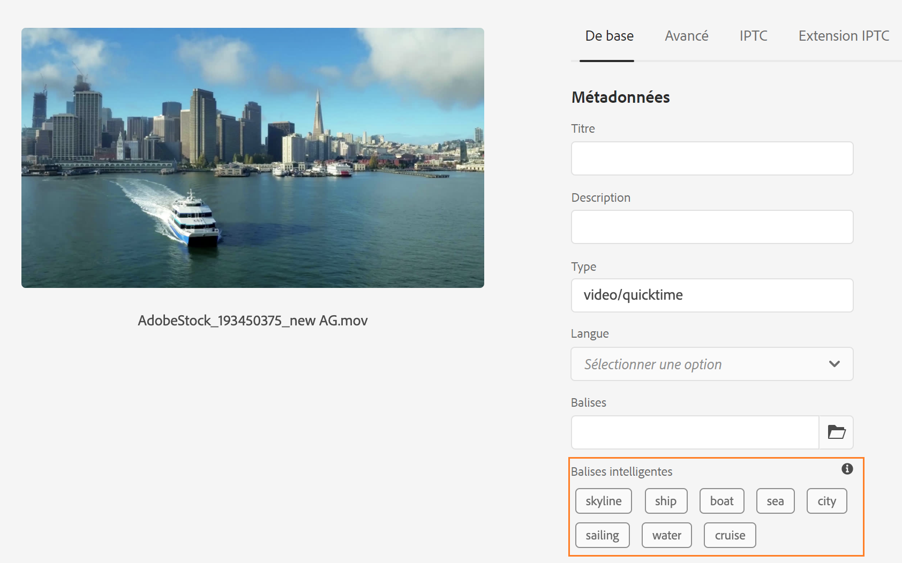
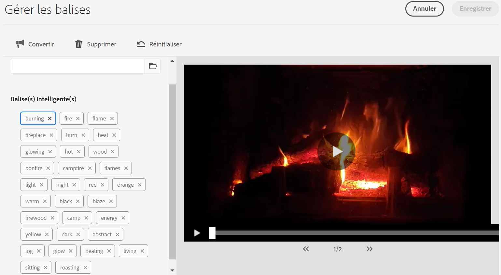

# Balises intelligentes pour AEM Assets {#using-smart-tags}

Les entreprises possèdent de nombreuses ressources numériques, et ce nombre continue de croître rapidement. La recherche d’une ressource spécifique au milieu d’une telle quantité de données représente un défi de taille. Pour résoudre ce problème, `metadata` et `tags` sont utilisés pour améliorer la capacité de recherche des ressources numériques. Les entreprises utilisent des vocabulaires contrôlés par taxonomie dans les métadonnées des ressources. Il s’agit généralement de listes de mots-clés que les employés, les partenaires et les clients utilisent couramment pour se référer à et localiser les ressources numériques.

Les balises intelligentes sont des mots-clés qui non seulement apparaissent dans le texte, mais qui décrivent également le mieux la ressource. Le balisage des ressources avec vocabulaire contrôlé par taxonomie permet de s’assurer qu’elles peuvent être facilement identifiées et récupérées par le biais de la recherche.

Par exemple, les mots disposés par ordre alphabétique dans un dictionnaire sont plus faciles à trouver que les mots dispersés de manière aléatoire. Le balisage a un objectif similaire. Il organise les ressources en fonction de la taxonomie métier, en veillant à ce que les plus pertinentes apparaissent dans les résultats de recherche. Par exemple, un constructeur de voitures peut baliser les images de voitures avec les noms de modèle, de sorte que seules les images appropriées soient affichées lors de la conception d’une campagne promotionnelle. Qu’il s’agisse de baliser « runners » ou « running chaussures », les utilisateurs n’ont pas à se soucier des fautes de frappe, des variations d’orthographe ou d’autres termes de recherche ; les balises intelligentes les reconnaissent toutes.

En arrière-plan, la fonctionnalité utilise le framework d’intelligence artificielle d’[Adobe Sensei](https://business.adobe.com/products/sensei/adobe-sensei.html) applique automatiquement les balises intelligentes aux ressources chargées, par défaut, avec le texte aligné sur la taxonomie métier.

## Conditions préalables et configuration {#smart-tags-prereqs-config}

Les balises intelligentes sont automatiquement configurées pour [!DNL Adobe Experience Manager] en tant que [!DNL Cloud Service] et aucune configuration n’est donc requise.

## Workflow des balises intelligentes {#smart-tags-workflow}

Le balisage intelligent optimisé par [!DNL Adobe Sensei] utilise des modèles d’intelligence artificielle pour analyser le contenu et ajouter des balises aux ressources. Cela permet aux utilisateurs de la gestion des ressources numériques de réduire le temps nécessaire pour fournir des expériences enrichies à leurs clients. Les balises intelligentes sont affichées dans l’ordre décroissant de leur [score de confiance](#confidence-score) dans les propriétés de la ressource.

* **Ressources basées sur des images**
Pour les images, les balises intelligentes sont basées sur certains aspects visuels. Dans de nombreux formats, les images sont balisées à l’aide des services de contenu dynamique. Les balises intelligentes sont appliquées aux [types de fichiers pris en charge](#supported-file-formats) qui génèrent des rendus au format JPG et PNG.

  <!-- -->

* **Ressources vidéo**
Pour les ressources vidéo, le balisage est activé par défaut dans [!DNL Adobe Experience Manager] as a [!DNL Cloud Service]. De même que les balises d’image et de texte, les vidéos sont également automatiquement balisées lorsque vous chargez de nouvelles vidéos ou que vous retraitez des vidéos existantes. [!DNL Adobe Sensei] génère deux ensembles de balises pour une vidéo : l’un correspond aux objets, aux scènes et aux attributs de cette vidéo, tandis que l’autre correspond à des actions telles que boire, courir et faire du jogging. Cochez également la case [exclure le balisage intelligent des vidéos](#opt-out-video-smart-tagging).

* **Ressources textuelles**
Pour les ressources prises en charge, [!DNL Experience Manager] extrait déjà le texte, qui est ensuite indexé et utilisé pour rechercher les ressources. Cependant, les balises intelligentes basées sur des mots-clés dans le texte fournissent une facette de recherche dédiée, structurée et de priorité supérieure. Cette dernière permet d’améliorer la découverte de ressources par rapport à un index de recherche.
Pour les ressources à base de texte, l’efficacité des balises intelligentes ne dépend pas de la quantité de texte contenu dans la ressource, mais des mots-clés ou entités pertinents présents dans le texte de la ressource.

  

Les balises intelligentes sont implémentées dans AEM Assets à l’aide du workflow suivant :

1. Création ou chargement d’une ressource dans AEM. Des balises prêtes à l’emploi sont générées pour les Assets basées sur des images, des vidéos et du texte.

1. Si vous constatez que des balises spécifiques ne sont pas générées, vous pouvez entraîner vos balises de type image en conséquence. Pour plus d&#39;informations, consultez la section [Entraînement des balises intelligentes](#smart-tags-training.md).

## Formats de fichiers pris en charge pour les balises intelligentes {#supported-file-formats}

| Images (types MIME) | Ressources textuelles (formats de fichier) | Fichiers vidéo (formats et codecs de fichier) |
|----|-----|------|
| image/jpeg | CSV | MP4 (H264/AVC) |
| image/tiff | DOC | MKV (H264/AVC) |
| image/png | DOCX | MOV (H264/AVC, Motion JPEG) |
| image/bmp | HTML | AVI (indeo4) |
| image/gif | PDF | FLV (H264/AVC, vp6f) |
| image/pjpeg | PPT | WMV (WMV2) |
| image/x-portable-anymap | PPTX |  |
| image/x-portable-bitmap | RTF |  |
| image/x-portable-graymap | SRT |  |
| image/x-portable-pixmap | TXT |  |
| image/x-rgb | VTT |  |
| image/x-xbitmap | |  |
| image/x-xpixmap | |  |
| image/x-icon |  |  |
| image/photoshop |  |  |
| image/x-photoshop |  |  |
| image/psd |  |  |
| image/vnd.adobe.photoshop |  |  |

## Préparation d’une ressource pour le balisage intelligent prêt à l’emploi

Lorsque vous [chargez des ressources](add-assets.md#upload-assets) vers [!DNL Adobe Experience Manager] as a [!DNL Cloud Service], les ressources chargées sont traitées. Une fois le traitement terminé, observez l’onglet [!UICONTROL Simple] de la page [!UICONTROL Propriétés] de la ressource. Les balises intelligentes sont automatiquement ajoutées aux ressources sous [!UICONTROL  Balises intelligentes ]. Les microservices de ressources utilisent [!DNL Adobe Sensei] pour créer ces balises intelligentes.



<!--
The applied smart tags are sorted in descending order of [confidence score](#confidence-score), combined for object and action tags, within [!UICONTROL Smart Tags].
-->

>[!IMPORTANT]
>
>Il est conseillé de revoir ces balises générées automatiquement pour vous assurer qu’elles sont conformes à votre marque et à ses valeurs.

## Assets non balisé dans la gestion des ressources numériques (DAM) {#smart-tag-existing-assets}

Les ressources existantes ou plus anciennes de la gestion des ressources numériques ne sont pas automatiquement balisées intelligemment. Vous devez [Retraiter](https://experienceleague.adobe.com/docs/experience-manager-cloud-service/content/assets/admin/about-image-video-profiles.html?lang=en#adjusting-load) Assets manuellement pour générer des balises intelligentes pour eux. Une fois le processus terminé, accédez à la page [!UICONTROL Propriétés] de n’importe quelle ressource du dossier. Les balises ajoutées automatiquement sont affichées dans la section [!UICONTROL Balises intelligentes] de l’onglet [!UICONTROL Simple]. Ces balises intelligentes appliquées sont triées par ordre décroissant de [score de confiance](#confidence-score).

<!--
To smart tag assets, or folders (including subfolders) of assets that exist in assets repository, follow these steps:

1. Select the [!DNL Adobe Experience Manager] logo and then select assets from the [!UICONTROL Navigation] page.

1. Select [!UICONTROL Files] to display the Assets interface.

1. Navigate to the folder to which you want to apply Smart Tags.

1. Select the assets and click  [!UICONTROL Reprocess Assets] icon and select the [!UICONTROL Full Process] option.

-->

## Score de confiance {#confidence-score}

Les résultats de la recherche de ressources sont classés en fonction des scores de confiance, ce qui améliore généralement ces résultats au-delà de ce qu’une inspection des balises affectées aux ressources suggère. Les balises inexactes présentent souvent des scores de confiance faibles, de sorte qu’elles apparaissent rarement en haut de la liste des balises intelligentes pour les ressources.
<!--
[!DNL Adobe Experience Manager] as a [!DNL Cloud Service] applies a minimum confidence threshold for object and action-smart tags to avoid having too many tags for each asset, which slows down indexing. 

The default threshold for action and object tags in [!DNL Adobe Experience Manager] for an image is 0.5 and for video it is 0.7 (should be value from 0 through 1). If some assets are not tagged by a specific tag, then it indicates that the algorithm is less than 70% confident in the predicted tags. The default threshold might not always be optimal for all the users. You can, therefore, change the confidence score value in OSGI configuration.

To add the confidence score OSGI configuration to the project deployed to [!DNL Adobe Experience Manager] as a [!DNL Cloud Service] through [!DNL Cloud Manager]:

In the [!DNL Adobe Experience Manager] project (`ui.config` since Archetype 24, or previously `ui.apps`) the `config.author` OSGi configuration, include a config file named `com.adobe.cq.assetcompute.impl.senseisdk.SenseiSdkImpl.cfg.json` with the following contents:

```json
{
  "minVideoActionConfidenceScore":0.5,
  "minVideoObjectConfidenceScore":0.5,
}
```
-->

>[!NOTE]
>
>Les balises manuelles se voient attribuer un degré de confiance égal à 100 % (fiabilité maximale). Par conséquent, si des ressources dont les balises manuelles correspondent à la requête de recherche existent, elles sont affichées avant les balises intelligentes correspondant à la requête de recherche.

## Modération des balises intelligentes {#moderate-smart-tags}

[!DNL Adobe Experience Manager] as a [!DNL Cloud Service] vous permet de traiter les balises intelligentes pour :

* supprimez les balises inexactes affectées à vos ressources de marque.

* affinez les recherches de ressources basées sur les balises en vous assurant que votre ressource apparaît dans les résultats de recherche pour les balises les plus pertinentes. Par conséquent, cela élimine les chances que des ressources non liées s’affichent dans les résultats de recherche.

* attribuez un rang supérieur à une balise pour augmenter son degré de pertinence par rapport à une ressource. La promotion d’une balise pour une ressource augmente les chances qu’une ressource particulière apparaisse dans les résultats de recherche lorsqu’une recherche est basée sur cette balise.

Pour en savoir plus sur la manière de modérer les balises intelligentes pour les ressources, consultez [Gestion des balises intelligentes](smart-tags.md#manage-smart-tags-and-searches).



>[!NOTE]
>
>Les balises modérées à l’aide des étapes de la procédure [Gérer les balises intelligentes](smart-tags.md#manage-smart-tags-and-searches) ne sont pas mémorisées lors du retraitement de la ressource. Les jeux de balises d’origine s’affichent à nouveau.

## Gestion des balises intelligentes et des recherches de ressources {#manage-smart-tags-and-searches}

Vous pouvez traiter les balises intelligentes pour supprimer toutes les balises inexactes qui ont pu être affectées aux ressources de votre marque, de sorte que seules les balises les plus pertinentes s’affichent.

La modération des balises intelligentes permet également d’affiner les recherches de ressources basées sur les balises en veillant à ce que vos ressources apparaissent dans les résultats de recherche pour les balises les plus pertinentes. Essentiellement, cela réduit les risques que des ressources non pertinentes apparaissent dans les résultats de la recherche.

Vous pouvez également attribuer un rang supérieur à une balise pour accroître sa pertinence pour la ressource. La promotion d’une balise pour une ressource augmente les risques qu’une ressource apparaisse dans les résultats de la recherche lorsqu’une recherche est basée sur cette balise.

Pour modérer les balises intelligentes de vos ressources numériques :

1. Dans le champ de recherche, recherchez des ressources numériques en fonction d’une balise.

1. Pour identifier les ressources numériques que vous ne trouvez pas pertinentes pour votre recherche, examinez les résultats de la recherche.

1. Sélectionnez une ressource, puis cliquez sur l’icône  dans la barre d’outils.

1. Examinez les balises sur la page **[!UICONTROL Gérer les balises]**. Si vous ne souhaitez pas que la recherche de la ressource repose sur une balise spécifique, sélectionnez la balise et sélectionnez  dans la barre d’outils. Vous pouvez également sélectionner  en regard du libellé.

1. Pour attribuer un rang supérieur à une balise, sélectionnez-la, puis cliquez sur l’icône  de la barre d’outils. La balise objet d’une conversion est déplacée dans la section **[!UICONTROL Balises]**.

1. Sélectionnez **[!UICONTROL Enregistrer]** puis **[!UICONTROL OK]** pour fermer la boîte de dialogue [!UICONTROL Succès].

1. Accédez à la page [!UICONTROL Propriétés] de la ressource. Notez que la balise que vous avez convertie se voit attribuer une pertinence élevée et, par conséquent, apparaît plus haut dans les résultats de recherche.

### Comprendre [!DNL Experience Manager] résultats de recherche avec les balises intelligentes {#understand-search}

Par défaut, [!DNL Experience Manager] associe les termes de recherche avec une clause `AND` ou `OR` pour rechercher l’un des termes de recherche dans les balises intelligentes appliquées. L’utilisation de balises intelligentes ne modifie pas ce comportement par défaut. Par exemple, pour la recherche de `woman running`. Les ressources avec les mots-clés `woman` ou `running` uniquement dans les métadonnées n’apparaissent pas dans les résultats de recherche par défaut. Cependant, une ressource balisée avec `woman` ou `running` à l’aide de balises intelligentes apparaît dans une telle requête de recherche. Les résultats de la recherche sont donc une combinaison de :

* ressources avec les mots-clés `woman` et `running` dans les métadonnées ;

* Ressources dotées de balises intelligentes avec l’un des mots-clés.

Les résultats de recherche qui correspondent à tous les termes de recherche dans les champs de métadonnées s’affichent en premier, suivis des résultats de recherche correspondant à l’un des termes de recherche dans les balises intelligentes. Dans l’exemple ci-dessus, l’ordre approximatif d’affichage des résultats de recherche est le suivant :

1. correspondances de `woman running` dans les différents champs de métadonnées.
1. correspond à `woman running` dans les balises intelligentes.
1. correspondances de `woman` ou de `running` dans les balises intelligentes.

## Exclusion (opt-out) du balisage intelligent {#opt-out-smart-tagging}

Comme le balisage automatisé des ressources s’exécute en parallèle d’autres tâches de traitement des ressources telles que la création de miniatures et l’extraction de métadonnées, cela peut prendre du temps. Pour accélérer le traitement des ressources, vous pouvez exclure le balisage intelligent lors du chargement au niveau du dossier. Pour exclure la génération automatisée de balises intelligentes pour les ressources chargées dans un dossier spécifique :

1. Ouvrez l’onglet [!UICONTROL Traitement des ressources] dans le dossier [!UICONTROL Propriétés].
1. Dans le menu [!UICONTROL  Balises intelligentes pour les vidéos ], par exemple, l’option [!UICONTROL Hérité] est sélectionnée par défaut et la balise intelligente de vidéo est activée.

   Lorsque l’option [!UICONTROL Hérité] est sélectionnée, le chemin d’accès au dossier hérité est également visible avec les informations indiquant s’il est défini sur [!UICONTROL Activer] ou [!UICONTROL Désactiver].

   

1. Sélectionnez [!UICONTROL Désactiver] pour exclure le balisage intelligent chargé dans le dossier.

1. De même, vous pouvez exclure le balisage intelligent pour [!UICONTROL Balises intelligentes pour le texte], [!UICONTROL Balises intelligentes pour l’image] et [!UICONTROL Balises de couleurs pour les images].

>[!IMPORTANT]
>
>Si vous avez choisi de ne pas baliser un dossier au moment du chargement et souhaitez baliser intelligemment le après le chargement, **[!UICONTROL Activer les balises intelligentes]** dans l’onglet [!UICONTROL Traitement des ressources] du dossier [!UICONTROL Propriétés] et utilisez l’option [[!UICONTROL Retraiter les ressources] ](#smart-tag-existing-assets) pour ajouter des balises intelligentes aux ressources.

<!--
## Benefits of Smart Tags to your assets {#benefits-of-smart-tags}

Following are the benefits of using Smart Tags in your AEM Assets:
*  Makes an asset searchable.
*  Smart Tags are generated automatically to your assets, thus, it minimizes your effort to perform tagging manually.
*  It allows the usage of the same vocabulary, tag structure, and taxonomy so that you need not to worry about tagging if by chance you miss tagging at first.
*  Whether you are tagging "runners" or "running" shoes, you do not need to worry about typos, wrong spellings, or alternative search terms as Smart Tags know it already!
*  Helps your assets to become organized and categorized.
-->

## Restrictions et bonnes pratiques relatives aux balises intelligentes {#limitations-best-practices-smart-tags}

Ces modèles ne sont pas toujours parfaits pour identifier les balises. La version actuelle des balises intelligentes présente les limites suivantes :

* Impossibilité d’identifier des différences subtiles dans les images. Par exemple, les chemises cintrées par rapport aux chemises à coupe normale.
* Impossibilité d’identifier des balises basées sur des motifs ou des éléments minuscules d’une image. Par exemple, des logos sur des chemises.
* Les balises qui ne sont pas gérées se rapportent aux éléments suivants :

   * Aspects non visuels et abstraits. Par exemple, l’année ou la saison de la sortie d’un produit, l’humeur ou l’émotion suscitées par une image et une connotation subjective d’une vidéo.
   * à des différences visuelles fines pour des produits tels que des chemises avec ou sans col, ou de petits logos incorporés sur des produits.

* Seules les vidéos d’une taille de fichier de moins de 300 Mo sont balisées automatiquement. Le service [!DNL Adobe Sensei] ignore les fichiers vidéo de plus grande taille.
* Pour rechercher des fichiers à l’aide de balises intelligentes (standard ou améliorées), utilisez la recherche en texte intégral d’[!DNL Assets]. Il n’existe aucun prédicat de recherche distinct pour les balises intelligentes.
* Par rapport aux balises générales, les ressources balisées à l’aide de la taxonomie métier sont plus faciles à identifier et à récupérer au moyen de recherches sur les balises.

## Questions fréquentes{#faq-smart-tags}

+++**Comment les balises intelligentes améliorent-elles l’expérience de recherche d’une ressource ?**

[!DNL Adobe] Sensei balise automatiquement les ressources une fois que vous les avez chargées. Le processus automatisé s’exécute si rapidement sur le serveur principal que vous verrez des balises ajoutées à vos ressources quelques secondes après la fin du chargement.

+++

+++**Que se passe-t-il si la liste des balises intelligentes est inexacte ou affiche une balise indésirable ?**

Une balise inexacte ou indésirable peut être supprimée de la liste. Par exemple, en tant que concessionnaire automobile, vous pouvez vouloir supprimer la balise « endommagé » de la liste.

+++

+++**Comment définir la priorité des ressources contenant les mêmes balises ?**

Oui, vous pouvez donner la priorité aux ressources contenant les mêmes balises. Vous pouvez promouvoir une balise dans la liste des balises intelligentes d’une ressource pour établir des priorités. La promotion d’une balise vous permet de donner la priorité aux images apparaissant dans les résultats de recherche pour cette balise spécifique.

+++

+++**L’application des balises intelligentes est-elle limitée à un dossier particulier ?**

Les balises intelligentes sont configurables et peuvent être appliquées à n’importe quel dossier dans la gestion des ressources numériques.

+++

+++**Comment savoir que le balisage requiert une formation ?**

Pour plus d&#39;informations, consultez la section [Détermination des exigences de l’entraînement des balises intelligentes](#smart-tags-training.md#smart-tag-training-requirement).

+++

+++**Quels sont les formats de fichiers pris en charge pour le balisage d’une ressource ?**

Pour plus d&#39;informations, consultez la section [Formats de fichiers pris en charge](#supported-file-formats).

+++

+++**Dans quelle langue les balises intelligentes sont-elles générées ?**

Les balises intelligentes sont générées uniquement en anglais. Ils peuvent être traduits dans d’autres langues en traduisant l’ensemble de la ressource, y compris les métadonnées.

+++

+++**Je ne souhaite plus utiliser le balisage intelligent.**

Vous pouvez [exclure le balisage intelligent](#opt-out-smart-tagging) à tout moment si vous souhaitez arrêter.

+++
